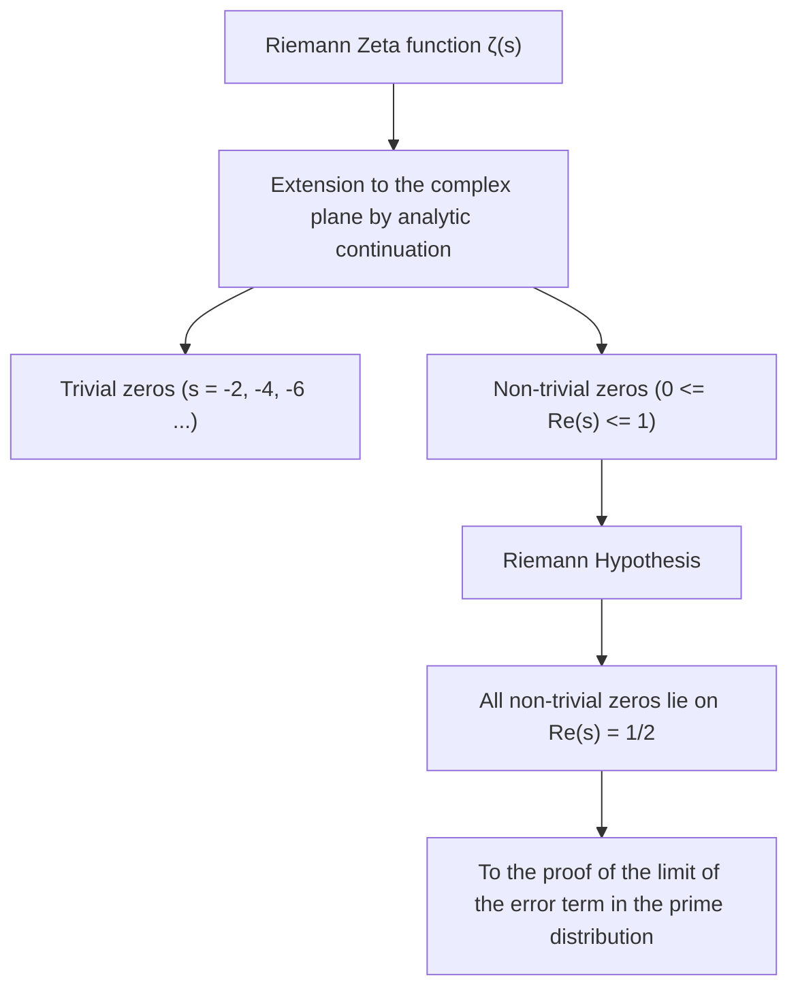
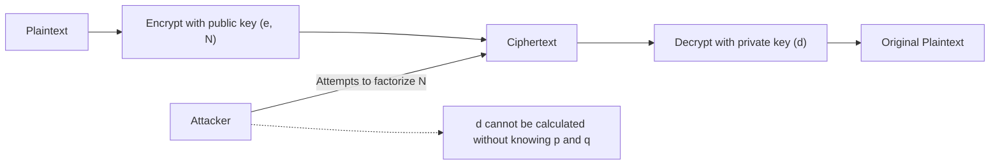
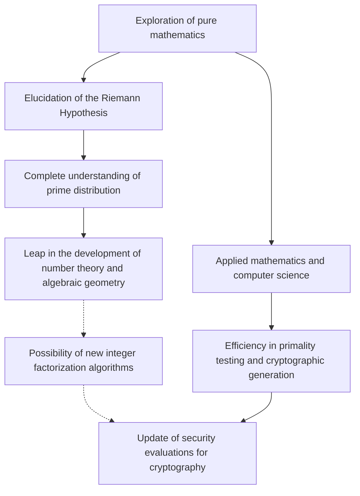

# 1. Introduction: The Mystery of the Universe in Prime Numbers and the Riemann Hypothesis

"Prime Numbers" are natural numbers divisible only by 1 and themselves, often called the "atoms" in the world of mathematics. The sequence of 2, 3, 5, 7, 11, 13... appears at first glance to be unordered and random. Ever since the ancient Greek mathematician Euclid proved that "there are infinitely many prime numbers," countless mathematicians have challenged themselves to unravel the regularity hidden in the arrangement of these primes.

The closest anyone has come to the mystery of prime numbers is the **"Riemann Hypothesis"** proposed by the German mathematician Bernhard Riemann in 1859. The Riemann Hypothesis is one of the most important and unsolved difficult problems in modern mathematics, and carries a $1 million prize as one of the Millennium Prize Problems designated by the Clay Mathematics Institute.

At first glance, a difficult problem in pure mathematics regarding the distribution of prime numbers may seem unrelated to our daily lives. However, internet security, which supports the infrastructure of modern society, especially **modern cryptographic technologies such as RSA cryptography and Elliptic Curve Cryptography (ECC)**, relies deeply on the properties of gigantic prime numbers.

In this article, we will embark on a mathematical journey from the distribution of prime numbers to the Prime Number Theorem, the Riemann Zeta function, and the core of the Riemann Hypothesis. We will provide an extremely detailed and deep explanation of how it is connected to modern cryptography and what would happen to the world if the Riemann Hypothesis were proven.

---

# 2. The Prime Number Theorem and the Distribution of Primes: Gauss's Discovery

To understand how prime numbers are distributed, mathematicians considered the **Prime-counting function** $\pi(x)$, which represents "how many prime numbers exist up to a certain number $x$."

For example:
- $\pi(10) = 4$ (2, 3, 5, 7)
- $\pi(100) = 25$
- $\pi(1000) = 168$

The 15-year-old genius mathematician Carl Friedrich Gauss calculated vast tables of prime numbers and discovered that the frequency of appearance of prime numbers decreases in inverse proportion to the natural logarithm $\ln x$. That is, he conjectured that the probability of finding a prime number near a certain number $x$ is approximately $\frac{1}{\ln x}$.

Expressing this using integration gives the **Logarithmic integral** $\text{Li}(x)$:

$$ \text{Li}(x) = \int_{2}^{x} \frac{dt}{\ln t} $$

Gauss's conjecture was later independently proven in 1896 by Jacques Hadamard and Charles Jean de la Vallée Poussin, and was established as the **Prime Number Theorem (PNT)**.

$$ \lim_{x \to \infty} \frac{\pi(x)}{\text{Li}(x)} = 1 $$

Or, it can be approximately expressed as follows:

$$ \pi(x) \sim \frac{x}{\ln x} $$

Through this theorem, it became clear that prime numbers have a very smooth and predictable distribution when viewed macroscopically. However, microscopically, there is always an "error" or "fluctuation" between $\pi(x)$ and $\text{Li}(x)$. The true nature of this fluctuation is exactly the greatest mystery that the Riemann Hypothesis attempts to unravel.

---

# 3. The Riemann Zeta Function and the Euler Product

The most powerful weapon for analyzing the distribution of prime numbers is the **Riemann Zeta Function**. Originally, it was an infinite series defined by Leonhard Euler for real numbers $s > 1$.

$$ \zeta(s) = \sum_{n=1}^\infty \frac{1}{n^s} = 1 + \frac{1}{2^s} + \frac{1}{3^s} + \frac{1}{4^s} + \dots $$

One of Euler's greatest achievements was proving that this infinite series can be expressed as an infinite product over all prime numbers $p$. This is the **Euler Product Formula**.

$$ \zeta(s) = \prod_{p \text{ prime}} \frac{1}{1 - p^{-s}} = \left( \frac{1}{1 - 2^{-s}} \right) \left( \frac{1}{1 - 3^{-s}} \right) \left( \frac{1}{1 - 5^{-s}} \right) \dots $$

An intuitive understanding of the proof is that if each term on the right side is expanded as a geometric series and multiplied together, by the Fundamental Theorem of Arithmetic (every natural number can be uniquely represented as a product of primes), the sum of the reciprocals of natural numbers on the left side is perfectly reconstructed.

**This single mathematical formula became the bridge connecting analysis (infinite series, continuous functions) and number theory (prime numbers, discrete numbers).** Investigating the Zeta function is synonymous with investigating the distribution of prime numbers.

---

# 4. Analytic Continuation and Extension to the Complex Plane

Riemann's genius lay in extending the variable $s$ of $\zeta(s)$, which Euler had considered only for real numbers, to **complex numbers $s = \sigma + it$ (where $\sigma$ is the real part and $t$ is the imaginary part)**.

The original infinite series only converges for $\sigma > 1$, but using a technique called "Analytic Continuation," Riemann extended the definition so that $\zeta(s)$ is meaningful over the entire complex plane, excluding the pole at $s = 1$.

He further derived a beautiful functional equation satisfied by the Zeta function:

$$ \zeta(s) = 2^s \pi^{s-1} \sin\left(\frac{\pi s}{2}\right) \Gamma(1-s) \zeta(1-s) $$

Here, $\Gamma(x)$ is the Gamma function. Through this equation, the properties of the left half-plane can be known from the properties of the right half-plane.

### Zeros of the Zeta Function
Complex numbers $s$ for which the value of the Zeta function becomes 0 are called "zeros".
From the functional equation, when $s$ is a negative even integer ($-2, -4, -6, \dots$), $\sin(\pi s / 2)$ becomes 0, resulting in $\zeta(s) = 0$. These are called **Trivial zeros**.

However, what is important in the distribution of prime numbers are the other zeros, namely the **Non-trivial zeros** that exist in the "Critical strip" where $0 \le \sigma \le 1$.

---

# 5. The Core of the Riemann Hypothesis and the Explicit Formula

Riemann calculated a small number of zeros and formulated a remarkable conjecture. This is the **Riemann Hypothesis**.

> **Riemann Hypothesis**
> All non-trivial zeros of the Riemann Zeta function $\zeta(s)$ lie on the line where the real part is $1/2$ ($\text{Re}(s) = 1/2$).

This line with a real part of $1/2$ is called the "Critical line".

Why is the Riemann Hypothesis so important? It is because the zeros of the Zeta function **completely** determine the distribution of prime numbers.

Riemann and later the mathematician von Mangoldt derived an "Explicit formula" that accurately describes the distribution of primes. Using the Chebyshev function $\psi(x)$, it is expressed as follows:

$$ \psi(x) = x - \sum_{\rho} \frac{x^\rho}{\rho} - \ln(2\pi) - \frac{1}{2}\ln(1 - x^{-2}) $$

Here, $\rho$ runs over all the non-trivial zeros of the Zeta function.
The main term is $x$ (which corresponds to the Prime Number Theorem), and by adding and subtracting wave-like terms depending on the zeros $\rho$, the precise step-like distribution of primes is restored. The non-trivial zeros can be said to represent the "frequencies (waves)" of the distribution of primes.

If the Riemann Hypothesis is true, and the real part of all non-trivial zeros $\rho$ is exactly $1/2$, the error term of the Prime Number Theorem would fall within the theoretically smallest possible range.

$$ |\pi(x) - \text{Li}(x)| \le \frac{1}{8\pi} \sqrt{x} \ln x \quad \text{for} \quad x \ge 2657 $$

In other words, **if the Riemann Hypothesis is true, it proves that prime numbers are distributed as "regularly and beautifully" as we can possibly imagine.**

---

# 6. The Inseparable Relationship Between Modern Cryptography and Prime Numbers

So far, we have been in the realm of profound pure mathematics, but this property of prime numbers fundamentally supports modern digital society. A representative example of this is public-key cryptography, such as **RSA cryptography**.

The security of all communications, such as credit card payments on the internet, password transmissions, and electronic signatures in blockchains, relies on "prime numbers."

### How RSA Cryptography Works
The security of RSA cryptography is based on the mathematical fact that "factorizing a composite number with a large number of digits is extremely difficult" (the integer factorization problem).

1. **Key Generation**:
   Randomly select two gigantic prime numbers $p$ and $q$ (for example, 2048 bits each).
   Multiply them to calculate $N = p \times q$. This $N$ becomes a part of the public key.
   Using Euler's totient function $\phi(N) = (p-1)(q-1)$, generate a private key $d$:
   
   $$ e \times d \equiv 1 \pmod{\phi(N)} $$

2. **Encryption and Decryption**:
   The plaintext $M$ is converted into ciphertext $C$ using the public keys $e, N$:
   $$ C \equiv M^e \pmod{N} $$
   Only the person possessing the private key $d$ can decrypt it:
   $$ M \equiv C^d \pmod{N} $$

To break RSA cryptography, one must find (factorize) the original primes $p$ and $q$ from a massive $N$. Even using currently mainstream algorithms (such as the General Number Field Sieve, GNFS), factorizing a number with hundreds of digits would take significantly more time than the age of the universe, even with a supercomputer.

---

# 7. The Impact of the Riemann Hypothesis on Cryptography

So, how do the "Riemann Hypothesis," which sits at the pinnacle of pure mathematics, and "cryptography" intersect?

### 7.1. Prime Generation Algorithms (Primality Testing) and the Generalized Riemann Hypothesis (GRH)
To operate RSA cryptography, gigantic prime numbers $p$ and $q$ must first be generated. However, it is not easy to reliably and quickly determine whether "a certain number is prime."

Currently, what is used practically is a probabilistic algorithm called the **Miller-Rabin primality test**. Although this algorithm is fast, there is a risk of "pseudoprimes," where a composite number is incorrectly identified as a prime number with an extremely low probability.

However, if we assume the **"Generalized Riemann Hypothesis (GRH)"**, which extends the Riemann Hypothesis to Dirichlet L-functions, to be true, the story changes dramatically.
If the GRH is true, an upper bound on the number of tests in the Miller-Rabin test is mathematically guaranteed, and it is **elevated from a probabilistic algorithm to a "deterministic polynomial-time algorithm"** (this was a significant fact known even before the discovery of the AKS primality test).

In short, the Riemann Hypothesis (and its generalization) plays a role in directly validating the foundation of cryptography: "Can we generate massive prime numbers quickly and with absolute confidence?"

### 7.2. Relationship with Factorization Algorithms
When evaluating the computational complexity of algorithms for breaking codes (such as the General Number Field Sieve), knowledge of the distribution of prime numbers is also essential. Many integer factorization algorithms rely on the distribution of "Smooth numbers" (numbers that only have small prime factors).

To strictly evaluate how frequently smooth numbers appear, a deep understanding of the distribution of primes is necessary, and analytic number theory techniques directly connected to the Zeta function and the Riemann Hypothesis are fully utilized here as well. If the Riemann Hypothesis is proven and the error in prime distribution is completely determined, it will become possible to more accurately assess the performance limits of integer factorization algorithms.

---

# 8. Will Cryptography be Broken if the Riemann Hypothesis is Proven?

There is an urban legend that says, "If the Riemann Hypothesis is solved, RSA cryptography will instantly collapse," but **this is mathematically inaccurate**.

The proof of the Riemann Hypothesis itself would not immediately yield a magical algorithm that drastically speeds up integer factorization. This is because the Riemann Hypothesis is ultimately a theorem about the "macroscopic regularity of the distribution" of primes, and it does not directly tell us which primes divide an individual number $N$ (a local property).

However, the impact is not zero.
This is because, in the process of proving the Riemann Hypothesis, it is extremely likely that **"new mathematical tools" and "unknown analytical methods"** will be discovered. Looking at history, when Fermat's Last Theorem or the Poincaré Conjecture were proven, the new theories developed during the process greatly advanced the entirety of mathematics.

If unknown algebraic geometry methods or non-commutative geometry methods are established that can completely manipulate the properties of the zeros of the Riemann Zeta function, it cannot be denied that this might ultimately lead to the discovery of a groundbreaking integer factorization algorithm (for example, a classical algorithm that reduces the computational complexity to polynomial time). In that sense, cryptographers can never take their eyes off the developments surrounding the Riemann Hypothesis.

### Quantum Computers and Shor's Algorithm
A more direct and realistic threat to cryptography is not the proof of the Riemann Hypothesis, but **quantum computers**. "Shor's Algorithm," published by Peter Shor in 1994, proved that integer factorization can be solved in polynomial time if a quantum computer with sufficient performance exists. Consequently, RSA cryptography and Elliptic Curve Cryptography will be fundamentally broken.

Currently, a transition to "Post-Quantum Cryptography (PQC)" (such as lattice-based cryptography), which cannot be decrypted even by quantum computers, is progressing worldwide. Cryptography relying on prime numbers may be coming to the end of its golden age in a sense, but the mathematical value of prime numbers themselves will never be lost.

---

# 9. Conclusion: The Intersection of Mathematical Abstraction and Real Society

The insatiable exploration of prime numbers that has continued since ancient Greece was elevated by the genius of Riemann into a beautiful symphony (the zeros of the Zeta function) on the complex plane. Amazingly, after several centuries, the crystallization of that purely innocent mathematics is being applied as the strongest shield ensuring the safety of the internet society.

The Riemann Hypothesis symbolizes both the "abstract beauty" of mathematics and its "astonishing applicability to the physical world and real society."

When this massive mountain of mathematics, whose peak no one has yet reached, is conquered someday, we will completely understand the universal truth of prime numbers and gain a new perspective on the foundation of our information society. Studying cryptography is, in itself, a journey tracing the history of human wisdom.
