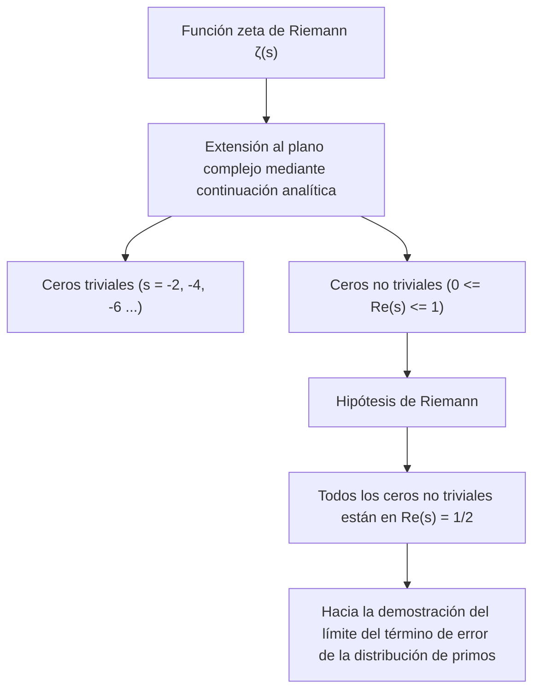
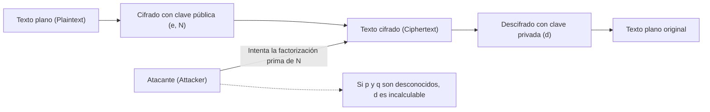
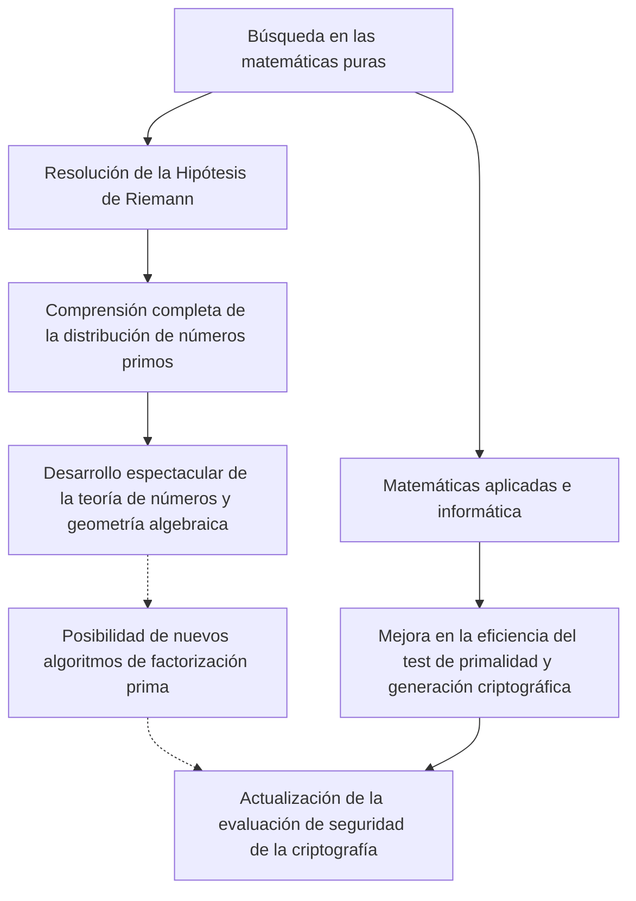

# 1. Introducción: El misterio cósmico de los números primos y la Hipótesis de Riemann

Los "números primos" (Prime Numbers) son números naturales divisibles únicamente por 1 y por sí mismos, y también se les llama los "átomos" del mundo de las matemáticas. Esta secuencia que continúa con 2, 3, 5, 7, 11, 13... parece a primera vista aparecer de manera caótica y aleatoria. Desde que el matemático de la antigua Grecia, Euclides, demostró que "los números primos son infinitos", innumerables matemáticos han intentado desentrañar la regularidad oculta en esta disposición de números primos.

Quien más se acercó a este misterio de los números primos fue el matemático alemán Bernhard Riemann, quien en 1859 propuso la **"Hipótesis de Riemann" (Riemann Hypothesis)**. La Hipótesis de Riemann es uno de los problemas más importantes y no resueltos de las matemáticas modernas, y tiene una recompensa de 1 millón de dólares al ser uno de los Problemas del Milenio establecidos por el Instituto Clay de Matemáticas.

A primera vista, un problema tan difícil de matemáticas puras relacionado con la distribución de los números primos puede parecer ajeno a nuestra vida diaria. Sin embargo, la seguridad de Internet que sustenta la infraestructura de la sociedad moderna, en particular **las tecnologías criptográficas modernas como la criptografía RSA y la criptografía de curva elíptica (ECC)**, dependen profundamente de las propiedades de los números primos gigantes.

En este artículo, emprenderemos un viaje matemático desde la distribución de los números primos, pasando por el Teorema de los Números Primos, la función zeta de Riemann, hasta llegar al núcleo de la Hipótesis de Riemann. Profundizaremos en detalle sobre cómo se relaciona con la criptografía moderna y qué sucedería en el mundo si se demostrara la Hipótesis de Riemann.

---

# 2. El Teorema de los Números Primos y la distribución de los números primos: El descubrimiento de Gauss

Para comprender cómo se distribuyen los números primos, los matemáticos consideraron la **función contadora de números primos (Prime-counting function)** $\pi(x)$, que representa "cuántos números primos existen menores o iguales a un cierto número $x$".

Por ejemplo:
- $\pi(10) = 4$ (2, 3, 5, 7)
- $\pi(100) = 25$
- $\pi(1000) = 168$

El matemático prodigio de 15 años Carl Friedrich Gauss calculó tablas masivas de números primos y descubrió que la frecuencia de aparición de los números primos disminuye en proporción inversa al logaritmo natural $\ln x$. En otras palabras, conjeturó que la probabilidad de encontrar un número primo cerca de un cierto número $x$ es aproximadamente $\frac{1}{\ln x}$.

La expresión de esto utilizando integrales es la **integral logarítmica (Logarithmic integral)** $\text{Li}(x)$.

$$ \text{Li}(x) = \int_{2}^{x} \frac{dt}{\ln t} $$

La conjetura de Gauss fue demostrada de forma independiente en 1896 por Jacques Hadamard y Charles-Jean de La Vallée Poussin, y se estableció como el **Teorema de los Números Primos (Prime Number Theorem, PNT)**.

$$ \lim_{x \to \infty} \frac{\pi(x)}{\text{Li}(x)} = 1 $$

O se expresa de manera aproximada de la siguiente forma:

$$ \pi(x) \sim \frac{x}{\ln x} $$

Gracias a este teorema, sabemos que, a nivel macroscópico, los números primos tienen una distribución muy suave y predecible. Sin embargo, a nivel microscópico, siempre existe un "error" o "fluctuación" entre $\pi(x)$ y $\text{Li}(x)$. La verdadera naturaleza de esta fluctuación es exactamente el mayor misterio que la Hipótesis de Riemann intenta desentrañar.

---

# 3. La función zeta de Riemann y el producto de Euler

El arma más poderosa para analizar la distribución de los números primos es la **función zeta de Riemann (Riemann Zeta Function)**. Originalmente fue una serie infinita definida por Leonhard Euler para números reales $s > 1$.

$$ \zeta(s) = \sum_{n=1}^\infty \frac{1}{n^s} = 1 + \frac{1}{2^s} + \frac{1}{3^s} + \frac{1}{4^s} + \dots $$

Uno de los mayores logros de Euler fue demostrar que esta serie infinita podía expresarse como un producto infinito sobre todos los números primos $p$. Este es el **producto de Euler (Euler Product Formula)**.

$$ \zeta(s) = \prod_{p \text{ prime}} \frac{1}{1 - p^{-s}} = \left( \frac{1}{1 - 2^{-s}} \right) \left( \frac{1}{1 - 3^{-s}} \right) \left( \frac{1}{1 - 5^{-s}} \right) \dots $$

Una comprensión intuitiva de la demostración es que si expandimos cada término del lado derecho como una serie geométrica y los multiplicamos, gracias al teorema fundamental de la aritmética (todo número natural se puede expresar de forma única como el producto de números primos), se reconstruye completamente la suma de los recíprocos de los números naturales en el lado izquierdo.

**Esta única fórmula se convirtió en el puente que conecta el análisis matemático (series infinitas y funciones continuas) y la teoría de números (números primos y números discretos).** Estudiar la función zeta es sinónimo de estudiar la distribución de los números primos.

---

# 4. Continuación analítica y la extensión al plano complejo

La genialidad de Riemann radica en haber extendido la variable $s$ de $\zeta(s)$, que Euler había considerado únicamente para números reales, a **números complejos $s = \sigma + it$ ($\sigma$ es la parte real, $t$ es la parte imaginaria)**.

La serie infinita original converge solo para $\sigma > 1$, pero Riemann utilizó una técnica llamada "continuación analítica" (Analytic Continuation) para extender la definición de manera que $\zeta(s)$ tenga sentido en todo el plano complejo, excluyendo el polo en $s = 1$.

Además, dedujo una hermosa ecuación funcional (Functional equation) que satisface la función zeta.

$$ \zeta(s) = 2^s \pi^{s-1} \sin\left(\frac{\pi s}{2}\right) \Gamma(1-s) \zeta(1-s) $$

Donde $\Gamma(x)$ es la función gamma. A través de esta ecuación, podemos conocer las propiedades del semiplano izquierdo a partir de las propiedades del semiplano derecho.

### Ceros de la Función Zeta (Zeros of the Zeta Function)
Los números complejos $s$ para los cuales el valor de la función zeta se vuelve 0 se denominan "ceros".
A partir de la ecuación funcional, cuando $s$ es un número par negativo ($-2, -4, -6, \dots$), dado que $\sin(\pi s / 2)$ se vuelve 0, se tiene $\zeta(s) = 0$. Estos se conocen como **ceros triviales (Trivial zeros)**.

Sin embargo, lo que es importante para la distribución de los números primos son los otros ceros, es decir, los **ceros no triviales (Non-trivial zeros)** que existen en la "banda crítica" (Critical strip) donde $0 \le \sigma \le 1$.

---

# 5. El núcleo de la Hipótesis de Riemann y la fórmula explícita

Riemann calculó unos pocos ceros y formuló una conjetura sorprendente. Esta es la **Hipótesis de Riemann**.

> **Hipótesis de Riemann (Riemann Hypothesis)**
> Todos los ceros no triviales de la función zeta de Riemann $\zeta(s)$ se encuentran en la línea recta donde la parte real es igual a $1/2$ ($\text{Re}(s) = 1/2$).

A esta recta donde la parte real es 1/2 se le llama la "línea crítica" (Critical line).

¿Por qué es tan importante la Hipótesis de Riemann? Porque los ceros de la función zeta determinan **completamente** la distribución de los números primos.

Riemann y el posterior matemático von Mangoldt derivaron una "fórmula explícita" (Explicit formula) que describe con precisión la distribución de los números primos. Utilizando la función de Chebyshev $\psi(x)$, se expresa de la siguiente manera:

$$ \psi(x) = x - \sum_{\rho} \frac{x^\rho}{\rho} - \ln(2\pi) - \frac{1}{2}\ln(1 - x^{-2}) $$

Aquí, $\rho$ es la suma sobre todos los ceros no triviales de la función zeta.
El término principal es $x$ (que corresponde al Teorema de los Números Primos), y al sumar y restar los términos ondulatorios que dependen de los ceros $\rho$, se restaura la distribución precisa en forma de escalera de los números primos. Se puede decir que los ceros no triviales representan la "frecuencia (onda)" de la distribución de los números primos.

Si la Hipótesis de Riemann es correcta y la parte real de todos los ceros no triviales $\rho$ es exactamente $1/2$, entonces el término de error del Teorema de los Números Primos se mantendrá dentro del rango mínimo teóricamente concebible.

$$ |\pi(x) - \text{Li}(x)| \le \frac{1}{8\pi} \sqrt{x} \ln x \quad \text{for} \quad x \ge 2657 $$

En otras palabras, **si la Hipótesis de Riemann es verdadera, se demuestra que los números primos están distribuidos de la manera más "regular y hermosa" que podamos imaginar**.

---

# 6. La relación inseparable entre la criptografía moderna y los números primos

Hasta aquí hemos estado en el profundo mundo de las matemáticas puras, pero las propiedades de estos números primos sostienen desde sus cimientos a la sociedad digital moderna. El principal representante de esto es la criptografía de clave pública, liderada por la **criptografía RSA**.

La seguridad de todas las comunicaciones, como los pagos con tarjeta de crédito en Internet, la transmisión de contraseñas y las firmas digitales de blockchain, depende de los "números primos".

### Funcionamiento de la criptografía RSA
La seguridad de la criptografía RSA se basa en el hecho matemático de que "la factorización en números primos de números compuestos de muchos dígitos es extremadamente difícil" (el problema de la factorización de enteros).

1. **Generación de claves**:
   Se eligen aleatoriamente dos números primos gigantes, $p$ y $q$ (por ejemplo, de 2048 bits cada uno).
   Se multiplican para calcular $N = p \times q$. Este $N$ se convierte en parte de la clave pública.
   Utilizando la función indicatriz de Euler $\phi(N) = (p-1)(q-1)$, se genera la clave privada $d$.
   
   $$ e \times d \equiv 1 \pmod{\phi(N)} $$

2. **Cifrado y descifrado**:
   El texto plano $M$ se transforma en el texto cifrado $C$ utilizando la clave pública $e, N$.
   $$ C \equiv M^e \pmod{N} $$
   Solo quien posee la clave privada $d$ puede descifrarlo.
   $$ M \equiv C^d \pmod{N} $$

Para romper la criptografía RSA, es necesario encontrar los números primos originales $p$ y $q$ a partir del enorme $N$ (factorización prima). Incluso utilizando los algoritmos convencionales actuales (como la criba general del cuerpo de números: GNFS, por sus siglas en inglés), factorizar un número de cientos de dígitos tomaría un tiempo que supera con creces la edad del universo, incluso utilizando supercomputadoras.

---

# 7. El impacto de la Hipótesis de Riemann en la criptografía

Entonces, ¿cómo se cruzan la "Hipótesis de Riemann", que se encuentra en la cima de las matemáticas puras, y la "criptografía"?

### 7.1. Algoritmos de generación de números primos (test de primalidad) y la Hipótesis Generalizada de Riemann (GRH)
Para operar la criptografía RSA, primero es necesario generar los primos gigantes $p$ y $q$. Sin embargo, no es fácil determinar de manera segura y rápida si "un número es primo o no".

Actualmente, lo que se utiliza de forma práctica es un algoritmo probabilístico llamado el **test de primalidad de Miller-Rabin (Miller-Rabin primality test)**. Este algoritmo es rápido, pero conlleva el riesgo de identificar incorrectamente un número compuesto como primo con una probabilidad extremadamente baja (un "pseudoprimo").

Sin embargo, si asumimos como cierta la **"Hipótesis Generalizada de Riemann" (Generalized Riemann Hypothesis, GRH)**, que extiende la Hipótesis de Riemann a las funciones L de Dirichlet, la historia cambia drásticamente.
Si la GRH es verdadera, se garantiza matemáticamente un límite superior en el número de pruebas en el test de Miller-Rabin, elevándolo de un algoritmo probabilístico a un **"algoritmo determinista de tiempo polinómico"** (este era un hecho crucial conocido incluso antes de que se descubriera el test de primalidad AKS).

En otras palabras, la Hipótesis de Riemann (y sus generalizaciones) desempeña el papel de otorgar una garantía directa a la creación de los cimientos de la criptografía: "si es posible generar números primos gigantes a gran velocidad y con absoluta confianza".

### 7.2. Relación con los algoritmos de factorización
A la hora de evaluar la complejidad computacional de los algoritmos de quienes intentan descifrar la criptografía (como la criba general del cuerpo de números), también es indispensable el conocimiento sobre la distribución de los números primos. Muchos algoritmos de factorización dependen de la distribución de "números lisos" (Smooth numbers: números que solo tienen factores primos pequeños).

Para evaluar rigurosamente con qué frecuencia aparecen los números lisos, se requiere una profunda comprensión de la distribución de los números primos, y es aquí donde también se emplean técnicas de teoría analítica de números que están directamente vinculadas a la función zeta y a la Hipótesis de Riemann. Si se demuestra la Hipótesis de Riemann y se determina completamente el error en la distribución de los números primos, también será posible identificar de manera más precisa los límites de rendimiento de los algoritmos de factorización en números primos.

---

# 8. Si se demuestra la Hipótesis de Riemann, ¿se romperá la criptografía?

A veces se cuenta como una leyenda urbana que "si se resuelve la Hipótesis de Riemann, la criptografía RSA colapsará en un instante", pero **esto es matemáticamente inexacto**.

La demostración de la Hipótesis de Riemann en sí misma no produciría inmediatamente un algoritmo mágico que acelere drásticamente la factorización de números primos. Esto se debe a que la Hipótesis de Riemann es simplemente un teorema sobre la "regularidad de la distribución macroscópica" de los números primos, y no nos indica directamente qué números primos dividen a un número particular $N$ (propiedad local).

Sin embargo, el impacto no es nulo.
Existe una probabilidad extremadamente alta de que, en el proceso de demostrar la Hipótesis de Riemann, se descubran **"nuevas herramientas matemáticas" y "métodos analíticos desconocidos"**. Si observamos la historia, cuando se demostró el Último Teorema de Fermat o la Conjetura de Poincaré, las nuevas teorías desarrolladas en el proceso hicieron avanzar enormemente a todas las matemáticas.

Si se establecen métodos desconocidos de geometría algebraica o geometría no conmutativa que puedan manipular por completo las propiedades de los ceros de la función zeta de Riemann, no se puede descartar la posibilidad de que conduzcan al descubrimiento de algoritmos de factorización innovadores (por ejemplo, algoritmos clásicos que reduzcan la complejidad computacional a tiempo polinómico). En ese sentido, los criptógrafos nunca pueden quitarle los ojos de encima al progreso de la Hipótesis de Riemann.

### Las computadoras cuánticas y el algoritmo de Shor
Una amenaza más directa y realista para la criptografía no es la demostración de la Hipótesis de Riemann, sino **las computadoras cuánticas**. El "algoritmo de Shor", publicado por Peter Shor en 1994, demostró que si existiera una computadora cuántica con suficiente capacidad, la factorización en números primos podría resolverse en tiempo polinómico. Con esto, la criptografía RSA y la criptografía de curva elíptica quedarían fundamentalmente rotas.

Actualmente, en todo el mundo se está promoviendo la transición hacia la "criptografía post-cuántica (Post-Quantum Cryptography, PQC)" (como la criptografía basada en retículos), que no puede ser descifrada ni siquiera por computadoras cuánticas. La tecnología criptográfica que depende de los números primos puede, en cierto sentido, estar llegando al final de su edad de oro, pero el valor matemático de los números primos en sí mismos nunca se perderá.

---

# 9. Conclusión: La intersección entre la abstracción matemática y la sociedad real

La incansable búsqueda sobre los números primos que continúa desde la antigua Grecia fue sublimada en una hermosa sinfonía sobre el plano complejo (los ceros de la función zeta) por un genio llamado Riemann. Y sorprendentemente, ese cristal de matemáticas puras y puristas se está aplicando, siglos después, como el escudo más fuerte para garantizar la seguridad de la sociedad de Internet.

La Hipótesis de Riemann es una entidad que simboliza simultáneamente la "belleza abstracta" que poseen las matemáticas y su "asombrosa aplicabilidad al mundo físico y a la sociedad real".

Cuando esta gigantesca montaña matemática, a cuya cima aún nadie ha llegado, sea conquistada algún día, comprenderemos por completo la verdad cósmica de los números primos, y al mismo tiempo obtendremos una nueva perspectiva sobre los cimientos de la sociedad de la información. Aprender sobre criptografía es, de hecho, un viaje que recorre la historia de la sabiduría de la humanidad.
