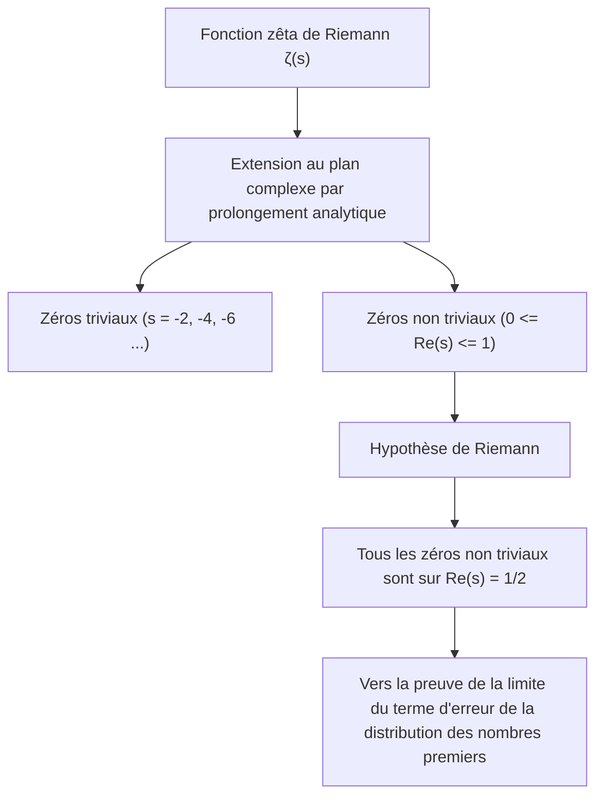
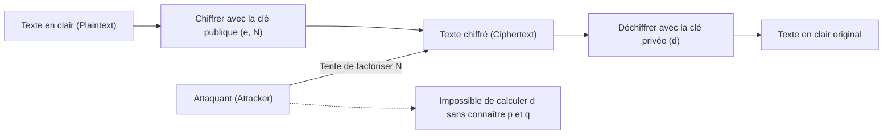
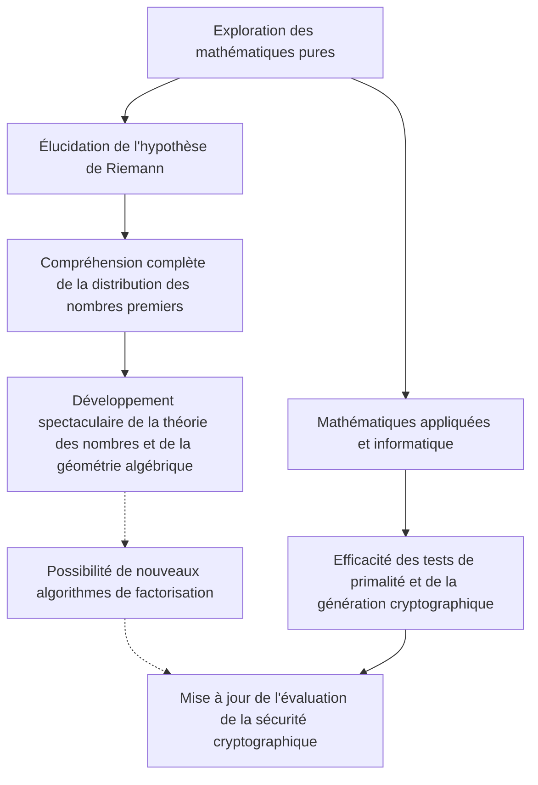

# 1. Introduction : Le mystère cosmique des nombres premiers et l'hypothèse de Riemann

Les « nombres premiers » (Prime Numbers) sont des entiers naturels qui ne sont divisibles que par 1 et par eux-mêmes, et sont souvent appelés les « atomes » du monde mathématique. La suite 2, 3, 5, 7, 11, 13... semble à première vue désordonnée et aléatoire. Depuis que le mathématicien grec antique Euclide a prouvé qu'« il existe une infinité de nombres premiers », d'innombrables mathématiciens ont tenté de percer les régularités cachées dans cette suite de nombres premiers.

Celle qui s'est le plus rapprochée du mystère des nombres premiers est l'**« Hypothèse de Riemann » (Riemann Hypothesis)**, proposée en 1859 par le mathématicien allemand Bernhard Riemann. L'hypothèse de Riemann est l'un des problèmes les plus importants et non résolus des mathématiques modernes, et elle fait partie des Problèmes du prix du millénaire définis par l'Institut de mathématiques Clay, avec une récompense d'un million de dollars.

À première vue, un problème difficile de mathématiques pures concernant la distribution des nombres premiers peut sembler sans rapport avec notre vie quotidienne. Cependant, la sécurité de l'infrastructure d'Internet qui soutient la société moderne, en particulier **les technologies de cryptographie moderne telles que le chiffrement RSA et la cryptographie sur les courbes elliptiques (ECC)**, dépend profondément des propriétés des nombres premiers géants.

Dans cet article, nous entreprendrons un voyage mathématique allant de la distribution des nombres premiers au théorème des nombres premiers, à la fonction zêta de Riemann, pour atteindre le cœur de l'hypothèse de Riemann. Nous explorerons en profondeur comment elle est liée à la cryptographie moderne et ce qu'il adviendrait du monde si l'hypothèse de Riemann venait à être prouvée.

---

# 2. Le théorème des nombres premiers et la distribution des nombres premiers : La découverte de Gauss

Afin de comprendre comment les nombres premiers sont distribués, les mathématiciens ont considéré la **fonction de compte des nombres premiers (Prime-counting function)** $\pi(x)$, qui représente « combien de nombres premiers existent inférieurs ou égaux à un certain nombre $x$ ».

Par exemple :
- $\pi(10) = 4$ (2, 3, 5, 7)
- $\pi(100) = 25$
- $\pi(1000) = 168$

Carl Friedrich Gauss, mathématicien de génie de 15 ans, a calculé d'énormes tables de nombres premiers et a découvert que la fréquence d'apparition des nombres premiers diminue de manière inversement proportionnelle au logarithme népérien $\ln x$. En d'autres termes, il a conjecturé que la probabilité de trouver un nombre premier autour d'un certain nombre $x$ est d'environ $\frac{1}{\ln x}$.

L'expression de cela à l'aide d'une intégrale est le **logarithme intégral (Logarithmic integral)** $\text{Li}(x)$.

$$ \text{Li}(x) = \int_{2}^{x} \frac{dt}{\ln t} $$

La conjecture de Gauss a ensuite été prouvée indépendamment en 1896 par Jacques Hadamard et Charles-Jean de La Vallée Poussin, et a été établie en tant que **théorème des nombres premiers (Prime Number Theorem, PNT)**.

$$ \lim_{x \to \infty} \frac{\pi(x)}{\text{Li}(x)} = 1 $$

Ou de manière approximative, il s'exprime comme suit :

$$ \pi(x) \sim \frac{x}{\ln x} $$

Grâce à ce théorème, nous savons que les nombres premiers ont une distribution très lisse et prévisible d'un point de vue macroscopique. Cependant, d'un point de vue microscopique, il existe toujours une « erreur » ou une « fluctuation » entre $\pi(x)$ et $\text{Li}(x)$. La véritable nature de cette fluctuation est le plus grand mystère que l'hypothèse de Riemann tente de résoudre.

---

# 3. La fonction zêta de Riemann et le produit eulerien

L'arme la plus puissante pour analyser la distribution des nombres premiers est la **fonction zêta de Riemann (Riemann Zeta Function)**. À l'origine, il s'agissait d'une série infinie définie par Leonhard Euler pour les nombres réels $s > 1$.

$$ \zeta(s) = \sum_{n=1}^\infty \frac{1}{n^s} = 1 + \frac{1}{2^s} + \frac{1}{3^s} + \frac{1}{4^s} + \dots $$

L'une des plus grandes réalisations d'Euler a été de prouver que cette série infinie peut être exprimée comme un produit infini sur tous les nombres premiers $p$. C'est le **produit eulerien (Euler Product Formula)**.

$$ \zeta(s) = \prod_{p \text{ prime}} \frac{1}{1 - p^{-s}} = \left( \frac{1}{1 - 2^{-s}} \right) \left( \frac{1}{1 - 3^{-s}} \right) \left( \frac{1}{1 - 5^{-s}} \right) \dots $$

La compréhension intuitive de la preuve est que si vous développez chaque terme du côté droit comme une série géométrique et que vous les multipliez, le théorème fondamental de l'arithmétique (tout entier naturel est exprimé de manière unique comme un produit de nombres premiers) reconstruira parfaitement la somme des inverses des entiers naturels du côté gauche.

**Cette seule équation est devenue un pont reliant l'analyse (séries infinies / fonctions continues) et la théorie des nombres (nombres premiers / nombres discrets).** Étudier la fonction zêta est synonyme d'étudier la distribution des nombres premiers.

---

# 4. Prolongement analytique et extension au plan complexe

Le génie de Riemann réside dans l'extension de la variable $s$ de $\zeta(s)$, qu'Euler ne considérait que pour les nombres réels, à des **nombres complexes $s = \sigma + it$ ($\sigma$ est la partie réelle, $t$ est la partie imaginaire)**.

La série infinie originale ne converge que pour $\sigma > 1$, mais Riemann a utilisé une méthode appelée « prolongement analytique (Analytic Continuation) » pour étendre la définition de sorte que $\zeta(s)$ ait un sens sur l'ensemble du plan complexe, à l'exception du pôle en $s = 1$.

Il a en outre dérivé une magnifique équation fonctionnelle (Functional equation) satisfaite par la fonction zêta.

$$ \zeta(s) = 2^s \pi^{s-1} \sin\left(\frac{\pi s}{2}\right) \Gamma(1-s) \zeta(1-s) $$

Où $\Gamma(x)$ est la fonction gamma. Cette équation nous permet de connaître les propriétés du demi-plan gauche à partir des propriétés du demi-plan droit.

### Zéros (Zeros of the Zeta Function)
Les nombres complexes $s$ où la valeur de la fonction zêta devient 0 sont appelés « zéros ».
D'après l'équation fonctionnelle, lorsque $s$ est un nombre pair négatif ($-2, -4, -6, \dots$), $\sin(\pi s / 2)$ devient 0, donc $\zeta(s) = 0$. Ceux-ci sont appelés les **zéros triviaux (Trivial zeros)**.

Cependant, ce qui est important dans la distribution des nombres premiers, ce sont les autres zéros, à savoir les **zéros non triviaux (Non-trivial zeros)** qui existent dans la « bande critique (Critical strip) » où $0 \le \sigma \le 1$.

---

# 5. Le cœur de l'hypothèse de Riemann et la formule explicite

Riemann a calculé un petit nombre de zéros et a formulé une conjecture étonnante. C'est l'**hypothèse de Riemann**.

> **Hypothèse de Riemann (Riemann Hypothesis)**
> Tous les zéros non triviaux de la fonction zêta de Riemann $\zeta(s)$ ont une partie réelle égale à $1/2$ (c'est-à-dire $\text{Re}(s) = 1/2$).

Cette droite où la partie réelle est de 1/2 est appelée la « droite critique (Critical line) ».

Pourquoi l'hypothèse de Riemann est-elle si importante ? C'est parce que les zéros de la fonction zêta déterminent **complètement** la distribution des nombres premiers.

Riemann, et plus tard le mathématicien von Mangoldt, ont dérivé une « formule explicite (Explicit formula) » qui décrit avec précision la distribution des nombres premiers. En utilisant la fonction de Tchebychev $\psi(x)$, elle s'exprime comme suit :

$$ \psi(x) = x - \sum_{\rho} \frac{x^\rho}{\rho} - \ln(2\pi) - \frac{1}{2}\ln(1 - x^{-2}) $$

Où $\rho$ est la somme sur tous les zéros non triviaux de la fonction zêta.
Le terme principal est $x$ (qui correspond au théorème des nombres premiers), et en ajoutant et en soustrayant des termes ondulatoires dépendant des zéros $\rho$, la distribution en escalier exacte des nombres premiers est restaurée. On peut dire que les zéros non triviaux représentent les « fréquences (ondes) » de la distribution des nombres premiers.

Si l'hypothèse de Riemann est vraie, et que la partie réelle de tous les zéros non triviaux $\rho$ est exactement de $1/2$, alors le terme d'erreur du théorème des nombres premiers se situera dans la plus petite plage théoriquement concevable.

$$ |\pi(x) - \text{Li}(x)| \le \frac{1}{8\pi} \sqrt{x} \ln x \quad \text{for} \quad x \ge 2657 $$

En d'autres termes, **si l'hypothèse de Riemann est vraie, il sera prouvé que les nombres premiers sont distribués de la manière la plus « régulière et belle » que nous puissions imaginer**.

---

# 6. La cryptographie moderne et sa relation indissociable avec les nombres premiers

Jusqu'ici, nous étions dans le monde profond des mathématiques pures, mais ces propriétés des nombres premiers soutiennent fondamentalement la société numérique moderne. Le représentant de cela est la cryptographie à clé publique telle que le **chiffrement RSA**.

La sécurité de toutes les communications, y compris les paiements par carte de crédit sur Internet, la transmission de mots de passe et les signatures numériques de la blockchain, dépend des « nombres premiers ».

### Fonctionnement du chiffrement RSA
La sécurité du chiffrement RSA est basée sur le fait mathématique (problème de la factorisation) qu'« il est très difficile de factoriser un nombre composé avec un grand nombre de chiffres ».

1. **Génération de clés**:
   Choisissez au hasard de très grands nombres premiers $p$ et $q$ (par exemple, 2048 bits chacun).
   Multipliez-les pour calculer $N = p \times q$. Ce $N$ fera partie de la clé publique.
   En utilisant l'indicatrice d'Euler $\phi(N) = (p-1)(q-1)$, générez la clé privée $d$.
   
   $$ e \times d \equiv 1 \pmod{\phi(N)} $$

2. **Chiffrement et déchiffrement**:
   Le texte en clair $M$ est converti en texte chiffré $C$ à l'aide de la clé publique $e, N$.
   $$ C \equiv M^e \pmod{N} $$
   Seul celui qui possède la clé privée $d$ peut le déchiffrer.
   $$ M \equiv C^d \pmod{N} $$

Pour casser le chiffrement RSA, il faut trouver (factoriser) les nombres premiers originaux $p$ et $q$ à partir du gigantesque $N$. Même en utilisant les algorithmes les plus courants (Crible algébrique : GNFS, etc.), la factorisation d'un nombre de centaines de chiffres prendrait un temps dépassant de loin l'âge de l'univers, même avec des superordinateurs.

---

# 7. L'impact de l'hypothèse de Riemann sur la cryptographie

Alors, comment « l'hypothèse de Riemann » au sommet des mathématiques pures et la « cryptographie » se croisent-elles ?

### 7.1. Algorithmes de génération de nombres premiers (test de primalité) et l'hypothèse de Riemann généralisée (GRH)
Pour utiliser le chiffrement RSA, il faut d'abord générer des nombres premiers géants $p$ et $q$. Cependant, déterminer de manière fiable et rapide si « un certain nombre est premier » n'est pas facile.

Actuellement, l'algorithme pratique utilisé est le **test de primalité de Miller-Rabin (Miller-Rabin primality test)**, qui est un algorithme probabiliste. Cet algorithme est rapide, mais il existe un risque de « pseudo-premiers » où un nombre composé est identifié à tort comme premier avec une probabilité extrêmement faible.

Cependant, si l'**« Hypothèse de Riemann généralisée (Generalized Riemann Hypothesis, GRH) »**, qui étend l'hypothèse de Riemann aux fonctions L de Dirichlet, est supposée vraie, la situation change radicalement.
Si la GRH est vraie, la limite supérieure du nombre de tests dans le test de Miller-Rabin est mathématiquement garantie, et elle passe d'un algorithme probabiliste à un **« algorithme déterministe en temps polynomial »** (C'était un fait majeur connu avant même la découverte du test de primalité AKS).

En d'autres termes, l'hypothèse de Riemann (et son extension) joue un rôle dans l'approbation directe de la génération de base de la cryptographie : « Pouvons-nous générer des nombres premiers géants rapidement et avec une confiance absolue ? ».

### 7.2. Relation avec les algorithmes de factorisation
Lors de l'évaluation de la complexité des algorithmes pour le décryptage (comme le crible algébrique), la connaissance de la distribution des nombres premiers est indispensable. De nombreux algorithmes de factorisation dépendent de la distribution des « nombres friables (Smooth numbers : nombres qui n'ont que de petits facteurs premiers) ».

Pour évaluer rigoureusement la fréquence d'apparition des nombres friables, une compréhension profonde de la distribution des nombres premiers est requise, et ici aussi, des techniques de théorie analytique des nombres directement liées à la fonction zêta et à l'hypothèse de Riemann sont pleinement utilisées. Si l'hypothèse de Riemann est prouvée et que l'erreur de la distribution des nombres premiers est complètement déterminée, il sera possible d'évaluer plus précisément les limites de performance des algorithmes de factorisation.

---

# 8. Si l'hypothèse de Riemann est prouvée, la cryptographie sera-t-elle cassée ?

On dit parfois comme une légende urbaine que « si l'hypothèse de Riemann est résolue, le chiffrement RSA s'effondrera en un instant », mais **c'est mathématiquement inexact**.

La preuve de l'hypothèse de Riemann elle-même ne créera pas immédiatement un algorithme magique qui accélère considérablement la factorisation. L'hypothèse de Riemann n'est qu'un théorème sur la « régularité de la distribution macroscopique » des nombres premiers, et elle ne nous dit pas directement par quels nombres premiers un nombre individuel $N$ est divisible (propriété locale).

Cependant, l'impact n'est pas nul.
Il est extrêmement probable que de **« nouveaux outils mathématiques » et des « méthodes analytiques inconnues » soient découverts** au cours du processus de démonstration de l'hypothèse de Riemann. L'histoire montre que lorsque le dernier théorème de Fermat et la conjecture de Poincaré ont été prouvés, les nouvelles théories développées au cours du processus ont fait progresser les mathématiques dans leur ensemble.

Si des méthodes géométriques algébriques inconnues ou des méthodes géométriques non commutatives permettant de manipuler complètement les propriétés des zéros de la fonction zêta de Riemann sont établies, il n'est pas exclu que cela conduise à la découverte d'un algorithme révolutionnaire de factorisation (par exemple, un algorithme classique qui réduit la complexité au temps polynomial). En ce sens, les cryptographes ne peuvent jamais quitter des yeux les développements de l'hypothèse de Riemann.

### Ordinateurs quantiques et algorithme de Shor
Une menace plus directe et réaliste pour la cryptographie n'est pas la preuve de l'hypothèse de Riemann, mais les **ordinateurs quantiques**. « L'algorithme de Shor » publié par Peter Shor en 1994 a prouvé qu'avec un ordinateur quantique suffisamment performant, la factorisation peut être résolue en temps polynomial. Cela casserait fondamentalement le chiffrement RSA et la cryptographie sur les courbes elliptiques.

Actuellement, une transition vers la « cryptographie post-quantique (Post-Quantum Cryptography, PQC) » (comme la cryptographie fondée sur les réseaux) qui ne peut pas être déchiffrée même par des ordinateurs quantiques progresse dans le monde entier. Les technologies de cryptographie basées sur les nombres premiers peuvent en un sens atteindre la fin de leur âge d'or, mais la valeur mathématique des nombres premiers eux-mêmes ne sera jamais perdue.

---

# 9. Conclusion : L'intersection de l'abstraction mathématique et de la société réelle

La quête insatiable des nombres premiers, qui se poursuit depuis la Grèce antique, a été sublimée par le génie de Riemann en une magnifique symphonie sur le plan complexe (les zéros de la fonction zêta). Et étonnamment, ce cristal pur et immaculé des mathématiques est appliqué des siècles plus tard comme le bouclier le plus puissant garantissant la sécurité de la société de l'information.

L'hypothèse de Riemann est une entité qui symbolise à la fois la « beauté abstraite » des mathématiques et sa « stupéfiante applicabilité au monde physique et à la société réelle ».

Lorsqu'un jour cette immense montagne mathématique, dont personne n'a encore atteint le sommet, sera conquise, nous comprendrons parfaitement la vérité cosmique des nombres premiers et acquerrons une nouvelle perspective sur les fondements de la société de l'information. L'étude de la cryptographie est aussi un voyage à travers l'histoire de la sagesse humaine.
