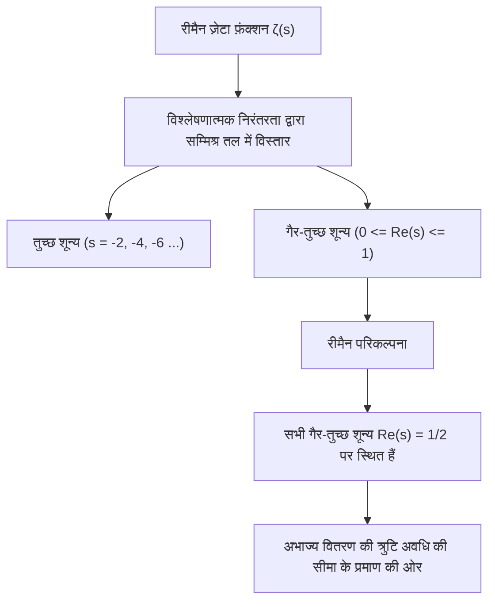
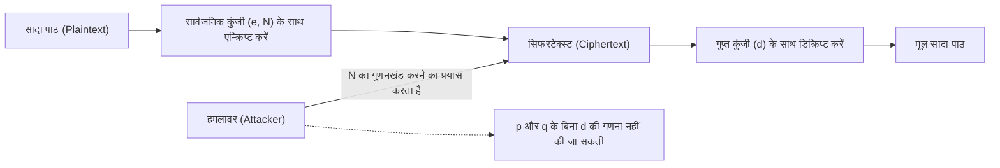
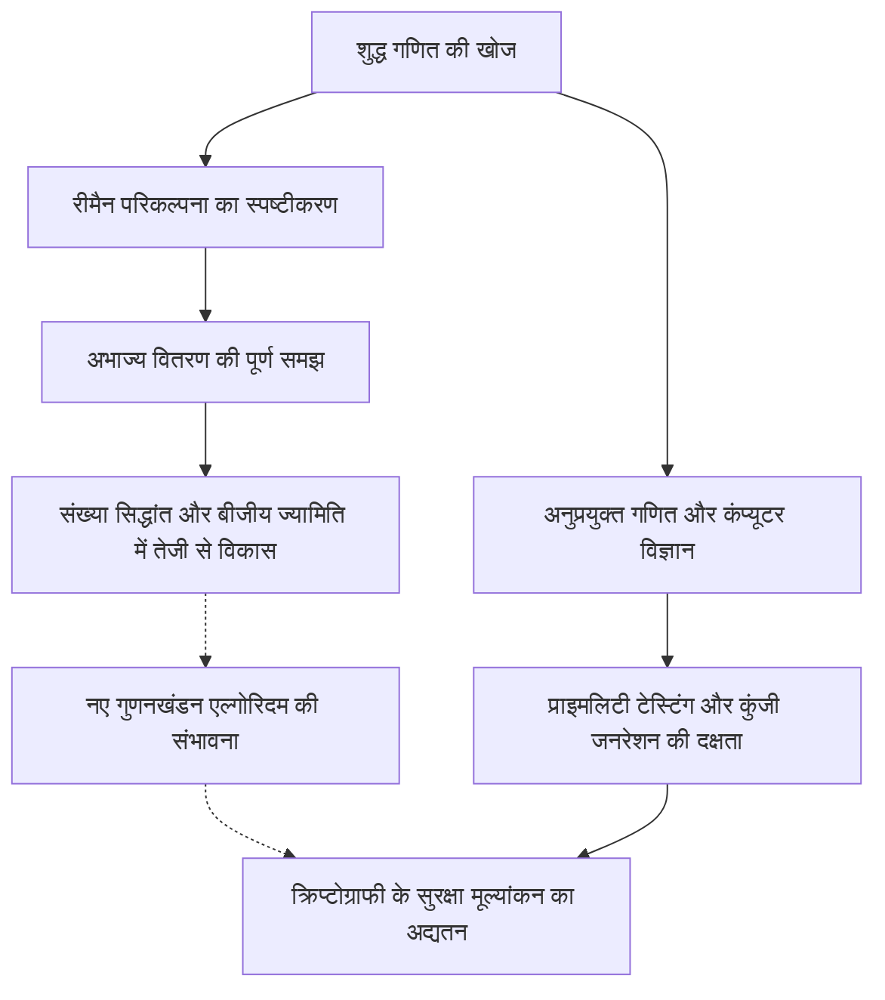

# 1. परिचय: अभाज्य संख्याओं का लौकिक रहस्य और रीमैन परिकल्पना

"अभाज्य संख्याएँ (Prime Numbers)" प्राकृतिक संख्याएँ हैं जो केवल 1 और स्वयं से विभाज्य होती हैं, और उन्हें गणित की दुनिया का "परमाणु" भी कहा जाता है। अनुक्रम 2, 3, 5, 7, 11, 13... पहली नज़र में अव्यवस्थित और यादृच्छिक प्रतीत होता है। प्राचीन यूनानी गणितज्ञ यूक्लिड ने यह साबित किया था कि "अभाज्य संख्याएँ अनंत हैं," तब से अनगिनत गणितज्ञों ने अभाज्य संख्याओं के इस क्रम में छिपी नियमितता को उजागर करने का प्रयास किया है।

इस अभाज्य संख्या के रहस्य के सबसे करीब 1859 में जर्मन गणितज्ञ बर्नहार्ड रीमैन (Bernhard Riemann) द्वारा प्रस्तावित **"रीमैन परिकल्पना (Riemann Hypothesis)"** है। रीमैन परिकल्पना आधुनिक गणित में सबसे महत्वपूर्ण और अनसुलझी समस्याओं में से एक है, और यह क्ले मैथमेटिक्स इंस्टीट्यूट द्वारा निर्धारित मिलेनियम प्राइज समस्याओं में से एक है, जिस पर 1 मिलियन डॉलर का इनाम है।

पहली नज़र में, अभाज्य संख्याओं के वितरण से संबंधित शुद्ध गणित की यह कठिन समस्या हमारे दैनिक जीवन से असंबंधित लग सकती है। हालाँकि, इंटरनेट की सुरक्षा जो आधुनिक समाज के बुनियादी ढांचे का समर्थन करती है, विशेष रूप से **आधुनिक क्रिप्टोग्राफी जैसे RSA और एलिप्टिक कर्व क्रिप्टोग्राफी (ECC)**, विशाल अभाज्य संख्याओं के गुणों पर गहराई से निर्भर करती है।

इस लेख में, हम अभाज्य संख्याओं के वितरण से लेकर अभाज्य संख्या प्रमेय, रीमैन ज़ेटा फ़ंक्शन और रीमैन परिकल्पना के मूल तक एक गणितीय यात्रा करेंगे, और यह कैसे आधुनिक क्रिप्टोग्राफी से जुड़ा है, और यदि रीमैन परिकल्पना सिद्ध हो जाती है तो दुनिया कैसी होगी, इसके बारे में बहुत विस्तृत और गहन व्याख्या करेंगे।

---

# 2. अभाज्य संख्या प्रमेय और अभाज्य संख्याओं का वितरण: गॉस की खोज

अभाज्य संख्याएँ कैसे वितरित होती हैं, यह समझने के लिए, गणितज्ञों ने **अभाज्य-गणना फलन (Prime-counting function)** $\pi(x)$ पर विचार किया, जो दर्शाता है कि "किसी संख्या $x$ के बराबर या उससे कम कितनी अभाज्य संख्याएँ हैं।"

उदाहरण के लिए:
- $\pi(10) = 4$ (2, 3, 5, 7)
- $\pi(100) = 25$
- $\pi(1000) = 168$

15 वर्षीय प्रतिभाशाली गणितज्ञ कार्ल फ्रेडरिक गॉस (Carl Friedrich Gauss) ने अभाज्य संख्याओं की विशाल तालिकाओं की गणना की और पाया कि अभाज्य संख्याओं की आवृत्ति प्राकृतिक लघुगणक (natural logarithm) $\ln x$ के व्युत्क्रमानुपाती होकर कम हो जाती है। अर्थात्, उन्होंने अनुमान लगाया कि किसी संख्या $x$ के आसपास अभाज्य संख्या मिलने की प्रायिकता लगभग $\frac{1}{\ln x}$ है।

इसे समाकलन (integration) का उपयोग करके व्यक्त किया गया है, जिसे **लघुगणकीय समाकलन (Logarithmic integral)** $\text{Li}(x)$ कहा जाता है।

$$ \text{Li}(x) = \int_{2}^{x} \frac{dt}{\ln t} $$

गॉस के अनुमान को बाद में 1896 में जैक्स हैडमार्ड और चार्ल्स जीन डे ला वैली-पूसिन द्वारा स्वतंत्र रूप से सिद्ध किया गया था, और इसे **अभाज्य संख्या प्रमेय (Prime Number Theorem, PNT)** के रूप में स्थापित किया गया।

$$ \lim_{x \to \infty} \frac{\pi(x)}{\text{Li}(x)} = 1 $$

या अनुमानित रूप से इसे इस प्रकार व्यक्त किया जाता है:

$$ \pi(x) \sim \frac{x}{\ln x} $$

इस प्रमेय से, यह पता चला कि यदि स्थूल रूप से देखा जाए, तो अभाज्य संख्याओं का वितरण बहुत सहज और अनुमानित होता है। हालाँकि, यदि सूक्ष्म रूप से देखा जाए, तो $\pi(x)$ और $\text{Li}(x)$ के बीच हमेशा "त्रुटि" अर्थात् "उतार-चढ़ाव" होता है। इस उतार-चढ़ाव का वास्तविक स्वरूप ही वह सबसे बड़ा रहस्य है जिसे रीमैन परिकल्पना सुलझाने का प्रयास कर रही है।

---

# 3. रीमैन ज़ेटा फ़ंक्शन और यूलर उत्पाद

अभाज्य संख्याओं के वितरण का विश्लेषण करने के लिए सबसे शक्तिशाली हथियार **रीमैन ज़ेटा फ़ंक्शन (Riemann Zeta Function)** है। यह मूल रूप से लियोनहार्ड यूलर (Leonhard Euler) द्वारा वास्तविक संख्याओं $s > 1$ के लिए परिभाषित एक अनंत श्रृंखला थी।

$$ \zeta(s) = \sum_{n=1}^\infty \frac{1}{n^s} = 1 + \frac{1}{2^s} + \frac{1}{3^s} + \frac{1}{4^s} + \dots $$

यूलर की सबसे बड़ी उपलब्धियों में से एक यह साबित करना था कि इस अनंत श्रृंखला को सभी अभाज्य संख्याओं $p$ पर एक अनंत उत्पाद के रूप में व्यक्त किया जा सकता है। यह **यूलर उत्पाद सूत्र (Euler Product Formula)** है।

$$ \zeta(s) = \prod_{p \text{ prime}} \frac{1}{1 - p^{-s}} = \left( \frac{1}{1 - 2^{-s}} \right) \left( \frac{1}{1 - 3^{-s}} \right) \left( \frac{1}{1 - 5^{-s}} \right) \dots $$

प्रमाण की सहज समझ यह है कि दाईं ओर के प्रत्येक पद को एक गुणोत्तर श्रेणी के रूप में विस्तारित करके और उन्हें गुणा करके, अंकगणित के मूलभूत प्रमेय (सभी प्राकृतिक संख्याओं को अभाज्य संख्याओं के उत्पाद के रूप में विशिष्ट रूप से दर्शाया जाता है) के कारण, बाईं ओर की प्राकृतिक संख्याओं के व्युत्क्रमों का योग पूरी तरह से पुनर्गठित हो जाता है।

**यह एक ही सूत्र विश्लेषण (अनंत श्रृंखला और निरंतर कार्य) और संख्या सिद्धांत (अभाज्य संख्या और असतत संख्या) को जोड़ने वाला सेतु बन गया।** ज़ेटा फ़ंक्शन की जांच करना अभाज्य संख्याओं के वितरण की जांच करने के समान है।

---

# 4. विश्लेषणात्मक निरंतरता और सम्मिश्र तल में विस्तार

रीमैन की प्रतिभा इस बात में निहित है कि उन्होंने चर $s$ को, जिसे यूलर ने केवल वास्तविक संख्याओं के लिए $\zeta(s)$ में माना था, **सम्मिश्र संख्या $s = \sigma + it$ ($\sigma$ वास्तविक भाग है, $t$ काल्पनिक भाग है)** में विस्तारित किया।

मूल अनंत श्रृंखला केवल $\sigma > 1$ के लिए अभिसरण करती है, लेकिन रीमैन ने "विश्लेषणात्मक निरंतरता (Analytic Continuation)" नामक तकनीक का उपयोग करके परिभाषा का विस्तार किया ताकि $\zeta(s)$ का अर्थ पूरे सम्मिश्र तल पर हो, सिवाय $s = 1$ के पोल के।

उन्होंने ज़ेटा फ़ंक्शन द्वारा संतुष्ट एक सुंदर कार्यात्मक समीकरण (Functional equation) भी प्राप्त किया।

$$ \zeta(s) = 2^s \pi^{s-1} \sin\left(\frac{\pi s}{2}\right) \Gamma(1-s) \zeta(1-s) $$

यहाँ $\Gamma(x)$ गामा फ़ंक्शन है। इस समीकरण के साथ, हम दाहिने आधे तल के गुणों से बाएं आधे तल के गुणों को जान सकते हैं।

### शून्य (Zeros of the Zeta Function)
सम्मिश्र संख्या $s$ जहाँ ज़ेटा फ़ंक्शन का मान 0 हो जाता है, उसे "शून्य" कहा जाता है।
कार्यात्मक समीकरण से, जब $s$ एक ऋणात्मक सम संख्या ($-2, -4, -6, \dots$) होती है, $\sin(\pi s / 2)$ 0 हो जाता है, इसलिए $\zeta(s) = 0$ होता है। इन्हें **तुच्छ शून्य (Trivial zeros)** कहा जाता है।

हालाँकि, अभाज्य संख्याओं के वितरण में जो महत्वपूर्ण है वह अन्य शून्य हैं, अर्थात् **गैर-तुच्छ शून्य (Non-trivial zeros)** जो $0 \le \sigma \le 1$ के "महत्वपूर्ण क्षेत्र (Critical strip)" में मौजूद हैं।

---

# 5. रीमैन परिकल्पना का मूल और स्पष्ट सूत्र

रीमैन ने कुछ शून्यों की गणना की और एक आश्चर्यजनक परिकल्पना प्रस्तुत की। यह **रीमैन परिकल्पना** है।

> **रीमैन परिकल्पना (Riemann Hypothesis)**
> रीमैन ज़ेटा फ़ंक्शन $\zeta(s)$ के सभी गैर-तुच्छ शून्य उस रेखा पर स्थित होते हैं जिसका वास्तविक भाग $1/2$ है ($\text{Re}(s) = 1/2$)।

इस वास्तविक भाग $1/2$ वाली रेखा को "महत्वपूर्ण रेखा (Critical line)" कहा जाता है।

रीमैन परिकल्पना इतनी महत्वपूर्ण क्यों है? ऐसा इसलिए है क्योंकि ज़ेटा फ़ंक्शन के शून्य अभाज्य संख्याओं के वितरण को **पूरी तरह से** निर्धारित करते हैं।

रीमैन और बाद के गणितज्ञ वॉन मैंगोल्ड्ट ने अभाज्य संख्याओं के वितरण का सटीक वर्णन करने के लिए एक "स्पष्ट सूत्र (Explicit formula)" प्राप्त किया। चेबीशेव फ़ंक्शन $\psi(x)$ का उपयोग करते हुए, इसे इस प्रकार व्यक्त किया जाता है:

$$ \psi(x) = x - \sum_{\rho} \frac{x^\rho}{\rho} - \ln(2\pi) - \frac{1}{2}\ln(1 - x^{-2}) $$

यहाँ $\rho$ ज़ेटा फ़ंक्शन के सभी गैर-तुच्छ शून्यों पर योग है।
मुख्य पद $x$ है (जो अभाज्य संख्या प्रमेय से मेल खाता है), और वहां से, शून्य $\rho$ पर निर्भर तरंग जैसे पदों को जोड़ने और घटाने से, अभाज्य संख्याओं का सटीक सीढ़ी जैसा वितरण बहाल हो जाता है। यह कहा जा सकता है कि गैर-तुच्छ शून्य अभाज्य संख्याओं के वितरण की "आवृत्ति (तरंग)" का प्रतिनिधित्व करते हैं।

यदि रीमैन परिकल्पना सही है और सभी गैर-तुच्छ शून्यों $\rho$ का वास्तविक भाग ठीक $1/2$ है, तो अभाज्य संख्या प्रमेय का त्रुटि पद सैद्धांतिक रूप से संभव न्यूनतम सीमा के भीतर होगा।

$$ |\pi(x) - \text{Li}(x)| \le \frac{1}{8\pi} \sqrt{x} \ln x \quad \text{for} \quad x \ge 2657 $$

दूसरे शब्दों में, **यदि रीमैन परिकल्पना सत्य है, तो यह सिद्ध हो जाएगा कि अभाज्य संख्याएँ सबसे "नियमित और सुंदर" तरीके से वितरित हैं जिसकी हम कल्पना कर सकते हैं**।

---

# 6. आधुनिक क्रिप्टोग्राफी और अभाज्य संख्याओं के बीच अविभाज्य संबंध

अब तक यह शुद्ध गणित की एक गहरी दुनिया थी, लेकिन अभाज्य संख्याओं के ये गुण मूल रूप से आधुनिक डिजिटल समाज का समर्थन करते हैं। एक विशिष्ट उदाहरण पब्लिक-की क्रिप्टोग्राफी है, जैसे कि **RSA क्रिप्टोग्राफी**।

इंटरनेट पर क्रेडिट कार्ड भुगतान, पासवर्ड का प्रसारण और ब्लॉकचेन के डिजिटल हस्ताक्षर जैसे सभी संचारों की सुरक्षा "अभाज्य संख्याओं" पर निर्भर करती है।

### RSA क्रिप्टोग्राफी कैसे काम करती है
RSA क्रिप्टोग्राफी की सुरक्षा इस गणितीय तथ्य (पूर्णांक गुणनखंड समस्या) पर आधारित है कि "कई अंकों वाली एक समग्र संख्या का गुणनखंड करना बेहद मुश्किल है।"

1. **कुंजी निर्माण**:
   विशाल अभाज्य संख्याएँ $p$ और $q$ (उदाहरण के लिए, प्रत्येक 2048 बिट) यादृच्छिक रूप से चुनी जाती हैं।
   उन्हें गुणा करके $N = p \times q$ की गणना की जाती है। यह $N$ सार्वजनिक कुंजी का हिस्सा बन जाता है।
   यूलर के टॉटिएंट फ़ंक्शन $\phi(N) = (p-1)(q-1)$ का उपयोग करके, एक गुप्त कुंजी $d$ उत्पन्न की जाती है।
   
   $$ e \times d \equiv 1 \pmod{\phi(N)} $$

2. **एन्क्रिप्शन और डिक्रिप्शन**:
   सादा पाठ $M$ को सार्वजनिक कुंजी $e, N$ का उपयोग करके सिफरटेक्स्ट $C$ में परिवर्तित किया जाता है।
   $$ C \equiv M^e \pmod{N} $$
   केवल गुप्त कुंजी $d$ वाला व्यक्ति ही इसे डिक्रिप्ट कर सकता है।
   $$ M \equiv C^d \pmod{N} $$

RSA क्रिप्टोग्राफी को तोड़ने के लिए, विशाल $N$ से मूल अभाज्य संख्याओं $p$ और $q$ को खोजना (गुणनखंड करना) आवश्यक है। यहां तक ​​कि वर्तमान मुख्यधारा के एल्गोरिदम (जैसे जनरल नंबर फील्ड सीव: GNFS) का उपयोग करके, सुपर कंप्यूटर का उपयोग करके सैकड़ों अंकों की संख्या का गुणनखंड करने में ब्रह्मांड की आयु से बहुत अधिक समय लगने की उम्मीद है।

---

# 7. क्रिप्टोग्राफी पर रीमैन परिकल्पना का प्रभाव

तो, "रीमैन परिकल्पना" (शुद्ध गणित का शिखर) और "क्रिप्टोग्राफी" एक दूसरे को कैसे पार करते हैं?

### 7.1. अभाज्य संख्या जनरेशन एल्गोरिदम (प्राइमलिटी टेस्टिंग) और जनरलाइज्ड रीमैन परिकल्पना (GRH)
RSA क्रिप्टोग्राफी को संचालित करने के लिए, पहले विशाल अभाज्य संख्याएँ $p$ और $q$ उत्पन्न करनी होंगी। हालाँकि, यह निश्चित रूप से और तेज़ी से निर्धारित करना आसान नहीं है कि "क्या कोई संख्या अभाज्य है।"

वर्तमान में, व्यावहारिक उपयोग में आने वाला **मिलर-राबिन प्राइमलिटी टेस्ट (Miller-Rabin primality test)** एक संभाव्य एल्गोरिथ्म है। यह एल्गोरिथ्म तेज़ है, लेकिन एक "छद्म-अभाज्य" जोखिम है जहाँ यह एक समग्र संख्या को बहुत कम संभावना के साथ अभाज्य संख्या के रूप में गलत रूप से आंक सकता है।

हालाँकि, यदि हम मान लें कि डिरिचलेट के L-फ़ंक्शंस तक रीमैन परिकल्पना का विस्तार **"जनरलाइज्ड रीमैन परिकल्पना (Generalized Riemann Hypothesis, GRH)"** सत्य है, तो कहानी नाटकीय रूप से बदल जाती है।
यदि GRH सत्य है, तो मिलर-राबिन परीक्षण में परीक्षणों की अधिकतम संख्या की गणितीय रूप से गारंटी होती है, और यह एक संभाव्य एल्गोरिथ्म से **"नियतात्मक बहुपद-समय एल्गोरिथ्म" में परिवर्तित** हो जाता है (यह AKS प्राइमलिटी परीक्षण की खोज से पहले भी ज्ञात एक महत्वपूर्ण तथ्य था)।

दूसरे शब्दों में, रीमैन परिकल्पना (और इसका विस्तार) सीधे तौर पर इस बात की गारंटी देता है कि "क्या हम पूर्ण विश्वास के साथ और उच्च गति पर विशाल अभाज्य संख्याएँ उत्पन्न कर सकते हैं", जो क्रिप्टोग्राफी की नींव उत्पन्न करने के लिए आवश्यक है।

### 7.2. गुणनखंड एल्गोरिदम के साथ संबंध
क्रिप्टोग्राफी को क्रैक करने वाले एल्गोरिदम (जैसे कि जनरल नंबर फील्ड सीव) की कम्प्यूटेशनल जटिलता का मूल्यांकन करते समय, अभाज्य संख्याओं के वितरण का ज्ञान अपरिहार्य है। कई गुणनखंड एल्गोरिदम "सहज संख्याओं (Smooth numbers: वे संख्याएँ जिनमें केवल छोटे अभाज्य गुणनखंड होते हैं)" के वितरण पर निर्भर करते हैं।

सहज संख्याएँ कितनी बार दिखाई देती हैं, इसका कड़ाई से मूल्यांकन करने के लिए, अभाज्य संख्याओं के वितरण की गहरी समझ आवश्यक है, और यहाँ भी, विश्लेषणात्मक संख्या सिद्धांत की तकनीकों का उपयोग किया जाता है जो सीधे ज़ेटा फ़ंक्शन और रीमैन परिकल्पना से जुड़ी हैं। यदि रीमैन परिकल्पना सिद्ध हो जाती है और अभाज्य वितरण की त्रुटि पूरी तरह से निर्धारित हो जाती है, तो गुणनखंड एल्गोरिदम की प्रदर्शन सीमाओं का अधिक सटीक आकलन करना संभव होगा।

---

# 8. यदि रीमैन परिकल्पना सिद्ध हो जाए, तो क्या क्रिप्टोग्राफी टूट जाएगी?

एक शहरी किंवदंती की तरह, यह कभी-कभी कहा जाता है कि "यदि रीमैन परिकल्पना हल हो जाती है, तो RSA क्रिप्टोग्राफी तुरंत ढह जाएगी", लेकिन **यह गणितीय रूप से गलत है**।

रीमैन परिकल्पना का प्रमाण अपने आप में कोई जादुई एल्गोरिथ्म नहीं बना देगा जो तुरंत गुणनखंड को नाटकीय रूप से तेज कर दे। ऐसा इसलिए है क्योंकि रीमैन परिकल्पना केवल अभाज्य संख्याओं के "स्थूल वितरण की नियमितता" के बारे में एक प्रमेय है, और यह हमें सीधे यह नहीं बताती है कि एक व्यक्तिगत संख्या $N$ को किस अभाज्य संख्या से विभाजित किया जा सकता है (स्थानीय गुण)।

हालाँकि, इसका प्रभाव शून्य नहीं है।
ऐसा इसलिए है क्योंकि यह अत्यधिक संभव है कि रीमैन परिकल्पना को सिद्ध करने की प्रक्रिया में **"नए गणितीय उपकरण" और "अज्ञात विश्लेषणात्मक तरीके" खोजे जाएंगे**। इतिहास को देखते हुए, जब फर्मेट का अंतिम प्रमेय और पोइंकारे अनुमान सिद्ध हुए थे, तो इस प्रक्रिया में विकसित नए सिद्धांतों ने पूरे गणित को एक बड़ी छलांग दी थी।

यदि बीजीय ज्यामिति या गैर-विनिमेय ज्यामिति के अज्ञात तरीके स्थापित हो जाते हैं जो रीमैन ज़ेटा फ़ंक्शन के शून्यों के गुणों को पूरी तरह से हेरफेर कर सकते हैं, तो इस संभावना से इंकार नहीं किया जा सकता है कि इससे एक ग्राउंडब्रेकिंग गुणनखंडन एल्गोरिथ्म (उदाहरण के लिए, एक शास्त्रीय एल्गोरिथ्म जो बहुपद समय में कम्प्यूटेशनल जटिलता को कम करता है) की खोज हो सकती है। इस अर्थ में, क्रिप्टोग्राफर कभी भी रीमैन परिकल्पना के घटनाक्रमों से अपनी आँखें नहीं हटा सकते हैं।

### क्वांटम कंप्यूटर और शोर का एल्गोरिथ्म
क्रिप्टोग्राफी के लिए एक अधिक प्रत्यक्ष और यथार्थवादी खतरा रीमैन परिकल्पना का प्रमाण नहीं है बल्कि **क्वांटम कंप्यूटर** है। 1994 में पीटर शोर (Peter Shor) द्वारा प्रकाशित "शोर का एल्गोरिथ्म" ने साबित कर दिया कि यदि पर्याप्त प्रदर्शन वाला क्वांटम कंप्यूटर है, तो गुणनखंडन को बहुपद समय में हल किया जा सकता है। इससे RSA क्रिप्टोग्राफी और एलिप्टिक कर्व क्रिप्टोग्राफी मौलिक रूप से टूट जाएगी।

वर्तमान में, दुनिया भर में "पोस्ट-क्वांटम क्रिप्टोग्राफी (Post-Quantum Cryptography, PQC)" (जैसे लैटिस-आधारित क्रिप्टोग्राफी) का संक्रमण चल रहा है जिसे क्वांटम कंप्यूटर भी डिक्रिप्ट नहीं कर सकते हैं। अभाज्य संख्याओं पर निर्भर क्रिप्टोग्राफ़िक तकनीकें एक मायने में अपने स्वर्ण युग को समाप्त कर रही हैं, लेकिन स्वयं अभाज्य संख्याओं का गणितीय मूल्य कभी नष्ट नहीं होगा।

---

# 9. निष्कर्ष: गणित के अमूर्तीकरण और वास्तविक समाज का चौराहा

प्राचीन ग्रीस से अभाज्य संख्याओं की अथक खोज को रीमैन नाम के एक जीनियस द्वारा सम्मिश्र तल (ज़ेटा फ़ंक्शन के शून्य) पर एक सुंदर सिम्फनी में बदल दिया गया था। और आश्चर्यजनक रूप से, सदियों बाद, शुद्ध गणित के उस क्रिस्टल को इंटरनेट समाज की सुरक्षा की गारंटी देने के लिए सबसे मजबूत ढाल के रूप में लागू किया जा रहा है।

रीमैन परिकल्पना एक ही समय में गणित की "अमूर्त सुंदरता" और "भौतिक दुनिया और वास्तविक समाज के लिए इसकी आश्चर्यजनक प्रयोज्यता" का प्रतीक है।

जब गणित के इस विशाल पर्वत पर अंततः विजय प्राप्त कर ली जाएगी, जिस पर अभी तक कोई नहीं पहुंच पाया है, तो हम अभाज्य संख्याओं की लौकिक सच्चाई को पूरी तरह से समझ लेंगे, और साथ ही सूचना समाज की नींव पर एक नया दृष्टिकोण प्राप्त करेंगे। क्रिप्टोग्राफी सीखना स्वयं मानवता के ज्ञान के इतिहास का पता लगाने की यात्रा है।
