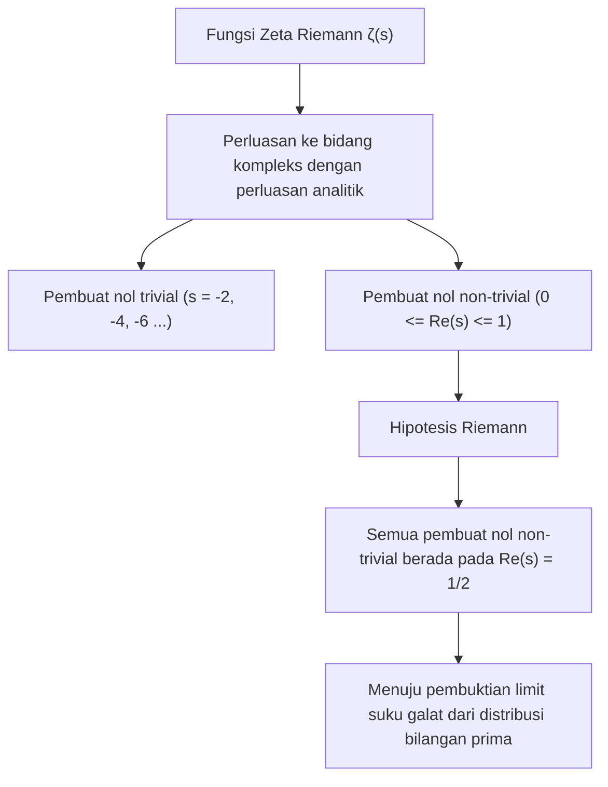
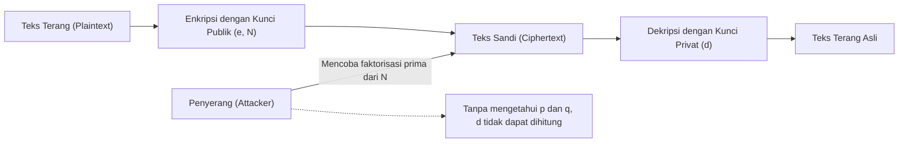
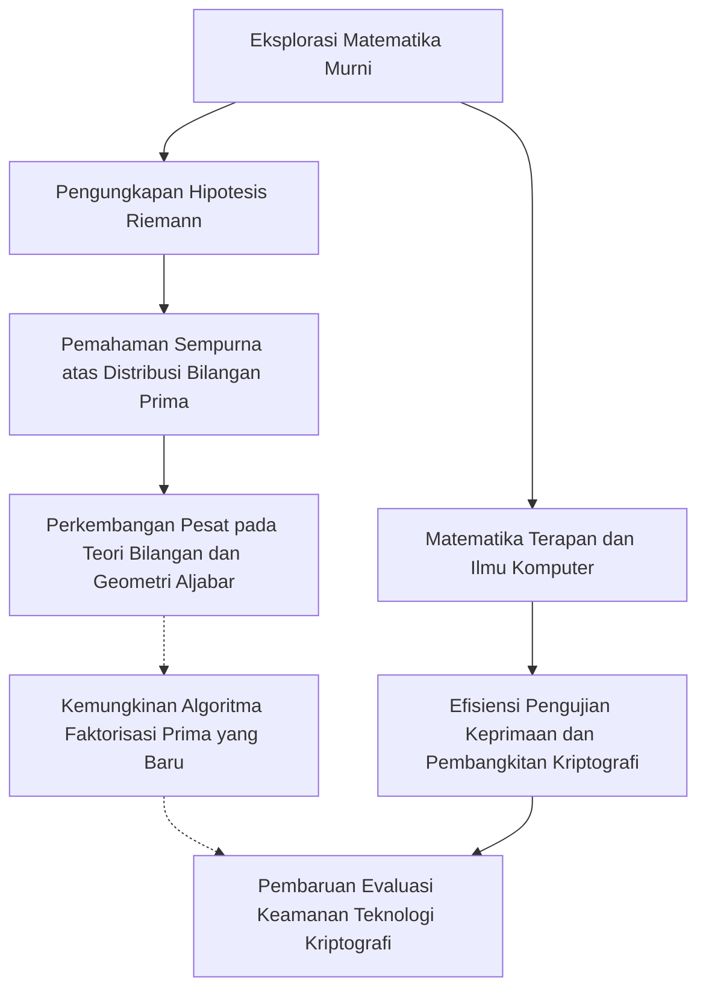

# 1. Pendahuluan: Misteri Alam Semesta Bilangan Prima dan Hipotesis Riemann

"Bilangan prima (Prime Numbers)" adalah bilangan asli yang hanya bisa dibagi oleh 1 dan bilangan itu sendiri, yang juga sering disebut sebagai "atom" dalam dunia matematika. Deret bilangan 2, 3, 5, 7, 11, 13... ini pada pandangan pertama terlihat tidak beraturan dan muncul secara acak. Sejak matematikawan Yunani kuno, Euclid, membuktikan bahwa "bilangan prima jumlahnya tak terhingga", tak terhitung banyaknya matematikawan yang menantang diri mereka untuk mengungkap keteraturan yang tersembunyi di balik susunan bilangan prima ini.

Yang paling mendekati misteri bilangan prima ini adalah **"Hipotesis Riemann (Riemann Hypothesis)"**, yang diusulkan oleh matematikawan Jerman, Bernhard Riemann, pada tahun 1859. Hipotesis Riemann adalah salah satu dari masalah terpenting dan belum terpecahkan dalam matematika modern, serta merupakan salah satu dari Masalah Hadiah Milenium (Millennium Prize Problems) yang ditetapkan oleh Clay Mathematics Institute dengan hadiah sebesar 1 juta dolar.

Sekilas, masalah sulit matematika murni terkait distribusi bilangan prima mungkin terasa tidak ada hubungannya dengan kehidupan kita sehari-hari. Namun, keamanan internet yang menopang infrastruktur masyarakat modern, terutama **teknologi kriptografi modern seperti kriptografi RSA dan kriptografi kurva eliptik (ECC)**, sangat bergantung pada sifat-sifat bilangan prima yang sangat besar.

Dalam artikel ini, kita akan melakukan perjalanan matematis dari distribusi bilangan prima menuju Teorema Bilangan Prima, fungsi Zeta Riemann, hingga ke inti dari Hipotesis Riemann, lalu menggali lebih dalam dan detail tentang bagaimana hal tersebut terhubung dengan teknologi kriptografi modern, serta apa yang akan terjadi pada dunia jika Hipotesis Riemann berhasil dibuktikan.

---

# 2. Teorema Bilangan Prima dan Distribusi Bilangan Prima: Penemuan Gauss

Untuk memahami bagaimana bilangan prima terdistribusi, para matematikawan memikirkan **fungsi penghitungan bilangan prima (Prime-counting function)** $\pi(x)$, yang menyatakan "berapa banyak bilangan prima yang ada di bawah suatu bilangan $x$".

Sebagai contoh:
- $\pi(10) = 4$ (2, 3, 5, 7)
- $\pi(100) = 25$
- $\pi(1000) = 168$

Carl Friedrich Gauss, seorang matematikawan jenius berusia 15 tahun, menghitung tabel bilangan prima yang sangat besar dan menemukan bahwa frekuensi kemunculan bilangan prima berkurang secara berbanding terbalik dengan logaritma natural $\ln x$. Dengan kata lain, ia memperkirakan bahwa peluang menemukan bilangan prima di sekitar suatu bilangan $x$ adalah sekitar $\frac{1}{\ln x}$.

Representasi dari penemuan ini menggunakan integral disebut **integral logaritmik (Logarithmic integral)** $\text{Li}(x)$.

$$ \text{Li}(x) = \int_{2}^{x} \frac{dt}{\ln t} $$

Perkiraan Gauss kemudian dibuktikan secara independen oleh Jacques Hadamard dan Charles-Jean de La Vallée Poussin pada tahun 1896, yang memantapkannya sebagai **Teorema Bilangan Prima (Prime Number Theorem, PNT)**.

$$ \lim_{x \to \infty} \frac{\pi(x)}{\text{Li}(x)} = 1 $$

Atau secara pendekatan dinyatakan sebagai berikut.

$$ \pi(x) \sim \frac{x}{\ln x} $$

Melalui teorema ini, kita mengetahui bahwa jika dilihat secara makroskopis, bilangan prima memiliki distribusi yang sangat mulus dan dapat diprediksi. Namun, jika dilihat secara mikroskopis, selalu terdapat "galat (error)" atau "fluktuasi" antara $\pi(x)$ dan $\text{Li}(x)$. Sifat asli dari fluktuasi inilah misteri terbesar yang coba dipecahkan oleh Hipotesis Riemann.

---

# 3. Fungsi Zeta Riemann dan Produk Euler

Senjata paling kuat dalam menganalisis distribusi bilangan prima adalah **Fungsi Zeta Riemann (Riemann Zeta Function)**. Awalnya, fungsi ini adalah deret tak terhingga yang didefinisikan untuk bilangan real $s > 1$ oleh Leonhard Euler.

$$ \zeta(s) = \sum_{n=1}^\infty \frac{1}{n^s} = 1 + \frac{1}{2^s} + \frac{1}{3^s} + \frac{1}{4^s} + \dots $$

Salah satu pencapaian terbesar Euler adalah membuktikan bahwa deret tak terhingga ini dapat dinyatakan sebagai produk tak terhingga (perkalian tak terhingga) atas semua bilangan prima $p$. Inilah yang disebut dengan **Produk Euler (Euler Product Formula)**.

$$ \zeta(s) = \prod_{p \text{ prime}} \frac{1}{1 - p^{-s}} = \left( \frac{1}{1 - 2^{-s}} \right) \left( \frac{1}{1 - 3^{-s}} \right) \left( \frac{1}{1 - 5^{-s}} \right) \dots $$

Pemahaman intuitif dari pembuktian ini adalah dengan mengekspansi setiap suku di ruas kanan sebagai deret geometri, lalu mengalikannya. Berdasarkan Teorema Dasar Aritmetika (setiap bilangan asli dapat direpresentasikan secara unik sebagai hasil kali bilangan prima), jumlah kebalikan dari bilangan asli pada ruas kiri akan direkonstruksi sepenuhnya.

**Satu rumus matematika ini menjadi jembatan yang menghubungkan analisis (deret tak terhingga, fungsi kontinu) dengan teori bilangan (bilangan prima, angka diskrit).** Menyelidiki fungsi zeta sama artinya dengan menyelidiki distribusi bilangan prima.

---

# 4. Perluasan Analitik dan Perluasan ke Bidang Kompleks

Kejeniusan Riemann terletak pada kenyataan bahwa ia memperluas variabel $s$ dalam $\zeta(s)$, yang awalnya hanya dipertimbangkan Euler pada bilangan real, menjadi **bilangan kompleks $s = \sigma + it$ ($\sigma$ adalah bagian real, $t$ adalah bagian imajiner)**.

Deret tak terhingga aslinya hanya konvergen pada $\sigma > 1$, namun Riemann menggunakan metode yang disebut "Perluasan Analitik (Analytic Continuation)" untuk memperluas definisi sehingga $\zeta(s)$ memiliki arti di seluruh bidang kompleks, kecuali pada titik kutub $s = 1$.

Lebih lanjut, ia menurunkan persamaan fungsional (Functional equation) indah yang dipenuhi oleh fungsi zeta.

$$ \zeta(s) = 2^s \pi^{s-1} \sin\left(\frac{\pi s}{2}\right) \Gamma(1-s) \zeta(1-s) $$

Di sini, $\Gamma(x)$ adalah fungsi Gamma. Berdasarkan persamaan ini, kita dapat mengetahui sifat di bidang sebelah kiri dari sifat di bidang sebelah kanan.

### Pembuat Nol (Zeros of the Zeta Function)
Bilangan kompleks $s$ yang membuat nilai fungsi zeta menjadi 0 disebut sebagai "pembuat nol" (titik nol).
Dari persamaan fungsional, ketika $s$ adalah bilangan genap negatif ($-2, -4, -6, \dots$), nilai $\sin(\pi s / 2)$ menjadi 0, sehingga $\zeta(s) = 0$. Ini disebut sebagai **pembuat nol trivial (Trivial zeros)**.

Namun, yang penting dalam distribusi bilangan prima adalah pembuat nol lainnya, yaitu **pembuat nol non-trivial (Non-trivial zeros)** yang berada di dalam "jalur kritis (Critical strip)" $0 \le \sigma \le 1$.

---

# 5. Inti dari Hipotesis Riemann dan Rumus Eksplisit

Riemann menghitung sejumlah kecil pembuat nol dan merumuskan sebuah dugaan yang mengejutkan. Inilah **Hipotesis Riemann**.

> **Hipotesis Riemann (Riemann Hypothesis)**
> Semua pembuat nol non-trivial dari fungsi zeta Riemann $\zeta(s)$ berada pada garis dengan bagian real $1/2$ ($\text{Re}(s) = 1/2$).

Garis dengan bagian real 1/2 ini disebut sebagai "Garis kritis (Critical line)".

Mengapa Hipotesis Riemann begitu penting? Hal itu karena pembuat nol dari fungsi zeta **sepenuhnya** menentukan distribusi bilangan prima.

Riemann dan kemudian matematikawan von Mangoldt, menurunkan "Rumus eksplisit (Explicit formula)" yang mendeskripsikan distribusi bilangan prima dengan akurat. Dengan menggunakan fungsi Chebyshev $\psi(x)$, hal tersebut diekspresikan sebagai berikut.

$$ \psi(x) = x - \sum_{\rho} \frac{x^\rho}{\rho} - \ln(2\pi) - \frac{1}{2}\ln(1 - x^{-2}) $$

Di sini, $\rho$ adalah penjumlahan atas semua pembuat nol non-trivial dari fungsi zeta.
Suku utamanya adalah $x$ (yang berkorespondensi dengan Teorema Bilangan Prima), dan dengan menambahkan/mengurangkan suku berbentuk gelombang yang bergantung pada pembuat nol $\rho$, bentuk tangga distribusi bilangan prima yang akurat dapat dipulihkan. Dapat dikatakan bahwa pembuat nol non-trivial merepresentasikan "frekuensi (gelombang)" dari distribusi bilangan prima.

Jika Hipotesis Riemann benar, dan bagian real dari semua pembuat nol non-trivial $\rho$ tepat bernilai $1/2$, maka suku galat pada Teorema Bilangan Prima secara teoretis akan berada pada rentang batas minimum yang mungkin terbayangkan.

$$ |\pi(x) - \text{Li}(x)| \le \frac{1}{8\pi} \sqrt{x} \ln x \quad \text{untuk} \quad x \ge 2657 $$

Dengan kata lain, **jika Hipotesis Riemann terbukti benar, hal itu akan membuktikan bahwa bilangan prima terdistribusi dengan cara yang paling "teratur dan indah" yang dapat kita bayangkan**.

---

# 6. Hubungan yang Tak Terpisahkan Antara Teknologi Kriptografi Modern dan Bilangan Prima

Sejauh ini kita berada di ranah matematika murni yang mendalam, namun sifat bilangan prima ini menjadi pondasi dasar bagi masyarakat digital modern. Contoh utamanya adalah kriptografi kunci publik seperti **Kriptografi RSA**.

Keamanan dari berbagai komunikasi, mulai dari pembayaran kartu kredit di internet, pengiriman kata sandi, hingga tanda tangan digital pada blockchain, semuanya bergantung pada "bilangan prima".

### Cara Kerja Kriptografi RSA
Keamanan kriptografi RSA didasarkan pada fakta matematis (masalah faktorisasi prima) bahwa "memfaktorkan bilangan komposit (majemuk) dengan jumlah digit yang besar adalah hal yang sangat sulit".

1. **Pembuatan Kunci**:
   Pilih secara acak bilangan prima $p$ dan $q$ yang berukuran besar (misalnya masing-masing 2048 bit).
   Kalikan keduanya untuk menghitung $N = p \times q$. Nilai $N$ ini menjadi bagian dari kunci publik.
   Gunakan fungsi totient Euler $\phi(N) = (p-1)(q-1)$ untuk menghasilkan kunci privat $d$.
   
   $$ e \times d \equiv 1 \pmod{\phi(N)} $$

2. **Enkripsi dan Dekripsi**:
   Teks terang (plaintext) $M$ diubah menjadi teks sandi (ciphertext) $C$ menggunakan kunci publik $e$ dan $N$.
   $$ C \equiv M^e \pmod{N} $$
   Hanya orang yang memiliki kunci privat $d$ yang bisa melakukan dekripsi.
   $$ M \equiv C^d \pmod{N} $$

Untuk memecahkan kriptografi RSA, seseorang harus menemukan (melakukan faktorisasi prima) bilangan prima asli $p$ dan $q$ dari nilai $N$ yang sangat besar. Meskipun menggunakan algoritma arus utama saat ini (seperti General Number Field Sieve: GNFS), memfaktorkan angka dengan ratusan digit akan membutuhkan waktu jauh melampaui usia alam semesta, bahkan jika menggunakan superkomputer sekalipun.

---

# 7. Dampak Hipotesis Riemann terhadap Teknologi Kriptografi

Lalu, bagaimana "Hipotesis Riemann" yang berada di puncak matematika murni, bersinggungan dengan "teknologi kriptografi"?

### 7.1. Algoritma Pembangkitan Bilangan Prima (Pengujian Keprimaan) dan Hipotesis Riemann yang Diperluas (GRH)
Untuk mengoperasikan kriptografi RSA, pertama-tama kita perlu membangkitkan bilangan prima $p$ dan $q$ yang berukuran sangat besar. Akan tetapi, tidaklah mudah untuk memastikan dengan cepat dan pasti apakah "suatu bilangan merupakan bilangan prima atau bukan".

Saat ini, metode yang digunakan secara praktis adalah algoritma probabilistik yang disebut **Uji Keprimaan Miller-Rabin (Miller-Rabin primality test)**. Algoritma ini sangat cepat, namun memiliki risiko bahwa bilangan komposit disalahartikan sebagai bilangan prima atau disebut "bilangan prima semu (pseudoprime)" dengan probabilitas yang sangat kecil.

Namun, jika kita berasumsi bahwa **"Hipotesis Riemann yang Diperluas (Generalized Riemann Hypothesis, GRH)"**, yang memperluas Hipotesis Riemann pada fungsi L-Dirichlet bernilai benar, maka ceritanya akan berubah secara dramatis.
Jika GRH benar, batas atas dari jumlah pengujian dalam uji Miller-Rabin akan dijamin secara matematis, sehingga meningkatkannya dari sekadar algoritma probabilistik menjadi **"Algoritma Waktu Polinomial Deterministik"** (Ini adalah fakta penting yang telah diketahui bahkan sebelum Uji Keprimaan AKS ditemukan).

Dengan kata lain, Hipotesis Riemann (dan perluasannya) memainkan peranan langsung dalam memberikan kepastian mutlak pada pondasi dasar kriptografi: "apakah kita dapat membangkitkan bilangan prima raksasa secara cepat dan dengan keyakinan yang pasti".

### 7.2. Hubungan dengan Algoritma Faktorisasi Prima
Pengetahuan tentang distribusi bilangan prima juga mutlak diperlukan ketika mengevaluasi kompleksitas komputasi dari algoritma pihak pemecah sandi (seperti General Number Field Sieve). Banyak algoritma faktorisasi prima bergantung pada distribusi "bilangan mulus (Smooth numbers: bilangan yang hanya memiliki faktor prima kecil)".

Untuk mengevaluasi secara ketat seberapa sering bilangan mulus ini muncul, pemahaman yang mendalam mengenai distribusi bilangan prima sangatlah diperlukan, dan di sinilah teknik teori bilangan analitik yang berhubungan langsung dengan fungsi zeta dan Hipotesis Riemann banyak digunakan. Jika Hipotesis Riemann berhasil dibuktikan, dan batas galat dari distribusi bilangan prima ditetapkan sepenuhnya, maka kita akan mampu mengidentifikasi batas performa algoritma faktorisasi prima secara lebih akurat.

---

# 8. Jika Hipotesis Riemann Terbukti, Apakah Kriptografi Akan Terpecahkan?

Terkadang muncul legenda urban yang mengatakan, "Jika Hipotesis Riemann terpecahkan, kriptografi RSA akan runtuh seketika", tetapi **secara matematis hal ini tidaklah tepat**.

Pembuktian Hipotesis Riemann itu sendiri tidak serta merta akan langsung menghasilkan algoritma ajaib yang mempercepat faktorisasi prima secara drastis. Hipotesis Riemann pada dasarnya adalah teorema tentang "keteraturan distribusi bilangan prima secara makroskopis", dan hal ini tidak serta merta memberikan petunjuk langsung tentang bilangan prima manakah yang dapat membagi bilangan $N$ tertentu (sifat secara lokal).

Namun, dampaknya tidaklah nol.
Sebab, dalam proses pembuktian Hipotesis Riemann, probabilitas ditemukannya **"peralatan matematis baru" atau "metode analisis yang belum pernah diketahui"** sangatlah tinggi. Melihat sejarah ke belakang, ketika Teorema Terakhir Fermat atau Konjektur Poincaré dibuktikan, teori-teori baru yang dikembangkan selama proses tersebut telah mendorong lompatan besar bagi matematika secara keseluruhan.

Jika suatu metode geometri aljabar atau geometri non-komutatif yang belum diketahui dapat dimantapkan, di mana metode ini bisa mengontrol secara penuh sifat dari pembuat nol fungsi zeta Riemann, bukan tidak mungkin hal itu pada akhirnya berujung pada penemuan algoritma faktorisasi prima yang revolusioner (contohnya, algoritma klasik yang dapat mereduksi kompleksitas komputasi menjadi waktu polinomial). Dalam artian tersebut, para ahli kriptografi tidak pernah bisa memalingkan pandangannya dari perkembangan Hipotesis Riemann.

### Komputer Kuantum dan Algoritma Shor
Ancaman yang lebih langsung dan nyata bagi teknologi kriptografi bukanlah pembuktian Hipotesis Riemann, melainkan **komputer kuantum**. "Algoritma Shor", yang dipublikasikan oleh Peter Shor pada tahun 1994, membuktikan bahwa jika terdapat komputer kuantum dengan performa yang cukup, faktorisasi prima dapat dipecahkan dalam waktu polinomial. Hal ini secara mendasar akan mematahkan kriptografi RSA maupun kriptografi kurva eliptik.

Saat ini, transisi menuju "Kriptografi Pasca-Kuantum (Post-Quantum Cryptography, PQC)" (seperti kriptografi kisi/lattice-based cryptography), yang bahkan tidak dapat dipecahkan oleh komputer kuantum, sedang digalakkan di seluruh dunia. Teknologi kriptografi yang bergantung pada bilangan prima dalam beberapa artian mungkin sedang mendekati akhir masa keemasannya, namun nilai matematis dari bilangan prima itu sendiri tidak akan pernah pudar selamanya.

---

# 9. Penutup: Persimpangan Antara Abstraksi Matematika dan Dunia Nyata

Pencarian tiada henti akan bilangan prima yang telah berlangsung sejak zaman Yunani Kuno, melalui tangan jenius bernama Riemann, disublimasikan menjadi sebuah simfoni yang indah di atas bidang kompleks (yaitu pembuat nol fungsi zeta). Dan yang sangat menakjubkan, kristalisasi dari matematika yang murni ini, melintasi waktu berabad-abad, kini diaplikasikan sebagai tameng terkuat yang menjamin keamanan masyarakat internet.

Hipotesis Riemann adalah sebuah eksistensi yang secara bersamaan menyimbolkan "keindahan yang abstrak" yang dimiliki matematika dan "daya aplikatifnya yang menakjubkan terhadap dunia fisik serta masyarakat nyata".

Kelak suatu hari, ketika puncak gunung raksasa matematika yang belum pernah ditaklukkan oleh siapa pun ini berhasil didaki, kita tidak hanya akan memahami secara utuh kebenaran semesta dari bilangan prima, tetapi juga akan mendapatkan sudut pandang yang sama sekali baru mengenai landasan dari masyarakat informasi ini. Pada akhirnya, mempelajari teknologi kriptografi juga berarti menelusuri sejarah kebijaksanaan umat manusia itu sendiri.
