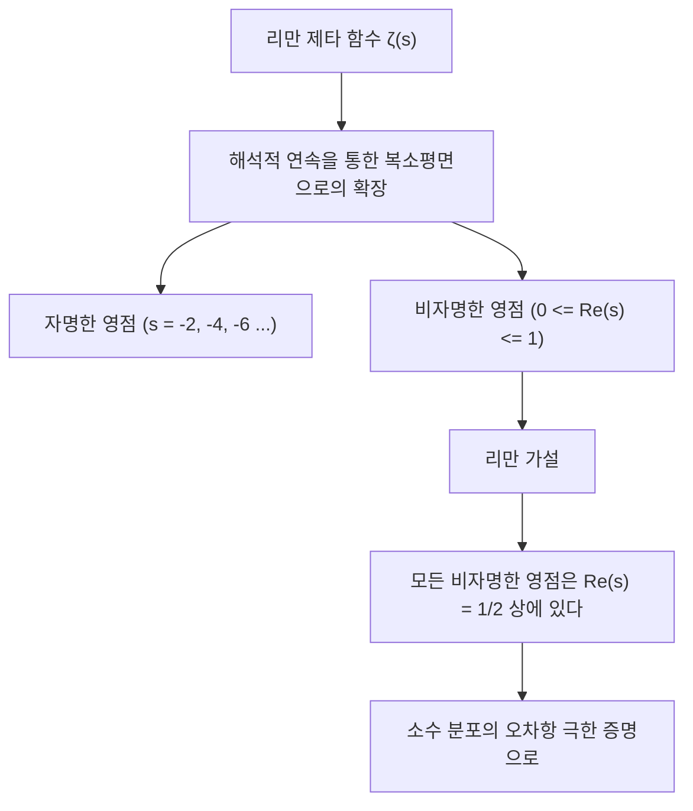
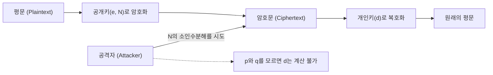
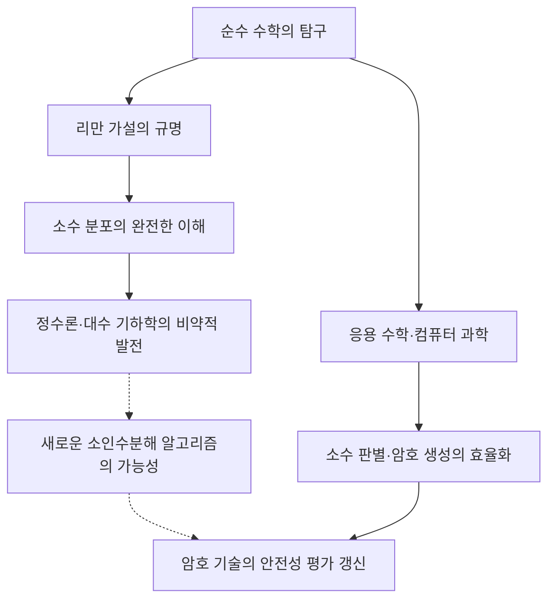

# 1. 서론: 소수라는 우주의 신비와 리만 가설

'소수(Prime Numbers)'는 1과 자기 자신으로만 나누어 떨어지는 자연수이며, 수학 세계에서 '원자'라고도 불립니다. 2, 3, 5, 7, 11, 13... 으로 이어지는 이 수열은 언뜻 보면 무질서하고 무작위로 나타나는 것처럼 보입니다. 고대 그리스의 수학자 유클리드가 '소수가 무한히 존재한다'는 것을 증명한 이후, 수많은 수학자들이 이 소수의 배열에 숨겨진 규칙성을 밝혀내기 위해 도전해 왔습니다.

그 소수의 수수께끼에 가장 근접한 것이 1859년 독일의 수학자 베른하르트 리만(Bernhard Riemann)이 제안한 **'리만 가설(Riemann Hypothesis)'**입니다. 리만 가설은 현대 수학에서 가장 중요하고 미해결된 난제 중 하나이며, 클레이 수학연구소가 정한 밀레니엄 현상 문제 중 하나로 100만 달러의 상금이 걸려 있습니다.

언뜻 보기에 소수의 분포에 관한 순수 수학의 난제는 우리의 일상생활과는 무관해 보일지도 모릅니다. 하지만 현대 사회의 인프라를 지탱하는 인터넷 보안, 특히 **RSA 암호나 타원곡선암호(ECC) 같은 현대 암호 기술**은 거대한 소수의 성질에 깊이 의존하고 있습니다.

이 글에서는 소수의 분포에서 소수 정리, 리만 제타 함수, 그리고 리만 가설의 핵심에 이르는 수학적 여정을 떠나며, 그것이 어떻게 현대 암호 기술과 연결되어 있는지, 그리고 만약 리만 가설이 증명된다면 세상은 어떻게 될지에 대해 매우 상세하고 깊이 있게 파헤쳐 설명합니다.

---

# 2. 소수 정리와 소수의 분포: 가우스의 발견

소수가 어떻게 분포되어 있는지를 이해하기 위해, 수학자들은 '어떤 수 $x$ 이하의 소수가 몇 개 존재하는가'를 나타내는 **소수 계수 함수(Prime-counting function)** $\pi(x)$ 를 고안했습니다.

예를 들어:
- $\pi(10) = 4$ (2, 3, 5, 7)
- $\pi(100) = 25$
- $\pi(1000) = 168$

15세의 천재 수학자 카를 프리드리히 가우스(Carl Friedrich Gauss)는 방대한 소수표를 계산하여 소수의 출현 빈도가 자연로그 $\ln x$ 에 반비례하여 감소해 나간다는 것을 발견했습니다. 즉, 어떤 수 $x$ 근처에서 소수가 발견될 확률은 약 $\frac{1}{\ln x}$ 일 것이라고 예상한 것입니다.

이것을 적분을 사용하여 표현한 것이 **로그 적분(Logarithmic integral)** $\text{Li}(x)$ 입니다.

$$ \text{Li}(x) = \int_{2}^{x} \frac{dt}{\ln t} $$

가우스의 예상은 훗날 1896년 자크 아다마르와 샤를 장 드 라 발레 푸생에 의해 독립적으로 증명되었고, **소수 정리(Prime Number Theorem, PNT)**로서 확립되었습니다.

$$ \lim_{x \to \infty} \frac{\pi(x)}{\text{Li}(x)} = 1 $$

또는 근사적으로 다음과 같이 표현됩니다.

$$ \pi(x) \sim \frac{x}{\ln x} $$

이 정리에 의해, 소수는 거시적으로 보면 매우 매끄럽고 예측 가능한 분포를 가지고 있다는 것을 알게 되었습니다. 하지만 미시적으로 보면 $\pi(x)$ 와 $\text{Li}(x)$ 사이에는 항상 '오차', 즉 '요동(fluctuation)'이 존재합니다. 이 요동의 실체야말로 리만 가설이 밝혀내고자 하는 가장 큰 미스터리인 것입니다.

---

# 3. 리만 제타 함수와 오일러 곱

소수의 분포를 분석하는 데 있어 가장 강력한 무기가 되는 것이 **리만 제타 함수(Riemann Zeta Function)**입니다. 원래는 레온하르트 오일러(Leonhard Euler)에 의해 실수 $s > 1$ 에 대해 정의된 무한급수였습니다.

$$ \zeta(s) = \sum_{n=1}^\infty \frac{1}{n^s} = 1 + \frac{1}{2^s} + \frac{1}{3^s} + \frac{1}{4^s} + \dots $$

오일러의 가장 큰 업적 중 하나는, 이 무한급수가 모든 소수 $p$ 에 대한 무한곱으로 표현될 수 있음을 증명한 것입니다. 이것이 **오일러 곱(Euler Product Formula)**입니다.

$$ \zeta(s) = \prod_{p \text{ prime}} \frac{1}{1 - p^{-s}} = \left( \frac{1}{1 - 2^{-s}} \right) \left( \frac{1}{1 - 3^{-s}} \right) \left( \frac{1}{1 - 5^{-s}} \right) \dots $$

증명의 직관적인 이해는 우변의 각 항을 등비급수로 전개하고 그것들을 곱하면, 산술의 기본 정리(모든 자연수는 소수의 곱으로 유일하게 표현된다)에 의해 좌변의 자연수의 역수 합이 완전히 재구성된다는 것입니다.

**이 단 하나의 수식이 해석학(무한급수·연속함수)과 정수론(소수·이산적인 수)을 연결하는 다리가 되었습니다.** 제타 함수를 조사하는 것은 소수의 분포를 조사하는 것과 같은 의미입니다.

---

# 4. 해석적 연속과 복소평면으로의 확장

리만의 천재성은 오일러가 실수로만 생각했던 $\zeta(s)$ 의 변수 $s$ 를 **복소수 $s = \sigma + it$($\sigma$ 는 실수부, $t$ 는 허수부)**로 확장한 데 있습니다.

원래의 무한급수는 $\sigma > 1$ 에서만 수렴하지만, 리만은 '해석적 연속(Analytic Continuation)'이라는 기법을 사용하여 $s = 1$ 의 극을 제외한 전체 복소평면상에서 $\zeta(s)$ 가 의미를 갖도록 정의를 확장했습니다.

그는 더 나아가 제타 함수가 만족하는 아름다운 함수 방정식(Functional equation)을 이끌어냈습니다.

$$ \zeta(s) = 2^s \pi^{s-1} \sin\left(\frac{\pi s}{2}\right) \Gamma(1-s) \zeta(1-s) $$

여기서 $\Gamma(x)$ 는 감마 함수입니다. 이 방정식에 의해 우반평면의 성질로부터 좌반평면의 성질을 알 수 있습니다.

### 영점(Zeros of the Zeta Function)
제타 함수의 값이 0이 되는 복소수 $s$ 를 '영점'이라고 부릅니다.
함수 방정식에서 $s$ 가 음의 짝수($-2, -4, -6, \dots$)일 때 $\sin(\pi s / 2)$ 가 0이 되므로, $\zeta(s) = 0$ 이 됩니다. 이것들은 **자명한 영점(Trivial zeros)**이라고 불립니다.

그러나 소수의 분포에서 중요한 것은 그 외의 영점, 즉 $0 \le \sigma \le 1$ 인 '임계 영역(Critical strip)'에 존재하는 **비자명한 영점(Non-trivial zeros)**입니다.

---

# 5. 리만 가설의 핵심과 명시 공식

리만은 소수의 영점을 계산하고 어떤 놀라운 가설을 세웠습니다. 이것이 **리만 가설**입니다.

> **리만 가설 (Riemann Hypothesis)**
> 리만 제타 함수 $\zeta(s)$ 의 비자명한 영점은 모두 실수부가 $1/2$ 인 직선상($\text{Re}(s) = 1/2$)에 존재한다.

이 실수부가 1/2인 직선을 '임계선(Critical line)'이라고 부릅니다.

왜 리만 가설이 그토록 중요한 것일까요? 그것은 제타 함수의 영점이 소수의 분포를 **완전히** 결정하고 있기 때문입니다.

리만과 후대의 수학자 폰 망골트(von Mangoldt)는 소수의 분포를 정확하게 기술하는 '명시 공식(Explicit formula)'을 도출했습니다. 체비쇼프 함수 $\psi(x)$ 를 사용하면 다음과 같이 표현됩니다.

$$ \psi(x) = x - \sum_{\rho} \frac{x^\rho}{\rho} - \ln(2\pi) - \frac{1}{2}\ln(1 - x^{-2}) $$

여기서 $\rho$ 는 제타 함수의 모든 비자명한 영점을 지나는 합입니다.
주항은 $x$ (이것은 소수 정리에 대응)이며, 거기서 영점 $\rho$ 에 의존하는 파동 같은 항을 더하고 뺌으로써 소수의 계단형태의 정확한 분포가 복원되는 것입니다. 비자명한 영점은 소수 분포의 '주파수(파동)'를 나타낸다고 할 수 있습니다.

만약 리만 가설이 맞고, 모든 비자명한 영점 $\rho$ 의 실수부가 정확히 $1/2$ 이라면, 소수 정리의 오차항은 이론상 상상할 수 있는 최소 범위 내에 수렴하게 됩니다.

$$ |\pi(x) - \text{Li}(x)| \le \frac{1}{8\pi} \sqrt{x} \ln x \quad \text{for} \quad x \ge 2657 $$

즉, **리만 가설이 참이라면, 소수는 우리가 상상할 수 있는 한 가장 '규칙적이고 아름답게' 분포하고 있다**는 것이 증명되는 것입니다.

---

# 6. 현대 암호 기술과 소수의 불가분한 관계

여기까지는 심오한 순수 수학의 세계였지만, 이 소수의 성질은 현대의 디지털 사회를 근본적으로 지탱하고 있습니다. 그 대표적인 예가 **RSA 암호**를 비롯한 공개키 암호 방식입니다.

인터넷에서의 신용카드 결제, 비밀번호 전송, 블록체인의 전자 서명 등 모든 통신의 안전성은 '소수'에 의존하고 있습니다.

### RSA 암호의 원리
RSA 암호의 안전성은 '자릿수가 큰 합성수의 소인수분해는 매우 어렵다'는 수학적 사실(소인수분해 문제)에 기반하고 있습니다.

1. **키 생성**:
   거대한 소수 $p$ 와 $q$ (예를 들어 각각 2048비트)를 무작위로 선택합니다.
   이들을 곱하여 $N = p \times q$ 를 계산합니다. 이 $N$ 이 공개키의 일부가 됩니다.
   오일러의 파이 함수 $\phi(N) = (p-1)(q-1)$ 을 사용하여 개인키 $d$ 를 생성합니다.
   
   $$ e \times d \equiv 1 \pmod{\phi(N)} $$

2. **암호화와 복호화**:
   평문 $M$ 은 공개키 $e, N$ 을 사용하여 암호문 $C$ 로 변환됩니다.
   $$ C \equiv M^e \pmod{N} $$
   개인키 $d$ 를 가진 사람만이 복호화할 수 있습니다.
   $$ M \equiv C^d \pmod{N} $$

RSA 암호를 깨기 위해서는 거대한 $N$ 에서 원래의 소수 $p$ 와 $q$ 를 찾아내야(소인수분해해야) 합니다. 현재 주류인 알고리즘(일반 수체 체: GNFS 등)을 사용하더라도, 수백 자리의 수를 소인수분해하려면 슈퍼컴퓨터를 사용해도 우주의 나이를 훨씬 초과하는 시간이 걸리는 것으로 알려져 있습니다.

---

# 7. 리만 가설이 암호 기술에 미치는 영향

그렇다면 순수 수학의 정점에 있는 '리만 가설'과 '암호 기술'은 어떻게 교차하는 것일까요?

### 7.1. 소수 생성 알고리즘(소수 판별)과 일반화된 리만 가설(GRH)
RSA 암호를 운용하기 위해서는 먼저 거대한 소수 $p$ 와 $q$ 를 생성해야 합니다. 하지만 '어떤 수가 소수인지'를 확실하고 빠르게 판별하는 것은 쉽지 않습니다.

현재 실용적으로 사용되고 있는 것은 **밀러-라빈 소수 판별법(Miller-Rabin primality test)**이라는 확률적 알고리즘입니다. 이 알고리즘은 매우 빠르지만, 아주 낮은 확률로 합성수를 소수라고 잘못 판별하는 '유사소수'의 위험이 있습니다.

하지만 리만 가설을 디리클레 L-함수로 확장한 **'일반화된 리만 가설(Generalized Riemann Hypothesis, GRH)'**이 참이라고 가정하면 이야기는 극적으로 달라집니다.
GRH가 참이라면, 밀러-라빈 판별법에서의 테스트 횟수 상한이 수학적으로 보장되어 확률적 알고리즘에서 **'결정론적 다항 시간 알고리즘'으로 승화**하는 것입니다(이는 AKS 소수 판별법이 발견되기 이전부터 알려져 있던 중대한 사실이었습니다).

즉, 리만 가설(및 그 확장)은 '거대한 소수를 절대적인 확신을 가지고 빠르게 생성할 수 있는가'라는 암호의 기반 생성에 직접적인 보증을 부여하는 역할을 가지고 있습니다.

### 7.2. 소인수분해 알고리즘과의 관계
암호를 해독하는 쪽의 알고리즘(일반 수체 체 등)의 계산 복잡도를 평가할 때도 소수의 분포에 관한 지식이 필수적입니다. 소인수분해 알고리즘의 대부분은 '매끄러운 수(Smooth numbers: 작은 소인수만을 가지는 수)'의 분포에 의존하고 있습니다.

매끄러운 수가 어느 정도의 빈도로 나타나는지를 엄밀하게 평가하기 위해서는 소수의 분포에 관한 깊은 이해가 필요하며, 여기서도 제타 함수나 리만 가설에 직결되는 해석적 정수론의 기법이 구사되고 있습니다. 리만 가설이 증명되어 소수 분포의 오차가 완전히 결정된다면, 소인수분해 알고리즘의 성능 한계도 더욱 정확하게 파악할 수 있게 됩니다.

---

# 8. 만약 리만 가설이 증명된다면, 암호는 뚫릴 것인가?

도시 괴담처럼 '리만 가설이 풀리면 RSA 암호는 순식간에 붕괴한다'고 이야기되는 경우가 있지만, **이는 수학적으로 부정확합니다**.

리만 가설의 증명 자체가 즉각적으로 소인수분해를 극적으로 고속화하는 마법의 알고리즘을 만들어내는 것은 아닙니다. 리만 가설은 어디까지나 소수의 '거시적인 분포의 규칙성'에 대한 정리이며, 개별 수 $N$ 이 어떤 소수로 나누어떨어지는지(국소적인 성질)를 직접 가르쳐 주는 것은 아니기 때문입니다.

하지만 그 영향이 제로는 아닙니다.
리만 가설이 증명되는 과정에서 **'새로운 수학적 도구'나 '미지의 해석 기법'이 발견될 가능성**이 매우 높기 때문입니다. 역사를 보더라도, 페르마의 마지막 정리나 푸앵카레 추측이 증명되었을 때 그 과정에서 개발된 새로운 이론이 수학 전체를 크게 도약시켰습니다.

만약 리만 제타 함수의 영점의 성질을 완전히 조작할 수 있는 미지의 대수 기하학적 기법이나, 비가환 기하의 기법이 확립된다면, 그것이 결과적으로 소인수분해의 획기적인 알고리즘(예를 들어, 계산 복잡도를 다항 시간으로 줄이는 고전 알고리즘)의 발견으로 이어질 가능성은 부정할 수 없습니다. 그런 의미에서 암호학자들은 리만 가설의 동향에서 결코 눈을 뗄 수 없는 것입니다.

### 양자 컴퓨터와 쇼어의 알고리즘
암호 기술에 있어 보다 직접적이고 현실적인 위협은 리만 가설의 증명이 아니라 **양자 컴퓨터**입니다. 1994년 피터 쇼어(Peter Shor)가 발표한 '쇼어의 알고리즘'은 충분한 성능을 가진 양자 컴퓨터가 있다면 소인수분해를 다항 시간에 풀 수 있음을 증명했습니다. 이로 인해 RSA 암호나 타원곡선암호는 근본적으로 뚫리게 됩니다.

현재 전 세계적으로 양자 컴퓨터로도 해독할 수 없는 '양자 내성 암호(Post-Quantum Cryptography, PQC)'로의 전환(격자 암호 등)이 추진되고 있습니다. 소수에 의존한 암호 기술은 어떤 의미에서 황금기를 끝내려 하고 있는지도 모르지만, 소수 그 자체의 수학적 가치가 사라지는 일은 영원히 없을 것입니다.

---

# 9. 결론: 수학의 추상성과 현실 사회의 교차점

고대 그리스부터 이어져 온 소수에 대한 끝없는 탐구는 리만이라는 천재에 의해 복소평면상의 아름다운 심포니(제타 함수의 영점)로 승화되었습니다. 그리고 놀랍게도 그 순수무구한 수학의 결정체가 수세기의 시간을 거쳐 인터넷 사회의 안전을 담보하는 최강의 방패로서 응용되고 있습니다.

리만 가설은 수학이 가진 '추상적인 아름다움'과 '물리 세계·현실 사회에 대한 경이로운 적용력'을 동시에 상징하는 존재입니다.

아직 아무도 정상에 도달하지 못한 이 거대한 수학의 산이 언젠가 정복될 때, 우리는 소수라는 우주의 진리를 완전히 이해함과 동시에 정보화 사회의 기반에 대해 새로운 시각을 갖게 될 것입니다. 암호 기술을 배우는 것은 그대로 인류 지혜의 역사를 따라가는 여정이기도 한 것입니다.
