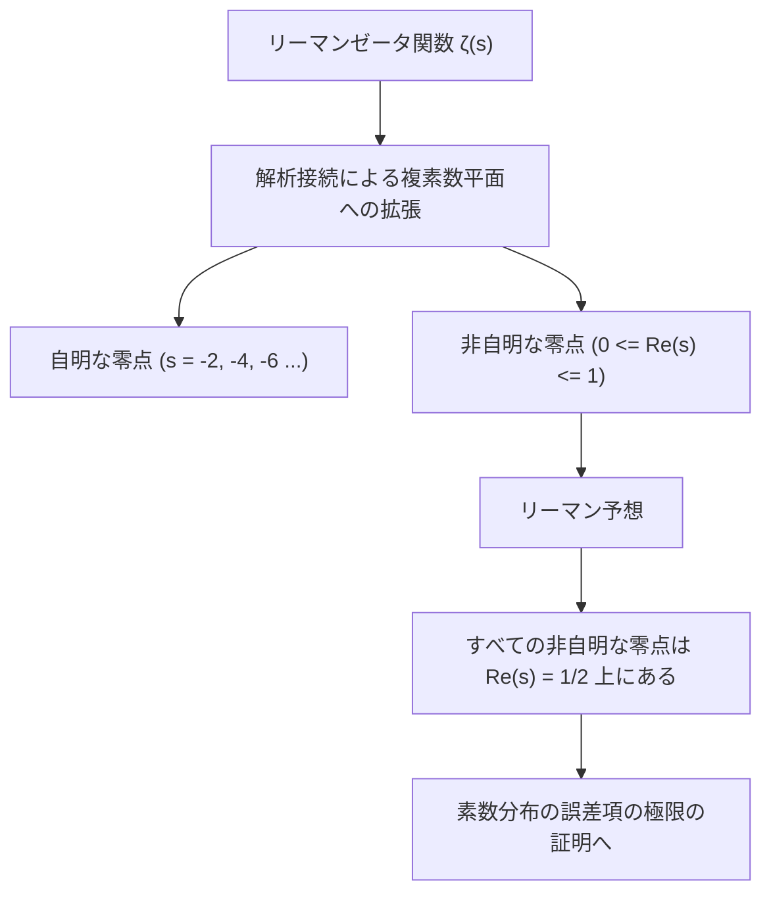
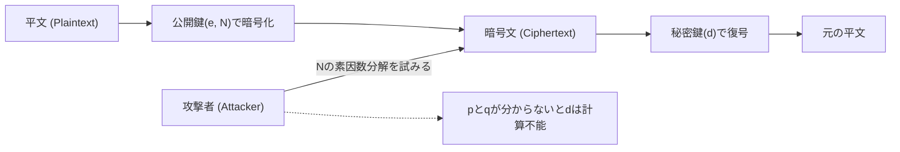
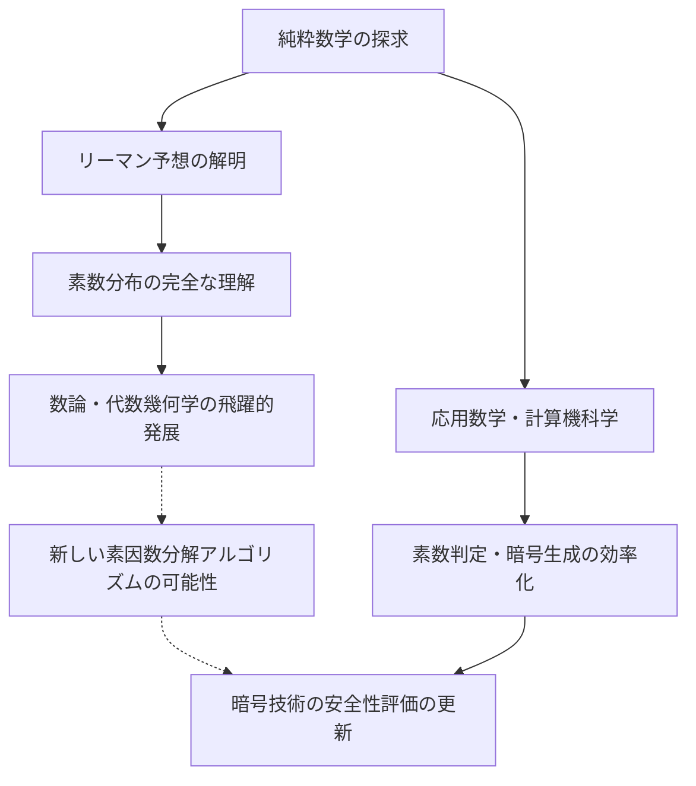

# 1. はじめに：素数という宇宙の神秘とリーマン予想

「素数（Prime Numbers）」は、1と自分自身でしか割り切れない自然数であり、数学の世界における「原子」とも呼ばれます。2, 3, 5, 7, 11, 13... と続くこの数列は、一見すると無秩序でランダムに現れるように見えます。古代ギリシャの数学者ユークリッドが「素数が無限に存在すること」を証明して以来、数え切れないほどの数学者たちがこの素数の並びに潜む規則性を解き明かそうと挑んできました。

その素数の謎に最も肉薄したのが、1859年にドイツの数学者ベルンハルト・リーマン（Bernhard Riemann）が提唱した**「リーマン予想（Riemann Hypothesis）」**です。リーマン予想は、現代数学において最も重要かつ未解決の難問の一つであり、クレイ数学研究所が定めるミレニアム懸賞問題の一つとして100万ドルの賞金が懸けられています。

一見すると、素数の分布に関する純粋数学の難問は、私たちの日常生活とは無縁に思えるかもしれません。しかし、現代社会のインフラを支えるインターネットのセキュリティ、特に**RSA暗号や楕円曲線暗号（ECC）といった現代暗号技術**は、巨大な素数の性質に深く依存しています。

本記事では、素数の分布から素数定理、リーマンゼータ関数、そしてリーマン予想の核心へと至る数学的な旅をし、それがどのようにして現代暗号技術と結びついているのか、そしてもしリーマン予想が証明されたら世界はどうなるのかについて、極めて詳細かつ深く掘り下げて解説します。

---

# 2. 素数定理と素数の分布：ガウスの発見

素数がどのように分布しているのかを理解するために、数学者たちは「ある数 $x$ 以下の素数がいくつ存在するか」を表す**素数計数関数（Prime-counting function）** $\pi(x)$ を考えました。

例えば：
- $\pi(10) = 4$ （2, 3, 5, 7）
- $\pi(100) = 25$
- $\pi(1000) = 168$

15歳の天才数学者カール・フリードリヒ・ガウス（Carl Friedrich Gauss）は、膨大な素数の表を計算し、素数の出現頻度が自然対数 $\ln x$ に反比例して減少していくことを見出しました。つまり、ある数 $x$ の付近で素数が見つかる確率は約 $\frac{1}{\ln x}$ であると予想したのです。

これを積分を用いて表現したものが、**対数積分（Logarithmic integral）** $\text{Li}(x)$ です。

$$ \text{Li}(x) = \int_{2}^{x} \frac{dt}{\ln t} $$

ガウスの予想は、後に1896年にジャック・アダマールとシャルル＝ジャン・ド・ラ・ヴァレ・プーサンによって独立に証明され、**素数定理（Prime Number Theorem, PNT）**として確立されました。

$$ \lim_{x \to \infty} \frac{\pi(x)}{\text{Li}(x)} = 1 $$

または近似的に以下のように表されます。

$$ \pi(x) \sim \frac{x}{\ln x} $$

この定理により、素数は巨視的に見れば非常に滑らかで予測可能な分布を持っていることがわかりました。しかし、微視的に見れば $\pi(x)$ と $\text{Li}(x)$ の間には常に「誤差」すなわち「揺らぎ」が存在します。この揺らぎの正体こそが、リーマン予想が解き明かそうとしている最大のミステリーなのです。

---

# 3. リーマンゼータ関数とオイラー積

素数の分布を解析する上で最強の武器となるのが**リーマンゼータ関数（Riemann Zeta Function）**です。もともとはレオンハルト・オイラー（Leonhard Euler）によって実数 $s > 1$ に対して定義された無限級数でした。

$$ \zeta(s) = \sum_{n=1}^\infty \frac{1}{n^s} = 1 + \frac{1}{2^s} + \frac{1}{3^s} + \frac{1}{4^s} + \dots $$

オイラーの最大の功績の一つは、この無限級数が、すべての素数 $p$ に関する無限積として表せることを証明したことです。これが**オイラー積（Euler Product Formula）**です。

$$ \zeta(s) = \prod_{p \text{ prime}} \frac{1}{1 - p^{-s}} = \left( \frac{1}{1 - 2^{-s}} \right) \left( \frac{1}{1 - 3^{-s}} \right) \left( \frac{1}{1 - 5^{-s}} \right) \dots $$

証明の直感的な理解は、右辺の各項を等比級数として展開し、それらを掛け合わせると、算術の基本定理（すべての自然数は素数の積として一意に表される）により、左辺の自然数の逆数和が完全に再構築されるというものです。

**このたった一つの数式が、解析学（無限級数・連続関数）と数論（素数・離散的な数）を繋ぐ架け橋となりました。** ゼータ関数を調べることは、素数の分布を調べることと同義なのです。

---

# 4. 解析接続と複素平面への拡張

リーマンの天才性は、オイラーが実数のみで考えていた $\zeta(s)$ の変数 $s$ を、**複素数 $s = \sigma + it$（$\sigma$ は実部、$t$ は虚部）**に拡張したことにあります。

もともとの無限級数は $\sigma > 1$ でしか収束しませんが、リーマンは「解析接続（Analytic Continuation）」という手法を用いて、$s = 1$ の極を除外した全複素平面上で $\zeta(s)$ が意味を持つように定義を拡張しました。

彼はさらに、ゼータ関数が満たす美しい関数等式（Functional equation）を導き出しました。

$$ \zeta(s) = 2^s \pi^{s-1} \sin\left(\frac{\pi s}{2}\right) \Gamma(1-s) \zeta(1-s) $$

ここで $\Gamma(x)$ はガンマ関数です。この等式により、右半平面の性質から左半平面の性質を知ることができます。

### 零点（Zeros of the Zeta Function）
ゼータ関数の値が 0 になる複素数 $s$ を「零点」と呼びます。
関数等式から、$s$ が負の偶数（$-2, -4, -6, \dots$）のとき、$\sin(\pi s / 2)$ が 0 になるため、$\zeta(s) = 0$ となります。これらは**自明な零点（Trivial zeros）**と呼ばれます。

しかし、素数の分布において重要なのは、それ以外の零点、すなわち $0 \le \sigma \le 1$ の「臨界領域（Critical strip）」に存在する**非自明な零点（Non-trivial zeros）**です。

---

# 5. リーマン予想の核心と明示公式

リーマンは、少数の零点を計算し、ある驚くべき予想を立てました。これが**リーマン予想**です。

> **リーマン予想 (Riemann Hypothesis)**
> リーマンゼータ関数 $\zeta(s)$ の非自明な零点はすべて、実部が $1/2$ の直線上（$\text{Re}(s) = 1/2$）に存在する。

この実部が1/2の直線を「臨界線（Critical line）」と呼びます。

なぜリーマン予想がそれほど重要なのでしょうか？それは、ゼータ関数の零点が素数の分布を**完全に**決定しているからです。

リーマンと後の数学者フォン・マンゴルトは、素数の分布を正確に記述する「明示公式（Explicit formula）」を導きました。チェビシェフ関数 $\psi(x)$ を用いると、以下のように表されます。

$$ \psi(x) = x - \sum_{\rho} \frac{x^\rho}{\rho} - \ln(2\pi) - \frac{1}{2}\ln(1 - x^{-2}) $$

ここで $\rho$ はゼータ関数の非自明な零点をすべてわたる和です。
主項は $x$ （これは素数定理に対応）であり、そこから零点 $\rho$ に依存する波のような項を足し引きすることで、素数の階段状の正確な分布が復元されるのです。非自明な零点は、素数の分布の「周波数（波）」を表していると言えます。

もしリーマン予想が正しく、すべての非自明な零点 $\rho$ の実部がちょうど $1/2$ であるならば、素数定理の誤差項は理論上考えうる最小の範囲に収まることになります。

$$ |\pi(x) - \text{Li}(x)| \le \frac{1}{8\pi} \sqrt{x} \ln x \quad \text{for} \quad x \ge 2657 $$

つまり、**リーマン予想が真であれば、素数は私たちが想像し得る限り最も「規則正しく、美しく」分布している**ことが証明されるのです。

---

# 6. 現代暗号技術と素数の不可分な関係

ここまでは深遠な純粋数学の世界でしたが、この素数の性質は現代のデジタル社会を根底から支えています。その代表が**RSA暗号**をはじめとする公開鍵暗号方式です。

インターネットでのクレジットカード決済、パスワードの送信、ブロックチェーンの電子署名など、あらゆる通信の安全性は「素数」に依存しています。

### RSA暗号の仕組み
RSA暗号の安全性は、「桁数の大きい合成数の素因数分解は非常に困難である」という数学的事実（素因数分解問題）に基づいています。

1. **鍵生成**:
   巨大な素数 $p$ と $q$ （例えばそれぞれ2048ビット）をランダムに選びます。
   それらを掛け合わせて $N = p \times q$ を計算します。この $N$ が公開鍵の一部となります。
   オイラーのトーティエント関数 $\phi(N) = (p-1)(q-1)$ を用いて、秘密鍵 $d$ を生成します。
   
   $$ e \times d \equiv 1 \pmod{\phi(N)} $$

2. **暗号化と復号**:
   平文 $M$ は、公開鍵 $e, N$ を用いて暗号文 $C$ に変換されます。
   $$ C \equiv M^e \pmod{N} $$
   秘密鍵 $d$ を持つ者だけが、復号できます。
   $$ M \equiv C^d \pmod{N} $$

RSA暗号を破るためには、巨大な $N$ から元の素数 $p$ と $q$ を見つけ出す（素因数分解する）必要があります。現在主流のアルゴリズム（一般数体篩法：GNFSなど）を用いても、何百桁もの数を素因数分解するには、スーパーコンピュータを使っても宇宙の年齢をはるかに超える時間がかかるとされています。

---

# 7. リーマン予想が暗号技術に与えるインパクト

では、純粋数学の頂点にある「リーマン予想」と「暗号技術」はどのように交差するのでしょうか？

### 7.1. 素数生成アルゴリズム（素数判定）と拡張リーマン予想（GRH）
RSA暗号を運用するためには、最初に巨大な素数 $p$ と $q$ を生成する必要があります。しかし、「ある数が素数かどうか」を確実かつ高速に判定するのは簡単ではありません。

現在、実用的に使われているのは**ミラー・ラビン素数判定法（Miller-Rabin primality test）**という確率的アルゴリズムです。このアルゴリズムは高速ですが、極めて低い確率で合成数を素数と誤判定する「擬素数」のリスクがあります。

しかし、リーマン予想をディリクレのL関数に拡張した**「拡張リーマン予想（Generalized Riemann Hypothesis, GRH）」**が真であると仮定すると、話は劇的に変わります。
GRHが真であれば、ミラー・ラビン判定法におけるテスト回数の上限が数学的に保証され、確率的アルゴリズムから**「決定性多項式時間アルゴリズム」へと昇華**するのです（これは、AKS素数判定法が発見される以前から知られていた重大な事実でした）。

つまり、リーマン予想（およびその拡張）は、「巨大な素数を絶対の自信を持って高速に生成できるか」という暗号の基盤生成に直接的なお墨付きを与える役割を持っています。

### 7.2. 素因数分解アルゴリズムとの関係
暗号を解読する側のアルゴリズム（一般数体篩法など）の計算量を評価する際にも、素数の分布に関する知識が不可欠です。素因数分解アルゴリズムの多くは「滑らかな数（Smooth numbers：小さな素因数しか持たない数）」の分布に依存しています。

滑らかな数がどの程度の頻度で現れるかを厳密に評価するためには、素数の分布に関する深い理解が必要であり、ここでもゼータ関数やリーマン予想に直結する解析的整数論のテクニックが駆使されています。リーマン予想が証明され、素数分布の誤差が完全に決定されれば、素因数分解アルゴリズムの性能限界もより正確に見極めることが可能になります。

---

# 8. もしリーマン予想が証明されたら、暗号は破られるのか？

都市伝説のように「リーマン予想が解けたらRSA暗号は一瞬で崩壊する」と語られることがありますが、**これは数学的には不正確**です。

リーマン予想の証明自体が、直ちに素因数分解を劇的に高速化する魔法のアルゴリズムを生み出すわけではありません。リーマン予想はあくまで素数の「巨視的な分布の規則性」についての定理であり、個別の数 $N$ がどの素数で割り切れるか（局所的な性質）を直接教えてくれるものではないからです。

しかし、影響はゼロではありません。
リーマン予想が証明される過程で、**「新たな数学的ツール」や「未知の解析手法」が発見される可能性**が極めて高いからです。歴史を見ても、フェルマーの最終定理やポアンカレ予想が証明された際、その過程で開発された新しい理論が数学全体を大きく飛躍させました。

もしリーマンゼータ関数の零点の性質を完全に操作できる未知の代数幾何学的手法や、非可換幾何の手法が確立されれば、それが結果として素因数分解の画期的なアルゴリズム（例えば、計算量を多項式時間に落とし込むような古典アルゴリズム）の発見に繋がる可能性は否定できません。その意味で、暗号学者はリーマン予想の動向から決して目を離すことができないのです。

### 量子コンピュータとショアのアルゴリズム
暗号技術にとってより直接的で現実的な脅威は、リーマン予想の証明ではなく**量子コンピュータ**です。1994年にピーター・ショア（Peter Shor）が発表した「ショアのアルゴリズム」は、十分な性能を持つ量子コンピュータがあれば、素因数分解を多項式時間で解けることを証明しました。これにより、RSA暗号や楕円曲線暗号は根本的に破られることになります。

現在、世界中で量子コンピュータでも解読できない「耐量子計算機暗号（Post-Quantum Cryptography, PQC）」への移行（格子暗号など）が進められています。素数に依存した暗号技術は、ある意味で黄金期を終えようとしているのかもしれませんが、素数そのものの数学的価値が失われることは永遠にありません。

---

# 9. 結び：数学の抽象性と現実社会の交差点

古代ギリシャから続く素数への飽くなき探求は、リーマンという天才によって複素数平面上の美しいシンフォニー（ゼータ関数の零点）へと昇華されました。そして驚くべきことに、その純粋無垢な数学の結晶が、数世紀の時を経てインターネット社会の安全を担保する最強の盾として応用されています。

リーマン予想は、数学が持つ「抽象的な美しさ」と「物理世界・現実社会への驚異的な適用力」を同時に象徴する存在です。

未だ誰も頂上に到達していないこの巨大な数学の山がいつの日か征服されたとき、私たちは素数という宇宙の真理を完全に理解するとともに、情報化社会の基盤に対して新たな視点を持つことになるでしょう。暗号技術を学ぶことは、そのまま人類の英知の歴史を辿る旅でもあるのです。
