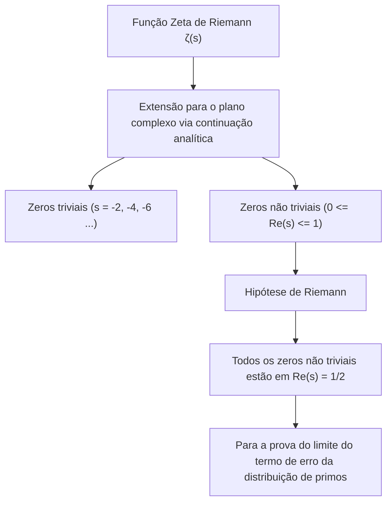
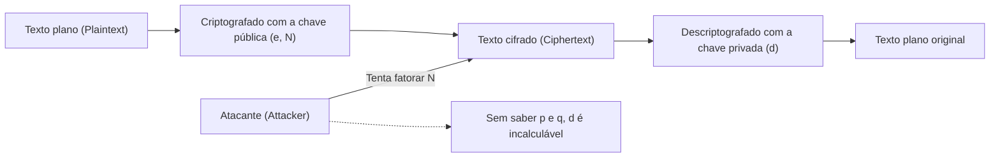
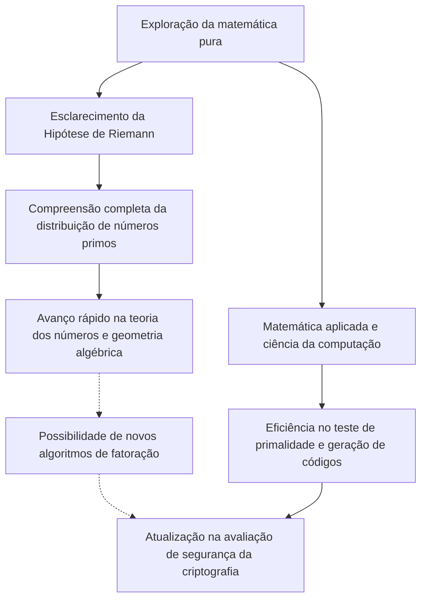

# 1. Introdução: O Mistério Cósmico dos Números Primos e a Hipótese de Riemann

Os "Números Primos" (Prime Numbers) são números naturais divisíveis apenas por 1 e por si mesmos, sendo frequentemente chamados de "átomos" do mundo da matemática. Essa sequência que segue como 2, 3, 5, 7, 11, 13... parece, à primeira vista, desordenada e aleatória. Desde que o matemático grego antigo Euclides provou que "os números primos são infinitos", incontáveis matemáticos têm tentado desvendar os padrões ocultos nessa disposição de primos.

Aquele que chegou mais perto de desvendar esse mistério dos números primos foi o matemático alemão Bernhard Riemann, que propôs a **"Hipótese de Riemann" (Riemann Hypothesis)** em 1859. A Hipótese de Riemann é um dos problemas mais importantes e não resolvidos da matemática moderna, com um prêmio de 1 milhão de dólares oferecido pelo Instituto de Matemática Clay como um dos Problemas do Prêmio Millennium.

À primeira vista, pode parecer que esse problema formidável da matemática pura sobre a distribuição de números primos não tenha relação com o nosso dia a dia. No entanto, a segurança da internet, que sustenta a infraestrutura da sociedade moderna, especialmente as **tecnologias de criptografia modernas como a criptografia RSA e a criptografia de curva elíptica (ECC)**, depende profundamente das propriedades de números primos gigantescos.

Neste artigo, faremos uma jornada matemática partindo da distribuição dos números primos até o Teorema dos Números Primos, a função zeta de Riemann e o núcleo da Hipótese de Riemann, explorando de forma extremamente detalhada e profunda como isso se conecta com a criptografia moderna e o que aconteceria com o mundo se a Hipótese de Riemann fosse provada.

---

# 2. O Teorema dos Números Primos e a Distribuição de Primos: A Descoberta de Gauss

Para entender como os números primos estão distribuídos, os matemáticos conceberam a **função de contagem de números primos (Prime-counting function)** $\pi(x)$, que representa "quantos números primos existem menores ou iguais a um dado número $x$".

Por exemplo:
- $\pi(10) = 4$ (2, 3, 5, 7)
- $\pi(100) = 25$
- $\pi(1000) = 168$

O gênio matemático de 15 anos, Carl Friedrich Gauss, calculou extensas tabelas de números primos e descobriu que a frequência de aparecimento dos números primos diminui de forma inversamente proporcional ao logaritmo natural $\ln x$. Em outras palavras, ele conjecturou que a probabilidade de encontrar um número primo perto de um número $x$ é de aproximadamente $\frac{1}{\ln x}$.

Expressando isso por meio de uma integral, obtemos o **logaritmo integral (Logarithmic integral)** $\text{Li}(x)$.

$$ \text{Li}(x) = \int_{2}^{x} \frac{dt}{\ln t} $$

A conjectura de Gauss foi posteriormente provada de forma independente por Jacques Hadamard e Charles Jean de la Vallée Poussin em 1896, estabelecendo-se como o **Teorema dos Números Primos (Prime Number Theorem, PNT)**.

$$ \lim_{x \to \infty} \frac{\pi(x)}{\text{Li}(x)} = 1 $$

Ou, de forma aproximada, pode ser expresso como:

$$ \pi(x) \sim \frac{x}{\ln x} $$

Este teorema mostrou que, de uma perspectiva macroscópica, os números primos têm uma distribuição muito suave e previsível. No entanto, microscopicamente, sempre existe um "erro", ou seja, uma "flutuação" entre $\pi(x)$ e $\text{Li}(x)$. A verdadeira natureza dessa flutuação é exatamente o maior mistério que a Hipótese de Riemann tenta desvendar.

---

# 3. A Função Zeta de Riemann e o Produto de Euler

A arma mais poderosa para analisar a distribuição dos números primos é a **Função Zeta de Riemann (Riemann Zeta Function)**. Originalmente, era uma série infinita definida por Leonhard Euler para números reais $s > 1$.

$$ \zeta(s) = \sum_{n=1}^\infty \frac{1}{n^s} = 1 + \frac{1}{2^s} + \frac{1}{3^s} + \frac{1}{4^s} + \dots $$

Uma das maiores conquistas de Euler foi provar que esta série infinita pode ser expressa como um produto infinito sobre todos os números primos $p$. Este é o **Produto de Euler (Euler Product Formula)**.

$$ \zeta(s) = \prod_{p \text{ prime}} \frac{1}{1 - p^{-s}} = \left( \frac{1}{1 - 2^{-s}} \right) \left( \frac{1}{1 - 3^{-s}} \right) \left( \frac{1}{1 - 5^{-s}} \right) \dots $$

Uma compreensão intuitiva da prova é que, se expandirmos cada termo do lado direito como uma série geométrica e os multiplicarmos, o Teorema Fundamental da Aritmética (que afirma que todo número natural pode ser expresso de forma única como um produto de primos) reconstrói perfeitamente a soma dos recíprocos dos números naturais no lado esquerdo.

**Essa única equação se tornou a ponte que liga a análise (séries infinitas, funções contínuas) à teoria dos números (números primos, números discretos).** Estudar a função zeta é sinônimo de estudar a distribuição dos números primos.

---

# 4. Continuação Analítica e a Extensão para o Plano Complexo

A genialidade de Riemann reside no fato de ele ter estendido a variável $s$ de $\zeta(s)$, que Euler considerava apenas para números reais, para **números complexos $s = \sigma + it$ ($\sigma$ é a parte real e $t$ é a parte imaginária)**.

A série infinita original converge apenas para $\sigma > 1$, mas Riemann usou um método chamado "Continuação Analítica (Analytic Continuation)" para estender a definição de modo que $\zeta(s)$ fizesse sentido em todo o plano complexo, com exceção do polo em $s = 1$.

Ele também derivou uma bela equação funcional (Functional equation) que a função zeta satisfaz.

$$ \zeta(s) = 2^s \pi^{s-1} \sin\left(\frac{\pi s}{2}\right) \Gamma(1-s) \zeta(1-s) $$

Aqui, $\Gamma(x)$ é a função gama. Com esta equação, podemos conhecer as propriedades do semiplano esquerdo a partir das propriedades do semiplano direito.

### Zeros (Zeros of the Zeta Function)
Os números complexos $s$ para os quais o valor da função zeta se torna 0 são chamados de "zeros".
A partir da equação funcional, quando $s$ é um número par negativo ($-2, -4, -6, \dots$), $\sin(\pi s / 2)$ torna-se 0, resultando em $\zeta(s) = 0$. Estes são chamados de **zeros triviais (Trivial zeros)**.

No entanto, o que importa para a distribuição dos números primos são os outros zeros, ou seja, os **zeros não triviais (Non-trivial zeros)**, que existem na "faixa crítica (Critical strip)" onde $0 \le \sigma \le 1$.

---

# 5. O Núcleo da Hipótese de Riemann e a Fórmula Explícita

Riemann calculou alguns zeros e formulou uma conjectura surpreendente. Esta é a **Hipótese de Riemann**.

> **Hipótese de Riemann (Riemann Hypothesis)**
> Todos os zeros não triviais da função zeta de Riemann $\zeta(s)$ encontram-se na linha reta onde a parte real é igual a $1/2$ ($\text{Re}(s) = 1/2$).

Esta reta onde a parte real é 1/2 é chamada de "linha crítica (Critical line)".

Por que a Hipótese de Riemann é tão importante? Porque os zeros da função zeta determinam **completamente** a distribuição dos números primos.

Riemann e o matemático posterior von Mangoldt derivaram a "Fórmula Explícita (Explicit formula)", que descreve com precisão a distribuição dos números primos. Usando a função de Chebyshev $\psi(x)$, ela pode ser expressa da seguinte forma:

$$ \psi(x) = x - \sum_{\rho} \frac{x^\rho}{\rho} - \ln(2\pi) - \frac{1}{2}\ln(1 - x^{-2}) $$

Aqui, a soma é sobre todos os zeros não triviais $\rho$ da função zeta.
O termo principal é $x$ (o que corresponde ao Teorema dos Números Primos), e ao adicionar e subtrair termos ondulatórios que dependem dos zeros $\rho$, a distribuição exata em forma de degraus dos números primos é restaurada. Pode-se dizer que os zeros não triviais representam as "frequências (ondas)" da distribuição dos números primos.

Se a Hipótese de Riemann estiver correta e a parte real de todos os zeros não triviais $\rho$ for exatamente $1/2$, o termo de erro do Teorema dos Números Primos ficará dentro da menor margem teoricamente possível.

$$ |\pi(x) - \text{Li}(x)| \le \frac{1}{8\pi} \sqrt{x} \ln x \quad \text{for} \quad x \ge 2657 $$

Em outras palavras, **se a Hipótese de Riemann for verdadeira, fica provado que os números primos estão distribuídos da forma mais "ordenada e bela" que possamos imaginar**.

---

# 6. A Relação Inseparável entre a Criptografia Moderna e os Números Primos

Até aqui estivemos no mundo profundo da matemática pura, mas essas propriedades dos números primos sustentam fundamentalmente a sociedade digital moderna. O exemplo mais representativo são os sistemas de criptografia de chave pública, como a **criptografia RSA**.

A segurança de todas as comunicações, como pagamentos com cartão de crédito na internet, transmissão de senhas e assinaturas digitais em blockchain, depende dos "números primos".

### Como funciona a Criptografia RSA
A segurança da criptografia RSA é baseada no fato matemático (o problema de fatoração de inteiros) de que "a fatoração de um número composto com muitos dígitos é extremamente difícil".

1. **Geração de Chaves**:
   Escolhem-se aleatoriamente dois números primos gigantescos $p$ e $q$ (por exemplo, de 2048 bits cada).
   Multiplicam-se ambos para calcular $N = p \times q$. Este $N$ se torna parte da chave pública.
   Usando a função totiente de Euler $\phi(N) = (p-1)(q-1)$, gera-se a chave privada $d$.
   
   $$ e \times d \equiv 1 \pmod{\phi(N)} $$

2. **Criptografia e Descriptografia**:
   O texto plano (plaintext) $M$ é convertido em um texto cifrado (ciphertext) $C$ usando a chave pública $e, N$.
   $$ C \equiv M^e \pmod{N} $$
   Apenas aquele que possui a chave privada $d$ pode descriptografar.
   $$ M \equiv C^d \pmod{N} $$

Para quebrar a criptografia RSA, é necessário encontrar os números primos originais $p$ e $q$ a partir do gigantesco $N$ (fatoração de primos). Mesmo usando os algoritmos predominantes atuais (como o Crivo do Corpo de Números Generalizado: GNFS), diz-se que fatorar um número de centenas de dígitos levaria um tempo que excede muito a idade do universo, mesmo utilizando supercomputadores.

---

# 7. O Impacto da Hipótese de Riemann na Criptografia

Então, como a "Hipótese de Riemann", que está no ápice da matemática pura, cruza-se com a "criptografia"?

### 7.1. Algoritmos de Geração de Números Primos (Teste de Primalidade) e a Hipótese Generalizada de Riemann (GRH)
Para operar a criptografia RSA, primeiro é necessário gerar os gigantescos números primos $p$ e $q$. No entanto, determinar de forma confiável e rápida "se um determinado número é primo" não é algo simples.

Atualmente, o que é utilizado de forma prática é um algoritmo probabilístico chamado **teste de primalidade de Miller-Rabin (Miller-Rabin primality test)**. Esse algoritmo é rápido, mas carrega o risco de classificar incorretamente, com uma probabilidade extremamente baixa, um número composto como primo, um chamado "pseudoprimo".

No entanto, assumindo que a **"Hipótese Generalizada de Riemann (Generalized Riemann Hypothesis, GRH)"**, que estende a Hipótese de Riemann às funções L de Dirichlet, é verdadeira, a história muda drasticamente.

Se a GRH for verdadeira, o limite superior do número de testes no teste de Miller-Rabin será matematicamente garantido, elevando-o de um algoritmo probabilístico para um **"algoritmo de tempo polinomial determinístico"** (este era um fato crucial já conhecido antes da descoberta do teste de primalidade AKS).

Em outras palavras, a Hipótese de Riemann (e sua generalização) desempenha o papel de dar uma garantia direta para a base da criptografia: "é possível gerar números primos gigantescos de forma rápida e com absoluta confiança?".

### 7.2. Relação com os Algoritmos de Fatoração
Ao avaliar a complexidade computacional dos algoritmos usados para decifrar códigos (como o Crivo do Corpo de Números Generalizado), o conhecimento sobre a distribuição dos números primos também é indispensável. A maioria dos algoritmos de fatoração depende da distribuição de "números lisos (Smooth numbers: números que possuem apenas pequenos fatores primos)".

Para avaliar rigorosamente a frequência com que números lisos aparecem, é necessária uma profunda compreensão da distribuição dos números primos, e aqui também são plenamente utilizadas técnicas de teoria analítica dos números que se conectam diretamente à função zeta e à Hipótese de Riemann. Se a Hipótese de Riemann for provada e o erro na distribuição de primos for completamente determinado, será possível discernir os limites de desempenho dos algoritmos de fatoração de forma mais precisa.

---

# 8. Se a Hipótese de Riemann for Provada, a Criptografia será Quebrada?

Assim como uma lenda urbana, às vezes se diz que "se a Hipótese de Riemann for resolvida, a criptografia RSA desmoronará em um instante", mas **isso é matematicamente impreciso**.

A prova da Hipótese de Riemann, por si só, não produzirá imediatamente um algoritmo mágico que acelera drasticamente a fatoração. Isso porque a Hipótese de Riemann é, em última análise, um teorema sobre os "padrões de distribuição macroscópicos" dos números primos, e não nos diz diretamente por quais números primos um número específico $N$ é divisível (uma propriedade local).

No entanto, o impacto não é zero.
Isso porque é extremamente provável que, no processo de provar a Hipótese de Riemann, **"novas ferramentas matemáticas" e "métodos analíticos desconhecidos" sejam descobertos**. Olhando para a história, quando o Último Teorema de Fermat ou a Conjectura de Poincaré foram provados, as novas teorias desenvolvidas no processo impulsionaram significativamente a matemática como um todo.

Se for estabelecido um método desconhecido de geometria algébrica ou de geometria não-comutativa capaz de manipular completamente as propriedades dos zeros da função zeta de Riemann, não se pode negar a possibilidade de que isso leve à descoberta de um algoritmo de fatoração revolucionário (por exemplo, um algoritmo clássico que reduz a complexidade para o tempo polinomial). Nesse sentido, os criptógrafos nunca podem tirar os olhos dos desenvolvimentos da Hipótese de Riemann.

### Computadores Quânticos e o Algoritmo de Shor
Uma ameaça mais direta e realista à criptografia não é a prova da Hipótese de Riemann, mas os **computadores quânticos**. O "Algoritmo de Shor", anunciado por Peter Shor em 1994, provou que, com um computador quântico de capacidade suficiente, a fatoração pode ser resolvida em tempo polinomial. Isso fundamentalmente quebraria a criptografia RSA e a criptografia de curva elíptica.

Atualmente, ao redor do mundo, há uma transição em andamento para a "Criptografia Pós-Quântica (Post-Quantum Cryptography, PQC)" (como a criptografia baseada em reticulados), que não pode ser decifrada nem por computadores quânticos. As tecnologias de criptografia baseadas em números primos podem, de certa forma, estar encerrando sua era de ouro, mas o valor matemático dos números primos em si nunca se perderá.

---

# 9. Conclusão: O Cruzamento entre a Abstração da Matemática e o Mundo Real

A exploração insaciável dos números primos, que remonta à Grécia Antiga, foi sublimada por um gênio chamado Riemann em uma bela sinfonia no plano complexo (os zeros da função zeta). E, surpreendentemente, esse cristal de matemática pura e inocente foi aplicado séculos depois como o escudo mais forte para garantir a segurança da sociedade da internet.

A Hipótese de Riemann é uma entidade que simboliza, simultaneamente, a "beleza abstrata" e a "incrível aplicabilidade ao mundo físico e à sociedade real" que a matemática possui.

Quando esta montanha colossal da matemática, cujo cume ninguém ainda alcançou, for um dia conquistada, compreenderemos completamente a verdade cósmica dos números primos, e também ganharemos uma nova perspectiva sobre os alicerces da sociedade da informação. Estudar criptografia é, por si só, uma jornada pela história da sabedoria humana.
