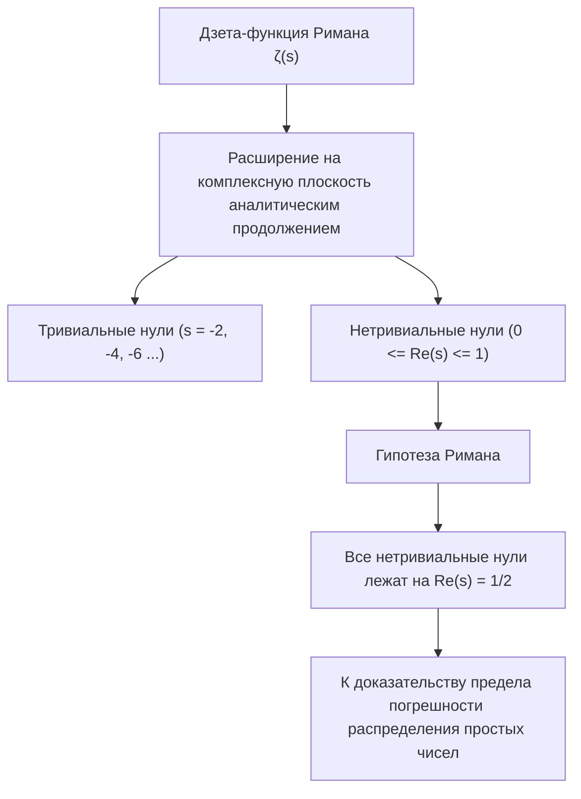
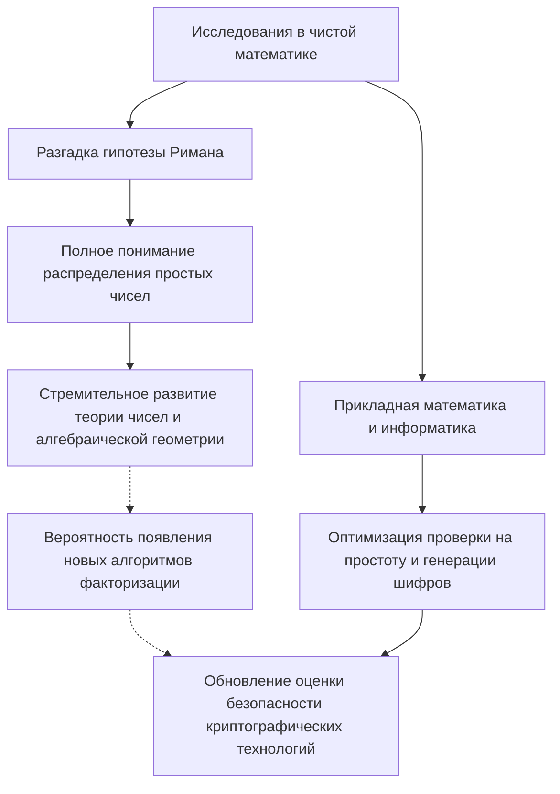

# 1. Введение: Тайна простых чисел во Вселенной и гипотеза Римана

«Простые числа» (Prime Numbers) — это натуральные числа, которые делятся только на 1 и на сами себя. В мире математики их часто называют «атомами». Эта последовательность, 2, 3, 5, 7, 11, 13..., на первый взгляд кажется хаотичной и случайной. С тех пор как древнегреческий математик Евклид доказал, что «простых чисел бесконечно много», бесчисленное множество математиков пытались разгадать закономерности, скрывающиеся в этом ряду.

Ближе всего к разгадке тайны простых чисел подошла **«Гипотеза Римана» (Riemann Hypothesis)**, предложенная немецким математиком Бернхардом Риманом в 1859 году. Гипотеза Римана является одной из самых важных и нерешенных проблем в современной математике. Она также включена в список Задач тысячелетия Института Клэя, за решение которой назначена награда в 1 миллион долларов.

На первый взгляд может показаться, что сложная проблема чистой математики, касающаяся распределения простых чисел, не имеет ничего общего с нашей повседневной жизнью. Однако безопасность инфраструктуры современного общества, в особенности интернета, опирается на **современные криптографические технологии, такие как шифрование RSA и криптография на эллиптических кривых (ECC)**, которые глубоко зависят от свойств огромных простых чисел.

В этой статье мы совершим математическое путешествие: от распределения простых чисел к теореме о распределении простых чисел, дзета-функции Римана и, наконец, к сути гипотезы Римана. Мы чрезвычайно подробно и глубоко рассмотрим, как всё это связано с современными криптографическими технологиями, и что произойдет с миром, если гипотеза Римана будет доказана.

---

# 2. Теорема о распределении простых чисел: Открытие Гаусса

Чтобы понять, как распределены простые числа, математики придумали **функцию распределения простых чисел (Prime-counting function)** $\pi(x)$, которая показывает «сколько простых чисел существует до заданного числа $x$».

Например:
- $\pi(10) = 4$ (2, 3, 5, 7)
- $\pi(100) = 25$
- $\pi(1000) = 168$

15-летний гениальный математик Карл Фридрих Гаусс, вычислив огромные таблицы простых чисел, обнаружил, что частота появления простых чисел убывает обратно пропорционально натуральному логарифму $\ln x$. Иными словами, он предположил, что вероятность найти простое число в окрестности числа $x$ составляет примерно $\frac{1}{\ln x}$.

Выражение этой идеи с помощью интеграла называется **интегральным логарифмом (Logarithmic integral)** $\text{Li}(x)$:

$$ \text{Li}(x) = \int_{2}^{x} \frac{dt}{\ln t} $$

Предположение Гаусса было независимо доказано в 1896 году Жаком Адамаром и Шарлем Жан де ла Валле-Пуссеном, и утвердилось как **Теорема о распределении простых чисел (Prime Number Theorem, PNT)**.

$$ \lim_{x \to \infty} \frac{\pi(x)}{\text{Li}(x)} = 1 $$

Или же это можно приблизительно выразить следующим образом:

$$ \pi(x) \sim \frac{x}{\ln x} $$

Эта теорема показала, что на макроскопическом уровне простые числа распределены очень плавно и предсказуемо. Однако на микроскопическом уровне между $\pi(x)$ и $\text{Li}(x)$ всегда существует «погрешность», то есть «флуктуация». Именно природа этой флуктуации является величайшей загадкой, которую пытается разгадать гипотеза Римана.

---

# 3. Дзета-функция Римана и произведение Эйлера

Самым мощным оружием в анализе распределения простых чисел является **дзета-функция Римана (Riemann Zeta Function)**. Изначально это был бесконечный ряд, определенный Леонардом Эйлером для вещественных чисел $s > 1$.

$$ \zeta(s) = \sum_{n=1}^\infty \frac{1}{n^s} = 1 + \frac{1}{2^s} + \frac{1}{3^s} + \frac{1}{4^s} + \dots $$

Одно из величайших достижений Эйлера заключалось в том, что он доказал, что этот бесконечный ряд можно представить как бесконечное произведение по всем простым числам $p$. Это и есть **Тождество Эйлера (Euler Product Formula)**.

$$ \zeta(s) = \prod_{p \text{ prime}} \frac{1}{1 - p^{-s}} = \left( \frac{1}{1 - 2^{-s}} \right) \left( \frac{1}{1 - 3^{-s}} \right) \left( \frac{1}{1 - 5^{-s}} \right) \dots $$

Интуитивное понимание этого доказательства заключается в том, что если мы разложим каждый член правой части как геометрическую прогрессию и перемножим их, то, согласно основной теореме арифметики (каждое натуральное число единственным образом представляется в виде произведения простых чисел), мы полностью восстановим сумму обратных величин натуральных чисел в левой части.

**Эта единственная формула стала мостом, соединившим математический анализ (бесконечные ряды и непрерывные функции) и теорию чисел (простые числа и дискретные числа).** Изучение дзета-функции равносильно изучению распределения простых чисел.

---

# 4. Аналитическое продолжение и расширение на комплексную плоскость

Гениальность Римана заключалась в том, что он расширил переменную $s$ в функции $\zeta(s)$, которую Эйлер рассматривал только для вещественных чисел, до **комплексного числа $s = \sigma + it$ (где $\sigma$ — действительная часть, а $t$ — мнимая часть)**.

Исходный бесконечный ряд сходится только при $\sigma > 1$, но Риман, используя метод «аналитического продолжения» (Analytic Continuation), расширил определение функции так, чтобы $\zeta(s)$ имела смысл на всей комплексной плоскости, за исключением полюса в точке $s = 1$.

Далее он вывел красивое функциональное уравнение (Functional equation), которому удовлетворяет дзета-функция.

$$ \zeta(s) = 2^s \pi^{s-1} \sin\left(\frac{\pi s}{2}\right) \Gamma(1-s) \zeta(1-s) $$

Здесь $\Gamma(x)$ — гамма-функция. Это уравнение позволяет узнать свойства функции в левой полуплоскости на основе её свойств в правой полуплоскости.

### Нули (Zeros of the Zeta Function)
Комплексные числа $s$, при которых значение дзета-функции становится равным 0, называются «нулями».
Из функционального уравнения следует, что когда $s$ — отрицательное четное число ($-2, -4, -6, \dots$), значение $\sin(\pi s / 2)$ равно 0, поэтому $\zeta(s) = 0$. Они называются **тривиальными нулями (Trivial zeros)**.

Однако для распределения простых чисел важны другие нули — те, что находятся в «критической полосе» (Critical strip) $0 \le \sigma \le 1$, так называемые **нетривиальные нули (Non-trivial zeros)**.

---

# 5. Суть гипотезы Римана и явная формула

Риман вычислил несколько таких нулей и выдвинул одно поразительное предположение. Это и есть **гипотеза Римана**.

> **Гипотеза Римана (Riemann Hypothesis)**
> Все нетривиальные нули дзета-функции Римана $\zeta(s)$ лежат на прямой, действительная часть которой равна $1/2$ ($\text{Re}(s) = 1/2$).

Эта прямая с действительной частью 1/2 называется «критической прямой» (Critical line).

Почему гипотеза Римана так важна? Потому что нули дзета-функции **полностью** определяют распределение простых чисел.

Риман и более поздний математик фон Мангольдт вывели «явную формулу» (Explicit formula), которая точно описывает распределение простых чисел. Используя функцию Чебышёва $\psi(x)$, это можно выразить следующим образом:

$$ \psi(x) = x - \sum_{\rho} \frac{x^\rho}{\rho} - \ln(2\pi) - \frac{1}{2}\ln(1 - x^{-2}) $$

Здесь сумма берется по всем нетривиальным нулям $\rho$ дзета-функции.
Главным членом является $x$ (что соответствует теореме о распределении простых чисел), а путем прибавления и вычитания волнообразных членов, зависящих от нулей $\rho$, восстанавливается точное ступенчатое распределение простых чисел. Можно сказать, что нетривиальные нули представляют собой «частоты (волны)» распределения простых чисел.

Если гипотеза Римана верна, и действительная часть всех нетривиальных нулей $\rho$ в точности равна $1/2$, то член погрешности в теореме о распределении простых чисел будет укладываться в минимально возможный теоретический диапазон.

$$ |\pi(x) - \text{Li}(x)| \le \frac{1}{8\pi} \sqrt{x} \ln x \quad \text{for} \quad x \ge 2657 $$

Другими словами, **если гипотеза Римана истинна, это докажет, что простые числа распределены настолько «правильно и красиво», насколько мы только можем себе представить**.

---

# 6. Неразрывная связь современных криптографических технологий и простых чисел

До этого момента мы находились в мире глубокой чистой математики, но именно эти свойства простых чисел фундаментально поддерживают современное цифровое общество. Ярким примером является криптография с открытым ключом, такая как **шифрование RSA**.

Безопасность любых коммуникаций, будь то оплата кредитной картой в интернете, передача паролей или электронные подписи в блокчейне, зависит от «простых чисел».

### Как работает шифрование RSA
Безопасность RSA основана на математическом факте (задаче факторизации), что «очень сложно разложить большое составное число на простые множители».

1. **Генерация ключей**:
   Случайным образом выбираются два огромных простых числа $p$ и $q$ (например, по 2048 бит каждое).
   Они перемножаются для получения $N = p \times q$. Это $N$ становится частью открытого ключа.
   Используя функцию Эйлера $\phi(N) = (p-1)(q-1)$, генерируется закрытый ключ $d$.
   
   $$ e \times d \equiv 1 \pmod{\phi(N)} $$

2. **Шифрование и расшифрование**:
   Открытый текст $M$ преобразуется в зашифрованный текст $C$ с использованием открытого ключа $e, N$.
   $$ C \equiv M^e \pmod{N} $$
   Расшифровать текст может только тот, кто обладает закрытым ключом $d$.
   $$ M \equiv C^d \pmod{N} $$

Чтобы взломать шифр RSA, нужно найти (факторизовать) исходные простые числа $p$ и $q$ из гигантского числа $N$. Считается, что даже с использованием самых передовых на сегодня алгоритмов (таких как общий метод решета числового поля, GNFS) и суперкомпьютеров, разложение числа из сотен цифр займет время, намного превышающее возраст Вселенной.

---

# 7. Влияние гипотезы Римана на криптографические технологии

Так как же пересекаются «гипотеза Римана», находящаяся на вершине чистой математики, и «криптография»?

### 7.1. Алгоритмы генерации простых чисел (проверка на простоту) и Обобщенная гипотеза Римана (GRH)
Для работы шифрования RSA необходимо сначала сгенерировать огромные простые числа $p$ и $q$. Однако надежно и быстро определить, «является ли число простым», не так-то просто.

В настоящее время на практике применяется вероятностный алгоритм — **тест простоты Миллера-Рабина (Miller-Rabin primality test)**. Этот алгоритм быстр, но существует крайне низкая вероятность того, что составное число будет ошибочно признано простым (так называемые «псевдопростые числа»).

Однако, если предположить, что **«Обобщенная гипотеза Римана» (Generalized Riemann Hypothesis, GRH)**, которая распространяет гипотезу Римана на L-функции Дирихле, верна, то ситуация кардинально меняется.
Если GRH истинна, математически гарантируется верхняя граница количества проверок в тесте Миллера-Рабина, и вероятностный алгоритм **превращается в «детерминированный алгоритм полиномиального времени»** (этот важный факт был известен еще до открытия теста простоты AKS).

Таким образом, гипотеза Римана (и ее обобщение) играет роль непосредственного гаранта того, «можно ли с абсолютной уверенностью и высокой скоростью генерировать гигантские простые числа», что является фундаментом для создания шифров.

### 7.2. Связь с алгоритмами факторизации
Знания о распределении простых чисел также необходимы при оценке вычислительной сложности алгоритмов взлома шифров (таких как общий метод решета числового поля). Многие алгоритмы факторизации опираются на распределение «гладких чисел» (Smooth numbers — чисел, имеющих только небольшие простые множители).

Чтобы точно оценить частоту появления гладких чисел, необходимо глубокое понимание распределения простых чисел. Здесь также используются методы аналитической теории чисел, напрямую связанные с дзета-функцией и гипотезой Римана. Если гипотеза Римана будет доказана, и погрешность распределения простых чисел будет полностью определена, станет возможным более точно установить пределы эффективности алгоритмов факторизации.

---

# 8. Если гипотеза Римана будет доказана, будут ли взломаны шифры?

В качестве городской легенды иногда можно услышать, что «если гипотеза Римана будет решена, шифрование RSA рухнет в одно мгновение», но **математически это неверно**.

Само доказательство гипотезы Римана не приведет к мгновенному появлению магического алгоритма, который радикально ускорит факторизацию. Гипотеза Римана — это теорема о макроскопической «закономерности распределения» простых чисел, она не сообщает напрямую о том, на какие именно простые числа делится конкретное число $N$ (локальные свойства).

Однако влияние не будет нулевым.
В процессе доказательства гипотезы Римана с огромной вероятностью **могут быть открыты «новые математические инструменты» и «неизвестные аналитические методы»**. Как показывает история, доказательство Великой теоремы Ферма или гипотезы Пуанкаре породило новые теории, которые привели к колоссальному скачку в математике в целом.

Если будут разработаны неизвестные ранее методы алгебраической геометрии или некоммутативной геометрии, позволяющие полностью манипулировать свойствами нулей дзета-функции Римана, нельзя исключать, что это в конечном итоге приведет к открытию революционного алгоритма факторизации (например, классического алгоритма, который снизит время вычислений до полиномиального). В этом смысле криптографы никогда не смогут отвести взгляд от того, что происходит вокруг гипотезы Римана.

### Квантовые компьютеры и алгоритм Шора
Куда более прямой и реальной угрозой для криптографических технологий является не доказательство гипотезы Римана, а **квантовые компьютеры**. Опубликованный Питером Шором (Peter Shor) в 1994 году «алгоритм Шора» доказал, что при наличии достаточно мощного квантового компьютера факторизация может быть решена за полиномиальное время. Это фундаментально разрушит шифрование RSA и криптографию на эллиптических кривых.

В настоящее время по всему миру идет переход на **постквантовую криптографию (Post-Quantum Cryptography, PQC)** (например, криптографию на решетках), которую не смогут взломать даже квантовые компьютеры. Криптографические технологии, основанные на простых числах, возможно, подходят к концу своего золотого века, но математическая ценность самих простых чисел не будет утрачена никогда.

---

# 9. Заключение: Перекресток математической абстракции и реального мира

Неустанные поиски простых чисел, ведущиеся со времен Древней Греции, благодаря гению Римана превратились в прекрасную симфонию на комплексной плоскости (нули дзета-функции). И поразительно, что этот кристалл чистейшей математики спустя столетия применяется как самый мощный щит, гарантирующий безопасность интернет-общества.

Гипотеза Римана символизирует одновременно «абстрактную красоту» математики и её «удивительную применимость в физическом мире и реальном обществе».

Когда эта гигантская математическая гора, вершины которой еще никто не достиг, будет однажды покорена, мы не только полностью поймем истину Вселенной, скрытую в простых числах, но и обретем новый взгляд на фундамент нашего информационного общества. Изучение криптографии — это, по сути, путешествие по страницам истории человеческой мудрости.
