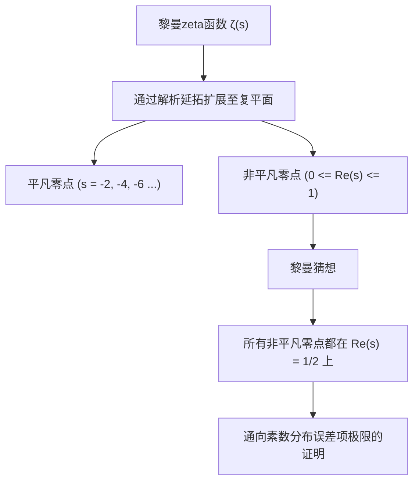
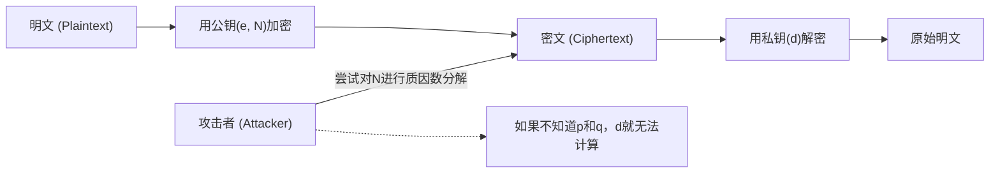
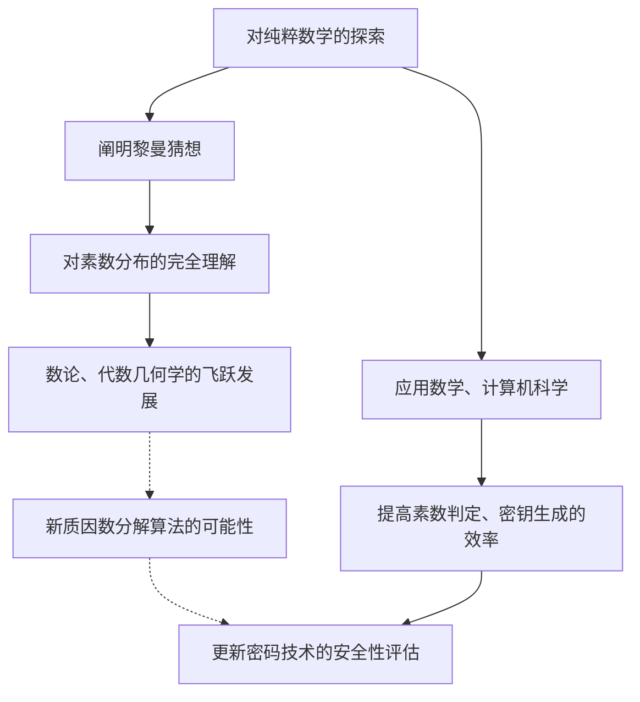

# 1. 引言：素数这一宇宙奥秘与黎曼猜想

“素数（Prime Numbers）”是只能被1和自身整除的自然数，在数学世界中被称为“原子”。2, 3, 5, 7, 11, 13... 这串数列乍看之下显得杂乱无章、随机出现。自从古希腊数学家欧几里得证明“素数有无限多个”以来，无数数学家试图解开隐藏在素数排列中的规律。

在探索素数之谜的道路上，最接近真相的是1859年由德国数学家波恩哈德·黎曼（Bernhard Riemann）提出的**“黎曼猜想（Riemann Hypothesis）”**。黎曼猜想是现代数学中最重要且未解决的难题之一，也是克雷数学研究所设立的千禧年大奖难题之一，悬赏100万美元。

乍看之下，关于素数分布的纯数学难题似乎与我们的日常生活毫不相干。然而，支撑现代社会基础设施的互联网安全，尤其是**RSA加密和椭圆曲线密码学（ECC）等现代密码技术**，都深深依赖于巨大素数的性质。

本文将带领读者进行一次数学之旅，从素数分布、素数定理、黎曼zeta函数，一直深入到黎曼猜想的核心，并极其详尽地探讨它如何与现代密码技术产生联系，以及如果黎曼猜想被证明，世界将会发生怎样的改变。

---

# 2. 素数定理与素数分布：高斯的发现

为了理解素数是如何分布的，数学家们引入了**素数计数函数（Prime-counting function）** $\pi(x)$，它表示“小于或等于某个数 $x$ 的素数有多少个”。

例如：
- $\pi(10) = 4$ （2, 3, 5, 7）
- $\pi(100) = 25$
- $\pi(1000) = 168$

15岁的天才数学家卡尔·弗里德里希·高斯（Carl Friedrich Gauss）计算了庞大的素数表，并发现素数出现的频率与自然对数 $\ln x$ 成反比而递减。也就是说，他推测在一个数 $x$ 附近找到素数的概率大约是 $\frac{1}{\ln x}$。

用积分来表达这个推测，就得到了**对数积分（Logarithmic integral）** $\text{Li}(x)$：

$$ \text{Li}(x) = \int_{2}^{x} \frac{dt}{\ln t} $$

高斯的猜想后来在1896年由雅克·阿达马和夏尔-让·德拉瓦莱·普桑分别独立证明，确立为**素数定理（Prime Number Theorem, PNT）**。

$$ \lim_{x \to \infty} \frac{\pi(x)}{\text{Li}(x)} = 1 $$

或者近似地表示为：

$$ \pi(x) \sim \frac{x}{\ln x} $$

通过这个定理可知，从宏观来看，素数具有非常平滑且可预测的分布。然而，从微观来看，$\pi(x)$ 和 $\text{Li}(x)$ 之间始终存在着“误差”或者说“波动”。这种波动的本质，正是黎曼猜想试图解开的最大谜团。

---

# 3. 黎曼zeta函数与欧拉乘积

分析素数分布最强大的武器是**黎曼zeta函数（Riemann Zeta Function）**。它最初是由莱昂哈德·欧拉（Leonhard Euler）针对实数 $s > 1$ 定义的无穷级数。

$$ \zeta(s) = \sum_{n=1}^\infty \frac{1}{n^s} = 1 + \frac{1}{2^s} + \frac{1}{3^s} + \frac{1}{4^s} + \dots $$

欧拉最大的功绩之一，是证明了这个无穷级数可以表示为关于所有素数 $p$ 的无穷乘积。这就是**欧拉乘积（Euler Product Formula）**。

$$ \zeta(s) = \prod_{p \text{ prime}} \frac{1}{1 - p^{-s}} = \left( \frac{1}{1 - 2^{-s}} \right) \left( \frac{1}{1 - 3^{-s}} \right) \left( \frac{1}{1 - 5^{-s}} \right) \dots $$

对于这个证明的直观理解是：将右边各项作为等比级数展开，然后将它们相乘，根据算术基本定理（所有自然数都可以唯一地表示为素数的乘积），左边自然数倒数和的形式会被完美地重构出来。

**仅仅这一个数学公式，就搭建起了分析学（无穷级数、连续函数）与数论（素数、离散数）之间的桥梁。** 研究zeta函数，就等同于研究素数的分布。

---

# 4. 解析延拓与向复平面的扩展

黎曼的天才之处在于，他将欧拉原本只在实数范围内考虑的 $\zeta(s)$ 的变量 $s$，扩展到了**复数 $s = \sigma + it$（$\sigma$ 是实部，$t$ 是虚部）**。

最初的无穷级数只在 $\sigma > 1$ 时收敛，但黎曼使用了“解析延拓（Analytic Continuation）”的方法，扩展了 $\zeta(s)$ 的定义，使其在除了极点 $s = 1$ 之外的整个复平面上都有意义。

他进一步推导出了zeta函数满足的优美函数方程（Functional equation）：

$$ \zeta(s) = 2^s \pi^{s-1} \sin\left(\frac{\pi s}{2}\right) \Gamma(1-s) \zeta(1-s) $$

这里的 $\Gamma(x)$ 是伽玛函数。通过这个方程，可以从右半平面的性质得知左半平面的性质。

### 零点（Zeros of the Zeta Function）
使zeta函数值为0的复数 $s$ 被称为“零点”。
从函数方程可知，当 $s$ 是负偶数（$-2, -4, -6, \dots$）时，由于 $\sin(\pi s / 2)$ 变为0，因此 $\zeta(s) = 0$。这些被称为**平凡零点（Trivial zeros）**。

然而，在素数分布中真正重要的是其他零点，也就是存在于 $0 \le \sigma \le 1$ 的“临界带（Critical strip）”中的**非平凡零点（Non-trivial zeros）**。

---

# 5. 黎曼猜想的核心与显式公式

黎曼计算了少数几个零点，并提出了一个惊人的猜想。这就是**黎曼猜想**。

> **黎曼猜想 (Riemann Hypothesis)**
> 黎曼zeta函数 $\zeta(s)$ 的所有非平凡零点，其实部都在 $1/2$ 的直线上（$\text{Re}(s) = 1/2$）。

这条实部为1/2的直线被称为“临界线（Critical line）”。

为什么黎曼猜想如此重要？那是因为zeta函数的零点**完全**决定了素数的分布。

黎曼以及后来的数学家冯·曼戈尔特推导出了精确描述素数分布的“显式公式（Explicit formula）”。使用切比雪夫函数 $\psi(x)$ 可以表示为如下形式：

$$ \psi(x) = x - \sum_{\rho} \frac{x^\rho}{\rho} - \ln(2\pi) - \frac{1}{2}\ln(1 - x^{-2}) $$

这里 $\rho$ 是对zeta函数的所有非平凡零点求和。
主项是 $x$ （这对应于素数定理），由此加上或减去取决于零点 $\rho$ 的波状项，就能还原出素数呈阶梯状的精确分布。可以说，非平凡零点代表了素数分布的“频率（波）”。

如果黎曼猜想成立，即所有非平凡零点 $\rho$ 的实部恰好都是 $1/2$，那么理论上素数定理的误差项将被限制在可以想象的最小范围内：

$$ |\pi(x) - \text{Li}(x)| \le \frac{1}{8\pi} \sqrt{x} \ln x \quad \text{for} \quad x \ge 2657 $$

也就是说，**如果黎曼猜想为真，就能证明素数以我们所能想象到的最“规则、美丽”的方式分布着。**

---

# 6. 现代密码技术与素数不可分割的关系

到此为止都是深奥的纯数学世界，但这素数的性质在根基上支撑着现代的数字社会。其代表就是以**RSA加密**为首的公钥加密方式。

互联网上的信用卡支付、密码传输、区块链电子签名等，所有通信的安全性都依赖于“素数”。

### RSA加密的原理
RSA加密的安全性基于一个数学事实（整数分解问题）：“对大位数的合数进行质因数分解非常困难”。

1. **密钥生成**:
   随机选择两个巨大的素数 $p$ 和 $q$（例如各为2048位）。
   将它们相乘计算出 $N = p \times q$。这个 $N$ 将成为公钥的一部分。
   利用欧拉函数 $\phi(N) = (p-1)(q-1)$，生成私钥 $d$。
   
   $$ e \times d \equiv 1 \pmod{\phi(N)} $$

2. **加密与解密**:
   明文 $M$ 会利用公钥 $e, N$ 转换为密文 $C$。
   $$ C \equiv M^e \pmod{N} $$
   只有拥有私钥 $d$ 的人才能解密。
   $$ M \equiv C^d \pmod{N} $$

要破解RSA加密，就必须从巨大的 $N$ 中找出原来的素数 $p$ 和 $q$（进行质因数分解）。即使使用当前主流的算法（如普通数域筛选法：GNFS等），并动用超级计算机来分解几百位数的数字，据说也需要远远超过宇宙年龄的时间。

---

# 7. 黎曼猜想对密码技术的影响

那么，处于纯数学顶点的“黎曼猜想”与“密码技术”是如何交汇的呢？

### 7.1. 素数生成算法（素性测试）与广义黎曼猜想（GRH）
为了运行RSA加密，首先需要生成巨大的素数 $p$ 和 $q$。然而，要可靠且高速地判断“某个数是否为素数”并非易事。

目前在实际应用中使用的是一种被称为**米勒-拉宾素性测试（Miller-Rabin primality test）**的概率算法。这种算法速度很快，但存在以极低概率将合数误判为素数的“伪素数”风险。

然而，如果假设将黎曼猜想扩展到狄利克雷L函数上的**“广义黎曼猜想（Generalized Riemann Hypothesis, GRH）”**为真，情况将发生戏剧性的变化。
如果GRH为真，那么在数学上就能保证米勒-拉宾测试的测试次数上限，使其从概率算法**升华为“确定性多项式时间算法”**（这是在AKS素性测试被发现之前就已知晓的重大事实）。

换言之，黎曼猜想（及其推广）在“能否带着绝对的自信、高速地生成巨大素数”这一密码基石的生成中，起到了直接背书的作用。

### 7.2. 与质因数分解算法的关系
在评估密码破解方算法（如普通数域筛选法等）的计算复杂度时，关于素数分布的知识也是不可或缺的。许多质因数分解算法都依赖于“光滑数（Smooth numbers：仅含有较小质因数的数字）”的分布。

为了严格评估光滑数出现的频率，需要对素数分布有深刻的理解，这里也充分利用了直接联系zeta函数和黎曼猜想的解析数论技巧。如果黎曼猜想被证明，并且素数分布的误差被完全确定，那么将有可能更准确地看清质因数分解算法的性能极限。

---

# 8. 如果黎曼猜想被证明，密码会被破解吗？

像都市传说一样，有人说“一旦黎曼猜想被解开，RSA加密就会瞬间崩溃”，**但这在数学上是不准确的。**

黎曼猜想的证明本身，并不会直接产生一种能让质因数分解戏剧性加速的魔法算法。因为黎曼猜想终究是关于素数“宏观分布规律性”的定理，并不能直接告诉我们个别的数字 $N$ 能被哪个素数整除（局部性质）。

然而，影响并非为零。
因为在证明黎曼猜想的过程中，**极有可能发现“新的数学工具”或“未知的分析方法”**。回顾历史，当费马大定理或庞加莱猜想被证明时，在这个过程中发展出的新理论让整个数学界实现了巨大的飞跃。

如果确立了某种能够完全操控黎曼zeta函数零点性质的未知代数几何学方法或非交换几何学方法，那么这可能会导致发现具有突破性的质因数分解算法（例如将计算复杂度降低到多项式时间的经典算法），这种可能性是无法否认的。正因如此，密码学家们绝对无法将视线从黎曼猜想的动向上移开。

### 量子计算机与Shor算法
对于密码技术而言，更直接、更现实的威胁不是黎曼猜想的证明，而是**量子计算机**。彼得·秀尔（Peter Shor）在1994年发表的“Shor算法”证明，如果拥有性能足够强大的量子计算机，就能在多项式时间内解决质因数分解问题。这将导致RSA加密和椭圆曲线加密被从根本上破解。

目前，全世界都在推进向即使是量子计算机也无法破解的“抗量子密码（Post-Quantum Cryptography, PQC）”（如格密码等）的过渡。依赖于素数的密码技术在某种意义上可能正在迎来其黄金时代的落幕，但素数本身的数学价值将永远不会消失。

---

# 9. 结语：数学的抽象性与现实社会的交汇点

自古希腊以来对素数不懈的探索，通过黎曼这位天才，升华为了复平面上优美的交响乐（zeta函数的零点）。令人惊叹的是，那纯粹无暇的数学结晶，历经数个世纪，如今已被应用为保障互联网社会安全的最强盾牌。

黎曼猜想是一个同时象征着数学所具有的“抽象之美”与“对物理世界、现实社会惊人的适用能力”的存在。

当这座尚未有人登顶的巍峨数学高山在未来的某一天被征服时，我们不仅将完全理解素数这一宇宙真理，而且会对信息化社会的基础产生全新的视角。学习密码技术，本身也是一趟追溯人类智慧历史的旅程。
