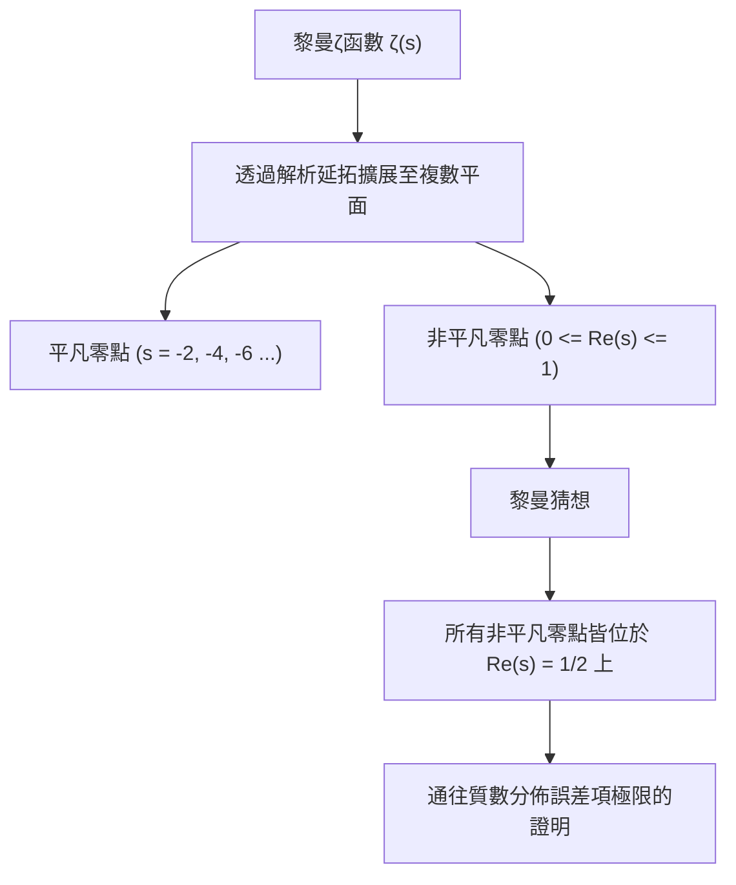
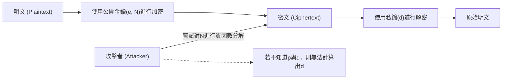
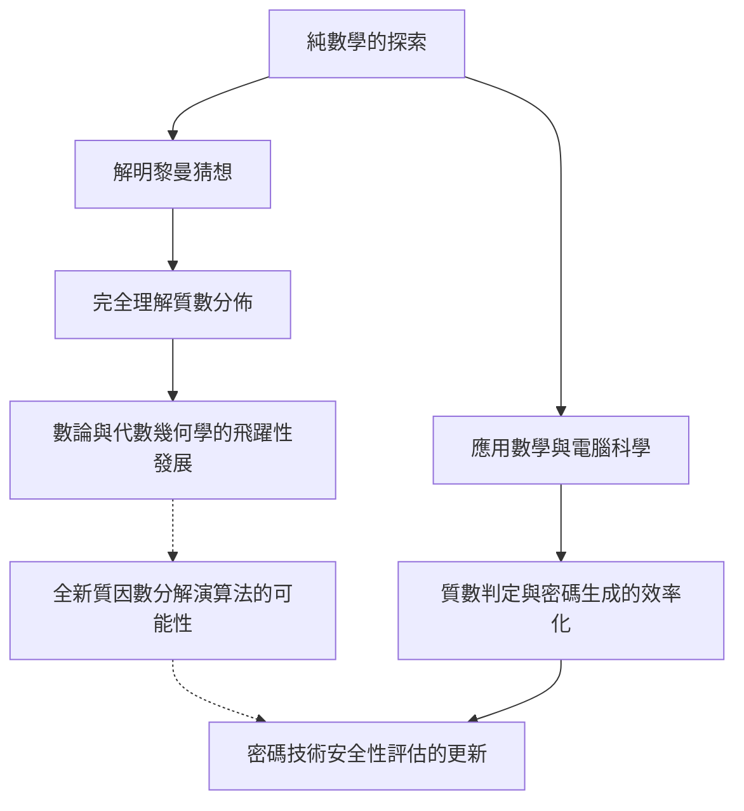

# 1. 前言：質數這宇宙之謎與黎曼猜想

「質數（Prime Numbers）」是只能被1和自己整除的自然數，在數學世界中也被稱為「原子」。2, 3, 5, 7, 11, 13... 這般延續的數列，乍看之下似乎毫無秩序、隨機出現。自從古希臘數學家歐幾里得證明了「質數有無窮多個」以來，無數的數學家們便不斷挑戰，試圖解開隱藏在這個質數排列中的規律。

最逼近這個質數之謎的，是1859年由德國數學家波恩哈德·黎曼（Bernhard Riemann）所提出的**「黎曼猜想（Riemann Hypothesis）」**。黎曼猜想是現代數學中最重要且未解決的難題之一，被克雷數學研究所列為千禧年大獎難題之一，並懸賞了100萬美元的獎金。

乍看之下，關於質數分佈的純數學難題，似乎與我們的日常生活毫無關聯。然而，支撐現代社會基礎設施的網際網路安全，特別是**RSA加密和橢圓曲線密碼學（ECC）等現代密碼技術**，都深深依賴於巨大質數的性質。

本篇文章將帶領讀者踏上一段數學之旅，從質數分佈、質數定理、黎曼ζ函數，一路探討到黎曼猜想的核心，並極為詳細且深入地解說它如何與現代密碼技術相結合，以及如果黎曼猜想被證明，世界將會發生什麼樣的變化。

---

# 2. 質數定理與質數分佈：高斯的發現

為了解質數是如何分佈的，數學家們構想出了**質數計數函數（Prime-counting function）** $\pi(x)$，用來表示「小於等於某個數 $x$ 的質數有多少個」。

例如：
- $\pi(10) = 4$ （2, 3, 5, 7）
- $\pi(100) = 25$
- $\pi(1000) = 168$

15歲的天才數學家卡爾·弗里德里希·高斯（Carl Friedrich Gauss）在計算了龐大的質數表後，發現質數的出現頻率與自然對數 $\ln x$ 成反比地遞減。也就是說，他猜想在某個數 $x$ 附近找到質數的機率大約是 $\frac{1}{\ln x}$。

將這個猜想用積分來表現，就是**對數積分（Logarithmic integral）** $\text{Li}(x)$：

$$ \text{Li}(x) = \int_{2}^{x} \frac{dt}{\ln t} $$

高斯的猜想後來在1896年由雅克·阿達馬和夏爾-讓·德拉瓦萊·普桑各自獨立證明，並確立為**質數定理（Prime Number Theorem, PNT）**。

$$ \lim_{x \to \infty} \frac{\pi(x)}{\text{Li}(x)} = 1 $$

或者近似地表示如下：

$$ \pi(x) \sim \frac{x}{\ln x} $$

透過這個定理，我們了解到從巨觀來看，質數具有非常平滑且可預測的分佈。然而，從微觀來看，$\pi(x)$ 和 $\text{Li}(x)$ 之間總是存在著「誤差」，也就是「波動」。這個波動的真面目，正是黎曼猜想所試圖解開的最大謎團。

---

# 3. 黎曼ζ函數與歐拉乘積

在解析質數分佈時，最強大的武器就是**黎曼ζ函數（Riemann Zeta Function）**。這原本是由萊昂哈德·歐拉（Leonhard Euler）針對實數 $s > 1$ 所定義的無窮級數。

$$ \zeta(s) = \sum_{n=1}^\infty \frac{1}{n^s} = 1 + \frac{1}{2^s} + \frac{1}{3^s} + \frac{1}{4^s} + \dots $$

歐拉最大的貢獻之一，就是證明了這個無窮級數可以表示為所有質數 $p$ 的無窮乘積。這就是**歐拉乘積（Euler Product Formula）**。

$$ \zeta(s) = \prod_{p \text{ prime}} \frac{1}{1 - p^{-s}} = \left( \frac{1}{1 - 2^{-s}} \right) \left( \frac{1}{1 - 3^{-s}} \right) \left( \frac{1}{1 - 5^{-s}} \right) \dots $$

這個證明的直觀理解是，將等式右邊的每一項展開為等比級數並將它們相乘，根據算術基本定理（每個自然數都可以唯一地表示為質數的乘積），等式左邊的自然數倒數和將會被完美地重構出來。

**就這麼一個數學公式，成為了連結分析學（無窮級數・連續函數）與數論（質數・離散數）的橋樑。** 研究ζ函數，就等同於研究質數的分佈。

---

# 4. 解析延拓與複數平面的擴展

黎曼的天才之處在於，他將歐拉原本只在實數範圍內考慮的 $\zeta(s)$ 的變數 $s$，擴展到了**複數 $s = \sigma + it$（$\sigma$ 為實部，$t$ 為虛部）**。

原本的無窮級數只在 $\sigma > 1$ 時收斂，但黎曼使用了「解析延拓（Analytic Continuation）」的手法，將 $\zeta(s)$ 的定義擴展到除了極點 $s = 1$ 之外的整個複數平面上，使其具有意義。

他更進一步導出了ζ函數所滿足的優美函數方程式（Functional equation）：

$$ \zeta(s) = 2^s \pi^{s-1} \sin\left(\frac{\pi s}{2}\right) \Gamma(1-s) \zeta(1-s) $$

這裡的 $\Gamma(x)$ 是伽瑪函數。透過這個方程式，我們可以從右半平面的性質得知左半平面的性質。

### 零點（Zeros of the Zeta Function）
使ζ函數的值為 0 的複數 $s$ 被稱為「零點」。
由函數方程式可知，當 $s$ 為負偶數（$-2, -4, -6, \dots$）時，$\sin(\pi s / 2)$ 會變成 0，因此 $\zeta(s) = 0$。這些被稱為**平凡零點（Trivial zeros）**。

然而，在質數分佈中真正重要的，是除此之外的零點，也就是存在於 $0 \le \sigma \le 1$ 的「臨界帶（Critical strip）」內的**非平凡零點（Non-trivial zeros）**。

---

# 5. 黎曼猜想的核心與顯式公式

黎曼計算了少數幾個零點，並提出了一個令人驚嘆的猜想。這就是**黎曼猜想**。

> **黎曼猜想 (Riemann Hypothesis)**
> 黎曼ζ函數 $\zeta(s)$ 的所有非平凡零點，其實部都位於 $1/2$ 的直線上（$\text{Re}(s) = 1/2$）。

這條實部為1/2的直線被稱為「臨界線（Critical line）」。

為什麼黎曼猜想會如此重要呢？那是因為，ζ函數的零點**完全**決定了質數的分佈。

黎曼與後來的數學家馮·曼戈爾特，導出了一個能精確描述質數分佈的「顯式公式（Explicit formula）」。使用切比雪夫函數 $\psi(x)$，可以表示如下：

$$ \psi(x) = x - \sum_{\rho} \frac{x^\rho}{\rho} - \ln(2\pi) - \frac{1}{2}\ln(1 - x^{-2}) $$

這裡的 $\rho$ 遍歷ζ函數的所有非平凡零點。
主項是 $x$（這對應於質數定理），從中加上或減去依賴於零點 $\rho$ 的波狀項，就能精確還原質數階梯狀的分佈。可以說，非平凡零點代表了質數分佈的「頻率（波）」。

如果黎曼猜想是正確的，也就是所有非平凡零點 $\rho$ 的實部恰好都是 $1/2$，那麼質數定理的誤差項將會在理論上可預期的最小範圍內。

$$ |\pi(x) - \text{Li}(x)| \le \frac{1}{8\pi} \sqrt{x} \ln x \quad \text{for} \quad x \ge 2657 $$

也就是說，**如果黎曼猜想為真，這將證明質數是以我們所能想像最「規律、優美」的方式分佈著。**

---

# 6. 現代密碼技術與質數不可分割的關係

到目前為止，我們探討的是深奧的純數學世界，但這些質數的性質，卻從根本上支撐著現代數位社會。其代表性例子，便是以**RSA加密**為首的公開金鑰密碼系統。

網際網路上的信用卡支付、密碼傳輸、區塊鏈的數位簽章等，所有通訊的安全性都依賴於「質數」。

### RSA加密的運作原理
RSA加密的安全性，建立在「將位數極大的合成數進行質因數分解是非常困難的」這個數學事實（質因數分解問題）之上。

1. **金鑰生成**:
   隨機選擇兩個巨大的質數 $p$ 和 $q$（例如各2048位元）。
   將它們相乘計算出 $N = p \times q$。這個 $N$ 將成為公開金鑰的一部分。
   利用歐拉函數 $\phi(N) = (p-1)(q-1)$，生成私鑰 $d$。
   
   $$ e \times d \equiv 1 \pmod{\phi(N)} $$

2. **加密與解密**:
   明文 $M$ 使用公開金鑰 $e, N$ 轉換為密文 $C$。
   $$ C \equiv M^e \pmod{N} $$
   只有擁有私鑰 $d$ 的人才能解密。
   $$ M \equiv C^d \pmod{N} $$

要破解RSA加密，就必須從巨大的 $N$ 中找出原本的質數 $p$ 和 $q$（進行質因數分解）。即使使用目前主流的演算法（如普通數域篩法：GNFS），要將數百位數的數字進行質因數分解，即使動用超級電腦，所花費的時間也被認為會遠遠超過宇宙的年齡。

---

# 7. 黎曼猜想對密碼技術的影響

那麼，位居純數學頂點的「黎曼猜想」與「密碼技術」是如何產生交集的呢？

### 7.1. 質數生成演算法（質數判定）與廣義黎曼猜想（GRH）
為了運用RSA加密，首先必須生成巨大的質數 $p$ 和 $q$。然而，要確切且高速地判定「某個數是否為質數」並不容易。

目前實用上被廣泛使用的是**米勒-拉賓質數判定法（Miller-Rabin primality test）**，這是一種機率性演算法。這個演算法速度很快，但有極低的機率會將合成數誤判為質數（稱為「偽質數」）。

但是，如果假設將黎曼猜想擴展到狄利克雷L函數上的**「廣義黎曼猜想（Generalized Riemann Hypothesis, GRH）」**為真，情況就會發生戲劇性的變化。
若GRH為真，米勒-拉賓判定法的測試次數上限就能獲得數學上的保證，從機率性演算法**昇華為「確定性多項式時間演算法」**（這是在AKS質數測試演算法被發現前就已知的重要事實）。

也就是說，黎曼猜想（及其推廣）扮演著直接為「能否以絕對的自信且高速地生成巨大質數」這個密碼學基礎生成過程背書的角色。

### 7.2. 與質因數分解演算法的關係
在評估破解密碼一方的演算法（如普通數域篩法等）的計算複雜度時，關於質數分佈的知識也是不可或缺的。許多質因數分解演算法依賴於「平滑數（Smooth numbers：只包含較小質因數的數字）」的分佈。

為了嚴密評估平滑數出現的頻率，需要對質數分佈有深刻的理解，這裡也充分運用了直接關聯到ζ函數與黎曼猜想的解析數論技巧。如果黎曼猜想被證明，質數分佈的誤差被完全確定，我們就能更精確地看清質因數分解演算法的效能極限。

---

# 8. 如果黎曼猜想被證明，密碼會被破解嗎？

雖然有如都市傳說般流傳著「如果黎曼猜想被解開，RSA加密就會在一瞬間瓦解」，但**這在數學上是不正確的**。

黎曼猜想的證明本身，並不會立刻孕育出能讓質因數分解戲劇性加速的魔法演算法。因為黎曼猜想終究是關於質數「巨觀分佈規律性」的定理，並不能直接告訴我們個別數字 $N$ 能被哪個質數整除（局部性質）。

然而，這並不代表影響為零。
因為在證明黎曼猜想的過程中，**極有可能性會發現「新的數學工具」或「未知的解析手法」**。回顧歷史，當費馬最後定理或龐加萊猜想被證明時，在此過程中發展出的新理論，都讓整個數學領域有了大幅度的飛躍。

如果確立了能夠完全操作黎曼ζ函數零點性質的未知代數幾何手法，或是非交換幾何的手法，我們不能否認，這最終可能導致劃時代的質因數分解演算法（例如將計算複雜度降至多項式時間的古典演算法）被發現。就這個意義而言，密碼學家絕不能對黎曼猜想的動向掉以輕心。

### 量子電腦與秀爾演算法
對密碼技術而言，更直接、更具現實威脅的不是黎曼猜想的證明，而是**量子電腦**。1994年彼得·秀爾（Peter Shor）發表的「秀爾演算法」證明了，只要擁有足夠效能的量子電腦，就能在多項式時間內解決質因數分解問題。這將導致RSA加密和橢圓曲線密碼學從根本上被破解。

目前，世界各地正積極推進轉移至即使是量子電腦也無法解讀的「後量子密碼學（Post-Quantum Cryptography, PQC）」（如晶格密碼等）。依賴於質數的密碼技術，或許在某種意義上即將結束其黃金時代，但質數本身的數學價值，永遠不會消失。

---

# 9. 結語：數學的抽象性與現實社會的交會點

從古希臘延續至今對質數無止盡的探索，被天才黎曼昇華為複數平面上一首優美的交響曲（ζ函數的零點）。而令人驚嘆的是，這純粹無瑕的數學結晶，在經過數個世紀後，竟被應用為確保網際網路社會安全的最強盾牌。

黎曼猜想同時象徵了數學所具備的「抽象之美」與「對物理世界・現實社會驚人的適用力」。

當這座至今無人登頂的巨大數學山峰有朝一日被征服時，我們不僅能完全理解質數這宇宙真理，更將對資訊化社會的基礎產生全新的觀點。學習密碼技術，就如同踏上一段追溯人類智慧歷史的旅程。
