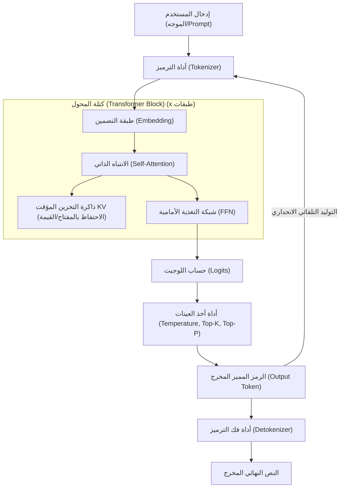
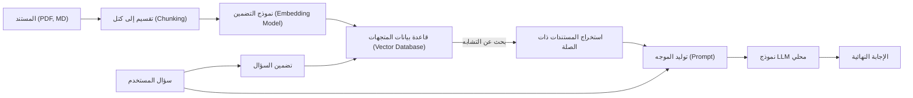

# 1. مقدمة: لماذا نماذج LLM المحلية على ويندوز الآن؟

في عام 2026، يشهد تطور الذكاء الاصطناعي التوليدي والنماذج اللغوية الكبيرة (LLM) نقلة نوعية كبرى من خدمات واجهة برمجة التطبيقات (API) الضخمة على السحابة إلى "نماذج LLM المحلية" التي تعمل على أجهزة الكمبيوتر الشخصية والبيئات المحلية (On-Premises). على الرغم من أن نماذج الذكاء الاصطناعي السحابية مثل GPT-5 من OpenAI و Claude 3.5 من Anthropic قوية جدًا، إلا أنه لا يمكن للشركات والأفراد إرسال جميع بياناتهم إلى السحابة. من منظور الخصوصية، والأمان، وزمن الوصول (Latency)، والتكلفة المستدامة طويلة الأجل، فقد زاد الطلب على نماذج LLM المحلية بشكل غير مسبوق وبشكل هائل.

تطور النظام البيئي لنماذج LLM المحلية في بيئة ويندوز (Windows) بشكل خاص كان مذهلًا. حتى سنوات قليلة مضت، كان من المتعارف عليه أن "تطوير وتشغيل الذكاء الاصطناعي يعني Linux"، ولكن في عام 2026، تحول نظام ويندوز إلى منصة ذكاء اصطناعي قوية وسهلة الاستخدام للغاية.

في هذه المقالة، وبناءً على أحدث الاتجاهات التقنية لعام 2026، نقدم دليلاً شاملاً لبناء، وتشغيل، وتحسين نماذج LLM المحلية في بيئة ويندوز. سنقوم بشرح مفصل بحجم هائل يغطي كل شيء بدءًا من الإعداد البسيط للمبتدئين باستخدام Ollama، والتحسين الأقصى للمتقدمين باستخدام llama.cpp، وحتى الفهم العميق للبنية (Architecture) والنهج الرياضي لحساب ذاكرة الوصول العشوائي للفيديو (VRAM)، بالإضافة إلى الضبط الدقيق (Fine-tuning) محليًا.

## 1.1 الاتجاهات التقنية المحيطة بنماذج LLM المحلية في عام 2026

تتمثل الاتجاهات الرئيسية التي تشكل النظام البيئي الحالي لنماذج LLM المحلية فيما يلي:

1. **الانتشار الكامل لتنسيق GGUF**: أصبح تنسيق GGUF (GPT-Generated Unified Format)، الذي يدمج البيانات الوصفية (Metadata) والموترات (Tensors) في ملف واحد، معيارًا أساسيًا (De facto standard) بالكامل. وبفضل هذا، أصبح من الممكن تشغيل النماذج في أي بيئة بمجرد تنزيل ملف واحد من Hugging Face.
2. **إضفاء الطابع الديمقراطي على بنية MoE (مزيج الخبراء)**: تم إطلاق العديد من نماذج MoE صغيرة الحجم ولكنها عالية الأداء. ومن خلال تنشيط بعض الخبراء فقط أثناء الاستدلال (Inference)، فإنها تحقق أداءً يضاهي النماذج الضخمة مع تقليل العبء الحسابي على أجهزة الكمبيوتر الشخصية الاستهلاكية.
3. **التجريد العالي والتحسين لمحركات الاستدلال**: تم تحسين أدوات مثل Ollama، LM Studio، و AnythingLLM، ولم يعد المستخدمون بحاجة إلى القلق بشأن التبعيات المعقدة مثل تثبيت برامج تشغيل CUDA. بالإضافة إلى ذلك، بفضل الدعم الأصلي (Native) لـ FlashAttention 3 على ويندوز، زادت سرعة الاستدلال بشكل كبير.
4. **الاستفادة من وحدات المعالجة العصبية (NPU) وظهور أجهزة كمبيوتر Windows Copilot+**: حتى بالنسبة لأجهزة الكمبيوتر المحمولة التي لا تحتوي على وحدة معالجة رسومات (GPU)، فقد دخلت تقنية تشغيل النماذج اللغوية الصغيرة (SLM) باستهلاك منخفض للطاقة باستخدام وحدة المعالجة العصبية (NPU) المدمجة مرحلة الاستخدام العملي.

---

# 2. متطلبات الأجهزة (Hardware) وإعداد نظام التشغيل

لكي تعمل نماذج LLM المحلية بسرعة عملية (أكثر من 15 إلى 30 رمزًا مميزًا "Token" في الثانية)، يعد اختيار الأجهزة (Hardware) هو الأمر الأكثر أهمية.

## 2.1 تكوين الأجهزة الموصى به

مع تطور أجهزة الكمبيوتر الخاصة بالذكاء الاصطناعي (AI PC)، تتغير أيضًا المواصفات المطلوبة.

- **نظام التشغيل (OS)**: Windows 11 Pro (إصدار 24H2 أو أحدث). يعد هذا ضروريًا للاستفادة الكاملة من ميزات WSL2، والإدارة المتقدمة للذاكرة، بالإضافة إلى استخدام أحدث واجهات برمجة التطبيقات (API) الخاصة بـ DirectML.
- **وحدة المعالجة المركزية (CPU)**: سلسلة Intel Core Ultra 200 أو أحدث، أو سلسلة AMD Ryzen 9000 أو أحدث. عند استخدام استدلال CPU معًا، فإن الاتصال بذاكرة ذات نطاق ترددي عالي يعد أمرًا لا غنى عنه.
- **ذاكرة الوصول العشوائي (RAM)**: الحد الأدنى 32 جيجابايت، ويُوصى بـ 64 جيجابايت أو أكثر. يصبح النطاق الترددي للذاكرة الرئيسية (بالجيجابايت/ثانية) هو عنق الزجاجة (Bottleneck) الحاسم أثناء استدلال CPU أو عند تفريغ التحميل (Offloading). يُفضل استخدام ذاكرة عالية السرعة DDR5-6000 أو أعلى.
- **وحدة معالجة الرسومات (GPU)**: سلسلة NVIDIA RTX 4000/5000. الأهم في نماذج LLM المحلية ليس أداء الحوسبة بل "سعة ذاكرة الوصول العشوائي للفيديو (VRAM)".
  - **فئة البداية (Entry)**: RTX 4060 Ti (نسخة 16 جيجابايت) - الأفضل من حيث التكلفة والأداء. مثالية لنماذج بحجم 8B إلى 14B.
  - **الفئة المتوسطة (Mid-range)**: RTX 4070 Ti SUPER (16 جيجابايت) / RTX 4080 SUPER (16 جيجابايت).
  - **الفئة المتقدمة (High-end)**: RTX 4090 (24 جيجابايت) / RTX 5090 (32 جيجابايت) - مطلوبة لتشغيل النماذج المكممة (Quantized models) بحجم 30B إلى 70B.
- **التخزين (Storage)**: محرك أقراص PCIe Gen4 أو Gen5 NVMe SSD. يقلل من وقت تحميل النماذج التي تبلغ مساحتها عشرات الجيجابايت بشكل كبير.

## 2.2 إعداد WSL2 (نظام ويندوز الفرعي لنظام لينكس 2)

تعمل العديد من أدوات واجهة المستخدم الرسومية (GUI) بشكل أصلي (Native) على ويندوز، ولكن WSL2 مفيد جدًا للتطوير باستخدام بايثون (Python)، وتجميع أحدث الأدوات، وإجراء الضبط الدقيق (LoRA Fine-tuning) الذي سيتم شرحه لاحقًا. في أحدث بيئة لـ Windows 11، يمكنك استخدام GPU (CUDA) بشفافية من WSL2 بمجرد تثبيت برنامج تشغيل NVIDIA على النظام المضيف.

افتح PowerShell بصلاحيات المسؤول (Administrator) وقم بتشغيل ما يلي:

```powershell
# تثبيت WSL2 وأحدث إصدار من Ubuntu
wsl --install -d Ubuntu-24.04

# تحديث النواة (Kernel)
wsl --update
```

بعد التثبيت، قم بتشغيل `nvidia-smi` داخل وحدة تحكم WSL2، وإذا تم التعرف على GPU بشكل صحيح، فقد نجحت العملية.

---

# 3. بنية نموذج LLM المحلي وآلية الاستدلال (Inference)

من المفيد جدًا في استكشاف الأخطاء وإصلاحها وتحسين الأداء فهم كيفية قيام النموذج بإنشاء النص في بيئة محلية، وهيكله الداخلي.

يوضح مخطط Mermaid التالي خط أنابيب (Pipeline) الاستدلال النموذجي لـ LLM المحلي.



## 3.1 مرحلتان: التعبئة المسبقة (Prefill) وفك التشفير (Decode)

ينقسم إنشاء النص بواسطة LLM إلى مرحلتين تختلفان في الخصائص الحسابية:

1. **مرحلة التعبئة المسبقة (معالجة الموجه - Prefill)**: هي المرحلة التي يتم فيها معالجة وفهم موجه الإدخال (Prompt) بأكمله مرة واحدة. نظرًا لإمكانية الحوسبة المتوازية، ترتبط قدرة حساب GPU (FLOPS) بشكل مباشر بالسرعة. إذا كان الموجه طويلاً، فقد تستغرق هذه المرحلة بضع ثوانٍ.
2. **مرحلة فك التشفير (توليد الرموز المميزة - Decode)**: هي المرحلة التي يتم فيها التنبؤ برمز مميز واحد في كل مرة وتمريره إلى الإدخال التالي (التوليد التلقائي الانحداري - Autoregressive). نظرًا لأن الحوسبة المتوازية مقيدة في هذه المرحلة، فإن عرض النطاق الترددي لـ VRAM في GPU يصبح عنق الزجاجة الحاسم.

---

# 4. حساب استهلاك VRAM والفهم الرياضي لحجم النموذج

لتحكم بشكل صحيح على "ما هو النموذج الذي سيعمل على جهاز الكمبيوتر الخاص بي؟"، تحتاج إلى فهم معادلة حساب VRAM. في حالة حدوث تراجع (Fallback) إلى ذاكرة النظام (RAM) بسبب نقص VRAM، ستنخفض سرعة الاستدلال بمقدار 10 إلى 100 مرة.

## 4.1 VRAM الأساسي بناءً على حجم المعلمة (Parameter)

هو مقدار الذاكرة المطلوب لتحميل أوزان (Weights) النموذج في VRAM.
يتم حسابه باستخدام حجم النموذج $P$ (عدد المعلمات، الوحدة: 1 مليار = 1B) وعدد البايتات لكل معلمة $B$.

$$
V_{base} = P \times B \quad \text{(GB)}
$$

على سبيل المثال، عند تحميل نموذج بـ 8B (8 مليارات) معلمة بتنسيق FP16 (فاصلة عائمة نصف الدقة، 16 بت = 2 بايت):

$$
V_{base} = 8 \times 2 = 16 \text{ GB}
$$

بمعنى آخر، حتى مع وحدة معالجة رسومات تحتوي على 16 جيجابايت من VRAM، ستصل إلى الحد الأقصى تقريبًا بمجرد تحميل النموذج.

## 4.2 سحر التكميم (Quantization)

وهنا يأتي دور "التكميم". من خلال تقليل دقة المعلمات، يتم تصغير حجم النموذج بشكل كبير. في حالة التكميم الأكثر شيوعًا 4 بت (مثل: Q4_K_M)، يبلغ المتوسط حوالي 0.55 بايت لكل معلمة.

$$
V_{base\_4bit} = 8 \times 0.55 = 4.4 \text{ GB}
$$

وبالتالي، إذا كان لديك 16 جيجابايت من VRAM، فيمكنك بسهولة تشغيل نموذج 8B بوجود مساحة إضافية كافية.

## 4.3 حساب ذاكرة التخزين المؤقت KV (إصدار يدعم GQA)

أثناء الاستدلال، تستهلك "ذاكرة التخزين المؤقت KV" التي تحتفظ بالسياق الماضي VRAM. في أحدث النماذج مثل Llama 3، يتم استخدام GQA (الانتباه الاستعلامي المجمع - Grouped Query Attention) لتوفير الذاكرة.

يمكن التعبير عن استهلاك ذاكرة التخزين المؤقت KV $V_{kv}$ (بالجيجابايت) بالصيغة الرياضية التالية:

$$
V_{kv} = 2 \times b \times s \times l \times \left( \frac{h_{kv}}{h_q} \right) \times h_q \times d \times B_{kv} \div 10^9
$$

عند التبسيط، يمكن حسابها ببساطة باستخدام عدد رؤوس المفاتيح والقيم $h_{kv}$:

$$
V_{kv} = 2 \times b \times s \times l \times h_{kv} \times d \times B_{kv} \div 10^9
$$

حيث أن:
- $b$: حجم الدفعة (عادة 1 للاستخدام الشخصي المحلي)
- $s$: طول التسلسل (طول السياق، مثال: 8192)
- $l$: عدد الطبقات (مثال: 32)
- $h_{kv}$: عدد رؤوس KV (مثال: 8)
- $d$: عدد الأبعاد لكل رأس (مثال: 128)
- $B_{kv}$: عدد البايتات لذاكرة التخزين المؤقت KV (2 إذا كان FP16)

مثال للحساب (Llama 3 8B، سياق 8192، ذاكرة تخزين مؤقت FP16):
$V_{kv} = 2 \times 1 \times 8192 \times 32 \times 8 \times 128 \times 2 \div 10^9 \approx 1.07 \text{ GB}$

يرجى ملاحظة أنه كلما زاد طول السياق $s$، زادت الحاجة إلى VRAM بشكل خطي.

---

# 5. الممارسة 1: إعداد أسرع وأقصر باستخدام Ollama

بمجرد فهم النظرية، دعنا نقم بتشغيل LLM فعليًا على بيئة ويندوز.
اعتبارًا من عام 2026، فإن الأداة الأكثر سهولة في الاستخدام هي "Ollama". فهي توفر واجهة سطر أوامر (CLI) بديهية تشبه Docker.

## 5.1 التثبيت والتشغيل

1. قم بتنزيل مثبت ويندوز من [موقع Ollama الرسمي](https://ollama.com/) وقم بتشغيله.
2. افتح PowerShell وأدخل الأمر التالي. هنا، سنستخدم `llama3:8b` الذي يدعم اللغة اليابانية.

```powershell
ollama run llama3:8b
```

في أول تشغيل، سيتم تنزيل النموذج. بمجرد الانتهاء، يمكنك التفاعل معه مباشرة في الجهاز الطرفي (Terminal).

## 5.2 إنشاء ذكاء اصطناعي مخصص باستخدام Modelfile

يمكنك بسهولة إنشاء ذكاء اصطناعي بشخصية (Persona) محددة. قم بإنشاء `Modelfile` في أي مكان تريده.

```text
FROM llama3:8b

SYSTEM """
أنت مهندس برمجيات أول ممتاز جدًا.
يرجى الإجابة على أسئلة المستخدم بشكل منطقي وموجز، مع تقديم أمثلة التعليمات البرمجية دائمًا.
"""

PARAMETER temperature 0.3
PARAMETER num_ctx 8192
```

قم ببناء النموذج المخصص الخاص بك وتشغيله بالأوامر التالية:

```powershell
ollama create SeniorDev -f ./Modelfile
ollama run SeniorDev
```

## 5.3 الاستخدام من التطبيقات الخارجية (محرر الذكاء الاصطناعي)

تكشف Ollama عن نقطة نهاية API متوافقة مع OpenAI على `http://localhost:11434`.
من خلال تحديد عنوان URL هذا في إعدادات الخلفية (Backend) لإضافات VS Code مثل Cursor و Continue.dev، وتحديد اسم النموذج كـ `SeniorDev` أو ما شابه، ستحصل على مساعد تشفير (Coding) محلي قوي ومجاني.

---

# 6. الممارسة 2: ضبط الأداء الأقصى باستخدام llama.cpp

إذا كنت ترغب في إجراء إدارة دقيقة للذاكرة أو تجربة أحدث التنسيقات (مثل EXL2 وتكميم IQ) بسرعة، فسوف تتفاعل مباشرة مع المحرك الأساسي `llama.cpp`.

## 6.1 خطوات بناء llama.cpp

في بيئة ويندوز، من الأفضل بناءه من المصدر باستخدام CUDA Toolkit و CMake.

```powershell
git clone https://github.com/ggerganov/llama.cpp
cd llama.cpp
mkdir build
cd build

# التهيئة والتجميع ليكون متوافقًا مع CUDA
cmake .. -DLLAMA_CUBLAS=ON -DBUILD_SHARED_LIBS=OFF
cmake --build . --config Release -j 16
```

## 6.2 التشغيل المتقدم في وضع الخادم

استخدم `llama-server.exe` الذي تم بناؤه لاستضافة النموذج.

```powershell
.\bin\Release\llama-server.exe `
  --model "C:\models\Llama-3-8B-Instruct.Q4_K_M.gguf" `
  --ctx-size 8192 `
  --n-gpu-layers 99 `
  --threads 8 `
  --flash-attn `
  --port 8080
```

- `--n-gpu-layers 99`: نقل كل الطبقات الممكنة إلى VRAM الخاص بـ GPU.
- `--flash-attn`: تمكين FlashAttention 3 لتحسين سرعة الاستدلال وتقليل استهلاك VRAM لذاكرة التخزين المؤقت KV.

---

# 7. واجهة المستخدم الرسومية (GUI): بناء LM Studio و RAG المحلي

إذا كنت لا تفضل استخدام سطر الأوامر، أو إذا كنت ترغب في إجراء التوليد المعزز بالاسترجاع (RAG) بشكل بديهي، فاستخدم واجهة مستخدم رسومية (GUI).

## 7.1 LM Studio

يعد LM Studio تطبيقًا رائعًا يجمع بين البحث عن النماذج، والتنزيل، والتحقق المسبق من متطلبات النظام، وواجهة مستخدم (UI) للدردشة في مكان واحد. بضغطة زر "Local Server" داخل التطبيق، سيتم تشغيل واجهة برمجة تطبيقات (API) متوافقة مع OpenAI.

## 7.2 بنية RAG باستخدام AnythingLLM

هذا هو المخطط المعماري لبيئة RAG التي تسمح بقراءة المستندات الداخلية للشركة والمذكرات الشخصية.



باستخدام إصدار سطح المكتب من AnythingLLM (لويندوز)، يمكنك تحديد Ollama (لـ LLM والتضمين) من شاشة الإعدادات، وإعداده لاستخدام VectorDB محلي (LanceDB)، وستكتمل هذه البنية في غضون بضع دقائق. هذه هي ولادة الذكاء الاصطناعي الخاص الذي لا يرسل البيانات إلى الخارج على الإطلاق.

---

# 8. الضبط الدقيق (LoRA) على Windows WSL2

لا يقتصر الأمر على التشغيل المحلي فحسب، بل إذا كنت ترغب في جعل النموذج أكثر ذكاءً باستخدام بياناتك الخاصة، فيمكنك إجراء الضبط الدقيق (Fine-tuning) باستخدام LoRA (التكيف منخفض الرتبة - Low-Rank Adaptation). اعتبارًا من عام 2026، وبفضل مكتبة تسمى "Unsloth"، يمكنك إكمال تدريب نموذج 8B في بضع ساعات حتى مع 16 جيجابايت من VRAM في بيئة Windows WSL2.

قم بتشغيل الأوامر التالية داخل Ubuntu في WSL2 لإعداد البيئة:

```bash
conda create --name unsloth_env python=3.11
conda activate unsloth_env
pip install "unsloth[colab-new] @ git+https://github.com/unslothai/unsloth.git"
pip install --no-deps trl peft accelerate bitsandbytes
```

تعمل Unsloth على تحسين أنوية CUDA (CUDA kernels) إلى أقصى حد، وبالمقارنة مع مكتبة Hugging Face القياسية، فإن سرعة التدريب تزيد بحوالي الضعف، وينخفض استهلاك VRAM إلى النصف تقريبًا. بمجرد فتح Jupyter Notebook وتحميل مجموعة البيانات (بتنسيق JSONL)، يمكن إجراء التدريب لعدة عصور (Epochs) باستخدام أجهزة مثل RTX 4060 Ti مع 12 جيجابايت إلى 16 جيجابايت من VRAM.

---

# 9. استكشاف أخطاء الأداء وإصلاحها

فيما يلي المشكلات الشائعة والحلول الخاصة بها.

### 1. سرعة الاستدلال بطيئة للغاية (1 إلى 2 رمز / ثانية)
**السبب**: النموذج لا يتناسب مع VRAM وتم تحميله على ذاكرة النظام (RAM).
**الحل**: تحقق من "ذاكرة GPU المخصصة" في إدارة المهام. إذا وصلت إلى الحد الأقصى، فقم بتقليل حجم السياق (`-c`)، أو استخدم نموذج تكميم بعدد بتات أقل (مثل Q4_K_M).

### 2. خطأ "CUDA out of memory"
**السبب**: تم استنفاد VRAM بالكامل. يحدث هذا بشكل خاص عندما تطول المحادثة وتتضخم ذاكرة التخزين المؤقت KV.
**الحل**: قم بتقييد قيمة `num_ctx` بشكل مقصود في حالة Ollama، أو قيمة `-c` في حالة llama.cpp.

### 3. توليد اللغة (مثل اليابانية أو العربية) غريب
**السبب**: عدم تطابق قالب الموجه (Prompt template)، أو النموذج غير مدعوم.
**الحل**: استخدم نموذجًا يحتوي اسمه على `Instruct`، وتأكد من تحديد القالب الصحيح (مثل تنسيق ChatML أو Llama3) الذي حدده منشئ النموذج في الأداة.

---

# 10. الخلاصة والآفاق المستقبلية

في عام 2026، لم يعد بناء نماذج LLM المحلية في بيئة ويندوز حكرًا على عدد قليل من المهندسين فقط. بفضل تحول تنسيق GGUF إلى معيار أساسي، وظهور أنظمة بيئية محسّنة مثل Ollama و LM Studio، والتحسينات على مستوى الأجهزة (Hardware) مثل FlashAttention، يمكن لأي شخص الآن بسهولة الحصول على بيئة ذكاء اصطناعي بمستوى الشركات (Enterprise-grade).

يرجى الاستفادة من النقاط التالية المشروحة في هذا المقال:

1. استخدم **الحساب الرياضي لـ VRAM** لاختيار حجم النموذج ومستوى التكميم المناسبين لمنطق مواصفات جهاز الكمبيوتر الخاص بك.
2. استخدم **Ollama** لإعداد بيئة بأسرع وقت، وربطها مع محرر الذكاء الاصطناعي لتحسين الإنتاجية بشكل كبير.
3. استخدم التحكم المتقدم في المعلمات من خلال **llama.cpp** لاستخراج أقصى أداء ممكن للأجهزة.
4. قم ببناء نظام RAG محلي آمن للتعامل مع البيانات السرية باستخدام **AnythingLLM**.
5. استفد من **Unsloth (WSL2)** لتطوير وتدريب ذكاء اصطناعي مخصص يمتلك معرفتك المتخصصة الخاصة.

لم يعد مصطلح "إضفاء الطابع الديمقراطي" على الذكاء الاصطناعي مجرد كلمة طنانة (Buzzword)، بل أصبح نظامًا واقعيًا يعمل على سطح مكتب ويندوز الخاص بك. تحرر من تكاليف استخدام واجهات برمجة التطبيقات السحابية وخطر تسرب المعلومات، وادخل الآن إلى عالم الذكاء الاصطناعي الخاص القوي والحر.
