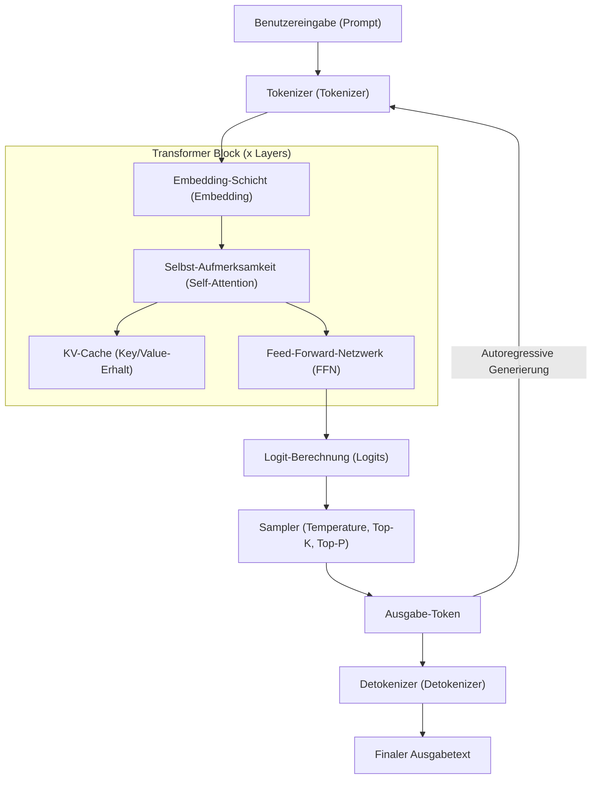
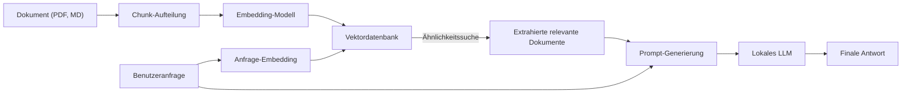

# 1. Einführung: Warum gerade jetzt lokale LLMs unter Windows?

Im Jahr 2026 hat die Entwicklung generativer KI und großer Sprachmodelle (LLMs) einen gewaltigen Paradigmenwechsel vollzogen – von riesigen API-Diensten in der Cloud hin zu "lokalen LLMs", die auf privaten PCs oder in On-Premise-Umgebungen laufen. Cloud-KIs wie GPT-5 von OpenAI und Claude 3.5 von Anthropic sind extrem leistungsstark, aber Unternehmen und Privatpersonen können nicht all ihre Daten in die Cloud senden. Aus Gründen des Datenschutzes, der Sicherheit, der Latenzzeit sowie der langfristigen und nachhaltigen Kosten ist die Nachfrage nach lokalen LLMs so explosionsartig gestiegen wie nie zuvor.

Besonders im Windows-Umfeld ist die Entwicklung des Ökosystems für lokale LLMs bemerkenswert. Noch vor einigen Jahren galt "KI-Entwicklung und -Ausführung gleich Linux" als gängige Regel, doch im Jahr 2026 hat sich Windows zu einer äußerst leistungsstarken und zugänglichen KI-Plattform gewandelt.

In diesem Artikel bieten wir einen vollständigen Leitfaden zur Einrichtung, zum Betrieb und zur Optimierung lokaler LLMs in einer Windows-Umgebung, basierend auf den neuesten Technologietrends von 2026. Von der einfachen Einrichtung für Anfänger mit Ollama über die extreme Optimierung für Fortgeschrittene mithilfe von llama.cpp bis hin zu tiefergehenden mathematischen Ansätzen zur VRAM-Berechnung, dem Verständnis der Architektur und lokalem Fine-Tuning – wir erklären alles ausführlich und in gewaltigem Umfang.

## 1.1 Technologietrends rund um lokale LLMs im Jahr 2026

Die wichtigsten Trends, die das aktuelle Ökosystem für lokale LLMs prägen, sind:

1. **Vollständige Verbreitung des GGUF-Formats**: GGUF (GPT-Generated Unified Format), das Metadaten und Tensoren in einer einzigen Datei vereint, hat sich vollständig als De-facto-Standard etabliert. Dadurch genügt es, eine einzige Datei von Hugging Face herunterzuladen, um sie in beliebigen Umgebungen auszuführen.
2. **Demokratisierung der MoE-Architektur (Mixture of Experts)**: Es wurden zahlreiche kleine, aber leistungsstarke MoE-Modelle veröffentlicht. Indem während der Inferenz nur ein Teil der Experten aktiviert wird, erreichen sie die Leistung riesiger Modelle, während die Rechenlast für Consumer-PCs gering gehalten wird.
3. **Fortgeschrittene Abstraktion und Optimierung von Inferenz-Engines**: Tools wie Ollama, LM Studio und AnythingLLM wurden so verfeinert, dass sich der Benutzer nicht mehr um komplexe Abhängigkeiten wie die Installation von CUDA-Treibern kümmern muss. Zudem hat die native Windows-Unterstützung von FlashAttention 3 die Inferenzgeschwindigkeit drastisch erhöht.
4. **Nutzung von NPUs und der Aufstieg von Windows Copilot+ PCs**: Die Technologie zur Ausführung kleiner LLMs (SLM: Small Language Models) mit geringem Stromverbrauch unter Nutzung der verbauten NPU (Neural Processing Unit) hat auch bei Laptops ohne GPU die Praxisreife erreicht.

---

# 2. Hardwareanforderungen und OS-Vorbereitung

Um ein lokales LLM mit praktikabler Geschwindigkeit (15 bis 30 Token pro Sekunde oder mehr) auszuführen, ist die Wahl der Hardware von entscheidender Bedeutung.

## 2.1 Empfohlene Hardwarekonfiguration

Mit der Weiterentwicklung von AI-PCs haben sich auch die Spezifikationsanforderungen geändert.

- **OS**: Windows 11 Pro (24H2 oder neuer). Zwingend erforderlich für die volle Funktionalität von WSL2, erweitertes Speichermanagement sowie die Nutzung der neuesten APIs von DirectML.
- **CPU**: Intel Core Ultra 200 Serie oder neuer, bzw. AMD Ryzen 9000 Serie oder neuer. Bei gleichzeitiger Nutzung der CPU-Inferenz ist eine hohe Speicherbandbreite unerlässlich.
- **RAM**: Mindestens 32 GB, empfohlen 64 GB oder mehr. Die Bandbreite des Hauptspeichers (MB/s) wird zum entscheidenden Flaschenhals bei CPU-Inferenz oder Offloading. Schneller DDR5-6000 Speicher oder höher ist ideal.
- **GPU**: NVIDIA RTX 4000/5000 Serie. Bei lokalen LLMs ist nicht die Rechenleistung, sondern die "VRAM-Kapazität" das Wichtigste.
  - **Einsteiger**: RTX 4060 Ti (16GB-Version) - Bestes Preis-Leistungs-Verhältnis. Ideal für Modelle der 8B- bis 14B-Klasse.
  - **Mittelklasse**: RTX 4070 Ti SUPER (16GB) / RTX 4080 SUPER (16GB)
  - **High-End**: RTX 4090 (24GB) / RTX 5090 (32GB) - Erforderlich für die Ausführung quantisierter Modelle der 30B- bis 70B-Klasse.
- **Speicher**: PCIe Gen4 oder Gen5 NVMe SSD. Reduziert die Ladezeiten für zig Gigabyte große Modelle drastisch.

## 2.2 Einrichtung von WSL2 (Windows Subsystem for Linux 2)

Viele GUI-Tools laufen nativ unter Windows, aber für die Python-Entwicklung, das Kompilieren neuester Tools und das spätere LoRA-Fine-Tuning ist WSL2 äußerst praktisch. In den neuesten Windows 11-Umgebungen muss lediglich der NVIDIA-Treiber auf dem Host installiert werden, um die GPU (CUDA) transparent aus WSL2 heraus nutzen zu können.

Öffnen Sie PowerShell mit Administratorrechten und führen Sie Folgendes aus:

```powershell
# Installation von WSL2 und dem neuesten Ubuntu
wsl --install -d Ubuntu-24.04

# Kernel-Update
wsl --update
```

Führen Sie nach der Installation `nvidia-smi` im WSL2-Terminal aus. Wenn die GPU korrekt erkannt wird, war die Einrichtung erfolgreich.

---

# 3. Architektur lokaler LLMs und Inferenzmechanismus

Das Verständnis der internen Struktur, wie ein Modell in einer lokalen Umgebung Text generiert, ist für die Fehlerbehebung und Optimierung äußerst nützlich.

Das folgende Mermaid-Diagramm zeigt eine typische Inferenz-Pipeline eines lokalen LLMs.



## 3.1 Zwei Phasen: Prefill und Decode

Die Textgenerierung bei LLMs unterteilt sich in zwei Phasen mit unterschiedlichen Berechnungseigenschaften.

1. **Prefill-Phase (Prompt-Verarbeitung)**: In dieser Phase wird der gesamte eingegebene Prompt auf einmal verarbeitet und verstanden. Da parallele Berechnungen möglich sind, steht die Rechenleistung der GPU (FLOPS) in direktem Zusammenhang mit der Geschwindigkeit. Bei langen Prompts kann diese Phase mehrere Sekunden dauern.
2. **Decode-Phase (Token-Generierung)**: In dieser Phase wird iterativ ein Token vorhergesagt und als nächste Eingabe zurückgeführt (autoregressiv). Da hier parallele Berechnungen eingeschränkt sind, wird die VRAM-Bandbreite (Memory Bandwidth) der GPU zum entscheidenden Flaschenhals.

---

# 4. Berechnung des VRAM-Verbrauchs und mathematisches Verständnis der Modellgröße

Um richtig einschätzen zu können, "welches Modell auf meinem PC läuft", muss man die Berechnungsformel für den VRAM verstehen. Ein Fallback auf den Systemspeicher (RAM) aufgrund von VRAM-Mangel macht die Inferenzgeschwindigkeit 10- bis 100-mal langsamer.

## 4.1 Basis-VRAM basierend auf der Parametergröße

Dies ist die Speichermenge, die benötigt wird, um die Gewichte (Weights) des Modells in den VRAM zu laden.
Sie wird anhand der Modellgröße $P$ (Anzahl der Parameter, Einheit: 1 Milliarde = 1B) und der Anzahl der Bytes pro Parameter $B$ berechnet.

$$
V_{base} = P \times B \quad \text{(GB)}
$$

Wenn Sie beispielsweise ein 8B (8 Milliarden) Parameter-Modell in FP16 (Halbgenauigkeits-Gleitkommazahl, 16 Bit = 2 Byte) laden:

$$
V_{base} = 8 \times 2 = 16 \text{ GB}
$$

Das bedeutet, selbst wenn Ihre GPU 16 GB VRAM hat, ist allein durch das Laden des Modells das Limit fast erreicht.

## 4.2 Die Magie der Quantisierung (Quantization)

Hier kommt die "Quantisierung" ins Spiel. Durch Verringern der Parametergenauigkeit wird die Modellgröße drastisch reduziert. Bei der gängigsten 4-Bit-Quantisierung (z. B. Q4_K_M) beträgt ein Parameter im Durchschnitt etwa 0,55 Byte.

$$
V_{base\_4bit} = 8 \times 0.55 = 4.4 \text{ GB}
$$

Dadurch können Sie mit 16 GB VRAM problemlos ein 8B-Modell mit ausreichend Spielraum ausführen.

## 4.3 Berechnung des KV-Caches (GQA-unterstützte Version)

Während der Inferenz verbraucht der "KV-Cache", der den bisherigen Kontext speichert, VRAM. In neuesten Modellen wie Llama 3 wird GQA (Grouped Query Attention) eingesetzt, um Speicher zu sparen.

Der Verbrauch des KV-Caches $V_{kv}$ (in Gigabyte) lässt sich durch folgende Formel darstellen:

$$
V_{kv} = 2 \times b \times s \times l \times \left( \frac{h_{kv}}{h_q} \right) \times h_q \times d \times B_{kv} \div 10^9
$$

Vereinfacht ausgedrückt, kann es mithilfe der Anzahl der Key- und Value-Köpfe $h_{kv}$ einfach berechnet werden:

$$
V_{kv} = 2 \times b \times s \times l \times h_{kv} \times d \times B_{kv} \div 10^9
$$

Hierbei ist:
- $b$: Batch-Größe (bei lokaler Einzelnutzung meist 1)
- $s$: Sequenzlänge (Kontextlänge, z. B. 8192)
- $l$: Anzahl der Schichten (Layer, z. B. 32)
- $h_{kv}$: Anzahl der KV-Köpfe (KV-Heads, z. B. 8)
- $d$: Dimensionalität pro Kopf (z. B. 128)
- $B_{kv}$: Bytegröße des KV-Caches (2 für FP16)

Berechnungsbeispiel (Llama 3 8B, Kontext 8192, FP16 Cache):
$V_{kv} = 2 \times 1 \times 8192 \times 32 \times 8 \times 128 \times 2 \div 10^9 \approx 1.07 \text{ GB}$

Beachten Sie, dass der erforderliche VRAM linear ansteigt, je länger die Kontextlänge $s$ gewählt wird.

---

# 5. Praxis 1: Schnellstes und kürzestes Setup mit Ollama

Da wir nun die Theorie verstehen, lassen Sie uns ein LLM tatsächlich in einer Windows-Umgebung ausführen.
Im Jahr 2026 ist das benutzerfreundlichste Tool "Ollama". Es bietet ein Docker-ähnliches, intuitives CLI.

## 5.1 Installation und Ausführung

1. Laden Sie den Windows-Installer von der [offiziellen Ollama-Website](https://ollama.com/) herunter und führen Sie ihn aus.
2. Öffnen Sie PowerShell und geben Sie den folgenden Befehl ein. Hier verwenden wir das japanischsprachige `llama3:8b`.

```powershell
ollama run llama3:8b
```

Beim ersten Ausführen wird das Modell heruntergeladen. Sobald dies abgeschlossen ist, können Sie direkt im Terminal chatten.

## 5.2 Erstellen einer benutzerdefinierten KI mit Modelfile

Sie können ganz einfach eine KI mit einer bestimmten Persona erstellen. Erstellen Sie ein `Modelfile` an einem beliebigen Ort.

```text
FROM llama3:8b

SYSTEM """
Sie sind ein hervorragender Senior-Software-Ingenieur.
Beantworten Sie Benutzerfragen stets mit Codebeispielen, logisch und präzise.
"""

PARAMETER temperature 0.3
PARAMETER num_ctx 8192
```

Erstellen und starten Sie Ihr eigenes Modell mit den folgenden Befehlen:

```powershell
ollama create SeniorDev -f ./Modelfile
ollama run SeniorDev
```

## 5.3 Nutzung über externe Apps (KI-Editoren)

Ollama stellt einen OpenAI-kompatiblen API-Endpunkt unter `http://localhost:11434` zur Verfügung.
Indem Sie diese URL in den Backend-Einstellungen von VS-Code-Erweiterungen wie Cursor oder Continue.dev angeben und als Modellnamen z.B. `SeniorDev` festlegen, erhalten Sie kostenlos einen leistungsstarken lokalen Coding-Assistenten.

---

# 6. Praxis 2: Extreme Leistungsoptimierung mit llama.cpp

Wenn Sie feinkörnige Speicherverwaltung wünschen oder die neuesten Formate (wie EXL2 oder IQ-Quantisierung) schnell ausprobieren möchten, steuern Sie die Kern-Engine `llama.cpp` direkt.

## 6.1 Schritte zum Kompilieren von llama.cpp

In einer Windows-Umgebung ist es am besten, mithilfe von CUDA Toolkit und CMake aus dem Quellcode zu kompilieren.

```powershell
git clone https://github.com/ggerganov/llama.cpp
cd llama.cpp
mkdir build
cd build

# Für CUDA konfigurieren und kompilieren
cmake .. -DLLAMA_CUBLAS=ON -DBUILD_SHARED_LIBS=OFF
cmake --build . --config Release -j 16
```

## 6.2 Fortgeschrittener Start im Server-Modus

Verwenden Sie die kompilierte `llama-server.exe`, um das Modell zu hosten.

```powershell
.\bin\Release\llama-server.exe `
  --model "C:\models\Llama-3-8B-Instruct.Q4_K_M.gguf" `
  --ctx-size 8192 `
  --n-gpu-layers 99 `
  --threads 8 `
  --flash-attn `
  --port 8080
```

- `--n-gpu-layers 99`: Verlagert so viele Layer wie möglich auf den GPU VRAM.
- `--flash-attn`: Aktiviert FlashAttention 3, um die Inferenzgeschwindigkeit zu erhöhen und den VRAM-Verbrauch des KV-Caches zu senken.

---

# 7. GUI-Frontends: LM Studio und Aufbau lokaler RAGs

Wenn Sie die Kommandozeile meiden möchten oder RAG (Retrieval-Augmented Generation) intuitiv umsetzen wollen, nutzen Sie eine GUI.

## 7.1 LM Studio

LM Studio ist eine fantastische Anwendung, die Modellsuche, Download, Überprüfung der Systemanforderungen und eine Chat-UI in einem vereint. Durch einfaches Klicken auf den Button "Local Server" in der App wird eine OpenAI-kompatible API gestartet.

## 7.2 RAG-Architektur mit AnythingLLM

Hier ist das Architekturdiagramm einer RAG-Umgebung zum Einlesen interner Dokumente oder privater Notizen.



Mit der Desktop-Version von AnythingLLM (für Windows) können Sie diese Architektur in wenigen Minuten aufbauen, indem Sie in den Einstellungen Ollama (für LLM und Embedding) auswählen und eine lokale Vektor-DB (LanceDB) festlegen. Dies ist die Geburtsstunde einer privaten KI, die keinerlei Daten nach außen sendet.

---

# 8. Fine-Tuning (LoRA) auf Windows WSL2

Wenn Sie Modelle nicht nur lokal ausführen, sondern mit Ihren eigenen Daten intelligenter machen wollen, ist ein Fine-Tuning mit LoRA (Low-Rank Adaptation) möglich. Im Jahr 2026 können Sie mit der Bibliothek "Unsloth" in einer Windows WSL2-Umgebung das Training eines 8B-Modells mit 16 GB VRAM in wenigen Stunden abschließen.

Richten Sie die Umgebung ein, indem Sie Folgendes in WSL2 Ubuntu ausführen:

```bash
conda create --name unsloth_env python=3.11
conda activate unsloth_env
pip install "unsloth[colab-new] @ git+https://github.com/unslothai/unsloth.git"
pip install --no-deps trl peft accelerate bitsandbytes
```

Unsloth optimiert CUDA-Kernel bis zum Äußersten, verdoppelt die Trainingsgeschwindigkeit im Vergleich zu Standard-Hugging-Face-Bibliotheken und halbiert den VRAM-Verbrauch. Starten Sie einfach ein Jupyter Notebook, laden Sie Ihren Datensatz (im JSONL-Format) ein, und schon ist ein Training über mehrere Epochen selbst auf einer RTX 4060 Ti mit 12 GB bis 16 GB VRAM möglich.

---

# 9. Leistungs-Fehlerbehebung (Troubleshooting)

Häufig auftretende Probleme und deren Lösungen.

### 1. Inferenzgeschwindigkeit ist extrem langsam (1-2 tokens/s)
**Ursache**: Das Modell passt nicht in den VRAM und wird auf den Systemspeicher (RAM) ausgelagert.
**Lösung**: Überprüfen Sie den "Dedizierten GPU-Speicher" im Task-Manager. Wenn das Limit erreicht ist, verringern Sie die Kontextgröße (`-c`) oder verwenden Sie ein quantisiertes Modell mit niedrigerer Bitrate (z. B. Q4_K_M).

### 2. "CUDA out of memory" Fehler
**Ursache**: Der VRAM ist vollständig erschöpft. Tritt besonders dann auf, wenn der Dialog lang wird und der KV-Cache anwächst.
**Lösung**: Begrenzen Sie bewusst die Werte für `num_ctx` bei Ollama oder `-c` bei llama.cpp.

### 3. Japanische (oder eine andere) Generierung ist seltsam
**Ursache**: Falsches Prompt-Template oder inkompatibles Modell.
**Lösung**: Verwenden Sie Modelle, die `Instruct` im Namen tragen, und stellen Sie sicher, dass das vom Modellautor angegebene korrekte Template (wie ChatML oder Llama3-Format) im Tool ausgewählt ist.

---

# 10. Zusammenfassung und zukünftige Aussichten

Im Jahr 2026 ist der Aufbau lokaler LLMs unter Windows kein Privileg mehr für eine kleine Gruppe von Ingenieuren. Durch den De-facto-Standard des GGUF-Formats, das Erscheinen ausgereifter Ökosysteme wie Ollama und LM Studio und Hardware-Optimierungen wie FlashAttention kann heute jeder ganz einfach eine KI-Umgebung auf Unternehmensniveau einrichten.

Bitte nutzen Sie die in diesem Artikel erläuterten Punkte:

1. Wählen Sie durch **mathematische VRAM-Berechnungen** logisch die optimale Modellgröße und Quantisierungsstufe für die Spezifikationen Ihres PCs aus.
2. Bauen Sie mit **Ollama** in kürzester Zeit eine Umgebung auf und steigern Sie die Produktivität drastisch durch die Integration mit einem KI-Editor.
3. Holen Sie durch erweiterte Parametersteuerung mit **llama.cpp** die maximale Leistung aus Ihrer Hardware heraus.
4. Errichten Sie mit **AnythingLLM** ein sicheres lokales RAG-System, das auch vertrauliche Daten verarbeiten kann.
5. Nutzen Sie **Unsloth (WSL2)**, um Ihre eigene benutzerdefinierte KI mit Fachwissen zu trainieren.

Die "Demokratisierung" der KI ist nicht länger nur ein Schlagwort, sondern ein reales System, das auf Ihrem Windows-Desktop läuft. Befreien Sie sich von Cloud-API-Kosten sowie Risiken von Informationslecks und treten Sie noch heute in die freie und mächtige Welt der privaten KI ein.
