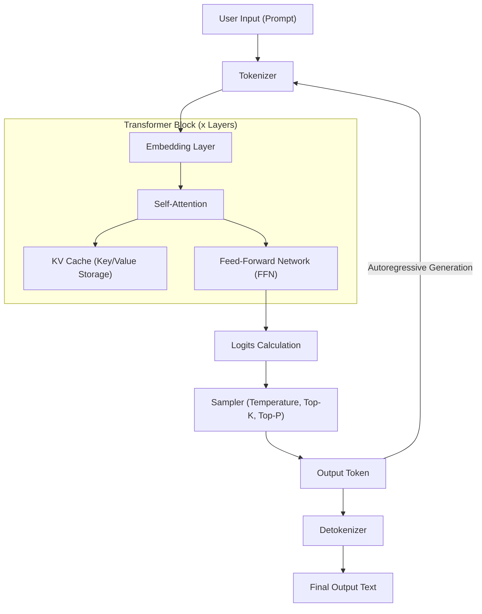
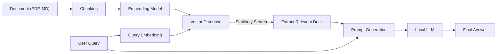

# 1. Introduction: Why Local LLMs on Windows Now?

As of 2026, the evolution of generative AI and Large Language Models (LLMs) shows a major paradigm shift from gigantic cloud-based API services to "local LLMs" running on personal PCs and on-premise environments. While cloud AIs like OpenAI's GPT-5 and Anthropic's Claude 3.5 are incredibly powerful, not all companies and individuals can send all their data to the cloud. From the perspectives of privacy, security, latency, and long-term sustainable costs, the demand for local LLMs is exploding like never before.

The evolution of the local LLM ecosystem, especially in the Windows environment, is remarkable. Until a few years ago, "Linux for AI development and execution" was common sense, but as of 2026, Windows has transformed into an extremely powerful and accessible AI platform.

In this article, based on the latest technology trends of 2026, we provide a complete guide to building, operating, and optimizing local LLMs in a Windows environment. From easy setup using Ollama for beginners to extreme optimization using llama.cpp for advanced users, and further deep dives into the mathematical approach of VRAM calculation, deep understanding of the architecture, and local fine-tuning, we will explain everything thoroughly with an overwhelming volume.

## 1.1 Technology Trends Surrounding Local LLMs in 2026

The major trends shaping the current local LLM ecosystem are as follows:

1. **Complete Popularization of the GGUF Format**: GGUF (GPT-Generated Unified Format), which integrates metadata and tensors into a single file, has completely become the de facto standard. With this, simply downloading a single file from Hugging Face makes it executable in any environment.
2. **Democratization of the MoE (Mixture of Experts) Architecture**: Many small but high-performance MoE models have been released. By activating only a portion of the experts during inference, they achieve performance comparable to giant models while keeping the computational load on consumer PCs low.
3. **Advanced Abstraction and Optimization of Inference Engines**: Tools like Ollama, LM Studio, and AnythingLLM have been refined so that users no longer need to be aware of complex dependencies like CUDA driver installations. Also, the native Windows support for FlashAttention 3 has dramatically improved inference speed.
4. **Utilization of NPUs and the Rise of Windows Copilot+ PCs**: Even on laptops without GPUs, the technology to run small LLMs (SLM: Small Language Models) with low power consumption using the built-in NPU (Neural Processing Unit) has entered the practical stage.

---

# 2. Hardware Requirements and OS Preparation

To run local LLMs at practical speeds (15-30 tokens per second or more), selecting the right hardware is the most important factor.

## 2.1 Recommended Hardware Configuration

With the evolution of AI PCs, required specs are also changing.

- **OS**: Windows 11 Pro (24H2 or later). Essential for fully utilizing WSL2's features, advanced memory management, and the latest DirectML APIs.
- **CPU**: Intel Core Ultra 200 series or higher, or AMD Ryzen 9000 series or higher. When using CPU inference alongside, broad-bandwidth memory communication is indispensable.
- **RAM**: Minimum 32GB, recommended 64GB or more. Main memory bandwidth (MB/s) becomes a crucial bottleneck during CPU inference or offloading. High-speed memory of DDR5-6000 or above is ideal.
- **GPU**: NVIDIA RTX 4000/5000 series. The most important thing for local LLMs is not computing performance but "VRAM capacity".
  - **Entry**: RTX 4060 Ti (16GB version) - Best cost performance. Ideal for 8B-14B class models.
  - **Mid-range**: RTX 4070 Ti SUPER (16GB) / RTX 4080 SUPER (16GB)
  - **High-end**: RTX 4090 (24GB) / RTX 5090 (32GB) - Necessary to run 30B-70B class quantized models.
- **Storage**: PCIe Gen4 or Gen5 NVMe SSD. Dramatically reduces the load times of models that are tens of gigabytes in size.

## 2.2 Setting up WSL2 (Windows Subsystem for Linux 2)

While many GUI tools work natively on Windows, WSL2 is extremely useful for Python development, compiling the latest tools, and the LoRA fine-tuning mentioned later. In the latest Windows 11 environment, just by installing the NVIDIA driver on the host side, the GPU (CUDA) can be transparently used from WSL2.

Open PowerShell with administrator privileges and execute the following:

```powershell
# Install WSL2 and the latest Ubuntu
wsl --install -d Ubuntu-24.04

# Update the kernel
wsl --update
```

After installation, run `nvidia-smi` inside the WSL2 terminal, and if the GPU is recognized correctly, it is a success.

---

# 3. Local LLM Architecture and Inference Mechanism

Understanding how models generate text in a local environment and their internal structure is very useful for troubleshooting and optimization.

The following Mermaid diagram shows a typical local LLM inference pipeline.



## 3.1 Two Phases: Prefill and Decode

LLM text generation is divided into two phases with different computational characteristics.

1. **Prefill Phase (Prompt Processing)**: The phase that processes and understands the entire input prompt at once. Since parallel computing is possible, the computational power of the GPU (FLOPS) directly links to speed. If the prompt is long, this phase can take several seconds.
2. **Decode Phase (Token Generation)**: The phase that predicts one token at a time and feeds it to the next input (autoregressive). Since parallel computing is restricted in this phase, GPU VRAM bandwidth (Memory Bandwidth) becomes the definitive bottleneck.

---

# 4. Mathematical Understanding of VRAM Consumption and Model Size

To correctly determine "which model will run on my PC?", you need to understand the VRAM calculation formula. When VRAM shortages cause a fallback to system memory (RAM), inference speeds drop by 10x to 100x.

## 4.1 Base VRAM Based on Parameter Size

This is the amount of memory needed to load the model's weights into VRAM.
Calculate it using the model size $P$ (number of parameters, unit: 1 billion = 1B) and the number of bytes per parameter $B$.

$$
V_{base} = P \times B \quad \text{(GB)}
$$

For example, when loading an 8B (8 billion) parameter model in FP16 (half-precision floating point, 16 bits = 2 bytes):

$$
V_{base} = 8 \times 2 = 16 \text{ GB}
$$

In other words, even a GPU with 16GB of VRAM will reach its limit just by loading the model.

## 4.2 The Magic of Quantization

This is where "quantization" comes in. By reducing the precision of the parameters, the model size is drastically shrunk. In the case of the most common 4-bit quantization (e.g., Q4_K_M), it averages to about 0.55 bytes per parameter.

$$
V_{base\_4bit} = 8 \times 0.55 = 4.4 \text{ GB}
$$

With this, if you have 16GB of VRAM, you can run an 8B model with plenty of headroom.

## 4.3 KV Cache Calculation (GQA Supported Version)

During inference, the "KV cache" needed to retain past context consumes VRAM. The latest models, such as Llama 3, use GQA (Grouped Query Attention) to save memory.

The KV cache consumption $V_{kv}$ (in gigabytes) is expressed by the following formula:

$$
V_{kv} = 2 \times b \times s \times l \times \left( \frac{h_{kv}}{h_q} \right) \times h_q \times d \times B_{kv} \div 10^9
$$

Simplifying this using the number of key/value heads $h_{kv}$:

$$
V_{kv} = 2 \times b \times s \times l \times h_{kv} \times d \times B_{kv} \div 10^9
$$

Where:
- $b$: Batch size (usually 1 for individual local use)
- $s$: Sequence length (context length, e.g., 8192)
- $l$: Number of layers (e.g., 32)
- $h_{kv}$: Number of KV heads (e.g., 8)
- $d$: Number of dimensions per head (e.g., 128)
- $B_{kv}$: Number of bytes for KV cache (2 for FP16)

Calculation example (Llama 3 8B, context 8192, FP16 cache):
$V_{kv} = 2 \times 1 \times 8192 \times 32 \times 8 \times 128 \times 2 \div 10^9 \approx 1.07 \text{ GB}$

Note that the longer the context length $s$ is, the needed VRAM increases linearly.

---

# 5. Practice 1: Fastest and Shortest Setup using Ollama

Now that you understand the theory, let's actually run an LLM in a Windows environment.
As of 2026, the most user-friendly tool is "Ollama". It provides an intuitive Docker-like CLI.

## 5.1 Installation and Execution

1. Download the Windows installer from the [Ollama Official Website](https://ollama.com/) and run it.
2. Open PowerShell and enter the following command. Here, we'll use the Japanese-compatible `llama3:8b`.

```powershell
ollama run llama3:8b
```

The model will be downloaded on the first run. Once complete, you can interact with it directly in the terminal.

## 5.2 Creating a Custom AI with a Modelfile

You can easily create an AI with a specific persona. Create a `Modelfile` in an arbitrary location.

```text
FROM llama3:8b

SYSTEM """
You are an exceptionally talented senior software engineer.
For user questions, always provide code examples and answer logically and concisely.
"""

PARAMETER temperature 0.3
PARAMETER num_ctx 8192
```

Build and run your custom model with the following commands:

```powershell
ollama create SeniorDev -f ./Modelfile
ollama run SeniorDev
```

## 5.3 Usage from External Apps (AI Editors)

Ollama exposes an OpenAI-compatible API endpoint at `http://localhost:11434`.
By simply setting this URL in the backend settings of VS Code extensions like Cursor or Continue.dev, and specifying the model name such as `SeniorDev`, a powerful local coding assistant is realized for free.

---

# 6. Practice 2: Extreme Performance Tuning with llama.cpp

If you want fine-grained memory management or want to be the first to try out the latest formats (like EXL2 or IQ quantization), you manipulate the core engine `llama.cpp` directly.

## 6.1 llama.cpp Build Steps

In a Windows environment, the best approach is building from source using CUDA Toolkit and CMake.

```powershell
git clone https://github.com/ggerganov/llama.cpp
cd llama.cpp
mkdir build
cd build

# Configure for CUDA support and compile
cmake .. -DLLAMA_CUBLAS=ON -DBUILD_SHARED_LIBS=OFF
cmake --build . --config Release -j 16
```

## 6.2 Advanced Launching in Server Mode

Host the model using the built `llama-server.exe`.

```powershell
.\bin\Release\llama-server.exe `
  --model "C:\models\Llama-3-8B-Instruct.Q4_K_M.gguf" `
  --ctx-size 8192 `
  --n-gpu-layers 99 `
  --threads 8 `
  --flash-attn `
  --port 8080
```

- `--n-gpu-layers 99`: Offloads all possible layers to GPU VRAM.
- `--flash-attn`: Enables FlashAttention 3, achieving improved inference speed and reduced VRAM consumption for the KV cache.

---

# 7. GUI Frontend: LM Studio and Building Local RAG

If you're resistant to the command line, or intuitively want to perform RAG (Retrieval-Augmented Generation), you can use a GUI.

## 7.1 LM Studio

LM Studio is a brilliant application that bundles model search, downloading, system requirement pre-checks, and a chat UI all into one. Just by pressing the "Local Server" button in the app, an OpenAI-compatible API starts up.

## 7.2 RAG Architecture using AnythingLLM

Here is the architecture diagram of a RAG environment for reading internal documents and personal notes.



Using the AnythingLLM desktop version (Windows), just specify Ollama (LLM and Embedding) from the settings screen and set it up to use a local VectorDB (LanceDB). This architecture can be completed in minutes. A private AI is born that does not send any data externally.

---

# 8. Fine-Tuning (LoRA) on Windows WSL2

If you want to not just run locally but make the model smarter with your own data, fine-tuning using LoRA (Low-Rank Adaptation) is possible. As of 2026, by using a library called "Unsloth", an 8B model can finish training in a few hours on a Windows WSL2 environment even with 16GB of VRAM.

Execute the following within WSL2's Ubuntu to build the environment.

```bash
conda create --name unsloth_env python=3.11
conda activate unsloth_env
pip install "unsloth[colab-new] @ git+https://github.com/unslothai/unsloth.git"
pip install --no-deps trl peft accelerate bitsandbytes
```

Unsloth optimizes CUDA kernels to the extreme, providing about twice the training speed and half the VRAM consumption compared to the standard Hugging Face libraries. Just spin up a Jupyter Notebook and load your dataset (JSONL format), and training for several epochs is possible even on an RTX 4060 Ti with 12GB to 16GB of VRAM.

---

# 9. Performance Troubleshooting

Common problems faced and their solutions.

### 1. Inference speed is extremely slow (1-2 tokens/s)
**Cause**: The model doesn't fit entirely into VRAM and is being offloaded to system memory (RAM).
**Solution**: Check "Dedicated GPU memory" in the Task Manager. If it's hitting the limit, decrease the context size (`-c`), or use a model with lower bit quantization (like Q4_K_M).

### 2. "CUDA out of memory" error
**Cause**: VRAM has been completely exhausted. This occurs especially when the context is prolonged and the KV cache becomes bloated.
**Solution**: Intentionally restrict the values to smaller ones using `num_ctx` for Ollama, or `-c` for llama.cpp.

### 3. Strange Japanese Generation
**Cause**: Mismatch in prompt templates, or an unsupported model.
**Solution**: Use models that include `Instruct` in their name, and ensure that the tool is selecting the correct template specified by the model author, such as the ChatML or Llama3 format.

---

# 10. Conclusion and Future Prospects

In 2026, building a local LLM in a Windows environment is no longer the privilege of a limited number of engineers. With the de facto standardization of the GGUF format, the emergence of refined ecosystems like Ollama and LM Studio, and hardware optimizations led by FlashAttention, anyone can easily obtain an enterprise-grade AI environment.

Please make use of the following points explained in this article:

1. Use **mathematical VRAM calculations** to logically select the optimal model size and quantization level for your PC specs.
2. Build your environment at maximum speed using **Ollama**, and dramatically improve productivity by integrating it with AI editors.
3. Bring out the ultimate performance of your hardware with the advanced parameter control of **llama.cpp**.
4. Build a secure local RAG system to handle confidential data with **AnythingLLM**.
5. Nurture a custom AI with your own specialized knowledge by utilizing **Unsloth (WSL2)**.

The "democratization" of AI is no longer a buzzword, but a real system running on your Windows desktop. Free yourself from the usage costs of cloud APIs and information leak risks, and step into the world of free and powerful private AI right now.
