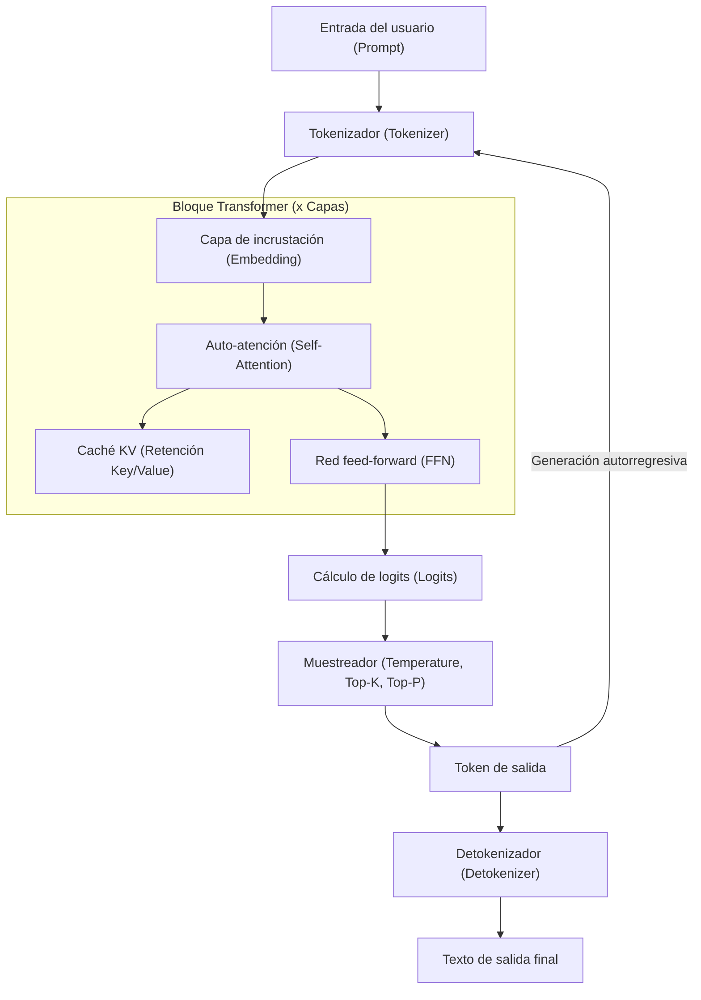
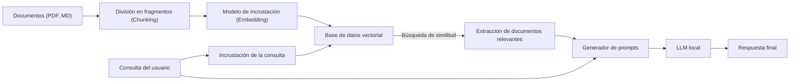

# 1. Introducción: ¿Por qué LLM locales en Windows ahora?

En 2026, la evolución de la IA generativa y los Grandes Modelos de Lenguaje (LLM) muestra un cambio de paradigma importante: desde servicios API gigantes en la nube hasta "LLM locales" que se ejecutan en PCs personales y entornos on-premise. Aunque las IA en la nube como GPT-5 de OpenAI o Claude 3.5 de Anthropic son extremadamente potentes, no todas las empresas o individuos pueden enviar todos sus datos a la nube. Desde el punto de vista de la privacidad, seguridad, latencia y los costes sostenibles a largo plazo, la demanda de LLM locales ha crecido explosivamente como nunca antes.

Especialmente en el entorno Windows, la evolución del ecosistema de LLM locales es notable. Hasta hace unos años, el sentido común dictaba que "el desarrollo y la ejecución de IA significaba Linux", pero en 2026 Windows se ha transformado en una plataforma de IA extremadamente potente y accesible.

Este artículo, basado en las últimas tendencias tecnológicas de 2026, proporciona una guía completa para construir, operar y optimizar un LLM local en un entorno Windows. Cubriremos exhaustivamente desde una configuración simple con Ollama para principiantes, hasta una optimización extrema usando llama.cpp para usuarios avanzados, además de profundizar en el enfoque matemático del cálculo de VRAM, una comprensión profunda de la arquitectura y el fine-tuning local.

## 1.1 Tendencias tecnológicas que rodean a los LLM locales en 2026

Las principales tendencias que conforman el ecosistema actual de los LLM locales son las siguientes:

1. **Adopción total del formato GGUF**: El GGUF (GPT-Generated Unified Format), que integra metadatos y tensores en un solo archivo, se ha convertido en el estándar de facto. Esto permite que con solo descargar un archivo desde Hugging Face, se pueda ejecutar en cualquier entorno.
2. **Democratización de la arquitectura MoE (Mixture of Experts)**: Se han lanzado numerosos modelos MoE de pequeña escala pero de alto rendimiento, que al activar solo ciertos expertos durante la inferencia, logran un rendimiento comparable al de modelos gigantes mientras mantienen bajo el uso de computación en PCs de consumo.
3. **Abstracción y optimización avanzadas de los motores de inferencia**: Herramientas como Ollama, LM Studio y AnythingLLM se han perfeccionado, eliminando la necesidad de que los usuarios se preocupen por dependencias complejas como la instalación de controladores CUDA. Además, el soporte nativo de FlashAttention 3 en Windows ha mejorado drásticamente la velocidad de inferencia.
4. **Utilización de NPU y el auge de las PC Windows Copilot+**: Incluso en laptops sin GPU, la tecnología para ejecutar pequeños LLM (SLM: Small Language Models) con bajo consumo energético utilizando la NPU (Neural Processing Unit) integrada ha alcanzado una etapa práctica.

---

# 2. Requisitos de hardware y preparación del SO

Para ejecutar un LLM local a una velocidad práctica (más de 15-30 tokens por segundo), la selección del hardware es lo más importante.

## 2.1 Configuración de hardware recomendada

Con la evolución de los PC con IA, las especificaciones requeridas también están cambiando.

- **SO**: Windows 11 Pro (24H2 o posterior). Indispensable para utilizar las funcionalidades completas de WSL2, la gestión avanzada de memoria y las últimas API de DirectML.
- **CPU**: Intel Core Ultra serie 200 o superior, o AMD Ryzen serie 9000 o superior. Si se utiliza la inferencia por CPU de forma combinada, es esencial una comunicación de memoria de gran ancho de banda.
- **RAM**: Mínimo 32 GB, recomendado 64 GB o más. El ancho de banda de la memoria principal (MB/s) se convierte en el cuello de botella decisivo durante la inferencia por CPU o la descarga (offloading). Una memoria rápida como DDR5-6000 o superior es ideal.
- **GPU**: NVIDIA RTX serie 4000/5000. Lo más importante en los LLM locales no es el rendimiento de cálculo, sino la "capacidad de VRAM".
  - **Entrada**: RTX 4060 Ti (versión de 16 GB) - La mejor relación calidad-precio. Ideal para modelos de clase 8B a 14B.
  - **Gama media**: RTX 4070 Ti SUPER (16 GB) / RTX 4080 SUPER (16 GB)
  - **Gama alta**: RTX 4090 (24 GB) / RTX 5090 (32 GB) - Necesaria para ejecutar modelos cuantizados de clase 30B a 70B.
- **Almacenamiento**: NVMe SSD PCIe Gen4 o Gen5. Reduce drásticamente el tiempo de carga de modelos de decenas de GB.

## 2.2 Configuración de WSL2 (Windows Subsystem for Linux 2)

Aunque muchas herramientas GUI funcionan de forma nativa en Windows, WSL2 es muy útil para el desarrollo con Python, la compilación de las últimas herramientas y el fine-tuning LoRA que veremos más adelante. En los entornos modernos de Windows 11, simplemente instalando el controlador NVIDIA en el host, la GPU (CUDA) se puede utilizar de forma transparente desde WSL2.

Abre PowerShell con privilegios de administrador y ejecuta lo siguiente:

```powershell
# Instalación de WSL2 y el último Ubuntu
wsl --install -d Ubuntu-24.04

# Actualización del kernel
wsl --update
```

Después de la instalación, ejecuta `nvidia-smi` dentro de la terminal de WSL2. Si la GPU se reconoce correctamente, ha sido un éxito.

---

# 3. Arquitectura del LLM local y mecanismo de inferencia

Comprender cómo el modelo genera texto en un entorno local y su estructura interna es extremadamente útil para la resolución de problemas y la optimización.

El siguiente diagrama Mermaid muestra la ruta de inferencia típica de un LLM local.



## 3.1 Dos fases: Prefill y Decode

La generación de texto por parte de un LLM se divide en dos fases con diferentes características computacionales:

1. **Fase de Prefill (Procesamiento del prompt)**: Fase en la que todo el prompt introducido se procesa y comprende a la vez. Dado que es posible el cálculo paralelo, la capacidad de cálculo de la GPU (FLOPS) está directamente relacionada con la velocidad. Si el prompt es largo, esta fase puede tardar varios segundos.
2. **Fase de Decode (Generación de tokens)**: Fase en la que se predice un token a la vez y se pasa a la siguiente entrada (autorregresiva). Dado que el cálculo paralelo está limitado en esta fase, el ancho de banda de la VRAM (Memory Bandwidth) de la GPU se convierte en un cuello de botella decisivo.

---

# 4. Cálculo del consumo de VRAM y comprensión matemática del tamaño del modelo

Para determinar correctamente "qué modelos pueden ejecutarse en mi PC", es necesario comprender la fórmula para calcular la VRAM. Cuando ocurre un fallback hacia la memoria del sistema (RAM) debido a la falta de VRAM, la velocidad de inferencia se ralentiza de 10 a 100 veces.

## 4.1 VRAM base según el tamaño de los parámetros

Esta es la cantidad de memoria requerida para cargar los pesos (weights) del modelo en la VRAM.
Se calcula usando el tamaño del modelo $P$ (número de parámetros, unidad: 1000 millones = 1B) y el número de bytes por parámetro $B$.

$$
V_{base} = P \times B \quad \text{(GB)}
$$

Por ejemplo, al cargar un modelo de parámetros 8B (8 mil millones) en FP16 (punto flotante de media precisión, 16 bits = 2 bytes):

$$
V_{base} = 8 \times 2 = 16 \text{ GB}
$$

En otras palabras, incluso con una GPU de 16 GB de VRAM, se llega casi al límite solo con cargar el modelo.

## 4.2 La magia de la cuantización (Quantization)

Aquí es donde entra en juego la "cuantización". Al reducir la precisión de los parámetros, el tamaño del modelo se reduce drásticamente. En el caso más común de la cuantización de 4 bits (ej: Q4_K_M), el promedio es de aproximadamente 0.55 bytes por parámetro.

$$
V_{base\_4bit} = 8 \times 0.55 = 4.4 \text{ GB}
$$

Gracias a esto, si se tienen 16 GB de VRAM, se puede ejecutar un modelo 8B con mucho margen.

## 4.3 Cálculo de la caché KV (Versión compatible con GQA)

Durante la inferencia, la "caché KV", que retiene el contexto pasado, consume VRAM. En los modelos más recientes como Llama 3, se adopta GQA (Grouped Query Attention) para ahorrar memoria.

El consumo de la caché KV $V_{kv}$ (en gigabytes) se expresa mediante la siguiente fórmula matemática:

$$
V_{kv} = 2 \times b \times s \times l \times \left( \frac{h_{kv}}{h_q} \right) \times h_q \times d \times B_{kv} \div 10^9
$$

Simplificando, se puede calcular fácilmente usando el número de cabezales (heads) de Key y Value $h_{kv}$:

$$
V_{kv} = 2 \times b \times s \times l \times h_{kv} \times d \times B_{kv} \div 10^9
$$

Donde:
- $b$: Tamaño del lote (normalmente 1 para uso personal y local)
- $s$: Longitud de la secuencia (longitud del contexto, ej: 8192)
- $l$: Número de capas (ej: 32)
- $h_{kv}$: Número de cabezales KV (ej: 8)
- $d$: Número de dimensiones por cabezal (ej: 128)
- $B_{kv}$: Número de bytes de la caché KV (2 para FP16)

Ejemplo de cálculo (Llama 3 8B, contexto 8192, caché FP16):
$V_{kv} = 2 \times 1 \times 8192 \times 32 \times 8 \times 128 \times 2 \div 10^9 \approx 1.07 \text{ GB}$

Tenga en cuenta que cuanto mayor sea la longitud del contexto $s$, la VRAM requerida aumentará de forma lineal.

---

# 5. Práctica 1: Configuración más rápida y corta usando Ollama

Una vez entendida la teoría, ejecutemos un LLM en el entorno Windows.
En 2026, la herramienta más amigable para el usuario es "Ollama". Proporciona una CLI intuitiva tipo Docker.

## 5.1 Instalación y ejecución

1. Descarga el instalador para Windows desde el [sitio web oficial de Ollama](https://ollama.com/) y ejecútalo.
2. Abre PowerShell e introduce el siguiente comando. Aquí usaremos `llama3:8b`, que soporta japonés.

```powershell
ollama run llama3:8b
```

En la primera ejecución, se descargará el modelo. Una vez finalizado, podrás interactuar directamente en la terminal.

## 5.2 Creación de una IA personalizada mediante Modelfile

Puedes crear fácilmente una IA con una personalidad específica. Crea un `Modelfile` en cualquier ubicación.

```text
FROM llama3:8b

SYSTEM """
Eres un ingeniero de software senior muy talentoso.
Al responder a las preguntas de los usuarios, debes incluir siempre ejemplos de código y responder de forma lógica y concisa.
"""

PARAMETER temperature 0.3
PARAMETER num_ctx 8192
```

Ejecuta el siguiente comando para compilar y ejecutar tu propio modelo.

```powershell
ollama create SeniorDev -f ./Modelfile
ollama run SeniorDev
```

## 5.3 Uso desde aplicaciones externas (Editores de IA)

Ollama expone un punto de conexión de la API compatible con OpenAI en `http://localhost:11434`.
Simplemente configurando esta URL en los ajustes de backend de extensiones de VS Code como Cursor o Continue.dev y especificando un modelo como `SeniorDev`, obtendrás un potente asistente de programación local y gratuito.

---

# 6. Práctica 2: Ajuste de rendimiento extremo con llama.cpp

Si quieres probar opciones como una gestión detallada de la memoria o los últimos formatos (EXL2, cuantización IQ, etc.) lo antes posible, interactúa directamente con el motor central, `llama.cpp`.

## 6.1 Pasos para compilar llama.cpp

En un entorno Windows, lo mejor es compilar desde el código fuente utilizando CUDA Toolkit y CMake.

```powershell
git clone https://github.com/ggerganov/llama.cpp
cd llama.cpp
mkdir build
cd build

# Configurar para CUDA y compilar
cmake .. -DLLAMA_CUBLAS=ON -DBUILD_SHARED_LIBS=OFF
cmake --build . --config Release -j 16
```

## 6.2 Inicio avanzado en modo servidor

Utiliza el ejecutable `llama-server.exe` compilado para alojar el modelo.

```powershell
.\bin\Release\llama-server.exe `
  --model "C:\models\Llama-3-8B-Instruct.Q4_K_M.gguf" `
  --ctx-size 8192 `
  --n-gpu-layers 99 `
  --threads 8 `
  --flash-attn `
  --port 8080
```

- `--n-gpu-layers 99`: Descarga (offload) todas las capas posibles a la VRAM de la GPU.
- `--flash-attn`: Habilita FlashAttention 3, logrando una mejora en la velocidad de inferencia y una reducción en el consumo de VRAM por parte de la caché KV.

---

# 7. Interfaz gráfica (GUI): Construcción de LM Studio y RAG local

Si no te sientes cómodo con la línea de comandos o si deseas realizar RAG (Generación Aumentada por Recuperación) de manera intuitiva, puedes usar una GUI.

## 7.1 LM Studio

LM Studio es una excelente aplicación que integra la búsqueda y descarga de modelos, verificación previa de los requisitos del sistema y una interfaz de chat. Simplemente con presionar el botón "Local Server" en la aplicación, se levantará una API compatible con OpenAI.

## 7.2 Arquitectura RAG usando AnythingLLM

Este es un diagrama de la arquitectura de un entorno RAG para cargar documentos internos o notas personales.



Si usas la versión de escritorio de AnythingLLM (Windows), simplemente configurando Ollama (LLM y Embedding) desde la pantalla de configuración y utilizando la VectorDB local (LanceDB), esta arquitectura se completará en minutos. Así nace una IA privada que no envía ningún dato al exterior.

---

# 8. Fine-tuning en Windows WSL2 (LoRA)

Si además de ejecutarlo localmente quieres que el modelo sea más inteligente con tus propios datos, es posible realizar fine-tuning mediante LoRA (Low-Rank Adaptation). En 2026, utilizando la biblioteca "Unsloth", se puede completar el entrenamiento de un modelo 8B en unas pocas horas en un entorno WSL2 de Windows, incluso con 16 GB de VRAM.

Ejecuta lo siguiente dentro de Ubuntu en WSL2 para preparar el entorno:

```bash
conda create --name unsloth_env python=3.11
conda activate unsloth_env
pip install "unsloth[colab-new] @ git+https://github.com/unslothai/unsloth.git"
pip install --no-deps trl peft accelerate bitsandbytes
```

Unsloth optimiza los núcleos CUDA al extremo, y en comparación con la biblioteca estándar de Hugging Face, la velocidad de entrenamiento es aproximadamente el doble, mientras que el consumo de VRAM se reduce a la mitad. Al abrir un Jupyter Notebook y cargar un conjunto de datos (formato JSONL), el entrenamiento de varias épocas es posible incluso en una RTX 4060 Ti con 12 GB-16 GB de VRAM.

---

# 9. Resolución de problemas de rendimiento

Estos son los problemas más frecuentes a los que te puedes enfrentar y sus soluciones.

### 1. La velocidad de inferencia es extremadamente lenta (1-2 tokens/s)
**Causa**: El modelo no cabe en la VRAM y se está descargando (offloading) a la memoria del sistema (RAM).
**Solución**: Verifica la "Memoria dedicada de la GPU" en el Administrador de tareas. Si se ha alcanzado el límite, reduce el tamaño del contexto (`-c`) o utiliza un modelo con cuantización de menos bits (como Q4_K_M).

### 2. Error de "CUDA out of memory"
**Causa**: La VRAM se ha agotado por completo. Esto ocurre especialmente cuando la interacción se prolonga y la caché KV aumenta de tamaño.
**Solución**: Limita intencionadamente el valor de `num_ctx` en el caso de Ollama, o de `-c` en el caso de llama.cpp a un número menor.

### 3. La generación en japonés (u otro idioma) es extraña
**Causa**: Incompatibilidad en la plantilla del prompt, o el modelo no es compatible.
**Solución**: Asegúrate de usar un modelo que contenga `Instruct` en su nombre y verifica que la herramienta tenga seleccionada la plantilla correcta especificada por el creador del modelo, como el formato ChatML o Llama3.

---

# 10. Conclusión y perspectivas de futuro

En 2026, la construcción de un LLM local en un entorno Windows ya no es un privilegio reservado para unos pocos ingenieros. Gracias a la estandarización del formato GGUF, la aparición de ecosistemas sofisticados como Ollama o LM Studio y las optimizaciones de hardware como FlashAttention, cualquier persona puede obtener fácilmente un entorno de IA de nivel empresarial.

Aprovecha los siguientes puntos explicados en este artículo:

1. Elegir lógicamente el tamaño del modelo y el nivel de cuantización óptimos para las especificaciones de tu PC utilizando el **cálculo matemático de la VRAM**.
2. Construir el entorno lo más rápido posible con **Ollama** y mejorar drásticamente la productividad vinculándolo con un editor de IA.
3. Extraer el rendimiento límite del hardware mediante el control avanzado de parámetros en **llama.cpp**.
4. Construir un sistema RAG local y seguro para manejar datos confidenciales con **AnythingLLM**.
5. Fomentar tu propia IA personalizada con conocimientos especializados aprovechando **Unsloth (WSL2)**.

La "democratización" de la IA ya no es una palabra de moda; es un sistema real que funciona en tu escritorio de Windows. Libérate de los costes de uso de API en la nube y los riesgos de filtración de información, e ingresa hoy mismo al poderoso y libre mundo de la IA privada.
