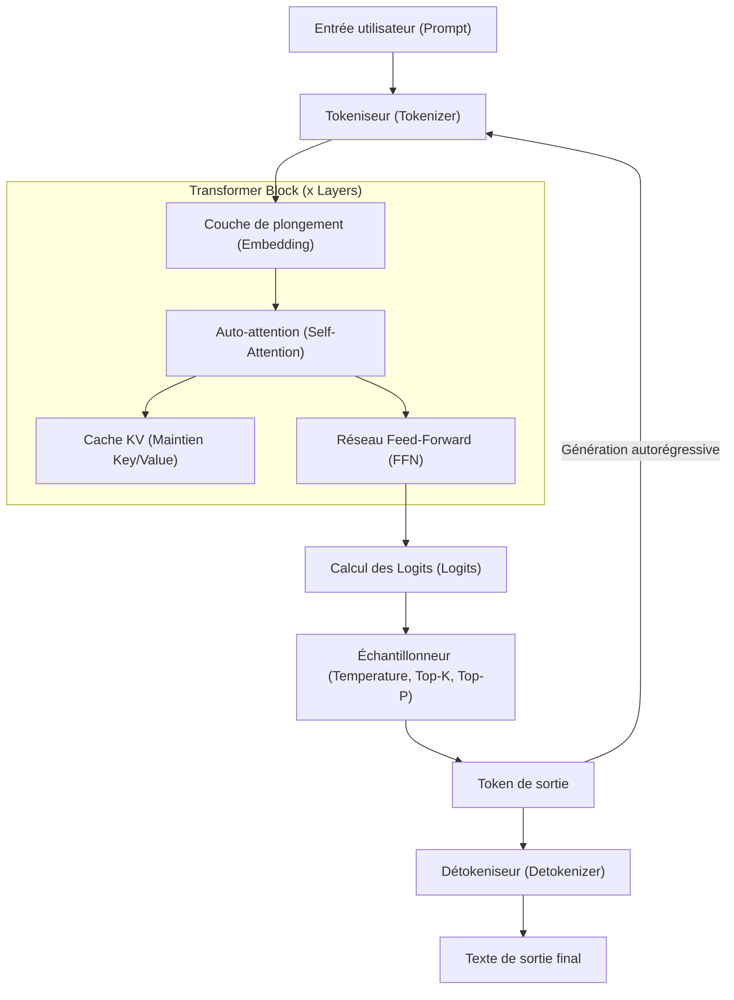
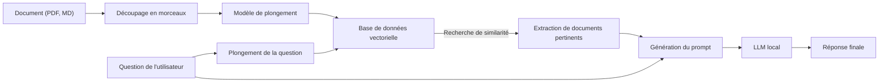

# 1. Introduction : Pourquoi un LLM local sous Windows aujourd'hui ?

En 2026, l'évolution de l'IA générative et des grands modèles linguistiques (LLM) montre un changement de paradigme majeur, passant des services API massifs sur le cloud aux "LLM locaux" fonctionnant sur des PC personnels ou dans des environnements sur site. Les IA cloud comme GPT-5 d'OpenAI ou Claude 3.5 d'Anthropic sont extrêmement puissantes, mais les entreprises et les particuliers ne peuvent pas toujours envoyer toutes leurs données sur le cloud. Du point de vue de la confidentialité, de la sécurité, de la latence et des coûts à long terme et durables, la demande de LLM locaux a explosé comme jamais auparavant.

L'évolution de l'écosystème des LLM locaux, en particulier dans l'environnement Windows, est remarquable. Il y a quelques années, il était de notoriété publique que "le développement et l'exécution de l'IA se font sous Linux", mais en 2026, Windows s'est transformé en une plateforme d'IA extrêmement puissante et facile d'accès.

Cet article fournit un guide complet pour configurer, exploiter et optimiser les LLM locaux dans un environnement Windows, sur la base des dernières tendances technologiques de 2026. Nous expliquerons tout en détail avec un volume impressionnant, de la configuration facile avec Ollama pour les débutants, à l'optimisation extrême utilisant llama.cpp pour les utilisateurs avancés, en passant par l'approche mathématique des calculs VRAM, la compréhension approfondie de l'architecture et le fine-tuning (ajustement fin) en local.

## 1.1 Tendances technologiques entourant les LLM locaux en 2026

Les principales tendances qui façonnent l'écosystème actuel des LLM locaux sont les suivantes :

1. **Adoption complète du format GGUF** : GGUF (GPT-Generated Unified Format), qui intègre les métadonnées et les tenseurs dans un seul fichier, est devenu le standard de facto absolu. Ainsi, en téléchargeant un seul fichier depuis Hugging Face, il peut être exécuté dans n'importe quel environnement.
2. **Démocratisation de l'architecture MoE (Mixture of Experts)** : De nombreux modèles MoE, petits mais performants, ont été publiés. En activant seulement certains experts lors de l'inférence, ils atteignent des performances comparables aux modèles géants tout en réduisant la charge de calcul sur les PC grand public.
3. **Abstraction et optimisation avancées des moteurs d'inférence** : Des outils comme Ollama, LM Studio et AnythingLLM ont été affinés, éliminant le besoin pour les utilisateurs de se soucier des dépendances complexes telles que l'installation des pilotes CUDA. De plus, la prise en charge native de FlashAttention 3 sous Windows a considérablement amélioré la vitesse d'inférence.
4. **Utilisation des NPU et essor des PC Windows Copilot+** : La technologie permettant d'exécuter de petits LLM (SLM : Small Language Models) avec une faible consommation d'énergie en utilisant le NPU (Neural Processing Unit) intégré, même sur les ordinateurs portables sans GPU, est entrée dans la phase pratique.

---

# 2. Exigences matérielles et préparation du système d'exploitation

Pour qu'un LLM local fonctionne à une vitesse pratique (15 à 30 tokens ou plus par seconde), le choix du matériel est le plus important.

## 2.1 Configuration matérielle recommandée

Avec l'évolution des PC IA, les spécifications requises évoluent également.

- **Système d'exploitation (OS)** : Windows 11 Pro (24H2 ou ultérieur). Indispensable pour utiliser toutes les fonctionnalités de WSL2, la gestion avancée de la mémoire, ainsi que les dernières API de DirectML.
- **CPU** : Intel Core Ultra série 200 ou supérieur, ou AMD Ryzen série 9000 ou supérieur. Lors de l'utilisation conjointe de l'inférence CPU, une communication mémoire à large bande passante est essentielle.
- **RAM** : Minimum 32 Go, 64 Go ou plus recommandés. La bande passante de la mémoire principale (Mo/s) devient un goulot d'étranglement décisif lors de l'inférence CPU ou du déchargement. Une mémoire rapide DDR5-6000 ou supérieure est idéale.
- **GPU** : Séries NVIDIA RTX 4000/5000. Pour les LLM locaux, le plus important n'est pas la puissance de calcul, mais la "capacité de la VRAM".
  - **Entrée de gamme** : RTX 4060 Ti (version 16 Go) - Le meilleur rapport qualité-prix. Idéal pour les modèles de la classe 8B à 14B.
  - **Milieu de gamme** : RTX 4070 Ti SUPER (16 Go) / RTX 4080 SUPER (16 Go)
  - **Haut de gamme** : RTX 4090 (24 Go) / RTX 5090 (32 Go) - Nécessaire pour exécuter des modèles quantifiés de la classe 30B à 70B.
- **Stockage** : SSD NVMe PCIe Gen4 ou Gen5. Réduit considérablement le temps de chargement des modèles de plusieurs dizaines de gigaoctets.

## 2.2 Configuration de WSL2 (Windows Subsystem for Linux 2)

Bien que de nombreux outils GUI fonctionnent nativement sous Windows, WSL2 est très pratique pour le développement avec Python, la compilation des derniers outils et le fine-tuning LoRA décrit plus loin. Dans les environnements Windows 11 récents, en installant simplement le pilote NVIDIA sur l'hôte, le GPU (CUDA) peut être utilisé de manière transparente depuis WSL2.

Ouvrez PowerShell avec les droits d'administrateur et exécutez ce qui suit :

```powershell
# Installation de WSL2 et du dernier Ubuntu
wsl --install -d Ubuntu-24.04

# Mise à jour du noyau
wsl --update
```

Après l'installation, exécutez `nvidia-smi` dans le terminal WSL2. Si le GPU est correctement reconnu, c'est un succès.

---

# 3. Architecture et mécanisme d'inférence des LLM locaux

Comprendre la structure interne, c'est-à-dire la manière dont les modèles génèrent du texte dans un environnement local, est extrêmement utile pour le dépannage et l'optimisation.

Le diagramme Mermaid suivant montre le pipeline d'inférence typique d'un LLM local.



## 3.1 Deux phases : Prefill et Decode

La génération de texte des LLM est divisée en deux phases aux caractéristiques de calcul différentes.

1. **Phase de Prefill (traitement du prompt)** : C'est la phase où l'ensemble du prompt entré est traité et compris en une seule fois. Étant donné que le calcul parallèle est possible, la capacité de calcul (FLOPS) du GPU est directement liée à la vitesse. Si le prompt est long, cette phase peut prendre plusieurs secondes.
2. **Phase de Decode (génération de tokens)** : C'est la phase de prédiction token par token, en transmettant à l'entrée suivante (autorégressif). Comme le calcul parallèle est limité dans cette phase, la bande passante de la VRAM du GPU (Memory Bandwidth) devient le goulot d'étranglement décisif.

---

# 4. Calcul de la consommation de VRAM et compréhension mathématique de la taille du modèle

Pour juger correctement de "quel modèle fonctionnera sur mon PC ?", il est nécessaire de comprendre la formule de calcul de la VRAM. Lorsqu'un repli sur la mémoire système (RAM) se produit en raison d'un manque de VRAM, la vitesse d'inférence devient 10 à 100 fois plus lente.

## 4.1 VRAM de base basée sur la taille des paramètres

Il s'agit de la quantité de mémoire nécessaire pour charger les poids (weights) du modèle dans la VRAM.
Elle se calcule à l'aide de la taille du modèle $P$ (nombre de paramètres, unité : 1 milliard = 1B) et du nombre d'octets par paramètre $B$.

$$
V_{base} = P \times B \quad \text{(GB)}
$$

Par exemple, pour charger un modèle de 8B (8 milliards) de paramètres en FP16 (virgule flottante demi-précision, 16 bits = 2 octets) :

$$
V_{base} = 8 \times 2 = 16 \text{ GB}
$$

En d'autres termes, même avec un GPU doté de 16 Go de VRAM, on atteint presque la limite rien qu'en chargeant le modèle.

## 4.2 La magie de la quantification (Quantization)

C'est là qu'intervient la "quantification". En réduisant la précision des paramètres, la taille du modèle est considérablement réduite. Dans le cas de la quantification 4 bits la plus courante (ex: Q4_K_M), la moyenne est d'environ 0,55 octet par paramètre.

$$
V_{base\_4bit} = 8 \times 0.55 = 4.4 \text{ GB}
$$

Grâce à cela, si vous avez 16 Go de VRAM, vous pouvez exécuter un modèle 8B avec une marge suffisante.

## 4.3 Calcul du cache KV (Version compatible GQA)

Lors de l'inférence, le "cache KV" utilisé pour conserver le contexte passé consomme de la VRAM. Dans les modèles récents comme Llama 3, la GQA (Grouped Query Attention) est adoptée pour économiser de la mémoire.

La consommation du cache KV $V_{kv}$ (en gigaoctets) est exprimée par la formule mathématique suivante :

$$
V_{kv} = 2 \times b \times s \times l \times \left( \frac{h_{kv}}{h_q} \right) \times h_q \times d \times B_{kv} \div 10^9
$$

En simplifiant, cela peut être calculé facilement à l'aide du nombre de têtes clés et valeurs $h_{kv}$.

$$
V_{kv} = 2 \times b \times s \times l \times h_{kv} \times d \times B_{kv} \div 10^9
$$

Où :
- $b$ : Taille du lot (généralement 1 pour un usage local individuel)
- $s$ : Longueur de séquence (longueur du contexte, ex: 8192)
- $l$ : Nombre de couches (ex: 32)
- $h_{kv}$ : Nombre de têtes KV (ex: 8)
- $d$ : Nombre de dimensions par tête (ex: 128)
- $B_{kv}$ : Nombre d'octets du cache KV (2 pour FP16)

Exemple de calcul (Llama 3 8B, contexte 8192, cache FP16) :
$V_{kv} = 2 \times 1 \times 8192 \times 32 \times 8 \times 128 \times 2 \div 10^9 \approx 1.07 \text{ GB}$

Veuillez noter que plus la longueur du contexte $s$ est longue, plus la VRAM requise augmente linéairement.

---

# 5. Pratique 1 : Configuration la plus rapide et la plus courte avec Ollama

Maintenant que vous comprenez la théorie, essayons de faire fonctionner un LLM dans un environnement Windows.
En 2026, l'outil le plus convivial est "Ollama". Il fournit une CLI intuitive de type Docker.

## 5.1 Installation et exécution

1. Téléchargez et exécutez le programme d'installation Windows depuis le [site officiel d'Ollama](https://ollama.com/).
2. Ouvrez PowerShell et entrez la commande suivante. Ici, nous utiliserons `llama3:8b`, qui prend en charge le japonais (et le français).

```powershell
ollama run llama3:8b
```

Lors de la première exécution, le modèle sera téléchargé. Une fois terminé, vous pouvez interagir directement dans le terminal.

## 5.2 Création d'une IA personnalisée avec Modelfile

Vous pouvez facilement créer une IA avec un persona spécifique. Créez un fichier `Modelfile` à l'emplacement de votre choix.

```text
FROM llama3:8b

SYSTEM """
Vous êtes un ingénieur logiciel senior extrêmement compétent.
Répondez toujours aux questions des utilisateurs de manière logique et concise, en incluant des exemples de code.
"""

PARAMETER temperature 0.3
PARAMETER num_ctx 8192
```

Construisez et exécutez votre propre modèle avec les commandes suivantes :

```powershell
ollama create SeniorDev -f ./Modelfile
ollama run SeniorDev
```

## 5.3 Utilisation depuis des applications externes (Éditeurs IA)

Ollama expose un point de terminaison API compatible OpenAI sur `http://localhost:11434`.
En spécifiant simplement cette URL dans les paramètres de backend d'extensions VS Code comme Cursor ou Continue.dev, et en définissant le nom du modèle sur `SeniorDev`, etc., vous obtenez un puissant assistant de codage local gratuit.

---

# 6. Pratique 2 : Optimisation extrême des performances avec llama.cpp

Si vous souhaitez gérer la mémoire en détail ou être le premier à essayer les derniers formats (EXL2, quantification IQ, etc.), vous pouvez manipuler directement le moteur de base `llama.cpp`.

## 6.1 Procédure de compilation de llama.cpp

Dans un environnement Windows, il est préférable de compiler à partir des sources en utilisant CUDA Toolkit et CMake.

```powershell
git clone https://github.com/ggerganov/llama.cpp
cd llama.cpp
mkdir build
cd build

# Configuration et compilation avec prise en charge de CUDA
cmake .. -DLLAMA_CUBLAS=ON -DBUILD_SHARED_LIBS=OFF
cmake --build . --config Release -j 16
```

## 6.2 Lancement avancé en mode serveur

Utilisez `llama-server.exe` compilé pour héberger le modèle.

```powershell
.\bin\Release\llama-server.exe `
  --model "C:\models\Llama-3-8B-Instruct.Q4_K_M.gguf" `
  --ctx-size 8192 `
  --n-gpu-layers 99 `
  --threads 8 `
  --flash-attn `
  --port 8080
```

- `--n-gpu-layers 99` : Décharge autant de couches que possible vers la VRAM du GPU.
- `--flash-attn` : Active FlashAttention 3, permettant d'améliorer la vitesse d'inférence et de réduire la consommation VRAM du cache KV.

---

# 7. Front-end GUI : LM Studio et construction d'un RAG local

Si vous êtes réticent à utiliser la ligne de commande ou si vous souhaitez effectuer un RAG (Génération Augmentée par la Recherche) de manière intuitive, utilisez une interface graphique (GUI).

## 7.1 LM Studio

LM Studio est une excellente application qui regroupe la recherche de modèles, le téléchargement, la vérification préalable des exigences système et une interface utilisateur de chat en un seul endroit. En appuyant simplement sur le bouton "Local Server" dans l'application, une API compatible OpenAI démarre.

## 7.2 Architecture RAG à l'aide d'AnythingLLM

Voici un diagramme de l'architecture d'un environnement RAG permettant d'importer des documents d'entreprise ou des notes personnelles.



Avec la version de bureau d'AnythingLLM (Windows), il suffit de spécifier Ollama (LLM et Embedding) dans l'écran des paramètres et de configurer l'utilisation d'une base de données vectorielle locale (LanceDB) pour compléter cette architecture en quelques minutes. C'est la naissance d'une IA privée qui n'envoie aucune donnée à l'extérieur.

---

# 8. Fine-tuning sur Windows WSL2 (LoRA)

Si vous ne voulez pas seulement l'exécuter localement, mais aussi rendre le modèle plus intelligent avec vos propres données, un fine-tuning à l'aide de LoRA (Low-Rank Adaptation) est possible. En 2026, grâce à une bibliothèque appelée "Unsloth", l'apprentissage d'un modèle 8B peut être achevé en quelques heures dans un environnement Windows WSL2, même avec 16 Go de VRAM.

Exécutez ce qui suit dans Ubuntu sur WSL2 pour configurer l'environnement :

```bash
conda create --name unsloth_env python=3.11
conda activate unsloth_env
pip install "unsloth[colab-new] @ git+https://github.com/unslothai/unsloth.git"
pip install --no-deps trl peft accelerate bitsandbytes
```

Unsloth optimise les noyaux CUDA à l'extrême, rendant la vitesse d'apprentissage environ deux fois plus rapide et la consommation de VRAM réduite de moitié par rapport à la bibliothèque standard Hugging Face. En lançant simplement un Jupyter Notebook et en chargeant un jeu de données (format JSONL), l'apprentissage sur plusieurs époques est possible même avec une RTX 4060 Ti dotée de 12 à 16 Go de VRAM.

---

# 9. Dépannage des performances

Voici les problèmes fréquemment rencontrés et leurs solutions.

### 1. La vitesse d'inférence est extrêmement lente (1 à 2 tokens/s)
**Cause** : Le modèle ne rentre pas dans la VRAM et est déchargé sur la mémoire système (RAM).
**Solution** : Vérifiez la "Mémoire GPU dédiée" dans le Gestionnaire des tâches. Si elle atteint sa limite, réduisez la taille du contexte (`-c`) ou utilisez un modèle avec un niveau de quantification inférieur (comme Q4_K_M).

### 2. Erreur "CUDA out of memory"
**Cause** : La VRAM est complètement épuisée. Cela se produit notamment lorsque la conversation se prolonge et que le cache KV augmente de manière excessive.
**Solution** : Limitez intentionnellement la valeur de `num_ctx` pour Ollama, ou `-c` pour llama.cpp.

### 3. La génération du japonais est étrange
**Cause** : Incohérence dans le modèle de prompt, ou modèle non compatible.
**Solution** : Utilisez un modèle dont le nom inclut `Instruct` et assurez-vous que le modèle de prompt correct (format ChatML, format Llama3, etc.) spécifié par le créateur du modèle est sélectionné du côté de l'outil.

---

# 10. Conclusion et perspectives d'avenir

En 2026, la mise en place d'un LLM local dans un environnement Windows n'est plus un privilège réservé à une poignée d'ingénieurs. Avec l'adoption généralisée du format GGUF, l'émergence d'écosystèmes raffinés comme Ollama et LM Studio, ainsi que les optimisations matérielles telles que FlashAttention, n'importe qui peut facilement obtenir un environnement d'IA de niveau entreprise.

N'hésitez pas à tirer parti des points expliqués dans cet article :

1. Utiliser le **calcul mathématique de la VRAM** pour choisir logiquement la taille de modèle et le niveau de quantification optimaux pour les spécifications de votre PC.
2. Utiliser **Ollama** pour configurer l'environnement le plus rapidement possible et l'intégrer à un éditeur d'IA pour améliorer considérablement la productivité.
3. Exploiter les limites de performance du matériel avec le contrôle avancé des paramètres de **llama.cpp**.
4. Construire un système RAG local sécurisé qui gère les données confidentielles avec **AnythingLLM**.
5. Tirer parti d'**Unsloth (WSL2)** pour développer une IA personnalisée avec votre propre expertise.

La "démocratisation" de l'IA n'est plus un buzzword, mais un système réel fonctionnant sur votre bureau Windows. Libérez-vous des coûts d'utilisation des API cloud et des risques de fuite d'informations, et entrez dès maintenant dans le monde libre et puissant de l'IA privée.
