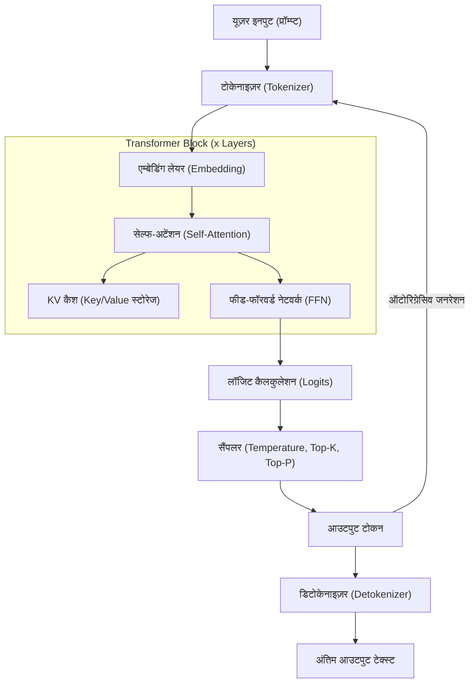
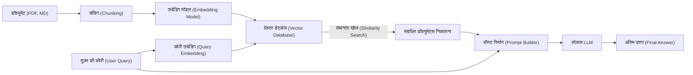

# 1. प्रस्तावना: अब विंडोज़ पर लोकल LLM क्यों?

2026 तक, जनरेटिव AI और लार्ज लैंग्वेज मॉडल (LLM) का विकास एक बड़ा प्रतिमान बदलाव (paradigm shift) दिखा रहा है, जो क्लाउड पर विशाल API सेवाओं से हटकर व्यक्तिगत पीसी और ऑन-प्रिमाइसेस वातावरण में चलने वाले 'लोकल LLM' की ओर बढ़ रहा है। OpenAI का GPT-5 और Anthropic का Claude 3.5 जैसे क्लाउड AI बहुत शक्तिशाली हैं, लेकिन कंपनियाँ और व्यक्ति अपना सारा डेटा क्लाउड पर नहीं भेज सकते हैं। गोपनीयता (Privacy), सुरक्षा, विलंबता (latency), और दीर्घकालिक व टिकाऊ लागत के दृष्टिकोण से लोकल LLM की मांग पहले से कहीं अधिक तेजी से बढ़ रही है।

विशेष रूप से विंडोज़ वातावरण में लोकल LLM के इकोसिस्टम का विकास उल्लेखनीय रहा है। कुछ साल पहले तक "AI विकास और निष्पादन (execution) का मतलब Linux है" यह एक सामान्य बात थी, लेकिन 2026 में विंडोज़ एक बहुत ही शक्तिशाली और सुलभ AI प्लेटफॉर्म में बदल गया है।

इस लेख में, 2026 के नवीनतम तकनीकी रुझानों को ध्यान में रखते हुए, विंडोज़ वातावरण में लोकल LLM के निर्माण, संचालन और अनुकूलन (optimization) के लिए एक संपूर्ण मार्गदर्शिका प्रदान की गई है। शुरुआती लोगों के लिए Ollama का उपयोग करके सरल सेटअप से लेकर, उन्नत उपयोगकर्ताओं के लिए llama.cpp का उपयोग करके अत्यधिक अनुकूलन (extreme optimization), VRAM गणना के गणितीय दृष्टिकोण, आर्किटेक्चर की गहरी समझ, और लोकल फाइन-ट्यूनिंग तक, हम इसे विस्तार से समझाएंगे।

## 1.1 2026 में लोकल LLM के तकनीकी रुझान

वर्तमान लोकल LLM इकोसिस्टम को आकार देने वाले प्रमुख रुझान इस प्रकार हैं:

1. **GGUF फॉर्मेट का पूर्ण उपयोग**: GGUF (GPT-Generated Unified Format), जो मेटाडेटा और टेंसर को एक ही फ़ाइल में एकीकृत करता है, अब पूरी तरह से वास्तविक मानक (de facto standard) बन गया है। इसके कारण, केवल Hugging Face से एक फ़ाइल डाउनलोड करके इसे किसी भी वातावरण में चलाना संभव हो गया है।
2. **MoE (Mixture of Experts) आर्किटेक्चर का लोकतंत्रीकरण (Democratization)**: छोटे लेकिन उच्च-प्रदर्शन वाले कई MoE मॉडल जारी किए गए हैं। अनुमान (inference) के दौरान केवल कुछ विशेषज्ञों (experts) को सक्रिय करके, यह उपभोक्ता पीसी (consumer PC) के कम्प्यूटेशनल भार को कम रखते हुए विशाल मॉडलों के बराबर प्रदर्शन दे रहा है।
3. **इन्फरेंस इंजन (Inference Engine) का उच्च अमूर्तीकरण (Abstraction) और अनुकूलन**: Ollama, LM Studio, AnythingLLM जैसे टूल बहुत परिष्कृत हो गए हैं, जिससे उपयोगकर्ताओं को CUDA ड्राइवर इंस्टॉल करने जैसी जटिल निर्भरताओं (dependencies) की चिंता करने की आवश्यकता नहीं है। इसके अलावा, FlashAttention 3 के विंडोज़ नेटिव समर्थन (native support) से इन्फरेंस गति में नाटकीय रूप से सुधार हुआ है।
4. **NPU का उपयोग और Windows Copilot+ PC का उदय**: NPU (Neural Processing Unit) का उपयोग करके छोटे LLM (SLM: Small Language Models) को कम बिजली की खपत के साथ चलाने की तकनीक व्यावहारिक चरण में प्रवेश कर चुकी है, यहाँ तक कि उन लैपटॉप में भी जिनमें GPU नहीं है।

---

# 2. हार्डवेयर आवश्यकताएँ और OS की तैयारी

लोकल LLM को व्यावहारिक गति (15-30 टोकन प्रति सेकंड या अधिक) पर चलाने के लिए हार्डवेयर का चयन सबसे महत्वपूर्ण है।

## 2.1 अनुशंसित हार्डवेयर कॉन्फ़िगरेशन

AI PC के विकास के साथ, आवश्यक विनिर्देश (specifications) भी बदल रहे हैं।

- **OS**: Windows 11 Pro (24H2 या बाद का संस्करण)। WSL2 की पूर्ण कार्यक्षमता और उन्नत मेमोरी प्रबंधन, साथ ही नवीनतम DirectML API का उपयोग करने के लिए यह आवश्यक है।
- **CPU**: Intel Core Ultra 200 सीरीज़ या उससे ऊपर, या AMD Ryzen 9000 सीरीज़ या उससे ऊपर। यदि CPU इन्फरेंस का भी उपयोग किया जा रहा है, तो ब्रॉडबैंड मेमोरी कम्युनिकेशन अनिवार्य है।
- **RAM**: न्यूनतम 32GB, 64GB या उससे अधिक अनुशंसित। मुख्य मेमोरी की बैंडविड्थ (MB/s) CPU इन्फरेंस या ऑफलोडिंग के दौरान एक निर्णायक अड़चन (bottleneck) बन जाती है। DDR5-6000 या उच्चतर गति वाली मेमोरी आदर्श है।
- **GPU**: NVIDIA RTX 4000/5000 सीरीज़। लोकल LLM में सबसे महत्वपूर्ण कम्प्यूटेशनल प्रदर्शन नहीं बल्कि "VRAM क्षमता" है।
  - **एंट्री लेवल**: RTX 4060 Ti (16GB संस्करण) - सबसे अच्छा कॉस्ट-परफॉरमेंस। 8B से 14B क्लास के मॉडलों के लिए आदर्श।
  - **मिड-रेंज**: RTX 4070 Ti SUPER (16GB) / RTX 4080 SUPER (16GB)
  - **हाई-एंड**: RTX 4090 (24GB) / RTX 5090 (32GB) - 30B से 70B क्लास के क्वांटाइज्ड मॉडलों (quantized models) को चलाने के लिए आवश्यक।
- **स्टोरेज**: PCIe Gen4 या Gen5 NVMe SSD। यह दसियों GB के मॉडलों के लोड होने के समय को काफी कम कर देता है।

## 2.2 WSL2 (Windows Subsystem for Linux 2) सेटअप

कई GUI टूल मूल रूप से (natively) विंडोज़ पर काम करते हैं, लेकिन Python का उपयोग करके विकास करने, नवीनतम टूल को संकलित (compile) करने और बाद में बताए गए LoRA फाइन-ट्यूनिंग के लिए WSL2 बहुत उपयोगी है। नवीनतम Windows 11 वातावरण में, केवल होस्ट साइड पर NVIDIA ड्राइवर स्थापित करके WSL2 से पारदर्शी (transparently) रूप से GPU (CUDA) का उपयोग किया जा सकता है।

एडमिनिस्ट्रेटर प्रिविलेज (Administrator privileges) के साथ PowerShell खोलें और निम्नलिखित चलाएँ:

```powershell
# WSL2 और नवीनतम Ubuntu इंस्टाल करें
wsl --install -d Ubuntu-24.04

# कर्नेल अपडेट करें
wsl --update
```

इंस्टॉलेशन के बाद, WSL2 टर्मिनल में `nvidia-smi` चलाएँ। यदि GPU सही तरीके से पहचाना जाता है, तो यह सफल है।

---

# 3. लोकल LLM आर्किटेक्चर और इन्फरेंस मैकेनिज्म

यह समझना कि लोकल वातावरण में मॉडल टेक्स्ट कैसे उत्पन्न करता है और इसकी आंतरिक संरचना क्या है, समस्या निवारण (troubleshooting) और अनुकूलन (optimization) के लिए बहुत उपयोगी है।

नीचे दिया गया Mermaid आरेख एक सामान्य लोकल LLM के इन्फरेंस पाइपलाइन को दर्शाता है।



## 3.1 2 चरण (Phases): Prefill और Decode

LLM टेक्स्ट जनरेशन को अलग-अलग कम्प्यूटेशनल विशेषताओं वाले दो चरणों में विभाजित किया गया है।

1. **Prefill (प्रॉम्प्ट प्रोसेसिंग) चरण**: यह वह चरण है जहाँ पूरे इनपुट प्रॉम्प्ट को एक साथ प्रोसेस किया जाता है और समझा जाता है। चूंकि समानांतर गणना (parallel computation) संभव है, इसलिए GPU की कम्प्यूटेशनल क्षमता (FLOPS) सीधे गति से संबंधित है। यदि प्रॉम्प्ट लंबा है, तो इस चरण में कुछ सेकंड लग सकते हैं।
2. **Decode (टोकन जनरेशन) चरण**: यह वह चरण है जो एक-एक करके टोकन की भविष्यवाणी करता है और इसे अगले इनपुट (autoregressive) में भेजता है। इस चरण में समानांतर गणना सीमित है, इसलिए GPU का VRAM बैंडविड्थ (Memory Bandwidth) एक निर्णायक अड़चन (bottleneck) बन जाता है।

---

# 4. VRAM खपत की गणना और मॉडल साइज़ की गणितीय समझ

"मेरे पीसी पर कौन सा मॉडल चलेगा?" इसका सही अंदाजा लगाने के लिए, आपको VRAM गणना सूत्र को समझने की आवश्यकता है। जब VRAM की कमी के कारण सिस्टम मेमोरी (RAM) पर फॉलबैक होता है, तो इन्फरेंस की गति 10 से 100 गुना धीमी हो जाती है।

## 4.1 पैरामीटर आकार के आधार पर बेस VRAM

यह मॉडल वेट (weights) को VRAM में लोड करने के लिए आवश्यक मेमोरी की मात्रा है।
इसकी गणना मॉडल आकार $P$ (पैरामीटर्स की संख्या, इकाई: 1 बिलियन = 1B) और प्रति पैरामीटर बाइट्स की संख्या $B$ का उपयोग करके की जाती है।

$$
V_{base} = P \times B \quad \text{(GB)}
$$

उदाहरण के लिए, यदि 8B (8 बिलियन) पैरामीटर वाले मॉडल को FP16 (हाफ-प्रिसिजन फ्लोटिंग-पॉइंट, 16 बिट्स = 2 बाइट्स) में लोड किया जाता है:

$$
V_{base} = 8 \times 2 = 16 \text{ GB}
$$

यानी 16GB VRAM वाले GPU में भी केवल मॉडल को लोड करने से ही वह लगभग अपनी सीमा तक पहुँच जाएगा।

## 4.2 क्वांटाइजेशन (Quantization) का जादू

यहीं पर "क्वांटाइजेशन" आता है। पैरामीटर्स की सटीकता (precision) को कम करके, मॉडल का आकार नाटकीय रूप से कम हो जाता है। सबसे आम 4-बिट क्वांटाइजेशन (उदा: Q4_K_M) के मामले में, यह प्रति पैरामीटर औसतन लगभग 0.55 बाइट्स होता है।

$$
V_{base\_4bit} = 8 \times 0.55 = 4.4 \text{ GB}
$$

इस प्रकार, 16GB VRAM के साथ, आप 8B मॉडल को बहुत आसानी से चला सकते हैं।

## 4.3 KV कैश की गणना (GQA समर्थित संस्करण)

इन्फरेंस के दौरान, पिछले संदर्भ (context) को बनाए रखने के लिए "KV कैश" VRAM की खपत करता है। Llama 3 जैसे नवीनतम मॉडलों में मेमोरी बचाने के लिए GQA (Grouped Query Attention) का उपयोग किया जाता है।

KV कैश की खपत $V_{kv}$ (गीगाबाइट में) निम्नलिखित सूत्र द्वारा व्यक्त की जा सकती है:

$$
V_{kv} = 2 \times b \times s \times l \times \left( \frac{h_{kv}}{h_q} \right) \times h_q \times d \times B_{kv} \div 10^9
$$

इसे सरल करते हुए, हम की (key) और वैल्यू (value) के हेड्स की संख्या $h_{kv}$ का उपयोग करके आसानी से गणना कर सकते हैं:

$$
V_{kv} = 2 \times b \times s \times l \times h_{kv} \times d \times B_{kv} \div 10^9
$$

जहाँ:
- $b$: बैच साइज़ (व्यक्तिगत लोकल उपयोग के लिए आमतौर पर 1)
- $s$: सीक्वेंस लंबाई (संदर्भ लंबाई, उदा: 8192)
- $l$: लेयर्स की संख्या (उदा: 32)
- $h_{kv}$: KV हेड्स की संख्या (उदा: 8)
- $d$: प्रति हेड डायमेंशन (उदा: 128)
- $B_{kv}$: KV कैश के बाइट्स (FP16 के लिए 2)

गणना का उदाहरण (Llama 3 8B, कॉन्टेक्स्ट 8192, FP16 कैश):
$V_{kv} = 2 \times 1 \times 8192 \times 32 \times 8 \times 128 \times 2 \div 10^9 \approx 1.07 \text{ GB}$

ध्यान दें कि संदर्भ की लंबाई $s$ जितनी लंबी होगी, आवश्यक VRAM उतना ही अधिक रैखिक (linearly) रूप से बढ़ेगा।

---

# 5. अभ्यास 1: Ollama का उपयोग करके सबसे तेज़ और सबसे छोटा सेटअप

अब जब हम थ्योरी समझ चुके हैं, तो आइए वास्तव में विंडोज़ वातावरण में LLM चलाएं।
2026 तक, "Ollama" सबसे यूज़र-फ्रेंडली टूल है। यह Docker की तरह ही एक बहुत ही सहज (intuitive) CLI प्रदान करता है।

## 5.1 इंस्टालेशन और रन (Installation and Execution)

1. [Ollama आधिकारिक वेबसाइट](https://ollama.com/) से विंडोज़ इंस्टॉलर डाउनलोड करें और इसे चलाएं।
2. PowerShell खोलें और निम्नलिखित कमांड दर्ज करें। यहाँ, हम जापानी समर्थित `llama3:8b` का उपयोग करेंगे।

```powershell
ollama run llama3:8b
```

पहली बार चलाने पर, मॉडल डाउनलोड होगा। इसके पूरा होने के बाद, आप सीधे टर्मिनल में चैट कर सकते हैं।

## 5.2 Modelfile का उपयोग करके कस्टम AI बनाना

आप आसानी से एक विशिष्ट व्यक्तित्व (persona) वाला AI बना सकते हैं। किसी भी स्थान पर एक `Modelfile` बनाएं।

```text
FROM llama3:8b

SYSTEM """
आप एक अत्यंत प्रतिभाशाली सीनियर सॉफ्टवेयर इंजीनियर हैं।
उपयोगकर्ता के प्रश्नों का उत्तर हमेशा कोड उदाहरणों के साथ तार्किक और संक्षिप्त रूप में दें।
"""

PARAMETER temperature 0.3
PARAMETER num_ctx 8192
```

अपने स्वयं के मॉडल को बिल्ड (build) करने और चलाने के लिए निम्नलिखित कमांड चलाएँ:

```powershell
ollama create SeniorDev -f ./Modelfile
ollama run SeniorDev
```

## 5.3 बाहरी ऐप्स (AI संपादक) से उपयोग

Ollama `http://localhost:11434` पर OpenAI संगत API एंडपॉइंट को एक्सपोज़ करता है।
Cursor या Continue.dev जैसे VS Code एक्सटेंशन के बैकएंड सेटिंग्स में उपरोक्त URL निर्दिष्ट करके और मॉडल के नाम के रूप में `SeniorDev` आदि निर्दिष्ट करके, आपको मुफ्त में एक शक्तिशाली लोकल कोडिंग असिस्टेंट मिल जाता है।

---

# 6. अभ्यास 2: llama.cpp के साथ अत्यधिक प्रदर्शन ट्यूनिंग (Extreme Performance Tuning)

यदि आप विस्तृत मेमोरी प्रबंधन चाहते हैं या नवीनतम फॉर्मेट्स (जैसे EXL2 और IQ क्वांटाइजेशन) को जल्दी आज़माना चाहते हैं, तो कोर इंजन `llama.cpp` का सीधे उपयोग करें।

## 6.1 llama.cpp के लिए बिल्ड प्रक्रिया

विंडोज़ वातावरण में, CUDA Toolkit और CMake का उपयोग करके स्रोत (source) से बिल्ड करना सबसे अच्छा तरीका है।

```powershell
git clone https://github.com/ggerganov/llama.cpp
cd llama.cpp
mkdir build
cd build

# CUDA सपोर्ट के लिए कॉन्फ़िगर और कंपाइल करें
cmake .. -DLLAMA_CUBLAS=ON -DBUILD_SHARED_LIBS=OFF
cmake --build . --config Release -j 16
```

## 6.2 सर्वर मोड में एडवांस स्टार्टअप

मॉडल को होस्ट करने के लिए बिल्ड किए गए `llama-server.exe` का उपयोग करें।

```powershell
.\bin\Release\llama-server.exe `
  --model "C:\models\Llama-3-8B-Instruct.Q4_K_M.gguf" `
  --ctx-size 8192 `
  --n-gpu-layers 99 `
  --threads 8 `
  --flash-attn `
  --port 8080
```

- `--n-gpu-layers 99`: जहाँ तक संभव हो सभी लेयर्स को GPU VRAM में ऑफलोड करता है।
- `--flash-attn`: FlashAttention 3 को सक्षम करता है, इन्फरेंस गति में सुधार करता है और KV कैश की VRAM खपत को कम करता है।

---

# 7. GUI फ्रंटएंड: LM Studio और लोकल RAG का निर्माण

यदि आप कमांड लाइन का उपयोग नहीं करना चाहते हैं या RAG (Retrieval-Augmented Generation) को सहजता (intuitively) से करना चाहते हैं, तो GUI का उपयोग करें।

## 7.1 LM Studio

LM Studio एक बेहतरीन एप्लिकेशन है जो मॉडल सर्च, डाउनलोड, सिस्टम आवश्यकता पूर्व-जाँच और चैट UI को एक जगह मिलाता है। ऐप में "Local Server" बटन दबाने से ही OpenAI संगत API शुरू हो जाता है।

## 7.2 AnythingLLM का उपयोग करके RAG आर्किटेक्चर

यहाँ RAG वातावरण का एक आर्किटेक्चर आरेख है जो आपके आंतरिक दस्तावेजों या व्यक्तिगत नोट्स को पढ़ सकता है:



AnythingLLM डेस्कटॉप संस्करण (विंडोज़) का उपयोग करके, बस सेटिंग स्क्रीन से Ollama (LLM और Embedding) निर्दिष्ट करें, और इसे लोकल VectorDB (LanceDB) का उपयोग करने के लिए सेट करें। केवल कुछ मिनटों में यह आर्किटेक्चर तैयार हो जाता है। यह एक ऐसा प्राइवेट AI बनाता है जो बाहरी रूप से कोई डेटा नहीं भेजता है।

---

# 8. Windows WSL2 पर फाइन-ट्यूनिंग (LoRA)

यदि आप मॉडल को न केवल लोकल रूप से चलाना चाहते हैं बल्कि अपने स्वयं के डेटा के साथ इसे और स्मार्ट बनाना चाहते हैं, तो आप LoRA (Low-Rank Adaptation) का उपयोग करके फाइन-ट्यूनिंग कर सकते हैं। 2026 तक, "Unsloth" नामक एक लाइब्रेरी का उपयोग करके, विंडोज़ के WSL2 वातावरण में, 16GB VRAM वाले 8B मॉडल की ट्रेनिंग कुछ ही घंटों में पूरी की जा सकती है।

वातावरण सेट करने के लिए WSL2 Ubuntu में निम्नलिखित चलाएँ:

```bash
conda create --name unsloth_env python=3.11
conda activate unsloth_env
pip install "unsloth[colab-new] @ git+https://github.com/unslothai/unsloth.git"
pip install --no-deps trl peft accelerate bitsandbytes
```

Unsloth ने CUDA कर्नेल को चरम सीमा तक अनुकूलित (optimize) किया है, मानक Hugging Face लाइब्रेरी की तुलना में ट्रेनिंग गति को दोगुना कर दिया है और VRAM की खपत को आधा कर दिया है। बस Jupyter Notebook शुरू करें और डेटासेट (JSONL प्रारूप) लोड करें, और कुछ ही एपोक (epochs) की ट्रेनिंग RTX 4060 Ti जैसे 12GB से 16GB VRAM वाले GPU पर संभव है।

---

# 9. परफॉरमेंस ट्रबलशूटिंग (Performance Troubleshooting)

यहाँ कुछ सामान्य समस्याएं और उनके समाधान दिए गए हैं:

### 1. इन्फरेंस की गति बहुत धीमी है (1 से 2 टोकन/सेकंड)
**कारण**: मॉडल VRAM में फिट नहीं हो रहा है और सिस्टम मेमोरी (RAM) पर ऑफलोड हो रहा है।
**समाधान**: टास्क मैनेजर में "Dedicated GPU memory" चेक करें। यदि यह सीमा तक पहुँच गया है, तो कॉन्टेक्स्ट साइज़ (`-c`) कम करें या कम बिट वाले क्वांटाइज्ड मॉडल (जैसे Q4_K_M) का उपयोग करें।

### 2. "CUDA out of memory" एरर
**कारण**: VRAM पूरी तरह से खत्म हो गया है। ऐसा अक्सर तब होता है जब चैट लंबी हो जाती है और KV कैश बहुत बड़ा हो जाता है।
**समाधान**: जानबूझकर मान को कम करें; Ollama के मामले में `num_ctx`, या llama.cpp के मामले में `-c` का मान कम करें।

### 3. टेक्स्ट जनरेशन (विशेषकर जापानी या हिंदी) अजीब है
**कारण**: प्रॉम्प्ट टेम्पलेट का बेमेल होना, या मॉडल उस भाषा का समर्थन नहीं करता है।
**समाधान**: ऐसे मॉडल का उपयोग करें जिसके नाम में `Instruct` शामिल हो, और सुनिश्चित करें कि टूल में सही टेम्पलेट (जैसे ChatML या Llama3 फॉर्मेट) चुना गया है जो मॉडल के निर्माता द्वारा निर्दिष्ट किया गया था।

---

# 10. निष्कर्ष और भविष्य की संभावनाएं

2026 में, विंडोज़ वातावरण में लोकल LLM का निर्माण अब केवल कुछ इंजीनियरों का विशेषाधिकार नहीं रह गया है। GGUF फॉर्मेट के वास्तविक मानक (de facto standard) बनने, Ollama और LM Studio जैसे परिष्कृत इकोसिस्टम के उदय, और FlashAttention जैसे हार्डवेयर ऑप्टिमाइज़ेशन के कारण, अब कोई भी आसानी से एंटरप्राइज़-ग्रेड AI वातावरण प्राप्त कर सकता है।

कृपया इस लेख में बताए गए निम्नलिखित बिंदुओं का उपयोग करें:

1. **VRAM की गणितीय गणना** का उपयोग करके तार्किक रूप से अपने पीसी विनिर्देशों (specs) के लिए इष्टतम मॉडल आकार और क्वांटाइजेशन स्तर चुनें।
2. **Ollama** का उपयोग करके सबसे तेज़ वातावरण सेटअप करें, और अपनी उत्पादकता बढ़ाने के लिए इसे AI एडिटर के साथ एकीकृत (integrate) करें।
3. **llama.cpp** के उन्नत पैरामीटर नियंत्रण के साथ हार्डवेयर के चरम प्रदर्शन को प्राप्त करें।
4. गोपनीय डेटा को संभालने के लिए **AnythingLLM** के साथ एक सुरक्षित लोकल RAG सिस्टम बनाएं।
5. अपना खुद का कस्टम AI बनाने के लिए **Unsloth (WSL2)** का उपयोग करें जिसमें विशेष ज्ञान हो।

AI का "लोकतंत्रीकरण" अब सिर्फ एक चर्चा का शब्द (buzzword) नहीं है, बल्कि एक वास्तविक प्रणाली है जो आपके विंडोज़ डेस्कटॉप पर चलती है। क्लाउड API उपयोग की लागतों और सूचना रिसाव (information leakage) के जोखिमों से मुक्त होकर, अभी स्वतंत्र और शक्तिशाली प्राइवेट AI की दुनिया में कदम रखें।
