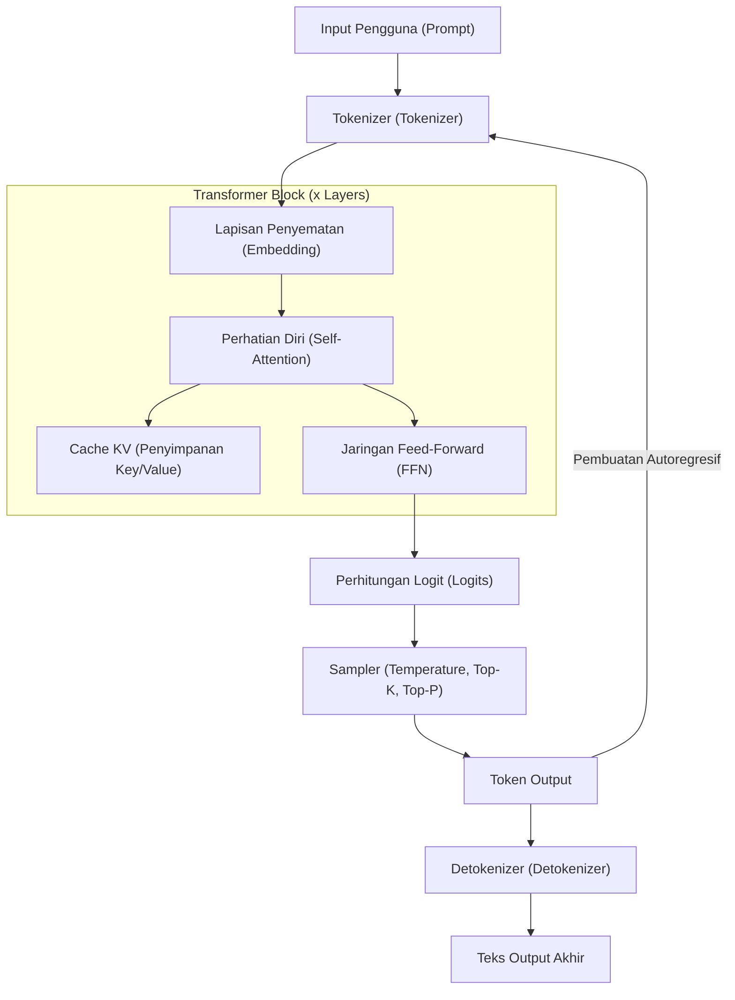
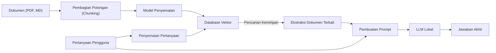

# 1. Pendahuluan: Mengapa LLM Lokal di Windows Sekarang?

Pada tahun 2026, evolusi AI Generatif dan Large Language Models (LLM) menunjukkan pergeseran paradigma besar dari layanan API raksasa di cloud ke "LLM lokal" yang berjalan di PC pribadi atau lingkungan on-premise. AI cloud seperti GPT-5 dari OpenAI dan Claude 3.5 dari Anthropic sangat kuat, namun tidak semua perusahaan atau individu dapat mengirimkan seluruh data mereka ke cloud. Dari perspektif privasi, keamanan, latensi, serta biaya jangka panjang dan berkelanjutan, permintaan untuk LLM lokal meningkat pesat seperti yang belum pernah terjadi sebelumnya.

Khususnya di lingkungan Windows, evolusi ekosistem LLM lokal sangat luar biasa. Hingga beberapa tahun yang lalu, menjadi rahasia umum bahwa "pengembangan dan eksekusi AI sama dengan Linux", tetapi pada tahun 2026, Windows telah bertransformasi menjadi platform AI yang sangat kuat dan mudah digunakan.

Artikel ini memberikan panduan lengkap untuk membangun, mengoperasikan, dan mengoptimalkan LLM lokal di lingkungan Windows, berdasarkan tren teknologi terbaru tahun 2026. Mulai dari pengaturan sederhana menggunakan Ollama untuk pemula, optimasi ekstrem memanfaatkan llama.cpp untuk pengguna tingkat lanjut, hingga pemahaman mendalam tentang arsitektur dan pendekatan matematis perhitungan VRAM, serta fine-tuning lokal, kami akan menjelaskannya secara menyeluruh dengan volume yang melimpah.

## 1.1 Tren Teknologi Seputar LLM Lokal Tahun 2026

Tren utama yang membentuk ekosistem LLM lokal saat ini adalah sebagai berikut:

1. **Adopsi Penuh Format GGUF**: GGUF (GPT-Generated Unified Format), yang mengintegrasikan metadata dan tensor ke dalam satu file, telah sepenuhnya menjadi standar de facto. Ini memungkinkan eksekusi di lingkungan mana pun hanya dengan mengunduh satu file dari Hugging Face.
2. **Demokratisasi Arsitektur MoE (Mixture of Experts)**: Banyak model MoE berskala kecil namun berkinerja tinggi telah dirilis. Dengan hanya mengaktifkan beberapa "ahli" selama inferensi, ini mencapai kinerja yang sebanding dengan model raksasa sambil menekan beban komputasi PC konsumen.
3. **Abstraksi dan Optimasi Lanjutan dari Mesin Inferensi**: Alat seperti Ollama, LM Studio, dan AnythingLLM telah disempurnakan, sehingga pengguna tidak perlu lagi peduli dengan dependensi kompleks seperti instalasi driver CUDA. Selain itu, dengan dukungan asli Windows untuk FlashAttention 3, kecepatan inferensi meningkat secara dramatis.
4. **Pemanfaatan NPU dan Kemunculan PC Windows Copilot+**: Bahkan pada laptop tanpa GPU, teknologi yang menggunakan NPU (Neural Processing Unit) bawaan untuk menjalankan LLM skala kecil (SLM: Small Language Models) dengan konsumsi daya rendah telah mencapai tahap praktis.

---

# 2. Persyaratan Perangkat Keras dan Persiapan OS

Untuk menjalankan LLM lokal pada kecepatan yang praktis (15-30 token atau lebih per detik), pemilihan perangkat keras adalah yang paling penting.

## 2.1 Konfigurasi Perangkat Keras yang Disarankan

Seiring dengan evolusi PC AI, spesifikasi yang dibutuhkan juga berubah.

- **OS**: Windows 11 Pro (24H2 atau lebih baru). Diperlukan untuk memanfaatkan fungsionalitas penuh WSL2, manajemen memori tingkat lanjut, dan API terbaru dari DirectML.
- **CPU**: Intel Core Ultra seri 200 ke atas, atau AMD Ryzen seri 9000 ke atas. Saat menggunakan inferensi CPU bersama-sama, komunikasi memori bandwidth tinggi sangat penting.
- **RAM**: Minimal 32GB, disarankan 64GB atau lebih. Bandwidth memori utama (MB/s) menjadi bottleneck penentu selama inferensi CPU atau offloading. Memori berkecepatan tinggi DDR5-6000 atau lebih adalah ideal.
- **GPU**: NVIDIA seri RTX 4000/5000. Dalam LLM lokal, yang paling penting bukanlah kinerja komputasi melainkan "kapasitas VRAM".
  - **Entry level**: RTX 4060 Ti (versi 16GB) - Kinerja biaya (cost-performance) terbaik. Sangat cocok untuk model kelas 8B-14B.
  - **Menengah (Mid-range)**: RTX 4070 Ti SUPER (16GB) / RTX 4080 SUPER (16GB)
  - **High-end**: RTX 4090 (24GB) / RTX 5090 (32GB) - Diperlukan untuk menjalankan model terkuantisasi kelas 30B-70B.
- **Penyimpanan**: SSD NVMe PCIe Gen4 atau Gen5. Mengurangi waktu pemuatan model puluhan GB secara dramatis.

## 2.2 Pengaturan WSL2 (Windows Subsystem for Linux 2)

Meskipun banyak alat GUI berjalan secara native di Windows, WSL2 sangat praktis untuk pengembangan menggunakan Python, kompilasi alat terbaru, dan fine-tuning LoRA yang akan dijelaskan nanti. Di lingkungan Windows 11 terbaru, hanya dengan menginstal driver NVIDIA di sisi host, GPU (CUDA) dapat digunakan secara transparan dari WSL2.

Buka PowerShell dengan hak administrator dan jalankan berikut ini:

```powershell
# Instalasi WSL2 dan Ubuntu terbaru
wsl --install -d Ubuntu-24.04

# Pembaruan kernel
wsl --update
```

Setelah instalasi, jalankan `nvidia-smi` di terminal WSL2. Jika GPU terdeteksi secara normal, instalasi berhasil.

---

# 3. Arsitektur LLM Lokal dan Mekanisme Inferensi

Memahami struktur internal bagaimana model menghasilkan teks di lingkungan lokal sangat berguna untuk pemecahan masalah dan pengoptimalan.

Diagram Mermaid di bawah ini menunjukkan alur (pipeline) inferensi LLM lokal yang umum.



## 3.1 Dua Fase: Prefill dan Decode

Pembuatan teks LLM dibagi menjadi dua fase dengan karakteristik komputasi yang berbeda.

1. **Fase Prefill (Pemrosesan Prompt)**: Ini adalah fase untuk memproses dan memahami seluruh prompt input sekaligus. Karena komputasi paralel memungkinkan, kapasitas komputasi GPU (FLOPS) berbanding lurus dengan kecepatan. Jika prompt panjang, fase ini bisa memakan waktu beberapa detik.
2. **Fase Decode (Pembuatan Token)**: Fase ini memprediksi token demi token dan memasukkannya kembali sebagai input berikutnya (autoregresif). Karena komputasi paralel terbatas dalam fase ini, bandwidth VRAM GPU (Memory Bandwidth) menjadi bottleneck penentu.

---

# 4. Perhitungan Konsumsi VRAM dan Pemahaman Matematis Ukuran Model

Untuk menilai dengan tepat "model mana yang dapat berjalan di PC saya?", Anda perlu memahami rumus perhitungan VRAM. Jika fallback ke memori sistem (RAM) terjadi karena kekurangan VRAM, kecepatan inferensi akan melambat 10 hingga 100 kali lipat.

## 4.1 VRAM Dasar Berdasarkan Ukuran Parameter

Ini adalah jumlah memori untuk memuat bobot (weights) model ke dalam VRAM.
Dihitung menggunakan ukuran model $P$ (jumlah parameter, satuan: 1 Miliar = 1B) dan jumlah byte per parameter $B$.

$$
V_{base} = P \times B \quad \text{(GB)}
$$

Misalnya, jika memuat model parameter 8B (8 miliar) dalam FP16 (titik mengambang presisi setengah, 16-bit = 2 byte):

$$
V_{base} = 8 \times 2 = 16 \text{ GB}
$$

Dengan kata lain, meskipun GPU memiliki VRAM 16GB, batasnya sudah hampir tercapai hanya dengan memuat model.

## 4.2 Keajaiban Kuantisasi (Quantization)

Di sinilah "kuantisasi" muncul. Ini secara dramatis mengurangi ukuran model dengan menurunkan presisi parameter. Pada kuantisasi 4-bit yang paling umum (contoh: Q4_K_M), rata-rata adalah sekitar 0,55 byte per parameter.

$$
V_{base\_4bit} = 8 \times 0.55 = 4.4 \text{ GB}
$$

Dengan demikian, jika Anda memiliki 16GB VRAM, Anda dapat menjalankan model 8B dengan kelonggaran yang cukup.

## 4.3 Perhitungan Cache KV (Versi Kompatibel GQA)

Selama inferensi, "Cache KV" untuk mempertahankan konteks masa lalu akan mengonsumsi VRAM. Pada model terbaru seperti Llama 3, GQA (Grouped Query Attention) diadopsi untuk menghemat memori.

Konsumsi Cache KV $V_{kv}$ (Gigabyte) direpresentasikan oleh rumus berikut.

$$
V_{kv} = 2 \times b \times s \times l \times \left( \frac{h_{kv}}{h_q} \right) \times h_q \times d \times B_{kv} \div 10^9
$$

Disederhanakan, ini dapat dihitung dengan mudah menggunakan jumlah head key dan value $h_{kv}$.

$$
V_{kv} = 2 \times b \times s \times l \times h_{kv} \times d \times B_{kv} \div 10^9
$$

Di mana:
- $b$: Ukuran batch (biasanya 1 untuk penggunaan lokal pribadi)
- $s$: Panjang sekuens (panjang konteks, contoh: 8192)
- $l$: Jumlah lapisan (contoh: 32)
- $h_{kv}$: Jumlah head KV (contoh: 8)
- $d$: Jumlah dimensi per head (contoh: 128)
- $B_{kv}$: Jumlah byte dari Cache KV (2 untuk FP16)

Contoh perhitungan (Llama 3 8B, konteks 8192, Cache FP16):
$V_{kv} = 2 \times 1 \times 8192 \times 32 \times 8 \times 128 \times 2 \div 10^9 \approx 1.07 \text{ GB}$

Perhatikan bahwa semakin panjang panjang konteks $s$, VRAM yang dibutuhkan akan meningkat secara linier.

---

# 5. Praktik 1: Pengaturan Tercepat & Tersingkat Menggunakan Ollama

Setelah memahami teorinya, mari kita coba menjalankan LLM di lingkungan Windows secara nyata.
Hingga tahun 2026, alat yang paling ramah pengguna adalah "Ollama". Ia menyediakan CLI intuitif yang mirip Docker.

## 5.1 Instalasi dan Eksekusi

1. Unduh penginstal versi Windows dari [Situs Resmi Ollama](https://ollama.com/) dan jalankan.
2. Buka PowerShell dan masukkan perintah berikut. Di sini, kita akan menggunakan `llama3:8b` yang mendukung bahasa Jepang.

```powershell
ollama run llama3:8b
```

Pada percobaan pertama, model akan diunduh. Setelah selesai, Anda dapat langsung berinteraksi di terminal.

## 5.2 Pembuatan AI Kustom dengan Modelfile

Anda dapat dengan mudah membuat AI yang memiliki persona tertentu. Buat `Modelfile` di lokasi yang diinginkan.

```text
FROM llama3:8b

SYSTEM """
Anda adalah insinyur perangkat lunak senior yang sangat hebat.
Untuk pertanyaan pengguna, selalu jawab secara logis dan ringkas, dengan menyertakan contoh kode.
"""

PARAMETER temperature 0.3
PARAMETER num_ctx 8192
```

Bangun model kustom Anda sendiri dan jalankan dengan perintah berikut.

```powershell
ollama create SeniorDev -f ./Modelfile
ollama run SeniorDev
```

## 5.3 Penggunaan dari Aplikasi Eksternal (AI Editor)

Ollama mengekspos endpoint API yang kompatibel dengan OpenAI di `http://localhost:11434`.
Hanya dengan mengatur URL ke atas di pengaturan backend ekstensi VS Code seperti Cursor atau Continue.dev, dan menetapkan nama model ke `SeniorDev` dll, Anda mendapatkan asisten pengkodean lokal yang kuat secara gratis.

---

# 6. Praktik 2: Penyesuaian Kinerja Ekstrem dengan llama.cpp

Jika Anda ingin mencoba manajemen memori yang mendetail atau format terbaru (seperti kuantisasi EXL2 atau IQ) sesegera mungkin, operasikan langsung mesin intinya `llama.cpp`.

## 6.1 Langkah Build llama.cpp

Di lingkungan Windows, yang terbaik adalah membangun dari sumber menggunakan CUDA Toolkit dan CMake.

```powershell
git clone https://github.com/ggerganov/llama.cpp
cd llama.cpp
mkdir build
cd build

# Konfigurasi dan kompilasi untuk dukungan CUDA
cmake .. -DLLAMA_CUBLAS=ON -DBUILD_SHARED_LIBS=OFF
cmake --build . --config Release -j 16
```

## 6.2 Peluncuran Lanjutan dalam Mode Server

Gunakan `llama-server.exe` yang telah dibangun untuk meng-host model.

```powershell
.\bin\Release\llama-server.exe `
  --model "C:\models\Llama-3-8B-Instruct.Q4_K_M.gguf" `
  --ctx-size 8192 `
  --n-gpu-layers 99 `
  --threads 8 `
  --flash-attn `
  --port 8080
```

- `--n-gpu-layers 99`: Membongkar (offload) semua lapisan yang memungkinkan ke VRAM GPU.
- `--flash-attn`: Mengaktifkan FlashAttention 3, mencapai peningkatan kecepatan inferensi dan pengurangan konsumsi VRAM dari Cache KV.

---

# 7. GUI Frontend: LM Studio dan Membangun RAG Lokal

Jika Anda tidak nyaman dengan baris perintah, atau jika Anda ingin melakukan RAG (Retrieval-Augmented Generation) secara intuitif, gunakan GUI.

## 7.1 LM Studio

LM Studio adalah aplikasi brilian yang menggabungkan pencarian model, pengunduhan, pemeriksaan awal persyaratan sistem, dan bahkan UI obrolan menjadi satu. Cukup dengan menekan tombol "Local Server" di dalam aplikasi, API yang kompatibel dengan OpenAI akan dimulai.

## 7.2 Arsitektur RAG menggunakan AnythingLLM

Berikut adalah diagram arsitektur lingkungan RAG untuk membaca dokumen internal perusahaan atau catatan pribadi.



Dengan AnythingLLM versi desktop (Windows), Anda hanya perlu menentukan Ollama (LLM dan Embedding) dari layar pengaturan, dan mengaturnya untuk menggunakan VectorDB lokal (LanceDB), dan arsitektur ini selesai dalam beberapa menit. Lahirlah AI privat yang tidak mengirimkan data apa pun ke luar.

---

# 8. Fine-tuning (LoRA) di Windows WSL2

Jika Anda tidak hanya ingin menjalankannya secara lokal, tetapi juga ingin membuat model Anda lebih pintar dengan data Anda sendiri, fine-tuning menggunakan LoRA (Low-Rank Adaptation) dimungkinkan. Hingga tahun 2026, menggunakan pustaka bernama "Unsloth", pelatihan model 8B dapat diselesaikan dalam beberapa jam bahkan dengan VRAM 16GB di lingkungan Windows WSL2.

Jalankan berikut ini di dalam Ubuntu WSL2 untuk mengatur lingkungan.

```bash
conda create --name unsloth_env python=3.11
conda activate unsloth_env
pip install "unsloth[colab-new] @ git+https://github.com/unslothai/unsloth.git"
pip install --no-deps trl peft accelerate bitsandbytes
```

Unsloth mengoptimalkan kernel CUDA hingga batasnya, mencapai kecepatan pelatihan sekitar 2 kali lipat dan mengurangi konsumsi VRAM hingga separuhnya dibandingkan dengan pustaka Hugging Face standar. Hanya dengan meluncurkan Jupyter Notebook dan memuat kumpulan data (format JSONL), Anda dapat melakukan pelatihan beberapa epoch bahkan pada RTX 4060 Ti dll dengan VRAM 12GB hingga 16GB.

---

# 9. Pemecahan Masalah Kinerja

Ini adalah masalah umum dan solusinya.

### 1. Kecepatan inferensi sangat lambat (1-2 token/s)
**Penyebab**: Model tidak muat sepenuhnya di VRAM dan sedang dibongkar (offload) ke memori sistem (RAM).
**Solusi**: Periksa "Memori GPU Khusus" di Task Manager. Jika mencapai batas, kurangi ukuran konteks (`-c`) atau gunakan model kuantisasi dengan bit yang lebih rendah (seperti Q4_K_M).

### 2. Kesalahan "CUDA out of memory"
**Penyebab**: VRAM telah habis sepenuhnya. Ini terutama terjadi ketika percakapan diperpanjang dan Cache KV membengkak.
**Solusi**: Secara sengaja batasi nilai `num_ctx` untuk Ollama atau `-c` untuk llama.cpp menjadi lebih kecil.

### 3. Pembuatan teks bahasa Jepang/Indonesia aneh
**Penyebab**: Ketidaksesuaian template prompt, atau model yang tidak didukung.
**Solusi**: Gunakan model yang menyertakan `Instruct` dalam namanya, dan pastikan template yang benar yang ditentukan oleh pembuat model, seperti format ChatML atau Llama3, dipilih di sisi alat.

---

# 10. Kesimpulan dan Prospek Masa Depan

Pada tahun 2026, membangun LLM lokal di lingkungan Windows tidak lagi menjadi hak istimewa eksklusif segelintir insinyur. Melalui standar de facto format GGUF, munculnya ekosistem yang disempurnakan seperti Ollama dan LM Studio, serta pengoptimalan perangkat keras termasuk FlashAttention, siapa pun kini dapat dengan mudah memperoleh lingkungan AI tingkat perusahaan (enterprise).

Silakan manfaatkan poin-poin yang dijelaskan dalam artikel ini:

1. Gunakan **perhitungan matematis VRAM** untuk secara logis memilih ukuran model dan tingkat kuantisasi yang paling sesuai dengan spesifikasi PC Anda.
2. Gunakan **Ollama** untuk membangun lingkungan tercepat dan meningkatkan produktivitas secara dramatis dengan menghubungkannya ke editor AI.
3. Gunakan kontrol parameter lanjutan dari **llama.cpp** untuk memaksimalkan kinerja batas perangkat keras Anda.
4. Gunakan **AnythingLLM** untuk membangun sistem RAG lokal yang aman yang menangani data rahasia.
5. Manfaatkan **Unsloth (WSL2)** untuk melatih AI kustom yang memiliki pengetahuan khusus Anda sendiri.

"Demokratisasi" AI tidak lagi sekadar buzzword, tetapi sistem nyata yang berjalan di desktop Windows Anda. Bebaskan diri Anda dari biaya penggunaan API cloud dan risiko kebocoran informasi, serta melangkahlah sekarang ke dunia AI privat yang bebas dan kuat.
