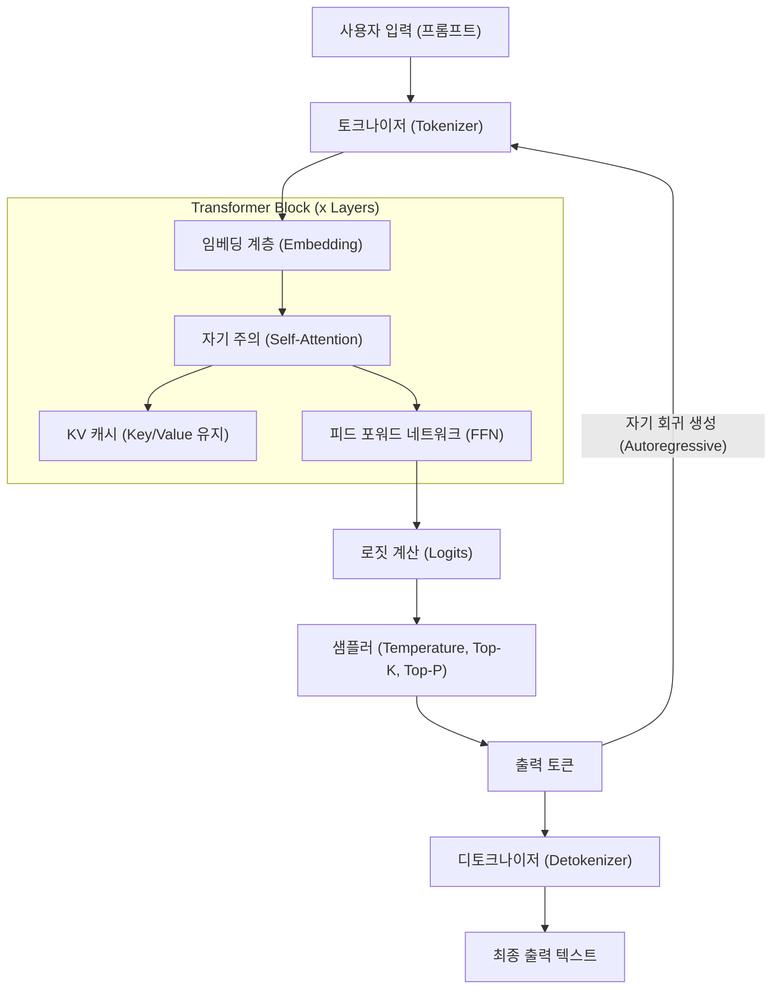
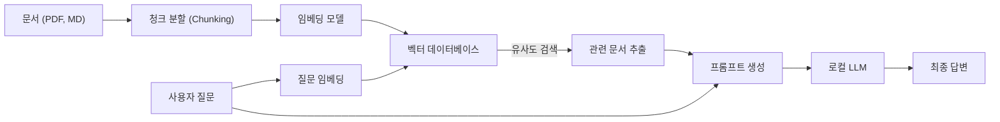

# 1. 소개: 왜 지금 Windows에서 로컬 LLM인가?

2026년 현재, 생성형 AI와 대규모 언어 모델(LLM)의 진화는 클라우드 상의 거대한 API 서비스에서 개인 PC나 온프레미스 환경에서 동작하는 '로컬 LLM'으로 큰 패러다임 전환을 보여주고 있습니다. OpenAI의 GPT-5나 Anthropic의 Claude 3.5와 같은 클라우드 AI는 매우 강력하지만, 기업이나 개인이 모든 데이터를 클라우드로 전송할 수 있는 것은 아닙니다. 개인정보 보호, 보안, 대기 시간(레이턴시), 그리고 장기적이고 지속 가능한 비용 관점에서 로컬 LLM에 대한 수요는 그 어느 때보다 폭발적으로 증가하고 있습니다.

특히 Windows 환경에서 로컬 LLM 생태계의 발전은 눈부십니다. 몇 년 전까지만 해도 "AI 개발 및 실행은 Linux"라는 것이 상식이었지만, 2026년 현재 Windows는 매우 강력하고 편리한 AI 플랫폼으로 변모했습니다.

본 기사에서는 2026년 최신 기술 동향을 바탕으로 Windows 환경에서 로컬 LLM을 구축, 운영 및 최적화하기 위한 완전한 가이드를 제공합니다. 초보자를 위한 Ollama를 사용한 간단한 구축부터, 고급 사용자를 위한 llama.cpp를 활용한 극한의 최적화, 나아가 VRAM 계산의 수학적 접근 및 아키텍처에 대한 깊은 이해, 그리고 로컬에서의 파인튜닝(미세조정)까지 압도적인 분량으로 철저하게 해설합니다.

## 1.1 2026년 로컬 LLM을 둘러싼 기술 트렌드

현재의 로컬 LLM 생태계를 형성하는 주요 트렌드는 다음과 같습니다.

1. **GGUF 포맷의 완전한 보급**: 메타데이터와 텐서를 단일 파일로 통합한 GGUF(GPT-Generated Unified Format)가 완전히 사실상 표준(De facto standard)이 되었습니다. 이를 통해 Hugging Face에서 파일 하나를 다운로드하는 것만으로 어떤 환경에서든 실행할 수 있게 되었습니다.
2. **MoE(Mixture of Experts) 아키텍처의 대중화**: 소규모이면서도 고성능인 MoE 모델이 다수 출시되었으며, 추론 시 일부 전문가(Expert)만 활성화함으로써 일반 소비자용 PC의 계산 부하를 억제하면서 거대 모델에 필적하는 성능을 내고 있습니다.
3. **추론 엔진의 고도화된 추상화 및 최적화**: Ollama, LM Studio, AnythingLLM 등의 도구가 세련되어져서 사용자가 CUDA 드라이버 설치 등 복잡한 의존성을 신경 쓸 필요가 없어졌습니다. 또한 FlashAttention 3의 Windows 네이티브 지원으로 추론 속도가 극적으로 향상되었습니다.
4. **NPU 활용과 Windows Copilot+ PC의 대두**: GPU가 없는 노트북에서도 탑재된 NPU(Neural Processing Unit)를 활용하여 소규모 LLM(SLM: Small Language Models)을 저전력으로 구동하는 기술이 실용화 단계에 접어들었습니다.

---

# 2. 하드웨어 요구 사항 및 OS 준비

로컬 LLM을 실용적인 속도(초당 15~30 토큰 이상)로 구동하기 위해서는 하드웨어 선택이 가장 중요합니다.

## 2.1 권장 하드웨어 구성

AI PC의 진화에 따라 요구 스펙도 변화하고 있습니다.

- **OS**: Windows 11 Pro (24H2 이후). WSL2의 완전한 기능과 고급 메모리 관리, 나아가 DirectML의 최신 API를 활용하기 위해 필수적입니다.
- **CPU**: Intel Core Ultra 200 시리즈 이상 또는 AMD Ryzen 9000 시리즈 이상. CPU 추론을 병행할 경우, 광대역 메모리 통신이 필수적입니다.
- **RAM**: 최소 32GB, 권장 64GB 이상. 메인 메모리의 대역폭(MB/s)이 CPU 추론 시나 오프로드(Offload) 시 결정적인 병목 지점이 됩니다. DDR5-6000 이상의 고속 메모리가 이상적입니다.
- **GPU**: NVIDIA RTX 4000/5000 시리즈. 로컬 LLM에서 가장 중요한 것은 연산 성능이 아니라 'VRAM 용량'입니다.
  - **엔트리**: RTX 4060 Ti (16GB 버전) - 가성비 최강. 8B~14B 클래스의 모델에 최적입니다.
  - **미들레인지**: RTX 4070 Ti SUPER (16GB) / RTX 4080 SUPER (16GB)
  - **하이엔드**: RTX 4090 (24GB) / RTX 5090 (32GB) - 30B~70B 클래스의 양자화 모델을 구동하기 위해 필요합니다.
- **스토리지**: PCIe Gen4 또는 Gen5 NVMe SSD. 수십 GB에 달하는 모델 로드 시간을 극적으로 단축시킵니다.

## 2.2 WSL2 (Windows Subsystem for Linux 2) 설정

많은 GUI 도구는 Windows 네이티브로 동작하지만, Python을 사용한 개발, 최신 도구 컴파일, 후술할 LoRA 파인튜닝에는 WSL2가 매우 편리합니다. Windows 11의 최신 환경에서는 호스트 쪽에 NVIDIA 드라이버를 설치하는 것만으로 WSL2에서 투명하게 GPU(CUDA)를 사용할 수 있습니다.

관리자 권한으로 PowerShell을 열고 다음을 실행합니다.

```powershell
# WSL2와 최신 Ubuntu 설치
wsl --install -d Ubuntu-24.04

# 커널 업데이트
wsl --update
```

설치 후 WSL2 터미널 내에서 `nvidia-smi`를 실행하여 GPU가 정상적으로 인식되면 성공입니다.

---

# 3. 로컬 LLM 아키텍처 및 추론 메커니즘

로컬 환경에서 모델이 어떻게 텍스트를 생성하는지, 그 내부 구조를 이해하는 것은 문제 해결(트러블슈팅)이나 최적화에 매우 유용합니다.

다음 Mermaid 다이어그램은 전형적인 로컬 LLM의 추론 파이프라인을 보여줍니다.



## 3.1 2가지 단계: Prefill과 Decode

LLM의 텍스트 생성은 계산 특성이 다른 두 가지 단계로 나뉩니다.

1. **Prefill (프롬프트 처리) 단계**: 입력된 프롬프트 전체를 한 번에 처리하고 이해하는 단계입니다. 병렬 계산이 가능하므로 GPU의 계산 능력(FLOPS)이 속도에 직결됩니다. 프롬프트가 길 경우 이 단계에 몇 초가 걸릴 수 있습니다.
2. **Decode (토큰 생성) 단계**: 1 토큰씩 예측하고 다음 입력으로 넘기는(자기 회귀, Autoregressive) 단계입니다. 이 단계에서는 병렬 계산이 제한되므로 GPU의 VRAM 대역폭(Memory Bandwidth)이 결정적인 병목 지점이 됩니다.

---

# 4. VRAM 소비량 계산 및 모델 크기의 수학적 이해

"내 PC에서 어떤 모델이 돌아갈까?"를 정확히 판단하려면 VRAM 계산 공식을 이해해야 합니다. VRAM 부족으로 인해 시스템 메모리(RAM)로의 폴백(Fallback)이 발생하면 추론 속도는 10배~100배 느려집니다.

## 4.1 파라미터 크기 기반 기본 VRAM

모델의 가중치(웨이트)를 VRAM에 로드하기 위한 메모리 양입니다.
모델 크기 $P$ (파라미터 수, 단위: 10억 = 1B)와 1 파라미터당 바이트 수 $B$를 사용하여 계산합니다.

$$
V_{base} = P \times B \quad \text{(GB)}
$$

예를 들어, 8B(80억) 파라미터 모델을 FP16(반정밀도 부동소수점, 16비트=2바이트)으로 로드할 경우:

$$
V_{base} = 8 \times 2 = 16 \text{ GB}
$$

즉, 16GB VRAM을 가진 GPU라도 모델을 로드하는 것만으로 거의 한계에 도달하게 됩니다.

## 4.2 양자화(Quantization)의 마법

여기서 '양자화'가 등장합니다. 파라미터의 정밀도를 낮춰 모델 크기를 극적으로 축소합니다. 가장 일반적인 4bit 양자화(예: Q4_K_M)의 경우, 1 파라미터당 평균 약 0.55바이트가 됩니다.

$$
V_{base\_4bit} = 8 \times 0.55 = 4.4 \text{ GB}
$$

이를 통해 16GB의 VRAM이 있다면 충분한 여유를 가지고 8B 모델을 구동할 수 있습니다.

## 4.3 KV 캐시 계산 (GQA 지원 버전)

추론 시에는 과거의 문맥을 유지하기 위한 'KV 캐시'가 VRAM을 소비합니다. Llama 3 등 최신 모델에서는 메모리 절약을 위해 GQA(Grouped Query Attention)가 채택되었습니다.

KV 캐시 소비량 $V_{kv}$ (기가바이트)는 다음 수식으로 표현됩니다.

$$
V_{kv} = 2 \times b \times s \times l \times \left( \frac{h_{kv}}{h_q} \right) \times h_q \times d \times B_{kv} \div 10^9
$$

정리하면, 키와 값의 헤드 수 $h_{kv}$를 사용하여 단순하게 계산할 수 있습니다.

$$
V_{kv} = 2 \times b \times s \times l \times h_{kv} \times d \times B_{kv} \div 10^9
$$

여기서:
- $b$: 배치 크기 (개인의 로컬 사용이라면 보통 1)
- $s$: 시퀀스 길이 (컨텍스트 길이, 예: 8192)
- $l$: 레이어 수 (예: 32)
- $h_{kv}$: KV 헤드 수 (예: 8)
- $d$: 헤드당 차원 수 (예: 128)
- $B_{kv}$: KV 캐시의 바이트 수 (FP16이면 2)

계산 예 (Llama 3 8B, 컨텍스트 8192, FP16 캐시):
$V_{kv} = 2 \times 1 \times 8192 \times 32 \times 8 \times 128 \times 2 \div 10^9 \approx 1.07 \text{ GB}$

컨텍스트 길이 $s$를 길게 할수록 필요한 VRAM은 선형적으로 증가한다는 점에 주의하십시오.

---

# 5. 실전 1: Ollama를 이용한 가장 빠르고 짧은 설정

이론을 이해했으니, 실제로 Windows 환경에서 LLM을 구동해 봅시다.
2026년 현재 가장 사용자 친화적인 도구가 'Ollama'입니다. Docker와 유사한 직관적인 CLI를 제공합니다.

## 5.1 설치 및 실행

1. [Ollama 공식 웹사이트](https://ollama.com/)에서 Windows 버전 설치 프로그램을 다운로드하여 실행합니다.
2. PowerShell을 열고 다음 명령어를 입력합니다. 여기서는 일본어/한국어 등을 지원하는 `llama3:8b`를 사용합니다.

```powershell
ollama run llama3:8b
```

최초 실행 시 모델 다운로드가 진행됩니다. 완료되면 터미널에서 바로 대화가 가능합니다.

## 5.2 Modelfile을 통한 사용자 정의 AI 생성

특정 페르소나를 가진 AI를 쉽게 생성할 수 있습니다. 임의의 위치에 `Modelfile`을 생성합니다.

```text
FROM llama3:8b

SYSTEM """
당신은 매우 뛰어난 시니어 소프트웨어 엔지니어입니다.
사용자의 질문에 대해 반드시 코드 예시를 곁들여 논리적이고 간결하게 답변해 주세요.
"""

PARAMETER temperature 0.3
PARAMETER num_ctx 8192
```

다음 명령어로 자체 모델을 빌드하고 실행합니다.

```powershell
ollama create SeniorDev -f ./Modelfile
ollama run SeniorDev
```

## 5.3 외부 앱 (AI 에디터)에서 활용

Ollama는 `http://localhost:11434`에 OpenAI 호환 API 엔드포인트를 공개합니다.
Cursor나 Continue.dev와 같은 VS Code 확장 프로그램의 백엔드 설정에서 URL을 위와 같이 지정하고, 모델 이름에 `SeniorDev` 등을 지정하기만 하면 무료로 강력한 로컬 코딩 어시스턴트가 실현됩니다.

---

# 6. 실전 2: llama.cpp에 의한 극한의 성능 튜닝

세밀한 메모리 관리나 최신 포맷(EXL2나 IQ 양자화 등)을 가장 먼저 시도해보고 싶다면, 핵심 엔진인 `llama.cpp`를 직접 조작합니다.

## 6.1 llama.cpp 빌드 절차

Windows 환경에서는 CUDA Toolkit과 CMake를 사용하여 소스에서 빌드하는 것이 가장 좋습니다.

```powershell
git clone https://github.com/ggerganov/llama.cpp
cd llama.cpp
mkdir build
cd build

# CUDA 지원으로 구성하고 컴파일
cmake .. -DLLAMA_CUBLAS=ON -DBUILD_SHARED_LIBS=OFF
cmake --build . --config Release -j 16
```

## 6.2 서버 모드에서의 고급 실행

빌드된 `llama-server.exe`를 사용하여 모델을 호스팅합니다.

```powershell
.\bin\Release\llama-server.exe `
  --model "C:\models\Llama-3-8B-Instruct.Q4_K_M.gguf" `
  --ctx-size 8192 `
  --n-gpu-layers 99 `
  --threads 8 `
  --flash-attn `
  --port 8080
```

- `--n-gpu-layers 99`: 가능한 모든 레이어를 GPU VRAM으로 오프로드합니다.
- `--flash-attn`: FlashAttention 3을 활성화하여 추론 속도를 향상시키고 KV 캐시의 VRAM 소비를 줄입니다.

---

# 7. GUI 프론트엔드: LM Studio 및 로컬 RAG 구축

명령줄(CLI)에 거부감이 있거나 RAG(검색 증강 생성)를 직관적으로 수행하고 싶은 경우 GUI를 이용합니다.

## 7.1 LM Studio

LM Studio는 모델 검색, 다운로드, 시스템 요구 사항 사전 확인, 그리고 채팅 UI까지 하나로 통합한 훌륭한 애플리케이션입니다. 앱 내의 "Local Server" 버튼을 누르기만 하면 OpenAI 호환 API가 시작됩니다.

## 7.2 AnythingLLM을 이용한 RAG 아키텍처

사내 문서나 개인 메모를 읽게 하는 RAG 환경의 아키텍처 다이어그램입니다.



AnythingLLM 데스크톱 버전(Windows)을 사용하면 설정 화면에서 Ollama(LLM 및 Embedding)를 지정하고, 로컬 VectorDB(LanceDB)를 사용하도록 설정하는 것만으로 몇 분 만에 이 아키텍처가 완성됩니다. 데이터를 외부에 전혀 전송하지 않는 프라이빗 AI의 탄생입니다.

---

# 8. Windows WSL2 상에서의 파인튜닝 (LoRA)

로컬에서 구동할 뿐만 아니라 내 데이터로 모델을 똑똑하게 만들고 싶다면, LoRA(Low-Rank Adaptation)를 이용한 파인튜닝이 가능합니다. 2026년 현재 'Unsloth'라는 라이브러리를 사용하면 Windows의 WSL2 환경에서 16GB VRAM으로도 8B 모델의 학습을 몇 시간 만에 완료할 수 있습니다.

WSL2의 Ubuntu 내에서 다음을 실행하여 환경을 구축합니다.

```bash
conda create --name unsloth_env python=3.11
conda activate unsloth_env
pip install "unsloth[colab-new] @ git+https://github.com/unslothai/unsloth.git"
pip install --no-deps trl peft accelerate bitsandbytes
```

Unsloth는 CUDA 커널을 극한까지 최적화하여, 표준 Hugging Face 라이브러리와 비교해 학습 속도가 약 2배, VRAM 소비량이 약 절반이 됩니다. Jupyter Notebook을 실행하고 데이터 세트(JSONL 형식)를 읽어 들이는 것만으로, VRAM 12GB~16GB의 RTX 4060 Ti 등에서도 몇 에포크(epoch)의 학습이 가능합니다.

---

# 9. 성능 및 문제 해결 (트러블슈팅)

자주 직면하는 문제와 그 해결책입니다.

### 1. 추론 속도가 극단적으로 느림 (1~2 tokens/s)
**원인**: 모델이 VRAM에 다 들어가지 못하고 시스템 메모리(RAM)로 오프로드되었습니다.
**대책**: 작업 관리자에서 "전용 GPU 메모리"를 확인해 주세요. 한계에 도달한 경우 컨텍스트 크기(`-c`)를 줄이거나 더 낮은 비트 수의 양자화 모델(Q4_K_M 등)을 사용하십시오.

### 2. "CUDA out of memory" 에러
**원인**: VRAM이 완전히 고갈되었습니다. 특히 대화가 길어져 KV 캐시가 비대해졌을 때 발생합니다.
**대책**: Ollama의 경우 `num_ctx`, llama.cpp의 경우 `-c` 값을 의도적으로 작게 제한합니다.

### 3. 언어(일본어/한국어 등) 생성이 이상함
**원인**: 프롬프트 템플릿의 불일치 또는 지원하지 않는 모델입니다.
**대책**: 모델 이름에 `Instruct`가 포함된 것을 사용하고, ChatML이나 Llama3 포맷 등 모델 작성자가 지정한 올바른 템플릿이 도구 측에서 선택되어 있는지 확인하십시오.

---

# 10. 요약 및 향후 전망

2026년, Windows 환경에서의 로컬 LLM 구축은 더 이상 일부 엔지니어들만의 특권이 아닙니다. GGUF 포맷의 사실상 표준화, Ollama나 LM Studio와 같이 세련된 생태계의 등장, 그리고 FlashAttention을 비롯한 하드웨어 최적화 덕분에 누구나 쉽게 엔터프라이즈급 AI 환경을 구축할 수 있게 되었습니다.

이 기사에서 설명한 다음 요점들을 꼭 활용해 보시기 바랍니다.

1. **VRAM의 수학적 계산**을 활용하여 내 PC 스펙에 최적화된 모델 크기와 양자화 수준을 논리적으로 선택한다.
2. **Ollama**를 사용하여 가장 빠르게 환경을 구축하고, AI 에디터와 연동하여 생산성을 극적으로 향상시킨다.
3. **llama.cpp**의 고급 파라미터 제어로 하드웨어의 한계 성능을 끌어낸다.
4. **AnythingLLM**으로 기밀 데이터를 다루는 안전한 로컬 RAG 시스템을 구축한다.
5. **Unsloth (WSL2)**를 활용하여 나만의 전문 지식을 가진 커스텀 AI를 육성한다.

AI의 '대중화'는 더 이상 버즈워드가 아니라 여러분의 Windows 데스크톱에서 작동하는 현실의 시스템입니다. 클라우드 API 사용 비용이나 정보 유출 위험에서 벗어나, 자유롭고 강력한 프라이빗 AI의 세계로 지금 당장 발을 들여놓아 보시기 바랍니다.
