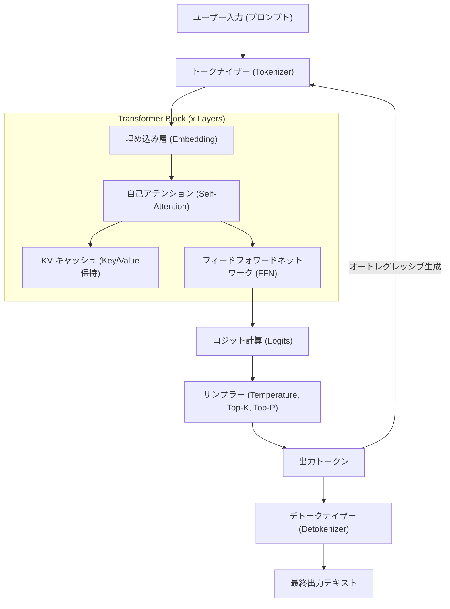
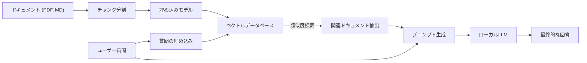

# 1. はじめに：なぜ今、WindowsでローカルLLMなのか？

2026年現在、生成AIと大規模言語モデル（LLM）の進化は、クラウド上の巨大なAPIサービスから、個人のPCやオンプレミス環境で動作する「ローカルLLM」へと大きなパラダイムシフトを見せています。OpenAIのGPT-5やAnthropicのClaude 3.5といったクラウドAIは非常に強力ですが、企業や個人がすべてのデータをクラウドに送信できるわけではありません。プライバシー、セキュリティ、レイテンシ、そして長期的・持続的なコストの観点から、ローカルLLMの需要はかつてなく爆発的に高まっています。

特にWindows環境におけるローカルLLMのエコシステムの進化は目覚ましいものがあります。数年前までは「AI開発・実行といえばLinux」が常識でしたが、2026年現在ではWindowsが非常に強力かつ手軽なAIプラットフォームへと変貌を遂げました。

本記事では、2026年最新の技術動向を踏まえ、Windows環境でローカルLLMを構築・運用・最適化するための完全なガイドを提供します。初心者向けのOllamaを用いた簡単な構築から、上級者向けのllama.cppを活用した極限の最適化、さらにはVRAM計算の数学的アプローチやアーキテクチャの深い理解、そしてローカルでのファインチューニングまで、圧倒的なボリュームで徹底解説します。

## 1.1 2026年のローカルLLMを取り巻く技術トレンド

現在のローカルLLMエコシステムを形作る主要なトレンドは以下の通りです。

1. **GGUFフォーマットの完全普及**: メタデータとテンソルを単一のファイルに統合したGGUF（GPT-Generated Unified Format）が完全にデファクトスタンダード化しました。これにより、Hugging Faceから一つのファイルをダウンロードするだけで、どのような環境でも実行可能になっています。
2. **MoE（Mixture of Experts）アーキテクチャの民主化**: 小規模ながら高性能なMoEモデルが多数リリースされ、推論時に一部のエキスパートのみをアクティブにすることで、コンシューマーPCの計算負荷を抑えながら巨大モデルに匹敵する性能を叩き出しています。
3. **推論エンジンの高度な抽象化と最適化**: Ollama、LM Studio、AnythingLLMなどのツールが洗練され、CUDAドライバのインストールなどの複雑な依存関係をユーザーが意識する必要がなくなりました。また、FlashAttention 3のWindowsネイティブ対応により、推論速度が劇的に向上しています。
4. **NPUの活用とWindows Copilot+ PCの台頭**: GPUを持たないノートPCでも、搭載されているNPU（Neural Processing Unit）を利用して小規模なLLM（SLM: Small Language Models）を低消費電力で動かす技術が実用段階に入りました。

---

# 2. ハードウェア要件とOSの準備

ローカルLLMを実用的な速度（1秒間に15〜30トークン以上）で動作させるためには、ハードウェアの選定が最も重要です。

## 2.1 推奨ハードウェア構成

AI PCの進化に伴い、要求スペックも変化しています。

- **OS**: Windows 11 Pro (24H2以降)。WSL2の完全な機能と高度なメモリ管理、さらにはDirectMLの最新APIを利用するために必須です。
- **CPU**: Intel Core Ultra 200シリーズ以上、またはAMD Ryzen 9000シリーズ以上。CPU推論を併用する場合、広帯域メモリ通信が不可欠です。
- **RAM**: 最低32GB、推奨64GB以上。メインメモリの帯域幅（MB/s）がCPU推論時やオフロード時の決定的なボトルネックになります。DDR5-6000以上の高速メモリが理想的です。
- **GPU**: NVIDIA RTX 4000/5000シリーズ。ローカルLLMにおいて最も重要なのは演算性能ではなく「VRAM容量」です。
  - **エントリー**: RTX 4060 Ti (16GB版) - コスパ最強。8B〜14Bクラスのモデルに最適。
  - **ミドルレンジ**: RTX 4070 Ti SUPER (16GB) / RTX 4080 SUPER (16GB)
  - **ハイエンド**: RTX 4090 (24GB) / RTX 5090 (32GB) - 30B〜70Bクラスの量子化モデルを動かすために必要です。
- **ストレージ**: PCIe Gen4またはGen5のNVMe SSD。数十GBのモデルロード時間を劇的に短縮します。

## 2.2 WSL2 (Windows Subsystem for Linux 2) のセットアップ

多くのGUIツールはWindowsネイティブで動作しますが、Pythonを用いた開発、最新ツールのコンパイル、後述するLoRAファインチューニングにはWSL2が非常に便利です。Windows 11の最新環境では、ホスト側にNVIDIAドライバを入れるだけで、WSL2から透過的にGPU（CUDA）が利用できます。

管理者権限でPowerShellを開き、以下を実行します。

```powershell
# WSL2と最新のUbuntuのインストール
wsl --install -d Ubuntu-24.04

# カーネルのアップデート
wsl --update
```

インストール後、WSL2ターミナル内で `nvidia-smi` を実行し、GPUが正常に認識されていれば成功です。

---

# 3. ローカルLLMのアーキテクチャと推論メカニズム

ローカル環境でモデルがどのようにテキストを生成するのか、その内部構造を理解することは、トラブルシューティングや最適化において非常に有用です。

以下のMermaid図は、典型的なローカルLLMの推論パイプラインを示しています。



## 3.1 2つのフェーズ：Prefill と Decode

LLMのテキスト生成は、計算特性の異なる2つのフェーズに分かれます。

1. **Prefill（プロンプト処理）フェーズ**: 入力されたプロンプト全体を一度に処理し、理解するフェーズです。並列計算が可能であるため、GPUの計算能力（FLOPS）が速度に直結します。プロンプトが長い場合、このフェーズに数秒かかることがあります。
2. **Decode（トークン生成）フェーズ**: 1トークンずつ予測し、次の入力に回す（オートレグレッシブ）フェーズです。このフェーズでは並列計算が制限されるため、GPUのVRAM帯域幅（Memory Bandwidth）が決定的なボトルネックになります。

---

# 4. VRAM消費量の計算とモデルサイズの数学的理解

「自分のPCでどのモデルが動くのか？」を正しく判断するには、VRAMの計算式を理解する必要があります。VRAM不足によるシステムメモリ（RAM）へのフォールバックが発生すると、推論速度は10倍〜100倍遅くなります。

## 4.1 パラメータサイズに基づくベースVRAM

モデルのウェイト（重み）をVRAMに読み込むためのメモリ量です。
モデルサイズ $P$ （パラメータ数、単位: 10億 = 1B）と、1パラメータあたりのバイト数 $B$ を用いて計算します。

$$
V_{base} = P \times B \quad \text{(GB)}
$$

例えば、8B（80億）パラメータのモデルをFP16（半精度浮動小数点、16ビット=2バイト）でロードする場合：

$$
V_{base} = 8 \times 2 = 16 \text{ GB}
$$

つまり、16GBのVRAMを持つGPUであっても、モデルをロードするだけでほぼ限界に達してしまいます。

## 4.2 量子化（Quantization）の魔法

そこで「量子化」が登場します。パラメータの精度を落とすことでモデルサイズを劇的に縮小します。最も一般的な4bit量子化（例: Q4_K_M）の場合、1パラメータあたり平均して約0.55バイトとなります。

$$
V_{base\_4bit} = 8 \times 0.55 = 4.4 \text{ GB}
$$

これにより、16GBのVRAMがあれば、十分に余裕を持って8Bモデルを動かすことができます。

## 4.3 KVキャッシュの計算（GQA対応版）

推論時には、過去の文脈を保持するための「KVキャッシュ」がVRAMを消費します。Llama 3等の最新モデルでは、メモリ節約のためにGQA（Grouped Query Attention）が採用されています。

KVキャッシュの消費量 $V_{kv}$ （ギガバイト）は以下の数式で表されます。

$$
V_{kv} = 2 \times b \times s \times l \times \left( \frac{h_{kv}}{h_q} \right) \times h_q \times d \times B_{kv} \div 10^9
$$

整理すると、キーとバリューのヘッド数 $h_{kv}$ を用いてシンプルに計算できます。

$$
V_{kv} = 2 \times b \times s \times l \times h_{kv} \times d \times B_{kv} \div 10^9
$$

ここで：
- $b$: バッチサイズ（個人のローカル利用なら通常1）
- $s$: シーケンス長（コンテキスト長、例: 8192）
- $l$: レイヤー数（例: 32）
- $h_{kv}$: KVヘッド数（例: 8）
- $d$: ヘッドあたりの次元数（例: 128）
- $B_{kv}$: KVキャッシュのバイト数（FP16なら2）

計算例（Llama 3 8B, コンテキスト8192, FP16キャッシュ）：
$V_{kv} = 2 \times 1 \times 8192 \times 32 \times 8 \times 128 \times 2 \div 10^9 \approx 1.07 \text{ GB}$

コンテキスト長 $s$ を長くすればするほど、必要なVRAMは線形に増加することに注意してください。

---

# 5. 実践1：Ollamaを用いた最速・最短セットアップ

理論を理解したところで、実際にWindows環境でLLMを動かしてみましょう。
2026年現在、最もユーザーフレンドリーなツールが「Ollama」です。Dockerライクな直感的なCLIを提供します。

## 5.1 インストールと実行

1. [Ollama公式サイト](https://ollama.com/) からWindows版インストーラーをダウンロードして実行します。
2. PowerShellを開き、以下のコマンドを入力します。ここでは、日本語対応の `llama3:8b` を使用します。

```powershell
ollama run llama3:8b
```

初回実行時はモデルのダウンロードが行われます。完了すると、そのままターミナル上で対話が可能です。

## 5.2 ModelfileによるカスタムAIの作成

特定のペルソナを持つAIを簡単に作成できます。任意の場所に `Modelfile` を作成します。

```text
FROM llama3:8b

SYSTEM """
あなたは非常に優秀なシニアソフトウェアエンジニアです。
ユーザーの質問に対して、必ずコード例を交えて、論理的かつ簡潔に答えてください。
"""

PARAMETER temperature 0.3
PARAMETER num_ctx 8192
```

以下のコマンドで独自のモデルをビルドし、実行します。

```powershell
ollama create SeniorDev -f ./Modelfile
ollama run SeniorDev
```

## 5.3 外部アプリ（AIエディタ）からの利用

Ollamaは `http://localhost:11434` にOpenAI互換のAPIエンドポイントを公開します。
CursorやContinue.devといったVS Code拡張機能のバックエンド設定で、URLを上記に指定し、モデル名に `SeniorDev` 等を指定するだけで、無料で強力なローカルコーディングアシスタントが実現します。

---

# 6. 実践2：llama.cppによる極限のパフォーマンスチューニング

細かなメモリ管理や、最新フォーマット（EXL2やIQ量子化など）をいち早く試したい場合は、コアエンジンである `llama.cpp` を直接操作します。

## 6.1 llama.cpp のビルド手順

Windows環境では、CUDA ToolkitとCMakeを用いてソースからビルドするのがベストです。

```powershell
git clone https://github.com/ggerganov/llama.cpp
cd llama.cpp
mkdir build
cd build

# CUDA対応として構成しコンパイル
cmake .. -DLLAMA_CUBLAS=ON -DBUILD_SHARED_LIBS=OFF
cmake --build . --config Release -j 16
```

## 6.2 サーバーモードでの高度な起動

ビルドされた `llama-server.exe` を使用して、モデルをホストします。

```powershell
.\bin\Release\llama-server.exe `
  --model "C:\models\Llama-3-8B-Instruct.Q4_K_M.gguf" `
  --ctx-size 8192 `
  --n-gpu-layers 99 `
  --threads 8 `
  --flash-attn `
  --port 8080
```

- `--n-gpu-layers 99`: 可能限りすべてのレイヤーをGPU VRAMにオフロードします。
- `--flash-attn`: FlashAttention 3を有効にし、推論速度の向上とKVキャッシュのVRAM消費削減を達成します。

---

# 7. GUIフロントエンド：LM Studio とローカルRAGの構築

コマンドラインに抵抗がある場合や、RAG（検索拡張生成）を直感的に行いたい場合はGUIを利用します。

## 7.1 LM Studio

LM Studioは、モデルの検索、ダウンロード、システム要件の事前チェック、そしてチャットUIまでを一つにまとめた素晴らしいアプリケーションです。アプリ内の「Local Server」ボタンを押すだけでOpenAI互換APIが立ち上がります。

## 7.2 AnythingLLM を用いたRAGアーキテクチャ

社内文書や個人メモを読み込ませるRAG環境のアーキテクチャ図です。



AnythingLLMデスクトップ版（Windows）を使えば、設定画面からOllama（LLMとEmbedding）を指定し、ローカルのVectorDB（LanceDB）を利用するよう設定するだけで、数分でこのアーキテクチャが完成します。データを外部に一切送信しないプライベートAIの誕生です。

---

# 8. Windows WSL2上でのファインチューニング (LoRA)

ローカルで動かすだけでなく、自分のデータでモデルを賢くしたい場合、LoRA（Low-Rank Adaptation）を用いたファインチューニングが可能です。2026年現在、「Unsloth」というライブラリを使えば、WindowsのWSL2環境において、16GBのVRAMでも8Bモデルの学習が数時間で完了します。

WSL2のUbuntu内で以下を実行して環境を構築します。

```bash
conda create --name unsloth_env python=3.11
conda activate unsloth_env
pip install "unsloth[colab-new] @ git+https://github.com/unslothai/unsloth.git"
pip install --no-deps trl peft accelerate bitsandbytes
```

UnslothはCUDAカーネルを極限まで最適化しており、標準のHugging Faceライブラリと比較して学習速度が約2倍、VRAM消費量が約半分になります。Jupyter Notebookを立ち上げ、データセット（JSONL形式）を読み込ませるだけで、数エポックの学習がVRAM 12GB〜16GBのRTX 4060 Ti等でも可能です。

---

# 9. パフォーマンス・トラブルシューティング

よく直面する問題とその解決策です。

### 1. 推論速度が極端に遅い（1〜2 tokens/s）
**原因**: モデルがVRAMに収まりきらず、システムメモリ（RAM）へオフロードされています。
**対策**: タスクマネージャーで「専用GPUメモリ」を確認してください。限界に達している場合は、コンテキストサイズ（`-c`）を小さくするか、より低いビット数の量子化モデル（Q4_K_Mなど）を使用してください。

### 2. 「CUDA out of memory」エラー
**原因**: VRAMが完全に枯渇しました。特に対話が長引いてKVキャッシュが肥大化した際に発生します。
**対策**: Ollamaの場合は `num_ctx`、llama.cppの場合は `-c` の値を意図的に小さく制限します。

### 3. 日本語の生成がおかしい
**原因**: プロンプトテンプレートの不一致、または非対応モデルです。
**対策**: モデル名に `Instruct` が含まれるものを使用し、ChatMLやLlama3フォーマットなど、モデル作者が指定した正しいテンプレートがツール側で選択されているか確認してください。

---

# 10. まとめと今後の展望

2026年、Windows環境におけるローカルLLMの構築は、限られた一部のエンジニアだけの特権ではなくなりました。GGUFフォーマットのデファクト化、OllamaやLM Studioといった洗練されたエコシステムの登場、そしてFlashAttentionをはじめとするハードウェア最適化により、誰でも簡単にエンタープライズ級のAI環境を手に入れることができます。

本記事で解説した以下のポイントを是非活用してください。

1. **VRAMの数学的計算**を用いて、自分のPCスペックに最適なモデルサイズと量子化レベルを論理的に選択する。
2. **Ollama**を使って最速で環境を構築し、AIエディタと連携させて生産性を劇的に向上させる。
3. **llama.cpp**の高度なパラメータ制御で、ハードウェアの限界性能を引き出す。
4. **AnythingLLM**で機密データを扱うセキュアなローカルRAGシステムを構築する。
5. **Unsloth (WSL2)**を活用し、自分だけの専門知識を持ったカスタムAIを育成する。

AIの「民主化」は、もはやバズワードではなく、あなたのWindowsデスクトップ上で稼働する現実のシステムです。クラウドAPIの利用コストや情報漏洩リスクから解放され、自由で強力なプライベートAIの世界へ、今すぐ足を踏み入れてみてください。
