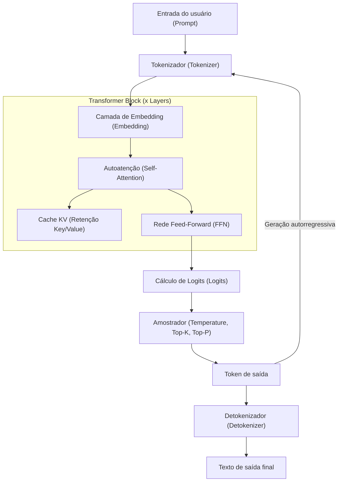
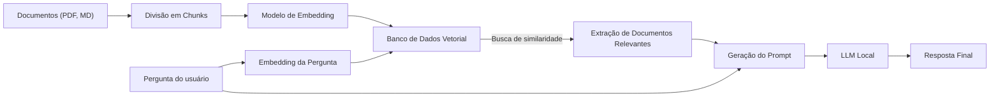

# 1. Introdução: Por que LLM Local no Windows agora?

Em 2026, a evolução da IA generativa e dos Grandes Modelos de Linguagem (LLM) está mostrando uma grande mudança de paradigma de serviços gigantescos de API na nuvem para "LLMs Locais" rodando em PCs pessoais ou ambientes locais (on-premises). IAs na nuvem como o GPT-5 da OpenAI e o Claude 3.5 da Anthropic são extremamente poderosas, mas nem todas as empresas ou indivíduos podem enviar todos os seus dados para a nuvem. Do ponto de vista de privacidade, segurança, latência e custos sustentáveis a longo prazo, a demanda por LLMs locais explodiu como nunca antes.

Particularmente no ambiente Windows, a evolução do ecossistema de LLM local tem sido notável. Até poucos anos atrás, "Desenvolvimento e execução de IA significa Linux" era o senso comum, mas em 2026, o Windows se transformou em uma plataforma de IA extremamente poderosa e acessível.

Neste artigo, com base nas últimas tendências tecnológicas de 2026, forneceremos um guia completo para construir, operar e otimizar LLMs locais em ambientes Windows. Explicaremos detalhadamente, com um volume esmagador, desde configurações simples com o Ollama para iniciantes, passando por otimizações extremas usando o llama.cpp para usuários avançados, até abordagens matemáticas para cálculo de VRAM, compreensão profunda da arquitetura e fine-tuning local.

## 1.1 Tendências Tecnológicas de LLM Local em 2026

As principais tendências que moldam o atual ecossistema de LLM local são as seguintes:

1. **Adoção total do formato GGUF**: O GGUF (GPT-Generated Unified Format), que integra metadados e tensores em um único arquivo, tornou-se completamente o padrão de fato. Isso permite a execução em qualquer ambiente apenas baixando um único arquivo do Hugging Face.
2. **Democratização da arquitetura MoE (Mixture of Experts)**: Vários modelos MoE pequenos, porém de alto desempenho, foram lançados. Ao ativar apenas alguns especialistas durante a inferência, eles alcançam um desempenho comparável ao de modelos gigantes, mantendo a carga computacional baixa em PCs de consumo.
3. **Abstração avançada e otimização de motores de inferência**: Ferramentas como Ollama, LM Studio e AnythingLLM foram refinadas, eliminando a necessidade de os usuários se preocuparem com dependências complexas, como a instalação de drivers CUDA. Além disso, o suporte nativo do FlashAttention 3 para Windows melhorou drasticamente a velocidade de inferência.
4. **Utilização da NPU e a ascensão dos PCs Windows Copilot+**: Mesmo em laptops sem GPU, a tecnologia para executar pequenos LLMs (SLMs: Small Language Models) com baixo consumo de energia usando a NPU (Neural Processing Unit) integrada entrou em fase prática.

---

# 2. Requisitos de Hardware e Preparação do SO

Para que um LLM local opere em uma velocidade prática (15 a 30+ tokens por segundo), a escolha do hardware é o fator mais importante.

## 2.1 Configuração de Hardware Recomendada

Com a evolução dos AI PCs, as especificações exigidas também estão mudando.

- **SO**: Windows 11 Pro (24H2 ou posterior). Essencial para utilizar as funções completas do WSL2, gerenciamento avançado de memória e as APIs mais recentes do DirectML.
- **CPU**: Série Intel Core Ultra 200 ou superior, ou série AMD Ryzen 9000 ou superior. Quando usado em conjunto com inferência de CPU, a comunicação de memória de alta largura de banda é indispensável.
- **RAM**: Mínimo de 32GB, recomendado 64GB ou mais. A largura de banda da memória principal (MB/s) torna-se o gargalo decisivo durante a inferência na CPU ou offloading. Memória de alta velocidade, como DDR5-6000 ou superior, é o ideal.
- **GPU**: Séries NVIDIA RTX 4000/5000. O que mais importa para LLMs locais não é o desempenho de processamento, mas sim a "Capacidade de VRAM".
  - **Entrada**: RTX 4060 Ti (versão de 16GB) - Melhor custo-benefício. Ideal para modelos na classe de 8B a 14B.
  - **Intermediário**: RTX 4070 Ti SUPER (16GB) / RTX 4080 SUPER (16GB)
  - **High-end**: RTX 4090 (24GB) / RTX 5090 (32GB) - Necessário para rodar modelos quantizados na classe de 30B a 70B.
- **Armazenamento**: NVMe SSD PCIe Gen4 ou Gen5. Reduz drasticamente o tempo de carregamento de dezenas de GB de modelos.

## 2.2 Configuração do WSL2 (Windows Subsystem for Linux 2)

Embora muitas ferramentas GUI funcionem nativamente no Windows, o WSL2 é extremamente útil para desenvolvimento com Python, compilação de ferramentas mais recentes e para o fine-tuning LoRA mencionado posteriormente. Nos ambientes Windows 11 mais recentes, você pode usar GPUs (CUDA) de forma transparente no WSL2 apenas instalando o driver da NVIDIA no host.

Abra o PowerShell com privilégios de administrador e execute o seguinte:

```powershell
# Instalação do WSL2 e do Ubuntu mais recente
wsl --install -d Ubuntu-24.04

# Atualização do kernel
wsl --update
```

Após a instalação, execute `nvidia-smi` no terminal do WSL2; se a GPU for reconhecida corretamente, a configuração foi bem-sucedida.

---

# 3. Arquitetura de LLM Local e Mecanismo de Inferência

Compreender a estrutura interna de como o modelo gera texto em um ambiente local é extremamente útil para solução de problemas e otimização.

O diagrama Mermaid abaixo mostra um pipeline típico de inferência de LLM local.



## 3.1 Duas Fases: Prefill e Decode

A geração de texto do LLM é dividida em duas fases com características computacionais diferentes.

1. **Fase Prefill (Processamento de Prompt)**: A fase onde todo o prompt inserido é processado e compreendido de uma só vez. Devido à possibilidade de cálculo paralelo, a capacidade de cálculo da GPU (FLOPS) está diretamente ligada à velocidade. Se o prompt for longo, esta fase pode levar alguns segundos.
2. **Fase Decode (Geração de Tokens)**: A fase onde se prevê um token de cada vez, que é repassado como próxima entrada (autorregressivo). Nesta fase, o cálculo paralelo é limitado, portanto a largura de banda de memória VRAM da GPU (Memory Bandwidth) se torna um gargalo decisivo.

---

# 4. Cálculo do Consumo de VRAM e Compreensão Matemática do Tamanho do Modelo

Para julgar corretamente "quais modelos rodam no meu PC?", é necessário entender a fórmula de cálculo da VRAM. Se a falta de VRAM causar fallback para a memória do sistema (RAM), a velocidade de inferência cairá de 10x a 100x.

## 4.1 VRAM Base com Base no Tamanho dos Parâmetros

Esta é a quantidade de memória necessária para carregar os pesos (weights) do modelo para a VRAM.
É calculada usando o tamanho do modelo $P$ (número de parâmetros, unidade: 1 bilhão = 1B) e os bytes por parâmetro $B$.

$$
V_{base} = P \times B \quad \text{(GB)}
$$

Por exemplo, ao carregar um modelo de 8B (8 bilhões) de parâmetros em FP16 (ponto flutuante de meia precisão, 16 bits = 2 bytes):

$$
V_{base} = 8 \times 2 = 16 \text{ GB}
$$

Em outras palavras, mesmo uma GPU com 16GB de VRAM estará no seu limite apenas carregando o modelo.

## 4.2 A Magia da Quantização (Quantization)

Aí entra a "quantização". Ao reduzir a precisão dos parâmetros, o tamanho do modelo é reduzido drasticamente. Na quantização de 4 bits mais comum (ex: Q4_K_M), a média é cerca de 0,55 bytes por parâmetro.

$$
V_{base\_4bit} = 8 \times 0.55 = 4.4 \text{ GB}
$$

Com isso, se você tiver 16GB de VRAM, terá bastante margem para rodar um modelo 8B de forma muito tranquila.

## 4.3 Cálculo do Cache KV (Versão Compatível com GQA)

Durante a inferência, o "Cache KV", usado para manter o contexto passado, consome VRAM. Nos modelos mais recentes, como o Llama 3, o GQA (Grouped Query Attention) é adotado para economizar memória.

O consumo do Cache KV $V_{kv}$ (em gigabytes) é expresso pela seguinte fórmula:

$$
V_{kv} = 2 \times b \times s \times l \times \left( \frac{h_{kv}}{h_q} \right) \times h_q \times d \times B_{kv} \div 10^9
$$

Simplificando, podemos calcular usando o número de cabeças de chave/valor (key/value heads) $h_{kv}$:

$$
V_{kv} = 2 \times b \times s \times l \times h_{kv} \times d \times B_{kv} \div 10^9
$$

Onde:
- $b$: Tamanho do batch (geralmente 1 para uso local pessoal)
- $s$: Comprimento da sequência (comprimento do contexto, ex: 8192)
- $l$: Número de camadas (ex: 32)
- $h_{kv}$: Número de cabeças KV (ex: 8)
- $d$: Dimensões por cabeça (ex: 128)
- $B_{kv}$: Bytes do Cache KV (2 para FP16)

Exemplo de cálculo (Llama 3 8B, Contexto 8192, Cache FP16):
$V_{kv} = 2 \times 1 \times 8192 \times 32 \times 8 \times 128 \times 2 \div 10^9 \approx 1.07 \text{ GB}$

Note que quanto mais longo for o comprimento do contexto $s$, mais a VRAM necessária aumentará linearmente.

---

# 5. Prática 1: Configuração Rápida e Curta com Ollama

Agora que entendemos a teoria, vamos rodar um LLM num ambiente Windows na prática.
A partir de 2026, a ferramenta mais amigável ao usuário é o "Ollama". Ele fornece uma CLI intuitiva semelhante à do Docker.

## 5.1 Instalação e Execução

1. Baixe e execute o instalador para Windows no [Site Oficial do Ollama](https://ollama.com/).
2. Abra o PowerShell e insira o seguinte comando. Aqui usaremos o `llama3:8b`, que possui suporte para japonês.

```powershell
ollama run llama3:8b
```

Na primeira execução, o modelo será baixado. Ao concluir, você poderá conversar diretamente no terminal.

## 5.2 Criação de uma IA Customizada via Modelfile

Você pode criar facilmente uma IA com uma persona específica. Crie um `Modelfile` em qualquer local.

```text
FROM llama3:8b

SYSTEM """
Você é um excelente engenheiro de software sênior.
Sempre responda às perguntas dos usuários com exemplos de código, de forma lógica e concisa.
"""

PARAMETER temperature 0.3
PARAMETER num_ctx 8192
```

Execute os comandos a seguir para compilar e executar o seu próprio modelo customizado.

```powershell
ollama create SeniorDev -f ./Modelfile
ollama run SeniorDev
```

## 5.3 Utilização de Aplicações Externas (Editores de IA)

O Ollama expõe um endpoint de API compatível com OpenAI em `http://localhost:11434`.
Ao especificar esta URL nas configurações de backend de extensões do VS Code, como Cursor ou Continue.dev, e designar o nome do modelo como `SeniorDev`, você tem um assistente de codificação local poderoso e gratuito.

---

# 6. Prática 2: Afinação Extrema de Desempenho com llama.cpp

Se você quiser ter uma gestão fina de memória ou testar antecipadamente novos formatos (como EXL2, quantização IQ), interaja diretamente com o mecanismo central `llama.cpp`.

## 6.1 Procedimento de Compilação do llama.cpp

No ambiente Windows, a melhor forma é compilá-lo a partir do código-fonte usando CUDA Toolkit e CMake.

```powershell
git clone https://github.com/ggerganov/llama.cpp
cd llama.cpp
mkdir build
cd build

# Configurar e compilar com suporte a CUDA
cmake .. -DLLAMA_CUBLAS=ON -DBUILD_SHARED_LIBS=OFF
cmake --build . --config Release -j 16
```

## 6.2 Execução Avançada no Modo Servidor

Use o `llama-server.exe` compilado para hospedar o modelo.

```powershell
.\bin\Release\llama-server.exe `
  --model "C:\models\Llama-3-8B-Instruct.Q4_K_M.gguf" `
  --ctx-size 8192 `
  --n-gpu-layers 99 `
  --threads 8 `
  --flash-attn `
  --port 8080
```

- `--n-gpu-layers 99`: Descarrega (offload) todas as camadas possíveis para a VRAM da GPU.
- `--flash-attn`: Habilita o FlashAttention 3, alcançando uma melhoria de velocidade de inferência e redução de consumo de VRAM para o Cache KV.

---

# 7. Front-end GUI: LM Studio e Construção de RAG Local

Se você não gosta de linhas de comando ou quer usar a RAG (Geração Aumentada por Recuperação) intuitivamente, utilize uma GUI.

## 7.1 LM Studio

O LM Studio é um aplicativo maravilhoso que centraliza a busca de modelos, o download, as verificações de pré-requisitos do sistema e a interface de chat. Ao simplesmente apertar o botão "Local Server" no app, uma API compatível com OpenAI é iniciada.

## 7.2 Arquitetura de RAG usando o AnythingLLM

Este é o diagrama de arquitetura do ambiente RAG para carregar documentos internos e notas pessoais.



Com a versão desktop do AnythingLLM (Windows), você só precisa designar o Ollama (para LLM e Embedding) e configurar o VectorDB local (LanceDB) nas opções, e essa arquitetura estará concluída em minutos. É o nascimento de uma IA Privada que nunca envia os dados a terceiros.

---

# 8. Fine-tuning no WSL2 do Windows (LoRA)

Além de rodar os modelos localmente, se você deseja que eles fiquem mais inteligentes com seus próprios dados, o fine-tuning através do LoRA (Low-Rank Adaptation) é possível. Em 2026, com uma biblioteca chamada "Unsloth", o treinamento de um modelo 8B é finalizado em algumas horas, mesmo com 16GB de VRAM, no ambiente Windows WSL2.

Crie o ambiente executando o seguinte dentro do Ubuntu do WSL2:

```bash
conda create --name unsloth_env python=3.11
conda activate unsloth_env
pip install "unsloth[colab-new] @ git+https://github.com/unslothai/unsloth.git"
pip install --no-deps trl peft accelerate bitsandbytes
```

O Unsloth otimiza ao extremo os kernels do CUDA. Se comparado a uma biblioteca padronizada do Hugging Face, sua velocidade de treinamento é duas vezes maior e o consumo de VRAM é reduzido pela metade. Bastará iniciar um Jupyter Notebook e carregar o seu dataset (formato JSONL) para que ocorram as épocas de treinamento em GPUs com VRAM entre 12GB a 16GB, como a RTX 4060 Ti, por exemplo.

---

# 9. Solução de Problemas de Desempenho

Abaixo, encontre os problemas comumente encontrados e suas soluções.

### 1. A velocidade de inferência é extremamente lenta (1~2 tokens/s)
**Causa**: O modelo extrapolou a capacidade da VRAM e o processamento offload recaiu à memória do sistema (RAM).
**Solução**: Inspecione o espaço de "Memória da GPU Dedicada" no Gerenciador de Tarefas do Windows. Se já atingiu o limite, reduza o tamanho do contexto (`-c`) ou utilize um modelo quantizado com menor número de bits (como o Q4_K_M).

### 2. Erro "CUDA out of memory"
**Causa**: A VRAM foi completamente esgotada. Geralmente ocorre quando a conversa se estende, inchando o tamanho do Cache KV.
**Solução**: Restrinja intencionalmente o valor de `num_ctx` no Ollama ou o parâmetro `-c` do llama.cpp para um número mais baixo.

### 3. A geração em japonês está estranha
**Causa**: Incompatibilidade no template de prompt ou o modelo não possui suporte.
**Solução**: Utilize modelos que incluam `Instruct` no nome, e confirme na ferramenta se o template exigido pelos criadores do modelo, como os formatos ChatML ou Llama3, encontra-se devidamente selecionado.

---

# 10. Resumo e Perspectivas Futuras

Em 2026, criar um ambiente local de LLM no Windows não é mais privilégio de apenas alguns engenheiros. Devido à padronização do formato GGUF, à ascensão de ecossistemas refinados como Ollama e LM Studio, e a otimizações de hardware como FlashAttention, qualquer pessoa pode obter um ambiente de IA corporativo com extrema facilidade.

Aproveite ao máximo os seguintes pontos detalhados neste artigo:

1. Fazer uso do **cálculo matemático de VRAM** para logicamente selecionar o nível de quantização e o tamanho do modelo ideais para as especificações do seu computador.
2. Usar o **Ollama** para um ambiente o mais rápido de construir e integrá-lo a um editor de IA, com o objetivo de aumentar drasticamente a produtividade.
3. Usar os parâmetros de controle avançado no **llama.cpp** para extrair as margens de desempenho do hardware.
4. Construir através do **AnythingLLM** um ambiente e sistema RAG Local seguro o suficiente para manipular os dados da sua empresa.
5. Fazer uso do **Unsloth (WSL2)** para criar a sua própria customizada IA, baseada no seu nível e especialidade de conhecimento.

A "democratização" da IA não se resume a um mero jargão tecnológico. Trata-se do real cenário em que os próprios sistemas são executados na tela de desktop de seu Windows. Livre-se dos riscos de vazamento de dados e custos nas APIs em nuvem, e comece hoje mesmo sua imersão em um mundo onde a IA Privada é poderosa e completamente sua.
