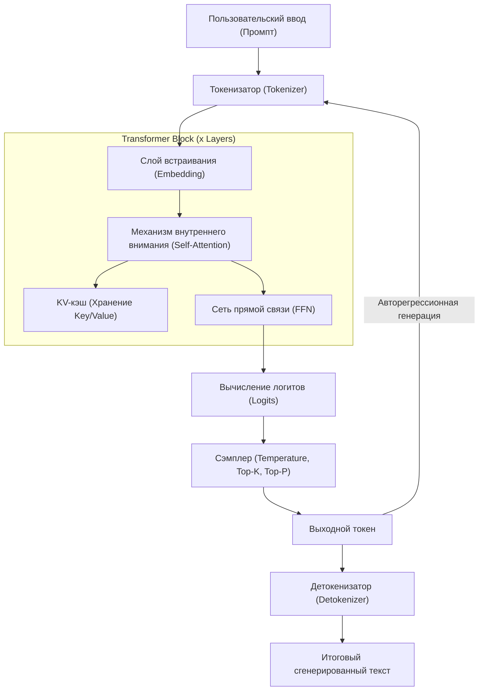
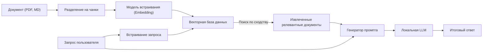

# 1. Введение: Почему именно сейчас локальные LLM на Windows?

По состоянию на 2026 год эволюция генеративного ИИ и больших языковых моделей (LLM) демонстрирует серьезный сдвиг парадигмы — от гигантских облачных API-сервисов к «локальным LLM», работающим на персональных ПК или в локальной среде (on-premise). Облачные ИИ, такие как GPT-5 от OpenAI или Claude 3.5 от Anthropic, очень мощны, но компании и частные лица не могут отправлять абсолютно все свои данные в облако. С точки зрения конфиденциальности, безопасности, задержек, а также долгосрочной и устойчивой стоимости, спрос на локальные LLM сейчас высок как никогда.

В частности, экосистема локальных LLM для среды Windows переживает поразительное развитие. Еще несколько лет назад здравый смысл подсказывал, что «разработка и запуск ИИ означает Linux», но в 2026 году Windows превратилась в очень мощную и удобную платформу для ИИ.

В этой статье представлено полное руководство по созданию, развертыванию и оптимизации локальных LLM в среде Windows с учетом последних технологических тенденций 2026 года. Мы детально и всесторонне рассмотрим всё: от простой настройки для новичков с помощью Ollama до экстремальной оптимизации для продвинутых пользователей с использованием llama.cpp, а также глубокого понимания архитектуры, математического подхода к расчету VRAM и локального файнтюнинга.

## 1.1 Технологические тенденции в сфере локальных LLM в 2026 году

Основные тенденции, формирующие текущую экосистему локальных LLM, следующие:

1. **Полное распространение формата GGUF**: Формат GGUF (GPT-Generated Unified Format), объединяющий метаданные и тензоры в один файл, стал абсолютным стандартом де-факто. Теперь достаточно скачать один файл с Hugging Face, чтобы запустить его в любой среде.
2. **Демократизация архитектуры MoE (Mixture of Experts)**: Выпущено множество небольших, но высокопроизводительных моделей MoE. Активируя при выводе (инференсе) лишь часть «экспертов», они достигают производительности, сопоставимой с гигантскими моделями, при этом снижая вычислительную нагрузку на потребительские ПК.
3. **Высокий уровень абстракции и оптимизации движков вывода**: Такие инструменты, как Ollama, LM Studio и AnythingLLM, стали настолько совершенными, что пользователям больше не нужно беспокоиться о сложных зависимостях, вроде установки драйверов CUDA. Кроме того, нативная поддержка FlashAttention 3 для Windows привела к резкому увеличению скорости инференса.
4. **Использование NPU и развитие Windows Copilot+ PC**: Технология запуска небольших LLM (SLM: Small Language Models) с низким энергопотреблением на ноутбуках без GPU с использованием встроенного NPU (Neural Processing Unit) достигла стадии практического применения.

---

# 2. Требования к аппаратному обеспечению и подготовка ОС

Чтобы локальная LLM работала с приемлемой скоростью (от 15 до 30+ токенов в секунду), самое важное — правильно выбрать аппаратное обеспечение.

## 2.1 Рекомендуемая конфигурация оборудования

С развитием ИИ-ПК меняются и системные требования.

- **ОС**: Windows 11 Pro (24H2 или новее). Необходимо для полноценного использования функций WSL2, продвинутого управления памятью и работы с новейшим API DirectML.
- **CPU**: Серия Intel Core Ultra 200 или выше, либо серия AMD Ryzen 9000 или выше. Если параллельно используется инференс на CPU, жизненно необходима высокоскоростная связь с памятью.
- **RAM**: Минимум 32 ГБ, рекомендуется 64 ГБ или больше. Пропускная способность основной памяти (МБ/с) становится решающим узким местом при инференсе на CPU или переносе (offload) вычислений. В идеале использовать высокоскоростную память DDR5-6000 или выше.
- **GPU**: Серия NVIDIA RTX 4000/5000. В локальных LLM наиболее важна не вычислительная мощность, а «объем VRAM».
  - **Начальный уровень**: RTX 4060 Ti (версия 16 ГБ) — лучшее соотношение цены и качества. Идеально подходит для моделей класса 8B–14B.
  - **Средний уровень**: RTX 4070 Ti SUPER (16 ГБ) / RTX 4080 SUPER (16 ГБ)
  - **High-end**: RTX 4090 (24 ГБ) / RTX 5090 (32 ГБ) — необходимы для запуска квантованных моделей класса 30B–70B.
- **Накопитель**: NVMe SSD PCIe Gen4 или Gen5. Резко сокращает время загрузки моделей объемом в десятки гигабайт.

## 2.2 Настройка WSL2 (Windows Subsystem for Linux 2)

Хотя многие инструменты с графическим интерфейсом работают в Windows нативно, WSL2 очень удобен для разработки на Python, компиляции новейших инструментов и файнтюнинга LoRA, о котором пойдет речь ниже. В последних версиях среды Windows 11 достаточно установить драйвер NVIDIA на хосте, чтобы прозрачно использовать GPU (CUDA) из WSL2.

Откройте PowerShell от имени администратора и выполните следующее:

```powershell
# Установка WSL2 и последней версии Ubuntu
wsl --install -d Ubuntu-24.04

# Обновление ядра
wsl --update
```

После установки выполните команду `nvidia-smi` в терминале WSL2. Если GPU распознан корректно — установка прошла успешно.

---

# 3. Архитектура локальных LLM и механизм вывода (инференса)

Понимание внутренней структуры того, как модель генерирует текст в локальной среде, очень полезно для устранения неполадок и оптимизации.

Следующая диаграмма Mermaid показывает типичный конвейер инференса локальной LLM.



## 3.1 Две фазы: Prefill и Decode

Генерация текста LLM разделена на две фазы с различными вычислительными характеристиками.

1. **Фаза Prefill (Обработка промпта)**: Фаза, в которой весь введенный промпт обрабатывается и понимается за один раз. Поскольку возможны параллельные вычисления, вычислительная мощность GPU (FLOPS) напрямую влияет на скорость. Если промпт длинный, эта фаза может занять несколько секунд.
2. **Фаза Decode (Генерация токенов)**: Фаза, в которой предсказывается по одному токену за раз, и результат передается на следующий вход (авторегрессия). Поскольку параллельные вычисления на этом этапе ограничены, пропускная способность VRAM (Memory Bandwidth) становится решающим узким местом.

---

# 4. Расчет потребления VRAM и математическое понимание размера модели

Чтобы правильно определить, «какая модель будет работать на моем ПК», необходимо понимать формулу расчета VRAM. Если из-за нехватки VRAM происходит откат (фолбэк) к системной памяти (RAM), скорость вывода падает в 10–100 раз.

## 4.1 Базовый объем VRAM на основе размера параметров

Это объем памяти, необходимый для загрузки весов модели в VRAM.
Он рассчитывается с использованием размера модели $P$ (количество параметров, единица измерения: 1 миллиард = 1B) и количества байт на 1 параметр $B$.

$$
V_{base} = P \times B \quad \text{(ГБ)}
$$

Например, при загрузке модели с 8B (8 миллиардами) параметров в формате FP16 (полуточные числа с плавающей запятой, 16 бит = 2 байта):

$$
V_{base} = 8 \times 2 = 16 \text{ ГБ}
$$

Другими словами, даже на GPU с 16 ГБ VRAM вы достигнете предела уже только при загрузке модели.

## 4.2 Магия квантования (Quantization)

Вот здесь в игру вступает «квантование». Снижая точность параметров, размер модели кардинально уменьшается. В случае наиболее распространенного 4-битного квантования (например, Q4_K_M), на один параметр приходится в среднем около 0.55 байта.

$$
V_{base\_4bit} = 8 \times 0.55 = 4.4 \text{ ГБ}
$$

Таким образом, имея 16 ГБ VRAM, вы сможете запускать модель 8B с достаточным запасом памяти.

## 4.3 Расчет KV-кэша (с поддержкой GQA)

Во время вывода (инференса) «KV-кэш», предназначенный для сохранения прошлого контекста, потребляет VRAM. В последних моделях, таких как Llama 3, для экономии памяти применяется GQA (Grouped Query Attention).

Потребление KV-кэша $V_{kv}$ (в гигабайтах) выражается следующей формулой:

$$
V_{kv} = 2 \times b \times s \times l \times \left( \frac{h_{kv}}{h_q} \right) \times h_q \times d \times B_{kv} \div 10^9
$$

Упростив это, мы можем произвести вычисления с помощью количества голов Key и Value $h_{kv}$:

$$
V_{kv} = 2 \times b \times s \times l \times h_{kv} \times d \times B_{kv} \div 10^9
$$

Где:
- $b$: Размер батча (обычно 1 для локального индивидуального использования)
- $s$: Длина последовательности (длина контекста, например: 8192)
- $l$: Количество слоев (например: 32)
- $h_{kv}$: Количество голов KV (например: 8)
- $d$: Размерность на одну голову (например: 128)
- $B_{kv}$: Количество байт KV-кэша (2 для FP16)

Пример расчета (Llama 3 8B, контекст 8192, кэш FP16):
$V_{kv} = 2 \times 1 \times 8192 \times 32 \times 8 \times 128 \times 2 \div 10^9 \approx 1.07 \text{ ГБ}$

Обратите внимание, что чем больше длина контекста $s$, тем больше необходимо VRAM, и этот рост линеен.

---

# 5. Практика 1: Самая быстрая и короткая настройка с использованием Ollama

Теперь, поняв теорию, давайте действительно запустим LLM в среде Windows.
По состоянию на 2026 год, самым удобным инструментом является «Ollama». Он предоставляет интуитивно понятный CLI в стиле Docker.

## 5.1 Установка и запуск

1. Скачайте и запустите установщик для Windows с [официального сайта Ollama](https://ollama.com/).
2. Откройте PowerShell и введите следующую команду. Здесь мы используем `llama3:8b`.

```powershell
ollama run llama3:8b
```

При первом запуске произойдет загрузка модели. По завершении вы сможете вести диалог прямо в терминале.

## 5.2 Создание собственного ИИ с помощью Modelfile

Вы можете легко создать ИИ с определенной персоной. Создайте файл `Modelfile` в любом месте.

```text
FROM llama3:8b

SYSTEM """
Вы — выдающийся старший инженер-программист (Senior Software Engineer).
На вопросы пользователя всегда отвечайте логично и кратко, обязательно приводя примеры кода.
"""

PARAMETER temperature 0.3
PARAMETER num_ctx 8192
```

Используйте следующие команды для сборки и запуска вашей собственной модели:

```powershell
ollama create SeniorDev -f ./Modelfile
ollama run SeniorDev
```

## 5.3 Использование из внешних приложений (ИИ-редакторов)

Ollama открывает API-эндпоинт, совместимый с OpenAI, по адресу `http://localhost:11434`.
В настройках бэкенда таких расширений для VS Code, как Cursor или Continue.dev, просто укажите этот URL и имя модели (например, `SeniorDev`), чтобы получить мощного локального помощника по программированию абсолютно бесплатно.

---

# 6. Практика 2: Экстремальная настройка производительности с помощью llama.cpp

Если вы хотите получить доступ к детальному управлению памятью или быстро опробовать новейшие форматы (такие как EXL2 или IQ квантование), то стоит использовать основной движок `llama.cpp` напрямую.

## 6.1 Процесс сборки llama.cpp

В среде Windows лучше всего собирать из исходного кода, используя CUDA Toolkit и CMake.

```powershell
git clone https://github.com/ggerganov/llama.cpp
cd llama.cpp
mkdir build
cd build

# Конфигурация и компиляция с поддержкой CUDA
cmake .. -DLLAMA_CUBLAS=ON -DBUILD_SHARED_LIBS=OFF
cmake --build . --config Release -j 16
```

## 6.2 Продвинутый запуск в режиме сервера

Используйте собранный `llama-server.exe` для хостинга модели.

```powershell
.\bin\Release\llama-server.exe `
  --model "C:\models\Llama-3-8B-Instruct.Q4_K_M.gguf" `
  --ctx-size 8192 `
  --n-gpu-layers 99 `
  --threads 8 `
  --flash-attn `
  --port 8080
```

- `--n-gpu-layers 99`: Переносит на VRAM GPU все возможные слои (максимально возможное количество).
- `--flash-attn`: Включает FlashAttention 3, что повышает скорость инференса и снижает потребление VRAM KV-кэшем.

---

# 7. GUI фронтенды: LM Studio и создание локального RAG

Если вы не любите командную строку или хотите интуитивно выполнять RAG (Генерация с дополненной выборкой), воспользуйтесь графическими интерфейсами.

## 7.1 LM Studio

LM Studio — это отличное приложение, которое объединяет поиск моделей, их загрузку, предварительную проверку системных требований и пользовательский интерфейс для чата в одном месте. Просто нажав кнопку "Local Server" в приложении, вы запускаете API, совместимый с OpenAI.

## 7.2 Архитектура RAG с использованием AnythingLLM

Вот схема архитектуры среды RAG для чтения внутренних корпоративных документов или личных заметок.



Используя десктопную версию AnythingLLM (для Windows), достаточно указать Ollama (как LLM и Embedding) на экране настроек и настроить использование локальной векторной БД (LanceDB), и эта архитектура будет готова за несколько минут. Так рождается приватный ИИ, который совершенно не отправляет данные наружу.

---

# 8. Файнтюнинг на Windows в WSL2 (LoRA)

Если вы хотите не только локально запускать модели, но и обучать их на своих собственных данных, чтобы сделать умнее, вы можете использовать файнтюнинг с помощью LoRA (Low-Rank Adaptation). По состоянию на 2026 год, благодаря библиотеке под названием "Unsloth", обучение 8B-модели в среде Windows WSL2 с 16 ГБ VRAM завершается всего за несколько часов.

Выполните следующее в Ubuntu под WSL2 для настройки среды:

```bash
conda create --name unsloth_env python=3.11
conda activate unsloth_env
pip install "unsloth[colab-new] @ git+https://github.com/unslothai/unsloth.git"
pip install --no-deps trl peft accelerate bitsandbytes
```

Unsloth доводит оптимизацию ядер CUDA до предела, так что скорость обучения примерно удваивается, а потребление VRAM снижается вдвое по сравнению со стандартными библиотеками Hugging Face. Просто запустите Jupyter Notebook, загрузите свой набор данных (в формате JSONL), и вы сможете выполнить несколько эпох обучения даже на RTX 4060 Ti с VRAM от 12 ГБ до 16 ГБ.

---

# 9. Устранение проблем с производительностью (Troubleshooting)

Часто возникающие проблемы и способы их решения.

### 1. Скорость вывода крайне низкая (1-2 tokens/s)
**Причина**: Модель не помещается в VRAM и выгружается (offload) в системную память (RAM).
**Решение**: Проверьте параметр «Выделенная память графического процессора» в Диспетчере задач. Если он достиг предела, уменьшите размер контекста (`-c`) или используйте квантованную модель с меньшим битрейтом (например, Q4_K_M).

### 2. Ошибка "CUDA out of memory"
**Причина**: VRAM полностью исчерпан. В основном возникает, когда диалог затягивается, и KV-кэш разрастается.
**Решение**: Намеренно ограничьте значение `num_ctx` в Ollama или `-c` в llama.cpp, сделав его меньше.

### 3. Странная генерация на японском (или другом) языке
**Причина**: Несоответствие шаблона промпта или неподдерживаемая модель.
**Решение**: Убедитесь, что вы используете модель, содержащую слово `Instruct` в названии, и что в инструменте выбран правильный шаблон, указанный автором модели (например, формат ChatML или Llama3).

---

# 10. Заключение и перспективы на будущее

В 2026 году развертывание локальных LLM в среде Windows больше не является привилегией лишь избранных инженеров. Благодаря формату GGUF, ставшему стандартом де-факто, появлению продуманных экосистем, таких как Ollama и LM Studio, а также аппаратной оптимизации, включая FlashAttention, каждый может легко получить ИИ-среду корпоративного уровня.

Пожалуйста, воспользуйтесь ключевыми моментами, описанными в этой статье:

1. Используйте **математические расчеты VRAM**, чтобы логически выбрать размер модели и уровень квантования, оптимальные для характеристик вашего ПК.
2. Используйте **Ollama** для максимально быстрой настройки среды и интегрируйте её с ИИ-редакторами для резкого повышения производительности.
3. Раскройте предельные возможности оборудования с помощью продвинутого контроля параметров в **llama.cpp**.
4. Создайте безопасную локальную систему RAG для работы с конфиденциальными данными с помощью **AnythingLLM**.
5. Используйте **Unsloth (WSL2)**, чтобы вырастить собственного персонализированного ИИ, обладающего вашими экспертными знаниями.

«Демократизация» ИИ — это больше не модное словечко, а реальная система, работающая на вашем рабочем столе Windows. Освободитесь от затрат на облачные API и рисков утечки информации, и прямо сейчас сделайте шаг в свободный и мощный мир приватного ИИ.
