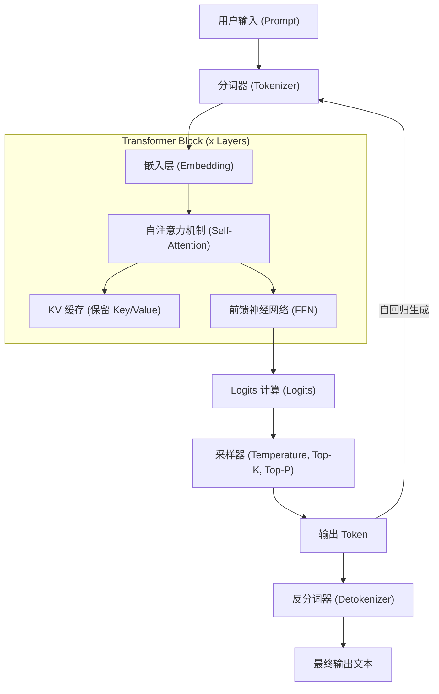
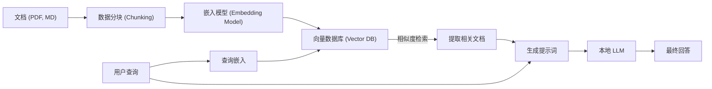

# 1. 引言：为什么现在要在Windows上运行本地LLM？

2026年现在，生成式AI和大型语言模型（LLM）的发展正经历着一场巨大的范式转变，从云端庞大的API服务，转向在个人PC和本地（On-premises）环境中运行的“本地LLM”。虽然OpenAI的GPT-5和Anthropic的Claude 3.5等云端AI非常强大，但企业和个人并不能将所有数据都发送到云端。出于隐私、安全、延迟以及长期和可持续成本的考虑，对本地LLM的需求正在呈现前所未有的爆发式增长。

特别是在Windows环境中，本地LLM生态系统的演进令人瞩目。直到几年前，“AI开发和运行首选Linux”还是常识，但在2026年的今天，Windows已经转变为一个极其强大且易于使用的AI平台。

本文将基于2026年最新的技术趋势，为您提供在Windows环境中构建、运行和优化本地LLM的完整指南。从面向初学者的使用Ollama的简单构建，到面向高级用户的利用llama.cpp的极限优化，再到VRAM计算的数学方法、架构的深入解析，以及在本地进行的微调（Fine-tuning），我们将以压倒性的丰富内容进行彻底解说。

## 1.1 2026年围绕本地LLM的技术趋势

塑造当前本地LLM生态系统的主要趋势如下：

1. **GGUF格式的全面普及**: 将元数据和张量（Tensor）整合到单一文件中的GGUF（GPT-Generated Unified Format）已经完全成为事实上的标准。这使得只需从Hugging Face下载一个文件，就可以在任何环境中运行。
2. **MoE（Mixture of Experts）架构的民主化**: 发布了许多规模较小但性能卓越的MoE模型。通过在推理时仅激活部分专家网络，可以在控制消费级PC计算负载的同时，实现媲美巨大模型的性能。
3. **推理引擎的高度抽象化和优化**: Ollama、LM Studio、AnythingLLM等工具变得更加完善，用户无需再关注安装CUDA驱动等复杂的依赖关系。此外，随着FlashAttention 3原生支持Windows，推理速度得到了急剧提升。
4. **NPU的应用和Windows Copilot+ PC的崛起**: 即使是在没有GPU的笔记本电脑上，利用内置的NPU（神经网络处理单元）以低功耗运行小型LLM（SLM: Small Language Models）的技术也已经进入实用阶段。

---

# 2. 硬件要求与操作系统准备

为了以实用的速度（每秒15到30个Token以上）运行本地LLM，硬件的选择最为关键。

## 2.1 推荐硬件配置

随着AI PC的进化，所需的规格也在发生变化。

- **OS**: Windows 11 Pro (24H2或更高版本)。这是利用WSL2的完整功能、高级内存管理以及DirectML最新API的必要条件。
- **CPU**: Intel Core Ultra 200系列及以上，或AMD Ryzen 9000系列及以上。如果同时使用CPU进行推理，高带宽的内存通信是不可或缺的。
- **RAM**: 最低32GB，推荐64GB或以上。主内存的带宽（MB/s）是CPU推理或卸载（Offloading）时的决定性瓶颈。DDR5-6000以上的快速内存是理想选择。
- **GPU**: NVIDIA RTX 4000/5000系列。对于本地LLM来说，最重要的不是计算性能，而是“VRAM容量”。
  - **入门级**: RTX 4060 Ti (16GB版) - 性价比最高。非常适合8B至14B级别的模型。
  - **中端**: RTX 4070 Ti SUPER (16GB) / RTX 4080 SUPER (16GB)
  - **高端**: RTX 4090 (24GB) / RTX 5090 (32GB) - 运行30B至70B级别的量化模型所必需。
- **存储**: PCIe Gen4或Gen5的NVMe SSD。可以极大地缩短加载数十GB模型所需的时间。

## 2.2 WSL2 (Windows Subsystem for Linux 2) 的设置

虽然许多GUI工具可以在Windows原生运行，但在使用Python进行开发、编译最新工具以及稍后将提到的LoRA微调中，WSL2非常方便。在最新的Windows 11环境中，只需在主机端安装NVIDIA驱动，即可从WSL2中透明地使用GPU（CUDA）。

以管理员权限打开PowerShell，并执行以下命令：

```powershell
# 安装WSL2和最新的Ubuntu
wsl --install -d Ubuntu-24.04

# 更新内核
wsl --update
```

安装完成后，在WSL2终端中运行 `nvidia-smi`，如果能正常识别到GPU，即表示成功。

---

# 3. 本地LLM的架构与推理机制

了解模型在本地环境中是如何生成文本的内部结构，对于故障排除和优化非常有用。

以下Mermaid图展示了典型的本地LLM推理流水线（Pipeline）。



## 3.1 两个阶段：Prefill 与 Decode

LLM的文本生成分为计算特性不同的两个阶段。

1. **Prefill（提示词处理）阶段**: 这是一个一次性处理和理解输入的完整提示词（Prompt）的阶段。由于可以进行并行计算，GPU的计算能力（FLOPS）直接影响速度。如果提示词很长，此阶段可能需要几秒钟的时间。
2. **Decode（Token生成）阶段**: 这是一个逐个预测Token，并将其作为下一次输入的（自回归）阶段。在这个阶段并行计算受到限制，因此GPU的VRAM带宽（Memory Bandwidth）成为了决定性的瓶颈。

---

# 4. VRAM消耗量的计算与模型大小的数学理解

为了准确判断“我的PC能运行哪个模型？”，必须理解VRAM的计算公式。如果由于VRAM不足而导致回退（Fallback）到系统内存（RAM），推理速度将会变慢10倍到100倍。

## 4.1 基于参数大小的基础VRAM

这是将模型的权重（Weights）加载到VRAM中所需的内存量。
使用模型大小 $P$ （参数数量，单位：10亿 = 1B）和每个参数的字节数 $B$ 来计算。

$$
V_{base} = P \times B \quad \text{(GB)}
$$

例如，要将8B（80亿）参数的模型以FP16（半精度浮点数，16位=2字节）加载时：

$$
V_{base} = 8 \times 2 = 16 \text{ GB}
$$

也就是说，即使拥有16GB的VRAM的GPU，仅加载模型就几乎达到了极限。

## 4.2 量化（Quantization）的魔法

于是“量化”便登场了。通过降低参数的精度，能够显著缩小模型大小。在最常见的4bit量化（例如：Q4_K_M）的情况下，每个参数平均约占用0.55字节。

$$
V_{base\_4bit} = 8 \times 0.55 = 4.4 \text{ GB}
$$

因此，如果有16GB的VRAM，就可以非常游刃有余地运行8B模型。

## 4.3 KV缓存的计算（支持GQA版）

在推理时，用于保存过去上下文的“KV缓存”会消耗VRAM。在Llama 3等最新模型中，为了节省内存，采用了GQA（Grouped Query Attention）。

KV缓存的消耗量 $V_{kv}$ （千兆字节，GB）可以通过以下公式表示：

$$
V_{kv} = 2 \times b \times s \times l \times \left( \frac{h_{kv}}{h_q} \right) \times h_q \times d \times B_{kv} \div 10^9
$$

整理后，可以使用Key和Value的注意力头数 $h_{kv}$ 简单地计算：

$$
V_{kv} = 2 \times b \times s \times l \times h_{kv} \times d \times B_{kv} \div 10^9
$$

其中：
- $b$: 批处理大小（个人本地使用通常为1）
- $s$: 序列长度（上下文长度，例如：8192）
- $l$: 层数（例如：32）
- $h_{kv}$: KV注意力头数（例如：8）
- $d$: 每个头的维度数（例如：128）
- $B_{kv}$: KV缓存的字节数（如果为FP16则为2）

计算示例（Llama 3 8B, 上下文8192, FP16缓存）：
$V_{kv} = 2 \times 1 \times 8192 \times 32 \times 8 \times 128 \times 2 \div 10^9 \approx 1.07 \text{ GB}$

请注意，上下文长度 $s$ 越长，所需的VRAM就会呈线性增加。

---

# 5. 实践1：使用Ollama进行最快、最短的设置

了解了理论之后，让我们实际在Windows环境中运行LLM。
在2026年，对用户最友好的工具是“Ollama”。它提供了一个类似于Docker的直观命令行界面（CLI）。

## 5.1 安装与运行

1. 从 [Ollama官网](https://ollama.com/) 下载Windows版安装程序并运行。
2. 打开PowerShell并输入以下命令。在这里，我们将使用支持日语的 `llama3:8b`。

```powershell
ollama run llama3:8b
```

首次运行时会下载模型。下载完成后，就可以直接在终端上进行对话了。

## 5.2 使用Modelfile创建自定义AI

可以轻松创建具有特定人格（Persona）的AI。在任意位置创建一个 `Modelfile`。

```text
FROM llama3:8b

SYSTEM """
你是一名极其优秀的资深软件工程师。
对于用户的提问，请务必结合代码示例，有逻辑且简明扼要地进行回答。
"""

PARAMETER temperature 0.3
PARAMETER num_ctx 8192
```

使用以下命令构建并运行自定义模型：

```powershell
ollama create SeniorDev -f ./Modelfile
ollama run SeniorDev
```

## 5.3 从外部应用（AI编辑器）中使用

Ollama会在 `http://localhost:11434` 公开一个兼容OpenAI的API端点。
在Cursor或Continue.dev等VS Code扩展插件的后端设置中，将URL指定为上述地址，并将模型名称指定为 `SeniorDev` 等，只需这样就能实现一个免费且强大的本地编程助手。

---

# 6. 实践2：使用llama.cpp进行极限性能调优

如果您想要进行细致的内存管理，或者想尽早尝试最新的格式（如EXL2或IQ量化等），可以直接操作核心引擎 `llama.cpp`。

## 6.1 llama.cpp 的构建步骤

在Windows环境中，最好的方式是使用CUDA Toolkit和CMake从源码进行构建。

```powershell
git clone https://github.com/ggerganov/llama.cpp
cd llama.cpp
mkdir build
cd build

# 配置为支持CUDA并进行编译
cmake .. -DLLAMA_CUBLAS=ON -DBUILD_SHARED_LIBS=OFF
cmake --build . --config Release -j 16
```

## 6.2 在服务器模式下进行高级启动

使用构建好的 `llama-server.exe` 来托管模型。

```powershell
.\bin\Release\llama-server.exe `
  --model "C:\models\Llama-3-8B-Instruct.Q4_K_M.gguf" `
  --ctx-size 8192 `
  --n-gpu-layers 99 `
  --threads 8 `
  --flash-attn `
  --port 8080
```

- `--n-gpu-layers 99`: 将尽可能多的层卸载到GPU VRAM中。
- `--flash-attn`: 启用FlashAttention 3，以提升推理速度并减少KV缓存的VRAM消耗。

---

# 7. GUI前端：LM Studio与本地RAG的构建

如果您对命令行有抵触情绪，或者想要直观地进行RAG（检索增强生成），可以使用GUI。

## 7.1 LM Studio

LM Studio是一个将模型搜索、下载、系统要求预检查以及聊天UI等功能集于一身的优秀应用程序。只需点击应用内的“Local Server”按钮，就能启动兼容OpenAI的API。

## 7.2 使用AnythingLLM的RAG架构

这是一个让系统读取公司内部文档或个人笔记的RAG环境架构图。



使用AnythingLLM桌面版（Windows），只需在设置界面中指定Ollama（用于LLM和Embedding），并设置为使用本地VectorDB（LanceDB），几分钟内就能完成这个架构的搭建。一个完全不向外部发送任何数据的私有AI就此诞生。

---

# 8. 在Windows WSL2上进行微调 (LoRA)

除了在本地运行，如果您还想用自己的数据让模型变得更聪明，可以使用LoRA（低秩自适应）进行微调。在2026年，通过使用名为“Unsloth”的库，在Windows的WSL2环境中，即使只有16GB的VRAM，也能在几个小时内完成8B模型的训练。

在WSL2的Ubuntu中执行以下命令来构建环境：

```bash
conda create --name unsloth_env python=3.11
conda activate unsloth_env
pip install "unsloth[colab-new] @ git+https://github.com/unslothai/unsloth.git"
pip install --no-deps trl peft accelerate bitsandbytes
```

Unsloth将CUDA内核优化到了极致，与标准的Hugging Face库相比，训练速度约为原来的2倍，而VRAM消耗量减少了一半左右。启动Jupyter Notebook并加载数据集（JSONL格式）后，即使是使用VRAM为12GB至16GB的RTX 4060 Ti等显卡，也可以完成几个Epoch的训练。

---

# 9. 性能与故障排除

以下是经常遇到的问题及其解决方案。

### 1. 推理速度极慢（1至2 tokens/s）
**原因**: 模型无法完全装入VRAM，被卸载到了系统内存（RAM）中。
**对策**: 请在任务管理器中检查“专用GPU内存”。如果已达到极限，请减小上下文大小（`-c`），或者使用位数更低的量化模型（如Q4_K_M等）。

### 2. “CUDA out of memory” 错误
**原因**: VRAM完全枯竭。特别是当对话时间过长导致KV缓存不断膨胀时会发生这种情况。
**对策**: 在Ollama中，有意地减小 `num_ctx` 的值；在llama.cpp中，减小 `-c` 的值以进行限制。

### 3. 生成的日语不正常
**原因**: 提示词模板不匹配，或者是使用了不支持的模型。
**对策**: 请使用模型名称中包含 `Instruct` 的模型，并确认工具端是否选择了模型作者指定的正确模板，例如ChatML或Llama3格式。

---

# 10. 总结与未来展望

在2026年，在Windows环境中构建本地LLM已经不再是少数工程师的特权。随着GGUF格式成为事实上的标准、Ollama和LM Studio等完善生态系统的出现，以及以FlashAttention为首的硬件优化，任何人都可以轻松获得企业级的AI环境。

请务必活用本文中解说的以下几点：

1. 使用**VRAM的数学计算**，逻辑性地选择最适合您PC规格的模型大小和量化级别。
2. 使用**Ollama**以最快的速度搭建环境，并与AI编辑器联动，从而急剧提高生产力。
3. 通过**llama.cpp**的高级参数控制，榨干硬件的极限性能。
4. 使用**AnythingLLM**构建能够处理机密数据的安全的本地RAG系统。
5. 活用**Unsloth (WSL2)**，培育出拥有专属于您专业知识的自定义AI。

AI的“民主化”已经不再是一个流行语，而是一个运行在您的Windows桌面上的真实系统。摆脱云端API的使用成本和信息泄露风险，现在就请迈入这个自由且强大的私有AI世界吧。
