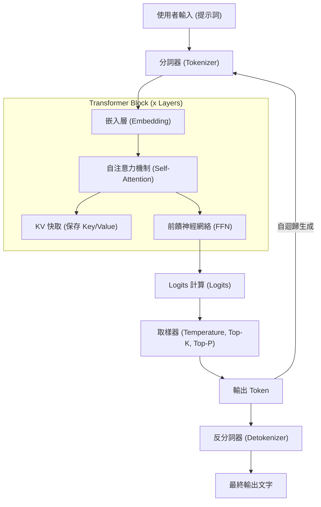
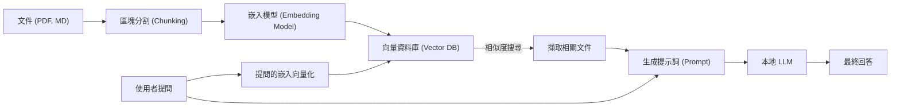

# 1. 簡介：為什麼現在要在 Windows 上運行本地 LLM？

2026年的今天，生成式 AI 與大型語言模型（LLM）的進化，展現出從雲端上巨大的 API 服務，轉向在個人 PC 與地端環境運作的「本地 LLM」的巨大典範轉移。雖然 OpenAI 的 GPT-5 與 Anthropic 的 Claude 3.5 等雲端 AI 非常強大，但企業與個人並不能將所有數據都傳送到雲端。從隱私、安全性、延遲，以及長期、可持續性成本的觀點來看，對本地 LLM 的需求正迎來前所未有的爆發性增長。

尤其在 Windows 環境下，本地 LLM 生態系統的進化更是令人矚目。幾年前，「說到 AI 開發與執行就是 Linux」還是常識，但到了 2026 年的今天，Windows 已經蛻變成一個非常強大且易於使用的 AI 平台。

本文將基於 2026 年最新的技術趨勢，為您提供在 Windows 環境下建置、營運與最佳化本地 LLM 的完全指南。從適合初學者的 Ollama 簡易建置，到適合進階使用者的 llama.cpp 極限最佳化，再到 VRAM 計算的數學方法、架構的深入理解，以及本地的微調（Fine-tuning），將以壓倒性的豐富內容為您進行徹底解說。

## 1.1 2026 年本地 LLM 的相關技術趨勢

塑造當前本地 LLM 生態系統的主要趨勢如下：

1. **GGUF 格式的全面普及**：將元數據（Metadata）與張量（Tensor）整合到單一檔案的 GGUF（GPT-Generated Unified Format）已經完全成為業界標準（De facto standard）。這使得使用者只需從 Hugging Face 下載一個檔案，就能在任何環境下執行。
2. **MoE（Mixture of Experts）架構的民主化**：市面上發布了許多小規模卻高效能的 MoE 模型，透過在推論時僅啟動部分專家網路（Expert），在降低消費級 PC 運算負載的同時，展現出足以媲美巨大模型的效能。
3. **推論引擎的高度抽象化與最佳化**：Ollama、LM Studio、AnythingLLM 等工具變得更加完善，使用者不再需要擔心安裝 CUDA 驅動程式等複雜的依賴關係。此外，隨著 FlashAttention 3 對 Windows 提供原生支援，推論速度也獲得了戲劇性的提升。
4. **NPU 的應用與 Windows Copilot+ PC 的崛起**：即使是沒有配備 GPU 的筆記型電腦，利用內建的 NPU（神經網絡處理單元）以低功耗運行小型 LLM（SLM: Small Language Models）的技術也已進入實用階段。

---

# 2. 硬體需求與作業系統準備

為了讓本地 LLM 能以實用的速度（每秒 15 到 30 個 Token 以上）運行，硬體的選擇是最為重要的。

## 2.1 建議硬體配置

隨著 AI PC 的進化，硬體規格的要求也隨之改變。

- **作業系統 (OS)**：Windows 11 Pro (24H2 或更高版本)。為了使用 WSL2 的完整功能、進階記憶體管理，以及 DirectML 的最新 API，這是必備的。
- **處理器 (CPU)**：Intel Core Ultra 200 系列或更高版本，或 AMD Ryzen 9000 系列或更高版本。若要同時使用 CPU 進行推論，高頻寬記憶體通訊是不可或缺的。
- **記憶體 (RAM)**：最低 32GB，建議 64GB 以上。主記憶體的頻寬（MB/s）在 CPU 推論或卸載（Offload）時會成為決定性的瓶頸。DDR5-6000 以上的高速記憶體是最理想的。
- **顯示卡 (GPU)**：NVIDIA RTX 4000 / 5000 系列。對於本地 LLM 來說，最重要的不是運算效能，而是「VRAM（顯示記憶體）容量」。
  - **入門級**：RTX 4060 Ti (16GB 版) - CP值最高。非常適合 8B 到 14B 等級的模型。
  - **中階**：RTX 4070 Ti SUPER (16GB) / RTX 4080 SUPER (16GB)
  - **高階**：RTX 4090 (24GB) / RTX 5090 (32GB) - 要運行 30B 到 70B 等級的量化模型會需要用到。
- **儲存空間**：PCIe Gen4 或 Gen5 的 NVMe SSD。能大幅縮短載入數十 GB 模型所需的時間。

## 2.2 WSL2 (Windows Subsystem for Linux 2) 設定

雖然許多 GUI 工具能在 Windows 原生環境下運行，但對於使用 Python 進行開發、編譯最新工具，以及後續會提到的 LoRA 微調來說，WSL2 會非常方便。在 Windows 11 的最新環境中，只需在主機端安裝 NVIDIA 驅動程式，即可在 WSL2 中透通地使用 GPU (CUDA)。

以系統管理員身分開啟 PowerShell，並執行以下命令：

```powershell
# 安裝 WSL2 與最新的 Ubuntu
wsl --install -d Ubuntu-24.04

# 更新核心
wsl --update
```

安裝完成後，在 WSL2 終端機內執行 `nvidia-smi`，如果能正常辨識到 GPU，即代表成功。

---

# 3. 本地 LLM 的架構與推論機制

了解模型在本地環境中是如何生成文字的內部結構，對於疑難排解和效能最佳化非常有用。

以下的 Mermaid 圖表展示了典型的本地 LLM 推論流程。



## 3.1 兩個階段：Prefill 與 Decode

LLM 的文字生成分為兩個具有不同計算特性的階段。

1. **Prefill（提示詞處理）階段**：將輸入的完整提示詞一次性處理並進行理解的階段。由於可以平行計算，GPU 的運算能力（FLOPS）將直接影響速度。如果提示詞很長，這個階段可能會需要花費數秒鐘的時間。
2. **Decode（Token 生成）階段**：逐一預測 Token 並將其作為下一次輸入（自迴歸）的階段。因為在這個階段平行計算會受到限制，所以 GPU 的 VRAM 頻寬（Memory Bandwidth）會成為決定性的瓶頸。

---

# 4. VRAM 消耗量的計算與模型大小的數學解析

為了正確判斷「自己的 PC 能運行什麼模型？」，我們必須了解 VRAM 的計算公式。若因 VRAM 不足而觸發回退到系統記憶體（RAM）的機制，推論速度將會變慢 10 到 100 倍。

## 4.1 基於參數大小的基礎 VRAM

這代表將模型的權重載入到 VRAM 所需的記憶體容量。
可透過模型大小 $P$（參數數量，單位：10億 = 1B）與每個參數所佔的位元組數 $B$ 來進行計算。

$$
V_{base} = P \times B \quad \text{(GB)}
$$

例如，如果以 FP16（半精度浮點數，16位元=2位元組）載入一個 8B（80億）參數的模型：

$$
V_{base} = 8 \times 2 = 16 \text{ GB}
$$

也就是說，即使 GPU 擁有 16GB 的 VRAM，光是載入模型就會幾乎達到極限。

## 4.2 量化 (Quantization) 的魔法

這時「量化」就派上用場了。透過降低參數的精度，可以大幅縮減模型大小。以最常見的 4bit 量化（例：Q4_K_M）來說，每個參數平均大約僅佔 0.55 個位元組。

$$
V_{base\_4bit} = 8 \times 0.55 = 4.4 \text{ GB}
$$

因此，只要有 16GB 的 VRAM，就能綽綽有餘地運行 8B 模型。

## 4.3 KV 快取計算 (GQA 支援版)

在進行推論時，用來保留過去上下文的「KV 快取」會消耗 VRAM。在如 Llama 3 等最新模型中，為了節省記憶體，採用了 GQA（Grouped Query Attention）技術。

KV 快取的消耗量 $V_{kv}$（GB）可以用以下的數學公式來表示：

$$
V_{kv} = 2 \times b \times s \times l \times \left( \frac{h_{kv}}{h_q} \right) \times h_q \times d \times B_{kv} \div 10^9
$$

整理後，可以使用 Key 和 Value 的注意力頭數量 $h_{kv}$ 進行更簡單的計算：

$$
V_{kv} = 2 \times b \times s \times l \times h_{kv} \times d \times B_{kv} \div 10^9
$$

這裡的變數代表：
- $b$：批次大小（個人本地使用時通常為 1）
- $s$：序列長度（上下文長度，例：8192）
- $l$：層數（例：32）
- $h_{kv}$：KV 注意力頭數（例：8）
- $d$：每個注意力頭的維度（例：128）
- $B_{kv}$：KV 快取的位元組數（FP16 為 2）

計算範例（Llama 3 8B, 上下文 8192, FP16 快取）：
$V_{kv} = 2 \times 1 \times 8192 \times 32 \times 8 \times 128 \times 2 \div 10^9 \approx 1.07 \text{ GB}$

請注意，隨著上下文長度 $s$ 的增加，所需的 VRAM 將呈現線性增長。

---

# 5. 實踐 1：使用 Ollama 進行最快、最短的環境建置

理解了理論之後，讓我們實際在 Windows 環境中運行 LLM 看看。
在 2026 年的今天，最對使用者友善的工具非「Ollama」莫屬。它提供了類似 Docker 般直覺的 CLI（命令列介面）。

## 5.1 安裝與執行

1. 從 [Ollama 官方網站](https://ollama.com/) 下載並執行 Windows 版安裝程式。
2. 開啟 PowerShell，並輸入以下命令。在這裡，我們使用支援日文的 `llama3:8b`。

```powershell
ollama run llama3:8b
```

第一次執行時會下載模型。下載完成後，就可以直接在終端機中進行對話。

## 5.2 使用 Modelfile 建立客製化 AI

您可以輕鬆建立具有特定人格特質（Persona）的 AI。請在任意位置建立一個名為 `Modelfile` 的檔案。

```text
FROM llama3:8b

SYSTEM """
你是一位非常優秀的資深軟體工程師。
對於使用者的提問，請務必搭配程式碼範例，以合乎邏輯且簡潔的方式進行回答。
"""

PARAMETER temperature 0.3
PARAMETER num_ctx 8192
```

使用以下命令來建置並執行您專屬的模型：

```powershell
ollama create SeniorDev -f ./Modelfile
ollama run SeniorDev
```

## 5.3 透過外部應用程式 (AI 編輯器) 存取

Ollama 會在 `http://localhost:11434` 開放一個與 OpenAI 相容的 API 端點（Endpoint）。
只需在 Cursor 或 Continue.dev 等 VS Code 擴充套件的後端設定中，將 URL 指定為上述位置，並將模型名稱指定為 `SeniorDev` 等，就能免費實現強大的本地程式碼助手。

---

# 6. 實踐 2：使用 llama.cpp 進行極限效能調校

如果您想要更精細的記憶體管理，或是想搶先嘗試最新格式（例如 EXL2 或 IQ 量化等），可以直接操作核心引擎 `llama.cpp`。

## 6.1 llama.cpp 的編譯步驟

在 Windows 環境下，最好的做法是使用 CUDA Toolkit 與 CMake 從原始碼進行編譯。

```powershell
git clone https://github.com/ggerganov/llama.cpp
cd llama.cpp
mkdir build
cd build

# 設定為支援 CUDA 並進行編譯
cmake .. -DLLAMA_CUBLAS=ON -DBUILD_SHARED_LIBS=OFF
cmake --build . --config Release -j 16
```

## 6.2 在伺服器模式下的進階啟動

使用編譯出來的 `llama-server.exe` 來託管（Host）模型。

```powershell
.\bin\Release\llama-server.exe `
  --model "C:\models\Llama-3-8B-Instruct.Q4_K_M.gguf" `
  --ctx-size 8192 `
  --n-gpu-layers 99 `
  --threads 8 `
  --flash-attn `
  --port 8080
```

- `--n-gpu-layers 99`：盡可能將所有層都卸載到 GPU VRAM 中。
- `--flash-attn`：啟用 FlashAttention 3，以提升推論速度並減少 KV 快取的 VRAM 消耗。

---

# 7. GUI 前端介面：LM Studio 與本地 RAG 建置

如果您對命令列（Command Line）有所抗拒，或者想要更直覺地進行 RAG（檢索增強生成），可以使用 GUI。

## 7.1 LM Studio

LM Studio 是一款出色的應用程式，它將模型搜尋、下載、系統需求事前檢查，以及聊天 UI 全部整合在一起。只需按下應用程式內的「Local Server」按鈕，就能啟動相容於 OpenAI 的 API。

## 7.2 使用 AnythingLLM 的 RAG 架構

這是讀取公司內部文件或個人筆記的 RAG 環境架構圖：



只要使用 AnythingLLM 電腦版（Windows），在設定畫面中指定 Ollama（作為 LLM 與 Embedding 引擎），並設定使用本地的 VectorDB（LanceDB），短短幾分鐘內就能完成這個架構。這將誕生一個完全不會向外部傳送任何資料的私有 AI。

---

# 8. 在 Windows WSL2 上進行微調 (LoRA)

不僅是在本地運行，如果您還想用自己的資料讓模型變得更聰明，可以使用 LoRA（Low-Rank Adaptation）來進行微調（Fine-tuning）。在 2026 年的今天，只要使用「Unsloth」這個函式庫，在 Windows 的 WSL2 環境下，即使只有 16GB 的 VRAM，也能在數小時內完成 8B 模型的訓練。

在 WSL2 的 Ubuntu 內執行以下命令來建立環境：

```bash
conda create --name unsloth_env python=3.11
conda activate unsloth_env
pip install "unsloth[colab-new] @ git+https://github.com/unslothai/unsloth.git"
pip install --no-deps trl peft accelerate bitsandbytes
```

Unsloth 將 CUDA 核心優化到了極致，與標準的 Hugging Face 函式庫相比，訓練速度約為兩倍，VRAM 消耗量則減半。只要開啟 Jupyter Notebook 並載入資料集（JSONL 格式），即使是 VRAM 為 12GB 到 16GB 的 RTX 4060 Ti 等顯示卡，也能夠完成幾個 Epoch 的訓練。

---

# 9. 效能與疑難排解

以下是常遇到的問題及其解決方案：

### 1. 推論速度極端緩慢（1～2 tokens/s）
**原因**：模型無法完全載入到 VRAM 中，導致被卸載（Offload）到系統記憶體（RAM）。
**解決方案**：請在工作管理員中確認「專用 GPU 記憶體」。如果已經達到極限，請縮小上下文大小（`-c`），或是使用位元數更低的量化模型（如 Q4_K_M 等）。

### 2. 「CUDA out of memory」錯誤
**原因**：VRAM 已經完全耗盡。特別是在對話時間過長，導致 KV 快取過度膨脹時會發生。
**解決方案**：刻意限制並調小參數值，如果是 Ollama，請調小 `num_ctx`；如果是 llama.cpp，請調小 `-c` 的數值。

### 3. 日文（或其他非英語）的生成很奇怪
**原因**：提示詞模板（Prompt Template）不一致，或是使用了不支援該語言的模型。
**解決方案**：請使用模型名稱中包含 `Instruct` 的版本，並確認工具端是否選擇了模型作者指定的正確模板格式（如 ChatML 或 Llama 3 格式）。

---

# 10. 總結與未來展望

在 2026 年，於 Windows 環境下建置本地 LLM 已不再是少部分工程師的特權。隨著 GGUF 格式成為業界標準、Ollama 與 LM Studio 等完善生態系統的出現，以及以 FlashAttention 為首的硬體最佳化，任何人都可以輕易打造出企業級的 AI 環境。

請務必活用本文所解說的以下重點：

1. 使用 **VRAM 的數學計算**，合乎邏輯地選擇最適合自己 PC 規格的模型大小與量化等級。
2. 使用 **Ollama** 以最快的速度建置環境，並與 AI 編輯器整合，大幅提升生產力。
3. 透過 **llama.cpp** 的進階參數控制，發揮硬體的極限效能。
4. 使用 **AnythingLLM** 建置能處理機密資料、安全可靠的本地 RAG 系統。
5. 活用 **Unsloth (WSL2)**，培育出擁有您專屬專業知識的客製化 AI。

AI 的「民主化」不再只是一個流行語（Buzzword），而是真實在您的 Windows 桌面系統上運作的系統。擺脫雲端 API 的使用成本與資料外洩風險，現在就踏入自由且強大的私有 AI 世界吧。
