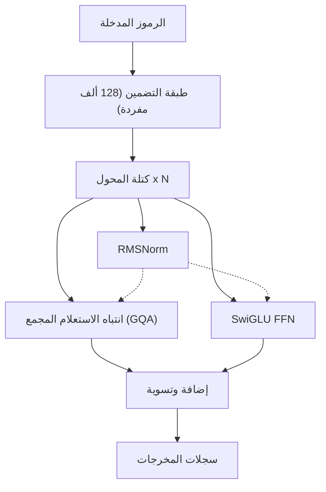
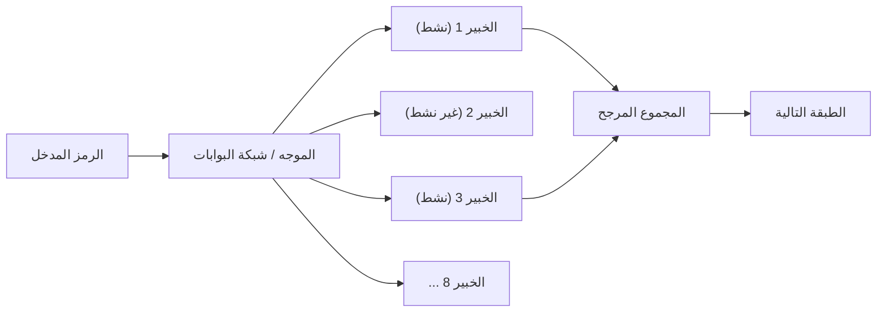
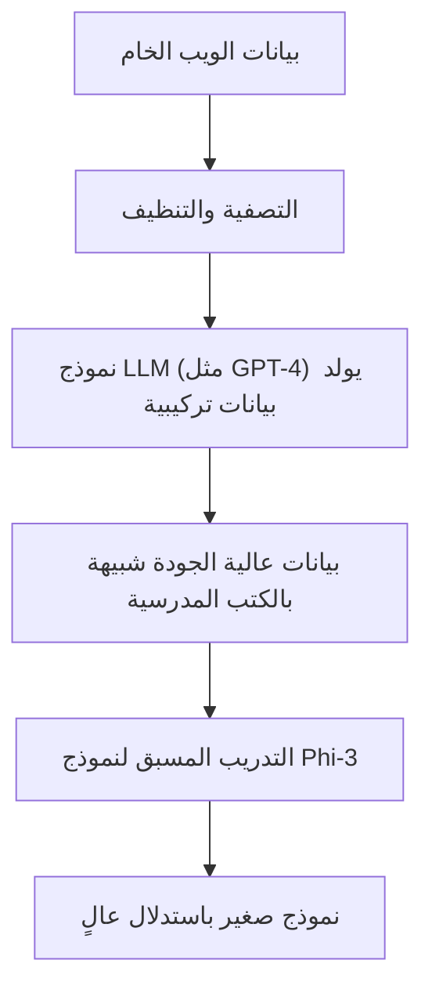
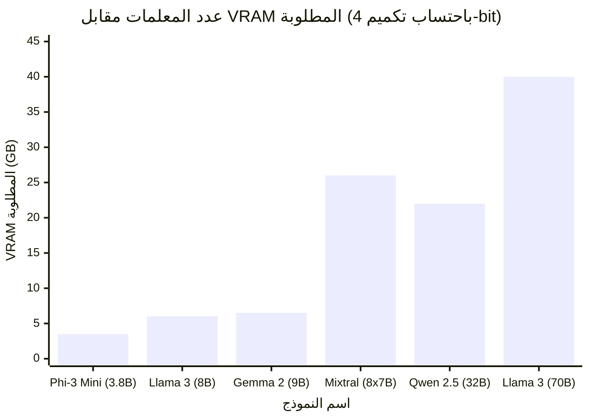

# مقدمة

في السنوات الأخيرة، كان التطور التقني للنماذج اللغوية الكبيرة (LLM) ملحوظاً، وانتشرت خدمات الذكاء الاصطناعي القائمة على السحابة مثل ChatGPT و Claude على نطاق واسع. ولكن من ناحية أخرى، تزداد الحاجة بسرعة إلى "عدم الرغبة في إرسال البيانات السرية للشركة إلى خوادم خارجية"، و"الرغبة في تقليل رسوم استخدام واجهة برمجة التطبيقات (API)"، و"بناء نظام ذكاء اصطناعي يعمل دون اتصال بالإنترنت تماماً".

تلبية لهذا الطلب تأتي "نماذج LLM المحلية (LLM مفتوحة المصدر)" التي يمكن تنزيلها وتشغيلها مباشرة على حاسوبك الشخصي أو خادم شركتك. حتى عام 2023، كان من الصعب تحقيق دقة عملية محلياً، ولكن بفضل تطور بنية النماذج وتقدم تقنية التكميم (Quantization)، أصبح من الممكن الآن تشغيل نماذج LLM عالية الأداء بسلاسة حتى على وحدات معالجة الرسومات الموجهة للمستهلكين (مثل NVIDIA RTX 3090 / 4090 أو Apple Silicon لأجهزة Mac).

في هذا المقال، سنختار "أفضل 5 نماذج نوصي بها" والتي تحظى بتقدير كبير في عام 2026 من بين العديد من نماذج LLM مفتوحة المصدر، وسنقارن ونشرح كل منها بالتفصيل من منظور تقني للغاية، بدءاً من ميزات البنية المعمارية، وعدد المعلمات، ومتطلبات الذاكرة بسبب تكميم GGUF، وصولاً إلى حالات الاستخدام المحددة.

---

# لماذا تشغيل LLM محلياً؟

يوجد العديد من المزايا الفريدة في اعتماد نماذج LLM المحلية والتي لا تتوفر في واجهات برمجة التطبيقات (APIs) السحابية.

### 1. ضمان الخصوصية والأمان التام
عند استخدام واجهات برمجة التطبيقات السحابية، يتم إرسال المطالبات والبيانات المُدخلة إلى خوادم شركات خارجية. يشكل هذا خطراً جسيماً عند التعامل مع المعلومات الشخصية أو البيانات السرية للشركات. مع نماذج LLM المحلية، تتم معالجة البيانات بالكامل داخل الجهاز، مما يقلل من خطر تسرب البيانات للخارج إلى الصفر.

### 2. تخفيض كبير في التكاليف
تعتمد واجهات برمجة التطبيقات التجارية (مثل OpenAI API) على نظام الدفع حسب الاستخدام بناءً على عدد رموز (Tokens) الإدخال والإخراج. عند معالجة كميات كبيرة من المستندات أو تشغيل روبوت محادثة باستمرار، يمكن أن تصل التكلفة إلى عشرات أو مئات الآلاف من الينات شهرياً. من ناحية أخرى، لا تتطلب نماذج LLM المحلية سوى الاستثمار الأولي في الأجهزة وتكاليف الكهرباء، ويمكن استخدامها لعدد غير محدود من المرات دون قيود على عدد الرموز.

### 3. قابلية التخصيص والاستخدام دون اتصال بالإنترنت
من السهل إجراء الضبط الدقيق (مثل LoRA) على نماذج LLM مفتوحة المصدر باستخدام مجموعة البيانات الخاصة بك. بالإضافة إلى ذلك، نظراً لأنه يمكن تشغيلها في بيئة غير متصلة بالإنترنت تماماً أو على شبكات مغلقة آمنة، فهي مثالية للتضمين في أجهزة الحافة (Edge Devices).

---

# المعرفة الأساسية لتشغيل نماذج LLM المحلية

قبل تقديم النماذج، دعونا نلخص رياضياً "متطلبات VRAM" و "التكميم (Quantization)"، وهي أمور لا يمكن تجنبها عند تشغيل نماذج LLM في بيئة محلية.

## الأساس الرياضي لذاكرة الفيديو (VRAM) والتكميم

لكي يتم استنتاج نماذج LLM على وحدة معالجة الرسومات (GPU)، يجب نشر معلمات النموذج (الأوزان) في ذاكرة الوصول العشوائي للفيديو (VRAM). يمكن تقريب متطلبات الذاكرة للنموذج $M$ باستخدام المعادلة التالية:

$$ M = \frac{P \times B}{8} + C $$

حيث،
- $M$: سعة الذاكرة المطلوبة (بجيجابايت)
- $P$: عدد المعلمات (بالمليار = 10^9)
- $B$: عدد البتات لكل معلمة (16 بت لـ FP16، و 4 بت لتكميم 4-bit)
- $C$: سياق النافذة (ذاكرة التخزين المؤقت KV) أو العبء الإضافي أثناء الاستنتاج (يُقدر عادةً بحوالي 20٪ إلى 30٪ من حجم النموذج)

على سبيل المثال، عند تشغيل نموذج يحتوي على 8 مليار (8B) معلمة بتنسيق النقطة العائمة ذو 16 بت (FP16):

$$ M_{FP16} = \frac{8 \times 16}{8} = 16 \text{ GB} $$

بالإضافة إلى الأخذ في الاعتبار ذاكرة التخزين المؤقت KV وما إلى ذلك، ستحتاج إلى ما يقرب من 18 جيجابايت إلى 20 جيجابايت من VRAM، مما يجعل من الصعب تشغيله على أجهزة الكمبيوتر المخصصة للألعاب العادية.

### ظهور تنسيق GGUF

هنا يأتي دور "التكميم (Quantization)". إنها تقنية لتقليل دقة المعلمات من FP16 إلى 8-bit أو 4-bit، أو في حالات استثنائية إلى 2-bit، مما يقلل بشكل كبير من مقدار الذاكرة المطلوبة مع تقليل تدهور أداء النموذج إلى الحد الأدنى.

التنسيق الأكثر شيوعاً حالياً هو **GGUF (GPT-Generated Unified Format)**، الذي ابتكره Georgi Gerganov (مطور llama.cpp). تنسيق GGUF هو تنسيق ثنائي مصمم لإجراء الاستدلال بكفاءة على كل من وحدة المعالجة المركزية (CPU) ووحدة معالجة الرسومات (GPU)، ويتميز بتوافقه الكبير جداً مع بنية الذاكرة الموحدة (Unified Memory) لأجهزة Mac (Apple Silicon).

إذا تم تكميم نموذج 8B إلى 4-bit (مثل: Q4_K_M)، فسيكون حساب الذاكرة كالتالي:

$$ M_{4bit} = \frac{8 \times 4.5}{8} = 4.5 \text{ GB} $$

*نظراً لأن Q4_K_M يحتفظ بدقة أعلى لبعض الأوزان، فإن العدد الفعلي للبتات يبلغ حوالي 4.5 بت.

بفضل هذا، حتى وحدات معالجة الرسومات من الفئة الابتدائية التي تحتوي على 8 جيجابايت فقط من ذاكرة VRAM أو أجهزة الكمبيوتر المحمولة العادية، يمكنها تشغيل نماذج LLM القوية من فئة 8B بسلاسة محلياً.

---

# أفضل 5 نماذج LLM محلية موصى بها

الآن، سنقدم لكم 5 نماذج LLM مفتوحة المصدر تحظى حالياً بدعم كبير من المطورين وباحثي الذكاء الاصطناعي حول العالم.

## 1. Llama 3 (Meta)

قامت شركة Meta بتطوير سلسلة "Llama 3"، والتي أصبحت فعلياً المعيار الصناعي (De facto standard) لنماذج LLM مفتوحة المصدر.

### تطور البنية المعمارية وميزاتها

تتبنى سلسلة Llama 3 بنية Transformer القياسية، ولكن مع إضافة العديد من التحسينات التقنية عن الجيل السابق (Llama 2). يجب الانتباه بشكل خاص للنقاط التالية:

- **الاعتماد القياسي لـ GQA (Grouped Query Attention)**: تقنية GQA التي كانت تُستخدم فقط في النماذج الكبيرة في Llama 2، أصبحت مُستخدمة الآن في النماذج الصغيرة مثل 8B في Llama 3. أدى هذا إلى تقليل استخدام ذاكرة التخزين المؤقت KV بشكل كبير، مما أتاح استدلالاً سريعاً حتى مع السياقات الطويلة.
- **توسيع حجم المفردات**: تم توسيع حجم مفردات المجزئ (Tokenizer) (المبني على Tiktoken) إلى 128,000 رمز (Token)، مما أدى إلى تحسين كفاءة ضغط اللغات المتعددة والأكواد البرمجية بشكل كبير. كما أصبحت كفاءة معالجة اللغة اليابانية أفضل بعدة مرات مقارنة بـ Llama 2.



### حجم المعلمات وحالات الاستخدام

- **Llama 3 8B**: يحتوي على 8 مليارات معلمة. يعمل بحوالي 5 جيجابايت من الذاكرة مع تكميم 4-bit. يتميز باستجابة سريعة جداً، وهو مثالي ليكون مساعداً شخصياً على الكمبيوتر الشخصي أو كنواة لنظام RAG (الاسترجاع المعزز بالتوليد) المحلي.
- **Llama 3 70B**: يحتوي على 70 مليار معلمة. يتطلب حوالي 40 جيجابايت من VRAM (أو الذاكرة الموحدة لـ Apple Silicon) مع تكميم 4-bit. يتمتع بأداء يضاهي GPT-4 السحابي، وهو فعال في الاستدلال المتقدم، والبرمجة المعقدة، وتحليل البيانات.

تتميز Llama 3 بأقوى دعم من المجتمع، وميزة القدرة على استخدام كافة تنسيقات التكميم مثل GGUF، AWQ، و EXL2 فوراً.

---

## 2. Mistral / Mixtral (Mistral AI)

صدمت النماذج التي تقدمها "Mistral AI"، وهي شركة فرنسية ناشئة في مجال الذكاء الاصطناعي، الصناعة بكفاءتها وبنيتها المعمارية التي أحدثت تحولاً نموذجياً.

### آلية MoE (Mixture of Experts)

كان نموذج "Mixtral 8x7B" أول نموذج LLM مفتوح المصدر يتبنى بنية **MoE (Mixture of Experts)** على نطاق واسع، وحقق نجاحاً كبيراً.
MoE هي آلية تتيح للنموذج بأكمله (حوالي 47 مليار معلمة) الحصول على 8 "شبكات خبراء"، واختيار (توجيه) خبيرين فقط بشكل ديناميكي لكل رمز مُدخل.



الميزة الأكبر لهذه البنية هي أن "عدد المعلمات ضخم، لكن المعلمات التي يتم حسابها أثناء الاستدلال (المعلمات النشطة) قليلة". في حالة Mixtral 8x7B، ما يتم تنشيطه أثناء الاستدلال يعادل فقط 13B. وبهذا، يحافظ النموذج على أداء عالٍ يضاهي فئة 70B بينما يزيد من سرعة الاستدلال بشكل هائل.

### الأداء وحالات الاستخدام

- **Mistral 7B / Mistral Nemo (12B)**: نموذج Dense منفرد. خفيف جداً ويتمتع بحرية الاستخدام التجاري بموجب ترخيص Apache 2.0. يحقق نتائج مبهرة تتفوق على النماذج الأخرى من نفس الحجم في مهام البرمجة والتلخيص.
- **Mixtral 8x7B / 8x22B**: نماذج MoE متقدمة. على الرغم من أن متطلبات VRAM عالية (لأن النموذج بأكمله يجب أن يُحمّل في الذاكرة، ويبلغ حوالي 26 جيجابايت بتكميم 4-bit لنموذج 8x7B)، إلا أن سرعة الاستدلال السريعة تجعله مناسباً جداً لإنشاء خوادم محلية على بيئات أجهزة Mac مثل M2/M3 Max.

---

## 3. Gemma 2 (Google)

سلسلة "Gemma" هي نماذج مفتوحة المصدر طورتها Google باستخدام تقنية نموذجها المتطور "Gemini". كجيل ثانٍ، أحدثت Gemma 2 تغييرات كبيرة في بنيتها المعمارية.

### تصميم معماري فريد

تتبنى Gemma 2 بعض التصميمات الفريدة التي تميزها عن نماذج LLM الأخرى:

- **الحد المرن للسجلات (Logit Soft-capping)**: تقنية تمنع توليد قيم سجلات (Logits) كبيرة بشكل غير طبيعي، مما يعزز استقرار التعلم والاستدلال.
- **نهج هجين بين الاهتمام بالنافذة المنزلقة (SWA) والاهتمام المحلي**: بدلاً من إجراء الانتباه الكامل في جميع الطبقات، فإنه يبدل بين الطبقات التي تنظر فقط إلى السياق المحلي وتلك التي تنظر إلى السياق بأكمله.

التقليل في العمليات الحسابية في SWA يمكن إثباته رياضياً كما يلي: مقارنةً بالتعقيد الحسابي للاهتمام الذاتي المعتاد $O(N^2)$، يكون التعقيد الحسابي لـ SWA مع حجم نافذة $W$ كالتالي:

$$ \text{Complexity}_{SWA} = O(N \times W) $$

حيث $N$ هو طول التسلسل، و $W$ هو حجم النافذة الثابت. كلما زاد $N$ (عند إدخال نص طويل)، كان تأثير SWA في توفير الموارد الحسابية هائلاً.

### الأداء وحالات الاستخدام

- **Gemma 2 2B / 9B**: يتوفر بنموذج 2B الذي يعمل حتى على الموارد المحدودة للغاية مثل الهواتف الذكية و Raspberry Pi، ونموذج 9B المخصص لأجهزة الكمبيوتر العادية. نموذج 9B بالتحديد يحقق نتائج تتفوق في العديد من المهام على Llama 3 8B، وهو يُعتبر حالياً من أقوى النماذج التي تقل عن 10B.
- **Gemma 2 27B**: يحتوي على 27 مليار معلمة. يتميز بـ "حجم مثالي" يتناسب تماماً مع ذاكرة VRAM بسعة 24 جيجابايت (مثل RTX 3090 / 4090) باستخدام تكميم 4-bit أو 6-bit. قوي في البرمجة وتوجيه التعليمات المعقدة، ويحظى بشعبية كبيرة بين المتحمسين (Enthusiasts).

---

## 4. Qwen 2.5 (Alibaba Cloud)

سلسلة Qwen التي طورتها شركة Alibaba Cloud هي نماذج تفتخر بأداء عالمي متميز، وخاصة في معالجة اللغات المتعددة، والبرمجة، والاستدلال الرياضي.

### دعم اللغات المتعددة وقدرات البرمجة

تم تدريب Qwen 2.5 مسبقاً على مجموعة ضخمة من النصوص متعددة اللغات، ويحظى **بتقييم عالٍ جداً في المخرجات الطبيعية للغة اليابانية**، ناهيك عن الإنجليزية والصينية. بالنسبة للمستخدمين، الميزة الأكبر هي "أنه لا ينتج نصوصاً يابانية غير طبيعية تبدو وكأنها مترجمة آلياً".
كما يوجد نموذج "Qwen 2.5 Coder" المُتخصص في مهارات البرمجة، وتتزايد حالات استخدامه كبديل محلي لـ GitHub Copilot عبر ربطه بإضافات VSCode (مثل إضافة Continue).

### البنية المعمارية وحالات الاستخدام

- **تضمينات الكلمات المرتبطة (Tie Word Embeddings)**: يتبنى آلية تقوم بمشاركة (Tie) أوزان طبقة التضمين (Embedding) المدخلة وطبقة المخرجات، مما يوفر في عدد المعلمات بينما يسمح بالتعلم الفعال.
- **توسيع RoPE (التضمين الموضعي الدوار)**: يدعم سياق نافذة ضخماً يصل إلى 128 ألف رمز، مما يتيح قراءة ملفات PDF الضخمة، أو تحليل كامل للكود المصدري الذي يصل إلى عشرات الآلاف من الأسطر محلياً.

تتراوح أحجام النماذج بشكل دقيق للغاية من 0.5B, 1.5B, 3B, 7B, 14B, 32B، إلى 72B، والقدرة على اختيار الحجم الذي يدفع بمواصفات أجهزتك (سعة VRAM) إلى أقصى حدودها هي نقطة جذب رئيسية لـ Qwen.

---

## 5. Phi-3 / Phi-3.5 (Microsoft)

وُلدت سلسلة Phi من نموذج أطلقته Microsoft وهو "الكتاب المدرسي هو كل ما تحتاجه (Textbook is all you need)".

### ثورة النماذج اللغوية الصغيرة (SLM)

في السنوات الأخيرة، كان الاتجاه السائد في تطوير LLM هو نهج القوة الغاشمة بـ "زيادة عدد المعلمات وكمية البيانات بأي ثمن"، ولكن Microsoft أثبتت أنه "إذا تم رفع جودة البيانات المُغذّاة للنموذج إلى أقصى حد (بيانات الكتب المدرسية عالية الجودة والبيانات التركيبية)، فيمكن للنموذج حتى مع عدد صغير من المعلمات أن يمتلك ذكاءً بمستوى GPT-3.5".
لا يُطلق على Phi-3 اسم LLM (نموذج لغوي كبير)، بل يُشار إليه كـ **SLM (نموذج لغوي صغير)**.



### الأداء وحالات الاستخدام

- **Phi-3 Mini (3.8B)**: نموذج مصمم ليعمل محلياً (Natively) على الهواتف الذكية (باستخدام تقنيات مثل ONNX Runtime). بالرغم من أنه يحتوي على أقل من 4 مليارات معلمة، إلا أن قدراته على الاستدلال والتفكير المنطقي عالية بشكل مدهش، ويمكنه إكمال مهام الإجابة على الأسئلة البسيطة وتنسيق النصوص في لمح البصر.
- **Phi-3.5 Vision / MoE**: تم أيضاً إصدار نماذج Vision قادرة على التعرف على الصور، ونسخة MoE.

في مجال تطبيقات الذكاء الاصطناعي المحلية على أجهزة الحافة، أو تضمينها في تطبيقات الهواتف المحمولة، أو كوكيل (Agent) فائق الخفة يعمل باستمرار في الخلفية، تعتبر سلسلة Phi-3 بلا منازع.

---

# المقارنة التقنية والمعايير (Benchmarks) للنماذج

دعونا الآن نقارن بشكل كمّي "متطلبات VRAM" و "سرعة الاستدلال" عند تشغيل النماذج المذكورة في بيئة محلية.

## العلاقة بين عدد المعلمات ومتطلبات VRAM (عند استخدام تكميم GGUF 4-bit)

يوضح الرسم البياني أدناه متطلبات VRAM التقديرية (بما في ذلك العبء الإضافي لذاكرة التخزين المؤقت KV) المطلوبة أثناء الاستدلال مقابل عدد معلمات كل نموذج.



*يستهلك Mixtral 8x7B الكثير من VRAM لأن إجمالي المعلمات كبير، لكن نظراً لأن العمليات الحسابية نفسها خفيفة، فإن الحمل على موارد الحوسبة في GPU (مثل نوى CUDA) يكون منخفضاً.

## الحساب النظري لسرعة الاستدلال (Tokens/sec)

تعتمد سرعة الاستدلال لـ LLM المحلي بشكل كبير على "عرض النطاق الترددي للذاكرة (Memory Bandwidth)" لـ GPU. خلال مرحلة التوليد (فك التشفير Decoding)، يجب قراءة جميع أوزان النموذج من الذاكرة لكل رمز (Token) يتم توليده. لذلك تعتبر العملية مقيدة بالذاكرة (Memory-bound) وليس مقيدة بالحساب (Compute-bound).

الحد الأقصى النظري لسرعة الاستدلال $T$ (الرموز/ثانية) يُحسب بالمعادلة التالية:

$$ T = \frac{\text{BW}}{M_{\text{weights}}} $$

حيث،
- $\text{BW}$: عرض النطاق الترددي الفعلي لذاكرة GPU (بـ GB/s)
- $M_{\text{weights}}$: حجم النموذج المحمّل (بـ GB)

على سبيل المثال، عند تشغيل إصدار 4-bit من Llama 3 8B (حوالي 4.5 جيجابايت) على NVIDIA RTX 4090 (بعرض نطاق ترددي للذاكرة يبلغ 1008 جيجابايت/ثانية). بفرض أن النطاق الترددي الفعلي يبلغ حوالي 80% من القيمة النظرية (حوالي 800 جيجابايت/ثانية):

$$ T \approx \frac{800}{4.5} \approx 177 \text{ Tokens/sec} $$

هذه سرعة هائلة تتجاوز بكثير سرعة القراءة البشرية. من ناحية أخرى، إذا قمنا بتشغيل Llama 3 70B (إصدار 4-bit، حوالي 40 جيجابايت *بفرض تقسيمه على وحدتي GPU وغيرها من السيناريوهات) على نفس جهاز RTX 4090، ستستقر سرعة توليد الرموز عند حوالي 20 Tokens/sec. بهذه الطريقة، يمكن التنبؤ رياضياً مُسبقاً بـ "السرعة التي سيتم بها توليد المخرجات" استناداً إلى مواصفات حاسوبك الشخصي.

---

# أدوات لتشغيل نماذج LLM المحلية

يوجد حالياً نظام بيئي قوي من البرمجيات المتاحة لتشغيل نماذج LLM مفتوحة المصدر القوية هذه في بيئة محلية. سنعرض ثلاث من أبرز الأدوات.

### 1. Ollama
إنها الأداة الأسهل والأكثر شعبية حالياً. مثل Docker، يتيح لك تنزيل النماذج وتشغيلها بأمر واحد. يدعم أنظمة Mac و Windows و Linux.
بمجرد فتح الجهاز الطرفي (Terminal) وكتابة الأمر التالي، سيبدأ تشغيل Llama 3:

```bash
ollama run llama3
```
كما أن Ollama يعمل كخادم REST API في الخلفية، مما يجعل دمجه مع نصوص Python البرمجية والتطبيقات الخارجية أمراً سهلاً للغاية.

### 2. LM Studio
تطبيق مُوصى به لأولئك الذين يفضلون واجهة مستخدم رسومية (GUI) وبديهية. يتيح لك البحث عن مجموعة ضخمة من نماذج GGUF من Hugging Face وتنزيلها من داخل التطبيق، والاستمتاع بالمحادثات عبر واجهة تشبه ChatGPT. يتميز بخاصية مفيدة جداً تخبرك بصرياً بالنموذج الذي يتناسب مع ذاكرة RAM/VRAM الخاصة بحاسوبك.

### 3. llama.cpp
هذه هي المكتبة التي أطلقت شرارة ازدهار LLM المحلي وتشكل الأساس لكل شيء، وهي مكتوبة بلغة C/C++. مخصصة للمهندسين الذين يرغبون في تحسين الأداء إلى أقصى حد، وللمخترقين (Hackers) الذين يرغبون في دمجها في نصوصهم البرمجية الخاصة. تستخرج الإمكانات الكاملة لأي أجهزة، بدءاً من Metal لأجهزة Apple، و CUDA لـ NVIDIA، و ROCm لـ AMD، وصولاً إلى مجموعة تعليمات AVX لـ Intel.

---

# الخاتمة والآفاق المستقبلية

في هذا المقال، قدمنا 5 من أفضل نماذج LLM المحلية ومفتوحة المصدر لعام 2026، وشرحنا بنيتها المعمارية وخلفيتها التقنية. يمكن تلخيص كيفية اختيار النموذج بناءً على الغرض كالتالي:

1. **إذا كنت تقدر التوازن الشامل والنظام البيئي**: `Llama 3 (8B / 70B)`
2. **إذا كنت ترغب في استدلال سريع في بيئة ذات ذاكرة موحدة بسعة كبيرة مثل أجهزة Mac**: `Mixtral 8x7B`
3. **إذا كنت ترغب في تحقيق أقصى قدر من الذكاء باستخدام VRAM بسعة 24 جيجابايت**: `Gemma 2 27B` أو `Qwen 2.5 32B`
4. **إذا كان هدفك هو إخراج لغة يابانية طبيعية ومساعدة متقدمة في البرمجة**: `Qwen 2.5`
5. **إذا كنت ترغب في معالجة خفيفة جداً على الهواتف الذكية أو الحواسيب الضعيفة أو في الخلفية**: `Phi-3 / Phi-3.5`

وتيرة تطور نماذج LLM مفتوحة المصدر مذهلة، ويتم الإعلان عن اختراقات تقنية تقلب المفاهيم السابقة كل بضعة أشهر. في المستقبل، مع المزيد من التحسينات في تقنية التكميم وظهور بنى معمارية جديدة، قد يأتي اليوم الذي تتفوق فيه النماذج المحلية على الذكاء الاصطناعي السحابي.
نرجو منك تنزيل النموذج الأمثل الذي يتناسب مع بيئة أجهزتك، وتجربة الحرية والإمكانيات الهائلة التي يوفرها الذكاء الاصطناعي المحلي.
