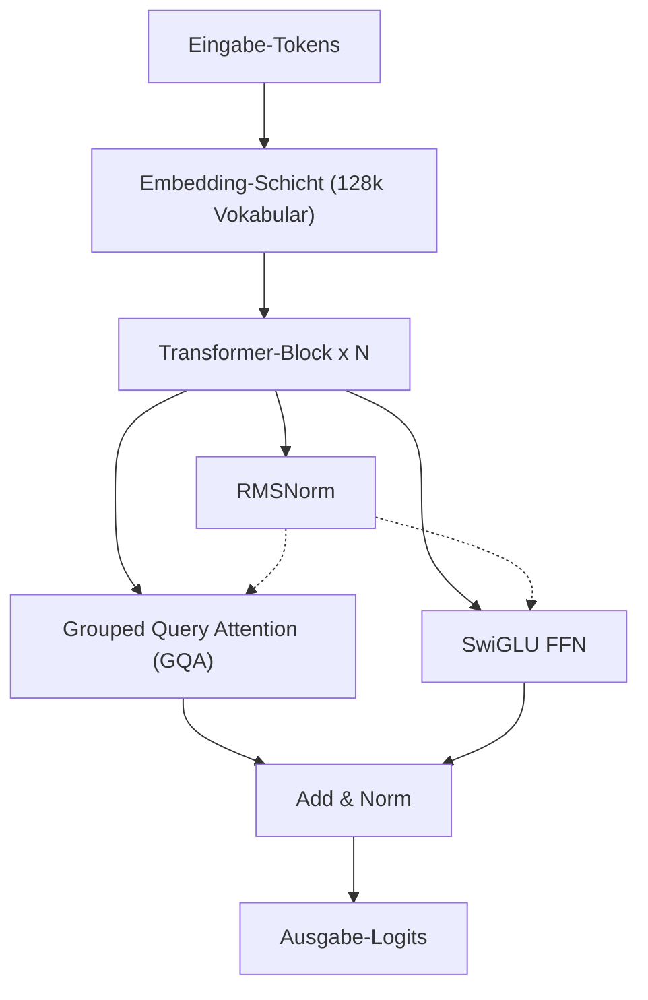
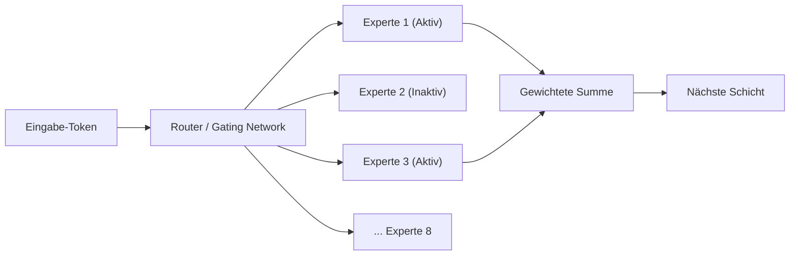
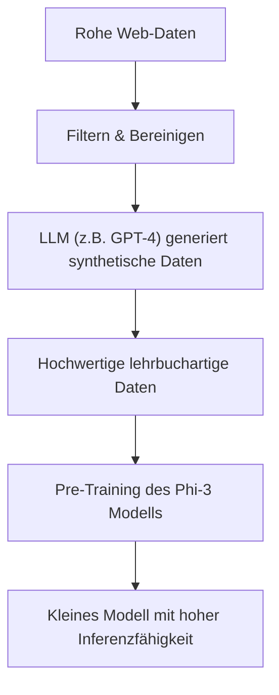
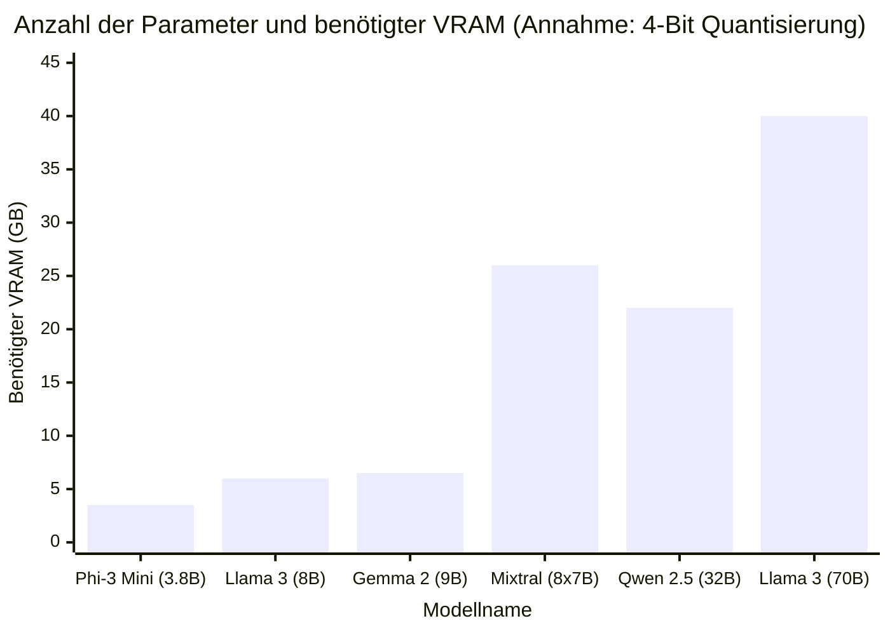

# Einführung

In den letzten Jahren war die technologische Entwicklung von Large Language Models (LLMs) bemerkenswert, und Cloud-basierte KI-Dienste wie ChatGPT und Claude sind weit verbreitet. Gleichzeitig steigt jedoch rapide der Bedarf, "vertrauliche Unternehmensdaten nicht an externe Server senden zu wollen", "API-Nutzungskosten senken zu wollen" und "ein vollständig offline funktionierendes KI-System aufbauen zu wollen".

Diese Anforderungen werden von "lokalen LLMs (Open-Source-LLMs)" erfüllt, die direkt auf den eigenen PC oder Unternehmensserver heruntergeladen und ausgeführt werden können. Bis etwa 2023 war es schwierig, lokal eine praktikable Genauigkeit zu erreichen, aber durch die Weiterentwicklung der Modellarchitekturen und Fortschritte in der Quantisierungstechnologie (Quantization) ist es heute möglich, selbst auf Consumer-GPUs (wie NVIDIA RTX 3090 / 4090 oder Apples Apple Silicon im Mac) sehr leistungsstarke LLMs flüssig auszuführen.

In diesem Artikel wählen wir aus der Vielzahl von Open-Source-LLMs die "Top 5 der empfohlenen Modelle" aus, die ab 2026 als besonders herausragend bewertet werden. Wir werden die architektonischen Merkmale, die Anzahl der Parameter, die Speicheranforderungen aufgrund von GGUF-Quantisierung und konkrete Anwendungsfälle aus einer äußerst detaillierten und technischen Perspektive gründlich vergleichen und erläutern.

---

# Warum LLMs lokal ausführen?

Die Einführung von lokalen LLMs bietet viele einzigartige Vorteile, die Cloud-basierte APIs nicht haben.

### 1. Gewährleistung vollständiger Privatsphäre und Sicherheit
Bei der Nutzung einer Cloud-API werden die eingegebenen Prompts und Daten an die Server externer Unternehmen gesendet. Dies stellt ein erhebliches Risiko dar, wenn persönliche Informationen oder vertrauliche Unternehmensdaten verarbeitet werden. Bei einem lokalen LLM werden die Daten vollständig auf dem Endgerät verarbeitet, wodurch das Risiko von Datenlecks nach außen auf null reduziert werden kann.

### 2. Erhebliche Kostensenkung
Kommerzielle APIs (wie die OpenAI API) basieren auf einem nutzungsabhängigen Preismodell entsprechend der Anzahl der Eingabe- und Ausgabe-Token. Die Verarbeitung großer Dokumentenmengen oder der ständige Betrieb von Chatbots kann monatliche Kosten von Tausenden bis Zehntausenden von Euro verursachen. Mit einem lokalen LLM hingegen fallen nur die anfänglichen Hardware-Investitionen und die Stromkosten an, und es kann unbegrenzt oft und ohne Token-Limit genutzt werden.

### 3. Anpassbarkeit und Offline-Nutzung
Open-Source-LLMs können leicht mit eigenen Datensätzen feinabgestimmt (Fine-Tuning, z.B. LoRA) werden. Darüber hinaus können sie in vollständig netzunabhängigen Offline-Umgebungen oder sicheren geschlossenen Netzwerken betrieben werden, was sie ideal für die Integration in Edge-Geräte macht.

---

# Grundwissen zur Ausführung lokaler LLMs

Bevor wir die Modelle vorstellen, sollten wir die "VRAM-Anforderungen" und "Quantisierung (Quantization)", die beim Ausführen von LLMs in einer lokalen Umgebung unumgänglich sind, mathematisch klären.

## Mathematische Grundlagen von VRAM (Videospeicher) und Quantisierung

Um ein LLM auf einer GPU zur Inferenz auszuführen, müssen die Parameter (Gewichte) des Modells im VRAM bereitgestellt werden. Der Speicherbedarf $M$ eines Modells kann durch folgende Formel angenähert werden:

$$ M = \frac{P \times B}{8} + C $$

Hierbei ist:
- $M$: Benötigte Speicherkapazität (GB)
- $P$: Anzahl der Parameter (Billion = Milliarden)
- $B$: Anzahl der Bits pro Parameter (16 Bit für FP16, 4 Bit für 4-Bit-Quantisierung)
- $C$: Kontextfenster (KV-Cache) und Overhead bei der Inferenz (normalerweise geht man von etwa 20% bis 30% der Modellgröße aus)

Wenn beispielsweise ein Modell mit 8 Milliarden (8B) Parametern mit 16-Bit-Gleitkommazahlen (FP16) ausgeführt wird, ergibt sich:

$$ M_{FP16} = \frac{8 \times 16}{8} = 16 \text{ GB} $$

Wenn man zusätzlich den KV-Cache und anderes berücksichtigt, werden fast 18 GB bis 20 GB VRAM benötigt, was den Betrieb auf einem typischen Gaming-PC erschwert.

### Der Aufstieg des GGUF-Formats

Hier kommt die "Quantisierung (Quantization)" ins Spiel. Durch die Reduzierung der Genauigkeit der Parameter von FP16 auf 8-Bit, 4-Bit oder im Extremfall 2-Bit kann der benötigte Speicherplatz drastisch reduziert werden, während die Leistungsverschlechterung des Modells auf ein Minimum beschränkt bleibt.

Das derzeit am weitesten verbreitete Format ist **GGUF (GPT-Generated Unified Format)**, das von Georgi Gerganov (dem Entwickler von llama.cpp) entworfen wurde. GGUF ist ein Binärformat für effiziente Inferenz sowohl auf CPU als auch auf GPU und zeichnet sich durch eine besonders gute Kompatibilität mit der Unified Memory-Architektur von Macs (Apple Silicon) aus.

Die Speicherberechnung bei der Quantisierung eines 8B-Modells auf 4-Bit (z. B. Q4_K_M) sieht wie folgt aus:

$$ M_{4bit} = \frac{8 \times 4.5}{8} = 4.5 \text{ GB} $$

*Da Q4_K_M für einige Gewichte eine höhere Genauigkeit beibehält, beträgt die effektive Bitrate etwa 4,5 Bit.

Dadurch wird es möglich, selbst auf Einstiegs-GPUs mit nur 8 GB VRAM oder auf Standard-Laptops leistungsstarke LLMs der 8B-Klasse lokal flüssig auszuführen.

---

# Top 5 empfohlene lokale LLM-Modelle

Nun stellen wir 5 Open-Source-LLMs vor, die derzeit hohe Anerkennung von Entwicklern und KI-Forschern weltweit genießen.

## 1. Llama 3 (Meta)

Die von Meta entwickelte "Llama 3"-Serie ist der De-facto-Standard unter den Open-Source-LLMs.

### Entwicklung und Merkmale der Architektur

Llama 3 übernimmt die Standard-Transformer-Architektur, beinhaltet jedoch zahlreiche technische Verbesserungen gegenüber der Vorgängergeneration (Llama 2). Besonders bemerkenswert sind folgende Punkte:

- **Standardmäßige Einführung von GQA (Grouped Query Attention)**: GQA, das bei Llama 2 nur in großen Modellen verwendet wurde, wird bei Llama 3 auch in kleineren Modellen wie 8B eingesetzt. Dies reduziert den Speicherverbrauch des KV-Caches drastisch und ermöglicht eine schnelle Inferenz auch bei langen Kontexten.
- **Erweiterung der Vokabulargröße**: Die Vokabulargröße des Tokenizers (Tiktoken-basiert) wurde auf 128.000 Token erweitert, was die Kompressionseffizienz für mehrere Sprachen und Programmcode dramatisch verbessert. Die Effizienz der japanischen Verarbeitung ist im Vergleich zu Llama 2 ebenfalls um ein Vielfaches besser geworden.



### Parametergrößen und Anwendungsfälle

- **Llama 3 8B**: 8 Milliarden Parameter. Läuft mit 4-Bit-Quantisierung bei ca. 5 GB Speicher. Reagiert extrem schnell und eignet sich ideal als persönlicher Assistent auf dem PC oder als Kern eines lokalen RAG-Systems (Retrieval-Augmented Generation).
- **Llama 3 70B**: 70 Milliarden Parameter. Benötigt mit 4-Bit-Quantisierung ca. 40 GB VRAM (oder Unified Memory bei Apple Silicon). Es bietet eine Leistung, die dem Cloud-basierten GPT-4 nahekommt, und ist hervorragend für fortgeschrittenes logisches Denken, komplexe Programmierung, Datenanalyse usw. geeignet.

Llama 3 hat die stärkste Community-Unterstützung, und ein weiterer Vorteil ist, dass alle Quantisierungsformate wie GGUF, AWQ und EXL2 sofort verfügbar sind.

---

## 2. Mistral / Mixtral (Mistral AI)

Die Modelle des französischen KI-Startups "Mistral AI" schockierten die Branche mit ihrer Effizienz und ihrer einen Paradigmenwechsel herbeiführenden Architektur.

### Mechanismus von MoE (Mixture of Experts)

"Mixtral 8x7B" war das erste Open-Source-LLM, das die **MoE (Mixture of Experts)**-Architektur in großem Maßstab einsetzte und damit großen Erfolg hatte.
MoE ist ein Mechanismus, bei dem das gesamte Modell (etwa 47 Milliarden Parameter) in 8 "Experten (Expert)-Netzwerke" unterteilt ist, und für jedes eingegebene Token dynamisch nur die zwei optimalen Experten ausgewählt (geroutet) werden.



Der größte Vorteil dieser Architektur liegt darin, dass "obwohl die Anzahl der Parameter riesig ist, die während der Inferenz berechneten Parameter (Active Parameters) gering sind". Bei Mixtral 8x7B sind während der Inferenz nur etwa 13 Milliarden Parameter aktiv. Dadurch wird die Inferenzgeschwindigkeit dramatisch erhöht, während eine hohe Leistung der 70B-Klasse beibehalten wird.

### Leistung und Anwendungsfälle

- **Mistral 7B / Mistral Nemo (12B)**: Einzelne Dense-Modelle. Sehr leichtgewichtig und unter der Apache 2.0-Lizenz frei für kommerzielle Nutzung. Bei Programmier- und Zusammenfassungsaufgaben liefern sie Benchmark-Ergebnisse, die andere Modelle gleicher Größe übertreffen.
- **Mixtral 8x7B / 8x22B**: Fortschrittliche MoE-Modelle. Die VRAM-Anforderungen sind hoch (da das gesamte Modell in den Speicher geladen werden muss, ca. 26 GB bei 4-Bit für 8x7B), aber aufgrund der schnellen Inferenzgeschwindigkeit eignen sie sich sehr gut für den Aufbau lokaler Server auf Mac-Umgebungen wie M2/M3 Max.

---

## 3. Gemma 2 (Google)

Die "Gemma"-Serie besteht aus offenen Modellen, die Google unter Nutzung der Technologie seines modernsten "Gemini"-Modells entwickelt hat. Gemma 2 ist die zweite Generation und bringt bedeutende architektonische Änderungen mit sich.

### Einzigartiges Architekturdesign

Gemma 2 verwendet einige einzigartige Designs, die es von anderen LLMs abheben.

- **Logit Soft-capping**: Eine Technologie, die verhindert, dass ungewöhnlich große Logit-Werte generiert werden, und so die Stabilität von Training und Inferenz erhöht.
- **Hybrid aus Sliding Window Attention (SWA) und Local Attention**: Anstatt in allen Schichten Full Attention durchzuführen, wechseln sich Schichten, die nur den lokalen Kontext betrachten, mit Schichten ab, die den gesamten Kontext betrachten.

Die Reduzierung des Rechenaufwands in SWA lässt sich mathematisch wie folgt darstellen. Im Gegensatz zur normalen Self-Attention-Komplexität $O(N^2)$ beträgt die Komplexität der SWA mit der Fenstergröße $W$:

$$ \text{Complexity}_{SWA} = O(N \times W) $$

Dabei ist $N$ die Sequenzlänge und $W$ eine feste Fenstergröße. Je größer $N$ wird (also je länger der eingegebene Text ist), desto immenser ist die Einsparung an Rechenressourcen durch SWA.

### Leistung und Anwendungsfälle

- **Gemma 2 2B / 9B**: Das 2B-Modell läuft sogar auf ressourcenbeschränkten Umgebungen wie Smartphones oder Raspberry Pi, während das 9B-Modell für Standard-PCs gedacht ist. Insbesondere das 9B-Modell übertrifft in vielen Aufgaben die Benchmark-Ergebnisse des Llama 3 8B und gehört derzeit zu den stärksten Modellen unter 10 Milliarden Parametern.
- **Gemma 2 27B**: 27 Milliarden Parameter. Das Hauptmerkmal ist die "perfekte Größe", die mit 4-Bit- oder 6-Bit-Quantisierung genau in 24 GB VRAM (RTX 3090 / 4090 etc.) passt. Es ist sehr stark bei der Programmierung und komplexen Anweisungen und bei Enthusiasten sehr beliebt.

---

## 4. Qwen 2.5 (Alibaba Cloud)

Die von Alibaba Cloud entwickelte Qwen-Serie bietet weltweite Spitzenleistung, insbesondere bei der mehrsprachigen Verarbeitung, beim Programmieren und beim mathematischen Denken.

### Mehrsprachigkeit und Programmierfähigkeit

Qwen 2.5 wurde mit umfangreichen mehrsprachigen Korpora vortrainiert und wird nicht nur für Englisch und Chinesisch, sondern **insbesondere für die natürliche Ausgabe von Japanisch hoch bewertet**. Für japanische Nutzer ist der größte Vorteil, dass "es nicht wie unnatürliches, übersetztes Japanisch klingt".
Es gibt auch das Modell "Qwen 2.5 Coder", das auf Programmierfähigkeiten spezialisiert ist, und die Anwendungsfälle nehmen rasant zu, in denen es in Kombination mit VSCode-Erweiterungen (wie Continue) als lokale Alternative zu GitHub Copilot verwendet wird.

### Architektur und Anwendungsfälle

- **Tie Word Embeddings**: Durch die gemeinsame Nutzung (Tie) der Gewichte der Eingabe-Embedding-Schicht und der Ausgabeschicht wird ein Mechanismus angewandt, der Parameter einspart und gleichzeitig effizient lernt.
- **Erweiterung von RoPE (Rotary Position Embedding)**: Es unterstützt ein riesiges Kontextfenster von bis zu 128.000 Token, was das lokale Lesen riesiger PDFs oder die vollständige Analyse von Quellcode mit Zehntausenden von Zeilen ermöglicht.

Die Modellgrößen sind sehr fein gestaffelt (0.5B, 1.5B, 3B, 7B, 14B, 32B, 72B), was den Reiz von Qwen ausmacht, da man genau die Größe wählen kann, die bis an die Grenzen der eigenen Hardware-Spezifikationen (VRAM-Kapazität) geht.

---

## 5. Phi-3 / Phi-3.5 (Microsoft)

Die Phi-Serie ist aus dem von Microsoft propagierten Paradigma "Textbook is all you need" (Das Lehrbuch ist alles, was man braucht) hervorgegangen.

### Revolution der SLMs (Small Language Models)

Während die jüngste LLM-Entwicklung von der brachialen Methode geprägt war, "einfach die Anzahl der Parameter und der Daten zu erhöhen", hat Microsoft bewiesen, dass "wenn man die Qualität der dem Modell zur Verfügung gestellten Daten (hochwertige Lehrbuchdaten und synthetische Daten) aufs Äußerste erhöht, ein Modell selbst mit einer kleinen Anzahl von Parametern eine Intelligenz auf dem Niveau von GPT-3.5 besitzen kann".
Phi-3 wird nicht als LLM (Large Language Model), sondern als **SLM (Small Language Model)** bezeichnet.



### Leistung und Anwendungsfälle

- **Phi-3 Mini (3.8B)**: Ein Modell, das dafür entwickelt wurde, nativ auf Smartphones ausgeführt zu werden (z. B. unter Verwendung der ONNX Runtime). Obwohl es etwas weniger als 4 Milliarden Parameter hat, sind seine Fähigkeiten in Inferenz und logischem Denken überraschend hoch. Einfache Frage-Antwort- oder Textformatierungsaufgaben werden im Handumdrehen erledigt.
- **Phi-3.5 Vision / MoE**: Es wurden auch ein Vision-Modell, das Bilder erkennen kann, und eine MoE-Version veröffentlicht.

Als extrem leichtgewichtiger Agent, der in Edge-Geräten als lokale KI implementiert ist, in mobile Apps eingebettet ist oder ständig im Hintergrund läuft, ist die Phi-3-Serie unübertroffen.

---

# Technischer Vergleich und Benchmarks der Modelle

Lassen Sie uns hier die vorgestellten Modelle im Hinblick auf "VRAM-Anforderungen" und "Inferenzgeschwindigkeit" bei lokaler Ausführung aus einer quantitativen Perspektive vergleichen.

## Beziehung zwischen Parameteranzahl und VRAM-Anforderung (bei GGUF 4-Bit-Quantisierung)

Das folgende Diagramm zeigt den geschätzten VRAM-Bedarf (einschließlich KV-Cache-Overhead) während der Inferenz im Verhältnis zur Anzahl der Parameter jedes Modells.



*Mixtral 8x7B verbraucht aufgrund der großen Gesamtparameterzahl viel VRAM, aber da die Berechnung selbst leicht ist, ist die Belastung der Berechnungsressourcen der GPU (CUDA-Cores usw.) gering.

## Theoretische Berechnung der Inferenzgeschwindigkeit (Tokens/sec)

Die Inferenzgeschwindigkeit eines lokalen LLM hängt stark von der "Speicherbandbreite (Memory Bandwidth)" der GPU ab. In der Generierungsphase (Dekodierung) müssen alle Gewichte des Modells für jedes generierte Token aus dem Speicher gelesen werden. Es handelt sich also um einen speicherbegrenzten (Memory-bound) und nicht um einen rechenbegrenzten (Compute-bound) Prozess.

Die theoretisch maximale Inferenzgeschwindigkeit $T$ (Tokens/sec) wird durch folgende Formel berechnet:

$$ T = \frac{\text{BW}}{M_{\text{weights}}} $$

Hierbei ist:
- $\text{BW}$: Effektive Speicherbandbreite der GPU (GB/s)
- $M_{\text{weights}}$: Die geladene Größe des Modells (GB)

Berechnen wir beispielsweise den Fall, dass die 4-Bit-Version von Llama 3 8B (ca. 4,5 GB) auf einer NVIDIA RTX 4090 (Speicherbandbreite 1.008 GB/s) ausgeführt wird. Unter der Annahme, dass die effektive Bandbreite etwa 80 % des theoretischen Wertes beträgt (ca. 800 GB/s):

$$ T \approx \frac{800}{4.5} \approx 177 \text{ Tokens/sec} $$

Dies ist eine enorme Geschwindigkeit, die die Lesegeschwindigkeit von Menschen bei weitem übertrifft. Wenn man hingegen Llama 3 70B (4-Bit-Version, ca. 40 GB *unter der Annahme, dass es auf zwei GPUs aufgeteilt wird usw.*) auf derselben RTX 4090 ausführt, liegt die Token-Generierungsgeschwindigkeit bei etwa 20 Tokens/sec. Auf diese Weise ist es möglich, im Voraus mathematisch vorherzusagen, "mit welcher Geschwindigkeit der Output generiert wird", basierend auf den Spezifikationen des eigenen PCs.

---

# Tools zum Ausführen lokaler LLMs

Das Software-Ökosystem zur Ausführung dieser leistungsstarken Open-Source-LLMs in einer lokalen Umgebung ist heute ebenfalls sehr ausgereift. Hier sind drei repräsentative Tools.

### 1. Ollama
Dies ist derzeit das einfachste und beliebteste Tool. Ähnlich wie bei Docker übernimmt es mit einem einzigen Befehl alles vom Herunterladen des Modells bis zur Ausführung. Es unterstützt Mac, Windows und Linux.
Öffnen Sie das Terminal und geben Sie einfach den folgenden Befehl ein, um Llama 3 zu starten:

```bash
ollama run llama3
```
Darüber hinaus fungiert Ollama im Hintergrund als REST-API-Server, was die Integration mit Python-Skripten oder externen Anwendungen extrem einfach macht.

### 2. LM Studio
Eine empfehlenswerte Anwendung für diejenigen, die eine intuitive GUI-basierte Bedienung bevorzugen. Sie können eine riesige Liste von GGUF-Modellen von Hugging Face direkt in der App suchen und herunterladen und Unterhaltungen in einem ChatGPT-ähnlichen Chat-Fenster genießen. Die Funktion, die visuell anzeigt, welche Modelle in den RAM/VRAM Ihres PCs passen, ist sehr nützlich.

### 3. llama.cpp
Dies ist der Auslöser des lokalen LLM-Booms und die in C/C++ geschriebene Bibliothek, die die Grundlage für alles bildet. Sie richtet sich an Ingenieure, die die Leistung bis zum Äußersten optimieren wollen, oder an Hacker, die sie in ihre eigenen Skripte einbauen möchten. Sie reizt das Potenzial aller Hardware bis zum Limit aus, von Apples Metal über NVIDIAs CUDA und AMDs ROCm bis hin zum Intel AVX-Befehlssatz.

---

# Zusammenfassung und Zukunftsausblick

In diesem Artikel haben wir 5 der besten Open-Source- und lokalen LLMs aus dem Jahr 2026 vorgestellt und ihre Architektur sowie ihren technischen Hintergrund erläutert. Die Auswahl nach Verwendungszweck lässt sich wie folgt zusammenfassen:

1. **Wenn Sie Wert auf eine ausgewogene Balance und das Ökosystem legen**: `Llama 3 (8B / 70B)`
2. **Wenn Sie schnelle Inferenz auf Macs mit großem Unified Memory wollen**: `Mixtral 8x7B`
3. **Wenn Sie die maximale Intelligenz mit 24 GB VRAM herausholen möchten**: `Gemma 2 27B` oder `Qwen 2.5 32B`
4. **Wenn das Ziel natürliche japanische Ausgaben und fortgeschrittene Programmierunterstützung ist**: `Qwen 2.5`
5. **Für Smartphones, leistungsschwache PCs oder superleichte Verarbeitung im Hintergrund**: `Phi-3 / Phi-3.5`

Die Entwicklungsgeschwindigkeit von Open-Source-LLMs ist atemberaubend, und alle paar Monate werden Durchbrüche verkündet, die den bisherigen gesunden Menschenverstand auf den Kopf stellen. Durch weitere Verbesserungen der Quantisierungstechnologie und das Aufkommen neuer Architekturen rückt vielleicht bald der Tag näher, an dem allein die lokale Umgebung die Cloud-KI übertrifft.
Laden Sie das optimale Modell für Ihre Hardwareumgebung herunter und erleben Sie die überwältigende Freiheit und die Möglichkeiten der lokalen KI.
