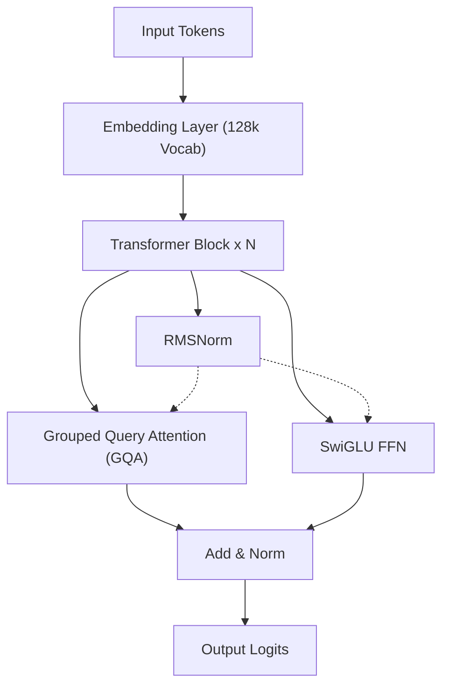
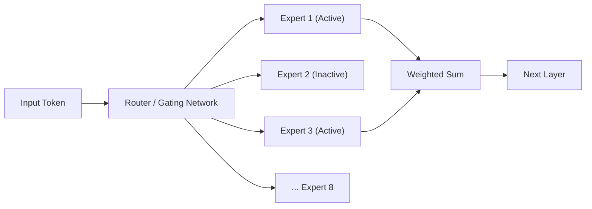
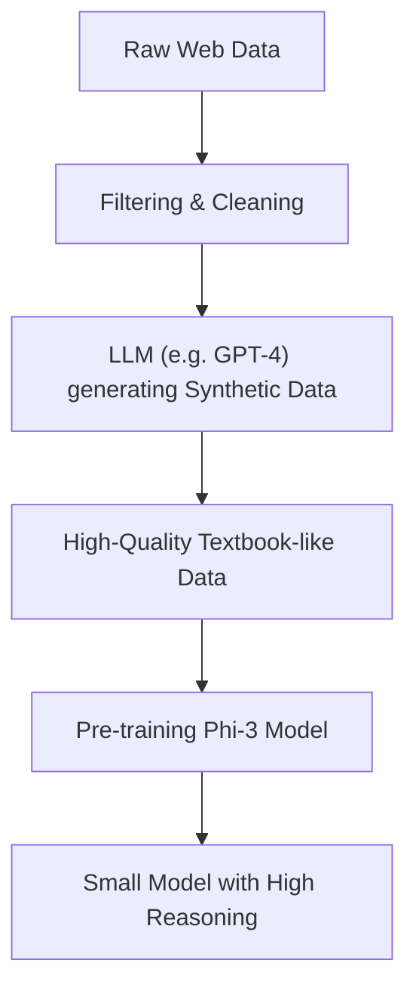
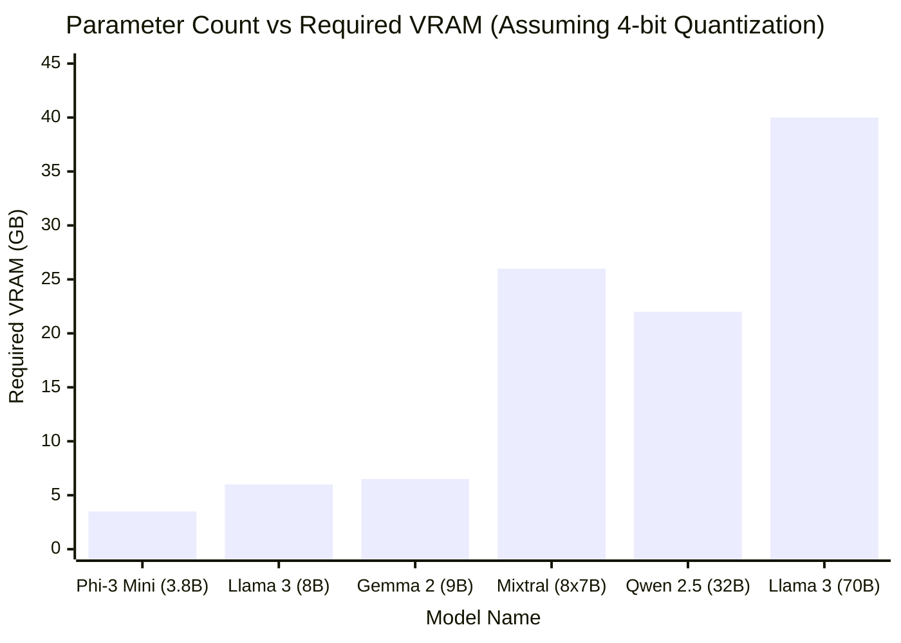

# Introduction

In recent years, the technological evolution of Large Language Models (LLMs) has been remarkable, and cloud-based AI services like ChatGPT and Claude have become widespread. However, on the other hand, the need to "not send company confidential data to external servers," "keep API usage fees down," and "build AI systems that operate completely offline" is rapidly increasing.

Meeting this demand are "Local LLMs (Open Source LLMs)," which you can download and run directly on your own PC or in-house servers. Until around 2023, it was difficult to achieve practical accuracy locally, but with the evolution of model architectures and the development of quantization technologies, it is now possible to run very high-performance LLMs smoothly even on consumer-grade GPUs (such as NVIDIA RTX 3090 / 4090 or Mac's Apple Silicon).

In this article, we have picked out the "Top 5 Recommended Models" that are highly rated as of 2026 from among numerous open source LLMs. We will thoroughly compare and explain each model's architectural features, parameter counts, memory requirements based on GGUF quantization, and specific use cases from an extremely detailed and technical perspective.

---

# Why Run LLMs Locally?

Running local LLMs offers numerous unique advantages not found in cloud-based APIs.

### 1. Complete Privacy and Security
When using cloud APIs, the input prompts and data are sent to external companies' servers. This poses a significant risk when handling personal or corporate confidential information. With local LLMs, data is processed entirely within the device, reducing the risk of external data leakage to zero.

### 2. Significant Cost Reduction
Commercial APIs (like OpenAI API) operate on a pay-as-you-go system based on input and output token counts. Processing large volumes of documents or constantly running a chatbot can cost tens to hundreds of thousands of yen per month. On the other hand, local LLMs can be used an unlimited number of times for any number of tokens, with only the initial hardware investment and electricity costs.

### 3. Customizability and Offline Use
Open source LLMs make it easy to perform fine-tuning (such as LoRA) using your own datasets. Additionally, they can be operated in completely offline environments without internet connections or secure closed networks, making them ideal for integration into edge devices.

---

# Basic Knowledge for Running Local LLMs

Before introducing the models, let's mathematically summarize the "VRAM requirements" and "Quantization", which are unavoidable when running LLMs in a local environment.

## Mathematical Basics of VRAM (Video Memory) and Quantization

To run LLM inference on a GPU, the model's parameters (weights) must be loaded into VRAM. The memory requirement $M$ of a model can be approximated by the following formula:

$$ M = \frac{P \times B}{8} + C $$

Here:
- $M$: Required memory capacity (GB)
- $P$: Number of parameters (Billion = 1 billion)
- $B$: Number of bits per parameter (16 bits for FP16, 4 bits for 4-bit quantization)
- $C$: Context window (KV cache) and inference overhead (usually estimated at 20% to 30% of the model size)

For example, when running a model with 8 billion parameters (8B) using 16-bit floating point (FP16):

$$ M_{FP16} = \frac{8 \times 16}{8} = 16 \text{ GB} $$

Furthermore, considering the KV cache, nearly 18GB to 20GB of VRAM will be required, making it difficult to run on a standard gaming PC.

### The Rise of the GGUF Format

This is where "Quantization" comes in. It is a technology that drastically reduces the required memory while minimizing model performance degradation by dropping the parameter precision from FP16 to 8-bit, 4-bit, or in extreme cases, 2-bit.

The most widespread format today is **GGUF (GPT-Generated Unified Format)**, devised by Georgi Gerganov (the developer of llama.cpp). GGUF is a binary format for efficient inference on both CPUs and GPUs, and it is particularly characterized by its excellent compatibility with Mac's (Apple Silicon) Unified Memory architecture.

The memory calculation when quantizing an 8B model to 4-bit (e.g., Q4_K_M) is as follows:

$$ M_{4bit} = \frac{8 \times 4.5}{8} = 4.5 \text{ GB} $$

*Note: Since Q4_K_M retains high precision for some weights, the effective bit count is about 4.5 bits.

This makes it possible to run powerful 8B-class LLMs smoothly locally, even on entry-class GPUs with only 8GB of VRAM or typical laptops.

---

# Top 5 Recommended Local LLM Models

Now, let's introduce 5 open source LLMs that are currently highly supported by developers and AI researchers worldwide.

## 1. Llama 3 (Meta)

Developed by Meta, the "Llama 3" series has become the de facto industry standard for open source LLMs.

### Architectural Evolution and Features

While Llama 3 adopts a standard Transformer architecture, numerous technical improvements have been made since the previous generation (Llama 2). The following points are particularly noteworthy:

- **Standard Adoption of GQA (Grouped Query Attention)**: GQA, which was only adopted for large-scale models in Llama 2, was adopted for small-scale models like 8B in Llama 3. As a result, the memory usage of the KV cache has drastically decreased, enabling high-speed inference even with long contexts.
- **Expanded Vocabulary Size**: The vocabulary size of the tokenizer (based on Tiktoken) was expanded to 128,000 tokens, dramatically improving the compression efficiency for multilingual text and program code. Processing efficiency for Japanese has also improved several times over compared to Llama 2.



### Parameter Sizes and Use Cases

- **Llama 3 8B**: 8 billion parameters. Runs on about 5GB of memory with 4-bit quantization. Responses are extremely fast, making it ideal as a personal assistant on a PC or as the core of a local RAG (Retrieval-Augmented Generation) system.
- **Llama 3 70B**: 70 billion parameters. Requires about 40GB of VRAM (or Apple Silicon's Unified Memory) with 4-bit quantization. It possesses capabilities rivaling the cloud's GPT-4, demonstrating its power in advanced reasoning, complex coding, data analysis, and more.

Llama 3 boasts the strongest community support, and its strength lies in the immediate availability of all quantization formats, including GGUF, AWQ, and EXL2.

---

## 2. Mistral / Mixtral (Mistral AI)

The models provided by French AI startup "Mistral AI" shocked the industry with their efficiency and paradigm-shifting architectures.

### How MoE (Mixture of Experts) Works

"Mixtral 8x7B" was the first open source LLM to fully adopt the **MoE (Mixture of Experts)** architecture, achieving massive success.
MoE is a mechanism that incorporates 8 "Expert networks" within the entire model (about 47 billion parameters) and dynamically selects (routes) only the optimal 2 experts for each input token.



The greatest advantage of this architecture is that "while the total number of parameters is huge, the number of parameters computed during inference (Active Parameters) is small". In the case of Mixtral 8x7B, only the equivalent of 13B parameters become active during inference. This dramatically improves inference speed while maintaining high performance comparable to the 70B class.

### Performance and Use Cases

- **Mistral 7B / Mistral Nemo (12B)**: Single Dense models. Extremely lightweight, yet freely available for commercial use under the Apache 2.0 license. In coding and summarization tasks, they deliver benchmark scores that overwhelm other models of similar sizes.
- **Mixtral 8x7B / 8x22B**: Advanced MoE models. While VRAM requirements are high (since the entire model must be loaded into memory, about 26GB for 4-bit 8x7B), the inference speed is fast, making them highly suitable for building local servers in Mac environments like M2/M3 Max.

---

## 3. Gemma 2 (Google)

The "Gemma" series represents open models developed by Google utilizing the technology from their state-of-the-art "Gemini" models. As the second generation, Gemma 2 underwent major architectural revisions.

### Unique Architectural Design

Gemma 2 adopts several unique designs that set it apart from other LLMs.

- **Logit Soft-capping**: A technique that prevents the generation of abnormally large logit values, enhancing the stability of training and inference.
- **Hybrid of Sliding Window Attention (SWA) and Local Attention**: Instead of performing full attention across all layers, layers looking only at local context and layers looking at global context are alternately placed.

The computational reduction in SWA is shown mathematically as follows. Compared to the standard Self-Attention complexity $O(N^2)$, the complexity of SWA with a window size $W$ is:

$$ \text{Complexity}_{SWA} = O(N \times W) $$

Here, $N$ is the sequence length, and $W$ is the fixed window size. As $N$ becomes larger (inputting longer texts), the resource-saving effect of SWA becomes tremendous.

### Performance and Use Cases

- **Gemma 2 2B / 9B**: The 2B model runs even in extremely low-resource environments like smartphones and Raspberry Pis, while the 9B model is for general PCs. The 9B model in particular often outperforms Llama 3 8B in benchmarks, making it one of the strongest sub-10B models available today.
- **Gemma 2 27B**: 27 billion parameters. It is characterized by its "perfect sizing", fitting neatly into 24GB of VRAM (RTX 3090 / 4090, etc.) with 4-bit or 6-bit quantization. It excels at programming and complex Japanese instructions, making it extremely popular among enthusiasts.

---

## 4. Qwen 2.5 (Alibaba Cloud)

The Qwen series developed by Alibaba Cloud boasts world-class performance, particularly in multilingual processing, coding, and mathematical reasoning.

### Multilingual Support and Coding Capabilities

Qwen 2.5 has been pre-trained on a massive multilingual corpus, receiving **extremely high praise for its natural Japanese output**, let alone English and Chinese. For Japanese users, the fact that it "doesn't sound like unnatural translated Japanese" is the biggest advantage.
There is also a "Qwen 2.5 Coder" model specialized for programming, and there is a rapid increase in cases where it is used as a local GitHub Copilot alternative in conjunction with VSCode extensions (such as Continue).

### Architecture and Use Cases

- **Tie Word Embeddings**: It adopts a mechanism to share (tie) the weights of the input embedding layer and the output layer, efficiently learning while saving parameter counts.
- **Expansion of RoPE (Rotary Position Embedding)**: It supports an massive context window of up to 128K tokens, making it possible to read huge PDFs or perform full analysis on tens of thousands of lines of source code locally.

Model sizes are finely lined up at 0.5B, 1.5B, 3B, 7B, 14B, 32B, and 72B, and the ability to choose a size that pushes the limits of your own hardware specs (VRAM capacity) is also an appealing point of Qwen.

---

## 5. Phi-3 / Phi-3.5 (Microsoft)

The Phi series was born from the paradigm "Textbook is all you need" advocated by Microsoft.

### Revolution of SLMs (Small Language Models)

While recent LLM development has been dominated by the brute-force approach of "just increasing parameter counts and data volume", Microsoft proved that "by maximizing the quality of data fed to the model (high-quality textbook data and synthetic data), even a small number of parameters can possess GPT-3.5 class intelligence".
Phi-3 is referred to as an **SLM (Small Language Model)** rather than an LLM (Large Language Model).



### Performance and Use Cases

- **Phi-3 Mini (3.8B)**: A model designed assuming native operation on smartphones (using ONNX Runtime, etc.). Despite having just under 4B parameters, its reasoning and logical thinking abilities are surprisingly high, completing simple Q&A or text formatting tasks in an instant.
- **Phi-3.5 Vision / MoE**: Vision models capable of image recognition and MoE versions have also been released.

For local AI implementation on edge devices, mobile app integration, or as an ultra-lightweight agent constantly running in the background, the Phi-3 series is second to none.

---

# Technical Comparison and Benchmarks of Models

Let's quantitatively compare the "VRAM requirements" and "Inference speed" when running the introduced models locally.

## Relationship Between Parameter Count and VRAM Requirements (Using GGUF 4-bit Quantization)

The graph below shows a guideline for the VRAM required during inference (including KV cache overhead) against the number of parameters for each model.



*Although Mixtral 8x7B consumes a lot of VRAM because its total parameter count is large, the computation itself is light, resulting in a low load on GPU computational resources (like CUDA cores).*

## Theoretical Calculation of Inference Speed (Tokens/sec)

The inference speed of local LLMs depends heavily on the GPU's "Memory Bandwidth". This is because, during the generation phase (decoding), all model weights must be read from memory for every single token generated. It is a memory-bound process rather than a compute-bound one.

The theoretical maximum inference speed $T$ (Tokens/sec) is calculated by the following formula:

$$ T = \frac{\text{BW}}{M_{\text{weights}}} $$

Here:
- $\text{BW}$: Effective memory bandwidth of the GPU (GB/s)
- $M_{\text{weights}}$: Loaded size of the model (GB)

For example, let's calculate the case of running the 4-bit version of Llama 3 8B (approx. 4.5 GB) on an NVIDIA RTX 4090 (memory bandwidth 1,008 GB/s). Assuming the effective bandwidth is about 80% of the theoretical value (approx. 800 GB/s):

$$ T \approx \frac{800}{4.5} \approx 177 \text{ Tokens/sec} $$

This is a blistering speed that far exceeds human reading speeds. On the other hand, if you run Llama 3 70B (4-bit version approx. 40GB *assuming it's split across 2 GPUs, etc.) on the same RTX 4090, the token generation speed settles to about 20 Tokens/sec. In this way, you can mathematically predict in advance "how fast the output will be" based on your PC's specs.

---

# Tools for Running Local LLMs

The software ecosystem for running these powerful open source LLMs in a local environment is currently very robust. We'll introduce 3 representative tools.

### 1. Ollama
Currently the easiest and most popular tool. Like Docker, it downloads and runs models with a single command. It supports Mac, Windows, and Linux.
By opening a terminal and typing the following command, Llama 3 will start up.

```bash
ollama run llama3
```
Also, since Ollama functions as a REST API server in the background, it is extremely easy to integrate with Python scripts and external applications.

### 2. LM Studio
An application recommended for those who want intuitive GUI-based operations. You can search and download from Hugging Face's massive list of GGUF models from within the app, and enjoy conversations in a chat interface akin to ChatGPT. The feature that visually tells you which models will fit in your PC's RAM/VRAM is very convenient.

### 3. llama.cpp
The library that sparked the local LLM boom, serving as the C/C++ implementation foundation for everything. It's geared toward engineers wanting to tune performance to the absolute limit and hackers wanting to embed it into their own scripts. It maximizes the potential of any hardware, from Apple's Metal, NVIDIA's CUDA, AMD's ROCm, down to Intel's AVX instruction sets.

---

# Conclusion and Future Outlook

In this article, we introduced 5 of the top open source local LLMs as of 2026, and explained their architectures and technical backgrounds. To summarize how to choose based on your goals:

1. **If you prioritize overall balance and ecosystem**: `Llama 3 (8B / 70B)`
2. **If you want fast inference on environments with massive Unified Memory like Mac**: `Mixtral 8x7B`
3. **If you want to extract maximum intelligence from a 24GB class VRAM**: `Gemma 2 27B` or `Qwen 2.5 32B`
4. **If your goal is natural Japanese output and advanced coding assistance**: `Qwen 2.5`
5. **For ultra-lightweight processing on smartphones, weak PCs, or in the background**: `Phi-3 / Phi-3.5`

The speed at which open source LLMs are evolving is staggering, with breakthroughs that overturn conventional wisdom being announced every few months. Going forward, with further improvements in quantization technologies and the introduction of new architectures, the day when local environments surpass cloud AI may be near.
By all means, download the optimal model for your hardware environment and experience the overwhelming freedom and possibilities of local AI.

