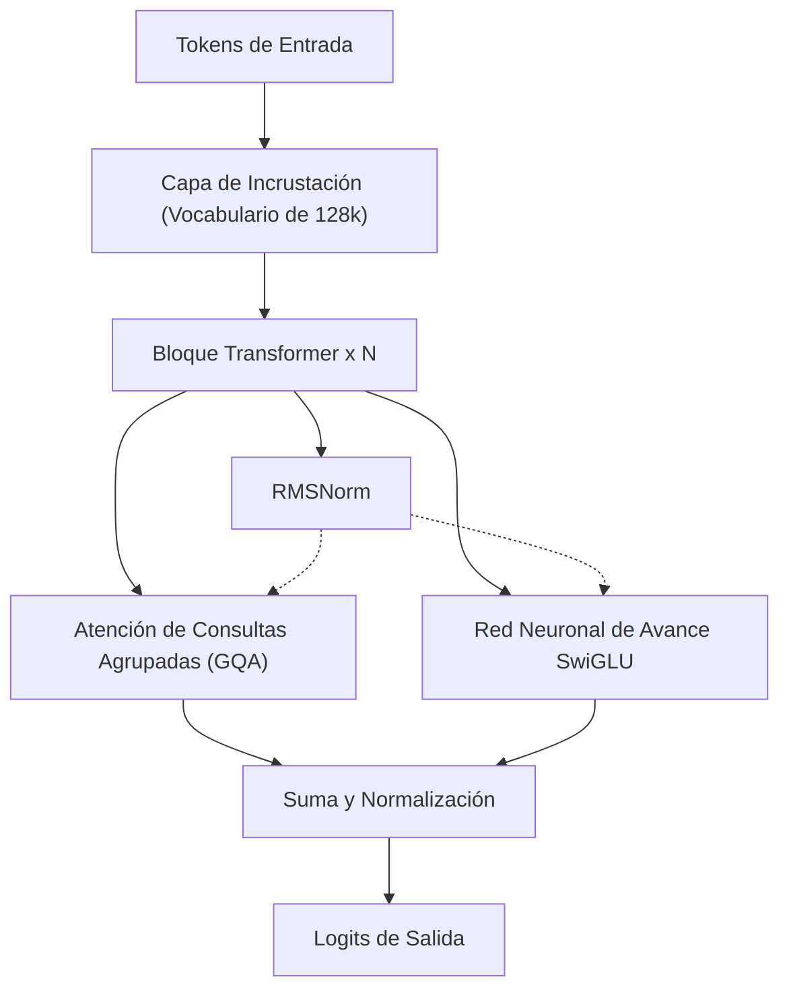
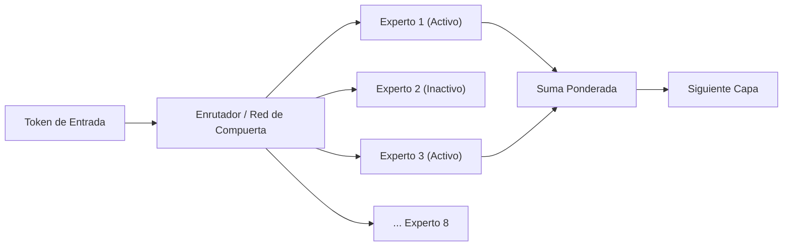
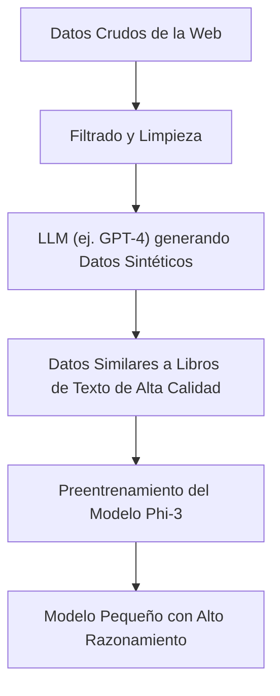
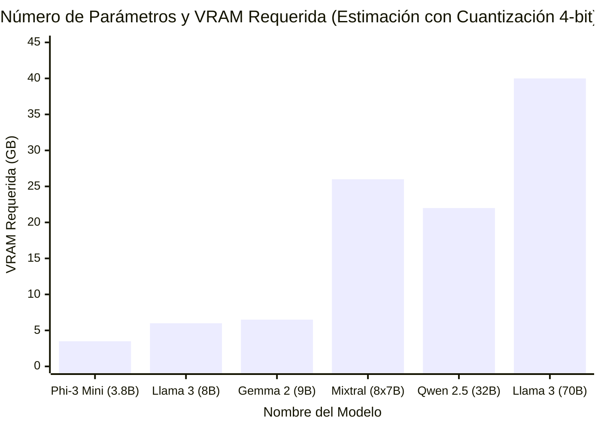

# Introducción

En los últimos años, la evolución tecnológica de los grandes modelos de lenguaje (LLM) ha sido notable, y los servicios de IA basados en la nube, como ChatGPT y Claude, se han generalizado. Sin embargo, al mismo tiempo, ha aumentado rápidamente la necesidad de "no enviar datos confidenciales de la empresa a servidores externos", "reducir los costos de uso de la API" y "construir un sistema de IA que funcione de manera completamente fuera de línea".

La respuesta a estas demandas es el "LLM local (LLM de código abierto)", que se puede descargar y ejecutar directamente en tu propia PC o servidor interno. Hasta alrededor de 2023, era difícil lograr una precisión práctica de forma local, pero gracias a la evolución de la arquitectura de los modelos y al desarrollo de la tecnología de cuantización (Quantization), ahora es posible ejecutar LLM de muy alto rendimiento de manera fluida incluso en GPU de consumo (como NVIDIA RTX 3090 / 4090 o Mac con Apple Silicon).

En este artículo, de entre los numerosos LLM de código abierto, seleccionamos los "5 modelos recomendados" que están evaluados como excepcionalmente buenos en 2026. Compararemos y explicaremos en profundidad cada uno desde una perspectiva extremadamente detallada y técnica, abarcando las características de su arquitectura, cantidad de parámetros, requisitos de memoria por la cuantización GGUF, e incluso casos de uso específicos.

---

# ¿Por qué ejecutar un LLM localmente?

La adopción de LLM locales ofrece muchas ventajas únicas que las API basadas en la nube no tienen.

### 1. Privacidad total y garantía de seguridad
Cuando utilizas una API en la nube, los prompts (indicaciones) y datos que ingresas se envían a los servidores de empresas externas. Esto supone un riesgo grave al manejar información personal o datos confidenciales de la empresa. Con un LLM local, dado que los datos se procesan completamente dentro del dispositivo, el riesgo de filtración de datos al exterior se reduce a cero.

### 2. Reducción significativa de costos
Las API comerciales (como la API de OpenAI) se basan en un sistema de pago por uso según el número de tokens de entrada y salida. Si procesas grandes cantidades de documentos o mantienes un chatbot funcionando constantemente, los costos pueden ascender a decenas o cientos de miles de yenes (o el equivalente local) al mes. Por el contrario, con un LLM local, solo con la inversión inicial en hardware y los costos de electricidad, puedes utilizarlo sin límites de tokens tantas veces como desees.

### 3. Personalización y uso fuera de línea
Los LLM de código abierto permiten realizar ajustes finos (fine-tuning, como LoRA) de manera sencilla utilizando tus propios conjuntos de datos. Además, pueden funcionar en entornos completamente fuera de línea sin conexión a Internet o en redes cerradas seguras, lo que los hace ideales para integrarlos en dispositivos de borde (edge devices).

---

# Conocimientos básicos para ejecutar LLM locales

Antes de pasar a la presentación de los modelos, repasemos matemáticamente los "requisitos de VRAM" y la "cuantización (Quantization)", que son inevitables al ejecutar LLM en un entorno local.

## VRAM (Memoria de video) y fundamentos matemáticos de la cuantización

Para que un LLM realice inferencias en una GPU, es necesario desplegar los parámetros (pesos) del modelo en la VRAM. El requerimiento de memoria del modelo $M$ se puede aproximar con la siguiente fórmula:

$$ M = \frac{P \times B}{8} + C $$

Donde,
- $M$: Capacidad de memoria necesaria (GB)
- $P$: Cantidad de parámetros (Billion = mil millones)
- $B$: Número de bits por parámetro (16 bits para FP16, 4 bits para cuantización de 4 bits)
- $C$: Ventana de contexto (Caché KV) y sobrecarga durante la inferencia (generalmente se estima en un 20% a 30% del tamaño del modelo)

Por ejemplo, al ejecutar un modelo con 8 mil millones (8B) de parámetros en punto flotante de 16 bits (FP16):

$$ M_{FP16} = \frac{8 \times 16}{8} = 16 \text{ GB} $$

Si además consideramos la caché KV y demás factores, se necesitarán cerca de 18GB a 20GB de VRAM, lo cual resulta difícil de ejecutar en una PC gaming común.

### El auge del formato GGUF

Aquí es donde entra en juego la "cuantización (Quantization)". Es una tecnología que reduce drásticamente la cantidad de memoria necesaria, minimizando la degradación del rendimiento del modelo, al disminuir la precisión de los parámetros de FP16 a 8 bits, 4 bits o, en casos extremos, a 2 bits.

El formato más popular actualmente es **GGUF (GPT-Generated Unified Format)**, ideado por Georgi Gerganov (desarrollador de llama.cpp). GGUF es un formato binario para realizar inferencias de manera eficiente tanto en CPU como en GPU, y se caracteriza por ser muy compatible con la arquitectura Unified Memory de Mac (Apple Silicon).

El cálculo de memoria para un modelo de 8B cuantizado a 4 bits (por ejemplo, Q4_K_M) sería el siguiente:

$$ M_{4bit} = \frac{8 \times 4.5}{8} = 4.5 \text{ GB} $$

*Q4_K_M mantiene una mayor precisión en algunos de los pesos, por lo que el número efectivo de bits es aproximadamente de 4.5 bits.

Gracias a esto, incluso en GPU de gama básica con solo 8GB de VRAM o en computadoras portátiles comunes, es posible ejecutar potentes LLM de clase 8B de manera fluida y local.

---

# Los 5 mejores modelos de LLM locales recomendados

Ahora, presentaremos 5 LLM de código abierto que actualmente gozan de un gran apoyo por parte de desarrolladores e investigadores de IA en todo el mundo.

## 1. Llama 3 (Meta)

Desarrollada por Meta, la serie "Llama 3" se ha convertido en el estándar de facto de los LLM de código abierto en la industria.

### Evolución de la arquitectura y características

Aunque Llama 3 adopta una arquitectura estándar de Transformer, incluye numerosas mejoras técnicas respecto a su generación anterior (Llama 2). Cabe destacar los siguientes puntos:

- **Adopción estándar de GQA (Grouped Query Attention)**: GQA, que solo se utilizó en modelos a gran escala en Llama 2, ahora también se adopta en modelos pequeños como el de 8B en Llama 3. Esto reduce drásticamente el uso de memoria de la caché KV y permite una inferencia rápida incluso con contextos largos.
- **Ampliación del tamaño del vocabulario**: El tamaño del vocabulario del tokenizador (basado en Tiktoken) se ha ampliado a 128.000 tokens, mejorando dramáticamente la eficiencia de compresión en múltiples idiomas y códigos de programación. La eficiencia del procesamiento del japonés y otros idiomas también ha mejorado varias veces en comparación con Llama 2.



### Tamaño de parámetros y casos de uso

- **Llama 3 8B**: 8 mil millones de parámetros. Funciona con aproximadamente 5GB de memoria con cuantización a 4 bits. Sus respuestas son extremadamente rápidas, lo que lo hace ideal como asistente personal en PC o como núcleo para un sistema RAG (Generación Aumentada por Recuperación) local.
- **Llama 3 70B**: 70 mil millones de parámetros. Requiere unos 40GB de VRAM (o Unified Memory de Apple Silicon) con cuantización a 4 bits. Tiene un rendimiento muy cercano al de GPT-4 en la nube, y destaca en razonamiento avanzado, programación compleja y análisis de datos.

Llama 3 cuenta con el apoyo más amplio de la comunidad, y su gran ventaja es que cualquier formato de cuantización como GGUF, AWQ o EXL2 está disponible de inmediato.

---

## 2. Mistral / Mixtral (Mistral AI)

Los modelos proporcionados por "Mistral AI", una startup de IA francesa, han impactado a la industria con su eficiencia y su arquitectura que plantea un cambio de paradigma.

### Cómo funciona MoE (Mixture of Experts)

"Mixtral 8x7B" adoptó a gran escala la arquitectura **MoE (Mixture of Experts)** por primera vez en un LLM de código abierto, logrando un éxito rotundo.
MoE es un mecanismo en el que el modelo completo (aproximadamente 47 mil millones de parámetros) cuenta con 8 "redes de expertos (Expert)" y, para cada token introducido, selecciona dinámicamente (enruta) solo los 2 expertos óptimos para ejecutar.



La mayor ventaja de esta arquitectura es que, "aunque la cantidad total de parámetros es enorme, los parámetros calculados durante la inferencia (Active Parameters) son pocos". En el caso de Mixtral 8x7B, el equivalente a solo 13B está activo durante la inferencia. Esto mejora dramáticamente la velocidad de inferencia mientras mantiene un alto rendimiento de clase 70B.

### Rendimiento y casos de uso

- **Mistral 7B / Mistral Nemo (12B)**: Modelos densos (Dense) únicos. A pesar de ser muy ligeros, se pueden utilizar libremente con fines comerciales bajo la licencia Apache 2.0. En tareas de programación y resumen, superan con creces a otros modelos del mismo tamaño en los benchmarks.
- **Mixtral 8x7B / 8x22B**: Modelos MoE avanzados. Aunque el requisito de VRAM es alto (ya que todo el modelo debe cargarse en memoria; aprox. 26GB para 8x7B en 4 bits), la velocidad de inferencia es muy rápida, lo que los hace ideales para construir servidores locales en entornos Mac como M2/M3 Max.

---

## 3. Gemma 2 (Google)

La serie "Gemma" son modelos abiertos desarrollados por Google aprovechando la tecnología de su modelo de vanguardia, "Gemini". Como segunda generación, Gemma 2 ha realizado cambios significativos en su arquitectura.

### Diseño de arquitectura único

Gemma 2 adopta algunos diseños únicos que lo diferencian de otros LLM.

- **Logit Soft-capping**: Una técnica que evita la generación de valores logit inusualmente grandes, mejorando la estabilidad del entrenamiento y la inferencia.
- **Híbrido de Sliding Window Attention (SWA) y Local Attention**: En lugar de utilizar Full Attention en todas las capas, alterna capas que observan solo el contexto local con capas que observan el contexto completo.

La reducción de la carga computacional en SWA se puede expresar matemáticamente de la siguiente manera. Frente a la complejidad de la Self-Attention normal $O(N^2)$, la complejidad de SWA con un tamaño de ventana $W$ es:

$$ \text{Complexity}_{SWA} = O(N \times W) $$

Donde, $N$ es la longitud de la secuencia y $W$ es el tamaño de la ventana fija. A medida que $N$ aumenta (cuando se introducen textos largos), el efecto de ahorro de recursos computacionales de SWA se vuelve inmenso.

### Rendimiento y casos de uso

- **Gemma 2 2B / 9B**: El modelo de 2B funciona incluso en entornos de muy bajos recursos como smartphones o Raspberry Pi, y el modelo de 9B es para PC convencionales. El modelo de 9B, en particular, supera los resultados de referencia de Llama 3 8B en muchas tareas, siendo uno de los modelos de menos de 10B más potentes en la actualidad.
- **Gemma 2 27B**: 27 mil millones de parámetros. Su característica principal es su "tamaño ideal" que encaja perfectamente en 24GB de VRAM (como RTX 3090 / 4090) con cuantización a 4 o 6 bits. Destaca en la programación y en el seguimiento de instrucciones complejas, siendo muy popular entre los entusiastas.

---

## 4. Qwen 2.5 (Alibaba Cloud)

La serie Qwen desarrollada por Alibaba Cloud es un modelo que cuenta con un rendimiento de primer nivel mundial, especialmente en procesamiento multilingüe, programación y razonamiento matemático.

### Soporte multilingüe y capacidad de programación

Qwen 2.5 ha sido pre-entrenado con un enorme corpus multilingüe, recibiendo **evaluaciones extremadamente altas por sus salidas naturales** no solo en inglés y chino, sino también en idiomas como el japonés. Para los usuarios, la mayor ventaja es que "no suena como una traducción robótica antinatural".
Además, existe un modelo especializado en programación llamado "Qwen 2.5 Coder", y el número de casos en los que se utiliza como alternativa local a GitHub Copilot, enlazado con extensiones de VSCode (como Continue), está creciendo rápidamente.

### Arquitectura y casos de uso

- **Tie Word Embeddings**: Al compartir (Tie) los pesos de la capa de incrustación (Embedding) de entrada y la capa de salida, se adopta un mecanismo para aprender de manera eficiente mientras se reduce la cantidad de parámetros.
- **Extensión de RoPE (Rotary Position Embedding)**: Soporta una inmensa ventana de contexto de hasta 128K tokens, lo que permite la lectura de archivos PDF gigantes o el análisis completo de decenas de miles de líneas de código fuente localmente.

Los tamaños del modelo están disponibles detalladamente en opciones de 0.5B, 1.5B, 3B, 7B, 14B, 32B y 72B. El hecho de poder elegir el tamaño al límite exacto de las especificaciones de hardware (capacidad de VRAM) es también un punto atractivo de Qwen.

---

## 5. Phi-3 / Phi-3.5 (Microsoft)

La serie Phi nació del paradigma propuesto por Microsoft: "Textbook is all you need" (Un libro de texto es todo lo que necesitas).

### La revolución de los SLM (Modelos de Lenguaje Pequeños)

El desarrollo reciente de LLM se basaba principalmente en la fuerza bruta de "simplemente aumentar la cantidad de parámetros y datos". Sin embargo, Microsoft demostró que "si se eleva al límite la calidad de los datos proporcionados al modelo (datos similares a libros de texto de alta calidad o datos sintéticos), puede tener una inteligencia de la clase de GPT-3.5 incluso con un número de parámetros reducido".
Phi-3 no se denomina LLM (Large Language Model), sino **SLM (Small Language Model)**.



### Rendimiento y casos de uso

- **Phi-3 Mini (3.8B)**: Un modelo diseñado para funcionar de forma nativa en smartphones (utilizando ONNX Runtime, etc.). A pesar de tener poco menos de 4B de parámetros, su capacidad de inferencia y pensamiento lógico es sorprendentemente alta, y las tareas simples de preguntas y respuestas o formateo de texto se completan en un instante.
- **Phi-3.5 Vision / MoE**: También se han lanzado modelos Vision que pueden reconocer imágenes, así como versiones MoE.

Para la implementación de IA local en dispositivos de borde, la integración en aplicaciones móviles o como agentes ultraligeros para estar siempre residentes en segundo plano, la serie Phi-3 no tiene paralelo.

---

# Comparación técnica y pruebas de rendimiento (Benchmarks) de los modelos

Ahora, comparemos cuantitativamente los "requisitos de VRAM" y la "velocidad de inferencia" al ejecutar localmente los modelos presentados.

## Relación entre el número de parámetros y los requisitos de VRAM (Con cuantización GGUF a 4 bits)

El siguiente gráfico muestra la VRAM estimada que se requiere (incluida la sobrecarga de la caché KV) durante la inferencia en relación con la cantidad de parámetros de cada modelo.



*Debido a su gran volumen total de parámetros, Mixtral 8x7B consume mucha VRAM, pero como el cálculo en sí es ligero, la carga sobre los recursos computacionales de la GPU (como los núcleos CUDA) es baja.

## Cálculo teórico de la velocidad de inferencia (Tokens/sec)

La velocidad de inferencia de un LLM local depende en gran medida del "Ancho de banda de la memoria (Memory Bandwidth)" de la GPU. En la fase de generación (decodificación), es necesario leer todos los pesos del modelo de la memoria para cada token generado. Esto es un proceso limitado por la memoria (Memory-bound) y no por el cálculo (Compute-bound).

La velocidad máxima teórica de inferencia $T$ (Tokens/sec) se calcula con la siguiente fórmula:

$$ T = \frac{\text{BW}}{M_{\text{weights}}} $$

Donde,
- $\text{BW}$: Ancho de banda efectivo de la memoria de la GPU (GB/s)
- $M_{\text{weights}}$: Tamaño del modelo cargado (GB)

Por ejemplo, al calcular el caso de ejecutar la versión de 4 bits de Llama 3 8B (aprox. 4.5 GB) en una NVIDIA RTX 4090 (ancho de banda de memoria de 1,008 GB/s). Suponiendo un ancho de banda efectivo de alrededor del 80% del valor teórico (aprox. 800 GB/s):

$$ T \approx \frac{800}{4.5} \approx 177 \text{ Tokens/sec} $$

Esta es una velocidad asombrosa que supera con creces la velocidad de lectura humana. Por otro lado, si ejecutas Llama 3 70B (versión de 4 bits de unos 40GB, asumiendo su división en dos GPU) en la misma RTX 4090, la velocidad de generación de tokens se estabiliza en unos 20 Tokens/sec. De esta manera, es posible predecir con una fórmula matemática "a qué velocidad se generarán los resultados" en función de las especificaciones de tu propia PC.

---

# Herramientas para ejecutar LLM locales

El ecosistema de software para ejecutar estos potentes LLM de código abierto en un entorno local también es actualmente muy completo. A continuación, presentamos tres de las herramientas más representativas.

### 1. Ollama
Actualmente, es la herramienta más fácil y popular. Al igual que Docker, te permite descargar y ejecutar modelos con un solo comando. Es compatible con Mac, Windows y Linux.
Llama 3 se iniciará con solo abrir tu terminal y escribir el siguiente comando:

```bash
ollama run llama3
```
Además, dado que Ollama funciona como un servidor de API REST en segundo plano, la integración con scripts de Python o aplicaciones de terceros es extremadamente fácil.

### 2. LM Studio
Una aplicación recomendada para aquellos que desean operar intuitivamente en una interfaz gráfica (GUI). Permite buscar y descargar a través de la aplicación desde la enorme lista de modelos GGUF en Hugging Face, y puedes disfrutar de conversaciones en una pantalla de chat similar a ChatGPT. Es muy conveniente la función que te indica visualmente qué modelo cabe en la RAM/VRAM de tu PC.

### 3. llama.cpp
El iniciador del auge de los LLM locales, y la biblioteca base implementada en C/C++ en la que todos se apoyan. Está dirigida a ingenieros que quieran ajustar al máximo el rendimiento y a hackers que quieran integrarla en sus propios scripts. Aprovecha al límite el potencial de cualquier hardware, desde Metal de Apple, CUDA de NVIDIA y ROCm de AMD, hasta el conjunto de instrucciones AVX de Intel.

---

# Conclusión y perspectivas futuras

En este artículo, presentamos 5 de los mejores LLM locales de código abierto de la actualidad (2026) y explicamos sus arquitecturas y antecedentes técnicos. A continuación, resumimos cómo elegirlos según tus objetivos:

1. **Si priorizas el equilibrio general y el ecosistema**: `Llama 3 (8B / 70B)`
2. **Si deseas una inferencia rápida en entornos de gran capacidad como Unified Memory en Mac**: `Mixtral 8x7B`
3. **Si quieres maximizar la inteligencia con VRAM de la clase de 24GB**: `Gemma 2 27B` o `Qwen 2.5 32B`
4. **Si tu objetivo es una salida natural en varios idiomas y un soporte avanzado de programación**: `Qwen 2.5`
5. **Para smartphones, PC de baja potencia o procesamiento ultraligero en segundo plano**: `Phi-3 / Phi-3.5`

La velocidad de evolución de los LLM de código abierto es tremenda, y cada pocos meses se anuncian grandes avances que cambian lo que antes era de sentido común. En el futuro, con más mejoras en la tecnología de cuantización y la aparición de nuevas arquitecturas, es posible que no esté lejos el día en que los entornos locales superen por sí solos a la IA en la nube.
Te invitamos a descargar el modelo que mejor se adapte a tu entorno de hardware y experimentar la abrumadora libertad y el potencial de la IA local.
