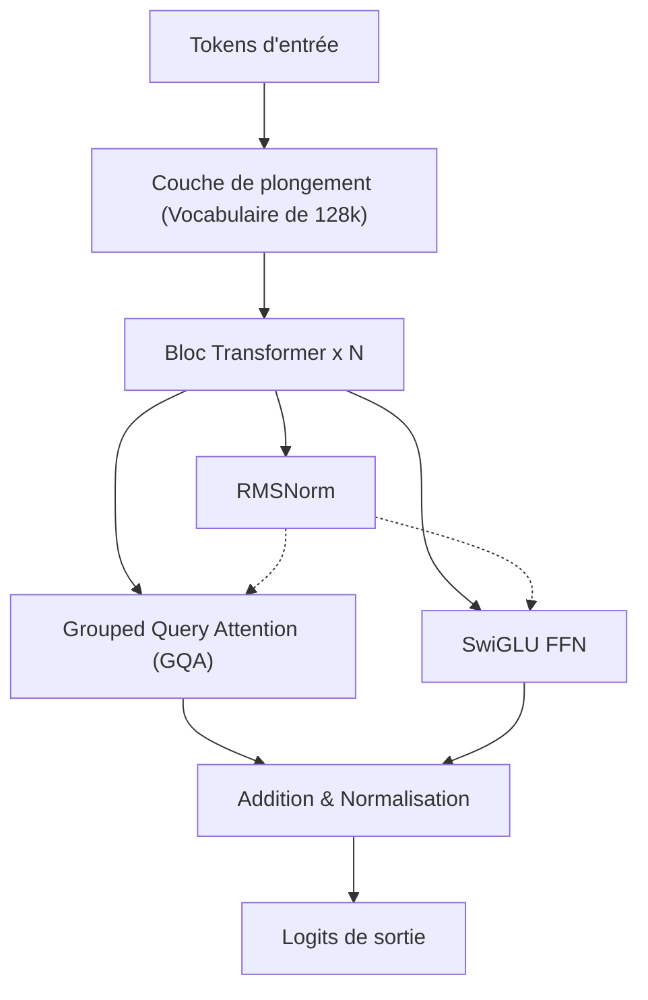
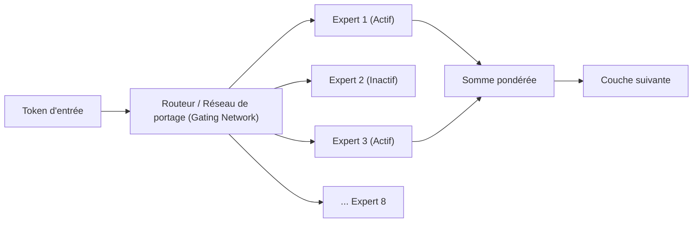
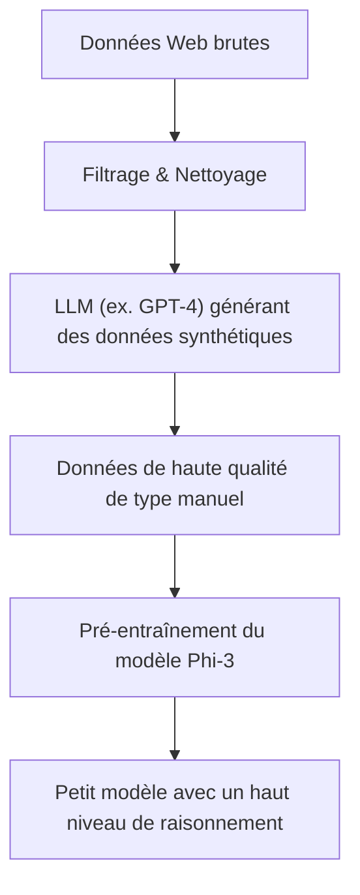
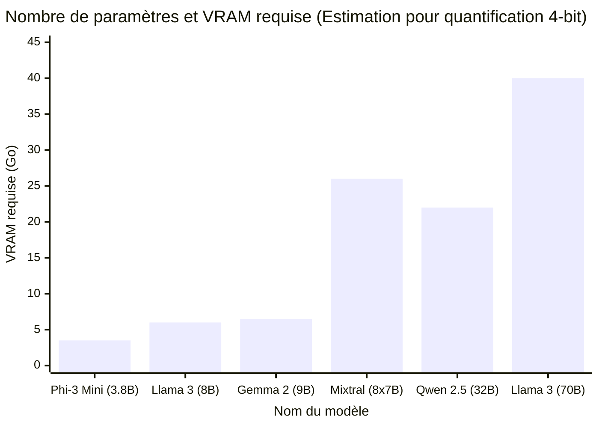

# Introduction

Ces dernières années, l'évolution technologique des grands modèles de langage (LLM) a été remarquable, et les services d'IA basés sur le cloud comme ChatGPT et Claude se sont largement répandus. Cependant, dans le même temps, les besoins tels que "ne pas envoyer les données confidentielles de l'entreprise à des serveurs externes", "réduire les coûts d'utilisation des API" ou "construire un système d'IA fonctionnant de manière totalement hors ligne" augmentent rapidement.

Pour répondre à ces exigences, il existe les "LLM locaux (LLM open source)" que vous pouvez télécharger et exécuter directement sur votre PC ou serveur interne. Jusqu'en 2023 environ, il était difficile d'obtenir une précision pratique en local, mais grâce à l'évolution de l'architecture des modèles et au développement de la technologie de quantification (Quantization), il est désormais possible d'exécuter de manière très fluide des LLM extrêmement performants même sur des GPU grand public (NVIDIA RTX 3090 / 4090 ou Apple Silicon sur Mac, etc.).

Dans cet article, parmi de nombreux LLM open source, nous avons sélectionné "les 5 meilleurs modèles recommandés" qui sont particulièrement bien notés en 2026. Nous comparerons et expliquerons en profondeur, avec une perspective extrêmement détaillée et technique, les caractéristiques de leur architecture, le nombre de paramètres, les exigences en matière de mémoire avec la quantification GGUF, jusqu'aux cas d'utilisation spécifiques.

---

# Pourquoi exécuter un LLM en local ?

Le déploiement d'un LLM local présente de nombreux avantages uniques que les API basées sur le cloud n'offrent pas.

### 1. Garantie d'une confidentialité et d'une sécurité totales
Lorsque vous utilisez une API cloud, les prompts et les données que vous saisissez sont envoyés aux serveurs d'une entreprise externe. Cela constitue un risque majeur lors de la manipulation d'informations personnelles ou de données confidentielles d'entreprise. Avec un LLM local, les données sont entièrement traitées au sein de votre terminal, ce qui permet de réduire à zéro le risque de fuite de données vers l'extérieur.

### 2. Réduction considérable des coûts
Les API commerciales (telles que l'API d'OpenAI) sont basées sur une facturation à l'utilisation selon le nombre de tokens d'entrée et de sortie. Si vous traitez une grande quantité de documents ou si vous laissez un chatbot fonctionner en permanence, cela peut coûter de plusieurs centaines à plusieurs milliers de dollars par mois. En revanche, avec un LLM local, avec le seul investissement initial dans le matériel et les frais d'électricité, vous pouvez l'utiliser autant de fois que vous le souhaitez avec un nombre illimité de tokens.

### 3. Personnalisation et utilisation hors ligne
Les LLM open source permettent d'effectuer facilement un fine-tuning (comme LoRA) à l'aide de vos propres jeux de données. De plus, ils peuvent être exécutés dans des environnements entièrement hors ligne sans connexion Internet ou dans des réseaux fermés sécurisés, ce qui les rend idéaux pour l'intégration dans des appareils edge (périphériques de périphérie).

---

# Connaissances de base pour exécuter un LLM local

Avant d'introduire les modèles, revoyons mathématiquement "les exigences en VRAM" et "la quantification (Quantization)", qui sont inévitables pour exécuter un LLM dans un environnement local.

## Base mathématique de la VRAM (mémoire vidéo) et de la quantification

Pour exécuter une inférence LLM sur un GPU, il est nécessaire de déployer les paramètres (poids) du modèle dans la VRAM. Les besoins en mémoire $M$ d'un modèle peuvent être approximés par la formule suivante.

$$ M = \frac{P \times B}{8} + C $$

Où :
- $M$ : Capacité de mémoire requise (Go)
- $P$ : Nombre de paramètres (Billion = milliard)
- $B$ : Nombre de bits par paramètre (16 bits pour FP16, 4 bits pour une quantification 4-bit)
- $C$ : Fenêtre de contexte (KV cache) et surcoût lors de l'inférence (généralement estimé à environ 20 % à 30 % de la taille du modèle)

Par exemple, si vous exécutez un modèle de 8 milliards de paramètres (8B) en virgule flottante 16 bits (FP16),
$$ M_{FP16} = \frac{8 \times 16}{8} = 16 \text{ GB} $$
Si l'on tient compte du KV cache, etc., près de 18 Go à 20 Go de VRAM seront nécessaires, ce qui le rend difficile à exécuter sur un PC de jeu standard.

### L'avènement du format GGUF

C'est là qu'intervient la "quantification (Quantization)". Il s'agit d'une technologie qui réduit considérablement la quantité de mémoire requise tout en minimisant la dégradation des performances du modèle, en réduisant la précision des paramètres de FP16 à 8 bits, 4 bits ou dans des cas extrêmes à 2 bits.

Le format actuellement le plus populaire est le **GGUF (GPT-Generated Unified Format)**, conçu par M. Georgi Gerganov (le développeur de llama.cpp). GGUF est un format binaire permettant d'effectuer efficacement des inférences à la fois sur le CPU et le GPU, et se caractérise par une très bonne compatibilité, notamment avec l'architecture Unified Memory des Mac (Apple Silicon).

Le calcul de la mémoire lors de la quantification d'un modèle 8B en 4 bits (par exemple : Q4_K_M) est le suivant.

$$ M_{4bit} = \frac{8 \times 4.5}{8} = 4.5 \text{ GB} $$
※ Puisque Q4_K_M conserve une haute précision pour certains poids, le nombre effectif de bits est d'environ 4,5 bits.

Grâce à cela, même sur des GPU d'entrée de gamme avec seulement 8 Go de VRAM ou sur des ordinateurs portables classiques, il devient possible d'exécuter de manière fluide de puissants LLM de classe 8B en local.

---

# Le top 5 des modèles LLM locaux recommandés

Présentons maintenant cinq LLM open source qui bénéficient actuellement d'un fort soutien de la part des développeurs et des chercheurs en IA du monde entier.

## 1. Llama 3 (Meta)

Développé par Meta, la série "Llama 3" est devenue le standard de facto de l'industrie pour les LLM open source.

### Évolution et caractéristiques de l'architecture

Llama 3 adopte l'architecture standard des Transformers, tout en ajoutant de nombreuses améliorations techniques par rapport à la génération précédente (Llama 2). Les points particulièrement notables sont les suivants :

- **Adoption standard du GQA (Grouped Query Attention)** : Le GQA, qui n'était adopté que pour les modèles à grande échelle dans Llama 2, a également été adopté pour les modèles à petite échelle comme le 8B dans Llama 3. En conséquence, l'utilisation de la mémoire pour le KV cache est considérablement réduite, ce qui permet une inférence rapide même avec des contextes longs.
- **Expansion de la taille du vocabulaire** : La taille du vocabulaire du tokenizer (basé sur Tiktoken) a été étendue à 128 000 tokens, améliorant considérablement l'efficacité de la compression du multilinguisme et du code source. L'efficacité du traitement du japonais s'est également améliorée de plusieurs fois par rapport à Llama 2.



### Taille des paramètres et cas d'utilisation

- **Llama 3 8B** : 8 milliards de paramètres. Il fonctionne avec environ 5 Go de mémoire avec une quantification 4-bit. La réponse est très rapide, ce qui le rend idéal comme assistant personnel sur PC ou au cœur d'un système RAG (Retrieval-Augmented Generation) local.
- **Llama 3 70B** : 70 milliards de paramètres. Il nécessite environ 40 Go de VRAM (ou d'Unified Memory sur Apple Silicon) avec une quantification 4-bit. Il possède des performances qui rivalisent avec le GPT-4 du cloud et démontre sa puissance dans le raisonnement avancé, le codage complexe, l'analyse de données, etc.

Llama 3 bénéficie du soutien le plus solide de la part de la communauté, et son point fort est que tous les formats de quantification, y compris GGUF, AWQ, et EXL2, sont immédiatement disponibles.

---

## 2. Mistral / Mixtral (Mistral AI)

Les modèles proposés par "Mistral AI", une startup d'IA française, ont secoué l'industrie avec leur efficacité et leur architecture qui a apporté un changement de paradigme.

### Le mécanisme MoE (Mixture of Experts)

"Mixtral 8x7B" a été le premier LLM open source à adopter à grande échelle l'architecture **MoE (Mixture of Experts)** et a connu un énorme succès.
MoE est un mécanisme qui dote l'ensemble du modèle (environ 47 milliards de paramètres) de 8 "réseaux d'experts", et sélectionne dynamiquement (route) seulement les 2 experts les plus optimaux pour chaque token en entrée.



Le plus grand avantage de cette architecture est que "bien que le nombre de paramètres soit énorme, les paramètres calculés lors de l'inférence (Active Parameters) sont peu nombreux". Dans le cas de Mixtral 8x7B, seuls environ 13B sont actifs lors de l'inférence. Cela permet d'améliorer considérablement la vitesse d'inférence tout en conservant les hautes performances de la classe 70B.

### Performances et cas d'utilisation

- **Mistral 7B / Mistral Nemo (12B)** : Modèles denses (Dense) uniques. Bien qu'ils soient très légers, ils sont libres pour un usage commercial sous licence Apache 2.0. Pour les tâches de codage et de résumé, ils obtiennent des scores de référence qui surpassent écrasamment les autres modèles de même taille.
- **Mixtral 8x7B / 8x22B** : Modèles MoE avancés. Bien que les exigences en matière de VRAM soient élevées (puisque l'ensemble du modèle doit être chargé en mémoire, soit environ 26 Go pour le 8x7B en 4-bit), la vitesse d'inférence est rapide, ce qui les rend très adaptés à la création de serveurs locaux sur des environnements Mac tels que M2/M3 Max.

---

## 3. Gemma 2 (Google)

Les modèles ouverts développés par Google en utilisant la technologie de son modèle de pointe "Gemini" sont la série "Gemma". En tant que 2ème génération, Gemma 2 a apporté des modifications majeures à son architecture.

### Conception d'architecture unique

Gemma 2 adopte plusieurs conceptions uniques qui le distinguent des autres LLM.

- **Logit Soft-capping** : Une technique qui empêche la génération de valeurs de logit anormalement élevées et améliore la stabilité de l'apprentissage et de l'inférence.
- **Hybride de Sliding Window Attention (SWA) et Local Attention** : Plutôt que d'effectuer une Full Attention sur toutes les couches, il alterne les couches qui ne regardent que le contexte local et les couches qui regardent l'ensemble.

La réduction de la complexité de calcul dans le SWA est démontrée mathématiquement comme suit. Par rapport à la complexité de calcul de la Self-Attention normale $O(N^2)$, la complexité de calcul du SWA en utilisant la taille de fenêtre $W$ est la suivante :

$$ \text{Complexity}_{SWA} = O(N \times W) $$

Où, $N$ est la longueur de la séquence et $W$ est une taille de fenêtre fixe. Plus $N$ est grand (entrée de texte long), plus l'effet d'économie des ressources de calcul grâce au SWA est immense.

### Performances et cas d'utilisation

- **Gemma 2 2B / 9B** : Le 2B fonctionne même dans des environnements à ressources extrêmement limitées tels que les smartphones ou Raspberry Pi, tandis que le modèle 9B est destiné aux PC classiques. Le modèle 9B, en particulier, affiche souvent des résultats de référence supérieurs à Llama 3 8B, ce qui en fait l'un des modèles de moins de 10B les plus puissants actuellement.
- **Gemma 2 27B** : 27 milliards de paramètres. Il se caractérise par une "taille exquise" qui s'intègre parfaitement dans 24 Go de VRAM (RTX 3090 / 4090, etc.) avec une quantification 4-bit ou 6-bit. Il est très performant en programmation et pour les instructions complexes en japonais, et est très populaire parmi les passionnés (enthousiastes).

---

## 4. Qwen 2.5 (Alibaba Cloud)

La série Qwen, développée par Alibaba Cloud, est un modèle qui affiche des performances de classe mondiale, en particulier dans le traitement multilingue, le codage et le raisonnement mathématique.

### Prise en charge multilingue et capacités de codage

Qwen 2.5 a été pré-entraîné sur un vaste corpus multilingue et a été **très bien noté pour sa production naturelle en japonais**, ainsi qu'en anglais et en chinois. Pour les utilisateurs japonais, le plus grand avantage est que "le japonais n'a pas l'air d'une traduction artificielle".
De plus, il existe un modèle "Qwen 2.5 Coder" spécialisé dans les capacités de programmation, dont l'utilisation comme alternative locale à GitHub Copilot en l'intégrant aux extensions VSCode (comme Continue) augmente rapidement.

### Architecture et cas d'utilisation

- **Tie Word Embeddings** : Il adopte un mécanisme qui partage (Tie) les poids de la couche de plongement d'entrée (Embedding) et de la couche de sortie, afin d'apprendre efficacement tout en économisant le nombre de paramètres.
- **Extension de RoPE (Rotary Position Embedding)** : Il prend en charge une gigantesque fenêtre de contexte allant jusqu'à 128 000 tokens, ce qui permet de lire d'immenses PDF ou d'effectuer une analyse complète de codes sources comprenant des dizaines de milliers de lignes en local.

Les tailles de modèle sont finement déclinées en 0.5B, 1.5B, 3B, 7B, 14B, 32B et 72B. Le fait que vous puissiez choisir la taille qui correspond à la limite absolue de vos spécifications matérielles (capacité VRAM) est également un point attrayant de Qwen.

---

## 5. Phi-3 / Phi-3.5 (Microsoft)

La série Phi est née du paradigme préconisé par Microsoft selon lequel "Textbook is all you need" (Les manuels sont tout ce dont vous avez besoin).

### La révolution des SLM (Small Language Models)

Jusqu'à récemment, le développement des LLM consistait principalement à "augmenter par la force brute le nombre de paramètres et la quantité de données", mais Microsoft a prouvé que "si la qualité des données fournies au modèle (données de manuels de haute qualité ou données synthétiques) est poussée à l'extrême, même avec un petit nombre de paramètres, il peut posséder une intelligence de la classe de GPT-3.5".
Phi-3 n'est pas appelé LLM (Large Language Model) mais **SLM (Small Language Model)**.



### Performances et cas d'utilisation

- **Phi-3 Mini (3.8B)** : Un modèle conçu pour s'exécuter de manière native (en utilisant ONNX Runtime, etc.) sur les smartphones. Avec un peu moins de 4B de paramètres, il possède des capacités de raisonnement et de réflexion logique étonnamment élevées, et peut accomplir des tâches simples de questions-réponses ou de mise en forme de texte en un clin d'œil.
- **Phi-3.5 Vision / MoE** : Des versions Vision capables de reconnaître des images, ainsi que des versions MoE, ont également été publiées.

En tant qu'implémentation d'IA locale sur les appareils edge, d'intégration dans les applications mobiles, ou d'agent ultraléger résidant en permanence en arrière-plan, la série Phi-3 est sans égal.

---

# Comparaison technique des modèles et Benchmarks

Comparons maintenant d'un point de vue quantitatif "les exigences en VRAM" et la "vitesse d'inférence" lors de l'exécution de ces modèles en local.

## Relation entre le nombre de paramètres et les exigences en VRAM (Quantification GGUF 4-bit)

Le graphique ci-dessous indique une estimation de la VRAM requise lors de l'inférence (y compris le surcoût du KV cache) en fonction du nombre de paramètres de chaque modèle.



※ Bien que Mixtral 8x7B consomme beaucoup de VRAM en raison de son grand nombre total de paramètres, le calcul lui-même est léger, de sorte que la charge sur les ressources de calcul du GPU (cœurs CUDA, etc.) est faible.

## Calcul théorique de la vitesse d'inférence (Tokens/sec)

La vitesse d'inférence d'un LLM local dépend fortement de la "bande passante de la mémoire (Memory Bandwidth)" du GPU. En effet, lors de la phase de génération (décodage), il est nécessaire de lire tous les poids du modèle depuis la mémoire pour chaque token généré. C'est un processus limité par la mémoire (Memory-bound) et non limité par le calcul (Compute-bound).

La vitesse maximale théorique d'inférence $T$ (Tokens/sec) est calculée par la formule suivante.

$$ T = \frac{\text{BW}}{M_{\text{weights}}} $$

Où :
- $\text{BW}$ : Bande passante mémoire effective du GPU (Go/s)
- $M_{\text{weights}}$ : Taille du modèle chargé (Go)

Par exemple, si nous exécutons la version 4-bit de Llama 3 8B (environ 4,5 Go) sur une NVIDIA RTX 4090 (bande passante mémoire de 1 008 Go/s). En supposant que la bande passante effective soit d'environ 80 % de la valeur théorique (environ 800 Go/s) :

$$ T \approx \frac{800}{4.5} \approx 177 \text{ Tokens/sec} $$

C'est une vitesse fulgurante qui dépasse de loin la vitesse de lecture d'un être humain. En revanche, si vous exécutez Llama 3 70B (version 4-bit environ 40 Go ※ dans le cas d'une répartition sur 2 GPU) sur la même RTX 4090, la vitesse de génération de tokens se stabilise autour de 20 Tokens/sec. Ainsi, il est possible de prédire mathématiquement à l'avance "à quelle vitesse la sortie sera générée" en fonction des spécifications de votre PC.

---

# Outils pour exécuter des LLM locaux

L'écosystème logiciel permettant d'exécuter ces puissants LLM open source dans un environnement local est également très développé aujourd'hui. Voici trois outils représentatifs.

### 1. Ollama
C'est actuellement l'outil le plus simple et le plus populaire. Tout comme Docker, il télécharge et exécute le modèle avec une seule commande. Il est compatible avec Mac, Windows et Linux.
Il vous suffit d'ouvrir le terminal et de taper la commande suivante pour lancer Llama 3.

```bash
ollama run llama3
```
De plus, Ollama fonctionne comme un serveur API REST en arrière-plan, ce qui rend l'intégration avec des scripts Python ou des applications externes extrêmement facile.

### 2. LM Studio
C'est l'application recommandée pour ceux qui souhaitent une interface utilisateur graphique (GUI) intuitive. Vous pouvez rechercher et télécharger parmi l'immense liste de modèles GGUF de Hugging Face directement depuis l'application, et profiter de conversations dans une interface de chat similaire à ChatGPT. Sa fonctionnalité qui vous indique visuellement quel modèle s'intègrera dans la RAM/VRAM de votre PC est très pratique.

### 3. llama.cpp
C'est l'étincelle qui a déclenché le boom des LLM locaux et la bibliothèque en C/C++ qui sert de base à tout le reste. Elle s'adresse aux ingénieurs souhaitant ajuster les performances à l'extrême ou aux hackers souhaitant l'intégrer dans leurs propres scripts. Elle exploite tout le potentiel de n'importe quel matériel, allant du Metal d'Apple, au CUDA de NVIDIA, au ROCm d'AMD, jusqu'au jeu d'instructions AVX d'Intel.

---

# Conclusion et perspectives d'avenir

Dans cet article, nous avons présenté cinq des meilleurs LLM locaux open source disponibles en 2026 et expliqué leur architecture ainsi que leur contexte technique. Si l'on résume comment les choisir en fonction de l'objectif, cela donne :

1. **Si vous privilégiez l'équilibre global et l'écosystème** : `Llama 3 (8B / 70B)`
2. **Si vous souhaitez une inférence à haute vitesse dans un environnement avec une grande capacité d'Unified Memory comme sur Mac** : `Mixtral 8x7B`
3. **Si vous souhaitez tirer le maximum d'intelligence avec une VRAM de classe 24 Go** : `Gemma 2 27B` ou `Qwen 2.5 32B`
4. **Si votre objectif est une sortie naturelle en japonais et une assistance avancée au codage** : `Qwen 2.5`
5. **Pour les smartphones, les PC peu puissants ou les traitements ultralégers en arrière-plan** : `Phi-3 / Phi-3.5`

La vitesse d'évolution des LLM open source est stupéfiante, et des avancées bouleversant les conventions actuelles sont annoncées tous les quelques mois. À l'avenir, avec les améliorations continues de la technologie de quantification et l'émergence de nouvelles architectures, le jour où un environnement local surpassera l'IA cloud n'est peut-être pas loin.
N'hésitez pas à télécharger le modèle optimal en fonction de votre environnement matériel et à expérimenter la liberté et le potentiel extraordinaires de l'IA locale.
