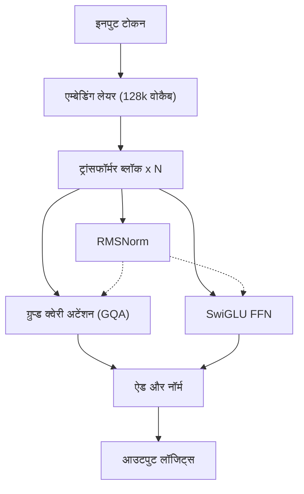
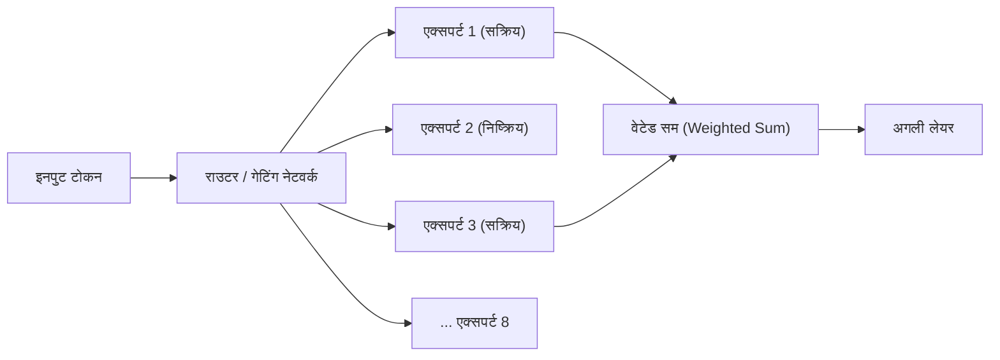
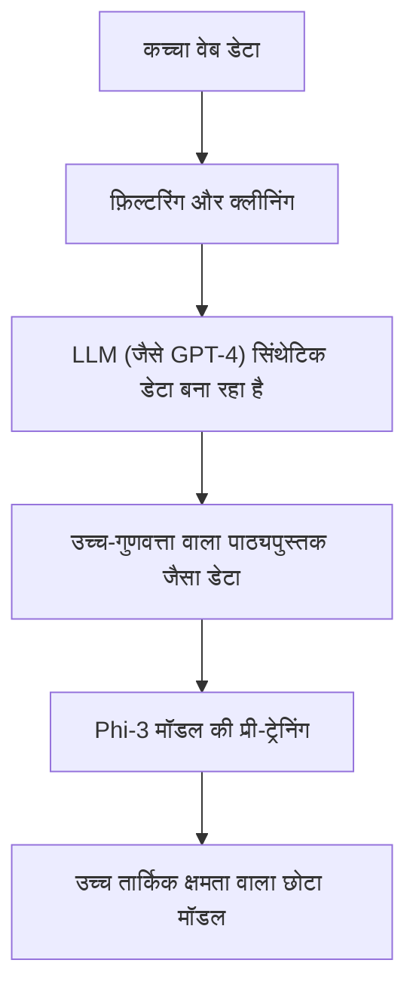
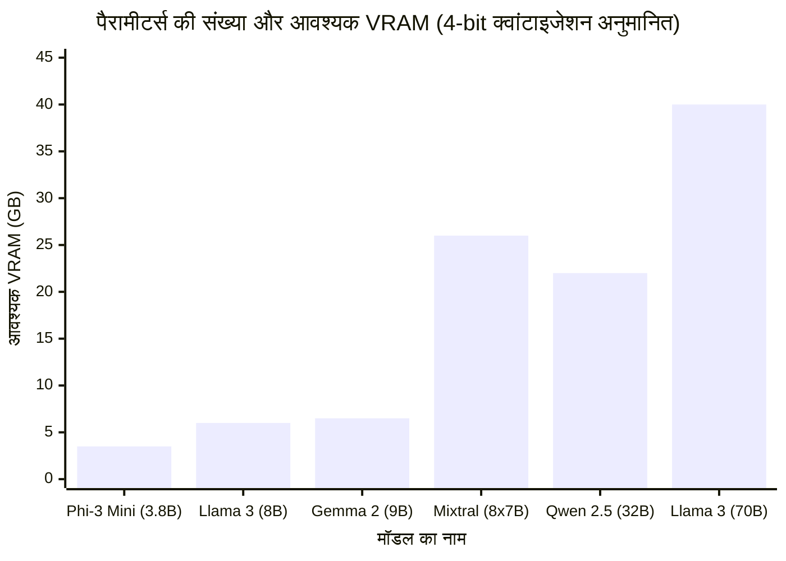

# परिचय (Introduction)

हाल के वर्षों में, लार्ज लैंग्वेज मॉडल (LLM) तकनीक का विकास उल्लेखनीय रहा है, और ChatGPT तथा Claude जैसी क्लाउड-आधारित AI सेवाएं व्यापक रूप से लोकप्रिय हो गई हैं। हालांकि, इसके साथ ही, "हम अपने गोपनीय डेटा को बाहरी सर्वर पर नहीं भेजना चाहते", "हम API की लागत को कम करना चाहते हैं", और "हम एक AI सिस्टम बनाना चाहते हैं जो पूरी तरह से ऑफलाइन काम करे" जैसी ज़रूरतें भी तेज़ी से बढ़ रही हैं।

इन मांगों को पूरा करने के लिए "लोकल LLM (ओपन सोर्स LLM)" हैं, जिन्हें आप सीधे अपने पीसी या इन-हाउस सर्वर पर डाउनलोड करके चला सकते हैं। 2023 तक लोकल मशीन पर व्यावहारिक सटीकता प्राप्त करना मुश्किल था, लेकिन मॉडल आर्किटेक्चर के विकास और क्वांटाइजेशन (Quantization) तकनीक की प्रगति के कारण, अब उपभोक्ता-ग्रेड GPU (जैसे NVIDIA RTX 3090 / 4090 या Mac के Apple Silicon) पर भी बहुत शक्तिशाली LLM को तेज़ी से चलाना संभव हो गया है।

इस लेख में, हम कई ओपन सोर्स LLM में से "5 अनुशंसित मॉडल" चुनेंगे, जिन्हें 2026 तक विशेष रूप से उत्कृष्ट माना गया है। हम उनके आर्किटेक्चर की विशेषताओं, पैरामीटर की संख्या, GGUF क्वांटाइजेशन के कारण मेमोरी की आवश्यकता, और विशिष्ट उपयोग के मामलों तक, अत्यंत विस्तृत और तकनीकी दृष्टिकोण से तुलना और व्याख्या करेंगे।

---

# लोकल LLM क्यों चलाएं?

लोकल LLM को अपनाने के कई अनूठे फायदे हैं जो क्लाउड-आधारित API में नहीं होते हैं।

### 1. पूर्ण प्राइवेसी और सुरक्षा सुनिश्चित करना
क्लाउड API का उपयोग करते समय, इनपुट किए गए प्रॉम्प्ट और डेटा बाहरी कंपनी के सर्वर पर भेजे जाते हैं। व्यक्तिगत या कॉर्पोरेट गोपनीय जानकारी को संभालते समय यह एक गंभीर जोखिम है। लोकल LLM के साथ, डेटा पूरी तरह से आपके डिवाइस के भीतर प्रोसेस होता है, जिससे बाहरी डेटा लीक के जोखिम को शून्य किया जा सकता है।

### 2. लागत में भारी कमी
वाणिज्यिक API (जैसे OpenAI API) पे-एज़-यू-गो (pay-as-you-go) बिलिंग सिस्टम पर आधारित होते हैं, जो इनपुट और आउटपुट टोकन की संख्या पर निर्भर करते हैं। यदि आप बड़ी मात्रा में दस्तावेज़ प्रोसेस करते हैं या लगातार चैटबॉट चलाते हैं, तो मासिक लागत हज़ारों से लाखों रुपये तक हो सकती है। दूसरी ओर, लोकल LLM के साथ, आप हार्डवेयर के शुरुआती निवेश और बिजली के खर्च के बाद असीमित टोकन का कितनी भी बार उपयोग कर सकते हैं।

### 3. कस्टमाइज़ेशन और ऑफलाइन उपयोग
ओपन सोर्स LLM के साथ, अपने स्वयं के डेटासेट का उपयोग करके फाइन-ट्यूनिंग (जैसे LoRA) करना आसान है। इसके अलावा, चूंकि यह इंटरनेट कनेक्शन के बिना पूरी तरह से ऑफलाइन वातावरण या सुरक्षित बंद नेटवर्क में चल सकता है, इसलिए यह एज (edge) डिवाइस में एम्बेड करने के लिए भी आदर्श है।

---

# लोकल LLM चलाने के लिए बुनियादी ज्ञान

मॉडल्स के परिचय से पहले, आइए "VRAM आवश्यकता" और "क्वांटाइजेशन (Quantization)" को गणितीय रूप से समझ लें, जो लोकल वातावरण में LLM चलाने के लिए अपरिहार्य हैं।

## VRAM (वीडियो मेमोरी) और क्वांटाइजेशन की गणितीय नींव

LLM को GPU पर इनफेरेंस (inference) कराने के लिए, मॉडल के पैरामीटर्स (वज़न) को VRAM में लोड करना आवश्यक है। मॉडल की मेमोरी आवश्यकता $M$ का अनुमान निम्नलिखित सूत्र द्वारा लगाया जा सकता है।

$$ M = \frac{P \times B}{8} + C $$

यहाँ,
- $M$: आवश्यक मेमोरी क्षमता (GB)
- $P$: पैरामीटर्स की संख्या (Billion = 1 अरब)
- $B$: प्रति पैरामीटर बिट्स की संख्या (FP16 के लिए 16 बिट्स, 4-bit क्वांटाइजेशन के लिए 4 बिट्स)
- $C$: कॉन्टेक्स्ट विंडो (KV कैश) या इनफेरेंस ओवरहेड (आमतौर पर मॉडल के आकार का 20% से 30% अनुमानित)

उदाहरण के लिए, यदि 8 बिलियन (8B) पैरामीटर्स वाले मॉडल को 16-बिट फ्लोटिंग पॉइंट (FP16) पर चलाया जाता है, तो
$$ M_{FP16} = \frac{8 \times 16}{8} = 16 \text{ GB} $$
होगा। इसके अलावा KV कैश आदि पर विचार करने पर लगभग 18GB से 20GB VRAM की आवश्यकता होगी, जिसे सामान्य गेमिंग पीसी पर चलाना मुश्किल हो जाता है।

### GGUF फॉर्मेट का उदय

यहीं पर "क्वांटाइजेशन (Quantization)" की भूमिका आती है। यह पैरामीटर की सटीकता को FP16 से 8-बिट, 4-बिट या चरम मामलों में 2-बिट तक कम करके, मॉडल के प्रदर्शन में गिरावट को न्यूनतम रखते हुए आवश्यक मेमोरी को नाटकीय रूप से कम करने की तकनीक है।

वर्तमान में सबसे लोकप्रिय फॉर्मेट **GGUF (GPT-Generated Unified Format)** है, जिसे Georgi Gerganov (llama.cpp के डेवलपर) द्वारा विकसित किया गया है। GGUF एक बाइनरी फॉर्मेट है जो CPU और GPU दोनों पर कुशलतापूर्वक इनफेरेंस करने के लिए है, और यह विशेष रूप से Mac (Apple Silicon) के Unified Memory आर्किटेक्चर के साथ बहुत अच्छी तरह से काम करता है।

यदि 8B मॉडल को 4-bit (उदाहरण: Q4_K_M) में क्वांटाइज किया जाए, तो मेमोरी की गणना इस प्रकार होगी:

$$ M_{4bit} = \frac{8 \times 4.5}{8} = 4.5 \text{ GB} $$
*चूंकि Q4_K_M कुछ वेट्स (weights) में उच्च सटीकता बनाए रखता है, इसलिए प्रभावी बिट्स की संख्या लगभग 4.5 बिट्स हो जाती है।*

इसके परिणामस्वरूप, केवल 8GB VRAM वाले एंट्री-लेवल GPU या सामान्य लैपटॉप भी 8B क्लास के शक्तिशाली LLM को स्थानीय रूप से सुचारू रूप से चला सकते हैं।

---

# अनुशंसित लोकल LLM के 5 मॉडल

आइए 5 ऐसे ओपन सोर्स LLM को देखें जिन्हें दुनिया भर के डेवलपर्स और AI रिसर्चर्स द्वारा सबसे अधिक समर्थन प्राप्त है।

## 1. Llama 3 (Meta)

Meta द्वारा विकसित "Llama 3" सीरीज़, ओपन सोर्स LLM का वास्तविक उद्योग मानक (de facto standard) बन गई है।

### आर्किटेक्चर का विकास और विशेषताएँ

Llama 3 स्टैंडर्ड ट्रांसफॉर्मर आर्किटेक्चर का उपयोग करता है, लेकिन पिछली पीढ़ी (Llama 2) की तुलना में इसमें कई तकनीकी सुधार किए गए हैं। विशेष रूप से ध्यान देने योग्य बिंदु इस प्रकार हैं:

- **GQA (Grouped Query Attention) का मानक उपयोग**: Llama 2 में GQA केवल बड़े मॉडल्स में उपयोग किया गया था, लेकिन Llama 3 में इसे 8B जैसे छोटे मॉडल्स में भी अपनाया गया है। इससे KV कैश का मेमोरी उपयोग काफी कम हो जाता है, जिससे लंबे कॉन्टेक्स्ट में भी तेज़ इनफेरेंस संभव होता है।
- **शब्दावली (Vocabulary) आकार का विस्तार**: टोकनाइज़र (Tiktoken आधारित) का शब्दावली आकार 128,000 टोकन तक बढ़ा दिया गया है, जिससे बहुभाषी और प्रोग्रामिंग कोड की कम्प्रेशन एफिशिएंसी में नाटकीय रूप से सुधार हुआ है। Llama 2 की तुलना में जापानी/अन्य भाषाओं की प्रोसेसिंग एफिशिएंसी भी कई गुना बेहतर हो गई है।



### पैरामीटर आकार और उपयोग के मामले

- **Llama 3 8B**: 8 बिलियन पैरामीटर्स। 4-bit क्वांटाइजेशन के साथ यह लगभग 5GB मेमोरी में चलता है। इसकी प्रतिक्रिया बहुत तेज़ है, और यह पीसी पर पर्सनल असिस्टेंट या लोकल RAG (Retrieval-Augmented Generation) सिस्टम के कोर के लिए आदर्श है।
- **Llama 3 70B**: 70 बिलियन पैरामीटर्स। 4-bit क्वांटाइजेशन के साथ लगभग 40GB VRAM (या Apple Silicon की Unified Memory) की आवश्यकता होती है। इसका प्रदर्शन क्लाउड के GPT-4 के करीब है, और यह उन्नत तर्क, जटिल कोडिंग, और डेटा विश्लेषण में शक्तिशाली है।

Llama 3 को कम्युनिटी से सबसे अधिक समर्थन प्राप्त है, और इसका सबसे बड़ा फायदा यह है कि GGUF, AWQ, और EXL2 जैसे सभी क्वांटाइजेशन फॉर्मेट्स तुरंत उपलब्ध होते हैं।

---

## 2. Mistral / Mixtral (Mistral AI)

फ्रांसीसी AI स्टार्टअप "Mistral AI" द्वारा प्रदान किए गए मॉडल ने अपनी दक्षता और पैराडाइम-शिफ्टिंग आर्किटेक्चर के साथ उद्योग को चौंका दिया।

### MoE (Mixture of Experts) का तंत्र

"Mixtral 8x7B" ओपन सोर्स LLM के रूप में **MoE (Mixture of Experts)** आर्किटेक्चर को पूर्ण रूप से अपनाने वाला पहला सफल मॉडल था।
MoE का मतलब है कि पूरे मॉडल (लगभग 47 बिलियन पैरामीटर्स) में 8 "एक्सपर्ट नेटवर्क" होते हैं, और प्रत्येक इनपुट टोकन के लिए केवल 2 सबसे उपयुक्त एक्सपर्ट्स को गतिशील रूप से चुना (राउटर द्वारा) जाता है।



इस आर्किटेक्चर का सबसे बड़ा लाभ यह है कि "यद्यपि पैरामीटर्स की संख्या बहुत बड़ी है, इनफेरेंस के दौरान गणना किए गए पैरामीटर्स (सक्रिय पैरामीटर्स) कम होते हैं।" Mixtral 8x7B के मामले में, इनफेरेंस के दौरान केवल 13B के बराबर पैरामीटर्स सक्रिय होते हैं। यह 70B श्रेणी के उच्च प्रदर्शन को बनाए रखते हुए इनफेरेंस की गति में नाटकीय रूप से सुधार करता है।

### प्रदर्शन और उपयोग के मामले

- **Mistral 7B / Mistral Nemo (12B)**: सिंगल डेंस (Dense) मॉडल। बहुत हल्का होने के बावजूद, यह Apache 2.0 लाइसेंस के तहत व्यावसायिक उपयोग के लिए मुफ़्त है। कोडिंग और सारांश कार्यों में, यह समान आकार के अन्य मॉडल्स को पछाड़ते हुए बेहतरीन बेंचमार्क प्रदान करता है।
- **Mixtral 8x7B / 8x22B**: उन्नत MoE मॉडल। हालाँकि VRAM की आवश्यकता अधिक है (पूरे मॉडल को मेमोरी में लोड करना होता है, इसलिए 8x7B 4-bit के लिए लगभग 26GB), इनफेरेंस गति तेज़ है, जो इसे M2/M3 Max जैसे Mac वातावरण में लोकल सर्वर बनाने के लिए बहुत उपयुक्त बनाता है।

---

## 3. Gemma 2 (Google)

Google द्वारा विकसित "Gemma" सीरीज़, उनके अत्याधुनिक "Gemini" मॉडल की तकनीक पर आधारित एक ओपन मॉडल है। अपनी दूसरी पीढ़ी के रूप में, Gemma 2 ने अपने आर्किटेक्चर में बड़े बदलाव किए हैं।

### अद्वितीय आर्किटेक्चर डिज़ाइन

Gemma 2 ने कुछ अद्वितीय डिज़ाइन अपनाए हैं जो इसे अन्य LLMs से अलग बनाते हैं:

- **लॉजिट सॉफ्ट-कैपिंग (Logit Soft-capping)**: यह तकनीक असामान्य रूप से बड़े लॉजिट मानों को उत्पन्न होने से रोकती है, जिससे ट्रेनिंग और इनफेरेंस की स्थिरता बढ़ती है।
- **स्लाइडिंग विंडो अटेंशन (SWA) और लोकल अटेंशन का हाइब्रिड**: हर लेयर में फुल अटेंशन करने के बजाय, यह उन लेयर्स को एकांतर रूप से रखता है जो केवल स्थानीय कॉन्टेक्स्ट को देखती हैं और जो पूरे कॉन्टेक्स्ट को देखती हैं।

SWA में गणना में कमी को गणितीय रूप से इस प्रकार दर्शाया जा सकता है। सामान्य Self-Attention की जटिलता $O(N^2)$ की तुलना में, विंडो आकार $W$ के साथ SWA की जटिलता निम्न प्रकार होती है:

$$ \text{Complexity}_{SWA} = O(N \times W) $$

यहाँ, $N$ अनुक्रम की लंबाई (Sequence Length) है, और $W$ एक निश्चित विंडो आकार है। जैसे-जैसे $N$ बढ़ता है (लंबे टेक्स्ट को इनपुट करते समय), SWA के कारण कंप्यूटेशनल संसाधनों को बचाने का प्रभाव बहुत बड़ा हो जाता है।

### प्रदर्शन और उपयोग के मामले

- **Gemma 2 2B / 9B**: 2B मॉडल जो स्मार्टफोन या Raspberry Pi जैसे अत्यंत छोटे संसाधन वाले वातावरण में चल सकता है, और सामान्य पीसी के लिए 9B मॉडल। विशेष रूप से 9B मॉडल कई कार्यों में Llama 3 8B से बेहतर बेंचमार्क परिणाम देता है, और यह वर्तमान में 10B से कम के सबसे मजबूत मॉडल्स में से एक है।
- **Gemma 2 27B**: 27 बिलियन पैरामीटर्स। इसका "आदर्श आकार" इसकी विशेषता है जो 4-बिट या 6-बिट क्वांटाइजेशन के साथ 24GB VRAM (RTX 3090 / 4090 आदि) में पूरी तरह से फिट बैठता है। यह प्रोग्रामिंग और जटिल निर्देशों को समझने में मजबूत है, और उत्साही लोगों के बीच बहुत लोकप्रिय है।

---

## 4. Qwen 2.5 (Alibaba Cloud)

Alibaba Cloud द्वारा विकसित Qwen सीरीज़, विशेष रूप से बहुभाषी प्रसंस्करण, कोडिंग और गणितीय तर्क में दुनिया के शीर्ष मॉडल्स में से एक है।

### बहुभाषी समर्थन और कोडिंग क्षमताएँ

Qwen 2.5 को एक विशाल बहुभाषी कॉर्पस पर प्री-ट्रेन किया गया है, और अंग्रेजी और चीनी के साथ-साथ, **जापानी (और अन्य भाषाओं) के स्वाभाविक आउटपुट में इसने अत्यंत उच्च मूल्यांकन** प्राप्त किया है। गैर-अंग्रेजी उपयोगकर्ताओं के लिए "अस्वाभाविक अनुवाद जैसी भाषा नहीं होना" सबसे बड़ा लाभ है।
इसके अलावा, प्रोग्रामिंग क्षमताओं में विशेषज्ञता वाला "Qwen 2.5 Coder" मॉडल भी है, जिसे VSCode एक्सटेंशन (जैसे Continue) से जोड़कर लोकल GitHub Copilot विकल्प के रूप में उपयोग करने के मामले तेज़ी से बढ़ रहे हैं।

### आर्किटेक्चर और उपयोग के मामले

- **टाई वर्ड एम्बेडिंग्स (Tie Word Embeddings)**: इनपुट एम्बेडिंग लेयर और आउटपुट लेयर के वेट्स (weights) को साझा (Tie) करके, यह मॉडल पैरामीटर्स को बचाता है और कुशलतापूर्वक सीखता है।
- **RoPE (Rotary Position Embedding) का विस्तार**: यह अधिकतम 128K टोकन तक की लंबी कॉन्टेक्स्ट विंडो का समर्थन करता है, जिससे विशाल PDF पढ़ना या स्थानीय रूप से हज़ारों लाइनों के सोर्स कोड का पूरा विश्लेषण करना संभव हो जाता है।

मॉडल के आकार 0.5B, 1.5B, 3B, 7B, 14B, 32B, 72B के रूप में बहुत बारीकी से उपलब्ध हैं, और Qwen का एक आकर्षक पहलू यह है कि आप अपने हार्डवेयर विनिर्देशों (VRAM क्षमता) की सीमा के बिल्कुल करीब का आकार चुन सकते हैं।

---

## 5. Phi-3 / Phi-3.5 (Microsoft)

Phi सीरीज़ Microsoft के इस दृष्टिकोण से पैदा हुई है कि "Textbook is all you need" (पाठ्यपुस्तक ही सब कुछ है)।

### SLM (Small Language Model) की क्रांति

हाल ही में LLM विकास में "बस पैरामीटर्स और डेटा की मात्रा बढ़ाएं" की ब्रूट-फोर्स रणनीति मुख्यधारा थी, लेकिन Microsoft ने साबित कर दिया कि "यदि हम मॉडल को दिए गए डेटा की गुणवत्ता (उच्च-गुणवत्ता वाला पाठ्यपुस्तक डेटा या सिंथेटिक डेटा) को अत्यधिक बढ़ा देते हैं, तो छोटे पैरामीटर्स के साथ भी GPT-3.5 वर्ग की बुद्धिमत्ता प्राप्त की जा सकती है।"
Phi-3 को LLM (Large Language Model) के बजाय **SLM (Small Language Model)** कहा जाता है।



### प्रदर्शन और उपयोग के मामले

- **Phi-3 Mini (3.8B)**: यह मॉडल स्मार्टफोन पर मूल रूप से चलने (ONNX Runtime आदि का उपयोग करके) के लिए डिज़ाइन किया गया है। केवल 4B से कम पैरामीटर्स होने के बावजूद, इसकी इनफेरेंस और तार्किक सोच क्षमता आश्चर्यजनक रूप से उच्च है, और सरल प्रश्न-उत्तर या टेक्स्ट फ़ॉर्मेटिंग कार्यों को तुरंत पूरा कर सकता है।
- **Phi-3.5 Vision / MoE**: छवियों को पहचानने में सक्षम विजन मॉडल और MoE संस्करण भी जारी किए गए हैं।

एज (edge) डिवाइस पर लोकल AI को लागू करने, मोबाइल ऐप्स में एम्बेड करने, या बैकग्राउंड में लगातार चलने वाले अल्ट्रा-लाइटवेट एजेंट के रूप में Phi-3 सीरीज़ बेजोड़ है।

---

# मॉडल्स की तकनीकी तुलना और बेंचमार्क

यहाँ, आइए लोकल वातावरण में चलाए जाने पर प्रस्तुत मॉडल्स की "VRAM आवश्यकता" और "इनफेरेंस गति" की मात्रात्मक दृष्टिकोण से तुलना करें।

## पैरामीटर्स की संख्या और VRAM की आवश्यकता के बीच संबंध (GGUF 4-bit क्वांटाइजेशन पर)

नीचे दिया गया ग्राफ़ प्रत्येक मॉडल के पैरामीटर्स की संख्या के विरुद्ध इनफेरेंस के लिए आवश्यक VRAM (KV कैश ओवरहेड सहित) का अनुमान दर्शाता है।



*यद्यपि Mixtral 8x7B में बड़ी मात्रा में पैरामीटर्स होते हैं और यह अधिक VRAM खपत करता है, गणना स्वयं हल्की होती है, इसलिए GPU गणना संसाधनों (CUDA कोर आदि) पर भार कम होता है।*

## इनफेरेंस गति (Tokens/sec) की सैद्धांतिक गणना

लोकल LLM की इनफेरेंस गति GPU की "मेमोरी बैंडविड्थ (Memory Bandwidth)" पर बहुत अधिक निर्भर करती है। ऐसा इसलिए है क्योंकि जनरेशन फेज़ (डिकोडिंग) में, प्रत्येक टोकन उत्पन्न होने पर मॉडल के सभी वेट्स को मेमोरी से पढ़ना पड़ता है। यह एक मेमोरी-बाउंड (Memory-bound) प्रक्रिया है, न कि कंप्यूट-बाउंड (Compute-bound)।

सैद्धांतिक अधिकतम इनफेरेंस गति $T$ (Tokens/sec) की गणना निम्न सूत्र से की जाती है:

$$ T = \frac{\text{BW}}{M_{\text{weights}}} $$

यहाँ,
- $\text{BW}$: GPU की प्रभावी मेमोरी बैंडविड्थ (GB/s)
- $M_{\text{weights}}$: मॉडल का लोड किया गया आकार (GB)

उदाहरण के लिए, NVIDIA RTX 4090 (मेमोरी बैंडविड्थ 1,008 GB/s) पर Llama 3 8B (4-bit संस्करण, लगभग 4.5 GB) चलाने की गणना करते हैं। यदि हम मानते हैं कि प्रभावी बैंडविड्थ सैद्धांतिक मूल्य का लगभग 80% (लगभग 800 GB/s) है:

$$ T \approx \frac{800}{4.5} \approx 177 \text{ Tokens/sec} $$

यह मनुष्य के पढ़ने की गति से कहीं अधिक तेज़ गति है। दूसरी ओर, यदि आप उसी RTX 4090 पर Llama 3 70B (4-bit संस्करण लगभग 40GB *2 GPUs में विभाजित करने की स्थिति में*) चलाते हैं, तो टोकन जनरेशन गति लगभग 20 Tokens/sec तक गिर जाती है। इस प्रकार, आप अपने पीसी के विनिर्देशों के आधार पर गणितीय रूप से भविष्यवाणी कर सकते हैं कि "आउटपुट कितनी तेज़ी से जनरेट होगा।"

---

# लोकल LLM चलाने के लिए टूल्स

इन शक्तिशाली ओपन सोर्स LLM को लोकल वातावरण में चलाने के लिए सॉफ़्टवेयर इकोसिस्टम वर्तमान में बहुत समृद्ध है। यहाँ तीन प्रतिनिधि टूल्स दिए गए हैं:

### 1. Ollama
वर्तमान में, यह सबसे आसान और सबसे लोकप्रिय टूल है। Docker की तरह, यह एक सिंगल कमांड के साथ मॉडल को डाउनलोड करने से लेकर उसे चलाने तक का काम करता है। यह Mac, Windows और Linux सभी को सपोर्ट करता है।
बस अपना टर्मिनल खोलें और Llama 3 शुरू करने के लिए निम्नलिखित कमांड टाइप करें:

```bash
ollama run llama3
```
इसके अलावा, Ollama बैकग्राउंड में REST API सर्वर के रूप में काम करता है, जिससे इसे Python स्क्रिप्ट्स या बाहरी एप्लिकेशन के साथ एकीकृत करना बहुत आसान हो जाता है।

### 2. LM Studio
यह उन लोगों के लिए अनुशंसित है जो GUI-आधारित सहज संचालन चाहते हैं। आप ऐप के भीतर से Hugging Face की विशाल GGUF मॉडल्स की सूची खोज और डाउनलोड कर सकते हैं, और ChatGPT जैसी चैट स्क्रीन पर बातचीत का आनंद ले सकते हैं। इसकी वह सुविधा बहुत उपयोगी है जो आपको दृष्टिगत रूप से बताती है कि कौन सा मॉडल आपके पीसी की RAM/VRAM में फिट होगा।

### 3. llama.cpp
यह C/C++ इम्प्लीमेंटेशन वाली लाइब्रेरी है जिसने लोकल LLM बूम को जन्म दिया और यह सब का आधार है। यह उन इंजीनियरों के लिए है जो चरम प्रदर्शन ट्यूनिंग चाहते हैं, या हैकर्स के लिए जो इसे अपनी खुद की स्क्रिप्ट में एम्बेड करना चाहते हैं। यह Apple के Metal, NVIDIA के CUDA, AMD के ROCm और यहाँ तक कि Intel के AVX इंस्ट्रक्शन सेट जैसे सभी हार्डवेयर की क्षमता को अधिकतम सीमा तक बढ़ा देता है।

---

# निष्कर्ष और भविष्य की संभावनाएँ

इस लेख में, हमने 2026 तक के शीर्ष 5 ओपन सोर्स/लोकल LLMs का परिचय दिया और उनके आर्किटेक्चर तथा तकनीकी पृष्ठभूमि की व्याख्या की। उद्देश्य के अनुसार चुनने का सारांश इस प्रकार है:

1. **यदि आप समग्र संतुलन और इकोसिस्टम को महत्व देते हैं**: `Llama 3 (8B / 70B)`
2. **यदि आप Mac जैसे बड़ी Unified Memory वाले वातावरण में तेज़ इनफेरेंस चाहते हैं**: `Mixtral 8x7B`
3. **यदि आप 24GB क्लास VRAM के साथ अधिकतम बुद्धिमत्ता निकालना चाहते हैं**: `Gemma 2 27B` या `Qwen 2.5 32B`
4. **यदि आपका उद्देश्य प्राकृतिक भाषा (जापानी/अन्य) आउटपुट और उन्नत कोडिंग सहायता है**: `Qwen 2.5`
5. **यदि आप स्मार्टफोन, कमज़ोर पीसी या बैकग्राउंड में अल्ट्रा-लाइटवेट प्रोसेसिंग चाहते हैं**: `Phi-3 / Phi-3.5`

ओपन सोर्स LLMs के विकास की गति आश्चर्यजनक है, और हर कुछ महीनों में ऐसे बड़े बदलाव घोषित किए जाते हैं जो पिछली धारणाओं को उलट देते हैं। भविष्य में, क्वांटाइजेशन तकनीक के और सुधार और नए आर्किटेक्चर के आगमन के साथ, वह दिन दूर नहीं जब लोकल वातावरण क्लाउड AI से आगे निकल जाएगा।
कृपया अपने हार्डवेयर वातावरण के अनुकूल सर्वोत्तम मॉडल डाउनलोड करें और लोकल AI की अपार स्वतंत्रता और संभावनाओं का अनुभव करें।

