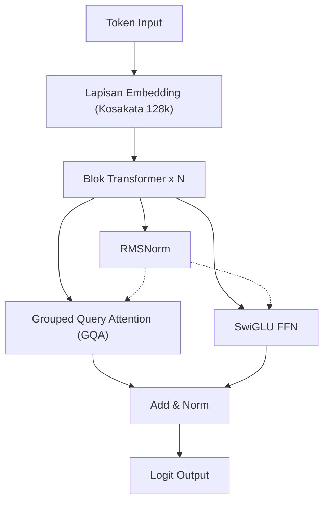
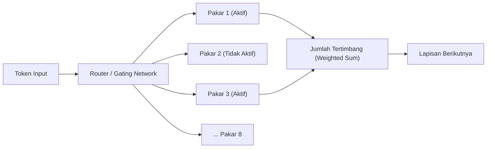
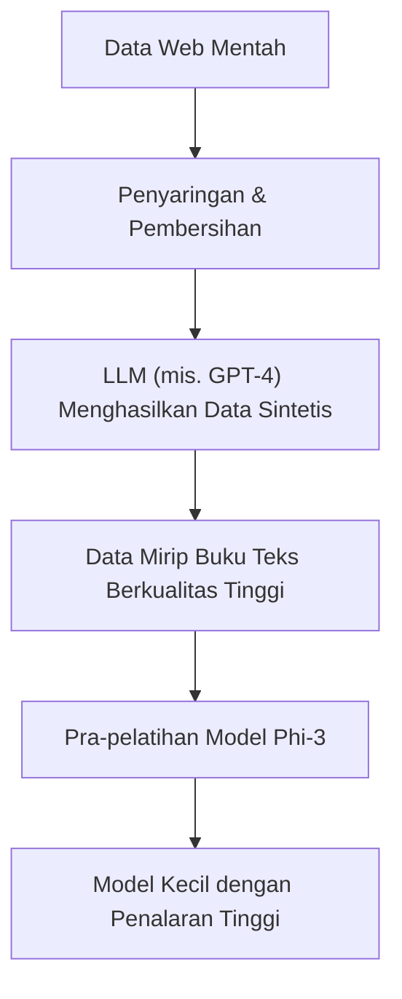
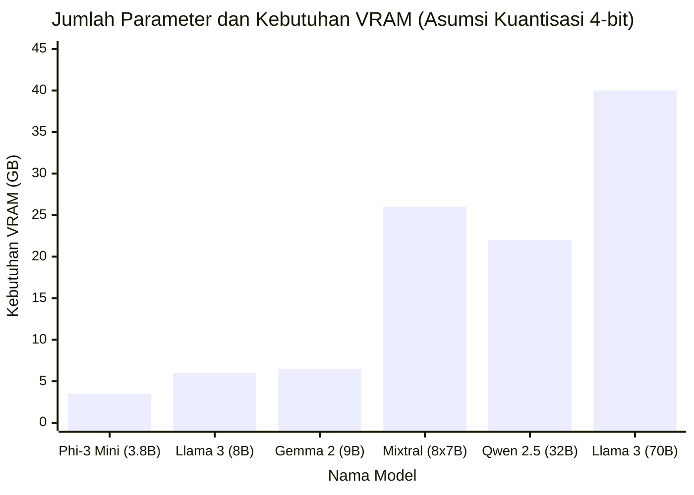

# Pendahuluan

Dalam beberapa tahun terakhir, evolusi teknologi Large Language Models (LLM) sangat luar biasa, dan layanan AI berbasis cloud seperti ChatGPT serta Claude telah tersebar luas. Namun di sisi lain, kebutuhan untuk "tidak mengirimkan data rahasia perusahaan ke server eksternal", "menekan biaya penggunaan API", dan "membangun sistem AI yang beroperasi sepenuhnya offline" meningkat dengan pesat.

Untuk memenuhi permintaan ini, hadirlah "LLM Lokal (LLM Open Source)" yang dapat diunduh dan dijalankan secara langsung di PC sendiri maupun server perusahaan. Hingga sekitar tahun 2023, sulit untuk mendapatkan akurasi yang praktis secara lokal, tetapi berkat evolusi arsitektur model dan pengembangan teknologi kuantisasi (Quantization), kini LLM dengan kinerja sangat tinggi pun dapat dijalankan dengan lancar bahkan pada GPU konsumen (seperti NVIDIA RTX 3090 / 4090 atau Apple Silicon pada Mac).

Dalam artikel ini, dari sekian banyak LLM open source yang ada, kami memilih "5 Rekomendasi Model Terbaik" yang dinilai sangat unggul pada tahun 2026. Kami akan membandingkan dan menjelaskan secara menyeluruh dari sudut pandang teknis yang sangat mendetail: mulai dari karakteristik arsitektur masing-masing model, jumlah parameter, kebutuhan memori melalui kuantisasi GGUF, hingga kasus penggunaan yang spesifik.

---

# Mengapa Menjalankan LLM Secara Lokal?

Penerapan LLM lokal memiliki banyak keunggulan unik yang tidak terdapat pada API berbasis cloud.

### 1. Memastikan Keamanan dan Privasi Penuh
Saat menggunakan API cloud, prompt atau data yang Anda masukkan akan dikirimkan ke server perusahaan eksternal. Hal ini merupakan risiko yang besar saat menangani informasi pribadi atau data rahasia perusahaan. Dengan LLM lokal, data diproses sepenuhnya di dalam perangkat, sehingga risiko kebocoran data ke luar dapat ditekan menjadi nol.

### 2. Pengurangan Biaya yang Signifikan
API komersial (seperti OpenAI API) menggunakan sistem penagihan prabayar sesuai dengan jumlah token input/output. Jika Anda memproses dokumen dalam jumlah besar atau menjalankan chatbot terus-menerus, biayanya bisa mencapai puluhan ribu hingga ratusan ribu yen per bulan. Sebaliknya, dengan LLM lokal, Anda dapat menggunakannya berkali-kali tanpa batas token hanya dengan investasi awal perangkat keras serta biaya listrik.

### 3. Kustomisasi dan Penggunaan Offline
LLM open source dapat dengan mudah disesuaikan (fine-tuning, seperti LoRA) menggunakan dataset milik Anda sendiri. Selain itu, model ini dapat dioperasikan di lingkungan yang sepenuhnya offline tanpa koneksi internet atau pada jaringan tertutup yang aman, sehingga sangat cocok untuk disematkan pada perangkat edge (edge devices).

---

# Pengetahuan Dasar untuk Menjalankan LLM Lokal

Sebelum masuk pada perkenalan model, mari kita pahami secara matematis "Kebutuhan VRAM" dan "Kuantisasi (Quantization)" yang tak terhindarkan untuk menjalankan LLM di lingkungan lokal.

## Dasar-dasar Matematika VRAM (Video Memori) dan Kuantisasi

Untuk melakukan inferensi LLM pada GPU, kita perlu memuat parameter (bobot) model ke dalam VRAM. Kebutuhan memori model $M$ dapat didekati dengan rumus berikut:

$$ M = \frac{P \times B}{8} + C $$

Di mana:
- $M$: Kapasitas memori yang dibutuhkan (GB)
- $P$: Jumlah parameter (Billion = Miliar)
- $B$: Jumlah bit per parameter (16 bit untuk FP16, 4 bit untuk kuantisasi 4-bit)
- $C$: Context window (KV cache) dan overhead selama inferensi (biasanya diperkirakan sekitar 20% hingga 30% dari ukuran model)

Sebagai contoh, jika Anda menjalankan model dengan 8 miliar (8B) parameter dalam presisi titik mengambang 16-bit (FP16):
$$ M_{FP16} = \frac{8 \times 16}{8} = 16 \text{ GB} $$
Selain itu, dengan mempertimbangkan KV cache dan sebagainya, dibutuhkan sekitar 18GB hingga 20GB VRAM, yang mana akan sangat sulit dijalankan pada PC gaming umum.

### Munculnya Format GGUF

Di sinilah peran dari "Kuantisasi (Quantization)". Dengan menurunkan presisi parameter dari FP16 menjadi 8-bit, 4-bit, atau dalam kasus ekstrem menjadi 2-bit, teknologi ini secara dramatis akan mengurangi jumlah memori yang dibutuhkan sekaligus meminimalkan penurunan performa model.

Format yang paling populer saat ini adalah **GGUF (GPT-Generated Unified Format)** yang dirancang oleh Georgi Gerganov (pengembang llama.cpp). GGUF adalah format biner untuk inferensi yang efisien baik pada CPU maupun GPU, dan memiliki karakteristik sangat kompatibel dengan arsitektur Unified Memory di Mac (Apple Silicon).

Perhitungan memori jika model 8B dikuantisasi menjadi 4-bit (contoh: Q4_K_M) adalah sebagai berikut:

$$ M_{4bit} = \frac{8 \times 4.5}{8} = 4.5 \text{ GB} $$
※Q4_K_M mempertahankan presisi yang lebih tinggi pada beberapa bobot tertentu, sehingga jumlah bit efektifnya sekitar 4.5 bit.

Dengan ini, bahkan GPU kelas entry level dengan VRAM 8GB atau laptop standar pun dapat menjalankan LLM kuat sekelas 8B dengan lancar secara lokal.

---

# 5 Rekomendasi Model LLM Lokal

Selanjutnya, kami akan memperkenalkan 5 LLM open source yang saat ini paling banyak didukung oleh para pengembang dan peneliti AI di seluruh dunia.

## 1. Llama 3 (Meta)

Dikembangkan oleh Meta, seri "Llama 3" menjadi standar industri (de facto) dalam dunia LLM open source.

### Evolusi dan Karakteristik Arsitektur

Meskipun menggunakan arsitektur Transformer standar, Llama 3 telah menambahkan berbagai penyempurnaan teknis dari generasi sebelumnya (Llama 2). Poin-poin berikut ini patut diperhatikan:

- **Pengadopsian Standar GQA (Grouped Query Attention)**: GQA, yang hanya digunakan untuk model skala besar di Llama 2, kini juga digunakan untuk model skala kecil seperti 8B pada Llama 3. Ini mengurangi penggunaan memori KV cache secara drastis, memungkinkan kecepatan inferensi tinggi bahkan pada konteks yang panjang.
- **Perluasan Ukuran Kosakata (Vocabulary)**: Ukuran kosakata tokenizer (berbasis Tiktoken) diperluas hingga 128.000 token, yang secara dramatis meningkatkan efisiensi kompresi dalam berbagai bahasa serta kode pemrograman. Efisiensi pemrosesan bahasa Jepang juga meningkat beberapa kali lipat dibandingkan dengan Llama 2.



### Ukuran Parameter dan Kasus Penggunaan

- **Llama 3 8B**: 8 miliar parameter. Berjalan dengan sekitar 5GB memori menggunakan kuantisasi 4-bit. Responsnya sangat cepat dan ideal sebagai asisten pribadi pada PC atau inti dari sistem RAG (Retrieval-Augmented Generation) lokal.
- **Llama 3 70B**: 70 miliar parameter. Membutuhkan sekitar 40GB VRAM (atau Unified Memory pada Apple Silicon) dengan kuantisasi 4-bit. Memiliki kinerja yang mendekati GPT-4 di cloud, serta sangat andal dalam penalaran tingkat lanjut, pengodean kompleks, dan analisis data.

Dukungan komunitas adalah keunggulan terbesar Llama 3, dengan berbagai format kuantisasi seperti GGUF, AWQ, dan EXL2 tersedia secara langsung.

---

## 2. Mistral / Mixtral (Mistral AI)

Model yang ditawarkan oleh startup AI asal Prancis, "Mistral AI", mengejutkan industri karena efisiensi dan arsitekturnya yang membawa pergeseran paradigma.

### Mekanisme MoE (Mixture of Experts)

"Mixtral 8x7B" meraih kesuksesan besar sebagai model LLM open source pertama yang mengadopsi secara utuh arsitektur **MoE (Mixture of Experts)**.
MoE merupakan mekanisme di mana terdapat 8 "jaringan spesialis (Expert)" di dalam keseluruhan model (sekitar 47 miliar parameter), dan secara dinamis hanya mengarahkan (routing) dan mengaktifkan 2 spesialis paling optimal untuk tiap token input.



Kelebihan utama dari arsitektur ini adalah, "meskipun jumlah parameter total sangat besar, parameter aktif (Active Parameters) yang dihitung selama proses inferensi hanya sedikit". Untuk Mixtral 8x7B, yang diaktifkan pada saat inferensi hanya setara 13B. Hal ini meningkatkan kecepatan inferensi secara drastis dengan tetap mempertahankan kinerja setara dengan kelas 70B.

### Kinerja dan Kasus Penggunaan

- **Mistral 7B / Mistral Nemo (12B)**: Model dense tunggal. Sangat ringan namun bebas untuk penggunaan komersial dengan lisensi Apache 2.0. Dalam tugas pemrograman dan perangkuman, model ini mencetak skor benchmark luar biasa yang jauh melampaui model berukuran serupa lainnya.
- **Mixtral 8x7B / 8x22B**: Model MoE tingkat lanjut. Memiliki kebutuhan VRAM yang cukup tinggi (sekitar 26GB pada kuantisasi 4-bit untuk 8x7B karena keseluruhan model harus dimuat ke memori), namun karena kecepatan inferensinya tinggi, model ini sangat cocok untuk membangun server lokal di lingkungan Mac seperti M2/M3 Max.

---

## 3. Gemma 2 (Google)

Seri "Gemma" merupakan model open source yang dikembangkan oleh Google dengan memanfaatkan teknologi dari model termutakhir mereka, "Gemini". Sebagai generasi kedua, Gemma 2 telah secara signifikan mengubah arsitekturnya.

### Desain Arsitektur Unik

Gemma 2 mengadopsi beberapa desain unik yang berbeda dari LLM lain.

- **Logit Soft-capping**: Teknologi untuk mencegah dihasilkannya nilai logit yang besar secara tidak wajar, sehingga meningkatkan stabilitas pelatihan dan inferensi.
- **Hibrida Sliding Window Attention (SWA) dan Local Attention**: Alih-alih melakukan full attention di setiap lapisan, model ini menyusun lapisan yang hanya melihat pada konteks lokal dan lapisan yang melihat konteks keseluruhan secara bergantian.

Pengurangan komputasi pada SWA ditunjukkan secara matematis sebagai berikut. Berbanding lurus dengan jumlah komputasi Self-Attention biasa yang sebesar $O(N^2)$, jumlah komputasi SWA menggunakan ukuran jendela $W$ adalah:

$$ \text{Complexity}_{SWA} = O(N \times W) $$

Di mana, $N$ adalah panjang sekuens (sequence), dan $W$ adalah ukuran jendela tetap. Semakin besar $N$ (input teks semakin panjang), efek penghematan sumber daya komputasi melalui SWA menjadi semakin besar.

### Kinerja dan Kasus Penggunaan

- **Gemma 2 2B / 9B**: Versi 2B yang dapat berjalan di lingkungan sumber daya yang sangat kecil seperti smartphone dan Raspberry Pi, dan model 9B untuk PC umum. Model 9B secara khusus mampu menghasilkan skor benchmark yang melampaui Llama 3 8B di banyak tugas, dan saat ini menjadi salah satu model terkuat di kelas kurang dari 10B.
- **Gemma 2 27B**: 27 miliar parameter. Memiliki "ukuran ideal" yang pas untuk masuk ke VRAM 24GB (seperti RTX 3090 / 4090) dengan kuantisasi 4-bit atau 6-bit. Sangat tangguh dalam pemrograman dan instruksi bahasa yang kompleks, serta sangat populer di kalangan antusias (enthusiast).

---

## 4. Qwen 2.5 (Alibaba Cloud)

Seri Qwen yang dikembangkan oleh Alibaba Cloud merupakan model yang menawarkan kinerja berkelas dunia, terutama dalam pemrosesan multibahasa, pemrograman (coding), dan penalaran matematika.

### Dukungan Multibahasa dan Kemampuan Pemrograman

Qwen 2.5 telah dipra-pelatihankan pada korpus multibahasa dalam skala masif, tidak hanya bahasa Inggris dan Mandarin, tetapi juga **mendapat pujian tinggi untuk kelancaran bahasanya**. Keunggulan ini membuat hasil bahasanya tidak akan terasa kaku dan aneh seperti sekadar teks terjemahan.
Terdapat pula "Qwen 2.5 Coder", model yang khusus ditujukan untuk kemampuan pemrograman. Penggunaannya melonjak pesat sebagai alternatif lokal dari GitHub Copilot dengan menghubungkannya dengan ekstensi VSCode (seperti Continue).

### Arsitektur dan Kasus Penggunaan

- **Tie Word Embeddings**: Bobot antara lapisan masukan (Embedding layer) dan lapisan keluaran saling diikat (Tie), sebuah sistem yang diadopsi untuk proses pembelajaran yang efisien serta menghemat parameter model.
- **Perluasan RoPE (Rotary Position Embedding)**: Model ini mendukung context window sangat besar mencapai 128K token. Sangat memungkinkan untuk membaca PDF berukuran besar dan melakukan analisis terhadap puluhan ribu baris source code sekaligus secara lokal.

Ukuran model ditawarkan secara sangat bervariatif dari 0.5B, 1.5B, 3B, 7B, 14B, 32B, dan 72B. Daya tarik dari Qwen adalah kita dapat secara leluasa memilih ukuran yang pas hampir menyentuh batas kapasitas hardware yang kita punya (kapasitas VRAM).

---

## 5. Phi-3 / Phi-3.5 (Microsoft)

Dilahirkan dari paradigma "Textbook is all you need (Buku teks adalah segalanya)" yang diusulkan oleh Microsoft, muncullah seri Phi.

### Revolusi SLM (Small Language Model)

Pengembangan LLM beberapa tahun belakangan ini didominasi arus pergerakan utama "tingkatkan data dan parameter model setinggi-tingginya bagaimanapun juga". Tapi, Microsoft menunjukkan fakta bahwa "Jika kita memoles setinggi-tingginya kualitas data (data buku teks berkualitas serta sintetik), meskipun parameternya kecil, model ini bisa mendapatkan kecerdasan kelas GPT-3.5".
Phi-3 bukan lagi merupakan LLM (Large Language Model) namun dipanggil sebagai **SLM (Small Language Model)**.



### Kinerja dan Kasus Penggunaan

- **Phi-3 Mini (3.8B)**: Model yang memang ditujukan untuk dapat berjalan secara langsung (native) dari dalam perangkat pintar smartphone (menggunakan ONNX Runtime dan sebagainya). Meski hanya kurang dari 4B parameter, pemikiran logis serta cara menalar model ini cukup fantastis. Jawaban dari pertanyaan-pertanyaan simpel atau juga pemformatan kalimat dan paragraf teks dapat diselesaikan dengan sekedip mata.
- **Phi-3.5 Vision / MoE**: Model Vision yang mampu mengenali gambar dan edisi MoE juga sudah dirilis.

Seri Phi-3 tiada duanya untuk urusan implementasi di sisi perangkat aplikasi AI lokal (edge device), tersemat di aplikasi perangkat seluler, maupun tugas-tugas sebagai pelayan komputasi agen yang super enteng (super light-weight agent) yang aktif beroperasi pada background system perangkat.

---

# Perbandingan Teknis Model dan Benchmark

Sekarang, mari kita bandingkan "Kebutuhan VRAM" dan "Kecepatan Inferensi (Inference Speed)" dari model-model yang telah diperkenalkan ketika digunakan secara lokal, dengan menggunakan prespektif hitungan kuantitatif.

## Hubungan Antara Kebutuhan VRAM dan Jumlah Parameter (Saat Kuantisasi GGUF 4-bit)

Grafik di bawah memperlihatkan estimasi VRAM (termasuk perhitungan penggunaan dari KV cache overhead) yang dirasa cukup ketika model melakukan inferensi dengan parameter yang sebanding.



※ Mengingat parameter total Mixtral 8x7B itu raksasa, konsumsi VRAM akan membesar. Meski begitu, berkat bebannya yang enteng pada saat komputasi, ia akan menghemat sumber daya hitung milik GPU (misalnya core CUDA) agar tidak bekerja terlalu berat.

## Kalkulasi Teoretis pada Kecepatan Inferensi (Tokens/sec)

Kecepatan inferensi LLM lokal sangat dipengaruhi oleh lebar saluran laju bit dari "Bandwidth memori (Memory Bandwidth)" GPU-nya. Dikarenakan setiap dari 1 keluaran token hasil generasi di tahap dekode (decode phase), seutuhnya beban atau bobot per parameter mutlak harus terpanggil dari memori penyimpanannya. Jadi bisa diartikan proses yang berlaku adalah berbasis keterikatan memori (Memory-bound) dan bukanlah berbasis keterikatan komputasi (Compute-bound).

Rumus perumusan teoretis kecepatan inferensi maksimum $T$ (Tokens/sec) dikalkulasikan dengan:

$$ T = \frac{\text{BW}}{M_{\text{weights}}} $$

Di mana,
- $\text{BW}$: Bandwidth memori GPU efektif (GB/s)
- $M_{\text{weights}}$: Ukuran dari model yang dimuat (GB)

Sebagai permisalan pada NVIDIA RTX 4090 (Memory Bandwidth 1.008 GB/s), ketika menggerakkan model Llama 3 8B versi 4-bit (kisaran 4.5 GB). Jika kita anggap bandwidth-nya 80% efektif dari kecepatan maksimal teoretis (sekitar 800 GB/s):

$$ T \approx \frac{800}{4.5} \approx 177 \text{ Tokens/sec} $$

Ini adalah sebuah pergerakan ekstrim di atas ambang kenormalan batas laju pembacaan orang lazimnya. Sebaliknya, ketika menjankan program model Llama 3 70B menggunakan sistem perakitan piranti keras RTX 4090 tadi (model versi 4-bit membutuhkan sekitar 40GB VRAM ※ asumsikan kita memecahnya jadi 2 sistem GPU), daya pembuatan per token ada pada hitungan 20 Tokens/sec semata. Berdasarkan data peranti piranti komputer yang Anda punyai semacam di atas, Anda telah memegang kunci awal buat mengira-ngira dan mengetahui nilai hasil patokan akan teoretis sebuah "kecepatan seperti apa nantinya keluaran model" jika sudah dijalankan nanti.

---

# Alat untuk Menjalankan LLM Lokal

Ekosistem perangkat lunak yang memungkinkan pengoperasian LLM open source berkemampuan tinggi secara lokal saat ini juga sangat beragam. Berikut kami perkenalkan 3 aplikasi / alat pengembang utamanya.

### 1. Ollama
Saat ini piranti inilah yang terpopuler dan paling mudah dipakai. Sama seperti layanan Docker yang tinggal ketik perintah baris lantas proses pengunduhan berikut dengan tahap eksekusinya bisa jalan hanya dengan satu entakan belaka. Sistem bisa dinikmati melintasi sistem piranti semacam Mac, Windows, maupun Linux secara holistik.
Buka program terminal kalian dan hantamkan isyarat perintah bawah ini buat membangkitkan kejeniusan dari model Llama 3:

```bash
ollama run llama3
```
Karena Ollama ini bisa berjalan dalam mode pelayan eksekusi belakang layar (background REST API server), menjadikan upaya penyatuan skrip koding berbasis Python ke beragam aplikasi pihak ke tiga tak sulit bagi kalian wujudkan.

### 2. LM Studio
Sebuah usulan aplikasi bersaranakan GUI terkhusus pada audien yang berminat untuk memakainya via interaksi interaktif ramah dan kentara mata. Dari rupa aplikasinya kelak para audien diberi keleluasaan dalam menelisik barisan katalog model-model GGUF yang bertengger di Hugging Face yang langsung tertuju ke dalam tombol pengunduhan dan langsung menikmati kegenitan sapa obrolan ala sistem antarmuka pada ChatGPT. Di sinilah terletaknya suatu fungsi sangat krusial yaitu representasi penunjuk bagi pemakai awam yang memandu seberapa optimal rasio VRAM ataupun RAM dari komputernya sanggup memuat beban ukuran seberapa besar pada LLM-nya.

### 3. llama.cpp
Pemicu tren LLM lokal dan merupakan pustaka berbasis C/C++ yang menjadi fondasi dari semuanya. Piranti ini ditujukan bagi para insinyur yang ingin melakukan penyesuaian (tuning) performa hingga batas maksimal, atau peretas (hacker) yang ingin mengintegrasikannya ke dalam skrip mereka sendiri. Mulai dari Apple Metal, NVIDIA CUDA, AMD ROCm, hingga set instruksi Intel AVX, aplikasi ini akan memaksimalkan semua potensi terpendam perangkat keras Anda.

---

# Kesimpulan dan Prospek di Masa Depan

Pada artikel kali ini, kami telah memperkenalkan 5 model LLM open source terbaik di tahun 2026, beserta pembahasan mengenai arsitektur dan latar belakang teknologinya. Pilihan model berdasarkan tujuannya dapat dirangkum sebagai berikut:

1. **Jika memprioritaskan keseimbangan keseluruhan dan ekosistem**: `Llama 3 (8B / 70B)`
2. **Jika ingin inferensi berkecepatan tinggi di lingkungan Unified Memory berkapasitas besar seperti Mac**: `Mixtral 8x7B`
3. **Jika ingin memaksimalkan kepintaran dengan VRAM kelas 24GB**: `Gemma 2 27B` atau `Qwen 2.5 32B`
4. **Jika tujuannya adalah hasil bahasa yang alami dan dukungan coding tingkat lanjut**: `Qwen 2.5`
5. **Jika untuk pemrosesan super ringan di latar belakang, smartphone, atau PC berspesifikasi rendah**: `Phi-3 / Phi-3.5`

Kecepatan evolusi LLM open source sangatlah luar biasa, di mana setiap beberapa bulan muncul terobosan baru yang mengubah konsep yang ada sebelumnya. Ke depannya, berkat perkembangan lebih lanjut pada teknologi kuantisasi dan hadirnya arsitektur terbaru, masa di mana AI lokal mampu mengalahkan AI cloud mungkin segera tiba.
Silakan unduh model yang paling ideal dengan konfigurasi perangkat keras yang Anda miliki saat ini, dan rasakan betapa bebas serta besar potensi AI lokal yang berada di genggaman Anda.
