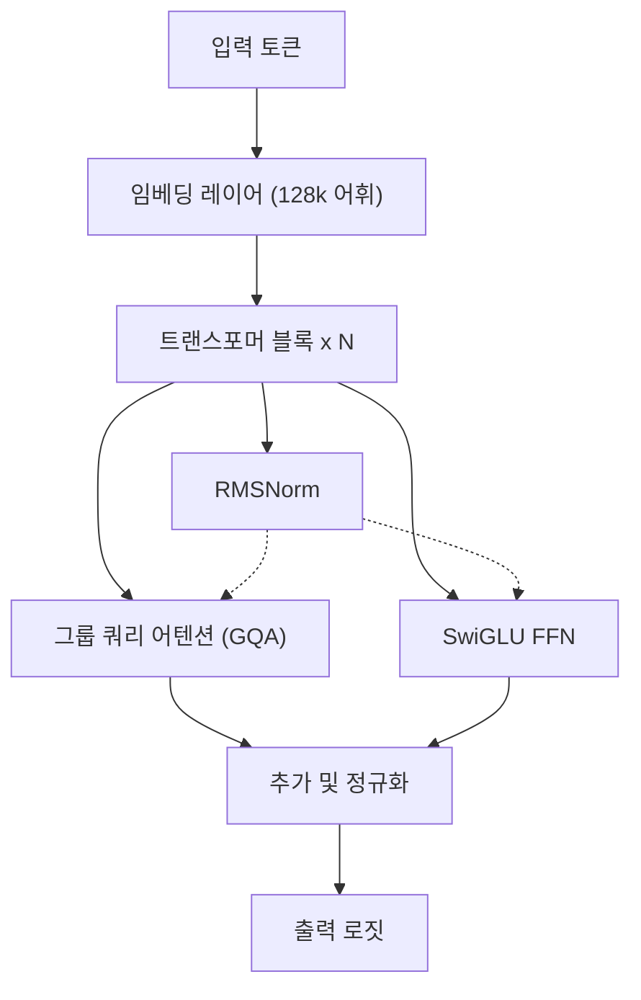
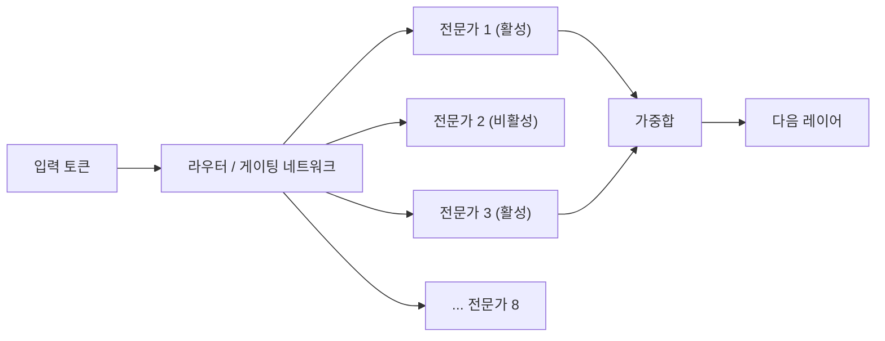
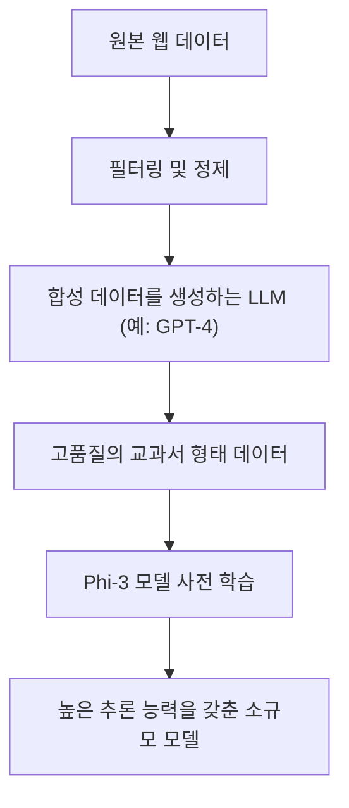
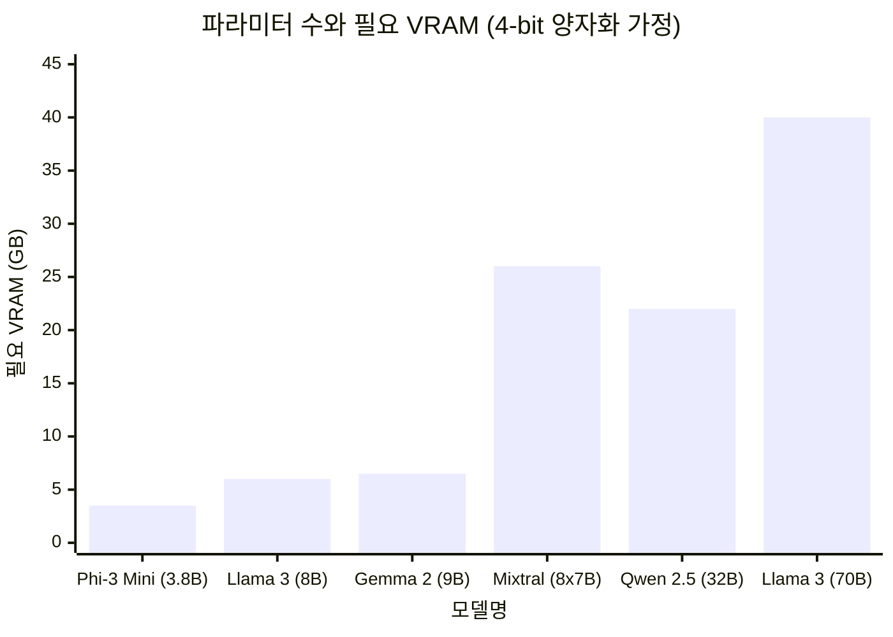

# 머리말

최근 대규모 언어 모델(LLM)의 기술 발전은 눈부시며, ChatGPT나 Claude와 같은 클라우드 기반 AI 서비스가 널리 보급되고 있습니다. 하지만 한편으로는 "자사의 기밀 데이터를 외부 서버로 전송하고 싶지 않다", "API 이용 요금을 절감하고 싶다", "완전히 오프라인으로 동작하는 AI 시스템을 구축하고 싶다"는 요구가 급속히 높아지고 있습니다.

이러한 요구에 부응하는 것이 자신의 PC나 사내 서버에 직접 다운로드하여 실행할 수 있는 '로컬 LLM(오픈소스 LLM)'입니다. 2023년경까지만 해도 로컬에서 실용적인 정확도를 내는 것은 어려웠지만, 모델 아키텍처의 진화와 양자화(Quantization) 기술의 발전으로 현재는 소비자용 GPU(NVIDIA RTX 3090 / 4090이나 Mac의 Apple Silicon 등)에서도 매우 고성능의 LLM을 원활하게 구동할 수 있게 되었습니다.

본 기사에서는 수많은 오픈소스 LLM 중에서 2026년 현재 특히 우수하다고 평가받는 '추천 모델 5선'을 선정하여, 각각의 아키텍처 특징, 파라미터 수, GGUF 양자화에 따른 메모리 요구 사항, 그리고 구체적인 사용 사례에 이르기까지 지극히 상세하고 기술적인 관점에서 철저히 비교·해설합니다.

---

# 왜 로컬에서 LLM을 구동하는가?

로컬 LLM 도입에는 클라우드형 API에는 없는 독자적인 장점이 다수 존재합니다.

### 1. 완벽한 프라이버시와 보안 확보
클라우드 API를 사용할 경우, 입력한 프롬프트나 데이터는 외부 기업의 서버로 전송됩니다. 이는 개인정보나 기업의 기밀 정보를 다루는 데 있어 중대한 위험 요소입니다. 로컬 LLM이라면 데이터가 완전히 단말기 내에서 처리되므로, 외부로의 데이터 유출 위험을 제로로 억제할 수 있습니다.

### 2. 비용의 대폭적인 절감
상용 API(OpenAI API 등)는 입력 및 출력 토큰 수에 따른 종량 과금제입니다. 대량의 문서를 처리하게 하거나 챗봇을 항상 가동시킬 경우, 월 수십만 원에서 수천만 원의 비용이 발생할 수도 있습니다. 반면 로컬 LLM이라면 하드웨어 초기 투자와 전기 요금만으로 토큰 수 제한 없이 무제한으로 이용 가능합니다.

### 3. 커스터마이징 및 오프라인 이용
오픈소스 LLM은 자체 데이터 세트를 사용하여 파인튜닝(LoRA 등)을 수행하기가 쉽습니다. 또한 인터넷 연결이 없는 완전한 오프라인 환경이나 안전한 폐쇄망에서도 가동할 수 있기 때문에 에지 디바이스에 내장하기에도 최적입니다.

---

# 로컬 LLM을 구동하기 위한 기초 지식

모델 소개에 앞서, 로컬 환경에서 LLM을 구동하는 데 있어 피할 수 없는 'VRAM 요구 사항'과 '양자화(Quantization)'에 대해 수학적으로 정리해 봅시다.

## VRAM(비디오 메모리)과 양자화의 수학적 기초

LLM을 GPU에서 추론시키기 위해서는 모델의 파라미터(가중치)를 VRAM에 전개해야 합니다. 모델의 메모리 요구 사항 $M$ 은 다음 수식으로 근사할 수 있습니다.

$$ M = \frac{P \times B}{8} + C $$

여기서,
- $M$: 필요한 메모리 용량(GB)
- $P$: 파라미터 수(Billion = 10억)
- $B$: 1파라미터당 비트 수(FP16이면 16비트, 4bit 양자화면 4비트)
- $C$: 컨텍스트 윈도우(KV 캐시) 및 추론 시의 오버헤드(보통 모델 크기의 20%~30% 정도를 예상)

예를 들어 파라미터 수가 80억(8B)인 모델을 16비트 부동소수점(FP16)으로 구동할 경우,
$$ M_{FP16} = \frac{8 \times 16}{8} = 16 \text{ GB} $$
가 됩니다. 여기에 KV 캐시 등을 고려하면 18GB~20GB에 가까운 VRAM이 필요해져 일반적인 게이밍 PC에서는 구동하기가 힘들어집니다.

### GGUF 포맷의 대두

그래서 등장한 것이 '양자화(Quantization)'입니다. 파라미터의 정밀도를 FP16에서 8-bit, 4-bit, 극단적인 경우 2-bit 등으로 낮춤으로써 모델의 성능 저하를 최소화하면서 필요한 메모리 양을 획기적으로 줄이는 기술입니다.

현재 가장 널리 보급된 포맷이 Georgi Gerganov(llama.cpp 개발자)가 고안한 **GGUF (GPT-Generated Unified Format)** 입니다. GGUF는 CPU와 GPU 모두에서 효율적으로 추론을 수행하기 위한 바이너리 형식이며, 특히 Mac(Apple Silicon)의 Unified Memory 아키텍처와 매우 궁합이 좋다는 특징이 있습니다.

8B 모델을 4-bit(예: Q4_K_M)로 양자화했을 경우의 메모리 계산은 다음과 같습니다.

$$ M_{4bit} = \frac{8 \times 4.5}{8} = 4.5 \text{ GB} $$
※Q4_K_M은 일부 가중치에 높은 정밀도를 남기기 때문에 실효 비트 수는 약 4.5비트가 됩니다.

이로 인해 VRAM이 8GB밖에 없는 엔트리급 GPU나 일반 노트북에서도 8B 클래스의 강력한 LLM을 로컬에서 원활하게 구동할 수 있게 되는 것입니다.

---

# 추천 로컬 LLM 모델 5선

그러면 현재 전 세계의 개발자나 AI 연구자들로부터 높은 지지를 받고 있는 오픈소스 LLM 5가지를 소개하겠습니다.

## 1. Llama 3 (Meta)

Meta사가 개발하여 오픈소스 LLM의 사실상 업계 표준(디팩토 스탠다드)이 된 것이 'Llama 3' 시리즈입니다.

### 아키텍처의 진화와 특징

Llama 3는 표준적인 Transformer 아키텍처를 채택하면서도 이전 세대(Llama 2)로부터 수많은 기술적 개량이 가해졌습니다. 특히 주목할 만한 점은 다음과 같습니다.

- **GQA (Grouped Query Attention)의 표준 채택**: Llama 2에서는 대규모 모델에만 채택되었던 GQA가 Llama 3에서는 8B와 같은 소규모 모델에도 채택되었습니다. 이로 인해 KV 캐시의 메모리 사용량이 급감하여 긴 컨텍스트에서도 빠른 추론이 가능해졌습니다.
- **어휘 크기 확대**: 토크나이저(Tiktoken 기반)의 어휘 크기가 128,000 토큰으로 확장되어 다국어 및 프로그램 코드의 압축 효율이 극적으로 향상되었습니다. 일본어 처리 효율도 Llama 2와 비교하여 수 배 좋아졌습니다.



### 파라미터 크기와 사용 사례

- **Llama 3 8B**: 80억 파라미터. 4-bit 양자화로 약 5GB의 메모리에서 동작합니다. 응답이 매우 빠르며, PC 상의 개인 비서나 로컬에서의 RAG(Retrieval-Augmented Generation) 시스템의 핵심으로 최적입니다.
- **Llama 3 70B**: 700억 파라미터. 4-bit 양자화로 약 40GB의 VRAM(또는 Apple Silicon의 Unified Memory)을 필요로 합니다. 클라우드의 GPT-4에 육박하는 성능을 가지며, 고도의 추론, 복잡한 코딩, 데이터 분석 등에 위력을 발휘합니다.

Llama 3는 커뮤니티의 지원이 가장 두터우며, GGUF, AWQ, EXL2 등 모든 양자화 포맷을 즉시 이용할 수 있다는 점도 강점입니다.

---

## 2. Mistral / Mixtral (Mistral AI)

프랑스 태생의 AI 스타트업 'Mistral AI'가 제공하는 모델은 그 효율성과 패러다임 전환을 가져오는 아키텍처로 업계에 충격을 주었습니다.

### MoE (Mixture of Experts) 의 구조

'Mixtral 8x7B'는 오픈소스 LLM 최초로 **MoE (Mixture of Experts)** 아키텍처를 본격적으로 도입하여 큰 성공을 거두었습니다.
MoE란 모델 전체(약 470억 파라미터) 내에 8개의 '전문가(Expert) 네트워크'를 두어, 입력된 토큰마다 최적의 전문가 2개만을 동적으로 선택(라우팅)하는 방식입니다.



이 아키텍처의 최대 장점은 "파라미터 수는 거대하지만, 추론 시에 계산되는 파라미터(Active Parameters)는 적다"는 점입니다. Mixtral 8x7B의 경우, 추론 시 활성화되는 것은 단 13B 상당입니다. 이를 통해 70B 클래스의 고성능을 유지하면서 추론 속도를 극적으로 향상시켰습니다.

### 퍼포먼스와 사용 사례

- **Mistral 7B / Mistral Nemo (12B)**: 단일 Dense 모델. 매우 경량이면서도 Apache 2.0 라이선스로 상업적 이용이 자유롭습니다. 코딩이나 요약 작업에서 동급 크기의 다른 모델을 압도하는 벤치마크 결과를 냅니다.
- **Mixtral 8x7B / 8x22B**: 고도의 MoE 모델. VRAM 요구 사항은 높지만(모델 전체를 메모리에 올려야 하므로 8x7B의 4-bit 기준 약 26GB), 추론 속도가 빠르기 때문에 M2/M3 Max 등의 Mac 환경에서 로컬 서버를 구축하기에 매우 적합합니다.

---

## 3. Gemma 2 (Google)

Google이 자사의 최첨단 모델 'Gemini'의 기술을 활용하여 개발한 오픈 모델이 'Gemma' 시리즈입니다. Gemma 2는 그 2세대로서 아키텍처에 큰 변화를 주었습니다.

### 독자적인 아키텍처 설계

Gemma 2는 다른 LLM과는 선을 긋는 몇 가지 독자적인 설계를 채택하고 있습니다.

- **Logit Soft-capping**: 비정상적으로 큰 로짓 값이 생성되는 것을 방지하여 학습과 추론의 안정성을 높이는 기술.
- **Sliding Window Attention (SWA) 와 Local Attention의 하이브리드**: 모든 레이어에서 풀 어텐션을 수행하는 것이 아니라, 국소적인 컨텍스트만 보는 레이어와 전체를 보는 레이어를 번갈아 배치하고 있습니다.

SWA에서의 계산량 감소는 수학적으로 다음과 같이 나타낼 수 있습니다. 일반적인 Self-Attention의 계산량 $O(N^2)$ 에 대해, 윈도우 크기 $W$ 를 사용한 SWA의 계산량은 다음과 같습니다.

$$ \text{Complexity}_{SWA} = O(N \times W) $$

여기서 $N$ 은 시퀀스 길이, $W$ 는 고정된 윈도우 크기입니다. $N$ 이 커질수록(장문을 입력할수록) SWA에 의한 계산 리소스 절약 효과는 절대적이 됩니다.

### 퍼포먼스와 사용 사례

- **Gemma 2 2B / 9B**: 스마트폰이나 Raspberry Pi 등의 극소 리소스 환경에서도 구동되는 2B와 일반 PC용 9B 모델. 특히 9B 모델은 Llama 3 8B를 능가하는 벤치마크 결과를 내는 작업도 많아 현재 최강 클래스의 10B 미만 모델 중 하나입니다.
- **Gemma 2 27B**: 270억 파라미터. 24GB의 VRAM(RTX 3090 / 4090 등)에 4-bit 또는 6-bit 양자화로 딱 들어맞는 '절묘한 크기감'이 특징. 프로그래밍이나 복잡한 일본어 지시 처리에 강하며, 매니아(애호가)들 사이에서 매우 인기가 있습니다.

---

## 4. Qwen 2.5 (Alibaba Cloud)

Alibaba Cloud가 개발하는 Qwen 시리즈는 특히 다국어 처리와 코딩, 수학 추론에 있어 세계 최고 수준의 성능을 자랑하는 모델입니다.

### 다국어 지원과 코딩 능력

Qwen 2.5는 방대한 다국어 코퍼스로 사전 학습되어 있어, 영어와 중국어는 물론 **일본어의 자연스러운 출력에 있어서도 매우 높은 평가**를 받고 있습니다. 일본 사용자에게 있어 '부자연스러운 번역투의 일본어가 되지 않는다'는 것은 최대의 장점입니다.
또한, 프로그래밍 능력에 특화된 'Qwen 2.5 Coder' 모델도 존재하여 VSCode의 확장 기능(Continue 등)과 연동해 로컬의 GitHub Copilot 대체제로 사용하는 사례가 급증하고 있습니다.

### 아키텍처와 사용 사례

- **Tie Word Embeddings**: 입력 임베딩(Embedding) 레이어와 출력 레이어의 가중치를 공유(Tie)함으로써, 파라미터 수를 절약하면서도 효율적으로 학습하는 구조를 채택하고 있습니다.
- **RoPE (Rotary Position Embedding) 의 확장**: 최대 128K 토큰이라는 장대한 컨텍스트 윈도우를 지원하여, 거대한 PDF 읽기나 수만 줄에 달하는 소스 코드의 전체 분석을 로컬에서 수행하는 것이 가능합니다.

모델 크기는 0.5B, 1.5B, 3B, 7B, 14B, 32B, 72B로 매우 세밀하게 라인업되어 있어 자신의 하드웨어 스펙(VRAM 용량) 한계선에 딱 맞는 크기를 선택할 수 있다는 점도 Qwen의 매력적인 포인트입니다.

---

## 5. Phi-3 / Phi-3.5 (Microsoft)

Microsoft가 제창하는 'Textbook is all you need(교과서가 전부다)'라는 패러다임에서 탄생한 것이 Phi 시리즈입니다.

### SLM (소규모 언어 모델)의 혁명

최근의 LLM 개발은 '무조건 파라미터 수와 데이터 양을 늘린다'는 힘으로 밀어붙이는 방식이 주류였지만, Microsoft는 '모델에 주어지는 데이터의 질(고품질의 교과서 데이터나 합성 데이터)을 극한까지 높이면, 작은 파라미터 수로도 GPT-3.5 급의 지능을 가질 수 있음'을 증명했습니다.
Phi-3는 LLM(Large Language Model)이 아니라 **SLM(Small Language Model)**이라고 불립니다.



### 퍼포먼스와 사용 사례

- **Phi-3 Mini (3.8B)**: 스마트폰 상에서 네이티브로 동작(ONNX Runtime 등 사용)시키는 것을 가정하고 설계된 모델. 불과 4B가 채 안 되는 파라미터이면서도 추론이나 논리적 사고 능력이 놀라울 정도로 높으며, 간단한 질의응답이나 텍스트 정리 작업이라면 순식간에 완료됩니다.
- **Phi-3.5 Vision / MoE**: 이미지를 인식할 수 있는 Vision 모델과 MoE 버전도 출시되었습니다.

에지 디바이스에서의 로컬 AI 구현, 모바일 앱에의 내장, 또는 백그라운드에 항상 상주시키는 초경량 에이전트로서 Phi-3 시리즈는 타의 추종을 불허합니다.

---

# 모델의 기술적 비교와 벤치마크

여기서 소개한 모델들을 로컬에서 구동할 때의 'VRAM 요구 사항'과 '추론 속도'에 대해 정량적인 관점에서 비교해 보겠습니다.

## 파라미터 수와 VRAM 요구 사항의 관계 (GGUF 4-bit 양자화 시)

아래 그래프는 각 모델의 파라미터 수 대비 추론 시에 필요해지는 VRAM의 기준(KV 캐시 오버헤드 포함)을 보여줍니다.



※Mixtral 8x7B는 파라미터 총량이 크기 때문에 VRAM을 많이 소비하지만, 계산 자체는 가볍기 때문에 GPU의 계산 리소스(CUDA 코어 등) 부하는 낮아집니다.

## 추론 속도 (Tokens/sec) 의 이론적 계산

로컬 LLM의 추론 속도는 GPU의 '메모리 대역폭(Memory Bandwidth)'에 크게 의존합니다. 생성 단계(디코딩)에서는 1개의 토큰을 생성할 때마다 모델의 전체 가중치를 메모리에서 읽어와야 하기 때문입니다. 계산 한계(Compute-bound)가 아닌 메모리 한계(Memory-bound) 처리가 됩니다.

이론적인 최대 추론 속도 $T$(Tokens/sec)는 다음 식을 통해 계산됩니다.

$$ T = \frac{\text{BW}}{M_{\text{weights}}} $$

여기서,
- $\text{BW}$: GPU의 실효 메모리 대역폭 (GB/s)
- $M_{\text{weights}}$: 모델이 로드된 크기 (GB)

예를 들어 NVIDIA RTX 4090(메모리 대역폭 1,008 GB/s)에서 Llama 3 8B의 4-bit 버전(약 4.5 GB)을 구동하는 경우를 계산해 봅니다. 실효 대역폭을 이론값의 약 80%(약 800 GB/s)로 가정하면:

$$ T \approx \frac{800}{4.5} \approx 177 \text{ Tokens/sec} $$

이는 인간이 읽는 속도를 아득히 뛰어넘는 맹렬한 속도입니다. 반면 동일한 RTX 4090에서 Llama 3 70B(4-bit 버전 약 40GB ※2장의 GPU로 분할한 경우 등을 가정)를 구동하면 토큰 생성 속도는 약 20 Tokens/sec 정도로 안정됩니다. 이처럼 자신의 PC 스펙으로부터 '어느 정도의 속도로 출력될 것인가'를 사전에 수식으로 예측하는 것이 가능합니다.

---

# 로컬 LLM을 구동하기 위한 도구

이러한 강력한 오픈소스 LLM을 로컬 환경에서 구동하기 위한 소프트웨어 생태계도 현재 매우 잘 갖춰져 있습니다. 대표적인 도구 3가지를 소개합니다.

### 1. Ollama
현재 가장 쉽고 가장 인기 있는 도구입니다. Docker처럼 명령어 한 줄로 모델의 다운로드부터 실행까지 진행해 줍니다. Mac, Windows, Linux 모두를 지원합니다.
터미널을 열고 다음 명령어를 입력하기만 하면 Llama 3가 실행됩니다.

```bash
ollama run llama3
```
또한 Ollama는 백그라운드에서 REST API 서버로 기능하기 때문에 Python 스크립트나 외부 애플리케이션과의 연동도 매우 쉽습니다.

### 2. LM Studio
GUI 기반으로 직관적인 조작을 원하는 분들에게 추천하는 애플리케이션입니다. Hugging Face의 방대한 GGUF 모델 목록을 앱 내에서 검색하고 다운로드할 수 있으며, ChatGPT와 유사한 채팅 화면에서 대화를 즐길 수 있습니다. 어떤 모델이 자신의 PC RAM/VRAM에 들어맞는지를 시각적으로 알려주는 기능이 매우 유용합니다.

### 3. llama.cpp
로컬 LLM 붐의 주역이자 모든 기반이 되고 있는 C/C++ 구현 라이브러리입니다. 극한까지 성능을 튜닝하고 싶은 엔지니어나 독자적인 스크립트에 내장하고 싶은 해커를 위한 도구입니다. Apple의 Metal, NVIDIA의 CUDA, AMD의 ROCm, 나아가 Intel의 AVX 명령어 세트까지 모든 하드웨어의 잠재력을 한계까지 끌어냅니다.

---

# 요약 및 향후 전망

본 기사에서는 2026년 현재 최고봉에 있는 오픈소스 로컬 LLM 5가지를 소개하고, 그 아키텍처와 기술적 배경에 대해 해설했습니다. 목적별 선택 방법을 요약하면 다음과 같습니다.

1. **종합적인 밸런스와 생태계를 중시한다면**: `Llama 3 (8B / 70B)`
2. **Mac 등 대용량 Unified Memory 환경에서 고속 추론을 원한다면**: `Mixtral 8x7B`
3. **24GB 급의 VRAM에서 최대한의 똑똑함을 이끌어내고 싶다면**: `Gemma 2 27B` 또는 `Qwen 2.5 32B`
4. **자연스러운 일본어 출력과 고도의 코딩 지원이 목적이라면**: `Qwen 2.5`
5. **스마트폰이나 사양이 낮은 PC, 백그라운드에서의 초경량 처리가 목적이라면**: `Phi-3 / Phi-3.5`

오픈소스 LLM의 진화 속도는 무서울 정도이며, 몇 달에 한 번씩 기존의 상식을 뒤엎는 혁신적인 결과가 발표되고 있습니다. 앞으로 양자화 기술의 추가적인 향상과 새로운 아키텍처의 등장으로 로컬 환경만으로도 클라우드 AI를 능가할 날이 머지않았을지도 모릅니다.
여러분의 하드웨어 환경에 맞춰 최적의 모델을 다운로드하고, 로컬 AI의 압도적인 자유와 가능성을 직접 체험해 보시기 바랍니다.
