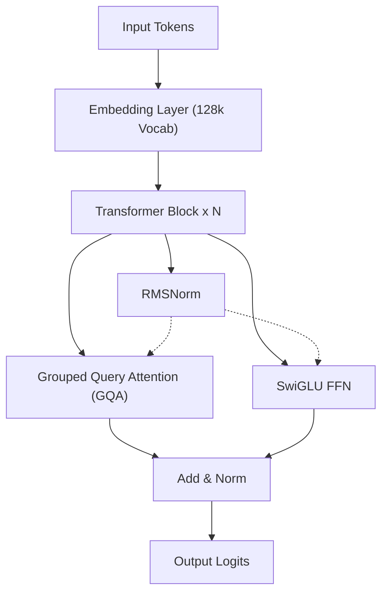
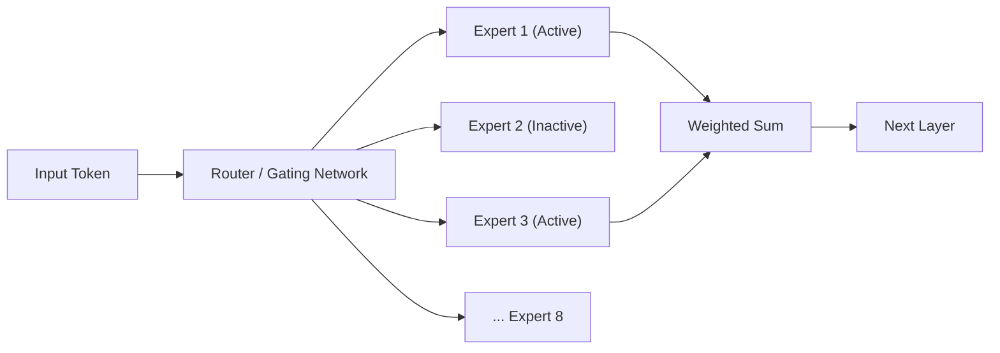
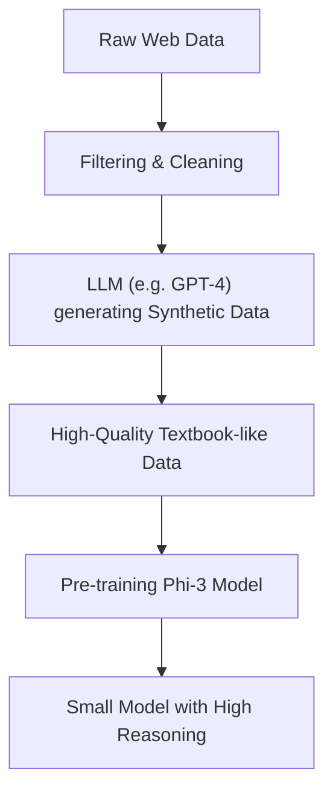
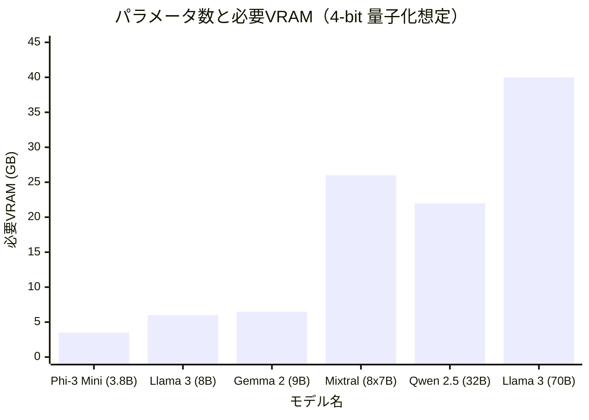

# はじめに

近年、大規模言語モデル（LLM）の技術進化は目覚ましく、ChatGPTやClaudeのようなクラウドベースのAIサービスが広く普及しています。しかし、その一方で、「自社の機密データを外部のサーバーに送信したくない」「APIの利用料金を抑えたい」「完全にオフラインで動作するAIシステムを構築したい」というニーズが急速に高まっています。

この要求に応えるのが、自分のPCや社内サーバーに直接ダウンロードして実行できる「ローカルLLM（オープンソースLLM）」です。2023年頃まではローカルで実用的な精度を出すのは困難でしたが、モデルのアーキテクチャの進化や量子化（Quantization）技術の発展により、現在ではコンシューマー向けのGPU（NVIDIA RTX 3090 / 4090やMacのApple Siliconなど）でも、非常に高性能なLLMをサクサクと動かすことが可能になりました。

本記事では、数多くのオープンソースLLMの中から、2026年現在で特に優れていると評価されている「おすすめモデル5選」をピックアップし、それぞれのアーキテクチャの特徴、パラメータ数、GGUF量子化によるメモリ要件、そして具体的なユースケースに至るまで、極めて詳細かつ技術的な視点から徹底的に比較・解説します。

---

# なぜローカルでLLMを動かすのか？

ローカルLLMの導入には、クラウド型APIにはない独自のメリットが多数存在します。

### 1. 完全なプライバシーとセキュリティの確保
クラウドAPIを使用する場合、入力したプロンプトやデータは外部企業のサーバーに送信されます。これは、個人情報や企業の機密情報を扱う上で重大なリスクとなります。ローカルLLMであれば、データは完全に端末内で処理されるため、外部へのデータ流出リスクをゼロに抑えることができます。

### 2. コストの大幅な削減
商用のAPI（OpenAI APIなど）は、入力・出力トークン数に応じた従量課金制です。大量の文書を処理させたり、常にチャットボットを稼働させたりすると、月額数万円〜数百万円のコストがかかることもあります。一方、ローカルLLMであれば、ハードウェアの初期投資と電気代のみで、トークン数無制限に何度でも利用可能です。

### 3. カスタマイズ性とオフライン利用
オープンソースLLMは、自前のデータセットを用いてファインチューニング（LoRAなど）を行うことが容易です。また、インターネット接続がない完全なオフライン環境やセキュアな閉域網でも稼働させることができるため、エッジデバイスへの組み込みにも最適です。

---

# ローカルLLMを動かすための基礎知識

モデルの紹介に入る前に、ローカル環境でLLMを動かす上で避けては通れない「VRAM要件」と「量子化（Quantization）」について数学的に整理しておきましょう。

## VRAM（ビデオメモリ）と量子化の数学的基礎

LLMをGPU上で推論させるためには、モデルのパラメータ（重み）をVRAMに展開する必要があります。モデルのメモリ要件 $M$ は、以下の数式で近似できます。

$$ M = \frac{P \times B}{8} + C $$

ここで、
- $M$: 必要なメモリ容量（GB）
- $P$: パラメータ数（Billion = 10億）
- $B$: 1パラメータあたりのビット数（FP16なら16ビット、4bit量子化なら4ビット）
- $C$: コンテキストウィンドウ（KVキャッシュ）や推論時のオーバーヘッド（通常はモデルサイズの20%〜30%程度を見込む）

例えば、パラメータ数が80億（8B）のモデルを16ビット浮動小数点（FP16）で動かす場合、
$$ M_{FP16} = \frac{8 \times 16}{8} = 16 \text{ GB} $$
となります。さらにKVキャッシュなどを考慮すると、18GB〜20GB近いVRAMが必要になり、一般的なゲーミングPCでは動かすのが厳しくなります。

### GGUFフォーマットの台頭

そこで登場するのが「量子化（Quantization）」です。パラメータの精度をFP16から8-bit、4-bit、極端な場合は2-bitなどに落とすことで、モデルの性能劣化を最小限に抑えつつ、必要なメモリ量を劇的に削減する技術です。

現在最も普及しているフォーマットが、Georgi Gerganov氏（llama.cppの開発者）によって考案された **GGUF (GPT-Generated Unified Format)** です。GGUFは、CPUとGPUの両方で効率的に推論を行うためのバイナリ形式であり、特にMac (Apple Silicon)のUnified Memoryアーキテクチャと非常に相性が良いという特徴があります。

8Bモデルを4-bit（例：Q4_K_M）で量子化した場合のメモリ計算は以下のようになります。

$$ M_{4bit} = \frac{8 \times 4.5}{8} = 4.5 \text{ GB} $$
※Q4_K_Mは一部の重みに高い精度を残すため、実効ビット数は約4.5ビットとなります。

これにより、VRAMが8GBしかないエントリークラスのGPUや一般的なノートPCでも、8Bクラスの強力なLLMをローカルでサクサクと動かせるようになるのです。

---

# おすすめのローカルLLMモデル5選

それでは、現在世界中の開発者やAIリサーチャーから高い支持を集めているオープンソースLLMを5つ紹介します。

## 1. Llama 3 (Meta)

Meta社が開発し、オープンソースLLMの事実上の業界標準（デファクトスタンダード）となっているのが「Llama 3」シリーズです。

### アーキテクチャの進化と特徴

Llama 3は、標準的なTransformerアーキテクチャを採用しつつも、前世代（Llama 2）から数々の技術的改良が加えられています。特に注目すべきは以下の点です。

- **GQA (Grouped Query Attention)の標準採用**: Llama 2では大規模モデルのみに採用されていたGQAが、Llama 3では8Bのような小規模モデルにも採用されました。これにより、KVキャッシュのメモリ使用量が激減し、長いコンテキストでも高速な推論が可能になっています。
- **語彙サイズの拡大**: トークナイザー（Tiktokenベース）の語彙サイズが128,000トークンに拡張され、多言語やプログラムコードの圧縮効率が劇的に向上しました。日本語の処理効率もLlama 2と比較して数倍良くなっています。



### パラメータサイズとユースケース

- **Llama 3 8B**: 80億パラメータ。4-bit量子化で約5GBのメモリで動作します。応答が非常に高速で、PC上のパーソナルアシスタントや、ローカルでのRAG（Retrieval-Augmented Generation）システムの中核として最適です。
- **Llama 3 70B**: 700億パラメータ。4-bit量子化で約40GBのVRAM（またはApple SiliconのUnified Memory）を必要とします。クラウドのGPT-4に肉薄する性能を持ち、高度な推論、複雑なコーディング、データ分析などに威力を発揮します。

Llama 3はコミュニティによるサポートが最も厚く、GGUF、AWQ、EXL2などあらゆる量子化フォーマットが即座に利用できるのも強みです。

---

## 2. Mistral / Mixtral (Mistral AI)

フランス発のAIスタートアップ「Mistral AI」が提供するモデルは、その効率性とパラダイムシフトをもたらすアーキテクチャで業界に衝撃を与えました。

### MoE (Mixture of Experts) の仕組み

「Mixtral 8x7B」は、オープンソースLLMとして初めて **MoE (Mixture of Experts)** アーキテクチャを本格的に採用し、大成功を収めました。
MoEとは、モデル全体（約470億パラメータ）の中に8つの「専門家（Expert）ネットワーク」を持たせ、入力されたトークンごとに最適な2つの専門家だけを動的に選択（ルーティング）する仕組みです。



このアーキテクチャの最大のメリットは、「パラメータ数は巨大なのに、推論時に計算されるパラメータ（Active Parameters）は少ない」という点です。Mixtral 8x7Bの場合、推論時にアクティブになるのはわずか13B相当です。これにより、70Bクラスの高性能を維持しながら、推論スピードを劇的に向上させています。

### パフォーマンスとユースケース

- **Mistral 7B / Mistral Nemo (12B)**: 単一のDenseモデル。非常に軽量でありながら、Apache 2.0ライセンスで商用利用が自由。コーディングや要約タスクにおいて、同サイズの他モデルを圧倒するベンチマークを叩き出します。
- **Mixtral 8x7B / 8x22B**: 高度なMoEモデル。VRAM要件は高い（モデル全体をメモリに乗せる必要があるため、8x7Bの4-bitで約26GB）ものの、推論速度が速いため、M2/M3 MaxなどのMac環境でローカルサーバーを構築するのに非常に適しています。

---

## 3. Gemma 2 (Google)

Googleが自社の最先端モデル「Gemini」の技術を活用して開発したオープンモデルが「Gemma」シリーズです。Gemma 2はその第2世代として、アーキテクチャに大きなメスを入れました。

### 独自のアーキテクチャ設計

Gemma 2は、他のLLMとは一線を画すいくつかの独自設計を採用しています。

- **Logit Soft-capping**: 異常に大きなロジット値が生成されるのを防ぎ、学習と推論の安定性を高める技術。
- **Sliding Window Attention (SWA) と Local Attentionのハイブリッド**: すべての層でフルアテンションを行うのではなく、局所的なコンテキストだけを見る層と全体を見る層を交互に配置しています。

SWAにおける計算量の削減は数学的に次のように示されます。通常のSelf-Attentionの計算量 $O(N^2)$ に対し、ウィンドウサイズ $W$ を用いたSWAの計算量は以下のようになります。

$$ \text{Complexity}_{SWA} = O(N \times W) $$

ここで、$N$ はシーケンス長、$W$ は固定のウィンドウサイズです。$N$ が大きくなる（長文を入力する）ほど、SWAによる計算リソースの節約効果は絶大になります。

### パフォーマンスとユースケース

- **Gemma 2 2B / 9B**: スマートフォンやRaspberry Piなどの極小リソース環境でも動く2Bと、一般PC向けの9Bモデル。特に9Bモデルは、Llama 3 8Bを凌駕するベンチマーク結果を出すタスクも多く、現在最強クラスの10B未満モデルの一つです。
- **Gemma 2 27B**: 270億パラメータ。24GBのVRAM（RTX 3090 / 4090等）に4-bitまたは6-bit量子化でピッタリ収まる「絶妙なサイズ感」が特徴。プログラミングや複雑な日本語の指示出しに強く、エンスージアスト（愛好家）の間で非常に人気があります。

---

## 4. Qwen 2.5 (Alibaba Cloud)

Alibaba Cloudが開発するQwenシリーズは、特に多言語処理とコーディング、数学推論において世界トップクラスの性能を誇るモデルです。

### 多言語対応とコーディング能力

Qwen 2.5は、膨大な多言語コーパスで事前学習されており、英語や中国語はもちろん、**日本語の自然な出力において極めて高い評価**を得ています。日本のユーザーにとって「不自然な翻訳調の日本語にならない」というのは最大のメリットです。
また、プログラミング能力に特化した「Qwen 2.5 Coder」モデルも存在し、VSCodeの拡張機能（Continueなど）と連携させてローカルのGitHub Copilot代替として利用するケースが急増しています。

### アーキテクチャとユースケース

- **Tie Word Embeddings**: 入力の埋め込み層（Embedding）と出力層の重みを共有（Tie）することで、パラメータ数を節約しつつ効率的に学習する仕組みを採用しています。
- **RoPE (Rotary Position Embedding) の拡張**: 最大128Kトークンという長大なコンテキストウィンドウをサポートしており、巨大なPDFの読み込みや、数万行に及ぶソースコードの全解析をローカルで行うことが可能です。

モデルサイズは 0.5B, 1.5B, 3B, 7B, 14B, 32B, 72B と非常に細かくラインナップされており、自身のハードウェアスペック（VRAM容量）の限界ギリギリのサイズを選べる点も、Qwenの魅力的なポイントです。

---

## 5. Phi-3 / Phi-3.5 (Microsoft)

Microsoftが提唱する「Textbook is all you need（教科書こそがすべて）」というパラダイムから生まれたのが、Phiシリーズです。

### SLM（小規模言語モデル）の革命

近年のLLM開発は「とにかくパラメータ数とデータ量を増やす」という力技が主流でしたが、Microsoftは「モデルに与えるデータの質（高品質な教科書データや合成データ）を極限まで高めれば、小さなパラメータ数でもGPT-3.5クラスの知能を持てる」ことを証明しました。
Phi-3はLLM（Large Language Model）ではなく、**SLM（Small Language Model）**と呼ばれます。



### パフォーマンスとユースケース

- **Phi-3 Mini (3.8B)**: スマートフォン上でネイティブ動作（ONNX Runtimeなどを使用）させることを想定して設計されたモデル。わずか4B弱のパラメータでありながら、推論や論理的思考能力が驚くほど高く、簡単な質問応答やテキスト整形タスクであれば一瞬で完了します。
- **Phi-3.5 Vision / MoE**: 画像を認識できるVisionモデルや、MoE版もリリースされています。

エッジデバイスでのローカルAI実装、モバイルアプリへの組み込み、またはバックグラウンドで常に常駐させる超軽量エージェントとして、Phi-3シリーズは右に出るものがありません。

---

# モデルの技術的比較とベンチマーク

ここで、紹介したモデルをローカルで動かす際の「VRAM要件」と「推論速度」について、定量的な観点から比較してみましょう。

## パラメータ数とVRAM要件の関係（GGUF 4-bit 量子化時）

以下のグラフは、各モデルのパラメータ数に対して、推論時に必要となるVRAMの目安（KVキャッシュのオーバーヘッドを含む）を示しています。



※Mixtral 8x7Bはパラメータ総量が大きいためVRAMを多く消費しますが、計算自体は軽いためGPUの計算リソース（CUDAコア等）の負荷は低くなります。

## 推論速度（Tokens/sec）の理論的計算

ローカルLLMの推論速度は、GPUの「メモリ帯域幅（Memory Bandwidth）」に強く依存します。生成フェーズ（デコード）においては、1トークン生成するごとにモデルの全重みをメモリから読み出す必要があるためです。計算律速（Compute-bound）ではなくメモリ律速（Memory-bound）の処理となります。

理論的な最大推論速度 $T$（Tokens/sec）は、以下の式で計算されます。

$$ T = \frac{\text{BW}}{M_{\text{weights}}} $$

ここで、
- $\text{BW}$: GPUの実効メモリ帯域幅 (GB/s)
- $M_{\text{weights}}$: モデルのロードされたサイズ (GB)

例えば、NVIDIA RTX 4090（メモリ帯域幅 1,008 GB/s）で、Llama 3 8Bの4-bit版（約 4.5 GB）を動かす場合を計算します。実効帯域幅を理論値の約80%（約 800 GB/s）と仮定すると：

$$ T \approx \frac{800}{4.5} \approx 177 \text{ Tokens/sec} $$

これは、人間が読む速度を遥かに超える猛烈なスピードです。一方、同じRTX 4090で Llama 3 70B（4-bit版 約40GB ※2枚のGPUに分割した場合等の想定）を動かすと、トークン生成速度は約20 Tokens/sec程度に落ち着きます。このように、自身のPCスペックから「どの程度の速度で出力されるか」を事前に数式で予測することが可能です。

---

# ローカルLLMを動かすためのツール

これらの強力なオープンソースLLMをローカル環境で動かすためのソフトウェアエコシステムも、現在非常に充実しています。代表的なツールを3つ紹介します。

### 1. Ollama
現在、最も簡単かつ最も人気のあるツールです。Dockerのようにコマンド一発でモデルのダウンロードから実行までを行ってくれます。Mac、Windows、Linuxすべてに対応しています。
ターミナルを開き、以下のコマンドを打つだけでLlama 3が立ち上がります。

```bash
ollama run llama3
```
また、OllamaはバックグラウンドでREST APIサーバーとして機能するため、Pythonスクリプトや外部アプリケーションとの連携も極めて容易です。

### 2. LM Studio
GUIベースで直感的に操作したい方におすすめのアプリケーションです。Hugging Faceの膨大なGGUFモデルのリストをアプリ内から検索・ダウンロードでき、ChatGPTライクなチャット画面で会話を楽しめます。どのモデルが自分のPCのRAM/VRAMに収まるかを視覚的に教えてくれる機能が非常に便利です。

### 3. llama.cpp
ローカルLLMブームの火付け役であり、すべての基盤となっているC/C++実装のライブラリです。極限までパフォーマンスをチューニングしたいエンジニアや、独自のスクリプトに組み込みたいハッカー向けです。AppleのMetal、NVIDIAのCUDA、AMDのROCm、さらにはIntelのAVX命令セットまで、あらゆるハードウェアの潜在能力を限界まで引き出します。

---

# まとめと今後の展望

本記事では、2026年現在で最高峰のオープンソース・ローカルLLMを5つ紹介し、そのアーキテクチャや技術的な背景について解説しました。目的別の選び方をまとめると以下のようになります。

1. **総合的なバランスとエコシステムを重視するなら**: `Llama 3 (8B / 70B)`
2. **Macなどの大容量Unified Memory環境で高速推論させたいなら**: `Mixtral 8x7B`
3. **24GBクラスのVRAMで最大限の賢さを引き出したいなら**: `Gemma 2 27B` または `Qwen 2.5 32B`
4. **自然な日本語出力と高度なコーディング支援が目的なら**: `Qwen 2.5`
5. **スマホや非力なPC、バックグラウンドでの超軽量処理なら**: `Phi-3 / Phi-3.5`

オープンソースLLMの進化速度は凄まじく、数ヶ月ごとにこれまでの常識を覆すようなブレイクスルーが発表されています。今後、量子化技術のさらなる向上や新しいアーキテクチャの登場により、ローカル環境だけでクラウドAIを凌駕する日も近いかもしれません。
ぜひ、ご自身のハードウェア環境に合わせて最適なモデルをダウンロードし、ローカルAIの圧倒的な自由と可能性を体感してみてください。
