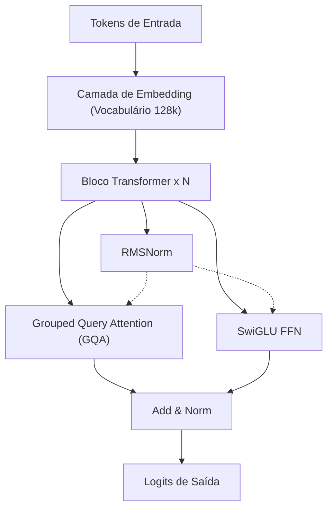
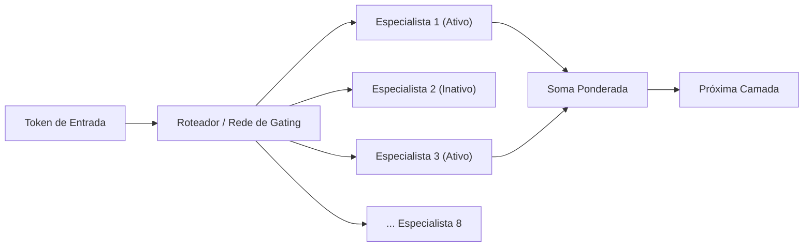
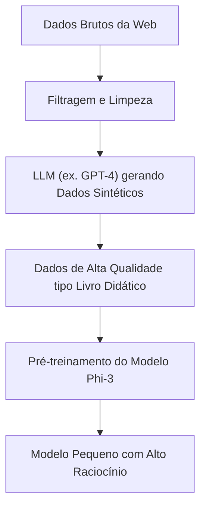
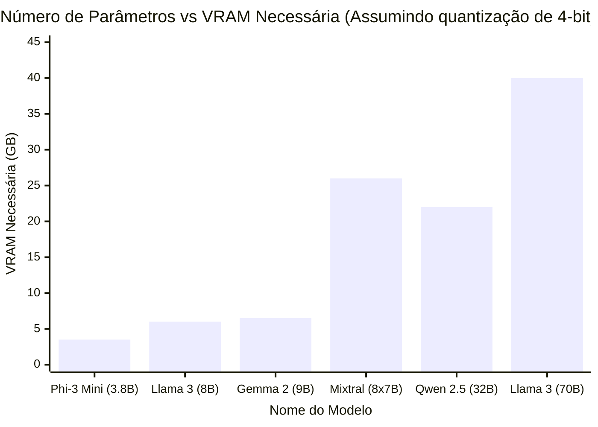

# Introdução

Nos últimos anos, a evolução tecnológica dos Large Language Models (LLM) tem sido notável, e serviços de IA baseados em nuvem como ChatGPT e Claude tornaram-se amplamente populares. No entanto, por outro lado, a necessidade de "não querer enviar dados confidenciais da empresa para servidores externos", "querer reduzir os custos de uso de API" e "querer construir um sistema de IA que funcione completamente offline" está aumentando rapidamente.

O que atende a essa demanda são os "LLMs locais (LLMs de código aberto)" que podem ser baixados e executados diretamente em seu próprio PC ou servidor interno. Até por volta de 2023, era difícil alcançar uma precisão prática localmente, mas com a evolução das arquiteturas de modelo e o desenvolvimento da tecnologia de quantização (Quantization), agora é possível rodar LLMs de altíssimo desempenho de forma suave até mesmo em GPUs voltadas para o consumidor (como NVIDIA RTX 3090 / 4090 e Apple Silicon do Mac).

Neste artigo, selecionamos os "Top 5 modelos recomendados" que são avaliados como particularmente excelentes a partir de 2026, dentre os muitos LLMs de código aberto, e compararemos e explicaremos detalhadamente a partir de uma perspectiva extremamente técnica, abrangendo desde as características de suas arquiteturas, número de parâmetros, requisitos de memória com quantização GGUF e casos de uso específicos.

---

# Por que rodar um LLM localmente?

A adoção de LLMs locais possui muitos benefícios únicos que as APIs baseadas em nuvem não têm.

### 1. Garantia total de privacidade e segurança
Ao usar uma API em nuvem, os prompts e dados inseridos são enviados aos servidores de empresas externas. Isso representa um risco significativo ao lidar com informações pessoais e dados confidenciais da empresa. Com um LLM local, os dados são processados inteiramente no dispositivo, reduzindo a zero o risco de vazamento de dados para o exterior.

### 2. Redução drástica de custos
APIs comerciais (como a API da OpenAI) adotam um sistema de pagamento conforme o uso, baseado no número de tokens de entrada e saída. Ao processar um grande volume de documentos ou manter um chatbot sempre em execução, os custos mensais podem variar de milhares a dezenas de milhares de dólares. Por outro lado, com um LLM local, você pode usá-lo quantas vezes quiser com um número ilimitado de tokens, arcando apenas com o investimento inicial em hardware e os custos de eletricidade.

### 3. Personalização e uso offline
Com LLMs de código aberto, é fácil realizar fine-tuning (como LoRA) usando seus próprios conjuntos de dados. Além disso, eles podem ser executados em um ambiente totalmente offline sem conexão à internet ou em uma rede fechada segura, tornando-os ideais para integração em dispositivos de borda (edge devices).

---

# Conhecimento básico para rodar LLMs locais

Antes de apresentar os modelos, vamos revisar matematicamente os "Requisitos de VRAM" e a "Quantização (Quantization)", que são inevitáveis ao rodar LLMs em um ambiente local.

## Fundamentos matemáticos de VRAM (Memória de Vídeo) e Quantização

Para inferir um LLM em uma GPU, é necessário carregar os parâmetros (pesos) do modelo na VRAM. O requisito de memória do modelo $M$ pode ser aproximado pela seguinte fórmula.

$$ M = \frac{P \times B}{8} + C $$

Onde,
- $M$: Capacidade de memória necessária (GB)
- $P$: Número de parâmetros (Billion = Bilhões)
- $B$: Número de bits por parâmetro (16 bits para FP16, 4 bits para quantização de 4 bits)
- $C$: Context window (cache KV) e overhead durante a inferência (geralmente estimado em torno de 20% a 30% do tamanho do modelo)

Por exemplo, ao rodar um modelo com 8 bilhões (8B) de parâmetros em ponto flutuante de 16 bits (FP16),
$$ M_{FP16} = \frac{8 \times 16}{8} = 16 \text{ GB} $$
Considerando adicionalmente o cache KV e afins, quase 18 GB a 20 GB de VRAM serão necessários, o que torna difícil rodá-lo em um PC gamer comum.

### A ascensão do formato GGUF

É aí que entra a "Quantização (Quantization)". Ao reduzir a precisão dos parâmetros de FP16 para 8 bits, 4 bits, ou em casos extremos para 2 bits, é uma tecnologia que minimiza a degradação de desempenho do modelo enquanto reduz drasticamente a quantidade de memória necessária.

O formato mais utilizado atualmente é o **GGUF (GPT-Generated Unified Format)** concebido por Georgi Gerganov (desenvolvedor do llama.cpp). O GGUF é um formato binário para realizar inferências eficientes tanto na CPU quanto na GPU e é caracterizado por ser altamente compatível com a arquitetura de Memória Unificada (Unified Memory) do Mac (Apple Silicon).

O cálculo de memória ao quantizar um modelo de 8B em 4 bits (por exemplo: Q4_K_M) é o seguinte.

$$ M_{4bit} = \frac{8 \times 4.5}{8} = 4.5 \text{ GB} $$
*Como o Q4_K_M retém maior precisão em alguns pesos, o número efetivo de bits é de cerca de 4,5 bits.

Como resultado, mesmo GPUs de entrada com apenas 8 GB de VRAM ou laptops comuns agora podem rodar LLMs poderosos de classe 8B localmente com fluidez.

---

# Top 5 modelos LLM locais recomendados

Apresentaremos agora 5 LLMs de código aberto que atualmente recebem grande apoio de desenvolvedores e pesquisadores de IA em todo o mundo.

## 1. Llama 3 (Meta)

Desenvolvida pela Meta, a série "Llama 3" é o padrão de fato da indústria para LLMs de código aberto.

### Evolução e características da arquitetura

A Llama 3 adota a arquitetura padrão do Transformer, mas inclui inúmeras melhorias técnicas em relação à geração anterior (Llama 2). Vale destacar os seguintes pontos:

- **Adoção padrão de GQA (Grouped Query Attention)**: O GQA, que era usado apenas em modelos de grande escala no Llama 2, foi adotado também em modelos de menor escala, como o 8B, no Llama 3. Como resultado, o uso de memória do cache KV foi drasticamente reduzido, permitindo uma inferência rápida mesmo com contextos longos.
- **Expansão do tamanho do vocabulário**: O tamanho do vocabulário do tokenizador (baseado em Tiktoken) foi expandido para 128.000 tokens, e a eficiência da compactação de múltiplos idiomas e códigos de programa melhorou drasticamente. A eficiência do processamento em japonês também é várias vezes melhor quando comparada à Llama 2.



### Tamanho dos parâmetros e casos de uso

- **Llama 3 8B**: 8 bilhões de parâmetros. Roda em cerca de 5 GB de memória com quantização de 4 bits. Tem respostas extremamente rápidas, tornando-se ideal como assistente pessoal no PC e o núcleo de um sistema RAG (Retrieval-Augmented Generation) local.
- **Llama 3 70B**: 70 bilhões de parâmetros. Requer cerca de 40 GB de VRAM (ou Memória Unificada do Apple Silicon) com quantização de 4 bits. Tem um desempenho que se aproxima do GPT-4 na nuvem, demonstrando poder em raciocínio avançado, codificação complexa, análise de dados e muito mais.

O Llama 3 possui o maior suporte da comunidade, e sua força também reside no fato de que todos os formatos de quantização como GGUF, AWQ e EXL2 estão prontamente disponíveis para uso.

---

## 2. Mistral / Mixtral (Mistral AI)

Os modelos fornecidos pela startup de IA francesa "Mistral AI" chocaram a indústria com sua eficiência e arquitetura de mudança de paradigma.

### Mecanismo do MoE (Mixture of Experts)

O "Mixtral 8x7B" foi o primeiro LLM de código aberto a adotar totalmente a arquitetura **MoE (Mixture of Experts)**, e obteve grande sucesso.
MoE é um mecanismo que possui 8 "redes especialistas (Expert)" no modelo como um todo (cerca de 47 bilhões de parâmetros) e seleciona (roteia) dinamicamente apenas os dois melhores especialistas para cada token inserido.



A maior vantagem desta arquitetura é que "embora o número de parâmetros seja enorme, os parâmetros calculados durante a inferência (Active Parameters) são poucos". No caso do Mixtral 8x7B, o que fica ativo durante a inferência equivale a apenas 13B. Como resultado, ele aumenta drasticamente a velocidade de inferência enquanto mantém o alto desempenho da classe de 70B.

### Desempenho e casos de uso

- **Mistral 7B / Mistral Nemo (12B)**: Um único modelo Denso. Apesar de muito leve, seu uso comercial é livre sob a licença Apache 2.0. Em tarefas de codificação e resumo, alcança benchmarks que superam de forma contundente outros modelos do mesmo tamanho.
- **Mixtral 8x7B / 8x22B**: Modelos MoE avançados. Embora os requisitos de VRAM sejam altos (já que todo o modelo precisa ser carregado na memória, requerendo cerca de 26 GB para a versão de 4 bits do 8x7B), a velocidade de inferência é rápida, tornando-os altamente adequados para a construção de servidores locais em ambientes Mac como M2/M3 Max.

---

## 3. Gemma 2 (Google)

A série "Gemma" é composta por modelos abertos que o Google desenvolveu utilizando a tecnologia de seu modelo de ponta "Gemini". O Gemma 2, como sua segunda geração, introduziu mudanças significativas na arquitetura.

### Design de arquitetura exclusivo

O Gemma 2 adota vários designs únicos que o diferenciam de outros LLMs.

- **Logit Soft-capping**: Uma técnica que impede a geração de valores lógicos anormalmente grandes, aumentando a estabilidade do treinamento e da inferência.
- **Híbrido de Sliding Window Attention (SWA) e Local Attention**: Em vez de aplicar atenção total (full attention) em todas as camadas, as camadas que observam apenas o contexto local e as camadas que observam todo o contexto se alternam.

A redução na quantidade de cálculos na SWA é mostrada matematicamente a seguir. Em contraste com a complexidade computacional $O(N^2)$ da Self-Attention normal, a complexidade computacional da SWA usando o tamanho da janela $W$ é a seguinte.

$$ \text{Complexity}_{SWA} = O(N \times W) $$

Onde $N$ é o comprimento da sequência e $W$ é um tamanho de janela fixo. À medida que $N$ aumenta (textos longos são inseridos), o efeito da SWA na economia de recursos computacionais torna-se tremendo.

### Desempenho e casos de uso

- **Gemma 2 2B / 9B**: O 2B opera até mesmo em ambientes de recursos mínimos como smartphones e Raspberry Pi, enquanto o modelo 9B é voltado para PCs convencionais. Em particular, o modelo de 9B apresenta resultados de benchmark que frequentemente superam o Llama 3 8B, sendo um dos modelos com menos de 10B mais poderosos da atualidade.
- **Gemma 2 27B**: 27 bilhões de parâmetros. É caracterizado por um "tamanho requintado" que se encaixa perfeitamente em 24 GB de VRAM (RTX 3090 / 4090, etc.) com quantização de 4 bits ou 6 bits. É forte em programação e instruções complexas em japonês, sendo extremamente popular entre entusiastas (hobbyists).

---

## 4. Qwen 2.5 (Alibaba Cloud)

A série Qwen, desenvolvida pelo Alibaba Cloud, é um modelo que possui desempenho de alto nível global, especialmente em processamento multilíngue, codificação e raciocínio matemático.

### Suporte multilíngue e capacidade de codificação

O Qwen 2.5 foi pré-treinado em um enorme corpus multilíngue e, não apenas em inglês e chinês, mas recebeu **avaliações extremamente altas por sua saída natural em japonês**. Para os usuários japoneses, o fato de não parecer uma "tradução automática não natural" é o maior benefício.
Além disso, há o modelo "Qwen 2.5 Coder", especializado em capacidades de programação, e há um rápido aumento nos casos em que ele é usado em conjunto com extensões do VSCode (como Continue) como uma alternativa local ao GitHub Copilot.

### Arquitetura e casos de uso

- **Tie Word Embeddings**: Ao compartilhar (Tie) os pesos entre a camada de embedding de entrada (Embedding) e a camada de saída, adota um mecanismo de aprendizado eficiente enquanto economiza no número de parâmetros.
- **Expansão de RoPE (Rotary Position Embedding)**: Suporta uma vasta janela de contexto de até 128K tokens, tornando possível ler PDFs enormes ou realizar a análise completa de códigos-fonte de dezenas de milhares de linhas localmente.

Os tamanhos dos modelos variam muito detalhadamente: 0.5B, 1.5B, 3B, 7B, 14B, 32B e 72B. O fato de poder escolher um tamanho que atinja o limite exato das especificações de hardware (capacidade de VRAM) do próprio usuário também é um ponto atraente do Qwen.

---

## 5. Phi-3 / Phi-3.5 (Microsoft)

A série Phi nasceu do paradigma "Textbook is all you need" (Um livro didático é tudo de que você precisa), defendido pela Microsoft.

### A revolução do SLM (Pequeno Modelo de Linguagem)

Recentemente, a abordagem principal para o desenvolvimento de LLMs era a técnica de força bruta de "simplesmente aumentar o número de parâmetros e o volume de dados". No entanto, a Microsoft provou que "se você elevar a qualidade dos dados fornecidos ao modelo (dados de livros didáticos de alta qualidade e dados sintéticos) ao extremo, mesmo com um pequeno número de parâmetros, é possível ter uma inteligência da classe do GPT-3.5".
O Phi-3 não é chamado de LLM (Large Language Model), mas de **SLM (Small Language Model)**.



### Desempenho e casos de uso

- **Phi-3 Mini (3.8B)**: Um modelo projetado assumindo que rodará nativamente em smartphones (usando ONNX Runtime, etc.). Com pouco menos de 4B de parâmetros, seu raciocínio e pensamento lógico são incrivelmente altos, completando instantaneamente perguntas e respostas simples ou tarefas de formatação de texto.
- **Phi-3.5 Vision / MoE**: Um modelo de Visão que pode reconhecer imagens, bem como a versão MoE, também foram lançados.

Como uma implementação de IA local em dispositivos de borda, integração em aplicativos móveis ou como um agente ultraleve sempre residente em segundo plano, a série Phi-3 é inigualável.

---

# Comparação técnica de modelos e Benchmarks

Vamos agora comparar, de um ponto de vista quantitativo, os "Requisitos de VRAM" e a "Velocidade de inferência" ao rodar os modelos apresentados localmente.

## Relação entre o número de parâmetros e os requisitos de VRAM (Quantização GGUF de 4 bits)

O gráfico a seguir mostra uma estimativa da VRAM necessária (incluindo o overhead do cache KV) durante a inferência, em relação ao número de parâmetros para cada modelo.



*Como o Mixtral 8x7B tem uma grande quantidade total de parâmetros, ele consome muita VRAM. No entanto, como os próprios cálculos são leves, a carga nos recursos de computação da GPU (como CUDA cores) é baixa.

## Cálculo teórico da Velocidade de Inferência (Tokens/sec)

A velocidade de inferência de LLMs locais depende fortemente da "Largura de Banda da Memória (Memory Bandwidth)" da GPU. Na fase de geração (decodificação), é necessário ler todos os pesos do modelo na memória cada vez que um token for gerado. É um processamento limitado pela memória (Memory-bound) e não limitado pela computação (Compute-bound).

A velocidade máxima teórica de inferência $T$ (Tokens/sec) é calculada pela seguinte fórmula:

$$ T = \frac{\text{BW}}{M_{\text{weights}}} $$

Onde,
- $\text{BW}$: Largura de banda efetiva da memória da GPU (GB/s)
- $M_{\text{weights}}$: Tamanho carregado do modelo (GB)

Por exemplo, calcularemos o caso de uso da versão de 4 bits do Llama 3 8B (cerca de 4,5 GB) em uma NVIDIA RTX 4090 (largura de banda da memória de 1.008 GB/s). Assumindo que a largura de banda efetiva seja de cerca de 80% do valor teórico (cerca de 800 GB/s):

$$ T \approx \frac{800}{4.5} \approx 177 \text{ Tokens/sec} $$

Esta é uma velocidade formidável que excede em muito a velocidade de leitura humana. Por outro lado, se você rodar o Llama 3 70B (versão de 4 bits, aprox. 40 GB *assumindo distribuição em 2 GPUs) na mesma RTX 4090, a velocidade de geração de tokens cai para cerca de 20 Tokens/sec. Desta forma, é possível prever antecipadamente matematicamente "com qual velocidade a saída será gerada" com base nas especificações do seu próprio PC.

---

# Ferramentas para rodar LLMs locais

O ecossistema de software para executar esses poderosos LLMs de código aberto em ambientes locais também está muito completo atualmente. Apresentamos três ferramentas representativas:

### 1. Ollama
É a ferramenta mais simples e popular atualmente. Assim como o Docker, ele realiza desde o download até a execução do modelo com um único comando. Suporta todas as plataformas: Mac, Windows e Linux.
Basta abrir o terminal e digitar o comando a seguir, e o Llama 3 iniciará.

```bash
ollama run llama3
```
Além disso, como o Ollama funciona como um servidor de API REST em segundo plano, a integração com scripts em Python ou aplicativos externos é extremamente fácil.

### 2. LM Studio
Aplicativo recomendado para quem deseja operar intuitivamente através de uma GUI. Você pode buscar e baixar em uma enorme lista de modelos GGUF do Hugging Face dentro do aplicativo e desfrutar de conversas em uma interface de chat semelhante ao ChatGPT. O recurso que avisa visualmente qual modelo caberá na RAM/VRAM do seu PC é muito útil.

### 3. llama.cpp
É a fagulha que iniciou o boom de LLMs locais e uma biblioteca escrita em C/C++ que serve como base para tudo. É destinada a engenheiros que desejam ajustar o desempenho ao extremo ou hackers que desejam integrá-la em seus próprios scripts. Ela extrai as capacidades potenciais de qualquer hardware até o limite: do Metal da Apple e CUDA da NVIDIA ao ROCm da AMD, e até mesmo ao conjunto de instruções AVX da Intel.

---

# Conclusão e Perspectivas Futuras

Neste artigo, apresentamos 5 dos melhores LLMs de código aberto e locais disponíveis em 2026, e explicamos suas arquiteturas e fundamentos técnicos. Como escolher com base nos seus objetivos pode ser resumido a seguir:

1. **Se você valoriza um equilíbrio geral e o ecossistema**: `Llama 3 (8B / 70B)`
2. **Se você deseja inferência rápida em ambientes de grande capacidade com Memória Unificada como no Mac**: `Mixtral 8x7B`
3. **Se você quiser extrair a máxima inteligência em 24 GB de VRAM**: `Gemma 2 27B` ou `Qwen 2.5 32B`
4. **Se o seu objetivo é a saída natural em seu idioma (além de inglês) e suporte avançado de codificação**: `Qwen 2.5`
5. **Se for para smartphones, PCs de baixo desempenho ou processamento ultraleve em segundo plano**: `Phi-3 / Phi-3.5`

A velocidade de evolução dos LLMs de código aberto é impressionante e, a cada poucos meses, novos avanços técnicos (breakthroughs) que derrubam o senso comum anterior são anunciados. No futuro, com mais melhorias na tecnologia de quantização e a introdução de novas arquiteturas, o dia em que o ambiente local por si só superará a IA na nuvem pode estar próximo.
Faça o download do modelo ideal de acordo com o seu ambiente de hardware e experimente a liberdade avassaladora e as possibilidades da IA local.
