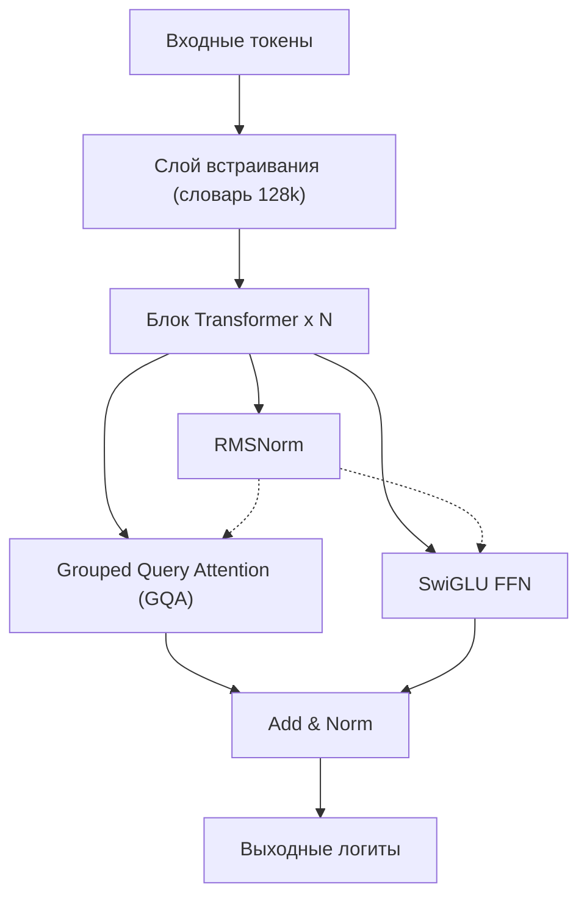
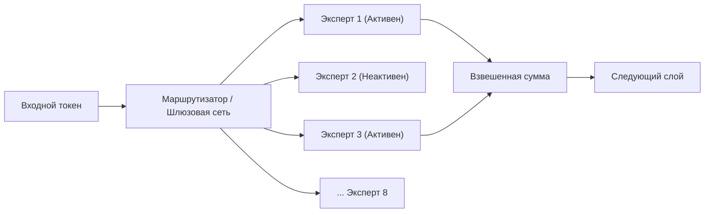
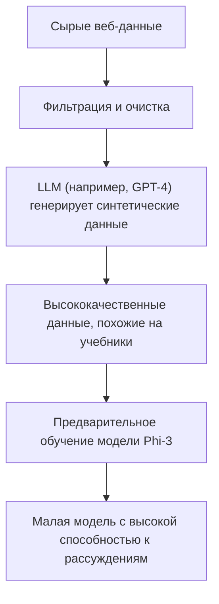
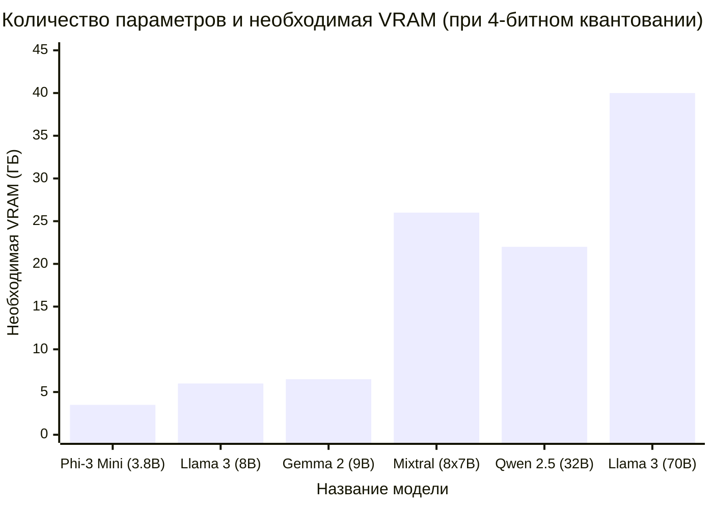

# Введение

В последние годы технология больших языковых моделей (LLM) стремительно развивается, и облачные ИИ-сервисы, такие как ChatGPT и Claude, получили широкое распространение. Однако в то же время быстро растет потребность в системах ИИ, которые работают полностью в автономном режиме, из-за таких запросов, как «мы не хотим отправлять конфиденциальные корпоративные данные на внешние серверы», «мы хотим снизить затраты на использование API» и «мы хотим создать полностью автономную ИИ-систему».

Ответом на эти требования являются «локальные LLM (LLM с открытым исходным кодом)», которые можно загрузить и запустить прямо на собственном ПК или локальном сервере. До 2023 года было трудно достичь практической точности в локальных условиях, но благодаря эволюции архитектур моделей и развитию технологий квантования (Quantization), сегодня даже на потребительских графических процессорах (таких как NVIDIA RTX 3090 / 4090 или Apple Silicon для Mac) можно без проблем запускать высокопроизводительные LLM.

В этой статье мы выбрали «Топ-5 лучших моделей» из числа множества LLM с открытым исходным кодом, которые на 2026 год оцениваются как особенно выдающиеся. Мы проведем всестороннее сравнение и объяснение с глубоко технической точки зрения: от особенностей архитектуры каждой модели, количества параметров, требований к памяти при GGUF-квантовании, вплоть до конкретных сценариев использования.

---

# Зачем запускать LLM локально?

Внедрение локальных LLM имеет множество уникальных преимуществ, которых нет у облачных API.

### 1. Обеспечение полной конфиденциальности и безопасности
При использовании облачного API вводимые промпты и данные отправляются на серверы сторонних компаний. Это представляет серьезный риск при работе с личной информацией или корпоративными конфиденциальными данными. С локальными LLM данные обрабатываются полностью внутри устройства, поэтому риск утечки данных наружу сводится к нулю.

### 2. Значительное снижение затрат
Коммерческие API (например, OpenAI API) работают по системе оплаты по мере использования, зависящей от количества токенов ввода и вывода. При обработке большого количества документов или постоянной работе чат-бота ежемесячные расходы могут составлять от нескольких десятков тысяч до миллионов иен. С другой стороны, с локальными LLM вы платите только за первоначальные инвестиции в оборудование и электроэнергию, и можете использовать их неограниченное количество раз без ограничений на количество токенов.

### 3. Возможности кастомизации и автономное использование
LLM с открытым исходным кодом легко дообучать (fine-tuning, например, с помощью LoRA) на собственных наборах данных. Кроме того, их можно запускать в полностью автономных средах без подключения к интернету или в защищенных закрытых сетях, что делает их идеальными для интеграции в периферийные устройства.

---

# Базовые знания для запуска локальных LLM

Прежде чем переходить к обзору моделей, давайте математически разберем «требования к VRAM» и «квантование (Quantization)», которые неизбежно возникают при запуске LLM в локальной среде.

## Математические основы VRAM (видеопамяти) и квантования

Для выполнения логического вывода (инференса) LLM на GPU необходимо загрузить параметры (веса) модели в VRAM. Требования к памяти $M$ для модели можно приблизительно оценить по следующей формуле:

$$ M = \frac{P \times B}{8} + C $$

Где:
- $M$: Требуемый объем памяти (в ГБ)
- $P$: Количество параметров (в миллиардах = 10^9)
- $B$: Количество бит на один параметр (16 бит для FP16, 4 бита для 4-битного квантования)
- $C$: Окно контекста (КВ-кэш, KV cache) и накладные расходы при инференсе (обычно ожидается от 20% до 30% от размера модели)

Например, при запуске модели с 8 миллиардами параметров (8B) в формате 16-битной памяти с плавающей запятой (FP16):
$$ M_{FP16} = \frac{8 \times 16}{8} = 16 \text{ GB} $$
С учетом КВ-кэша и других затрат потребуется почти 18–20 ГБ VRAM, что делает запуск на обычном игровом ПК весьма сложным.

### Появление формата GGUF

Здесь на сцену выходит «квантование (Quantization)». Это технология, которая снижает точность параметров с FP16 до 8-бит, 4-бит или, в крайних случаях, до 2-бит, что позволяет резко сократить объем необходимой памяти, сводя к минимуму ухудшение производительности модели.

В настоящее время самым популярным форматом является **GGUF (GPT-Generated Unified Format)**, разработанный Георгием Гергановым (автором llama.cpp). GGUF — это бинарный формат для эффективного инференса как на CPU, так и на GPU, и он отличается превосходной совместимостью с архитектурой объединенной памяти (Unified Memory) на Mac (Apple Silicon).

При квантовании модели 8B в 4-битный формат (например, Q4_K_M) расчет памяти выглядит следующим образом:

$$ M_{4bit} = \frac{8 \times 4.5}{8} = 4.5 \text{ GB} $$
※ Поскольку Q4_K_M сохраняет более высокую точность для некоторых весов, эффективное количество бит составляет примерно 4.5 бита.

Благодаря этому даже на видеокартах начального уровня с 8 ГБ VRAM или на обычных ноутбуках можно без проблем запускать мощные локальные LLM класса 8B.

---

# Топ-5 рекомендуемых локальных моделей LLM

А теперь давайте познакомимся с 5 моделями LLM с открытым исходным кодом, которые в настоящее время пользуются наибольшей поддержкой разработчиков и ИИ-исследователей по всему миру.

## 1. Llama 3 (Meta)

Серия «Llama 3», разработанная компанией Meta, стала де-факто стандартом среди LLM с открытым исходным кодом.

### Эволюция архитектуры и особенности

Хотя Llama 3 использует стандартную архитектуру Transformer, по сравнению с предыдущим поколением (Llama 2) в нее было внесено множество технических улучшений. Особо стоит отметить следующие моменты:

- **Стандартное использование GQA (Grouped Query Attention)**: GQA, который применялся только в крупных моделях Llama 2, теперь используется и в небольших моделях, таких как 8B в Llama 3. Это резко снижает потребление памяти КВ-кэшем и позволяет осуществлять быстрый инференс даже с длинным контекстом.
- **Увеличение размера словаря**: Размер словаря токенизатора (на основе Tiktoken) был расширен до 128 000 токенов, что кардинально повысило эффективность сжатия для множества языков и программного кода. Эффективность обработки японского языка также улучшилась в несколько раз по сравнению с Llama 2.



### Размер параметров и сценарии использования

- **Llama 3 8B**: 8 миллиардов параметров. Работает примерно с 5 ГБ памяти при 4-битном квантовании. Обладает очень быстрыми ответами и идеально подходит в качестве персонального помощника на ПК или ядра для локальных систем RAG (Retrieval-Augmented Generation).
- **Llama 3 70B**: 70 миллиардов параметров. При 4-битном квантовании требуется около 40 ГБ VRAM (или объединенной памяти Apple Silicon). Обладает производительностью, вплотную приближающейся к облачному GPT-4, и демонстрирует отличные результаты в сложных рассуждениях, комплексном программировании и анализе данных.

Llama 3 имеет самую мощную поддержку сообщества, и её сильной стороной является то, что любые форматы квантования, такие как GGUF, AWQ, EXL2, доступны немедленно.

---

## 2. Mistral / Mixtral (Mistral AI)

Модели, представленные французским ИИ-стартапом «Mistral AI», шокировали индустрию своей эффективностью и меняющей парадигму архитектурой.

### Механизм MoE (Mixture of Experts)

«Mixtral 8x7B» стала первой LLM с открытым исходным кодом, которая полноценно внедрила архитектуру **MoE (Mixture of Experts)** и добилась огромного успеха.
MoE — это механизм, при котором вся модель (около 47 миллиардов параметров) содержит 8 «экспертных (Expert) сетей», и для каждого вводимого токена динамически выбираются (маршрутизируются) только 2 наиболее подходящих эксперта.



Главным преимуществом этой архитектуры является то, что «несмотря на огромное количество параметров, количество вычисляемых параметров при инференсе (Active Parameters) невелико». В случае Mixtral 8x7B во время инференса активны параметры, эквивалентные всего 13B. Это позволяет значительно увеличить скорость инференса, сохраняя высокую производительность класса 70B.

### Производительность и сценарии использования

- **Mistral 7B / Mistral Nemo (12B)**: Единая плотная (Dense) модель. Будучи очень легковесной, она свободно доступна для коммерческого использования по лицензии Apache 2.0. В задачах кодирования и обобщения она показывает результаты тестов (бенчмарки), превосходящие другие модели того же размера.
- **Mixtral 8x7B / 8x22B**: Продвинутые модели MoE. Требования к VRAM высоки (поскольку вся модель должна находиться в памяти, для 4-битной 8x7B требуется около 26 ГБ), но скорость инференса высока, что делает их очень подходящими для создания локальных серверов в средах Mac, таких как M2/M3 Max.

---

## 3. Gemma 2 (Google)

Серия «Gemma» — это открытые модели, разработанные Google с использованием технологий их самой передовой модели «Gemini». Gemma 2, как её второе поколение, привнесла значительные изменения в архитектуру.

### Уникальный дизайн архитектуры

Gemma 2 применяет несколько уникальных проектных решений, отличающих её от других LLM.

- **Logit Soft-capping**: Технология предотвращения генерации аномально больших значений логитов, повышающая стабильность обучения и инференса.
- **Гибрид Sliding Window Attention (SWA) и Local Attention**: Вместо выполнения полного внимания (full attention) на всех слоях, слои, рассматривающие только локальный контекст, чередуются со слоями, рассматривающими контекст целиком.

Снижение вычислительных затрат в SWA математически выражается следующим образом. В отличие от вычислительной сложности обычного Self-Attention $O(N^2)$, сложность SWA с окном размера $W$ составляет:

$$ \text{Complexity}_{SWA} = O(N \times W) $$

Где $N$ — длина последовательности, а $W$ — фиксированный размер окна. Чем больше $N$ (чем длиннее вводимый текст), тем значительнее эффект экономии вычислительных ресурсов за счет SWA.

### Производительность и сценарии использования

- **Gemma 2 2B / 9B**: Модель 2B, работающая даже в средах с крайне ограниченными ресурсами, таких как смартфоны и Raspberry Pi, и модель 9B для обычных ПК. Модель 9B, в частности, во многих задачах превосходит результаты тестов Llama 3 8B и в настоящее время является одной из самых мощных моделей размером до 10B.
- **Gemma 2 27B**: 27 миллиардов параметров. Её особенность — «идеальный размер», который точно умещается в 24 ГБ VRAM (например, RTX 3090 / 4090) при 4-битном или 6-битном квантовании. Она сильна в программировании и выполнении сложных инструкций, и пользуется огромной популярностью среди энтузиастов.

---

## 4. Qwen 2.5 (Alibaba Cloud)

Серия Qwen, разрабатываемая Alibaba Cloud, представляет собой модели мирового класса по производительности, особенно в области многоязычной обработки, кодирования и математических рассуждений.

### Многоязычная поддержка и возможности кодирования

Qwen 2.5 была предварительно обучена на огромном многоязычном корпусе и получила **очень высокие оценки за естественный вывод на множестве языков**, включая английский и китайский.
Существует также модель «Qwen 2.5 Coder», специализирующаяся на программировании, которую всё чаще используют в качестве локальной альтернативы GitHub Copilot путём интеграции с расширениями VSCode (например, Continue).

### Архитектура и сценарии использования

- **Tie Word Embeddings**: Применяется механизм совместного использования (связывания - Tie) весов слоя встраивания ввода (Embedding) и выходного слоя, что позволяет экономить количество параметров и при этом эффективно обучаться.
- **Расширение RoPE (Rotary Position Embedding)**: Поддерживает гигантское окно контекста до 128K токенов, что позволяет локально читать огромные PDF-файлы или полностью анализировать исходный код из десятков тысяч строк.

Размеры моделей варьируются очень детально: 0.5B, 1.5B, 3B, 7B, 14B, 32B, 72B. Возможность выбрать размер на самом пределе аппаратных возможностей (объема VRAM) вашего ПК является одним из привлекательных аспектов Qwen.

---

## 5. Phi-3 / Phi-3.5 (Microsoft)

Серия Phi родилась из парадигмы Microsoft «Textbook is all you need» (Учебник — это всё, что вам нужно).

### Революция SLM (Малых языковых моделей)

В то время как последние разработки LLM в основном фокусировались на подходе «чем больше параметров и данных, тем лучше», Microsoft доказала, что «если довести качество данных, подаваемых в модель (высококачественные учебные или синтетические данные), до максимума, даже небольшое количество параметров может обеспечить уровень интеллекта класса GPT-3.5».
Phi-3 называется не LLM (Large Language Model), а **SLM (Small Language Model)**.



### Производительность и сценарии использования

- **Phi-3 Mini (3.8B)**: Модель, разработанная для нативной работы на смартфонах (с использованием ONNX Runtime и т. д.). Несмотря на наличие чуть менее 4B параметров, её способность к рассуждениям и логическому мышлению поразительно высока, а простые задачи ответов на вопросы и форматирования текста выполняются мгновенно.
- **Phi-3.5 Vision / MoE**: Также выпущены модели Vision, способные распознавать изображения, и версия MoE.

Для реализации локального ИИ на периферийных устройствах, интеграции в мобильные приложения или использования в качестве сверхлегкого агента, постоянно работающего в фоновом режиме, серия Phi-3 не имеет себе равных.

---

# Техническое сравнение моделей и бенчмарки

Теперь давайте сравним «требования к VRAM» и «скорость инференса» для представленных моделей при их запуске локально с количественной точки зрения.

## Взаимосвязь между количеством параметров и требованиями к VRAM (при 4-битном квантовании GGUF)

На следующем графике показана примерная VRAM, необходимая во время инференса (включая накладные расходы на КВ-кэш), в зависимости от количества параметров каждой модели.



※ Поскольку Mixtral 8x7B имеет большое общее количество параметров, она потребляет много VRAM, но поскольку сами вычисления легкие, нагрузка на вычислительные ресурсы GPU (ядра CUDA и т.д.) остается низкой.

## Теоретический расчет скорости инференса (Токенов/сек)

Скорость инференса локальных LLM сильно зависит от «пропускной способности памяти» (Memory Bandwidth) GPU. Это связано с тем, что на этапе генерации (декодирования) необходимо считывать все веса модели из памяти для генерации каждого токена. Процесс ограничен не вычислениями (Compute-bound), а памятью (Memory-bound).

Теоретическая максимальная скорость инференса $T$ (Токенов/сек) рассчитывается по следующей формуле:

$$ T = \frac{\text{BW}}{M_{\text{weights}}} $$

Где:
- $\text{BW}$: Эффективная пропускная способность памяти GPU (ГБ/с)
- $M_{\text{weights}}$: Размер загруженной модели (ГБ)

Например, рассчитаем случай запуска 4-битной версии Llama 3 8B (около 4.5 ГБ) на NVIDIA RTX 4090 (пропускная способность памяти 1 008 ГБ/с). Если предположить, что эффективная пропускная способность составляет около 80% от теоретического значения (около 800 ГБ/с):

$$ T \approx \frac{800}{4.5} \approx 177 \text{ Токенов/сек} $$

Это бешеная скорость, значительно превышающая скорость чтения человеком. С другой стороны, если запустить Llama 3 70B (4-битная версия около 40 ГБ, ※ предполагается разделение на 2 GPU и т. д.) на том же RTX 4090, скорость генерации токенов составит примерно 20 Токенов/сек. Таким образом, можно заранее с помощью формулы предсказать, «с какой скоростью будет выводиться текст», исходя из спецификаций вашего ПК.

---

# Инструменты для запуска локальных LLM

В настоящее время также очень развита программная экосистема для запуска этих мощных LLM с открытым исходным кодом в локальной среде. Мы представим 3 типичных инструмента.

### 1. Ollama
В настоящее время это самый простой и популярный инструмент. Подобно Docker, он загружает и запускает модели одной командой. Поддерживает Mac, Windows и Linux.
Просто откройте терминал и введите следующую команду, чтобы запустить Llama 3:

```bash
ollama run llama3
```
Кроме того, поскольку Ollama работает в фоновом режиме как REST API-сервер, её чрезвычайно легко интегрировать со скриптами Python или внешними приложениями.

### 2. LM Studio
Это рекомендуемое приложение для тех, кто хочет интуитивно понятного управления с помощью графического интерфейса (GUI). Вы можете искать и загружать из огромного списка моделей GGUF на Hugging Face прямо из приложения и наслаждаться общением на экране чата, похожем на ChatGPT. Функция визуального информирования о том, какие модели поместятся в RAM/VRAM вашего ПК, очень удобна.

### 3. llama.cpp
Это библиотека на C/C++, которая положила начало буму локальных LLM и является основой для всего. Она предназначена для инженеров, желающих настроить производительность до максимума, или хакеров, которые хотят интегрировать её в свои собственные скрипты. Она выжимает максимум из потенциала любого оборудования, от Apple Metal, NVIDIA CUDA, AMD ROCm до наборов инструкций Intel AVX.

---

# Заключение и перспективы на будущее

В этой статье мы представили 5 лучших открытых и локальных LLM по состоянию на 2026 год, а также объяснили их архитектуру и технические основы. Подводя итог выбору по целям:

1. **Если важен общий баланс и экосистема**: `Llama 3 (8B / 70B)`
2. **Если нужен быстрый инференс в средах с большим объемом объединенной памяти, таких как Mac**: `Mixtral 8x7B`
3. **Если хочется выжать максимум интеллекта из VRAM класса 24 ГБ**: `Gemma 2 27B` или `Qwen 2.5 32B`
4. **Если цель — естественный вывод на разных языках и продвинутая помощь в программировании**: `Qwen 2.5`
5. **Для сверхлегкой фоновой обработки, работы на смартфонах или слабых ПК**: `Phi-3 / Phi-3.5`

Скорость эволюции LLM с открытым исходным кодом поражает: каждые несколько месяцев объявляются о прорывах, которые переворачивают прежний здравый смысл. В будущем, благодаря дальнейшему совершенствованию технологий квантования и появлению новых архитектур, может наступить день, когда локальные среды превзойдут облачный ИИ.
Обязательно загрузите оптимальную модель для вашей аппаратной среды и испытайте невероятную свободу и возможности локального ИИ.
