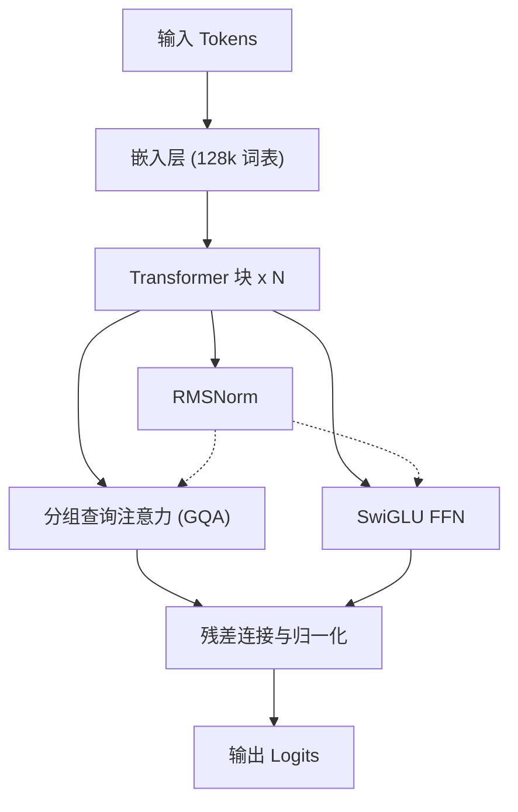
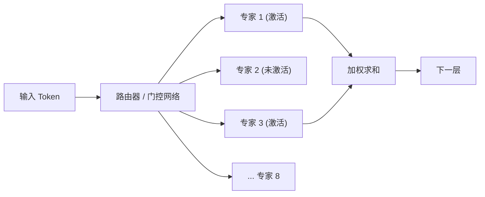
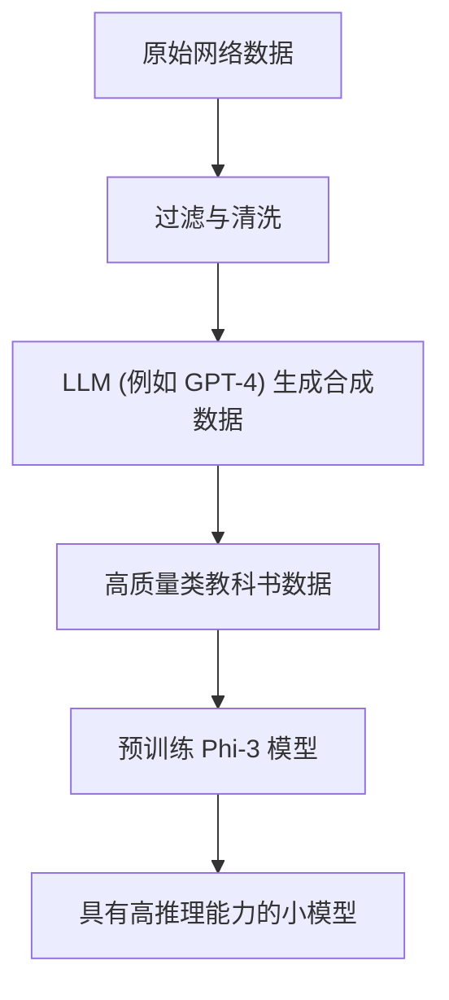
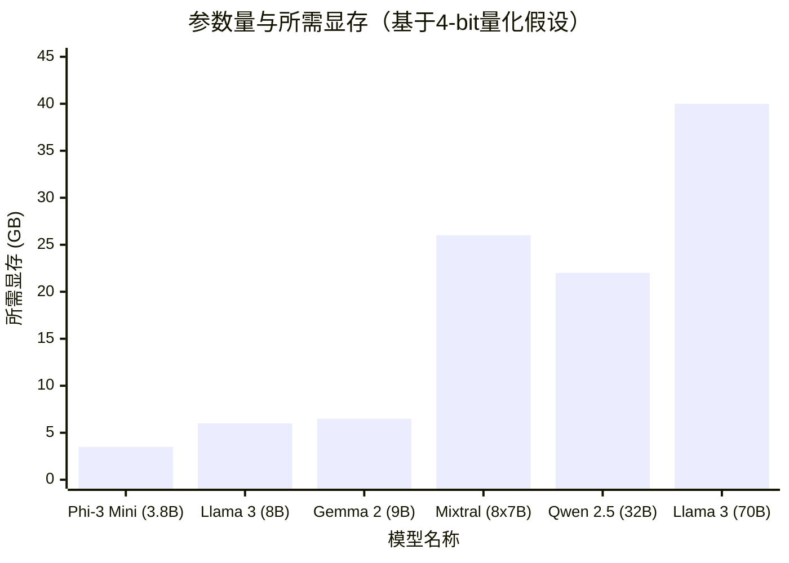

# 引言

近年来，大型语言模型（LLM）的技术发展突飞猛进，像ChatGPT和Claude等基于云的AI服务已经得到广泛普及。然而，与此同时，“不想将公司的机密数据发送到外部服务器”、“希望降低API使用费”以及“希望构建完全离线运行的AI系统”的需求也在快速增加。

为了满足这些需求，可以直接下载到自己的PC或公司内部服务器上运行的“本地LLM（开源LLM）”应运而生。直到2023年左右，在本地实现实用的准确度还很困难，但随着模型架构的进步和量化（Quantization）技术的发展，现在即使是消费级GPU（如NVIDIA RTX 3090 / 4090或Mac的Apple Silicon等），也可以十分流畅地运行非常高性能的LLM。

本文将从众多的开源LLM中，挑选出在2026年的当下被评价为特别优秀的“5款推荐模型”，并从极具技术深度的视角，对它们各自的架构特点、参数量、GGUF量化对内存的要求，乃至具体的应用场景，进行彻底的比较和解析。

---

# 为什么要运行本地LLM？

引入本地LLM拥有许多云端API所不具备的独特优势。

### 1. 确保完全的隐私和安全
使用云端API时，输入的提示词和数据会被发送到外部公司的服务器上。这在处理个人隐私或企业机密信息时会带来严重的风险。如果使用本地LLM，数据完全在终端内部进行处理，因此可以将数据外泄的风险降至零。

### 2. 大幅降低成本
商业API（如OpenAI API等）通常是根据输入和输出Token数量计费的。如果要处理大量文档或让聊天机器人保持24小时运行，每月的成本可能高达数万至数百万日元。而对于本地LLM，除了硬件的初期投资和电费之外，可以无限次且不限Token数量地使用。

### 3. 可定制性与离线使用
开源LLM很容易使用自有的数据集进行微调（如LoRA等）。此外，它可以在完全没有互联网连接的离线环境或安全的封闭网络中运行，因此非常适合嵌入到边缘设备中。

---

# 运行本地LLM的基础知识

在介绍模型之前，我们先从数学层面梳理一下在本地环境运行LLM所无法避开的“显存（VRAM）要求”和“量化（Quantization）”概念。

## 显存（VRAM）与量化的数学基础

为了在GPU上推理LLM，必须将模型的参数（权重）加载到显存（VRAM）中。模型的内存需求 $M$ 可以用以下公式来近似计算：

$$ M = \frac{P \times B}{8} + C $$

其中：
- $M$: 所需的内存容量（GB）
- $P$: 参数量（Billion = 10亿）
- $B$: 每个参数的位数（如FP16为16位，4-bit量化为4位）
- $C$: 上下文窗口（KV缓存）和推理时的开销（通常预估为模型大小的20%至30%左右）

例如，如果要以16位浮点数（FP16）运行一个参数量为80亿（8B）的模型：
$$ M_{FP16} = \frac{8 \times 16}{8} = 16 \text{ GB} $$
如果再考虑KV缓存等因素，则需要接近18GB至20GB的显存，这对于一般的游戏PC来说运行起来会非常吃力。

### GGUF格式的崛起

这时，“量化（Quantization）”技术就派上用场了。通过将参数的精度从FP16降低到8-bit、4-bit，甚至极端情况下的2-bit，可以将模型性能下降降至最低，同时大幅减少所需的内存。

目前最普及的格式是由Georgi Gerganov（llama.cpp的开发者）设计的 **GGUF (GPT-Generated Unified Format)**。GGUF是一种能够同时在CPU和GPU上进行高效推理的二进制格式，特别值得一提的是，它与Mac (Apple Silicon)的统一内存（Unified Memory）架构非常契合。

如果将8B模型进行4-bit（例如：Q4_K_M）量化，内存计算如下：

$$ M_{4bit} = \frac{8 \times 4.5}{8} = 4.5 \text{ GB} $$
※因为Q4_K_M为部分权重保留了较高的精度，所以实际有效位数约为4.5位。

因此，即使是只有8GB显存的入门级GPU或普通笔记本电脑，也能在本地流畅运行8B级别的高性能LLM。

---

# 5款推荐的本地LLM模型

接下来，为您介绍目前在全世界开发者和AI研究人员中获得极高评价的5款开源LLM。

## 1. Llama 3 (Meta)

由Meta公司开发，已成为开源LLM事实标准（De facto standard）的，就是“Llama 3”系列。

### 架构演进与特点

Llama 3在采用标准Transformer架构的同时，相较于上一代（Llama 2）进行了许多技术上的改进。特别值得关注的是以下几点：

- **全面采用GQA (Grouped Query Attention)**: 在Llama 2中仅用于大模型的GQA，在Llama 3中也被应用到了如8B这样的小模型上。这使得KV缓存的内存使用量大幅减少，即使在长上下文中也能实现高速推理。
- **词表大小的扩充**: 分词器（基于Tiktoken）的词表大小扩展到了128,000个Token，极大提升了多语言和程序代码的压缩效率。日语处理效率也比Llama 2提升了数倍。



### 参数规模与应用场景

- **Llama 3 8B**: 80亿参数。在4-bit量化下约需5GB内存即可运行。响应速度极快，非常适合作为PC上的个人助理或本地RAG（检索增强生成）系统的核心。
- **Llama 3 70B**: 700亿参数。在4-bit量化下约需40GB显存（或Apple Silicon的统一内存）。性能逼近云端的GPT-4，在高级推理、复杂编码、数据分析等方面表现出色。

Llama 3拥有最雄厚的社区支持，其一大优势在于能够立即使用GGUF、AWQ、EXL2等几乎所有量化格式。

---

## 2. Mistral / Mixtral (Mistral AI)

来自法国的AI初创公司“Mistral AI”提供的模型，以其高效性和带来范式转变的架构震撼了业界。

### MoE (Mixture of Experts) 机制

“Mixtral 8x7B”作为首个真正采用 **MoE (混合专家)** 架构的开源LLM，取得了巨大的成功。
MoE指的是在整个模型（约470亿参数）中内置8个“专家（Expert）网络”，并根据输入的每个Token，动态选择（路由）最合适的2个专家进行激活的机制。



这种架构最大的优点是：“虽然参数总量庞大，但在推理时实际计算的参数（Active Parameters）很少”。以Mixtral 8x7B为例，推理时激活的参数仅相当于13B。这使其在保持70B级别高性能的同时，大幅提升了推理速度。

### 性能与应用场景

- **Mistral 7B / Mistral Nemo (12B)**: 单一的Dense模型。非常轻量，且基于Apache 2.0许可证可自由商用。在编码和摘要任务中，它交出了压倒同级别其他模型的基准测试成绩。
- **Mixtral 8x7B / 8x22B**: 高级的MoE模型。虽然对显存要求较高（需要将整个模型加载到内存，8x7B的4-bit版本约需26GB），但推理速度很快，非常适合在M2/M3 Max等Mac环境中搭建本地服务器。

---

## 3. Gemma 2 (Google)

Google利用其最先进的“Gemini”模型技术开发的开源模型便是“Gemma”系列。作为第二代，Gemma 2对架构进行了大刀阔斧的改造。

### 独特的架构设计

Gemma 2采用了一些与其他LLM截然不同的独特设计：

- **Logit Soft-capping**: 一项防止生成异常大Logit值的技术，从而提高训练和推理的稳定性。
- **Sliding Window Attention (SWA) 与 Local Attention的混合**: 并非在所有层进行全注意力计算，而是交替使用仅关注局部上下文的层和关注全局的层。

SWA带来的计算量削减可以用数学方式表示如下：相较于普通Self-Attention的 $O(N^2)$ 计算复杂度，使用窗口大小 $W$ 的SWA计算复杂度如下：

$$ \text{Complexity}_{SWA} = O(N \times W) $$

这里，$N$ 为序列长度，$W$ 为固定的窗口大小。当 $N$ 变大（输入长文本）时，SWA节省计算资源的效果将非常显著。

### 性能与应用场景

- **Gemma 2 2B / 9B**: 2B模型能够在智能手机或Raspberry Pi等极低资源环境中运行，而9B模型则面向普通PC。特别是9B模型，在许多任务上的基准测试中超越了Llama 3 8B，是目前最强的10B以下模型之一。
- **Gemma 2 27B**: 270亿参数。在4-bit或6-bit量化下，刚好能装进24GB显存（如RTX 3090 / 4090），这种“绝妙的尺寸感”是其特色。在编程和复杂的日语指令跟随方面能力极强，在发烧友（Enthusiast）中非常受欢迎。

---

## 4. Qwen 2.5 (Alibaba Cloud)

由阿里云（Alibaba Cloud）开发的Qwen系列，特别是在多语言处理、编码和数学推理方面，拥有世界顶级的性能。

### 多语言支持与编码能力

Qwen 2.5使用了海量的多语言语料库进行预训练，除了英语和中文外，**在输出自然流畅的日语方面获得了极高的评价**。对于日本用户而言，“不会出现不自然的翻译腔日语”是最大的优势。
此外，还存在专注于编程能力的“Qwen 2.5 Coder”模型，越来越多的人将其与VSCode扩展插件（如Continue等）结合使用，作为本地GitHub Copilot的替代品。

### 架构与应用场景

- **Tie Word Embeddings**: 通过共享（Tie）输入嵌入层（Embedding）和输出层的权重，在节省参数数量的同时实现了高效训练。
- **RoPE (Rotary Position Embedding) 的扩展**: 支持长达128K Token的长上下文窗口，使得在本地读取巨大的PDF文件或对数万行源代码进行全面分析成为可能。

模型尺寸非常细分，包括 0.5B、1.5B、3B、7B、14B、32B、72B。能够根据自身硬件规格（显存容量）的极限，选择刚好能运行的最大尺寸，这也是Qwen极具魅力的一点。

---

## 5. Phi-3 / Phi-3.5 (Microsoft)

微软提出的“Textbook is all you need（教科书就是一切）”范式催生了Phi系列模型。

### SLM（小规模语言模型）的革命

近年来的LLM开发主要是“一味增加参数量和数据量”的堆算力做法，但微软证明了：“如果将喂给模型的数据质量（高质量的教科书数据或合成数据）提升到极致，即使是很小的参数量也能拥有媲美GPT-3.5级别的智能。”
Phi-3不被称为LLM（Large Language Model），而是被称为 **SLM（Small Language Model）**。



### 性能与应用场景

- **Phi-3 Mini (3.8B)**: 为在智能手机上原生运行（使用ONNX Runtime等）而设计的模型。仅有不到4B的参数，但其推理和逻辑思考能力却高得惊人，简单的问答或文本格式化任务能在瞬间完成。
- **Phi-3.5 Vision / MoE**: 也发布了能够识别图像的Vision模型和MoE版本。

在边缘设备上实现本地AI、嵌入到移动应用中，或者作为常驻后台的超轻量级智能体，Phi-3系列是无出其右的选择。

---

# 模型的网络技术比较与基准测试

在此，我们将从定量的角度，对在本地运行上述模型时的“显存要求”和“推理速度”进行比较。

## 参数量与显存要求的关系（GGUF 4-bit 量化时）

下面的图表展示了相对于各模型的参数量，推理时所需显存的估算值（包含KV缓存的开销）。



※Mixtral 8x7B由于参数总量较大，因此消耗较多显存，但其计算本身很轻量，所以GPU计算资源（如CUDA核心等）的负载较低。

## 推理速度（Tokens/sec）的理论计算

本地LLM的推理速度在很大程度上取决于GPU的“内存带宽（Memory Bandwidth）”。这是因为在生成阶段（解码）中，每生成一个Token都需要从内存中读取模型的全部权重。这是一个受制于内存（Memory-bound）而非受制于计算（Compute-bound）的过程。

理论上的最大推理速度 $T$（Tokens/sec），可以通过以下公式计算：

$$ T = \frac{\text{BW}}{M_{\text{weights}}} $$

其中：
- $\text{BW}$: GPU的实际有效内存带宽 (GB/s)
- $M_{\text{weights}}$: 模型加载后的大小 (GB)

例如，在NVIDIA RTX 4090（内存带宽 1,008 GB/s）上运行Llama 3 8B的4-bit版本（约 4.5 GB）的情况。如果假设实际有效带宽为理论值的约80%（约 800 GB/s）：

$$ T \approx \frac{800}{4.5} \approx 177 \text{ Tokens/sec} $$

这是一个远远超过人类阅读速度的惊人速度。另一方面，在同一张RTX 4090上运行Llama 3 70B（4-bit版本约40GB，※假设分配给2张GPU运行等情况），Token生成速度大约稳定在 20 Tokens/sec 左右。通过这种方式，可以根据自己PC的规格，用数学公式提前预测出“大概会以怎样的速度输出文本”。

---

# 运行本地LLM的工具

如今，用于在本地环境中运行这些强大开源LLM的软件生态系统也已经非常完善。下面介绍3款代表性的工具。

### 1. Ollama
目前最简单也最受欢迎的工具。就像Docker一样，只需输入一条命令就能完成模型的下载和运行。全面支持Mac、Windows和Linux。
打开终端，只需输入以下命令即可启动Llama 3。

```bash
ollama run llama3
```
此外，Ollama还可以在后台作为REST API服务器运行，因此与Python脚本或外部应用程序的集成也极其容易。

### 2. LM Studio
推荐给希望通过直观的图形用户界面（GUI）进行操作的用户。可以在应用内搜索并下载Hugging Face上海量的GGUF模型，并在类似ChatGPT的聊天界面中进行对话。它可以直观地告诉您哪个模型能放入您PC的RAM/VRAM中，这项功能非常方便。

### 3. llama.cpp
引爆本地LLM热潮的推手，也是所有相关生态基础的C/C++实现库。适合想要将性能优化到极限的工程师，或者想要将其嵌入到自己专属脚本中的极客（Hacker）。从Apple的Metal、NVIDIA的CUDA、AMD的ROCm，甚至是Intel的AVX指令集，它能将各种硬件的潜能发挥到极致。

---

# 总结与未来展望

本文介绍了在2026年当下最顶级的5款开源本地LLM，并对其架构和技术背景进行了解析。根据不同目的的选型指南总结如下：

1. **重视综合平衡与生态系统**: `Llama 3 (8B / 70B)`
2. **想在Mac等大容量统一内存环境中进行高速推理**: `Mixtral 8x7B`
3. **想在24GB级别显存下发挥出最大的智能**: `Gemma 2 27B` 或 `Qwen 2.5 32B`
4. **以自然的日语输出和高级编码辅助为目的**: `Qwen 2.5`
5. **在手机、性能较低的PC上，或者作为后台运行的超轻量处理**: `Phi-3 / Phi-3.5`

开源LLM的进化速度非常惊人，每隔几个月就会发布颠覆以往常识的突破性成果。在未来，随着量化技术的进一步提升和新架构的出现，仅凭本地环境就能超越云端AI的日子或许已近在咫尺。
请务必根据您自身的硬件环境下载最合适的模型，去亲身体验本地AI所带来的压倒性的自由与无限可能。

