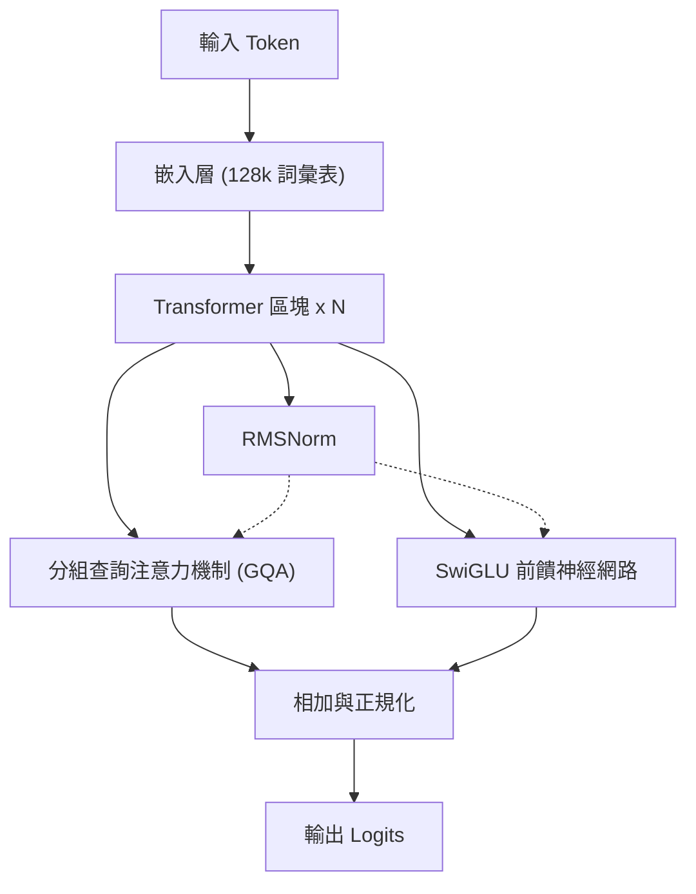
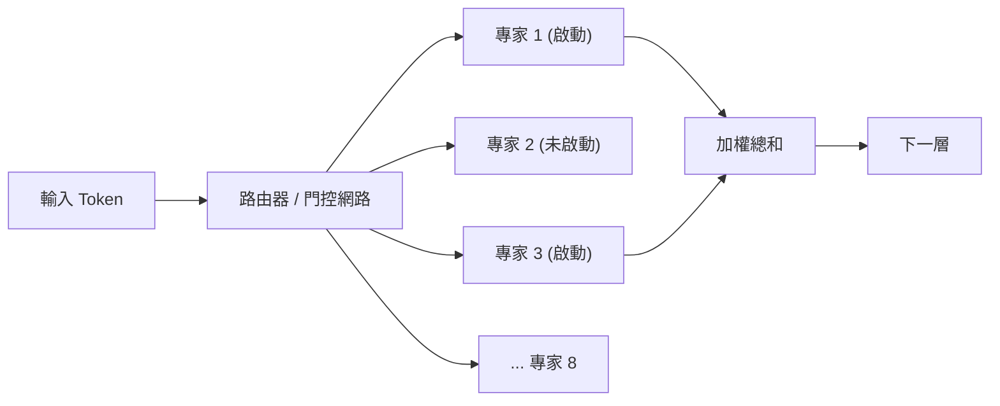
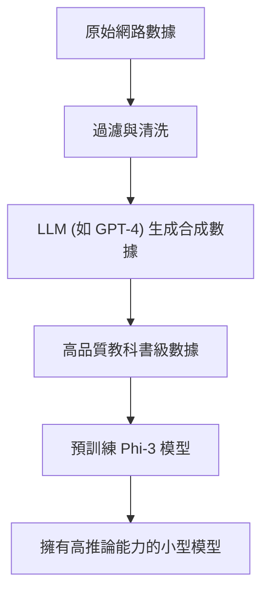
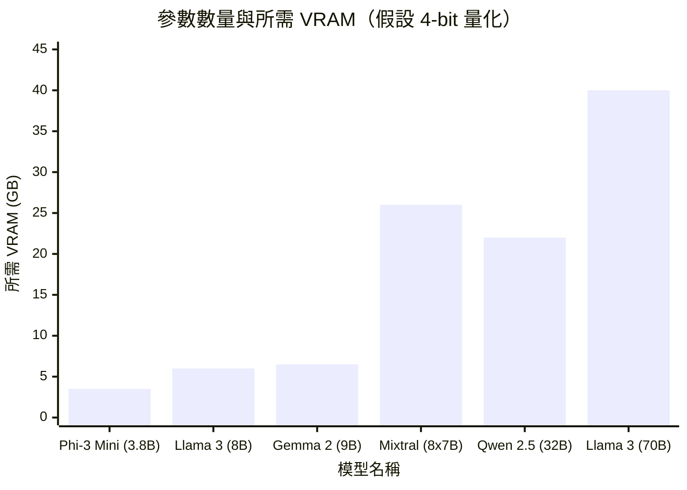

# 前言

近年來，大型語言模型（LLM）的技術進化顯著，如 ChatGPT 和 Claude 等基於雲端的 AI 服務已廣泛普及。然而，與此同時，對於「不想將公司的機密數據發送到外部伺服器」、「希望降低 API 的使用費用」、「想要建構完全離線運行的 AI 系統」等需求也正快速增加。

為了滿足這些需求，「本地 LLM（開源 LLM）」應運而生，你可以直接下載並運行在自己的電腦或公司內部的伺服器上。直到 2023 年左右，要在本地實現實用的精確度依然很困難，但隨著模型架構的進化和量化（Quantization）技術的發展，現在即便是消費級的 GPU（如 NVIDIA RTX 3090 / 4090 或 Mac 的 Apple Silicon 等），也能流暢地運行非常高效的 LLM。

本文將從眾多的開源 LLM 中，挑選出截至 2026 年評價特別高的「推薦 5 款模型」，並從極其詳細且技術性的角度，深入比較與解析它們的架構特徵、參數數量、基於 GGUF 量化的記憶體需求，以及具體的使用案例。

---

# 為什麼要在本地運行 LLM？

導入本地 LLM 擁有許多雲端 API 所不具備的獨特優勢。

### 1. 確保完全的隱私與安全性
使用雲端 API 時，輸入的提示詞與數據會被發送至外部企業的伺服器。在處理個人資訊或企業機密數據時，這將構成重大的風險。如果是本地 LLM，數據將完全在終端設備內進行處理，因此能將數據外洩至外部的風險降至為零。

### 2. 大幅降低成本
商業 API（如 OpenAI API 等）是根據輸入及輸出的 Token 數量進行按量計費。如果需要處理大量文件，或讓聊天機器人持續運作，每個月可能會產生數萬至數百萬日圓的成本。相對地，本地 LLM 只需要硬體的初期投資和電費，即可無限次、不限 Token 數量地使用。

### 3. 客製化能力與離線使用
開源 LLM 很容易使用自有的資料集進行微調（如 LoRA 等）。此外，它可以在沒有網際網路連線的完全離線環境或安全封閉的網路中運行，因此也非常適合嵌入至邊緣裝置中。

---

# 運行本地 LLM 的基礎知識

在介紹模型之前，讓我們先從數學角度整理一下在本地環境中運行 LLM 時不可避免的「VRAM 需求」與「量化（Quantization）」概念。

## VRAM（視訊記憶體）與量化的數學基礎

為了讓 LLM 在 GPU 上進行推論，必須將模型的參數（權重）載入至 VRAM 中。模型的記憶體需求 $M$ 可以用以下公式進行近似計算：

$$ M = \frac{P \times B}{8} + C $$

其中：
- $M$: 所需記憶體容量（GB）
- $P$: 參數數量（Billion = 10億）
- $B$: 每個參數的位元數（FP16 為 16 位元，4-bit 量化為 4 位元）
- $C$: 上下文視窗（KV Cache）或推論時的開銷（通常估計為模型大小的 20%～30% 左右）

例如，如果要以 16 位元浮點數（FP16）運行參數數量為 80 億（8B）的模型：

$$ M_{FP16} = \frac{8 \times 16}{8} = 16 \text{ GB} $$

如果再考慮到 KV Cache 等因素，將會需要將近 18GB 到 20GB 的 VRAM，這對於一般的電競電腦來說很難運行。

### GGUF 格式的崛起

為此，「量化（Quantization）」技術應運而生。透過將參數的精度從 FP16 降低至 8-bit、4-bit，甚至在極端情況下降至 2-bit，可以在將模型效能下降降至最低的同時，大幅減少所需的記憶體量。

目前最普及的格式是由 Georgi Gerganov（llama.cpp 的開發者）所構思的 **GGUF (GPT-Generated Unified Format)**。GGUF 是一種為了在 CPU 與 GPU 上進行高效推論的二進制格式，特別值得一提的是，它與 Mac (Apple Silicon) 的統一記憶體（Unified Memory）架構相容性極佳。

如果將 8B 模型進行 4-bit（例如：Q4_K_M）量化，記憶體的計算如下：

$$ M_{4bit} = \frac{8 \times 4.5}{8} = 4.5 \text{ GB} $$

※由於 Q4_K_M 對部分權重保留了較高的精度，因此實際有效位元數約為 4.5 位元。

如此一來，即使是只有 8GB VRAM 的入門級 GPU 或一般的筆記型電腦，也能夠在本地流暢地運行 8B 等級的強大 LLM。

---

# 推薦的本地 LLM 模型 5 選

接下來，我們將介紹 5 款目前在全球開發者及 AI 研究人員中獲得極高支持的開源 LLM。

## 1. Llama 3 (Meta)

由 Meta 公司開發，已成為開源 LLM 實質上業界標準（De facto standard）的，正是「Llama 3」系列。

### 架構的進化與特徵

Llama 3 雖然採用了標準的 Transformer 架構，但比起上一代（Llama 2）加入了許多技術上的改良。特別值得注意的亮點如下：

- **全面採用 GQA (Grouped Query Attention)**：在 Llama 2 中，GQA 僅被應用於大型模型中，但在 Llama 3 中，即使是像 8B 這樣的小型模型也採用了 GQA。這使得 KV Cache 的記憶體使用量大幅減少，即使在長上下文中也能進行高速推論。
- **詞彙表大小擴充**：分詞器（基於 Tiktoken）的詞彙表大小擴充至 128,000 個 Token，多語言與程式碼的壓縮效率獲得了顯著的提升。日語處理效率相較於 Llama 2 也有數倍的改善。



### 參數規模與使用案例

- **Llama 3 8B**: 80 億參數。4-bit 量化下僅需約 5GB 記憶體即可運行。回應速度極快，非常適合作為電腦上的個人助理，或本地 RAG（檢索增強生成）系統的核心。
- **Llama 3 70B**: 700 億參數。4-bit 量化下需要約 40GB 的 VRAM（或 Apple Silicon 的統一記憶體）。擁有逼近雲端 GPT-4 的效能，在進階推論、複雜程式編寫、數據分析等方面能發揮強大威力。

Llama 3 擁有最深厚的社群支援，而且能立即使用 GGUF、AWQ、EXL2 等所有的量化格式，這也是它的一大優勢。

---

## 2. Mistral / Mixtral (Mistral AI)

來自法國的 AI 新創公司「Mistral AI」所提供的模型，以其高效能以及帶來典範轉移的架構震驚了整個業界。

### MoE (Mixture of Experts) 的運作原理

「Mixtral 8x7B」作為首款正式採用 **MoE (Mixture of Experts)** 架構的開源 LLM，並取得了巨大的成功。
MoE 是指在整個模型（約 470 億參數）中設置了 8 個「專家（Expert）網路」，並根據輸入的每個 Token 動態選擇（路由）最合適的 2 個專家來進行運作的機制。



這個架構最大的優點在於，「雖然總參數數量龐大，但在推論時實際計算的參數（Active Parameters）卻很少」。以 Mixtral 8x7B 為例，推論時啟動的參數僅相當於 13B。這使得它在保持 70B 等級高效能的同時，能顯著提升推論速度。

### 效能與使用案例

- **Mistral 7B / Mistral Nemo (12B)**: 單一的密集（Dense）模型。非常輕量，且使用 Apache 2.0 授權，可自由用於商業用途。在編碼或摘要任務上，其跑分結果能壓倒性地超越同尺寸的其他模型。
- **Mixtral 8x7B / 8x22B**: 高階的 MoE 模型。雖然 VRAM 需求較高（因為必須將整個模型載入記憶體中，8x7B 的 4-bit 約需 26GB），但由於推論速度快，非常適合在 M2/M3 Max 等 Mac 環境下建構本地伺服器。

---

## 3. Gemma 2 (Google)

由 Google 運用自家最先進模型「Gemini」的技術所開發的開源模型便是「Gemma」系列。作為第二代，Gemma 2 在架構上進行了大幅度的改造。

### 獨特的架構設計

Gemma 2 採用了幾項與其他 LLM 截然不同的獨特設計。

- **Logit Soft-capping**: 一種防止生成異常大的 Logit 值，以提高訓練與推論穩定性的技術。
- **Sliding Window Attention (SWA) 與 Local Attention 的混合**: 並非在所有層中都執行全局注意力機制，而是將只關注局部上下文的層與關注全局的層交替排列。

SWA 所減少的計算量可以從數學角度顯示如下。相較於一般的自注意力（Self-Attention）計算量 $O(N^2)$，使用了視窗大小 $W$ 的 SWA 計算量如下：

$$ \text{Complexity}_{SWA} = O(N \times W) $$

其中，$N$ 為序列長度，$W$ 為固定的視窗大小。當 $N$ 越大（輸入長文）時，SWA 節省計算資源的效果就越顯著。

### 效能與使用案例

- **Gemma 2 2B / 9B**: 2B 模型能在智慧型手機或 Raspberry Pi 等極度受限的資源環境中運行，9B 模型則針對一般電腦設計。特別是 9B 模型，在許多任務中的跑分結果甚至超越了 Llama 3 8B，是目前 10B 以下最強等級的模型之一。
- **Gemma 2 27B**: 270 億參數。其特點在於 4-bit 或 6-bit 量化後能完美塞進 24GB VRAM（如 RTX 3090 / 4090）的「絕佳尺寸感」。擅長處理程式編寫及複雜的日語指令，在熱衷者（Enthusiast）之間非常受歡迎。

---

## 4. Qwen 2.5 (Alibaba Cloud)

由阿里雲開發的 Qwen 系列，是在多語言處理、程式編寫及數學推論方面擁有全球頂尖效能的模型。

### 多語言支援與程式編寫能力

Qwen 2.5 在龐大的多語言語料庫上進行了預訓練，除了英文與中文外，在**日語自然輸出方面獲得了極高的評價**。對於日本用戶來說，「不會產生不自然的翻譯腔日文」是其最大的優勢。
此外，還有專注於程式編寫能力的「Qwen 2.5 Coder」模型，將其與 VSCode 擴充套件（如 Continue 等）結合，作為本地版 GitHub Copilot 替代方案的使用案例正在急遽增加。

### 架構與使用案例

- **Tie Word Embeddings**: 採用了輸入嵌入層（Embedding）與輸出層共用權重（Tie）的機制，在節省參數數量的同時進行高效訓練。
- **RoPE (Rotary Position Embedding) 的擴充**: 支援最大 128K Token 的超長上下文視窗，這使得在本地讀取巨大的 PDF 文件或分析數萬行原始碼成為可能。

模型尺寸劃分得非常細緻，有 0.5B, 1.5B, 3B, 7B, 14B, 32B, 72B，能讓使用者選擇剛好達到自己硬體規格（VRAM 容量）極限的尺寸，這也是 Qwen 非常吸引人的一點。

---

## 5. Phi-3 / Phi-3.5 (Microsoft)

從 Microsoft 提倡的「Textbook is all you need（教科書就是一切）」典範中誕生出來的，便是 Phi 系列。

### SLM（小型語言模型）的革命

近年來的 LLM 開發主流是「無論如何都要增加參數數量與數據量」的暴力美學，但 Microsoft 證明了「只要將輸入模型的數據品質（高品質的教科書數據或合成數據）提升到極致，即便參數數量很少，也能擁有媲美 GPT-3.5 等級的智慧」。
Phi-3 並非 LLM（Large Language Model），而是被稱為 **SLM（Small Language Model）**。



### 效能與使用案例

- **Phi-3 Mini (3.8B)**: 設想為能在智慧型手機上原生運行（使用 ONNX Runtime 等）而設計的模型。儘管參數不到 4B，但其推論與邏輯思考能力驚人地高，如果是簡單的問答或文本整理任務，瞬間就能完成。
- **Phi-3.5 Vision / MoE**: 也釋出了能夠辨識圖片的 Vision 模型，以及 MoE 版本。

作為邊緣設備中的本地 AI 實作、行動應用的內建功能，或者在背景持續常駐的超輕量級代理，Phi-3 系列無出其右。

---

# 模型的技術性比較與跑分

在這裡，我們從量化角度來比較運行上述介紹模型時的「VRAM 需求」與「推論速度」。

## 參數數量與 VRAM 需求的關係（GGUF 4-bit 量化時）

以下圖表顯示了各模型的參數數量對應推論時所需 VRAM 的估計值（包含 KV Cache 開銷）。



※Mixtral 8x7B 由於總參數較大，會消耗較多 VRAM，但由於計算本身較輕，因此對 GPU 計算資源（如 CUDA 核心等）的負載較低。

## 推論速度（Tokens/sec）的理論計算

本地 LLM 的推論速度強烈依賴於 GPU 的「記憶體頻寬（Memory Bandwidth）」。這因為在生成階段（解碼）中，每生成一個 Token 都必須從記憶體中讀取出模型的所有權重。因此這是受記憶體限制（Memory-bound）的處理，而非受運算限制（Compute-bound）。

理論上的最大推論速度 $T$（Tokens/sec），可透過以下公式計算：

$$ T = \frac{\text{BW}}{M_{\text{weights}}} $$

其中：
- $\text{BW}$: GPU 的有效記憶體頻寬 (GB/s)
- $M_{\text{weights}}$: 已載入模型的大小 (GB)

舉例來說，計算在 NVIDIA RTX 4090（記憶體頻寬 1,008 GB/s）上運行 Llama 3 8B 4-bit 版（約 4.5 GB）的情況。假設有效頻寬約為理論值的 80%（約 800 GB/s）：

$$ T \approx \frac{800}{4.5} \approx 177 \text{ Tokens/sec} $$

這是遠超人類閱讀速度的驚人速度。另一方面，在同一張 RTX 4090 上運行 Llama 3 70B（4-bit 版約 40GB ※假設分割至 2 張 GPU 的情況下），Token 生成速度大約會落在 20 Tokens/sec 左右。透過這種方式，可以透過公式事先從自己的電腦規格預測「輸出的速度大概會多快」。

---

# 運行本地 LLM 的工具

目前，用於在本地環境中運行這些強大開源 LLM 的軟體生態系也非常豐富。以下介紹 3 款代表性工具。

### 1. Ollama
目前最簡單且最受歡迎的工具。它像 Docker 一樣，只需一行指令就能完成從下載模型到運行的過程。支援 Mac、Windows 及 Linux。
只要打開終端機，輸入以下指令，Llama 3 就會啟動。

```bash
ollama run llama3
```
此外，Ollama 能在背景作為 REST API 伺服器運作，因此與 Python 腳本或外部應用程式整合也極其容易。

### 2. LM Studio
推薦給想要透過 GUI 介面直覺操作的使用者。您可以從應用程式內搜尋並下載 Hugging Face 上龐大的 GGUF 模型列表，並在類似 ChatGPT 的聊天畫面中享受對話。它還有一項非常方便的功能，能以視覺化的方式告訴您哪個模型適合您電腦的 RAM/VRAM 容量。

### 3. llama.cpp
本地 LLM 熱潮的推手，也是一切基礎的 C/C++ 實作函式庫。適合想要將效能調校到極致的工程師，或是想要將其嵌入至自訂腳本的駭客。它能將所有硬體的潛能發揮到極限，支援 Apple 的 Metal、NVIDIA 的 CUDA、AMD 的 ROCm，甚至 Intel 的 AVX 指令集。

---

# 總結與未來展望

本文介紹了截至 2026 年最高水準的 5 款開源本地 LLM，並解說了其架構與技術背景。依照目的區分的選擇方式總結如下：

1. **重視整體平衡與生態系**: `Llama 3 (8B / 70B)`
2. **想在 Mac 等大容量統一記憶體環境中進行高速推論**: `Mixtral 8x7B`
3. **想在 24GB 等級 VRAM 中發揮最大智慧**: `Gemma 2 27B` 或 `Qwen 2.5 32B`
4. **目標是自然的日語輸出與進階的程式編寫輔助**: `Qwen 2.5`
5. **在手機、效能較差的電腦，或於背景進行超輕量處理**: `Phi-3 / Phi-3.5`

開源 LLM 的進化速度非常驚人，幾乎每隔幾個月就會發表顛覆以往常識的突破。未來，隨著量化技術的進一步提升與新架構的出現，或許光靠本地環境就能超越雲端 AI 的日子也不遠了。
請務必配合您自身的硬體環境下載最合適的模型，親身體驗本地 AI 所帶來的壓倒性自由與可能性。
