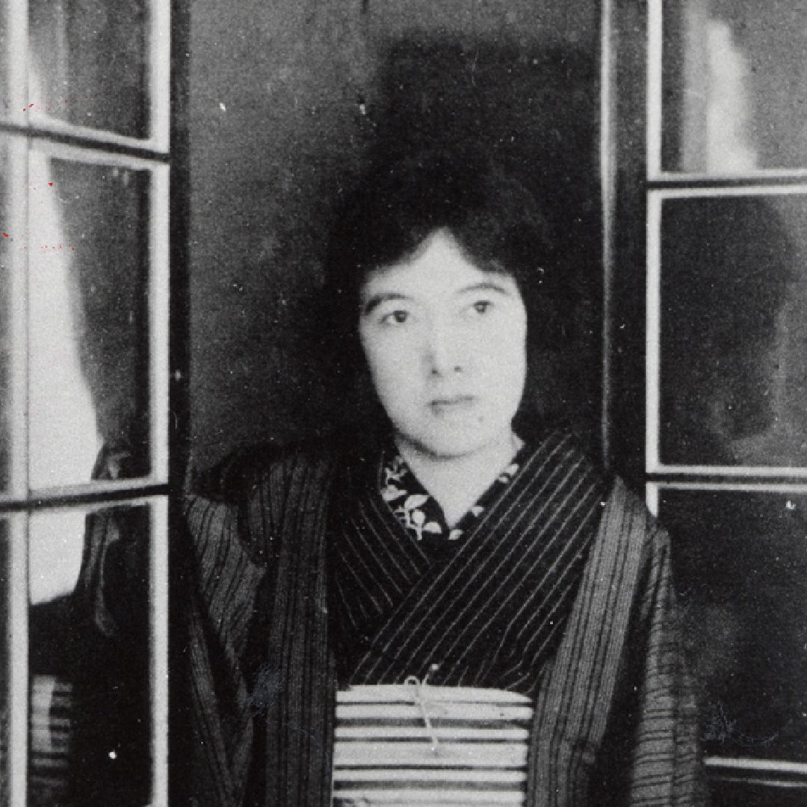

## 🔹 人物概要

与謝野晶子（よさの あきこ、1878年～1942年）は、明治から昭和初期にかけて活躍した日本の歌人・作家・思想家です。特に情熱的で個性的な短歌作品で知られ、近代日本文学における女性の自立や恋愛表現の新しい地平を切り拓いた人物です。

* **本名**：与謝野（旧姓：鳳）しょう（しょう＝うへんに「昇」）
* **出身地**：堺（大阪府堺市）
* **夫**：与謝野鉄幹（歌人・詩人）
* **主な活動時期**：明治後期〜昭和初期
* **特徴**：

    * 女性の恋愛感情を率直に詠んだ短歌で注目される
    * フェミニズム的思想を持ち、女性の教育や自立を推進
    * 日露戦争を批判する平和主義的な姿勢も示した
    * 『明星』という文学雑誌の中心メンバー

---

## 🔹 代表作とそのあらすじ・特徴

### 1. 『みだれ髪』（1901年）

* **概要**：処女歌集。20代前半に発表され、日本文壇に大きな衝撃を与えた。
* **特徴**：恋愛感情や肉体的な欲望を女性の立場から率直に表現。
* **有名な歌**：

> やは肌の
> 熱き血潮に触れも見で
> さびしからずや　道を説く君

→ 当時の倫理観では大胆とされる恋愛観を女性自身の言葉で表現したことで話題になりました。

---

### 2. 『君死にたまふことなかれ』（1904年）

* **形式**：詩（短歌ではなく詩文）
* **内容**：日露戦争に出征した弟に宛てた反戦詩。
* **一部抜粋**：

> 君死にたまふことなかれ
> 末に生れし君なれば
> 母上なみだしげくして
> 君の袂をしぼりつつ……

* **意義**：当時、戦争を美化する風潮が強い中で、弟の死を憂う女性の立場から反戦を訴えた点で画期的。

---

## 🔹 影響と評価

* 女性解放や平和主義、教育の普及など、社会的にも先進的な活動を行った。
* 晩年は女子教育に尽力し、女子大学の設立にも関わった（文化学院など）。
* 戦前日本におけるもっとも重要な女性知識人・文学者のひとり。

---

## 🔹まとめ

| 項目     | 内容                       |
| ------ | ------------------------ |
| 名前     | 与謝野晶子                    |
| 活動分野   | 短歌、詩、評論、教育               |
| 主な作品   | 『みだれ髪』『君死にたまふことなかれ』      |
| 特徴     | 恋愛の自由、女性の自立、平和主義の表現      |
| 現代への影響 | フェミニズム文学、近代短歌の革新、反戦詩の先駆者 |

---
