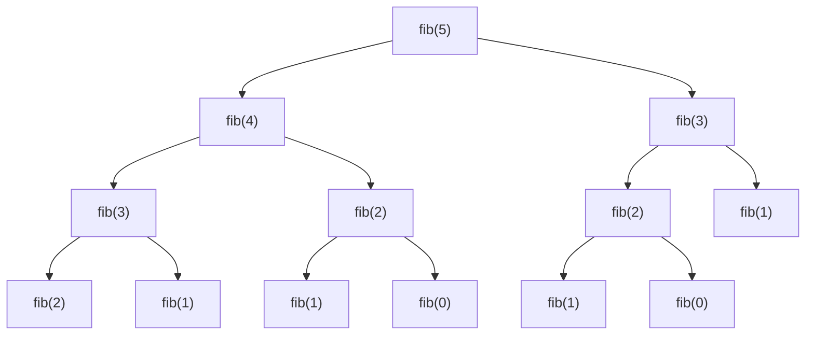
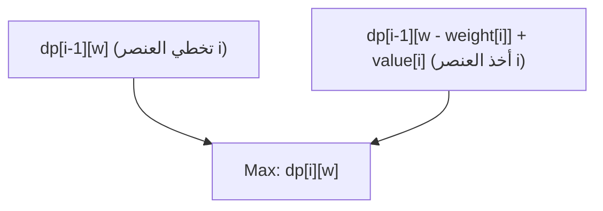
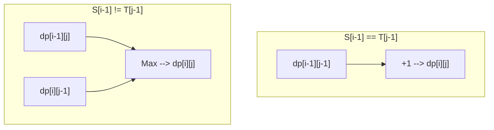

من البرمجة التنافسية إلى تصميم الخوارزميات العملي، تظهر **البرمجة الديناميكية (Dynamic Programming، وتُعرف اختصارًا بـ DP)** في العديد من المواقف، وتشكل عقبة للكثير من المبرمجين. "لا أستطيع صياغة علاقة التكرار"، "تختلط عليّ الفهارس"، "لا أستطيع تحديد ما إذا كان يمكن حل المشكلة باستخدام DP أم لا"...... ربما يعاني الكثيرون من هذه المشاكل.

في هذا المقال، سنغطي كل شيء بشكل شامل، بدءًا من جوهر البرمجة الديناميكية، والمقاربات المحددة (من أعلى إلى أسفل ومن أسفل إلى أعلى)، ووصولاً إلى الشروحات العملية من خلال ثلاث مشاكل نموذجية (متتالية فيبوناتشي، مشكلة حقيبة الظهر 0/1، وأطول تسلسل جزئي مشترك). سنقدم أمثلة برمجية باستخدام كل من C++ و Python، مع المعادلات والرسوم التوضيحية لتوفير مسار يتيح لك "الإتقان الكامل". سيكون هذا المقال طويلاً جدًا، ولكن عند الانتهاء من قراءته، ستشهد مهاراتك في الخوارزميات قفزة هائلة بالتأكيد.

---

## 1. ما هي البرمجة الديناميكية (DP)؟

البرمجة الديناميكية (Dynamic Programming) هي تقنية لتصميم الخوارزميات تقلل بشكل جذري من التعقيد الحسابي عن طريق تقسيم المشكلات المعقدة إلى "مشكلات فرعية" أصغر، وتسجيل وإعادة استخدام حلول هذه المشكلات الفرعية.

تم ابتكار هذه التقنية في الخمسينيات من القرن الماضي بواسطة ريتشارد بيلمان (Richard Bellman)، وتُظهر قوة هائلة في مشاكل التحسين (Optimization Problems). لا يوجد معنى خاص لكلمة "ديناميكية (Dynamic)" هنا، وهناك قصة تقول إنه اختار "كلمة ذات وقع جيد" للحصول على تمويل للأبحاث في ذلك الوقت، ولكنها الآن رسخت مكانتها كواحدة من أهم المفاهيم في علوم الحاسوب.

لكي تكون البرمجة الديناميكية فعّالة، يجب أن تستوفي المشكلة المستهدفة **الخاصيتين المهمتين** التاليتين.

### 1-1. تداخل المشكلات الفرعية (Overlapping Subproblems)

وهي الخاصية التي تظهر فيها **نفس المشكلات الفرعية مرارًا وتكرارًا** أثناء عملية حل المشكلة الكبرى.

على سبيل المثال، في حساب متتالية فيبوناتشي الذي سنناقشه لاحقًا، تكون عملية "حساب الحد الثالث" مطلوبة عند حساب الحد الخامس وكذلك عند حساب الحد الرابع. إذا لم تتداخل المشكلات الفرعية (مثل: أسلوب فرق تسد - Divide and Conquer كما في خوارزمية ترتيب الدمج - Merge Sort)، فلا توجد فائدة من تسجيل الحل، وبالتالي لا تكون الـ DP قابلة للتطبيق. نظرًا لوجود التداخل، يمكنك حفظ النتيجة التي تم حسابها مرة واحدة في الذاكرة (الحفظ أو الجدولة)، وإعادة استخدامها، مما يتيح تسريعًا هائلاً.

### 1-2. البنية التحتية المثلى (Optimal Substructure)

وهي الخاصية التي تعني أن **"الحل الأمثل للمشكلة ككل يتكون من الحلول المثلى لمشكلاتها الفرعية"**.

مشكلة أقصر مسار هي مثال واضح على ذلك. إذا كان أقصر مسار من المدينة A إلى المدينة C يمر عبر المدينة B، فيجب أن يكون "المسار من المدينة A إلى المدينة B" أيضًا أقصر مسار من A إلى B. لأنه إذا لم يكن المسار من A إلى B هو الأمثل (الأقصر)، فيمكننا تحسينه لجعل المسار الإجمالي من A إلى C أقصر. هذه الخاصية، التي تتيح الجمع بين الحلول المثلى الجزئية لاستنتاج الحل الأمثل الإجمالي، تشكل الأساس لانتقال الحالة في البرمجة الديناميكية.

---

## 2. مقاربتان: من أعلى إلى أسفل ومن أسفل إلى أعلى

توجد طريقتان رئيسيتان لتنفيذ البرمجة الديناميكية: "من أعلى إلى أسفل (العودية مع الحفظ / Memoization)" و "من أسفل إلى أعلى (الجدولة / Tabulation)". الفهم العميق لخصائص كل منهما والقدرة على استخدامهما حسب الموقف هو الخطوة الأولى نحو الإتقان.

### مقاربة من أعلى إلى أسفل (العودية مع الحفظ / Memoization)

تبدأ من المشكلة الكبرى وتقوم باستدعاء المشكلات الفرعية الضرورية بشكل عودي لحلها. في هذه العملية، يتم "حفظ" إجابات المشكلات الفرعية المحسوبة مسبقًا في مصفوفة أو جدول تجزئة (Hash Map)، وفي المرات القادمة يتم إرجاع النتيجة من الذاكرة المحفوظة دون إجراء الحسابات.

- **المميزات:** 
  - سهلة التنفيذ وفقًا لعملية التفكير الطبيعية (علاقة التكرار).
  - يتم حساب المشكلات الفرعية الضرورية فقط، مما يجعلها مفيدة إذا تم الوصول إلى جزء فقط من فضاء الحالة الإجمالي.
- **العيوب:** 
  - يوجد عبء إضافي (Overhead) لاستدعاءات الدوال الناتجة عن الاستدعاء العودي.
  - إذا كان عمق الاستدعاء العودي كبيرًا، فهناك خطر حدوث طفح المكدس (Stack Overflow) (يتطلب ذلك حذرًا خاصًا في لغات مثل Python).

### مقاربة من أسفل إلى أعلى (الجدولة / Tabulation)

تبدأ من أصغر مشكلة فرعية (الحالة الأساسية)، وتقوم بتعبئة حلول المشكلات الأكبر تباعًا في جدول (مصفوفة) باستخدام حلقات التكرار. في النهاية، يتم تخزين حل المشكلة الإجمالية المطلوب في مكان محدد بالجدول.

- **المميزات:** 
  - لا يوجد عبء إضافي بسبب الاستدعاء العودي، وسرعة التنفيذ عالية.
  - يميل الوصول إلى الذاكرة إلى أن يكون متتابعًا، مما يرفع من كفاءة ذاكرة التخزين المؤقت.
  - يسهل إجراء "تحسين التعقيد المكاني (إعادة استخدام المصفوفة)" الذي سنشرحه لاحقًا.
- **العيوب:** 
  - نظرًا لأنه يتم حساب جميع الحالات، فقد ينتهي بك الأمر إلى حساب حالات غير ضرورية.
  - يجب فهم علاقة التبعية (الترتيب الطوبولوجي) لعلاقة التكرار بدقة وإجراء حلقة التكرار بالترتيب الصحيح.

---

## 3. التطبيق العملي 1: متتالية فيبوناتشي

أولاً، كمثال أساسي وسهل الفهم، سنتناول متتالية فيبوناتشي.
تُعرّف متتالية فيبوناتشي على النحو التالي:

$$
F(0) = 0, \quad F(1) = 1 \\
F(n) = F(n-1) + F(n-2) \quad (n \ge 2)
$$

### 3-1. العودية البسيطة (انفجار التعقيد الحسابي)

ماذا سيحدث إذا كتبنا دالة عودية تتبع هذا التعريف تمامًا؟

```python
def fib_naive(n):
    if n <= 1:
        return n
    return fib_naive(n-1) + fib_naive(n-2)
```

هذا التنفيذ بديهي، لكن التعقيد الحسابي يسبب انفجارًا أسيًا مقداره $O(2^n)$. والسبب هو أن الحسابات لنفس المعطيات تتكرر عدة مرات. يوضح الشكل التالي شجرة الاستدعاء العودي عند حساب $F(5)$.



بالنظر إلى الشكل، يمكنك أن ترى أنه يتم تقييم `"fib(3)"` و `"fib(2)"` عدة مرات. هذا هو "تداخل المشكلات الفرعية".

### 3-2. مقاربة من أعلى إلى أسفل (العودية مع الحفظ)

نستخدم مصفوفة أو قاموسًا لحفظ النتائج المحسوبة. وبذلك يصبح التعقيد الحسابي $O(n)$.

**تنفيذ Python:**
```python
def fib_memo(n, memo=None):
    if memo is None:
        memo = {}
    if n in memo:
        return memo[n]
    if n <= 1:
        return n
    # الحساب والحفظ في الذاكرة
    memo[n] = fib_memo(n-1, memo) + fib_memo(n-2, memo)
    return memo[n]
```

**تنفيذ C++:**
```cpp
#include <iostream>
#include <vector>

std::vector<long long> memo;

long long fib_memo(int n) {
    if (n <= 1) return n;
    // إذا كان قد تم حسابه مسبقاً، أعد القيمة من الذاكرة المحفوظة
    if (memo[n] != -1) return memo[n];
    
    // الحساب والحفظ في الذاكرة
    return memo[n] = fib_memo(n - 1) + fib_memo(n - 2);
}

int main() {
    int n = 50;
    memo.assign(n + 1, -1);
    std::cout << fib_memo(n) << std::endl;
    return 0;
}
```

### 3-3. مقاربة من أسفل إلى أعلى (الجدولة)

هي مقاربة لتعبئة المصفوفة بالترتيب من الأصغر إلى الأكبر. لا يوجد قلق من حدوث طفح المكدس، وتعمل بسرعة فائقة.

**تنفيذ Python:**
```python
def fib_dp(n):
    if n <= 1:
        return n
    dp = [0] * (n + 1)
    dp[1] = 1
    for i in range(2, n + 1):
        dp[i] = dp[i-1] + dp[i-2]
    return dp[n]
```

**تنفيذ C++:**
```cpp
#include <iostream>
#include <vector>

long long fib_dp(int n) {
    if (n <= 1) return n;
    std::vector<long long> dp(n + 1, 0);
    dp[1] = 1;
    for (int i = 2; i <= n; ++i) {
        dp[i] = dp[i - 1] + dp[i - 2];
    }
    return dp[n];
}
```

### 3-4. تحسين التعقيد المكاني

إذا لاحظت مقاربة من أسفل إلى أعلى بعناية، فستجد أن كل ما تحتاجه لحساب $dp[i]$ هو القيمتان الأخيرتان فقط، $dp[i-1]$ و $dp[i-2]$، ولا تحتاج إلى القيم السابقة لهما. لذلك، لا داعي للاحتفاظ بالمصفوفة بأكملها، بل يمكن متابعة الحساب باستخدام متغيرين اثنين فقط. وبهذا، يمكن تقليل التعقيد المكاني من $O(n)$ إلى $O(1)$.

**تنفيذ Python:**
```python
def fib_optimized(n):
    if n <= 1:
        return n
    prev2, prev1 = 0, 1
    for i in range(2, n + 1):
        current = prev1 + prev2
        prev2 = prev1
        prev1 = current
    return current
```

---

## 4. التطبيق العملي 2: مشكلة حقيبة الظهر 0/1 (0/1 Knapsack Problem)

التالي هو مشكلة تحسين حقيقية وكاملة. تُعرف مشكلة حقيبة الظهر 0/1 بأنها البوابة لفهم البرمجة الديناميكية.

### 4-1. إعداد المشكلة

لدينا حقيبة ظهر بسعة $W$. وهناك $n$ من العناصر، ولكل عنصر $i$ ($1 \le i \le n$) وزن محدد $weight[i]$ وقيمة محددة $value[i]$.
عند اختيار عناصر بحيث لا يتجاوز مجموع أوزانها سعة حقيبة الظهر، ما هو الحد الأقصى لإجمالي القيمة التي يمكن الحصول عليها؟
(※ "0/1" تعني أن الخيار لكل عنصر هو إما "عدم الاختيار (0)" أو "الاختيار (1)". لا يمكن تقسيم العناصر.)

### 4-2. تعريف الحالة ومعادلة انتقال الحالة

أهم خطوة لحل DP هي تحديد "الحالة (State)" بشكل مناسب.
في هذه المشكلة، يتغير وسيطان: "حتى أي عنصر تم النظر؟" و "ما هي السعة المتبقية في حقيبة الظهر؟". بناءً على ذلك، نحدد الحالة كالتالي:

**تعريف الحالة:**
$dp[i][w]$ := الحد الأقصى للقيمة الإجمالية عند اختيار عناصر فقط من الأول حتى العنصر رقم $i$، بحيث لا يتجاوز مجموع أوزانها $w$.

بعد ذلك، نفكر في كيفية تغير هذه الحالة (الانتقال). عند النظر في العنصر رقم $i$، هناك خياران:
1. **في حالة عدم اختيار العنصر رقم $i$:** 
   الحد الأقصى للقيمة هو نفس الحد الأقصى للقيمة للعناصر حتى رقم $i-1$ مع استيفاء السعة $w$.
   أي، $dp[i-1][w]$
2. **في حالة اختيار العنصر رقم $i$:** 
   نظرًا لأن وزن هذا العنصر هو $weight[i]$، فيجب أن يكون هناك مساحة فارغة في الحقيبة تبلغ على الأقل $weight[i]$ ($w \ge weight[i]$). في حالة اختياره، تزيد القيمة التي نحصل عليها بمقدار $value[i]$، لكن السعة المتاحة تقل بمقدار $weight[i]$. وبالتالي، تكون النتيجة هي الحد الأقصى للقيمة التي يمكن الحصول عليها من العناصر حتى $i-1$ للسعة المتبقية $w - weight[i]$، مضافًا إليها $value[i]$.
   أي، $dp[i-1][w - weight[i]] + value[i]$

بما أننا نختار أيهما يعطي قيمة أكبر ($\max$) من هذين الخيارين، تصبح **معادلة انتقال الحالة** كالتالي:

$$
dp[i][w] = 
\begin{cases} 
dp[i-1][w] & \text{if } w < weight[i] \\
\max(dp[i-1][w], dp[i-1][w - weight[i]] + value[i]) & \text{if } w \ge weight[i]
\end{cases}
$$

**الحالة الأساسية (الشروط الأولية):**
عندما يكون عدد العناصر 0 ($i=0$)، أو عندما تكون السعة 0 ($w=0$)، يكون الحد الأقصى للقيمة هو 0.
$$ dp[0][w] = 0, \quad dp[i][0] = 0 $$

يمثل مخطط Mermaid التالي مفهوم انتقال الحالة بشكل مرئي.



### 4-3. تنفيذ من أسفل إلى أعلى (مصفوفة ثنائية الأبعاد)

نقوم بتحويل هذه الصيغة الرياضية مباشرة إلى كود.

**تنفيذ C++:**
```cpp
#include <iostream>
#include <vector>
#include <algorithm>

int knapsack(int W, const std::vector<int>& weight, const std::vector<int>& value) {
    int n = weight.size();
    // تهيئة مصفوفة ثنائية الأبعاد dp[n+1][W+1] بـ 0
    std::vector<std::vector<int>> dp(n + 1, std::vector<int>(W + 1, 0));

    // إضافة العناصر والنظر فيها واحدًا تلو الآخر
    for (int i = 1; i <= n; ++i) {
        // حساب جميع أنماط السعة
        for (int w = 0; w <= W; ++w) {
            if (w < weight[i - 1]) {
                // حالة عدم القدرة على الاختيار لعدم كفاية السعة
                dp[i][w] = dp[i - 1][w];
            } else {
                // اختيار الأكبر بين حالة عدم الاختيار وحالة الاختيار
                dp[i][w] = std::max(dp[i - 1][w], dp[i - 1][w - weight[i - 1]] + value[i - 1]);
            }
        }
    }
    
    return dp[n][W];
}

int main() {
    int W = 50;
    std::vector<int> weight = {10, 20, 30};
    std::vector<int> value = {60, 100, 120};
    std::cout << "Max Value: " << knapsack(W, weight, value) << std::endl;
    return 0;
}
```
*(※يرجى ملاحظة أنه في C++، تبدأ فهارس المصفوفات من 0، لذا نستخدم `weight[i-1]`.)*

### 4-4. تحسين التعقيد المكاني (التحويل إلى مصفوفة أحادية الأبعاد)

عند تحديث المصفوفة ثنائية الأبعاد $dp[i][w]$، نلاحظ أننا نرجع دائمًا إلى الصف السابق فقط $dp[i-1]$. هذا هو نفس مبدأ تحسين المساحة في متتالية فيبوناتشي.
لذلك، يمكن ضغط المصفوفة لتصبح أحادية الأبعاد $dp[w]$. ومع ذلك، يجب توخي الحذر عند التحديث. يجب تشغيل حلقة التكرار للسعة $w$ **من الأكبر إلى الأصغر (من الخلف إلى الأمام)**. إذا قمنا بالتحديث من الأمام، فسنشير إلى "حالة العنصر رقم $i$" التي تم تحديثها للتو في نفس الخطوة بدلاً من "حالة العنصر $i-1$"، مما يؤدي إلى اختيار نفس العنصر عدة مرات (وهذا يمثل حلاً لـ "مشكلة حقيبة الظهر غير المحدودة").

**تنفيذ Python (أحادي الأبعاد):**
```python
def knapsack_1d(W, weight, value):
    n = len(weight)
    dp = [0] * (W + 1)
    
    for i in range(n):
        # التكرار من W بشكل عكسي
        for w in range(W, weight[i] - 1, -1):
            dp[w] = max(dp[w], dp[w - weight[i]] + value[i])
            
    return dp[W]

W = 50
weight = [10, 20, 30]
value = [60, 100, 120]
print("Max Value:", knapsack_1d(W, weight, value))
```
وبذلك، يتحسن التعقيد المكاني بشكل كبير من $O(nW)$ إلى $O(W)$. إنها تقنية لا غنى عنها في البرمجة العملية والتنافسية.

---

## 5. التطبيق العملي 3: أطول تسلسل جزئي مشترك (LCS: Longest Common Subsequence)

كمشكلة DP نموذجية تتعامل مع السلاسل النصية، سنتناول الـ LCS. إن خوارزمية LCS مطبقة على نطاق واسع في العالم الحقيقي، مثل الكشف عن الاختلافات في الملفات (أدوات diff) وتقييم التشابه في تسلسلات الحمض النووي.

### 5-1. إعداد المشكلة

لدينا سلسلتان نصيتان $S$ و $T$. أوجد أطول طول للتسلسل الجزئي المشترك بينهما (التسلسل الجزئي هو سلسلة تتكون عن طريق حذف صفر أو أكثر من الأحرف من السلسلة الأصلية مع الحفاظ على الترتيب).

مثال: عندما تكون $S = \text{"ABCBDAB"}$ و $T = \text{"BDCABA"}$، يكون الـ LCS هو $\text{"BCBA"}$ أو $\text{"BDAB"}$ إلخ، وطوله هو 4.

### 5-2. تعريف الحالة ومعادلة انتقال الحالة

لنفترض أن أطوال السلاسل النصية هي $m, n$ على التوالي. في هذه الحالة أيضًا، نعتبر طول البادئات (السلاسل النصية الجزئية من البداية) للسلسلتين هو الحالة.

**تعريف الحالة:**
$dp[i][j]$ := طول أطول تسلسل جزئي مشترك (LCS) بين أول $i$ حرف من السلسلة $S$ وأول $j$ حرف من السلسلة $T$.

نركز على الحرف الأخير من كل سلسلة نصية $S[i-1]$ و $T[j-1]$ ونفكر في الانتقال.
1. **في حالة $S[i-1] == T[j-1]$:** 
   بما أن الحرف الأخير متطابق، فإنه بالتأكيد سيكون جزءًا من الـ LCS. لذلك، نضيف 1 إلى طول LCS للسلسلتين بعد تقصير كل منهما بحرف واحد.
   $dp[i][j] = dp[i-1][j-1] + 1$
2. **في حالة $S[i-1] \neq T[j-1]$:** 
   بما أن الحرف الأخير مختلف، فإن واحدًا منهما على الأقل لن يكون ضمن الـ LCS. نأخذ الطول الأطول من بين الحالتين: تقليل $S$ بحرف واحد ($dp[i-1][j]$)، وتقليل $T$ بحرف واحد ($dp[i][j-1]$).
   $dp[i][j] = \max(dp[i-1][j], dp[i][j-1])$

وباختصار، تصبح معادلة انتقال الحالة كما يلي.

$$
dp[i][j] = 
\begin{cases} 
0 & \text{if } i = 0 \text{ or } j = 0 \\
dp[i-1][j-1] + 1 & \text{if } i > 0, j > 0 \text{ and } S[i-1] = T[j-1] \\
\max(dp[i-1][j], dp[i][j-1]) & \text{if } i > 0, j > 0 \text{ and } S[i-1] \neq T[j-1]
\end{cases}
$$

إذا عبرنا عن هذا الانتقال باستخدام Mermaid، فسيكون كالتالي.



### 5-3. تنفيذ من أسفل إلى أعلى

يمكن تنفيذ هذا أيضًا ببساطة باستخدام مصفوفة ثنائية الأبعاد.

**تنفيذ Python:**
```python
def longest_common_subsequence(text1: str, text2: str) -> int:
    m, n = len(text1), len(text2)
    # مصفوفة ثنائية الأبعاد m+1 صف و n+1 عمود، مليئة بالأصفار
    dp = [[0] * (n + 1) for _ in range(m + 1)]
    
    for i in range(1, m + 1):
        for j in range(1, n + 1):
            if text1[i-1] == text2[j-1]:
                dp[i][j] = dp[i-1][j-1] + 1
            else:
                dp[i][j] = max(dp[i-1][j], dp[i][j-1])
                
    return dp[m][n]

S = "ABCBDAB"
T = "BDCABA"
print("LCS Length:", longest_common_subsequence(S, T))
```

**تنفيذ C++:**
```cpp
#include <iostream>
#include <vector>
#include <string>
#include <algorithm>

int longest_common_subsequence(const std::string& text1, const std::string& text2) {
    int m = text1.size();
    int n = text2.size();
    std::vector<std::vector<int>> dp(m + 1, std::vector<int>(n + 1, 0));
    
    for (int i = 1; i <= m; ++i) {
        for (int j = 1; j <= n; ++j) {
            if (text1[i-1] == text2[j-1]) {
                dp[i][j] = dp[i-1][j-1] + 1;
            } else {
                dp[i][j] = std::max(dp[i-1][j], dp[i][j-1]);
            }
        }
    }
    
    return dp[m][n];
}

int main() {
    std::string S = "ABCBDAB";
    std::string T = "BDCABA";
    std::cout << "LCS Length: " << longest_common_subsequence(S, T) << std::endl;
    return 0;
}
```

في مشكلة LCS أيضًا، نستخدم فقط الصف السابق (`dp[i-1]`) والصف الحالي (`dp[i]`) للتحديث، لذلك يمكن إجراء الحسابات بمصفوفة من صفين فقط (عدد العناصر $2n$). يُطلق على ذلك "المصفوفة الدوارة (Rolling Array)". وهي تقنية مفيدة للغاية لتقليل التعقيد المكاني بشكل كبير.

---

## 6. عملية التفكير لإتقان البرمجة الديناميكية

لقد رأينا حتى الآن العديد من المشكلات، ولكن عندما تواجه مشكلة DP غير مألوفة، كيف يجب أن تفكر؟ ضع في اعتبارك الخطوات التالية دائمًا.

1. **هل يمكن حل هذه المشكلة باستخدام DP؟ (التحقق من الشروط)**
   عند التفكير بشكل عودي، هل تظهر نفس الحالة مرارًا وتكرارًا (تداخل المشكلات الفرعية)؟ هل يمكن الجمع بين أفضل الخيارات للوصول إلى الأفضل ككل (البنية التحتية المثلى)؟
2. **تحديد الحالة (State)**
   حدد المتغيرات التي تمثل "أين نحن الآن؟"، "ما المتبقي؟"، و "ما هي القيود حتى الآن؟". إن صياغة معنى الفهارس بوضوح هي خط الدفاع الأول لمنع الأخطاء البرمجية.
3. **التفكير في معادلة انتقال الحالة (Transition)**
   كيف ننتقل من حالة إلى أخرى؟ ما هي الخيارات المتاحة؟ هل نأخذ الأكبر (أو الأصغر) بينها أم نجمعها؟ هذا هو قلب الخوارزمية.
4. **تحديد الحالة الأساسية (Base Case)**
   تحديد القيم الأولية للمصفوفة، أو نقطة البداية للحسابات. التعامل الصحيح مع الحالات الحدية التي لها إجابة بديهية، مثل 0 عناصر أو سلسلة نصية بطول 0.
5. **التحقق من ترتيب الحسابات (Topological Order)**
   عند التنفيذ من أسفل إلى أعلى، يجب أن تكون جميع الحالات المصدرية للانتقال قد حُسبت بالفعل قبل حساب حالة الوجهة. انتبه بشدة لاتجاه حلقة التكرار.

## 7. الخاتمة

في هذا المقال، قمنا بشرح شامل للبرمجة الديناميكية، بدءًا من النظريات الأساسية، والمقاربات التنفيذية المحددة، ووصولاً إلى مشاكل التحسين النموذجية.
- البرمجة الديناميكية هي تقنية تستغل العلاقات العودية لإعادة استخدام حلول المشكلات الفرعية.
- **من أعلى إلى أسفل (الحفظ)** لها تنفيذ بديهي، بينما **من أسفل إلى أعلى (الجدولة)** تتميز بمعامل ثابت خفيف وسهولة في تحسين الذاكرة.
- إذا تمكنت من صياغة الصيغة الرياضية (معادلة انتقال الحالة) بشكل صحيح، فسيكون التنفيذ بسيطًا للغاية.
- تعتبر تقنيات تقليل التعقيد المكاني (مثل تحويل المصفوفة إلى أحادية الأبعاد أو المصفوفات الدوارة) ضرورية عند الحاجة إلى أداء عالٍ في المستوى العملي.

قد تبدو البرمجة الديناميكية معقدة في البداية. ومع ذلك، من خلال تكرار التدريب على إيجاد "تعريف الحالة" و "الانتقال" في مشاكل مختلفة، ستبدأ الأنماط في الظهور تدريجيًا. هناك تطبيقات أكثر تقدمًا مثل Tree DP، Digit DP، Bit DP، و Interval DP، ولكن جميعها مبنية على أساس "تداخل المشكلات الفرعية" و "التحسين" الذي تعلمناه هذه المرة.

لا تتعجل، وقم بتعميق فهمك من خلال رسم جدول DP فعليًا باستخدام الورقة والقلم. عندما تصبح قادرًا على استخراج القوة الحقيقية للخوارزميات، سيتسع عالم البرمجة الخاص بك بشكل أكبر.
