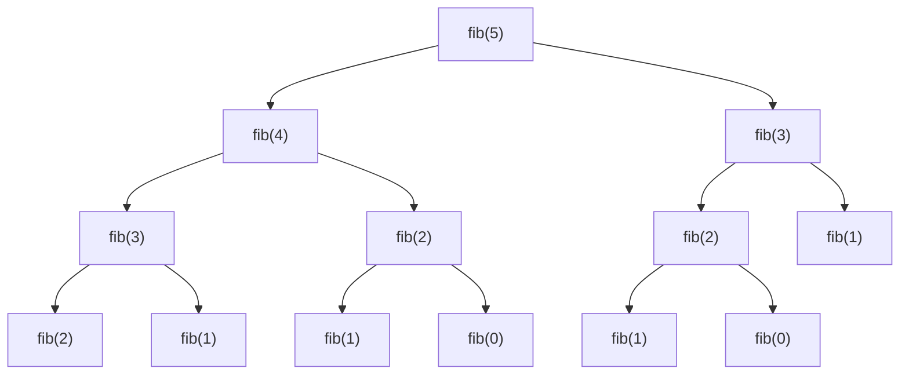
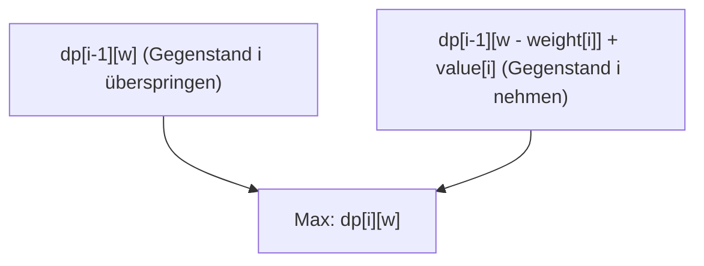
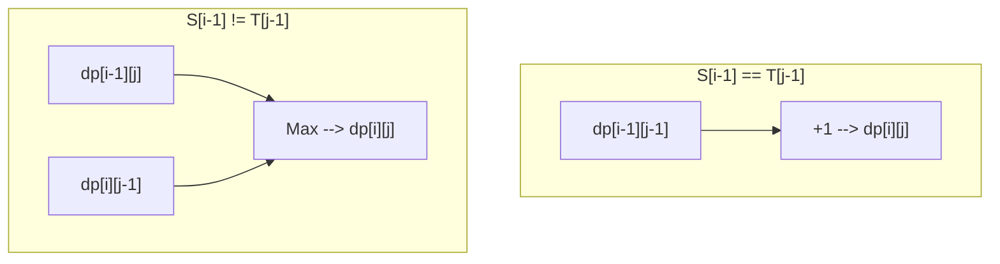

Von der Wettbewerbsprogrammierung bis zum praktischen Algorithmus-Design taucht sie in vielen Situationen auf und wird für viele Programmierer zur Hürde: **die Dynamische Programmierung (Dynamic Programming, kurz DP)**. "Ich kann keine Rekursionsgleichung aufstellen", "Die Indizes sind fehlerhaft", "Ich kann nicht einmal beurteilen, ob es sich um ein Problem handelt, das mit DP gelöst werden kann"... Viele von Ihnen haben wahrscheinlich mit solchen Problemen zu kämpfen.

In diesem Artikel werden wir alles ausführlich behandeln: vom Wesen der dynamischen Programmierung über konkrete Ansätze (Top-Down und Bottom-Up) bis hin zu praktischen Erklärungen anhand von drei repräsentativen Problemen (Fibonacci-Folge, 0/1-Rucksackproblem und längste gemeinsame Teilfolge). Wir zeigen Implementierungsbeispiele sowohl in C++ als auch in Python und bieten einen Weg zur "vollständigen Beherrschung" mit Hilfe von mathematischen Formeln und Illustrationen. Es ist ein sehr langer Artikel, aber wenn Sie ihn bis zum Ende gelesen haben, wird Ihre Fähigkeit, Algorithmen zu verstehen, mit Sicherheit einen großen Sprung gemacht haben.

---

## 1. Was ist Dynamische Programmierung (DP)?

Die Dynamische Programmierung (Dynamic Programming) ist eine Entwurfstechnik für Algorithmen, bei der komplexe Probleme in kleinere "Teilprobleme" zerlegt werden und die Lösungen dieser Teilprobleme gespeichert und wiederverwendet werden, um den Rechenaufwand drastisch zu reduzieren.

Diese in den 1950er Jahren von Richard Bellman erfundene Methode zeigt bei Optimierungsproblemen eine überwältigende Stärke. Das Wort "dynamisch" (Dynamic) hat keine besondere Bedeutung; es gibt die Anekdote, dass er damals ein "gut klingendes Wort" wählte, um Forschungsgelder zu erhalten. Heute hat es jedoch seinen festen Platz als eines der wichtigsten Konzepte in der Informatik eingenommen.

Damit die Dynamische Programmierung angewendet werden kann, muss das zu lösende Problem die folgenden **zwei wichtigen Eigenschaften** erfüllen:

### 1-1. Überlappende Teilprobleme (Overlapping Subproblems)

Diese Eigenschaft bedeutet, dass im Prozess der Lösung eines großen Problems **dieselben Teilprobleme immer wieder auftreten**.

Zum Beispiel wird bei der später erläuterten Berechnung der Fibonacci-Folge die Berechnung zur "Ermittlung des 3. Terms" sowohl bei der Ermittlung des 5. als auch des 4. Terms benötigt. Wenn sich Teilprobleme nicht überlappen (z. B. bei Divide-and-Conquer-Verfahren wie Merge Sort), gibt es keinen Vorteil, Lösungen zu speichern, weshalb DP dort nicht anwendbar ist. Gerade weil sie sich überlappen, wird durch das Speichern einmal berechneter Ergebnisse im Speicher (Memoisierung oder Tabellierung) und deren Wiederverwendung eine drastische Geschwindigkeitssteigerung möglich.

### 1-2. Optimale Teilstruktur (Optimal Substructure)

**"Die optimale Lösung des Gesamtproblems setzt sich aus den optimalen Lösungen seiner Teilprobleme zusammen."** Dies ist die Eigenschaft.

Das Problem des kürzesten Pfades ist ein anschauliches Beispiel. Wenn der kürzeste Weg von Stadt A nach Stadt C über Stadt B führt, muss der "Weg von Stadt A nach Stadt B" auch der kürzeste Weg von A nach B sein. Wäre der Weg von A nach B nämlich nicht optimal (kürzest), könnte man durch dessen Optimierung auch den Gesamtweg von A nach C weiter verkürzen. Diese Eigenschaft, dass man aus optimalen Teillösungen die optimale Gesamtlösung ableiten kann, bildet die Grundlage für die Zustandsübergänge in der dynamischen Programmierung.

---

## 2. Zwei Ansätze: Top-Down und Bottom-Up

Bei der Implementierung der dynamischen Programmierung gibt es grob zwei Ansätze: "Top-Down" (Memoisierung + Rekursion) und "Bottom-Up" (Tabellierung). Die jeweiligen Eigenschaften tiefgreifend zu verstehen und je nach Situation anwenden zu können, ist der erste Schritt zur Meisterschaft.

### Top-Down-Ansatz (Memoisierung / Memoization)

Dies ist ein Ansatz, der bei einem großen Problem ansetzt und rekursiv notwendige Teilprobleme aufruft, um diese zu lösen. Dabei werden die Antworten bereits berechneter Teilprobleme in einem Array oder einer Hashmap "notiert (gespeichert)", sodass beim nächsten Mal das Ergebnis aus dem Speicher zurückgegeben wird, ohne die Berechnung erneut durchzuführen.

- **Vorteile:** 
  - Einfach zu implementieren, da es dem natürlichen Denkprozess (Rekursionsgleichung) folgt.
  - Da nur die notwendigen Teilprobleme berechnet werden, ist es vorteilhaft, wenn nur auf einen Teil des gesamten Zustandsraums zugegriffen wird.
- **Nachteile:** 
  - Es gibt Overhead durch Funktionsaufrufe aufgrund der Rekursion.
  - Bei großer Rekursionstiefe besteht das Risiko eines Stack Overflows (besonders bei Sprachen wie Python ist Vorsicht geboten).

### Bottom-Up-Ansatz (Tabellierung / Tabulation)

Dies ist ein Ansatz, der beim kleinsten Teilproblem (Basisfall) beginnt und die Lösungen für sukzessiv größere Probleme mittels Schleifenverarbeitung nacheinander in eine Tabelle (Array) einträgt. Am Ende ist die gesuchte Lösung für das Gesamtproblem an einer bestimmten Stelle der Tabelle gespeichert.

- **Vorteile:** 
  - Es gibt keinen Rekursions-Overhead, weshalb die Ausführungsgeschwindigkeit hoch ist.
  - Der Speicherzugriff ist tendenziell sequentiell, was zu einer guten Cache-Effizienz (Lokalität) führt.
  - Die später erläuterte "Optimierung der Speicherkomplexität (Wiederverwendung von Arrays)" ist einfach durchzuführen.
- **Nachteile:** 
  - Da alle Zustände berechnet werden, werden im Ergebnis manchmal auch unnötige Zustände berechnet.
  - Man muss die Abhängigkeiten der Rekursionsgleichung (topologische Sortierung) genau verstehen und die Schleifen in der richtigen Reihenfolge ausführen.

---

## 3. Praxis Teil 1: Fibonacci-Folge

Zunächst betrachten wir als grundlegendstes und verständlichstes Beispiel die Fibonacci-Folge.
Die Fibonacci-Folge ist wie folgt definiert:

$$
F(0) = 0, \quad F(1) = 1 \\
F(n) = F(n-1) + F(n-2) \quad (n \ge 2)
$$

### 3-1. Einfache Rekursion (Explosion der Berechnungskomplexität)

Was passiert, wenn wir eine rekursive Funktion exakt nach dieser Definition schreiben?

```python
def fib_naive(n):
    if n <= 1:
        return n
    return fib_naive(n-1) + fib_naive(n-2)
```

Diese Implementierung ist intuitiv, führt jedoch zu einer exponentiellen Explosion der Berechnungskomplexität von $O(2^n)$. Das liegt daran, dass die Berechnungen für dieselben Argumente immer wieder wiederholt werden. Unten ist der Rekursionsbaum zur Berechnung von $F(5)$ dargestellt.



Wenn wir uns das Diagramm ansehen, können wir erkennen, dass `"fib(3)"` und `"fib(2)"` mehrmals ausgewertet werden. Genau das ist mit "überlappenden Teilproblemen" gemeint.

### 3-2. Top-Down-Ansatz (Memoisierung)

Wir verwenden ein Array oder ein Dictionary, um einmal berechnete Ergebnisse zu speichern. Dadurch verringert sich die Berechnungskomplexität auf $O(n)$.

**Python-Implementierung:**
```python
def fib_memo(n, memo=None):
    if memo is None:
        memo = {}
    if n in memo:
        return memo[n]
    if n <= 1:
        return n
    # Berechnen und in memo speichern
    memo[n] = fib_memo(n-1, memo) + fib_memo(n-2, memo)
    return memo[n]
```

**C++-Implementierung:**
```cpp
#include <iostream>
#include <vector>

std::vector<long long> memo;

long long fib_memo(int n) {
    if (n <= 1) return n;
    // Wenn bereits berechnet, aus Memo zurückgeben
    if (memo[n] != -1) return memo[n];
    
    // Berechnen und im Memo speichern
    return memo[n] = fib_memo(n - 1) + fib_memo(n - 2);
}

int main() {
    int n = 50;
    memo.assign(n + 1, -1);
    std::cout << fib_memo(n) << std::endl;
    return 0;
}
```

### 3-3. Bottom-Up-Ansatz (Tabellierung)

Bei diesem Ansatz füllen wir ein Array von den kleinsten Werten aufwärts. Es besteht keine Gefahr eines Stack Overflows, und es läuft extrem schnell.

**Python-Implementierung:**
```python
def fib_dp(n):
    if n <= 1:
        return n
    dp = [0] * (n + 1)
    dp[1] = 1
    for i in range(2, n + 1):
        dp[i] = dp[i-1] + dp[i-2]
    return dp[n]
```

**C++-Implementierung:**
```cpp
#include <iostream>
#include <vector>

long long fib_dp(int n) {
    if (n <= 1) return n;
    std::vector<long long> dp(n + 1, 0);
    dp[1] = 1;
    for (int i = 2; i <= n; ++i) {
        dp[i] = dp[i - 1] + dp[i - 2];
    }
    return dp[n];
}
```

### 3-4. Optimierung der Speicherkomplexität

Wenn wir den Bottom-Up-Ansatz genau betrachten, stellen wir fest, dass zur Berechnung von $dp[i]$ nur die letzten beiden Werte $dp[i-1]$ und $dp[i-2]$ benötigt werden, während frühere Werte nicht mehr gebraucht werden. Daher müssen wir nicht das gesamte Array im Speicher halten, sondern können die Berechnung mit nur zwei Variablen fortsetzen. Auf diese Weise können wir die Speicherkomplexität von $O(n)$ auf $O(1)$ reduzieren.

**Python-Implementierung:**
```python
def fib_optimized(n):
    if n <= 1:
        return n
    prev2, prev1 = 0, 1
    for i in range(2, n + 1):
        current = prev1 + prev2
        prev2 = prev1
        prev1 = current
    return current
```

---

## 4. Praxis Teil 2: 0/1-Rucksackproblem (0/1 Knapsack Problem)

Als Nächstes kommt endlich ein echtes Optimierungsproblem. Das 0/1-Rucksackproblem ist als das klassische Einstiegsproblem der dynamischen Programmierung bekannt.

### 4-1. Problemstellung

Wir haben einen Rucksack mit der Kapazität $W$. Außerdem gibt es $n$ Gegenstände, und für jeden Gegenstand $i$ ($1 \le i \le n$) sind das Gewicht $weight[i]$ und der Wert $value[i]$ festgelegt.
Wenn wir die Gegenstände so auswählen, dass die Kapazität des Rucksacks nicht überschritten wird, wie groß ist dann der maximale Gesamtwert, den wir erreichen können?
(※ "0/1" bedeutet, dass es für jeden Gegenstand nur zwei Möglichkeiten gibt: ihn "nicht auswählen (0)" oder ihn "auswählen (1)". Gegenstände können nicht geteilt werden.)

### 4-2. Zustandsdefinition und Zustandsübergangsgleichung

Der wichtigste Schritt zur Lösung von DP-Problemen ist die korrekte Definition des "Zustands" (State).
Bei diesem Problem ändern sich zwei Parameter: "Bis zu welchem Gegenstand wir betrachtet haben" und "Die verbleibende Kapazität des Rucksacks". Daher definieren wir den Zustand wie folgt:

**Zustandsdefinition:**
$dp[i][w]$ := Der maximale Gesamtwert, wenn wir nur Gegenstände vom ersten bis zum $i$-ten auswählen, sodass ihr Gesamtgewicht kleiner oder gleich $w$ ist.

Als Nächstes überlegen wir, wie sich dieser Zustand verändert (Übergang). Wenn wir den $i$-ten Gegenstand betrachten, gibt es zwei Möglichkeiten:
1. **Wenn wir den $i$-ten Gegenstand nicht auswählen:** 
   Der maximale Wert entspricht dem maximalen Wert für die ersten $i-1$ Gegenstände bei Kapazität $w$.
   Das heißt, $dp[i-1][w]$
2. **Wenn wir den $i$-ten Gegenstand auswählen:** 
   Da das Gewicht dieses Gegenstands $weight[i]$ ist, benötigt der Rucksack mindestens eine freie Kapazität von $weight[i]$ (also $w \ge weight[i]$). Wenn wir ihn auswählen, erhöht sich der erzielte Wert um $value[i]$, aber die verfügbare Kapazität verringert sich um $weight[i]$. Daher ist es die Summe aus dem maximalen Wert, den wir für die ersten $i-1$ Gegenstände bei der verbleibenden Kapazität $w - weight[i]$ erhalten, und $value[i]$.
   Das heißt, $dp[i-1][w - weight[i]] + value[i]$

Aus diesen beiden Möglichkeiten wählen wir einfach diejenige, die den größeren Wert ($\max$) liefert. Die **Zustandsübergangsgleichung** sieht also wie folgt aus:

$$
dp[i][w] = 
\begin{cases} 
dp[i-1][w] & \text{if } w < weight[i] \\
\max(dp[i-1][w], dp[i-1][w - weight[i]] + value[i]) & \text{if } w \ge weight[i]
\end{cases}
$$

**Basisfall (Anfangsbedingungen):**
Wenn es 0 Gegenstände gibt ($i=0$) oder die Kapazität 0 ist ($w=0$), ist der maximale Wert 0.
$$ dp[0][w] = 0, \quad dp[i][0] = 0 $$

Das folgende Mermaid-Diagramm visualisiert das Konzept des Zustandsübergangs.



### 4-3. Bottom-Up-Implementierung (2D-Array)

Wir setzen diese Formel direkt in Code um.

**C++-Implementierung:**
```cpp
#include <iostream>
#include <vector>
#include <algorithm>

int knapsack(int W, const std::vector<int>& weight, const std::vector<int>& value) {
    int n = weight.size();
    // 2D-Array dp[n+1][W+1] mit 0 initialisieren
    std::vector<std::vector<int>> dp(n + 1, std::vector<int>(W + 1, 0));

    // Gegenstände einzeln hinzufügen und betrachten
    for (int i = 1; i <= n; ++i) {
        // Alle Kapazitätsmuster berechnen
        for (int w = 0; w <= W; ++w) {
            if (w < weight[i - 1]) {
                // Bei unzureichender Kapazität nicht auswählbar
                dp[i][w] = dp[i - 1][w];
            } else {
                // Größeren Wert zwischen Nicht-Auswählen und Auswählen übernehmen
                dp[i][w] = std::max(dp[i - 1][w], dp[i - 1][w - weight[i - 1]] + value[i - 1]);
            }
        }
    }
    
    return dp[n][W];
}

int main() {
    int W = 50;
    std::vector<int> weight = {10, 20, 30};
    std::vector<int> value = {60, 100, 120};
    std::cout << "Max Value: " << knapsack(W, weight, value) << std::endl;
    return 0;
}
```
*(※Hinweis: Da die Array-Indizes in C++ bei 0 beginnen, achten Sie bitte darauf, dass wir hier `weight[i-1]` verwenden.)*

### 4-4. Optimierung der Speicherkomplexität (1D-Array)

Wir stellen fest, dass bei der Aktualisierung des 2D-Arrays $dp[i][w]$ immer nur auf die vorherige Zeile $dp[i-1]$ zugegriffen wird. Das ist dasselbe Prinzip wie bei der Speicheroptimierung der Fibonacci-Folge.
Daher können wir das Array in ein eindimensionales Array $dp[w]$ komprimieren. Bei der Aktualisierung ist jedoch Vorsicht geboten: Wir müssen die Kapazität $w$ **von groß nach klein (von hinten nach vorne)** durchlaufen. Wenn wir von vorne aktualisieren, würden wir auf den soeben im selben Schritt aktualisierten "$i$-ten Zustand" anstelle des "$i-1$-ten Zustands" zugreifen, was dazu führen würde, dass wir denselben Gegenstand mehrmals auswählen (dies wäre die Lösung für das "Rucksackproblem ohne Mengenbegrenzung").

**Python-Implementierung (Eindimensional):**
```python
def knapsack_1d(W, weight, value):
    n = len(weight)
    dp = [0] * (W + 1)
    
    for i in range(n):
        # Von W aus rückwärts durchlaufen
        for w in range(W, weight[i] - 1, -1):
            dp[w] = max(dp[w], dp[w - weight[i]] + value[i])
            
    return dp[W]

W = 50
weight = [10, 20, 30]
value = [60, 100, 120]
print("Max Value:", knapsack_1d(W, weight, value))
```
Dadurch wird die Speicherkomplexität drastisch von $O(nW)$ auf $O(W)$ verbessert. Dies ist eine unerlässliche Technik in der Praxis und bei der Wettbewerbsprogrammierung.

---

## 5. Praxis Teil 3: Längste gemeinsame Teilfolge (LCS: Longest Common Subsequence)

Als repräsentatives DP-Problem für Zeichenketten betrachten wir die LCS (Longest Common Subsequence). Die LCS ist ein Algorithmus, der in der Praxis weithin Anwendung findet, z.B. bei der Dateidifferenzerkennung (diff-Tools) und der Ähnlichkeitsprüfung von DNA-Sequenzen.

### 5-1. Problemstellung

Gegeben seien zwei Zeichenketten $S$ und $T$. Finden Sie die Länge der längsten gemeinsamen Teilfolge (eine Zeichenfolge, die aus der ursprünglichen Zeichenfolge durch Löschen von 0 oder mehr Zeichen gebildet wird, wobei die Reihenfolge erhalten bleibt).

Beispiel: Wenn $S = \text{"ABCBDAB"}$ und $T = \text{"BDCABA"}$, dann ist die LCS $\text{"BCBA"}$ oder $\text{"BDAB"}$ usw., und ihre Länge beträgt 4.

### 5-2. Zustandsdefinition und Zustandsübergangsgleichung

Angenommen, die Längen der Zeichenketten sind $m$ bzw. $n$. Auch in diesem Fall verwenden wir die Längen der Präfixe (Teilzeichenketten vom Anfang) der beiden Zeichenketten als Zustände.

**Zustandsdefinition:**
$dp[i][j]$ := Die Länge der längsten gemeinsamen Teilfolge (LCS) zwischen den ersten $i$ Zeichen der Zeichenfolge $S$ und den ersten $j$ Zeichen der Zeichenfolge $T$.

Wir betrachten den Übergang, indem wir uns auf die letzten Zeichen $S[i-1]$ und $T[j-1]$ konzentrieren.
1. **Wenn $S[i-1] == T[j-1]$:** 
   Da die letzten Zeichen übereinstimmen, ist dieses Zeichen definitiv in der LCS enthalten. Daher ist es gleich der LCS des Zustands, bei dem beide Zeichenketten um ein Zeichen verkürzt sind, plus 1.
   $dp[i][j] = dp[i-1][j-1] + 1$
2. **Wenn $S[i-1] \neq T[j-1]$:** 
   Da sich die letzten Zeichen unterscheiden, ist mindestens eines von ihnen nicht in der LCS enthalten. Wir wählen den größeren Wert zwischen dem Fall, dass wir $S$ um ein Zeichen reduzieren ($dp[i-1][j]$), und dem Fall, dass wir $T$ um ein Zeichen reduzieren ($dp[i][j-1]$).
   $dp[i][j] = \max(dp[i-1][j], dp[i][j-1])$

Zusammenfassend ergibt dies die folgende Zustandsübergangsgleichung:

$$
dp[i][j] = 
\begin{cases} 
0 & \text{if } i = 0 \text{ or } j = 0 \\
dp[i-1][j-1] + 1 & \text{if } i > 0, j > 0 \text{ and } S[i-1] = T[j-1] \\
\max(dp[i-1][j], dp[i][j-1]) & \text{if } i > 0, j > 0 \text{ and } S[i-1] \neq T[j-1]
\end{cases}
$$

Dieser Übergang lässt sich in Mermaid wie folgt darstellen:



### 5-3. Bottom-Up-Implementierung

Dies kann ebenfalls einfach mit einem 2D-Array implementiert werden.

**Python-Implementierung:**
```python
def longest_common_subsequence(text1: str, text2: str) -> int:
    m, n = len(text1), len(text2)
    # 2D-Array mit m+1 Zeilen und n+1 Spalten, gefüllt mit 0
    dp = [[0] * (n + 1) for _ in range(m + 1)]
    
    for i in range(1, m + 1):
        for j in range(1, n + 1):
            if text1[i-1] == text2[j-1]:
                dp[i][j] = dp[i-1][j-1] + 1
            else:
                dp[i][j] = max(dp[i-1][j], dp[i][j-1])
                
    return dp[m][n]

S = "ABCBDAB"
T = "BDCABA"
print("LCS Length:", longest_common_subsequence(S, T))
```

**C++-Implementierung:**
```cpp
#include <iostream>
#include <vector>
#include <string>
#include <algorithm>

int longest_common_subsequence(const std::string& text1, const std::string& text2) {
    int m = text1.size();
    int n = text2.size();
    std::vector<std::vector<int>> dp(m + 1, std::vector<int>(n + 1, 0));
    
    for (int i = 1; i <= m; ++i) {
        for (int j = 1; j <= n; ++j) {
            if (text1[i-1] == text2[j-1]) {
                dp[i][j] = dp[i-1][j-1] + 1;
            } else {
                dp[i][j] = std::max(dp[i-1][j], dp[i][j-1]);
            }
        }
    }
    
    return dp[m][n];
}

int main() {
    std::string S = "ABCBDAB";
    std::string T = "BDCABA";
    std::cout << "LCS Length: " << longest_common_subsequence(S, T) << std::endl;
    return 0;
}
```

Auch beim LCS-Problem werden für die Aktualisierung nur die vorherige Zeile (`dp[i-1]`) und die aktuelle Zeile (`dp[i]`) verwendet, sodass die Berechnung mit einem Array aus zwei Zeilen ($2n$ Elemente) möglich ist. Dies wird als "Rolling Array" (rollierendes Array) bezeichnet. Es ist eine äußerst nützliche Methode, um die Speicherkomplexität drastisch zu verringern.

---

## 6. Denkprozess zur Beherrschung der Dynamischen Programmierung

Bisher haben wir uns verschiedene Probleme angesehen, aber wie sollten Sie vorgehen, wenn Sie mit einem unbekannten DP-Problem konfrontiert werden? Behalten Sie immer die folgenden Schritte im Hinterkopf:

1. **Kann dieses Problem mit DP gelöst werden? (Überprüfung der Bedingungen)**
   Tritt derselbe Zustand mehrfach auf, wenn wir rekursiv denken (Überlappende Teilprobleme)? Können wir durch Kombination der besten Entscheidungen zum Gesamtoplimum gelangen (Optimale Teilstruktur)?
2. **Den Zustand (State) definieren**
   Identifizieren Sie Variablen, die darstellen: "Wo bin ich jetzt?", "Was ist übrig?", "Was sind die bisherigen Einschränkungen?". Die klare Formulierung der Bedeutung von Indizes ist der beste Schutz gegen Bugs.
3. **Die Zustandsübergangsgleichung (Transition) überlegen**
   Wie bewege ich mich von einem Zustand zum nächsten? Was sind die Optionen? Nehme ich das Maximum (oder Minimum) davon, oder summiere ich sie? Dies ist das Herzstück des Algorithmus.
4. **Die Anfangsbedingungen (Base Case) festlegen**
   Legen Sie die Initialwerte des Arrays oder den Startpunkt der Berechnung fest. Behandeln Sie Edge Cases korrekt, bei denen eine triviale Antwort existiert, wie z.B. 0 Gegenstände oder ein String der Länge 0.
5. **Die Reihenfolge der Berechnung (Topological Order) überprüfen**
   Bei der Bottom-Up-Implementierung müssen alle Quellzustände des Übergangs bereits berechnet sein, bevor der Zielzustand berechnet werden kann. Achten Sie genau auf die Richtung der Schleifen.

## 7. Zusammenfassung

In diesem Artikel haben wir detailliert erklärt, von den grundlegenden Theorien der dynamischen Programmierung über konkrete Implementierungsansätze bis hin zu repräsentativen Optimierungsproblemen.
- Dynamische Programmierung ist eine Methode, die rekursive Beziehungen nutzt, um Lösungen von Teilproblemen wiederzuverwenden.
- Der **Top-Down-Ansatz (Memoisierung)** ist intuitiv zu implementieren, während der **Bottom-Up-Ansatz (Tabellierung)** durch einen geringeren konstanten Faktor besticht und sich leichter speicheroptimieren lässt.
- Wenn die mathematische Formel (Zustandsübergangsgleichung) korrekt aufgestellt ist, wird die Implementierung sehr einfach.
- Techniken zur Reduzierung der Speicherkomplexität (wie die Eindimensionalisierung von Arrays oder Rolling Arrays) sind unerlässlich, wenn auf praktischer Ebene hohe Leistung gefordert ist.

Die dynamische Programmierung kann anfangs schwer verständlich erscheinen. Durch wiederholtes Training, "Zustandsdefinitionen" und "Übergänge" in verschiedenen Problemen zu finden, werden Sie jedoch allmählich Muster erkennen. Es gibt noch fortgeschrittenere Anwendungen wie Tree-DP, Digit-DP, Bitmask-DP oder Interval-DP, aber sie alle bauen auf dem Fundament der hier gelernten "überlappenden Teilprobleme" und der "Optimierung" auf.

Beeilen Sie sich nicht, sondern vertiefen Sie Ihr Verständnis, indem Sie mit Papier und Stift DP-Tabellen tatsächlich aufzeichnen. Wenn Sie in der Lage sind, die wahre Kraft von Algorithmen zu entfesseln, wird sich die Welt des Programmierens für Sie noch weiter öffnen.
