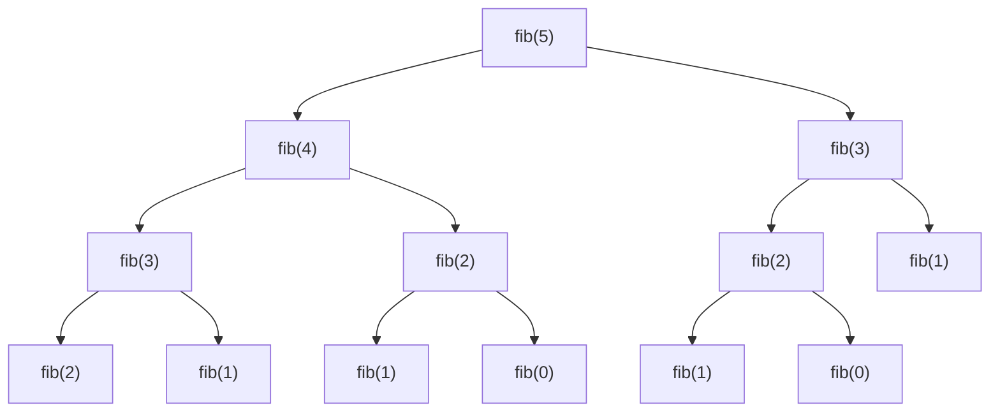
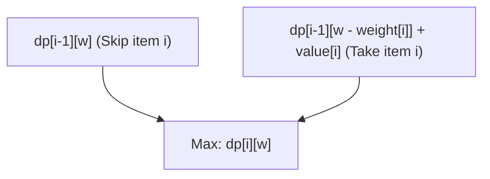
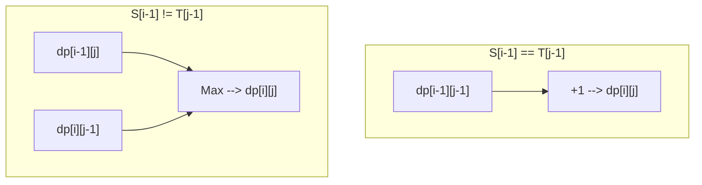

From competitive programming to practical algorithm design in business, **Dynamic Programming (DP)** appears in many scenarios and often becomes a wall for many programmers. "I can't formulate the recurrence relation", "Indices get buggy", "I can't even judge if the problem can be solved by DP"... many people might have such concerns.

In this article, we will thoroughly cover everything from the essence of dynamic programming to specific approaches (top-down and bottom-up), and provide practical explanations through three representative problems (Fibonacci sequence, 0/1 Knapsack problem, and Longest Common Subsequence). We will provide implementation examples in both C++ and Python, offering a path to "completely master" it using formulas and diagrams. This will be a very lengthy article, but by the time you finish reading it to the end, your algorithm skills will surely have taken a leap forward.

---

## 1. What is Dynamic Programming (DP)?

Dynamic Programming is an algorithm design technique that dramatically reduces computational complexity by dividing a complex problem into smaller "subproblems", and recording and reusing the solutions of those subproblems.

Invented by Richard Bellman in the 1950s, this method demonstrates overwhelming power in optimization problems. There is an anecdote that the word "Dynamic" does not have any special meaning, and at the time he just chose a "good-sounding word" to secure research funding. However, today it has established a firm position as one of the most important concepts in computer science.

For dynamic programming to be established, the target problem needs to satisfy the following **two important properties**.

### 1-1. Overlapping Subproblems

This is the property where **the same subproblem repeatedly appears** in the process of solving a larger problem.

For example, in the calculation of the Fibonacci sequence described later, the computation "finding the 3rd term" is required both when finding the 5th term and when finding the 4th term. If subproblems do not overlap (e.g., in divide-and-conquer algorithms like merge sort), there is no benefit in recording the solutions, so DP is not applicable. Precisely because they overlap, dramatic speedups become possible by saving the results of calculations once performed in memory (memoization or tabulation) and reusing them.

### 1-2. Optimal Substructure

This is the property where **"the optimal solution to the entire problem is composed of the optimal solutions to its subproblems."**

The shortest path problem is a clear example. If the shortest path from city A to city C goes through city B, the "path from city A to city B" must also be the shortest path from A to B. If the path from A to B were not optimal (shortest), then by optimizing it, the entire path from A to C could be made even shorter. The property of being able to derive the optimal solution for the whole by combining partial optimal solutions forms the foundation for state transitions using dynamic programming.

---

## 2. Two Approaches: Top-Down and Bottom-Up

There are mainly two approaches to implementing dynamic programming: "Top-Down (Memoized Recursion)" and "Bottom-Up (Tabulation)". Deeply understanding their respective characteristics and being able to use them selectively depending on the situation is the first step to mastering it.

### Top-Down Approach (Memoization)

This is an approach that starts from a large problem and recursively calls required subproblems to solve them. At this time, the answer to a subproblem that has been calculated once is "memoized (saved)" in an array or hash map, and from the next time onwards, the result is returned from the memo without performing the calculation.

- **Pros:** 
  - Easy to implement naturally following the thought process (recurrence relation).
  - Since only required subproblems are computed, it is advantageous when only a portion of the entire state space is accessed.
- **Cons:** 
  - There is a function call overhead due to recursive calls.
  - If the recursion depth gets large, there is a risk of stack overflow (especially in languages like Python, care must be taken).

### Bottom-Up Approach (Tabulation)

This is an approach that starts from the smallest subproblem (base case) and fills the solutions of increasingly larger problems into a table (array) in order using loop processing. Ultimately, the solution to the entire problem you want to find is stored at a specific location in the table.

- **Pros:** 
  - Fast execution speed with no recursion overhead.
  - Memory access tends to be contiguous, resulting in good cache efficiency (locality).
  - Easy to perform "space complexity optimization (array reuse)" described later.
- **Cons:** 
  - Because all states are computed, it may end up computing unnecessary states.
  - It is necessary to accurately grasp the dependency relationships (topological order) of the recurrence relation and run loops in the correct order.

---

## 3. Practical Part 1: Fibonacci Sequence

First, as the most basic and easy-to-understand example, let's take up the Fibonacci sequence.
The Fibonacci sequence is defined as follows:

$$
F(0) = 0, \quad F(1) = 1 \\
F(n) = F(n-1) + F(n-2) \quad (n \ge 2)
$$

### 3-1. Simple Recursion (Explosion of Computational Complexity)

What happens if you write a recursive function exactly following this definition?

```python
def fib_naive(n):
    if n <= 1:
        return n
    return fib_naive(n-1) + fib_naive(n-2)
```

This implementation is intuitive, but the computational complexity explodes exponentially at $O(2^n)$. This is because calculations for the same arguments are repeated over and over. Below is the recursion tree when finding $F(5)$.



Looking at the diagram, you can see that `"fib(3)"` and `"fib(2)"` are evaluated multiple times. This is the "overlapping of subproblems".

### 3-2. Top-Down Approach (Memoized Recursion)

By using an array or dictionary, we save the calculated results. This reduces the computational complexity to $O(n)$.

**Python Implementation:**
```python
def fib_memo(n, memo=None):
    if memo is None:
        memo = {}
    if n in memo:
        return memo[n]
    if n <= 1:
        return n
    # Calculate and save to memo
    memo[n] = fib_memo(n-1, memo) + fib_memo(n-2, memo)
    return memo[n]
```

**C++ Implementation:**
```cpp
#include <iostream>
#include <vector>

std::vector<long long> memo;

long long fib_memo(int n) {
    if (n <= 1) return n;
    // Return from memo if already calculated
    if (memo[n] != -1) return memo[n];
    
    // Calculate and save to memo
    return memo[n] = fib_memo(n - 1) + fib_memo(n - 2);
}

int main() {
    int n = 50;
    memo.assign(n + 1, -1);
    std::cout << fib_memo(n) << std::endl;
    return 0;
}
```

### 3-3. Bottom-Up Approach (Tabulation)

This is an approach where you sequentially fill the array starting from the smallest. There is no worry about stack overflow, and it operates extremely fast.

**Python Implementation:**
```python
def fib_dp(n):
    if n <= 1:
        return n
    dp = [0] * (n + 1)
    dp[1] = 1
    for i in range(2, n + 1):
        dp[i] = dp[i-1] + dp[i-2]
    return dp[n]
```

**C++ Implementation:**
```cpp
#include <iostream>
#include <vector>

long long fib_dp(int n) {
    if (n <= 1) return n;
    std::vector<long long> dp(n + 1, 0);
    dp[1] = 1;
    for (int i = 2; i <= n; ++i) {
        dp[i] = dp[i - 1] + dp[i - 2];
    }
    return dp[n];
}
```

### 3-4. Space Complexity Optimization

Observing the bottom-up approach closely, to compute $dp[i]$, you only need the two most recent values, $dp[i-1]$ and $dp[i-2]$, and older values are unnecessary. Therefore, there is no need to retain the entire array, and the calculation can proceed using only two variables. This allows the space complexity to be reduced from $O(n)$ to $O(1)$.

**Python Implementation:**
```python
def fib_optimized(n):
    if n <= 1:
        return n
    prev2, prev1 = 0, 1
    for i in range(2, n + 1):
        current = prev1 + prev2
        prev2 = prev1
        prev1 = current
    return current
```

---

## 4. Practical Part 2: 0/1 Knapsack Problem

Next is finally a full-fledged optimization problem. The 0/1 Knapsack Problem is known as the gateway to dynamic programming.

### 4-1. Problem Setup

You have a knapsack with capacity $W$. There are also $n$ items, and each item $i$ ($1 \le i \le n$) has a predetermined weight $weight[i]$ and value $value[i]$.
When selecting items so as not to exceed the knapsack's capacity, what is the maximum total value you can obtain?
(* "0/1" means that for each item, there are only 2 choices: "do not choose (0)" or "choose (1)". You cannot divide items.)

### 4-2. State Definition and State Transition Equation

The most important step for solving DP is to appropriately define the "State".
In this problem, two parameters will change: "which item has been considered up to" and "the remaining capacity of the knapsack". Therefore, we define the state as follows.

**State Definition:**
$dp[i][w]$ := The maximum total value when selecting items so that the total weight is $w$ or less, using only the first $i$ items.

Next, we think about how this state changes (transitions). When considering the $i$-th item, there are 2 options.
1. **If the $i$-th item is not chosen:** 
   The maximum value is the same as the maximum value satisfying capacity $w$ with items up to the $(i-1)$-th item.
   That is, $dp[i-1][w]$
2. **If the $i$-th item is chosen:** 
   Since the weight of this item is $weight[i]$, the knapsack must have at least $weight[i]$ of available capacity ($w \ge weight[i]$). If chosen, the obtained value increases by $value[i]$, but the usable capacity decreases by $weight[i]$. Therefore, it will be the maximum value obtainable with items up to $(i-1)$ for the remaining capacity $w - weight[i]$, plus $value[i]$.
   That is, $dp[i-1][w - weight[i]] + value[i]$

Between these two options, we just need to pick the one with the larger value ($\max$), so the **state transition equation** becomes as follows:

$$
dp[i][w] = 
\begin{cases} 
dp[i-1][w] & \text{if } w < weight[i] \\
\max(dp[i-1][w], dp[i-1][w - weight[i]] + value[i]) & \text{if } w \ge weight[i]
\end{cases}
$$

**Base Case (Initial Conditions):**
When there are 0 items ($i=0$), or when the capacity is 0 ($w=0$), the maximum value is 0.
$$ dp[0][w] = 0, \quad dp[i][0] = 0 $$

The following Mermaid diagram visualizes the concept of the state transition.



### 4-3. Bottom-Up Implementation (2D Array)

We translate this formula straight into code.

**C++ Implementation:**
```cpp
#include <iostream>
#include <vector>
#include <algorithm>

int knapsack(int W, const std::vector<int>& weight, const std::vector<int>& value) {
    int n = weight.size();
    // Initialize a 2D array dp[n+1][W+1] with 0
    std::vector<std::vector<int>> dp(n + 1, std::vector<int>(W + 1, 0));

    // Consider adding items one by one
    for (int i = 1; i <= n; ++i) {
        // Calculate for all capacity patterns
        for (int w = 0; w <= W; ++w) {
            if (w < weight[i - 1]) {
                // When you cannot choose it due to lack of capacity
                dp[i][w] = dp[i - 1][w];
            } else {
                // Adopt the larger one between not choosing and choosing
                dp[i][w] = std::max(dp[i - 1][w], dp[i - 1][w - weight[i - 1]] + value[i - 1]);
            }
        }
    }
    
    return dp[n][W];
}

int main() {
    int W = 50;
    std::vector<int> weight = {10, 20, 30};
    std::vector<int> value = {60, 100, 120};
    std::cout << "Max Value: " << knapsack(W, weight, value) << std::endl;
    return 0;
}
```
*(※Note that in C++, array indices start at 0, which is why it uses `weight[i-1]`.)*

### 4-4. Space Complexity Optimization (1D Array Conversion)

When updating the 2D array $dp[i][w]$, you'll notice that you are always only referencing the previous row $dp[i-1]$. This is the same principle as the space optimization of the Fibonacci sequence.
Therefore, the array can be compressed into 1 dimension $dp[w]$. However, care is needed during the update. You need to loop the capacity $w$ **from the largest to the smallest (from back to front)**. If you update from the front, you'll end up referencing the "$i$-th state" that has just been updated within the same step, rather than the "$(i-1)$-th state", resulting in choosing the same item multiple times (this would end up as a solution for the "Unbounded Knapsack Problem").

**Python Implementation (1D Conversion):**
```python
def knapsack_1d(W, weight, value):
    n = len(weight)
    dp = [0] * (W + 1)
    
    for i in range(n):
        # Loop backwards from W
        for w in range(W, weight[i] - 1, -1):
            dp[w] = max(dp[w], dp[w - weight[i]] + value[i])
            
    return dp[W]

W = 50
weight = [10, 20, 30]
value = [60, 100, 120]
print("Max Value:", knapsack_1d(W, weight, value))
```
By doing this, the space complexity is drastically improved from $O(nW)$ to $O(W)$. This is an essential technique in practical business applications or competitive programming.

---

## 5. Practical Part 3: Longest Common Subsequence (LCS)

As a representative DP problem handling strings, we will take up LCS. LCS is an algorithm widely applied in the real world, such as in file difference detection (diff tools) and DNA sequence similarity judgments.

### 5-1. Problem Setup

You are given two strings $S$ and $T$. Among the common subsequences (strings formed by deleting 0 or more characters from the original string while keeping the order), find the length of the longest one.

Example: When $S = \text{"ABCBDAB"}$ and $T = \text{"BDCABA"}$, the LCS is $\text{"BCBA"}$, $\text{"BDAB"}$, etc., and its length is 4.

### 5-2. State Definition and State Transition Equation

Let the lengths of the strings be $m$ and $n$ respectively. In this case as well, we set the lengths of the prefixes (substrings starting from the beginning) for the two strings as the state.

**State Definition:**
$dp[i][j]$ := The length of the longest common subsequence (LCS) between the first $i$ characters of string $S$ and the first $j$ characters of string $T$.

Focusing on the last characters of the strings $S[i-1]$ and $T[j-1]$, we consider the transitions.
1. **If $S[i-1] == T[j-1]$:** 
   Since the last characters match, this character is certainly included in the LCS. Therefore, it becomes the LCS of the state where both strings are shortened by 1 character, plus 1.
   $dp[i][j] = dp[i-1][j-1] + 1$
2. **If $S[i-1] \neq T[j-1]$:** 
   Since the last characters differ, at least one of them is not included in the LCS. We adopt the longer one between when $S$ is reduced by 1 character ($dp[i-1][j]$) and when $T$ is reduced by 1 character ($dp[i][j-1]$).
   $dp[i][j] = \max(dp[i-1][j], dp[i][j-1])$

To summarize, we get the following state transition equation.

$$
dp[i][j] = 
\begin{cases} 
0 & \text{if } i = 0 \text{ or } j = 0 \\
dp[i-1][j-1] + 1 & \text{if } i > 0, j > 0 \text{ and } S[i-1] = T[j-1] \\
\max(dp[i-1][j], dp[i][j-1]) & \text{if } i > 0, j > 0 \text{ and } S[i-1] \neq T[j-1]
\end{cases}
$$

Expressing this transition in Mermaid looks like this.



### 5-3. Bottom-Up Implementation

This can also be implemented simply using a 2D array.

**Python Implementation:**
```python
def longest_common_subsequence(text1: str, text2: str) -> int:
    m, n = len(text1), len(text2)
    # Zero-filled 2D array of m+1 rows and n+1 columns
    dp = [[0] * (n + 1) for _ in range(m + 1)]
    
    for i in range(1, m + 1):
        for j in range(1, n + 1):
            if text1[i-1] == text2[j-1]:
                dp[i][j] = dp[i-1][j-1] + 1
            else:
                dp[i][j] = max(dp[i-1][j], dp[i][j-1])
                
    return dp[m][n]

S = "ABCBDAB"
T = "BDCABA"
print("LCS Length:", longest_common_subsequence(S, T))
```

**C++ Implementation:**
```cpp
#include <iostream>
#include <vector>
#include <string>
#include <algorithm>

int longest_common_subsequence(const std::string& text1, const std::string& text2) {
    int m = text1.size();
    int n = text2.size();
    std::vector<std::vector<int>> dp(m + 1, std::vector<int>(n + 1, 0));
    
    for (int i = 1; i <= m; ++i) {
        for (int j = 1; j <= n; ++j) {
            if (text1[i-1] == text2[j-1]) {
                dp[i][j] = dp[i-1][j-1] + 1;
            } else {
                dp[i][j] = std::max(dp[i-1][j], dp[i][j-1]);
            }
        }
    }
    
    return dp[m][n];
}

int main() {
    std::string S = "ABCBDAB";
    std::string T = "BDCABA";
    std::cout << "LCS Length: " << longest_common_subsequence(S, T) << std::endl;
    return 0;
}
```

Even in the LCS problem, since only the previous row (`dp[i-1]`) and the current row (`dp[i]`) are used for updating, calculations are possible if there are arrays for 2 rows (element count $2n$). This is called a "Rolling Array". It is extremely useful as a technique to drastically reduce space complexity.

---

## 6. Thought Process for Mastering Dynamic Programming

We have seen various problems so far, but when facing an unknown DP problem, how should we think about it? Please always keep the following steps in mind.

1. **Can this problem be solved with DP? (Condition Check)**
   When thinking recursively, do the same states appear over and over? (Overlapping Subproblems). Can the overall best be derived by combining the best choices? (Optimal Substructure).
2. **Define the State**
   Identify the variables that represent "where am I now", "what is left", and "what are the constraints so far". Clearly verbalizing the meaning of the indices is the greatest defense against bugs.
3. **Think of the State Transition Equation**
   How do you move from one state to the next? What are the choices? Among them, do you take the maximum (or minimum), or add them together? This is the heart of the algorithm.
4. **Set the Base Case (Initial Conditions)**
   Determine the initial values of the array and the starting point of calculations. Correctly handle edge cases where obvious answers exist, such as 0 items or a string of length 0.
5. **Check the Calculation Order (Topological Order)**
   When implementing bottom-up, all transition source states must be computed before calculating the destination state. Pay close attention to the direction of the loops.

## 7. Conclusion

In this article, we have explained in detail everything from the fundamental theory of dynamic programming to specific implementation approaches, and even representative optimization problems.
- Dynamic programming is a method that reuses the solutions to subproblems utilizing recursive relationships.
- **Top-Down (Memoization)** has an intuitive implementation, while **Bottom-Up (Tabulation)** features a lighter constant factor and easier memory optimization.
- If you can properly set up the mathematical formulas (state transition equations), the implementation becomes very simple.
- Space complexity reduction techniques (1D array conversion and rolling arrays) are indispensable when performance is demanded at a practical business level.

Dynamic programming might feel esoteric at first. However, by repeating the training of finding the "state definition" and "transitions" in various problems, patterns will gradually begin to emerge. There are more advanced applications like Tree DP, Digit DP, Bit DP, and Interval DP, but all of them are built on the foundation of "overlapping subproblems" and "optimization" that you learned this time.

Don't rush, deepen your understanding by actually writing out DP tables with paper and pen. When you become able to bring out the true power of this algorithm, the world of programming will expand even further.
