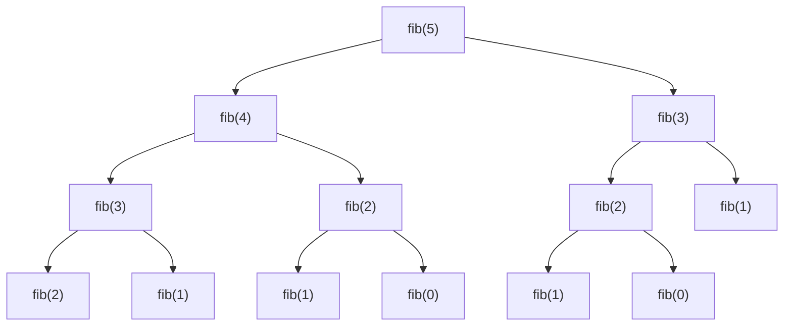
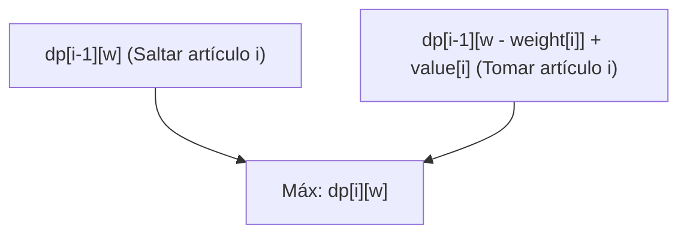
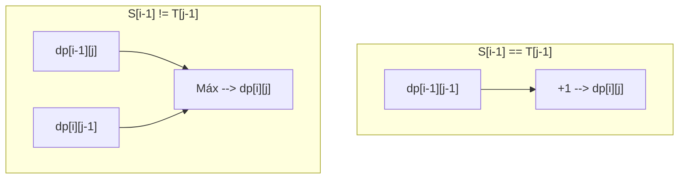

Desde la programación competitiva hasta el diseño de algoritmos en la práctica profesional, aparece en muchas situaciones y se convierte en un muro para muchos programadores: la **Programación Dinámica (Dynamic Programming, comúnmente DP)**. "No puedo formular la relación de recurrencia", "los índices tienen errores", "ni siquiera puedo determinar si el problema se puede resolver con DP"... ¿No hay muchos de ustedes que tienen este tipo de problemas?

En este artículo, cubriremos exhaustivamente desde la esencia de la programación dinámica hasta los enfoques específicos (top-down y bottom-up), junto con explicaciones prácticas a través de tres problemas representativos (la sucesión de Fibonacci, el problema de la mochila 0/1 y la subsecuencia común más larga). Mostraremos ejemplos de implementación en C++ y Python, y proporcionaremos el camino para "dominarla por completo" mezclando fórmulas matemáticas y diagramas. Será un artículo muy extenso, pero cuando termines de leerlo hasta el final, tu habilidad en algoritmos seguramente habrá dado un salto.

---

## 1. ¿Qué es la Programación Dinámica (DP)?

La Programación Dinámica (Dynamic Programming) es una técnica de diseño de algoritmos que reduce drásticamente la complejidad computacional dividiendo problemas complejos en "subproblemas" más pequeños, y registrando y reutilizando las soluciones de esos subproblemas.

Inventada por Richard Bellman en la década de 1950, esta técnica demuestra un poder abrumador en problemas de optimización. Aunque hay una anécdota que dice que la palabra "Dinámica (Dynamic)" no tiene un significado especial y fue elegida en ese momento como una "palabra atractiva" para obtener fondos de investigación, hoy en día ha establecido una posición firme como uno de los conceptos más importantes en la ciencia de la computación.

Para que la programación dinámica sea aplicable, el problema objetivo debe cumplir con las siguientes **dos propiedades importantes**.

### 1-1. Superposición de Subproblemas (Overlapping Subproblems)

Es la propiedad en la que, durante el proceso de resolver un problema grande, **el mismo subproblema aparece repetidamente**.

Por ejemplo, en el cálculo de la sucesión de Fibonacci descrito más adelante, la operación de "calcular el 3er término" será necesaria tanto al calcular el 5to término como al calcular el 4to término. Si los subproblemas no se superponen (ejemplo: algoritmos de divide y vencerás como Merge Sort), no hay beneficio en registrar las soluciones, por lo que no son objeto de aplicación de la DP. Es precisamente porque se superponen, que guardar los resultados calculados una vez en memoria (memoización o tabulación) y reutilizarlos hace posible una aceleración dramática.

### 1-2. Subestructura Óptima (Optimal Substructure)

**"La solución óptima del problema completo se compone de las soluciones óptimas de sus subproblemas"**, esta es la propiedad.

El problema del camino más corto es un ejemplo fácil de entender. Si la ruta más corta de la ciudad A a la ciudad C pasa por la ciudad B, la "ruta de la ciudad A a la ciudad B" también debe ser la ruta más corta de A a B. Si la ruta de A a B no fuera óptima (la más corta), optimizándola se podría acortar aún más toda la ruta de A a C. De esta forma, la propiedad de poder derivar la solución óptima global combinando soluciones óptimas parciales es la base de las transiciones de estado en la programación dinámica.

---

## 2. Dos enfoques: Top-down y Bottom-up

En la implementación de la programación dinámica, existen a grandes rasgos dos enfoques: "top-down (recursión con memoización)" y "bottom-up (tabulación)". Comprender profundamente las características de cada uno y poder utilizarlos según la situación es el primer paso para dominarla.

### Enfoque Top-down (Recursión con Memoización / Memoization)

Es un enfoque que parte del problema grande y resuelve los subproblemas necesarios llamándolos de forma recursiva. En este momento, la respuesta a un subproblema calculado previamente se "memoriza (guarda)" en un arreglo o mapa hash, para que a partir de la próxima vez devuelva el resultado desde la memoria sin realizar el cálculo.

- **Ventajas:** 
  - Es fácil de implementar siguiendo un proceso de pensamiento natural (relación de recurrencia).
  - Solo se calculan los subproblemas necesarios, lo cual es ventajoso cuando solo se accede a una parte del espacio de estados total.
- **Desventajas:** 
  - Existe una sobrecarga (overhead) por las llamadas a funciones debido a la recursividad.
  - Cuando la profundidad de la recursión es grande, existe el riesgo de desbordamiento de pila (stack overflow) (se requiere precaución especialmente en lenguajes como Python).

### Enfoque Bottom-up (Tabulación / Tabulation)

Es un enfoque que parte del subproblema más pequeño (caso base) y, mediante procesos de bucle, va rellenando secuencialmente las soluciones de los problemas más grandes en una tabla (arreglo). Finalmente, la solución al problema global que se quiere encontrar se almacena en una ubicación específica de la tabla.

- **Ventajas:** 
  - No hay sobrecarga por recursividad, por lo que la velocidad de ejecución es rápida.
  - El acceso a memoria tiende a ser continuo, lo que mejora la eficiencia de la caché (localidad).
  - Es fácil realizar la "optimización de la complejidad espacial (reutilización de arreglos)" que se describe más adelante.
- **Desventajas:** 
  - Dado que se calculan todos los estados, en ocasiones se terminan calculando estados innecesarios como resultado.
  - Es necesario comprender exactamente la relación de dependencia de la relación de recurrencia (orden topológico) y ejecutar los bucles en el orden correcto.

---

## 3. Sección práctica 1: Sucesión de Fibonacci

Primero, tomaremos la sucesión de Fibonacci como el ejemplo más básico y fácil de entender.
La sucesión de Fibonacci se define de la siguiente manera:

$$
F(0) = 0, \quad F(1) = 1 \\
F(n) = F(n-1) + F(n-2) \quad (n \ge 2)
$$

### 3-1. Recursión simple (Explosión de la complejidad computacional)

¿Qué sucedería si escribiéramos una función recursiva exactamente según esta definición?

```python
def fib_naive(n):
    if n <= 1:
        return n
    return fib_naive(n-1) + fib_naive(n-2)
```

Esta implementación es intuitiva, pero provoca una explosión exponencial con una complejidad de $O(2^n)$. Esto se debe a que los cálculos para el mismo argumento se repiten una y otra vez. A continuación se muestra el árbol de recursión al calcular $F(5)$.



Mirando el diagrama, podemos ver que `"fib(3)"` y `"fib(2)"` se evalúan múltiples veces. Esto es la "superposición de subproblemas".

### 3-2. Enfoque Top-down (Recursión con Memoización)

Usamos un arreglo o un diccionario para guardar los resultados calculados previamente. Con esto, la complejidad computacional se reduce a $O(n)$.

**Implementación en Python:**
```python
def fib_memo(n, memo=None):
    if memo is None:
        memo = {}
    if n in memo:
        return memo[n]
    if n <= 1:
        return n
    # Calcular y guardar en la memoria (memo)
    memo[n] = fib_memo(n-1, memo) + fib_memo(n-2, memo)
    return memo[n]
```

**Implementación en C++:**
```cpp
#include <iostream>
#include <vector>

std::vector<long long> memo;

long long fib_memo(int n) {
    if (n <= 1) return n;
    // Si ya está calculado, devolver de la memoria
    if (memo[n] != -1) return memo[n];
    
    // Calcular y guardar en la memoria
    return memo[n] = fib_memo(n - 1) + fib_memo(n - 2);
}

int main() {
    int n = 50;
    memo.assign(n + 1, -1);
    std::cout << fib_memo(n) << std::endl;
    return 0;
}
```

### 3-3. Enfoque Bottom-up (Tabulación)

Es el enfoque en el que rellenamos el arreglo en orden, de menor a mayor. No hay preocupación por un desbordamiento de pila y funciona de manera extremadamente rápida.

**Implementación en Python:**
```python
def fib_dp(n):
    if n <= 1:
        return n
    dp = [0] * (n + 1)
    dp[1] = 1
    for i in range(2, n + 1):
        dp[i] = dp[i-1] + dp[i-2]
    return dp[n]
```

**Implementación en C++:**
```cpp
#include <iostream>
#include <vector>

long long fib_dp(int n) {
    if (n <= 1) return n;
    std::vector<long long> dp(n + 1, 0);
    dp[1] = 1;
    for (int i = 2; i <= n; ++i) {
        dp[i] = dp[i - 1] + dp[i - 2];
    }
    return dp[n];
}
```

### 3-4. Optimización de la complejidad espacial

Si observamos detenidamente el enfoque bottom-up, los únicos valores necesarios para calcular $dp[i]$ son los dos más recientes, $dp[i-1]$ y $dp[i-2]$, y los valores anteriores a esos no son necesarios. Por lo tanto, no hay necesidad de mantener todo el arreglo, y podemos avanzar el cálculo utilizando únicamente dos variables. Esto nos permite reducir la complejidad espacial de $O(n)$ a $O(1)$.

**Implementación en Python:**
```python
def fib_optimized(n):
    if n <= 1:
        return n
    prev2, prev1 = 0, 1
    for i in range(2, n + 1):
        current = prev1 + prev2
        prev2 = prev1
        prev1 = current
    return current
```

---

## 4. Sección práctica 2: Problema de la mochila 0/1 (0/1 Knapsack Problem)

El siguiente es por fin un problema de optimización en toda regla. El problema de la mochila 0/1 se conoce como la puerta de entrada a la programación dinámica.

### 4-1. Planteamiento del problema

Tenemos una mochila con capacidad $W$. Además, hay $n$ artículos, y para cada artículo $i$ ($1 \le i \le n$) se ha definido un peso $weight[i]$ y un valor $value[i]$.
Al seleccionar artículos sin exceder la capacidad de la mochila, ¿cuál será el valor máximo total que se puede obtener?
(* El "0/1" significa que para cada artículo hay dos opciones: "no elegirlo (0)" o "elegirlo (1)". Los artículos no se pueden dividir).

### 4-2. Definición del estado y ecuación de transición de estado

El paso más importante para resolver usando DP es definir adecuadamente el "Estado (State)".
En este problema, hay dos parámetros que cambian: "hasta qué artículo se ha considerado" y "la capacidad restante de la mochila". Por lo tanto, definimos el estado de la siguiente manera.

**Definición del estado:**
$dp[i][w]$ := El valor total máximo obtenido al elegir únicamente entre los primeros $i$ artículos, de manera que el peso total sea menor o igual a $w$.

A continuación, consideramos cómo cambiará este estado (transición). Al considerar el artículo $i$, hay dos opciones:
1. **Caso en el que no se elige el artículo $i$:** 
   El valor máximo es el mismo que el valor máximo obtenido usando hasta el artículo $i-1$ que cumple con la capacidad $w$.
   Es decir, $dp[i-1][w]$
2. **Caso en el que se elige el artículo $i$:** 
   Como el peso de este artículo es $weight[i]$, la mochila debe tener al menos una capacidad libre de $weight[i]$ o más ($w \ge weight[i]$). Si se elige, el valor obtenido aumenta en $value[i]$, pero la capacidad utilizable disminuye en $weight[i]$. Por lo tanto, el valor será la suma del valor máximo obtenido usando hasta el artículo $i-1$ para la capacidad restante $w - weight[i]$, más $value[i]$.
   Es decir, $dp[i-1][w - weight[i]] + value[i]$

De estas dos opciones, basta con elegir la que resulte en un valor mayor ($\max$), por lo que la **ecuación de transición de estado** es la siguiente:

$$
dp[i][w] = 
\begin{cases} 
dp[i-1][w] & \text{if } w < weight[i] \\
\max(dp[i-1][w], dp[i-1][w - weight[i]] + value[i]) & \text{if } w \ge weight[i]
\end{cases}
$$

**Caso base (Condiciones iniciales):**
Cuando hay 0 artículos ($i=0$), o cuando la capacidad es 0 ($w=0$), el valor máximo es 0.
$$ dp[0][w] = 0, \quad dp[i][0] = 0 $$

El siguiente diagrama de Mermaid visualiza el concepto de la transición de estados.



### 4-3. Implementación bottom-up (arreglo bidimensional)

Llevamos esta fórmula matemática directamente al código.

**Implementación en C++:**
```cpp
#include <iostream>
#include <vector>
#include <algorithm>

int knapsack(int W, const std::vector<int>& weight, const std::vector<int>& value) {
    int n = weight.size();
    // Inicializar el arreglo bidimensional dp[n+1][W+1] con 0
    std::vector<std::vector<int>> dp(n + 1, std::vector<int>(W + 1, 0));

    // Considerar añadiendo los artículos uno por uno
    for (int i = 1; i <= n; ++i) {
        // Calcular para todos los patrones de capacidad
        for (int w = 0; w <= W; ++w) {
            if (w < weight[i - 1]) {
                // Caso en el que no se puede elegir por falta de capacidad
                dp[i][w] = dp[i - 1][w];
            } else {
                // Adoptar el mayor valor entre no elegirlo y elegirlo
                dp[i][w] = std::max(dp[i - 1][w], dp[i - 1][w - weight[i - 1]] + value[i - 1]);
            }
        }
    }
    
    return dp[n][W];
}

int main() {
    int W = 50;
    std::vector<int> weight = {10, 20, 30};
    std::vector<int> value = {60, 100, 120};
    std::cout << "Max Value: " << knapsack(W, weight, value) << std::endl;
    return 0;
}
```
*(*Ten en cuenta que en C++, como los índices de los arreglos empiezan desde 0, se utiliza `weight[i-1]`.)*

### 4-4. Optimización de la complejidad espacial (Uso de arreglo unidimensional)

Al actualizar el arreglo bidimensional $dp[i][w]$, nos damos cuenta de que siempre se hace referencia únicamente a la fila anterior $dp[i-1]$. Este es el mismo principio de optimización espacial de la sucesión de Fibonacci.
Por lo tanto, el arreglo se puede comprimir a una dimensión $dp[w]$. Sin embargo, es necesario tener cuidado durante la actualización. Debemos hacer un bucle de la capacidad $w$ **de mayor a menor (de atrás hacia adelante)**. Si actualizamos desde el principio, terminaremos haciendo referencia al "estado $i$" que acaba de ser actualizado en el mismo paso, en lugar del "estado $i-1$", y terminaríamos eligiendo el mismo artículo múltiples veces (esta sería la solución para el "Problema de la mochila sin límite de cantidad").

**Implementación en Python (Unidimensional):**
```python
def knapsack_1d(W, weight, value):
    n = len(weight)
    dp = [0] * (W + 1)
    
    for i in range(n):
        # Bucle hacia atrás desde W
        for w in range(W, weight[i] - 1, -1):
            dp[w] = max(dp[w], dp[w - weight[i]] + value[i])
            
    return dp[W]

W = 50
weight = [10, 20, 30]
value = [60, 100, 120]
print("Max Value:", knapsack_1d(W, weight, value))
```
Con esto, la complejidad espacial mejora drásticamente de $O(nW)$ a $O(W)$. Es una técnica indispensable en la práctica profesional y en la programación competitiva.

---

## 5. Sección práctica 3: Subsecuencia común más larga (LCS: Longest Common Subsequence)

Como un problema representativo de DP que trata con cadenas, abordaremos LCS. LCS es un algoritmo ampliamente aplicado en el mundo real, como en la detección de diferencias entre archivos (herramientas diff) o la evaluación de similitud de secuencias de ADN.

### 5-1. Planteamiento del problema

Se te dan dos cadenas $S$ y $T$. De las subsecuencias (cadenas formadas eliminando 0 o más caracteres de la cadena original manteniendo el orden) comunes a ambas, encuentra la longitud de la más larga.

Ejemplo: Cuando $S = \text{"ABCBDAB"}$ y $T = \text{"BDCABA"}$, la LCS es $\text{"BCBA"}$ o $\text{"BDAB"}$, etc., y su longitud es 4.

### 5-2. Definición del estado y ecuación de transición de estado

Supongamos que las longitudes de las cadenas son $m$ y $n$ respectivamente. En este caso también, tomaremos como estado la longitud de los prefijos (subcadenas desde el principio) para ambas cadenas.

**Definición del estado:**
$dp[i][j]$ := La longitud de la subsecuencia común más larga (LCS) entre los primeros $i$ caracteres de la cadena $S$ y los primeros $j$ caracteres de la cadena $T$.

Consideramos la transición prestando atención a los últimos caracteres de las cadenas, $S[i-1]$ y $T[j-1]$.
1. **Caso en el que $S[i-1] == T[j-1]$:** 
   Dado que los últimos caracteres coinciden, este carácter definitivamente está incluido en la LCS. Por lo tanto, será la LCS de cada cadena acortada en un carácter más 1.
   $dp[i][j] = dp[i-1][j-1] + 1$
2. **Caso en el que $S[i-1] \neq T[j-1]$:** 
   Dado que los últimos caracteres son diferentes, al menos uno de ellos no está incluido en la LCS. Adoptamos el que sea más largo entre el caso de restar un carácter a $S$ ($dp[i-1][j]$) y el caso de restar un carácter a $T$ ($dp[i][j-1]$).
   $dp[i][j] = \max(dp[i-1][j], dp[i][j-1])$

En resumen, obtenemos la siguiente ecuación de transición de estado.

$$
dp[i][j] = 
\begin{cases} 
0 & \text{if } i = 0 \text{ or } j = 0 \\
dp[i-1][j-1] + 1 & \text{if } i > 0, j > 0 \text{ and } S[i-1] = T[j-1] \\
\max(dp[i-1][j], dp[i][j-1]) & \text{if } i > 0, j > 0 \text{ and } S[i-1] \neq T[j-1]
\end{cases}
$$

Expresando esta transición con Mermaid, sería de la siguiente manera.



### 5-3. Implementación bottom-up

Esto también se puede implementar de forma sencilla usando un arreglo bidimensional.

**Implementación en Python:**
```python
def longest_common_subsequence(text1: str, text2: str) -> int:
    m, n = len(text1), len(text2)
    # Arreglo bidimensional de m+1 filas y n+1 columnas rellenado con 0
    dp = [[0] * (n + 1) for _ in range(m + 1)]
    
    for i in range(1, m + 1):
        for j in range(1, n + 1):
            if text1[i-1] == text2[j-1]:
                dp[i][j] = dp[i-1][j-1] + 1
            else:
                dp[i][j] = max(dp[i-1][j], dp[i][j-1])
                
    return dp[m][n]

S = "ABCBDAB"
T = "BDCABA"
print("LCS Length:", longest_common_subsequence(S, T))
```

**Implementación en C++:**
```cpp
#include <iostream>
#include <vector>
#include <string>
#include <algorithm>

int longest_common_subsequence(const std::string& text1, const std::string& text2) {
    int m = text1.size();
    int n = text2.size();
    std::vector<std::vector<int>> dp(m + 1, std::vector<int>(n + 1, 0));
    
    for (int i = 1; i <= m; ++i) {
        for (int j = 1; j <= n; ++j) {
            if (text1[i-1] == text2[j-1]) {
                dp[i][j] = dp[i-1][j-1] + 1;
            } else {
                dp[i][j] = std::max(dp[i-1][j], dp[i][j-1]);
            }
        }
    }
    
    return dp[m][n];
}

int main() {
    std::string S = "ABCBDAB";
    std::string T = "BDCABA";
    std::cout << "LCS Length: " << longest_common_subsequence(S, T) << std::endl;
    return 0;
}
```

También en el problema de LCS, dado que para la actualización solo se utilizan la fila anterior (`dp[i-1]`) y la fila actual (`dp[i]`), es posible calcularlo teniendo un arreglo del tamaño de 2 filas (cantidad de elementos $2n$). A esto se le llama "Arreglo rodante (Rolling Array)". Es una técnica extremadamente útil como método para reducir drásticamente la complejidad espacial.

---

## 6. Proceso de pensamiento para dominar la programación dinámica

Hasta aquí hemos visto varios problemas, pero ¿cómo deberíamos pensar al enfrentarnos a un problema de DP desconocido? Mantén siempre en mente los siguientes pasos.

1. **¿Se puede resolver este problema con DP? (Verificación de condiciones)**
   Al pensar de forma recursiva, ¿aparece el mismo estado una y otra vez (superposición de subproblemas)? ¿Se puede derivar lo óptimo general combinando las mejores opciones (subestructura óptima)?
2. **Definir el estado (State)**
   Identifica las variables que representan "dónde estamos ahora", "qué queda" y "cuáles son las restricciones hasta ahora". Verbalizar claramente el significado de los índices es la mayor defensa para prevenir errores.
3. **Pensar en la ecuación de transición de estado (Transition)**
   ¿Cómo se pasa de un estado al siguiente estado? ¿Cuáles son las opciones? ¿Tomamos el máximo (o mínimo) entre ellas, o las sumamos? Este es el corazón del algoritmo.
4. **Establecer las condiciones iniciales (Base Case)**
   Decide los valores iniciales del arreglo o el punto de partida de los cálculos. Maneja correctamente los casos límite donde existen respuestas triviales, como 0 artículos o una cadena de longitud 0.
5. **Verificar el orden de los cálculos (Topological Order)**
   Cuando se implementa en modo bottom-up, todos los estados de origen de la transición deben estar calculados antes de calcular el estado de destino. Presta especial atención a la dirección del bucle.

## 7. Resumen

En este artículo, explicamos en detalle desde la teoría básica de la programación dinámica, pasando por los enfoques específicos de implementación, hasta llegar a los problemas de optimización representativos.
- La programación dinámica es una técnica que reutiliza las soluciones de subproblemas aprovechando relaciones recursivas.
- El enfoque **top-down (memoización)** tiene la característica de que su implementación es intuitiva, mientras que el enfoque **bottom-up (tabulación)** tiene un factor constante más ligero y es más fácil de optimizar en memoria.
- Si logras establecer correctamente la fórmula matemática (ecuación de transición de estado), la implementación será sumamente sencilla.
- Las técnicas de reducción de la complejidad espacial (unidimensionalización de arreglos o arreglos rodantes) son indispensables cuando se requiere rendimiento a nivel profesional práctico.

La programación dinámica puede parecer difícil de entender al principio. Sin embargo, al repetir la práctica de encontrar "definiciones de estado" y "transiciones" en varios problemas, poco a poco empezarás a ver los patrones. Existen aplicaciones más avanzadas como DP en árboles, DP de dígitos, DP de bits, DP de intervalos, etc., pero todas ellas se construyen sobre la base de la "superposición de subproblemas" y la "optimización" que aprendimos esta vez.

Tómate tu tiempo y profundiza tu comprensión dibujando y escribiendo físicamente la tabla DP con lápiz y papel. Cuando seas capaz de extraer el verdadero poder de los algoritmos, el mundo de la programación se expandirá aún más para ti.
