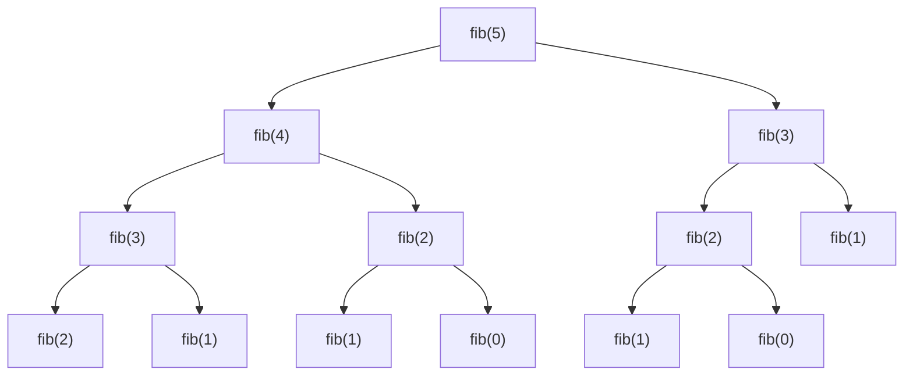
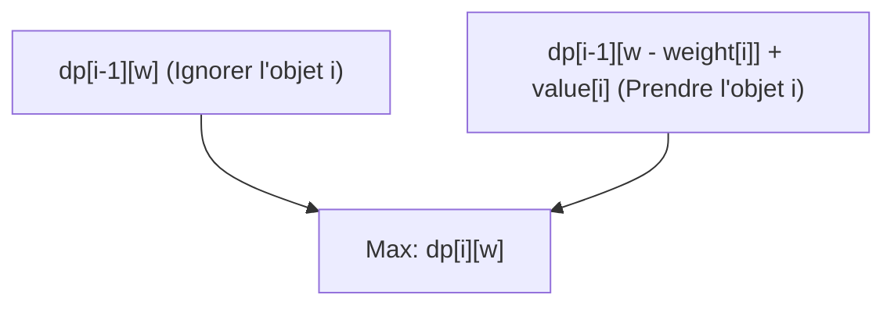
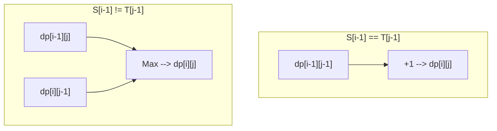

De la programmation compétitive à la conception d'algorithmes en entreprise, la **programmation dynamique (Dynamic Programming, souvent abrégée en DP)** apparaît dans de nombreuses situations et constitue souvent un mur pour beaucoup de programmeurs. "Je n'arrive pas à formuler la relation de récurrence", "Les indices sont buggés", "Je ne sais même pas si le problème peut être résolu avec DP"... Vous êtes probablement nombreux à avoir ces doutes.

Dans cet article, nous couvrirons tout en détail, de l'essence même de la programmation dynamique aux approches concrètes (descendante et ascendante), en passant par des explications pratiques à travers 3 problèmes représentatifs (suite de Fibonacci, problème du sac à dos 0/1, plus longue sous-séquence commune). En montrant des exemples d'implémentation en C++ et en Python, avec des formules mathématiques et des diagrammes, nous fournirons un chemin pour "maîtriser complètement" le sujet. Ce sera un article très long, mais lorsque vous l'aurez lu jusqu'à la fin, vos compétences en algorithmique auront certainement fait un bond en avant.

---

## 1. Qu'est-ce que la programmation dynamique (DP) ?

La programmation dynamique (Dynamic Programming) est une méthode de conception d'algorithmes qui permet de réduire considérablement la complexité des calculs en divisant un problème complexe en "sous-problèmes" plus petits, puis en enregistrant et en réutilisant les solutions de ces sous-problèmes.

Inventée dans les années 1950 par Richard Bellman, cette technique démontre une puissance écrasante dans les problèmes d'optimisation. Il n'y a pas de signification particulière au mot "dynamique" (Dynamic) ; une anecdote raconte qu'il a choisi ce terme parce qu'il "sonnait bien" pour obtenir des financements de recherche à l'époque. Cependant, aujourd'hui, elle s'est solidement établie comme l'un des concepts les plus importants de l'informatique.

Pour que la programmation dynamique soit applicable, le problème cible doit satisfaire aux **2 propriétés importantes** suivantes.

### 1-1. Chevauchement des sous-problèmes (Overlapping Subproblems)

C'est la propriété selon laquelle **le même sous-problème apparaît de manière répétée** au cours du processus de résolution du problème plus vaste.

Par exemple, dans le calcul de la suite de Fibonacci que nous verrons plus loin, le calcul de "trouver le 3ème terme" est nécessaire à la fois pour trouver le 5ème terme et pour trouver le 4ème terme. Si les sous-problèmes ne se chevauchent pas (ex. : les méthodes diviser pour régner comme le tri fusion), il n'y a aucun avantage à enregistrer les solutions, ce qui ne justifie pas l'application de la DP. C'est précisément parce qu'il y a des chevauchements qu'il est possible d'accélérer considérablement le processus en sauvegardant le résultat d'un calcul dans la mémoire (mémoïsation ou tabulation) pour le réutiliser.

### 1-2. Sous-structure optimale (Optimal Substructure)

C'est la propriété selon laquelle **"la solution optimale du problème global est constituée des solutions optimales de ses sous-problèmes"**.

Le problème du plus court chemin en est un exemple clair. Si le chemin le plus court de la ville A à la ville C passe par la ville B, alors le "chemin de la ville A à la ville B" doit également être le chemin le plus court de A à B. Si le chemin de A à B n'était pas optimal (le plus court), on pourrait le raccourcir, ce qui raccourcirait également le chemin global de A à C. Cette propriété, qui permet de déduire la solution optimale globale en combinant des solutions optimales partielles, est le fondement de la transition d'état en programmation dynamique.

---

## 2. Deux approches : Descendante (Top-down) et Ascendante (Bottom-up)

Dans l'implémentation de la programmation dynamique, il existe globalement deux approches : "descendante (récursivité avec mémoïsation)" et "ascendante (tabulation)". Comprendre profondément les caractéristiques de chacune et savoir les utiliser selon la situation est la première étape vers la maîtrise.

### Approche descendante (Récursivité avec mémoïsation / Memoization)

C'est une approche qui part du grand problème et résout les sous-problèmes nécessaires en les appelant récursivement. À ce moment, la réponse à un sous-problème calculé une fois est "notée (sauvegardée)" dans un tableau ou une table de hachage, et pour les fois suivantes, le résultat est renvoyé à partir de la note sans refaire le calcul.

- **Avantages :** 
  - Facile à implémenter en suivant un processus de pensée naturel (relation de récurrence).
  - Comme seuls les sous-problèmes nécessaires sont calculés, c'est avantageux lorsqu'une petite partie de l'espace d'états global est accédée.
- **Inconvénients :** 
  - Il y a un surcoût (overhead) d'appel de fonction dû aux appels récursifs.
  - Il y a un risque de dépassement de pile (stack overflow) si la profondeur de récursivité devient importante (il faut être particulièrement prudent dans des langages comme Python).

### Approche ascendante (Tabulation / Tabulation)

C'est une approche qui part du plus petit sous-problème (cas de base) et remplit les solutions des problèmes de plus en plus grands dans un tableau via un traitement itératif (boucle). Finalement, la solution du problème global recherché est stockée à un emplacement spécifique du tableau.

- **Avantages :** 
  - Aucun surcoût dû à la récursivité, la vitesse d'exécution est rapide.
  - L'accès à la mémoire a tendance à être continu, ce qui offre une bonne efficacité de cache (localité).
  - L'"optimisation de la complexité spatiale (réutilisation de tableaux)", décrite plus loin, est facile à mettre en place.
- **Inconvénients :** 
  - Comme tous les états sont calculés, il peut arriver que des états inutiles soient calculés.
  - Il est nécessaire de comprendre précisément la dépendance (ordre topologique) de la relation de récurrence et d'exécuter la boucle dans le bon ordre.

---

## 3. Pratique 1 : Suite de Fibonacci

Tout d'abord, prenons la suite de Fibonacci comme l'exemple le plus fondamental et le plus facile à comprendre.
La suite de Fibonacci est définie comme suit :

$$
F(0) = 0, \quad F(1) = 1 \\
F(n) = F(n-1) + F(n-2) \quad (n \ge 2)
$$

### 3-1. Récursivité simple (Explosion de la complexité)

Que se passe-t-il si on écrit une fonction récursive exactement selon cette définition ?

```python
def fib_naive(n):
    if n <= 1:
        return n
    return fib_naive(n-1) + fib_naive(n-2)
```

Cette implémentation est intuitive, mais sa complexité temporelle connaît une explosion exponentielle de $O(2^n)$. En effet, le calcul pour les mêmes arguments est répété un grand nombre de fois. Voici l'arbre d'appels récursifs pour calculer $F(5)$.



En regardant le diagramme, on voit que `"fib(3)"` et `"fib(2)"` sont évalués plusieurs fois. C'est le "chevauchement des sous-problèmes".

### 3-2. Approche descendante (Récursivité avec mémoïsation)

On utilise un tableau ou un dictionnaire pour sauvegarder les résultats une fois calculés. Cela réduit la complexité à $O(n)$.

**Implémentation en Python :**
```python
def fib_memo(n, memo=None):
    if memo is None:
        memo = {}
    if n in memo:
        return memo[n]
    if n <= 1:
        return n
    # Calculer et sauvegarder dans le mémo
    memo[n] = fib_memo(n-1, memo) + fib_memo(n-2, memo)
    return memo[n]
```

**Implémentation en C++ :**
```cpp
#include <iostream>
#include <vector>

std::vector<long long> memo;

long long fib_memo(int n) {
    if (n <= 1) return n;
    // Si déjà calculé, retourner depuis le mémo
    if (memo[n] != -1) return memo[n];
    
    // Calculer et sauvegarder dans le mémo
    return memo[n] = fib_memo(n - 1) + fib_memo(n - 2);
}

int main() {
    int n = 50;
    memo.assign(n + 1, -1);
    std::cout << fib_memo(n) << std::endl;
    return 0;
}
```

### 3-3. Approche ascendante (Tabulation)

C'est une approche qui remplit un tableau séquentiellement à partir des plus petites valeurs. Il n'y a pas de crainte de dépassement de pile, et le fonctionnement est extrêmement rapide.

**Implémentation en Python :**
```python
def fib_dp(n):
    if n <= 1:
        return n
    dp = [0] * (n + 1)
    dp[1] = 1
    for i in range(2, n + 1):
        dp[i] = dp[i-1] + dp[i-2]
    return dp[n]
```

**Implémentation en C++ :**
```cpp
#include <iostream>
#include <vector>

long long fib_dp(int n) {
    if (n <= 1) return n;
    std::vector<long long> dp(n + 1, 0);
    dp[1] = 1;
    for (int i = 2; i <= n; ++i) {
        dp[i] = dp[i - 1] + dp[i - 2];
    }
    return dp[n];
}
```

### 3-4. Optimisation de la complexité spatiale

Si l'on observe attentivement l'approche ascendante, pour calculer $dp[i]$, nous n'avons besoin que des deux valeurs les plus récentes, $dp[i-1]$ et $dp[i-2]$, et les valeurs précédentes ne sont pas nécessaires. Par conséquent, il n'est pas nécessaire de conserver le tableau entier, et le calcul peut avancer avec seulement deux variables. Cela permet de réduire la complexité spatiale de $O(n)$ à $O(1)$.

**Implémentation en Python :**
```python
def fib_optimized(n):
    if n <= 1:
        return n
    prev2, prev1 = 0, 1
    for i in range(2, n + 1):
        current = prev1 + prev2
        prev2 = prev1
        prev1 = current
    return current
```

---

## 4. Pratique 2 : Problème du sac à dos 0/1 (0/1 Knapsack Problem)

Passons maintenant à un véritable problème d'optimisation. Le problème du sac à dos 0/1 est connu comme la porte d'entrée de la programmation dynamique.

### 4-1. Énoncé du problème

Vous avez un sac à dos d'une capacité $W$. De plus, il y a $n$ objets, et chaque objet $i$ ($1 \le i \le n$) a un poids $weight[i]$ et une valeur $value[i]$.
Si vous choisissez des objets sans dépasser la capacité du sac à dos, quelle est la valeur totale maximale que vous pouvez obtenir ?
(※ "0/1" signifie que pour chaque objet, il n'y a que deux options : "ne pas le choisir (0)" ou "le choisir (1)". Les objets ne peuvent pas être divisés.)

### 4-2. Définition de l'état et équation de transition d'état

L'étape la plus importante pour résoudre avec DP est de définir correctement l'"état" (State).
Dans ce problème, deux paramètres varient. "Jusqu'à quel objet avons-nous considéré ?" et "Quelle est la capacité restante du sac à dos ?". Nous définissons donc l'état comme suit.

**Définition de l'état :**
$dp[i][w]$ := La valeur totale maximale obtenue en choisissant parmi les $i$ premiers objets de sorte que le poids total soit inférieur ou égal à $w$.

Ensuite, nous considérons comment cet état évolue (transition). Lorsque nous considérons le $i$-ème objet, il y a deux options.
1. **Cas où le $i$-ème objet n'est pas choisi :** 
   La valeur maximale est la même que la valeur maximale satisfaisant la capacité $w$ avec les $i-1$ premiers objets.
   C'est-à-dire, $dp[i-1][w]$
2. **Cas où le $i$-ème objet est choisi :** 
   Puisque le poids de cet objet est $weight[i]$, le sac à dos doit avoir au moins un espace libre supérieur ou égal à $weight[i]$ ($w \ge weight[i]$). Si on le choisit, la valeur obtenue augmente de $value[i]$, mais la capacité utilisable diminue de $weight[i]$. Par conséquent, ce sera la valeur maximale obtenue avec les $i-1$ premiers objets pour la capacité restante $w - weight[i]$, plus $value[i]$.
   C'est-à-dire, $dp[i-1][w - weight[i]] + value[i]$

Parmi ces deux options, on choisit celle qui donne la plus grande valeur ($\max$), donc **l'équation de transition d'état** est la suivante :

$$
dp[i][w] = 
\begin{cases} 
dp[i-1][w] & \text{if } w < weight[i] \\
\max(dp[i-1][w], dp[i-1][w - weight[i]] + value[i]) & \text{if } w \ge weight[i]
\end{cases}
$$

**Cas de base (Conditions initiales) :**
Quand il y a 0 objets ($i=0$), ou quand la capacité est 0 ($w=0$), la valeur maximale est 0.
$$ dp[0][w] = 0, \quad dp[i][0] = 0 $$

Le diagramme Mermaid ci-dessous visualise le concept de la transition d'état.



### 4-3. Implémentation ascendante (Tableau 2D)

Nous transposons directement cette formule en code.

**Implémentation en C++ :**
```cpp
#include <iostream>
#include <vector>
#include <algorithm>

int knapsack(int W, const std::vector<int>& weight, const std::vector<int>& value) {
    int n = weight.size();
    // Initialiser un tableau 2D dp[n+1][W+1] avec des 0
    std::vector<std::vector<int>> dp(n + 1, std::vector<int>(W + 1, 0));

    // Considérer les objets en les ajoutant un par un
    for (int i = 1; i <= n; ++i) {
        // Calculer pour tous les modèles de capacité
        for (int w = 0; w <= W; ++w) {
            if (w < weight[i - 1]) {
                // Cas où on ne peut pas choisir par manque de capacité
                dp[i][w] = dp[i - 1][w];
            } else {
                // Adopter le maximum entre ne pas choisir et choisir
                dp[i][w] = std::max(dp[i - 1][w], dp[i - 1][w - weight[i - 1]] + value[i - 1]);
            }
        }
    }
    
    return dp[n][W];
}

int main() {
    int W = 50;
    std::vector<int> weight = {10, 20, 30};
    std::vector<int> value = {60, 100, 120};
    std::cout << "Max Value: " << knapsack(W, weight, value) << std::endl;
    return 0;
}
```
*(※ Notez qu'en C++, l'indice du tableau commence à 0, donc on utilise `weight[i-1]`.)*

### 4-4. Optimisation de la complexité spatiale (Tableau 1D)

Lors de la mise à jour du tableau 2D $dp[i][w]$, on remarque que seule la ligne précédente $dp[i-1]$ est référencée. C'est le même principe que l'optimisation spatiale de la suite de Fibonacci.
Par conséquent, on peut compresser le tableau en 1D $dp[w]$. Cependant, il faut faire attention lors de la mise à jour. Il faut boucler sur la capacité $w$ **du plus grand au plus petit (de l'arrière vers l'avant)**. Si l'on met à jour depuis l'avant, on référencerait "l'état $i$-ème" qui vient d'être mis à jour dans la même étape, et non "l'état $i-1$-ème", ce qui signifierait choisir le même objet plusieurs fois (c'est la solution pour le "problème du sac à dos sans contrainte de quantité").

**Implémentation en Python (1D) :**
```python
def knapsack_1d(W, weight, value):
    n = len(weight)
    dp = [0] * (W + 1)
    
    for i in range(n):
        # Boucler en arrière à partir de W
        for w in range(W, weight[i] - 1, -1):
            dp[w] = max(dp[w], dp[w - weight[i]] + value[i])
            
    return dp[W]

W = 50
weight = [10, 20, 30]
value = [60, 100, 120]
print("Max Value:", knapsack_1d(W, weight, value))
```
Grâce à cela, la complexité spatiale est considérablement améliorée de $O(nW)$ à $O(W)$. C'est une technique indispensable en entreprise ou en programmation compétitive.

---

## 5. Pratique 3 : Plus Longue Sous-séquence Commune (LCS: Longest Common Subsequence)

Comme problème DP représentatif traitant des chaînes de caractères, prenons le LCS. Le LCS est un algorithme largement appliqué dans le monde réel, par exemple pour la détection des différences entre fichiers (outil diff) ou l'évaluation de la similarité des séquences d'ADN.

### 5-1. Énoncé du problème

Deux chaînes de caractères $S$ et $T$ sont données. Parmi toutes leurs sous-séquences communes (chaînes formées en supprimant zéro ou plusieurs caractères de la chaîne d'origine tout en gardant l'ordre), trouvez la longueur de la plus longue.

Exemple : Si $S = \text{"ABCBDAB"}$, $T = \text{"BDCABA"}$, le LCS est $\text{"BCBA"}$ ou $\text{"BDAB"}$ etc., et sa longueur est 4.

### 5-2. Définition de l'état et équation de transition d'état

Soient $m$ et $n$ les longueurs respectives des chaînes de caractères. Dans ce cas également, on définit l'état par la longueur des préfixes (sous-chaînes à partir du début) pour les deux chaînes.

**Définition de l'état :**
$dp[i][j]$ := La longueur de la plus longue sous-séquence commune (LCS) entre les $i$ premiers caractères de la chaîne $S$ et les $j$ premiers caractères de la chaîne $T$.

On réfléchit à la transition en se concentrant sur les derniers caractères des chaînes $S[i-1]$ et $T[j-1]$.
1. **Cas où $S[i-1] == T[j-1]$ :** 
   Puisque les derniers caractères correspondent, ce caractère sera nécessairement inclus dans le LCS. Par conséquent, cela équivaut au LCS des états où chaque chaîne est raccourcie d'un caractère, plus 1.
   $dp[i][j] = dp[i-1][j-1] + 1$
2. **Cas où $S[i-1] \neq T[j-1]$ :** 
   Puisque les derniers caractères sont différents, au moins l'un d'eux ne sera pas inclus dans le LCS. On prendra le plus long entre le cas où l'on diminue $S$ d'un caractère ($dp[i-1][j]$) et le cas où l'on diminue $T$ d'un caractère ($dp[i][j-1]$).
   $dp[i][j] = \max(dp[i-1][j], dp[i][j-1])$

En résumé, l'équation de transition d'état est la suivante :

$$
dp[i][j] = 
\begin{cases} 
0 & \text{if } i = 0 \text{ or } j = 0 \\
dp[i-1][j-1] + 1 & \text{if } i > 0, j > 0 \text{ and } S[i-1] = T[j-1] \\
\max(dp[i-1][j], dp[i][j-1]) & \text{if } i > 0, j > 0 \text{ and } S[i-1] \neq T[j-1]
\end{cases}
$$

Si on exprime cette transition avec Mermaid, cela donne ceci :



### 5-3. Implémentation ascendante

Cela peut également être implémenté simplement à l'aide d'un tableau 2D.

**Implémentation en Python :**
```python
def longest_common_subsequence(text1: str, text2: str) -> int:
    m, n = len(text1), len(text2)
    # Tableau 2D rempli de 0, avec m+1 lignes et n+1 colonnes
    dp = [[0] * (n + 1) for _ in range(m + 1)]
    
    for i in range(1, m + 1):
        for j in range(1, n + 1):
            if text1[i-1] == text2[j-1]:
                dp[i][j] = dp[i-1][j-1] + 1
            else:
                dp[i][j] = max(dp[i-1][j], dp[i][j-1])
                
    return dp[m][n]

S = "ABCBDAB"
T = "BDCABA"
print("LCS Length:", longest_common_subsequence(S, T))
```

**Implémentation en C++ :**
```cpp
#include <iostream>
#include <vector>
#include <string>
#include <algorithm>

int longest_common_subsequence(const std::string& text1, const std::string& text2) {
    int m = text1.size();
    int n = text2.size();
    std::vector<std::vector<int>> dp(m + 1, std::vector<int>(n + 1, 0));
    
    for (int i = 1; i <= m; ++i) {
        for (int j = 1; j <= n; ++j) {
            if (text1[i-1] == text2[j-1]) {
                dp[i][j] = dp[i-1][j-1] + 1;
            } else {
                dp[i][j] = std::max(dp[i-1][j], dp[i][j-1]);
            }
        }
    }
    
    return dp[m][n];
}

int main() {
    std::string S = "ABCBDAB";
    std::string T = "BDCABA";
    std::cout << "LCS Length: " << longest_common_subsequence(S, T) << std::endl;
    return 0;
}
```

Pour le problème LCS également, puisque la mise à jour utilise seulement la ligne précédente (`dp[i-1]`) et la ligne actuelle (`dp[i]`), il est possible de calculer avec un tableau de 2 lignes (nombre d'éléments $2n$). C'est ce qu'on appelle un "tableau glissant" (Rolling Array). C'est une technique extrêmement utile pour réduire drastiquement la complexité spatiale.

---

## 6. Processus de réflexion pour maîtriser la programmation dynamique

Jusqu'à présent, nous avons vu divers problèmes, mais face à un problème de DP inconnu, comment devriez-vous penser ? Gardez toujours à l'esprit les étapes suivantes.

1. **Ce problème peut-il être résolu avec la DP ? (Vérification des conditions)**
   En pensant récursivement, le même état apparaît-il plusieurs fois ? (Chevauchement des sous-problèmes). Peut-on déduire l'optimum global en combinant les meilleurs choix ? (Sous-structure optimale).
2. **Définir l'état (State)**
   Identifiez les variables qui expriment "Où suis-je actuellement ?", "Que reste-t-il ?", "Quelles sont les contraintes jusqu'à présent ?". Exprimer clairement la signification des indices en mots est la meilleure défense contre les bugs.
3. **Penser à l'équation de transition d'état (Transition)**
   Comment passe-t-on d'un état à l'état suivant ? Quelles sont les options ? Parmi celles-ci, prend-on le maximum (ou le minimum), ou les additionne-t-on ? C'est le cœur de l'algorithme.
4. **Définir les conditions initiales (Base Case)**
   Décidez des valeurs initiales du tableau ou du point de départ des calculs. Gérez correctement les cas limites (edge cases) où une réponse évidente existe, comme 0 objet ou une chaîne de caractères de longueur 0.
5. **Vérifier l'ordre des calculs (Topological Order)**
   Lors de l'implémentation ascendante, tous les états d'origine de la transition doivent avoir été calculés avant de calculer l'état de destination. Prêtez une attention particulière au sens de la boucle.

## 7. Conclusion

Dans cet article, nous avons expliqué en détail les bases théoriques de la programmation dynamique, les approches concrètes d'implémentation, et jusqu'aux problèmes d'optimisation représentatifs.
- La programmation dynamique est une technique qui utilise des relations récursives pour réutiliser les solutions de sous-problèmes.
- L'approche **descendante (mémoïsation)** est intuitive à implémenter, tandis que l'approche **ascendante (tabulation)** a la caractéristique d'avoir un faible facteur constant de temps d'exécution et de faciliter l'optimisation de la mémoire.
- Si l'on peut établir correctement la formule mathématique (équation de transition d'état), l'implémentation devient très simple.
- Les techniques de réduction de la complexité spatiale (réduction du tableau à 1D ou tableau glissant) sont indispensables lorsqu'une performance de niveau professionnel est exigée.

La programmation dynamique peut sembler difficile au début. Cependant, en s'entraînant à trouver la "définition de l'état" et la "transition" sur divers problèmes, vous commencerez progressivement à voir les motifs. Il existe des applications plus avancées telles que la DP sur les arbres, la DP sur les chiffres, la DP avec des masques de bits, la DP sur les intervalles, etc., mais toutes reposent sur la fondation du "chevauchement des sous-problèmes" et de "l'optimisation" que nous avons appris cette fois-ci.

Sans vous précipiter, prenez un papier et un stylo et dessinez vous-même un tableau de DP pour approfondir votre compréhension. Lorsque vous serez capable de libérer la véritable puissance de cet algorithme, votre monde de la programmation s'élargira encore plus.
