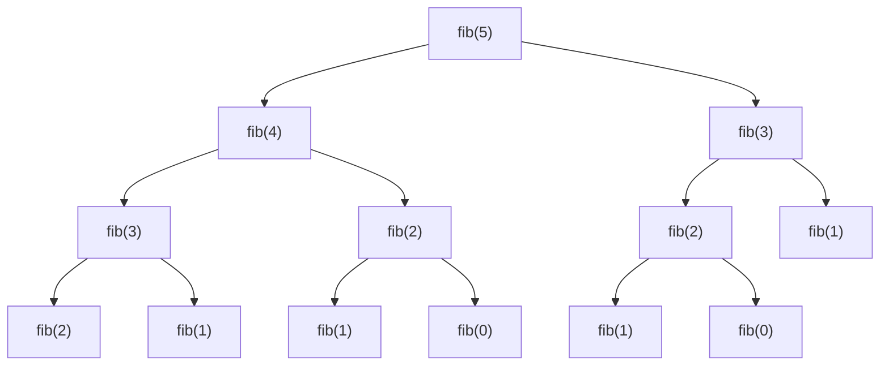
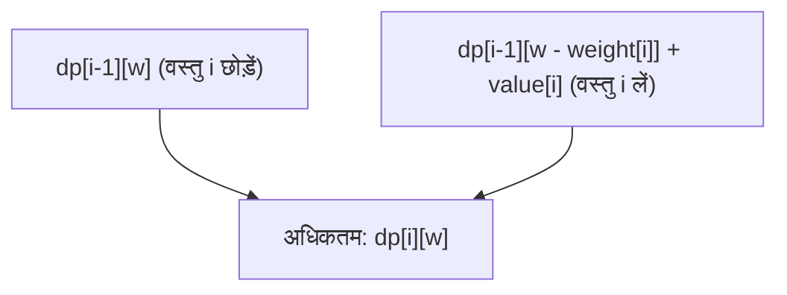
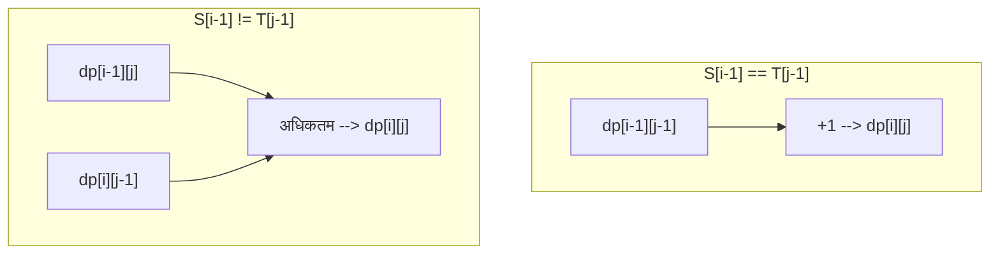

प्रतिस्पर्धी प्रोग्रामिंग से लेकर व्यावहारिक एल्गोरिदम डिज़ाइन तक, कई स्थितियों में जो सामने आता है और कई प्रोग्रामर्स के लिए एक बाधा बन जाता है, वह है **डायनेमिक प्रोग्रामिंग (Dynamic Programming, जिसे आमतौर पर DP कहा जाता है)**। "पुनरावृत्ति संबंध (recurrence relation) नहीं बना पा रहा हूँ", "इंडेक्स (subscript) में बग आ रहा है", "यह तय नहीं कर पा रहा कि यह समस्या DP से हल हो सकती है या नहीं"…… ऐसे बहुत से लोग होंगे जो इन समस्याओं से जूझ रहे होंगे।

इस लेख में, हम डायनेमिक प्रोग्रामिंग के मूल सार से लेकर ठोस दृष्टिकोण (टॉप-डाउन और बॉटम-अप), और तीन प्रतिनिधि समस्याओं (फाइबोनैचि अनुक्रम, 0/1 नैपसैक समस्या, सबसे लंबा सामान्य उप-अनुक्रम) के माध्यम से व्यावहारिक स्पष्टीकरण तक, सब कुछ पूरी तरह से कवर करेंगे। हम C++ और Python दोनों में कार्यान्वयन के उदाहरण दिखाएंगे, और गणितीय सूत्रों और आरेखों के साथ "पूरी तरह से महारत हासिल करने" का मार्ग प्रदान करेंगे। यह एक बहुत लंबा लेख होगा, लेकिन जब आप इसे अंत तक पढ़ लेंगे, तो आपके एल्गोरिदम कौशल में निश्चित रूप से भारी सुधार होगा।

---

## 1. डायनेमिक प्रोग्रामिंग (DP) क्या है?

डायनेमिक प्रोग्रामिंग (Dynamic Programming) एक एल्गोरिदम डिज़ाइन तकनीक है जो जटिल समस्याओं को छोटी "उप-समस्याओं" (subproblems) में विभाजित करती है, और उन उप-समस्याओं के समाधानों को रिकॉर्ड और पुन: उपयोग करके कम्प्यूटेशनल जटिलता (computational complexity) को काफी कम करती है।

1950 के दशक में रिचर्ड बेलमैन (Richard Bellman) द्वारा तैयार की गई यह तकनीक अनुकूलन समस्याओं (optimization problems) में असाधारण शक्ति प्रदर्शित करती है। "डायनेमिक (Dynamic)" शब्द का कोई विशेष अर्थ नहीं है, और एक किस्सा है कि उस समय शोध निधि प्राप्त करने के लिए इस "आकर्षक शब्द" को चुना गया था, लेकिन आज इसने कंप्यूटर विज्ञान में सबसे महत्वपूर्ण अवधारणाओं में से एक के रूप में एक मजबूत स्थिति स्थापित कर ली है।

डायनेमिक प्रोग्रामिंग के लागू होने के लिए, यह आवश्यक है कि लक्षित समस्या निम्नलिखित **2 महत्वपूर्ण गुणों** को पूरा करे।

### 1-1. ओवरलैपिंग उप-समस्याएं (Overlapping Subproblems)

यह वह गुण है जहां एक बड़ी समस्या को हल करने की प्रक्रिया में, **एक ही उप-समस्या बार-बार प्रकट होती है**।

उदाहरण के लिए, फाइबोनैचि अनुक्रम की गणना में, जिसकी चर्चा बाद में की गई है, "तीसरे पद को खोजने" की गणना 5वें पद और 4थे पद दोनों को खोजने के लिए आवश्यक है। यदि उप-समस्याएं ओवरलैप नहीं करती हैं (उदाहरण के लिए: मर्ज सॉर्ट जैसी फूट डालो और राज करो (Divide and Conquer) तकनीक), तो समाधान रिकॉर्ड करने का कोई लाभ नहीं है, इसलिए वे DP के लिए उपयुक्त नहीं हैं। यह ओवरलैपिंग के कारण ही है कि एक बार गणना किए गए परिणाम को मेमोरी में सहेजना (मेमोइज़ेशन या सारणीकरण) और इसका पुन: उपयोग करना नाटकीय गति वृद्धि को संभव बनाता है।

### 1-2. इष्टतम उप-संरचना (Optimal Substructure)

**"पूरी समस्या का इष्टतम समाधान उसकी उप-समस्याओं के इष्टतम समाधानों से बनता है"** यह वह गुण है।

सबसे छोटे पथ (shortest path) की समस्या एक स्पष्ट उदाहरण है। यदि शहर A से शहर C तक का सबसे छोटा मार्ग शहर B से होकर गुजरता है, तो "शहर A से शहर B तक का मार्ग" भी A से B तक का सबसे छोटा मार्ग होना चाहिए। यदि A से B तक का मार्ग इष्टतम (सबसे छोटा) नहीं है, तो इसे अनुकूलित करके A से C तक के पूरे मार्ग को और भी छोटा किया जा सकता है। इस प्रकार, आंशिक इष्टतम समाधानों को मिलाकर समग्र इष्टतम समाधान प्राप्त करने में सक्षम होने का गुण डायनेमिक प्रोग्रामिंग के माध्यम से अवस्था संक्रमण (state transition) का आधार बनता है।

---

## 2. 2 दृष्टिकोण: टॉप-डाउन और बॉटम-अप

डायनेमिक प्रोग्रामिंग को लागू करने के मुख्य रूप से दो दृष्टिकोण हैं: "टॉप-डाउन (मेमोइज़ेशन रिकर्सन)" और "बॉटम-अप (सारणीकरण)"। प्रत्येक की विशेषताओं को गहराई से समझना और स्थिति के अनुसार उनका उपयोग करने में सक्षम होना महारत हासिल करने का पहला कदम है।

### टॉप-डाउन दृष्टिकोण (मेमोइज़ेशन रिकर्सन / Memoization)

यह एक ऐसा दृष्टिकोण है जो एक बड़ी समस्या से शुरू होता है और आवश्यक उप-समस्याओं को पुनरावर्ती (recursively) रूप से कॉल करके हल करता है। इस समय, एक बार गणना की गई उप-समस्या के उत्तर को एक सरणी (array) या हैश मैप में "मेमो (सहेजा)" किया जाता है, ताकि अगली बार गणना किए बिना मेमो से परिणाम वापस किया जा सके।

- **लाभ:** 
  - प्राकृतिक विचार प्रक्रिया (पुनरावृत्ति संबंध) के रूप में लागू करना आसान है।
  - चूंकि केवल आवश्यक उप-समस्याओं की गणना की जाती है, यह तब फायदेमंद होता है जब संपूर्ण अवस्था स्थान (state space) का केवल एक हिस्सा एक्सेस किया जाता है।
- **नुकसान:** 
  - पुनरावर्ती कॉल्स के कारण फ़ंक्शन कॉल ओवरहेड होता है।
  - जब पुनरावृत्ति की गहराई बड़ी हो जाती है, तो स्टैक ओवरफ़्लो का जोखिम होता है (विशेष रूप से Python जैसी भाषाओं में सावधानी आवश्यक है)।

### बॉटम-अप दृष्टिकोण (सारणीकरण / Tabulation)

यह वह दृष्टिकोण है जो सबसे छोटी उप-समस्या (आधार स्थिति) से शुरू होता है और लूप प्रोसेसिंग के माध्यम से क्रमिक रूप से बड़ी समस्याओं के समाधानों को एक तालिका (सरणी) में भरता है। अंततः, जिस समग्र समस्या का आप समाधान खोजना चाहते हैं, उसका समाधान तालिका में एक विशिष्ट स्थान पर संग्रहीत हो जाता है।

- **लाभ:** 
  - पुनरावृत्ति के कारण कोई ओवरहेड नहीं है, और निष्पादन की गति तेज़ है।
  - मेमोरी एक्सेस लगातार होने की संभावना अधिक होती है, जिसके परिणामस्वरूप अच्छी कैश दक्षता (स्थानीयता) होती है।
  - बाद में वर्णित "अंतरिक्ष जटिलता का अनुकूलन (सरणियों का पुन: उपयोग)" आसान है।
- **नुकसान:** 
  - चूंकि सभी स्थितियों की गणना की जाती है, इसके परिणामस्वरूप अनावश्यक स्थितियों की गणना भी हो सकती है।
  - पुनरावृत्ति संबंधों की निर्भरता (टोपोलॉजिकल क्रम) को सटीक रूप से समझना और लूप को सही क्रम में चलाना आवश्यक है।

---

## 3. व्यावहारिक भाग 1: फाइबोनैचि अनुक्रम

सबसे पहले, सबसे बुनियादी और समझने में आसान उदाहरण के रूप में, हम फाइबोनैचि अनुक्रम को लेंगे।
फाइबोनैचि अनुक्रम को निम्नानुसार परिभाषित किया गया है:

$$
F(0) = 0, \quad F(1) = 1 \\
F(n) = F(n-1) + F(n-2) \quad (n \ge 2)
$$

### 3-1. सरल पुनरावृत्ति (जटिलता का विस्फोट)

यदि आप इस परिभाषा के अनुसार एक पुनरावर्ती फ़ंक्शन लिखते हैं तो क्या होगा?

```python
def fib_naive(n):
    if n <= 1:
        return n
    return fib_naive(n-1) + fib_naive(n-2)
```

यह कार्यान्वयन सहज है, लेकिन यह $O(2^n)$ की कम्प्यूटेशनल जटिलता के साथ एक घातीय (exponential) विस्फोट का कारण बनता है। ऐसा इसलिए है क्योंकि एक ही तर्क के लिए गणना बार-बार दोहराई जाती है। नीचे $F(5)$ खोजने का पुनरावृत्ति वृक्ष (recursion tree) दिया गया है।



चित्र को देखते हुए, आप देख सकते हैं कि `"fib(3)"` और `"fib(2)"` का कई बार मूल्यांकन किया गया है। इसे ही "ओवरलैपिंग उप-समस्याएं" कहा जाता है।

### 3-2. टॉप-डाउन दृष्टिकोण (मेमोइज़ेशन रिकर्सन)

सरणियों या शब्दकोशों (dictionaries) का उपयोग करके, एक बार गणना किए गए परिणाम सहेजे जाते हैं। इससे कम्प्यूटेशनल जटिलता $O(n)$ हो जाती है।

**Python कार्यान्वयन:**
```python
def fib_memo(n, memo=None):
    if memo is None:
        memo = {}
    if n in memo:
        return memo[n]
    if n <= 1:
        return n
    # गणना करें और मेमो में सहेजें
    memo[n] = fib_memo(n-1, memo) + fib_memo(n-2, memo)
    return memo[n]
```

**C++ कार्यान्वयन:**
```cpp
#include <iostream>
#include <vector>

std::vector<long long> memo;

long long fib_memo(int n) {
    if (n <= 1) return n;
    // यदि पहले से ही गणना की गई है, तो मेमो से वापस करें
    if (memo[n] != -1) return memo[n];
    
    // गणना करें और मेमो में सहेजें
    return memo[n] = fib_memo(n - 1) + fib_memo(n - 2);
}

int main() {
    int n = 50;
    memo.assign(n + 1, -1);
    std::cout << fib_memo(n) << std::endl;
    return 0;
}
```

### 3-3. बॉटम-अप दृष्टिकोण (सारणीकरण)

यह एक ऐसा दृष्टिकोण है जिसमें सरणी को सबसे छोटे से क्रम में भरा जाता है। स्टैक ओवरफ़्लो के बारे में चिंता करने की कोई आवश्यकता नहीं है, और यह बहुत तेज़ी से काम करता है।

**Python कार्यान्वयन:**
```python
def fib_dp(n):
    if n <= 1:
        return n
    dp = [0] * (n + 1)
    dp[1] = 1
    for i in range(2, n + 1):
        dp[i] = dp[i-1] + dp[i-2]
    return dp[n]
```

**C++ कार्यान्वयन:**
```cpp
#include <iostream>
#include <vector>

long long fib_dp(int n) {
    if (n <= 1) return n;
    std::vector<long long> dp(n + 1, 0);
    dp[1] = 1;
    for (int i = 2; i <= n; ++i) {
        dp[i] = dp[i - 1] + dp[i - 2];
    }
    return dp[n];
}
```

### 3-4. अंतरिक्ष जटिलता (Space Complexity) का अनुकूलन

यदि आप बॉटम-अप दृष्टिकोण को ध्यान से देखते हैं, तो $dp[i]$ की गणना करने के लिए केवल दो हालिया मानों, $dp[i-1]$ और $dp[i-2]$ की आवश्यकता होती है, और पिछले मानों की आवश्यकता नहीं होती है। इसलिए, पूरी सरणी को बनाए रखने की कोई आवश्यकता नहीं है, और गणना केवल दो चर के साथ आगे बढ़ सकती है। इससे अंतरिक्ष जटिलता को $O(n)$ से $O(1)$ तक कम किया जा सकता है।

**Python कार्यान्वयन:**
```python
def fib_optimized(n):
    if n <= 1:
        return n
    prev2, prev1 = 0, 1
    for i in range(2, n + 1):
        current = prev1 + prev2
        prev2 = prev1
        prev1 = current
    return current
```

---

## 4. व्यावहारिक भाग 2: 0/1 नैपसैक समस्या (0/1 Knapsack Problem)

अगली एक पूर्ण अनुकूलन समस्या है। 0/1 नैपसैक समस्या को डायनेमिक प्रोग्रामिंग के प्रवेश द्वार के रूप में जाना जाता है।

### 4-1. समस्या की रूपरेखा

क्षमता $W$ वाला एक नैपसैक (knapsack) है। साथ ही, $n$ वस्तुएं हैं, और प्रत्येक वस्तु $i$ ($1 \le i \le n$) का वजन $weight[i]$ और मूल्य $value[i]$ निर्धारित है।
नैपसैक की क्षमता से अधिक हुए बिना वस्तुओं का चयन करने पर, प्राप्त किए जा सकने वाले कुल मूल्य का अधिकतम मान क्या होगा?
(※ "0/1" का अर्थ है कि प्रत्येक वस्तु के लिए "न चुनें (0)" या "चुनें (1)" के दो विकल्प हैं। वस्तुओं को विभाजित नहीं किया जा सकता है।)

### 4-2. अवस्था परिभाषा और अवस्था संक्रमण समीकरण

DP को हल करने के लिए सबसे महत्वपूर्ण कदम "अवस्था (State)" को उचित रूप से परिभाषित करना है।
इस समस्या में, 2 पैरामीटर बदलते हैं। "किन वस्तुओं पर विचार किया गया है" और "नैपसैक की शेष क्षमता"। इसलिए, हम अवस्था को निम्नानुसार परिभाषित करते हैं।

**अवस्था परिभाषा:**
$dp[i][w]$ := कुल मूल्य का अधिकतम मान जब शुरुआत से केवल $i$-वीं वस्तु तक का उपयोग करके चुना जाता है ताकि कुल वजन $w$ या उससे कम हो।

अगला, विचार करें कि यह अवस्था कैसे बदलती है (संक्रमण)। $i$-वीं वस्तु पर विचार करते समय, 2 विकल्प होते हैं।
1. **यदि आप $i$-वीं वस्तु को नहीं चुनते हैं:** 
   अधिकतम मूल्य क्षमता $w$ को पूरा करने वाली $i-1$-वीं वस्तु तक के अधिकतम मूल्य के समान है।
   अर्थात, $dp[i-1][w]$
2. **यदि आप $i$-वीं वस्तु को चुनते हैं:** 
   चूंकि इस वस्तु का वजन $weight[i]$ है, इसलिए नैपसैक में कम से कम $weight[i]$ या उससे अधिक की खाली क्षमता होनी चाहिए ($w \ge weight[i]$)। यदि चुना जाता है, तो प्राप्त मूल्य $value[i]$ से बढ़ जाता है, लेकिन प्रयोग करने योग्य क्षमता $weight[i]$ से कम हो जाती है। इसलिए, यह शेष क्षमता $w - weight[i]$ के लिए $i-1$-वीं वस्तु तक प्राप्त अधिकतम मूल्य में $value[i]$ जोड़कर प्राप्त मान होगा।
   अर्थात, $dp[i-1][w - weight[i]] + value[i]$

इन दोनों विकल्पों में से, आपको वह विकल्प चुनना चाहिए जिसका मूल्य अधिक हो ($\max$), इसलिए **अवस्था संक्रमण समीकरण** निम्नानुसार होगा।

$$
dp[i][w] = 
\begin{cases} 
dp[i-1][w] & \text{if } w < weight[i] \\
\max(dp[i-1][w], dp[i-1][w - weight[i]] + value[i]) & \text{if } w \ge weight[i]
\end{cases}
$$

**आधार स्थिति (प्रारंभिक शर्तें):**
जब 0 वस्तुएं हों ($i=0$), या जब क्षमता 0 हो ($w=0$), तो मूल्य का अधिकतम मान 0 होता है।
$$ dp[0][w] = 0, \quad dp[i][0] = 0 $$

निम्नलिखित Mermaid आरेख अवस्था संक्रमण की अवधारणा की कल्पना करता है।



### 4-3. बॉटम-अप कार्यान्वयन (2D सरणी)

इस गणितीय सूत्र को सीधे कोड में बदल दिया गया है।

**C++ कार्यान्वयन:**
```cpp
#include <iostream>
#include <vector>
#include <algorithm>

int knapsack(int W, const std::vector<int>& weight, const std::vector<int>& value) {
    int n = weight.size();
    // dp[n+1][W+1] 2D सरणी को 0 से प्रारंभ करें
    std::vector<std::vector<int>> dp(n + 1, std::vector<int>(W + 1, 0));

    // एक-एक करके वस्तुएं जोड़ें और विचार करें
    for (int i = 1; i <= n; ++i) {
        // सभी क्षमता पैटर्नों के लिए गणना करें
        for (int w = 0; w <= W; ++w) {
            if (w < weight[i - 1]) {
                // यदि क्षमता की कमी के कारण नहीं चुना जा सकता है
                dp[i][w] = dp[i - 1][w];
            } else {
                // न चुनने और चुनने में से जो बड़ा हो उसे अपनाएं
                dp[i][w] = std::max(dp[i - 1][w], dp[i - 1][w - weight[i - 1]] + value[i - 1]);
            }
        }
    }
    
    return dp[n][W];
}

int main() {
    int W = 50;
    std::vector<int> weight = {10, 20, 30};
    std::vector<int> value = {60, 100, 120};
    std::cout << "Max Value: " << knapsack(W, weight, value) << std::endl;
    return 0;
}
```
*(※ध्यान दें कि C++ में, सरणी अनुक्रमणिका 0 से शुरू होती है, इसलिए `weight[i-1]` का उपयोग किया जाता है।)*

### 4-4. अंतरिक्ष जटिलता का अनुकूलन (1D सरणी में परिवर्तन)

आप देखेंगे कि 2D सरणी $dp[i][w]$ को अपडेट करते समय, यह हमेशा केवल पिछली पंक्ति $dp[i-1]$ को संदर्भित करता है। यह फाइबोनैचि अनुक्रम के अंतरिक्ष अनुकूलन के समान सिद्धांत है।
इसलिए, सरणी को 1D $dp[w]$ में संपीड़ित (compressed) किया जा सकता है। हालाँकि, अपडेट करते समय सावधानी बरतने की आवश्यकता है। क्षमता $w$ को **बड़े से छोटे (पीछे से आगे)** की ओर लूप करना आवश्यक है। यदि आप इसे सामने से अपडेट करते हैं, तो आप "$i-1$-वीं अवस्था" को संदर्भित नहीं करेंगे, बल्कि "$i$-वीं अवस्था" को संदर्भित करेंगे जो अभी-अभी उसी चरण में अपडेट की गई है, जिसके परिणामस्वरूप एक ही वस्तु को कई बार चुना जा सकता है (यह "बिना संख्या सीमा वाली नैपसैक समस्या" का समाधान बन जाएगा)।

**Python कार्यान्वयन (1D में परिवर्तन):**
```python
def knapsack_1d(W, weight, value):
    n = len(weight)
    dp = [0] * (W + 1)
    
    for i in range(n):
        # W से पीछे की ओर लूप करें
        for w in range(W, weight[i] - 1, -1):
            dp[w] = max(dp[w], dp[w - weight[i]] + value[i])
            
    return dp[W]

W = 50
weight = [10, 20, 30]
value = [60, 100, 120]
print("Max Value:", knapsack_1d(W, weight, value))
```
यह अंतरिक्ष जटिलता को $O(nW)$ से $O(W)$ तक नाटकीय रूप से सुधारता है। यह व्यावहारिक कार्य और प्रतिस्पर्धी प्रोग्रामिंग में एक आवश्यक तकनीक है।

---

## 5. व्यावहारिक भाग 3: सबसे लंबा सामान्य उप-अनुक्रम (LCS: Longest Common Subsequence)

स्ट्रिंग्स को संभालने वाली एक विशिष्ट DP समस्या के रूप में, हम LCS पर चर्चा करेंगे। LCS एक ऐसा एल्गोरिदम है जिसका उपयोग वास्तविक दुनिया में व्यापक रूप से किया जाता है, जैसे कि फ़ाइल अंतर का पता लगाने (diff टूल) और DNA अनुक्रम समानता निर्धारण के लिए।

### 5-1. समस्या की रूपरेखा

दो स्ट्रिंग $S$ और $T$ दिए गए हैं। दोनों के उप-अनुक्रमों (मूल स्ट्रिंग से क्रम को बनाए रखते हुए 0 या अधिक वर्णों को हटाकर बनाई गई स्ट्रिंग) के रूप में जो सामान्य हैं, उनमें से सबसे लंबे की लंबाई ज्ञात कीजिए।

उदाहरण: जब $S = \text{"ABCBDAB"}$ और $T = \text{"BDCABA"}$ हो, तो LCS $\text{"BCBA"}$ या $\text{"BDAB"}$ आदि है, और इसकी लंबाई 4 है।

### 5-2. अवस्था परिभाषा और अवस्था संक्रमण समीकरण

मान लें कि स्ट्रिंग्स की लंबाई क्रमशः $m$ और $n$ है। इस मामले में भी, दो स्ट्रिंग्स के लिए उपसर्गों (शुरुआत से उप-स्ट्रिंग्स) की लंबाई को अवस्था के रूप में उपयोग किया जाता है।

**अवस्था परिभाषा:**
$dp[i][j]$ := स्ट्रिंग $S$ के पहले $i$ वर्णों और स्ट्रिंग $T$ के पहले $j$ वर्णों के बीच सबसे लंबे सामान्य उप-अनुक्रम (LCS) की लंबाई।

स्ट्रिंग के अंतिम वर्णों $S[i-1]$ और $T[j-1]$ पर ध्यान केंद्रित करके संक्रमण पर विचार करें।
1. **यदि $S[i-1] == T[j-1]$ है:** 
   चूंकि अंतिम वर्ण मेल खाते हैं, यह वर्ण निश्चित रूप से LCS में शामिल है। इसलिए, यह प्रत्येक स्ट्रिंग को 1 वर्ण छोटा करने पर प्राप्त LCS की अवस्था में 1 जोड़कर प्राप्त किया जाता है।
   $dp[i][j] = dp[i-1][j-1] + 1$
2. **यदि $S[i-1] \neq T[j-1]$ है:** 
   चूंकि अंतिम वर्ण भिन्न हैं, कम से कम एक को LCS में शामिल नहीं किया जाएगा। यदि $S$ को 1 वर्ण ($dp[i-1][j]$) से घटाया जाता है और यदि $T$ को 1 वर्ण ($dp[i][j-1]$) से घटाया जाता है, तो जो लंबा होगा उसे अपनाया जाएगा।
   $dp[i][j] = \max(dp[i-1][j], dp[i][j-1])$

संक्षेप में, यह निम्नलिखित अवस्था संक्रमण समीकरण बन जाता है।

$$
dp[i][j] = 
\begin{cases} 
0 & \text{if } i = 0 \text{ or } j = 0 \\
dp[i-1][j-1] + 1 & \text{if } i > 0, j > 0 \text{ and } S[i-1] = T[j-1] \\
\max(dp[i-1][j], dp[i][j-1]) & \text{if } i > 0, j > 0 \text{ and } S[i-1] \neq T[j-1]
\end{cases}
$$

यदि हम इस संक्रमण को Mermaid में व्यक्त करते हैं, तो यह निम्नानुसार होगा।



### 5-3. बॉटम-अप कार्यान्वयन

इसे 2D सरणी का उपयोग करके आसानी से लागू किया जा सकता है।

**Python कार्यान्वयन:**
```python
def longest_common_subsequence(text1: str, text2: str) -> int:
    m, n = len(text1), len(text2)
    # m+1 पंक्तियों और n+1 स्तंभों की 0-भरी हुई 2D सरणी
    dp = [[0] * (n + 1) for _ in range(m + 1)]
    
    for i in range(1, m + 1):
        for j in range(1, n + 1):
            if text1[i-1] == text2[j-1]:
                dp[i][j] = dp[i-1][j-1] + 1
            else:
                dp[i][j] = max(dp[i-1][j], dp[i][j-1])
                
    return dp[m][n]

S = "ABCBDAB"
T = "BDCABA"
print("LCS Length:", longest_common_subsequence(S, T))
```

**C++ कार्यान्वयन:**
```cpp
#include <iostream>
#include <vector>
#include <string>
#include <algorithm>

int longest_common_subsequence(const std::string& text1, const std::string& text2) {
    int m = text1.size();
    int n = text2.size();
    std::vector<std::vector<int>> dp(m + 1, std::vector<int>(n + 1, 0));
    
    for (int i = 1; i <= m; ++i) {
        for (int j = 1; j <= n; ++j) {
            if (text1[i-1] == text2[j-1]) {
                dp[i][j] = dp[i-1][j-1] + 1;
            } else {
                dp[i][j] = std::max(dp[i-1][j], dp[i][j-1]);
            }
        }
    }
    
    return dp[m][n];
}

int main() {
    std::string S = "ABCBDAB";
    std::string T = "BDCABA";
    std::cout << "LCS Length: " << longest_common_subsequence(S, T) << std::endl;
    return 0;
}
```

LCS समस्या में भी, चूँकि अद्यतन करने के लिए केवल पिछली पंक्ति (`dp[i-1]`) और वर्तमान पंक्ति (`dp[i]`) का उपयोग किया जाता है, इसलिए इसे 2 पंक्तियों (तत्वों की संख्या $2n$) की एक सरणी के साथ गणना की जा सकती है। इसे "रोलिंग सरणी (Rolling Array)" कहा जाता है। यह अंतरिक्ष जटिलता को नाटकीय रूप से कम करने की तकनीक के रूप में अत्यंत उपयोगी है।

---

## 6. डायनेमिक प्रोग्रामिंग में महारत हासिल करने के लिए विचार प्रक्रिया

हमने अब तक विभिन्न समस्याओं को देखा है, लेकिन जब आप किसी अज्ञात DP समस्या का सामना करते हैं तो आपको कैसे विचार करना चाहिए? कृपया हमेशा निम्नलिखित चरणों को ध्यान में रखें।

1. **क्या यह समस्या DP द्वारा हल की जा सकती है? (शर्तों की पुष्टि)**
   पुनरावर्ती रूप से विचार करते समय, क्या वही अवस्था बार-बार प्रकट होती है (ओवरलैपिंग उप-समस्याएं)। क्या सर्वोत्तम विकल्पों को मिलाकर समग्र सर्वोत्तम प्राप्त किया जा सकता है (इष्टतम उप-संरचना)।
2. **अवस्था (State) को परिभाषित करें**
   उन चरों की पहचान करें जो दर्शाते हैं "आप अभी कहाँ हैं", "क्या बचा है", और "अब तक की बाधाएं क्या हैं"। इंडेक्स (subscript) के अर्थ को स्पष्ट रूप से व्यक्त करना बग को रोकने का सबसे अच्छा बचाव है।
3. **अवस्था संक्रमण समीकरण (Transition) पर विचार करें**
   एक अवस्था से दूसरी अवस्था में कैसे जाना है। विकल्प क्या हैं। क्या आप उनमें से अधिकतम (या न्यूनतम) लेते हैं, या उन्हें एक साथ जोड़ते हैं। यही एल्गोरिदम का दिल है।
4. **प्रारंभिक शर्तें (Base Case) सेट करें**
   सरणी के प्रारंभिक मान और गणना के प्रारंभिक बिंदु को निर्धारित करें। ऐसे किनारे के मामलों (edge cases) को सही ढंग से संभालें जहाँ एक स्पष्ट उत्तर मौजूद है, जैसे 0 वस्तुएं या 0 लंबाई वाली स्ट्रिंग।
5. **गणना के क्रम (Topological Order) की पुष्टि करें**
   बॉटम-अप दृष्टिकोण लागू करते समय, गंतव्य अवस्था (transition destination state) की गणना करने से पहले, स्रोत अवस्था की गणना की जानी चाहिए। लूप की दिशा पर पूरा ध्यान दें।

## 7. निष्कर्ष

इस लेख में, हमने डायनेमिक प्रोग्रामिंग के मूल सिद्धांत से लेकर विशिष्ट कार्यान्वयन दृष्टिकोणों और यहाँ तक कि विशिष्ट अनुकूलन समस्याओं तक विस्तार से बताया है।
- डायनेमिक प्रोग्रामिंग पुनरावर्ती संबंधों का उपयोग करके उप-समस्याओं के समाधानों का पुन: उपयोग करने की एक तकनीक है।
- **टॉप-डाउन (मेमोइज़ेशन)** का कार्यान्वयन सहज है, और **बॉटम-अप (सारणीकरण)** में हल्का स्थिर कारक (constant factor) होता है और मेमोरी अनुकूलन (memory optimization) के लिए आसान होने की विशेषता है।
- यदि गणितीय सूत्र (अवस्था संक्रमण समीकरण) सही ढंग से स्थापित किया जा सकता है, तो कार्यान्वयन बहुत सरल हो जाता है।
- अंतरिक्ष जटिलता को कम करने की तकनीक (सरणियों का 1D सरणीकरण और रोलिंग सरणी) अपरिहार्य हैं जब व्यावहारिक स्तर पर प्रदर्शन की आवश्यकता होती है।

डायनेमिक प्रोग्रामिंग पहली बार में मुश्किल लग सकती है। हालाँकि, विभिन्न समस्याओं में "अवस्था परिभाषा" और "संक्रमण" खोजने के अभ्यास को दोहराने से, आपको धीरे-धीरे पैटर्न दिखाई देने लगेंगे। ट्री DP (Tree DP), डिजिट DP (Digit DP), बिट DP (Bit DP) और इंटरवल DP (Interval DP) जैसे अधिक उन्नत अनुप्रयोग भी हैं, लेकिन वे सभी "ओवरलैपिंग उप-समस्याएं" और "अनुकूलन" की नींव पर बने हैं जो हमने इस बार सीखे हैं।

जल्दबाजी न करें, और पेन और पेपर के साथ वास्तविक DP तालिका (टेबल) लिखकर अपनी समझ को गहरा करें। जब आप एल्गोरिदम की वास्तविक शक्ति को सामने लाने में सक्षम हो जाएंगे, तो प्रोग्रामिंग की दुनिया का और भी विस्तार होगा।
