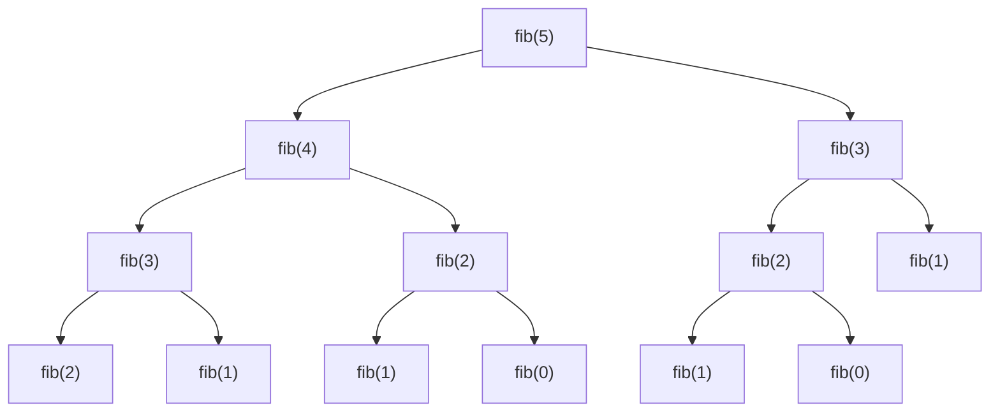
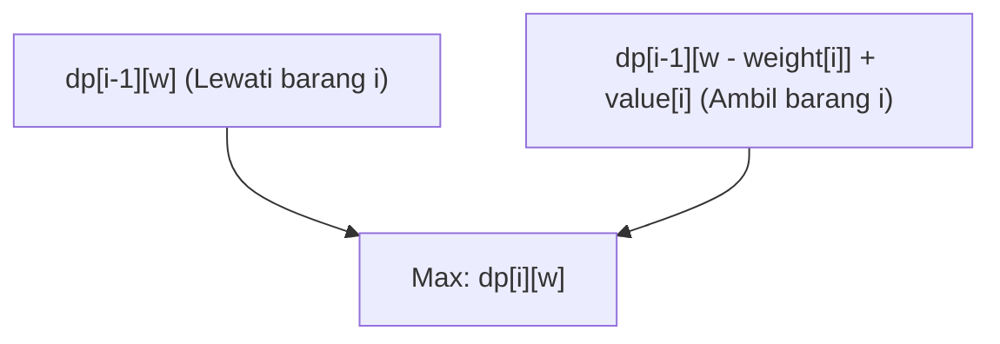
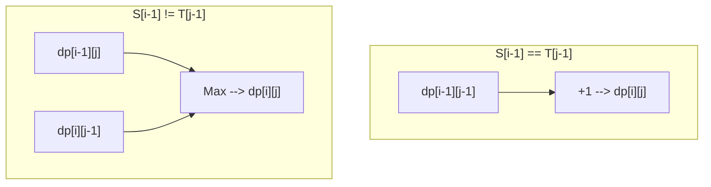

Dari competitive programming hingga desain algoritma di dunia nyata, **Pemrograman Dinamis (Dynamic Programming, biasa disebut DP)** sering muncul di banyak situasi dan menjadi hambatan bagi banyak programmer. "Tidak bisa menyusun relasi rekurensi (recurrence relation)", "Indeksnya selalu salah/bug", "Bahkan tidak bisa menilai apakah masalah tersebut bisa diselesaikan dengan DP atau tidak"...... Pasti banyak dari Anda yang memiliki kekhawatiran seperti ini.

Dalam artikel ini, kita akan membahas secara menyeluruh dari esensi pemrograman dinamis, pendekatan konkretnya (top-down dan bottom-up), hingga penjelasan praktis melalui 3 masalah representatif (Deret Fibonacci, Masalah 0/1 Knapsack, dan Longest Common Subsequence). Kami akan menunjukkan contoh implementasi dalam C++ dan Python, serta memberikan panduan untuk "menguasainya sepenuhnya" menggunakan rumus matematika dan ilustrasi gambar. Ini akan menjadi artikel yang sangat panjang, tetapi ketika Anda selesai membacanya sampai akhir, kemampuan algoritma Anda pasti akan melonjak drastis.

---

## 1. Apa itu Pemrograman Dinamis (DP)?

Pemrograman Dinamis (Dynamic Programming) adalah metode desain algoritma yang secara drastis mengurangi kompleksitas komputasi dengan membagi masalah kompleks menjadi "sub-masalah" yang lebih kecil, lalu mencatat dan menggunakan kembali solusi dari sub-masalah tersebut.

Metode ini, yang dirancang oleh Richard Bellman pada tahun 1950-an, menunjukkan kekuatan luar biasa dalam masalah optimasi. Tidak ada arti khusus dalam kata "Dinamis (Dynamic)", konon katanya pada waktu itu kata tersebut dipilih karena terdengar bagus untuk mendapatkan dana penelitian, tetapi saat ini ia telah membangun posisi yang kuat sebagai salah satu konsep terpenting dalam ilmu komputer.

Agar pemrograman dinamis dapat diterapkan, masalah yang menjadi target harus memenuhi **2 sifat penting** berikut.

### 1-1. Tumpang Tindih Sub-masalah (Overlapping Subproblems)

Ini adalah sifat di mana dalam proses menyelesaikan masalah besar, **sub-masalah yang sama muncul berulang kali**.

Misalnya, dalam perhitungan deret Fibonacci yang akan dibahas nanti, perhitungan "mencari suku ke-3" diperlukan baik saat mencari suku ke-5 maupun suku ke-4. Jika sub-masalah tidak tumpang tindih (contoh: metode divide and conquer seperti merge sort), tidak ada gunanya mencatat solusi, sehingga masalah tersebut bukan target penerapan DP. Justru karena saling tumpang tindih, menyimpan hasil perhitungan sekali ke dalam memori (memoisasi atau tabulasi) dan menggunakan kembali akan memungkinkan percepatan yang dramatis.

### 1-2. Struktur Sub-optimal (Optimal Substructure)

**"Solusi optimal dari keseluruhan masalah dibentuk dari solusi optimal sub-masalahnya"** merupakan inti dari sifat ini.

Masalah rute terpendek adalah contoh yang mudah dipahami. Jika rute terpendek dari Kota A ke Kota C melewati Kota B, maka "rute dari Kota A ke Kota B" juga harus menjadi rute terpendek dari A ke B. Karena jika rute dari A ke B tidak optimal (bukan yang terpendek), kita seharusnya bisa membuat rute keseluruhan dari A ke C menjadi lebih pendek dengan mengoptimalkan rute tersebut. Dengan cara ini, sifat di mana kita bisa memperoleh solusi optimal keseluruhan dengan menggabungkan solusi optimal parsial menjadi dasar transisi state (keadaan) dalam pemrograman dinamis.

---

## 2. Dua Pendekatan: Top-down dan Bottom-up

Dalam implementasi pemrograman dinamis, secara umum terdapat 2 pendekatan yaitu "Top-down (Rekursi Memoisasi)" dan "Bottom-up (Tabulasi)". Memahami dengan baik karakteristik masing-masing dan bisa menggunakannya sesuai situasi adalah langkah pertama untuk menguasainya.

### Pendekatan Top-down (Rekursi Memoisasi / Memoization)

Pendekatan ini dimulai dari masalah besar dan memanggil sub-masalah yang diperlukan secara rekursif untuk menyelesaikannya. Pada saat ini, jawaban sub-masalah yang telah dihitung sekali "dicatat (disimpan)" dalam array atau hash map, sehingga untuk perhitungan selanjutnya, hasil dari catatan tersebut langsung dikembalikan tanpa melakukan perhitungan lagi.

- **Kelebihan:** 
  - Mudah diimplementasikan dengan proses pemikiran yang natural (relasi rekurensi).
  - Karena hanya sub-masalah yang diperlukan saja yang dihitung, ini menguntungkan jika hanya sebagian dari seluruh ruang state (state space) yang diakses.
- **Kekurangan:** 
  - Ada overhead fungsi (function call overhead) karena pemanggilan rekursif.
  - Jika kedalaman rekursi terlalu besar, ada risiko stack overflow (terutama perlu diwaspadai dalam bahasa seperti Python).

### Pendekatan Bottom-up (Tabulasi / Tabulation)

Pendekatan ini dimulai dari sub-masalah yang paling kecil (base case) dan secara berturut-turut mengisi solusi masalah yang lebih besar ke dalam tabel (array) menggunakan perulangan (loop). Pada akhirnya, solusi dari masalah keseluruhan yang ingin dicari akan disimpan di posisi tertentu pada tabel.

- **Kelebihan:** 
  - Tidak ada overhead akibat rekursi, sehingga kecepatan eksekusinya cepat.
  - Akses memori cenderung berurutan, sehingga efisiensi cache (lokalitas) baik.
  - Memudahkan "optimasi kompleksitas ruang (penggunaan kembali array)" yang akan dibahas nanti.
- **Kekurangan:** 
  - Karena menghitung semua state, ada kemungkinan menghitung state yang sebenarnya tidak diperlukan.
  - Perlu memahami dengan tepat dependensi relasi rekurensi (urutan topologis/topological order) dan menjalankan perulangan dengan urutan yang benar.

---

## 3. Praktik 1: Deret Fibonacci

Pertama-tama, sebagai contoh paling dasar dan mudah dipahami, kita akan membahas deret Fibonacci.
Deret Fibonacci didefinisikan sebagai berikut:

$$
F(0) = 0, \quad F(1) = 1 \\
F(n) = F(n-1) + F(n-2) \quad (n \ge 2)
$$

### 3-1. Rekursi Sederhana (Ledakan Kompleksitas)

Apa yang terjadi jika kita menulis fungsi rekursif sesuai dengan definisi ini?

```python
def fib_naive(n):
    if n <= 1:
        return n
    return fib_naive(n-1) + fib_naive(n-2)
```

Implementasi ini intuitif, tetapi menyebabkan ledakan kompleksitas eksponensial sebesar $O(2^n)$. Ini karena perhitungan terhadap argumen yang sama diulang berkali-kali. Berikut adalah pohon rekursi saat mencari $F(5)$.



Jika melihat diagram tersebut, terlihat bahwa `"fib(3)"` dan `"fib(2)"` dievaluasi beberapa kali. Inilah yang disebut "tumpang tindih sub-masalah".

### 3-2. Pendekatan Top-down (Rekursi Memoisasi)

Kita menggunakan array atau dictionary untuk menyimpan hasil yang telah dihitung. Dengan demikian kompleksitasnya menjadi $O(n)$.

**Implementasi Python:**
```python
def fib_memo(n, memo=None):
    if memo is None:
        memo = {}
    if n in memo:
        return memo[n]
    if n <= 1:
        return n
    # Hitung dan simpan ke memo
    memo[n] = fib_memo(n-1, memo) + fib_memo(n-2, memo)
    return memo[n]
```

**Implementasi C++:**
```cpp
#include <iostream>
#include <vector>

std::vector<long long> memo;

long long fib_memo(int n) {
    if (n <= 1) return n;
    // Jika sudah dihitung, kembalikan dari memo
    if (memo[n] != -1) return memo[n];
    
    // Hitung dan simpan ke memo
    return memo[n] = fib_memo(n - 1) + fib_memo(n - 2);
}

int main() {
    int n = 50;
    memo.assign(n + 1, -1);
    std::cout << fib_memo(n) << std::endl;
    return 0;
}
```

### 3-3. Pendekatan Bottom-up (Tabulasi)

Ini adalah pendekatan di mana kita mengisi array secara berurutan mulai dari yang terkecil. Tidak ada kekhawatiran tentang stack overflow dan berjalan sangat cepat.

**Implementasi Python:**
```python
def fib_dp(n):
    if n <= 1:
        return n
    dp = [0] * (n + 1)
    dp[1] = 1
    for i in range(2, n + 1):
        dp[i] = dp[i-1] + dp[i-2]
    return dp[n]
```

**Implementasi C++:**
```cpp
#include <iostream>
#include <vector>

long long fib_dp(int n) {
    if (n <= 1) return n;
    std::vector<long long> dp(n + 1, 0);
    dp[1] = 1;
    for (int i = 2; i <= n; ++i) {
        dp[i] = dp[i - 1] + dp[i - 2];
    }
    return dp[n];
}
```

### 3-4. Optimasi Kompleksitas Ruang

Jika kita amati dengan cermat pendekatan bottom-up, yang dibutuhkan untuk menghitung $dp[i]$ hanyalah dua nilai terakhir, yaitu $dp[i-1]$ dan $dp[i-2]$, sedangkan nilai-nilai sebelumnya tidak diperlukan. Oleh karena itu, kita tidak perlu menyimpan seluruh array, tetapi bisa memajukan perhitungan hanya dengan dua variabel. Ini memungkinkan kita untuk mengurangi kompleksitas ruang dari $O(n)$ menjadi $O(1)$.

**Implementasi Python:**
```python
def fib_optimized(n):
    if n <= 1:
        return n
    prev2, prev1 = 0, 1
    for i in range(2, n + 1):
        current = prev1 + prev2
        prev2 = prev1
        prev1 = current
    return current
```

---

## 4. Praktik 2: Masalah 0/1 Knapsack (0/1 Knapsack Problem)

Berikutnya adalah masalah optimasi yang sesungguhnya. Masalah 0/1 Knapsack dikenal sebagai gerbang awal pemrograman dinamis.

### 4-1. Pengaturan Masalah

Ada sebuah knapsack (ransel) berkapasitas $W$. Ada juga $n$ barang, dan setiap barang $i$ ($1 \le i \le n$) memiliki berat $weight[i]$ dan nilai $value[i]$.
Berapa total nilai maksimum yang bisa diperoleh jika kita memilih barang sedemikian rupa sehingga tidak melebihi kapasitas knapsack?
(※ "0/1" berarti untuk setiap barang kita punya dua pilihan: "tidak memilih(0)" atau "memilih(1)". Kita tidak bisa membagi barang sebagian.)

### 4-2. Definisi State dan Persamaan Transisi State

Langkah terpenting untuk memecahkan DP adalah mendefinisikan "state (keadaan)" dengan tepat.
Dalam masalah ini, dua parameter akan berubah: "sampai barang mana yang telah dipertimbangkan" dan "sisa kapasitas knapsack". Oleh karena itu, kita mendefinisikan state sebagai berikut.

**Definisi State:**
$dp[i][w]$ := Nilai maksimum yang bisa didapat ketika kita memilih dari awal sampai barang ke-$i$, dengan total berat maksimal $w$.

Selanjutnya, kita akan memikirkan bagaimana state ini berubah (transisi). Saat mempertimbangkan barang ke-$i$, ada 2 pilihan:
1. **Jika tidak memilih barang ke-$i$:** 
   Nilai maksimumnya akan sama dengan nilai maksimum dari pemilihan barang hingga ke-$(i-1)$ untuk kapasitas $w$.
   Yaitu, $dp[i-1][w]$
2. **Jika memilih barang ke-$i$:** 
   Karena berat barang ini adalah $weight[i]$, ransel harus memiliki setidaknya kapasitas kosong $weight[i]$ (yaitu $w \ge weight[i]$). Jika kita memilihnya, nilai yang kita dapatkan bertambah sebesar $value[i]$, tetapi kapasitas yang tersisa berkurang sebesar $weight[i]$. Oleh karena itu, nilainya adalah nilai maksimum yang didapat dari barang hingga ke-$(i-1)$ dengan sisa kapasitas $w - weight[i]$, ditambah $value[i]$.
   Yaitu, $dp[i-1][w - weight[i]] + value[i]$

Dari kedua pilihan ini, kita pilih yang nilainya lebih besar ($\max$), sehingga **persamaan transisi state**-nya menjadi seperti berikut.

$$
dp[i][w] = 
\begin{cases} 
dp[i-1][w] & \text{if } w < weight[i] \\
\max(dp[i-1][w], dp[i-1][w - weight[i]] + value[i]) & \text{if } w \ge weight[i]
\end{cases}
$$

**Base case (Kondisi awal):**
Saat barang 0 buah ($i=0$), atau saat kapasitas 0 ($w=0$), nilai maksimumnya adalah 0.
$$ dp[0][w] = 0, \quad dp[i][0] = 0 $$

Diagram Mermaid berikut memvisualisasikan konsep transisi state.



### 4-3. Implementasi Bottom-up (Array 2 Dimensi)

Kita menerjemahkan rumus ini langsung ke dalam kode.

**Implementasi C++:**
```cpp
#include <iostream>
#include <vector>
#include <algorithm>

int knapsack(int W, const std::vector<int>& weight, const std::vector<int>& value) {
    int n = weight.size();
    // Inisialisasi array 2 dimensi dp[n+1][W+1] dengan 0
    std::vector<std::vector<int>> dp(n + 1, std::vector<int>(W + 1, 0));

    // Pertimbangkan dengan menambahkan barang satu per satu
    for (int i = 1; i <= n; ++i) {
        // Hitung untuk semua pola kapasitas
        for (int w = 0; w <= W; ++w) {
            if (w < weight[i - 1]) {
                // Kasus di mana tidak bisa dipilih karena kapasitas kurang
                dp[i][w] = dp[i - 1][w];
            } else {
                // Ambil nilai terbesar antara memilih dan tidak memilih barang
                dp[i][w] = std::max(dp[i - 1][w], dp[i - 1][w - weight[i - 1]] + value[i - 1]);
            }
        }
    }
    
    return dp[n][W];
}

int main() {
    int W = 50;
    std::vector<int> weight = {10, 20, 30};
    std::vector<int> value = {60, 100, 120};
    std::cout << "Max Value: " << knapsack(W, weight, value) << std::endl;
    return 0;
}
```
*(※Perlu dicatat bahwa indeks array di C++ dimulai dari 0, sehingga kita menggunakan `weight[i-1]`.)*

### 4-4. Optimasi Kompleksitas Ruang (Menggunakan Array 1 Dimensi)

Saat memperbarui array 2 dimensi $dp[i][w]$, kita menyadari bahwa ia selalu hanya mengacu pada baris sebelumnya yaitu $dp[i-1]$. Prinsip ini sama dengan optimasi ruang pada deret Fibonacci.
Oleh karena itu, array dapat dikompresi menjadi array 1 dimensi $dp[w]$. Namun, perlu berhati-hati saat memperbarui nilainya. Perulangan untuk kapasitas $w$ harus dilakukan **dari yang lebih besar ke yang lebih kecil (dari belakang ke depan)**. Jika diperbarui dari depan, kita tidak akan mengacu pada "state ke-$(i-1)$", tetapi pada "state ke-$i$" yang baru saja diperbarui di langkah yang sama, yang akan menyebabkan barang yang sama dipilih berulang kali (ini adalah solusi untuk "Unbounded Knapsack Problem").

**Implementasi Python (1 dimensi):**
```python
def knapsack_1d(W, weight, value):
    n = len(weight)
    dp = [0] * (W + 1)
    
    for i in range(n):
        # Perulangan mundur dari W
        for w in range(W, weight[i] - 1, -1):
            dp[w] = max(dp[w], dp[w - weight[i]] + value[i])
            
    return dp[W]

W = 50
weight = [10, 20, 30]
value = [60, 100, 120]
print("Max Value:", knapsack_1d(W, weight, value))
```
Dengan cara ini, kompleksitas ruang berkurang drastis dari $O(nW)$ menjadi $O(W)$. Ini adalah teknik wajib di lingkungan kerja maupun competitive programming.

---

## 5. Praktik 3: Longest Common Subsequence (LCS)

Sebagai masalah DP yang representatif untuk memproses string, kita akan membahas LCS. LCS adalah algoritma yang secara luas diterapkan di dunia nyata, misalnya untuk mendeteksi perbedaan file (alat diff) atau menentukan kemiripan urutan DNA.

### 5-1. Pengaturan Masalah

Diberikan dua string $S$ dan $T$. Carilah panjang dari longest common subsequence (subsequence adalah string yang terbentuk dengan menghapus nol atau lebih karakter dari string asli dengan tetap mempertahankan urutannya).

Contoh: Jika $S = \text{"ABCBDAB"}$, $T = \text{"BDCABA"}$, maka LCS-nya adalah $\text{"BCBA"}$ atau $\text{"BDAB"}$ dan lainnya, dan panjangnya adalah 4.

### 5-2. Definisi State dan Persamaan Transisi State

Misalkan panjang string masing-masing adalah $m$ dan $n$. Dalam hal ini kita menjadikan panjang dari prefiks (substring dari awal) dari kedua string tersebut sebagai state.

**Definisi State:**
$dp[i][j]$ := Panjang dari Longest Common Subsequence (LCS) antara $i$ karakter pertama dari string $S$ dan $j$ karakter pertama dari string $T$.

Kita mempertimbangkan transisinya dengan berfokus pada karakter terakhir string yaitu $S[i-1]$ dan $T[j-1]$.
1. **Kasus $S[i-1] == T[j-1]$:** 
   Karena karakter terakhir cocok, karakter ini pasti termasuk dalam LCS. Oleh karena itu, panjang LCS-nya akan menjadi panjang LCS dari masing-masing string yang dikurangi 1 karakter, ditambah 1.
   $dp[i][j] = dp[i-1][j-1] + 1$
2. **Kasus $S[i-1] \neq T[j-1]$:** 
   Karena karakter terakhir berbeda, setidaknya salah satu di antaranya tidak termasuk dalam LCS. Kita mengambil nilai yang lebih panjang antara panjang LCS jika $S$ dikurangi 1 karakter ($dp[i-1][j]$) atau jika $T$ dikurangi 1 karakter ($dp[i][j-1]$).
   $dp[i][j] = \max(dp[i-1][j], dp[i][j-1])$

Sebagai rangkuman, persamaan transisi state-nya adalah sebagai berikut.

$$
dp[i][j] = 
\begin{cases} 
0 & \text{if } i = 0 \text{ or } j = 0 \\
dp[i-1][j-1] + 1 & \text{if } i > 0, j > 0 \text{ and } S[i-1] = T[j-1] \\
\max(dp[i-1][j], dp[i][j-1]) & \text{if } i > 0, j > 0 \text{ and } S[i-1] \neq T[j-1]
\end{cases}
$$

Jika transisi ini direpresentasikan menggunakan Mermaid, maka akan terlihat seperti ini.



### 5-3. Implementasi Bottom-up

Masalah ini juga bisa diimplementasikan secara sederhana menggunakan array 2 dimensi.

**Implementasi Python:**
```python
def longest_common_subsequence(text1: str, text2: str) -> int:
    m, n = len(text1), len(text2)
    # Array 2 dimensi berukuran m+1 baris dan n+1 kolom, diisi nol
    dp = [[0] * (n + 1) for _ in range(m + 1)]
    
    for i in range(1, m + 1):
        for j in range(1, n + 1):
            if text1[i-1] == text2[j-1]:
                dp[i][j] = dp[i-1][j-1] + 1
            else:
                dp[i][j] = max(dp[i-1][j], dp[i][j-1])
                
    return dp[m][n]

S = "ABCBDAB"
T = "BDCABA"
print("LCS Length:", longest_common_subsequence(S, T))
```

**Implementasi C++:**
```cpp
#include <iostream>
#include <vector>
#include <string>
#include <algorithm>

int longest_common_subsequence(const std::string& text1, const std::string& text2) {
    int m = text1.size();
    int n = text2.size();
    std::vector<std::vector<int>> dp(m + 1, std::vector<int>(n + 1, 0));
    
    for (int i = 1; i <= m; ++i) {
        for (int j = 1; j <= n; ++j) {
            if (text1[i-1] == text2[j-1]) {
                dp[i][j] = dp[i-1][j-1] + 1;
            } else {
                dp[i][j] = std::max(dp[i-1][j], dp[i][j-1]);
            }
        }
    }
    
    return dp[m][n];
}

int main() {
    std::string S = "ABCBDAB";
    std::string T = "BDCABA";
    std::cout << "LCS Length: " << longest_common_subsequence(S, T) << std::endl;
    return 0;
}
```

Dalam masalah LCS sekalipun, pembaruan hanya membutuhkan baris sebelumnya (`dp[i-1]`) dan baris saat ini (`dp[i]`), sehingga perhitungan bisa dilakukan hanya dengan ukuran memori untuk 2 baris (jumlah elemen $2n$). Teknik ini disebut "Rolling Array". Ini sangat berguna sebagai metode untuk mengurangi kompleksitas ruang secara drastis.

---

## 6. Proses Pemikiran untuk Menguasai Pemrograman Dinamis

Kita telah melihat berbagai masalah, tetapi ketika dihadapkan pada masalah DP yang belum diketahui, bagaimana cara kita berpikir? Selalu perhatikan langkah-langkah berikut.

1. **Apakah masalah ini bisa diselesaikan dengan DP? (Mengecek kondisi)**
   Saat dipikirkan secara rekursif, apakah state yang sama muncul berulang kali (tumpang tindih sub-masalah)? Apakah menggabungkan pilihan optimal akan menghasilkan solusi optimal keseluruhan (struktur sub-optimal)?
2. **Mendefinisikan State (Keadaan)**
   Tentukan variabel yang merepresentasikan "di mana kita sekarang", "apa yang tersisa", "apa batasannya sejauh ini". Mendefinisikan secara verbal apa makna indeks merupakan bentuk pertahanan terbaik untuk mencegah bug.
3. **Memikirkan Persamaan Transisi State (Transition)**
   Bagaimana cara berpindah dari suatu state ke state berikutnya? Apa saja opsinya? Di antara opsi tersebut, apakah kita mencari nilai maksimum/minimum, atau kita menjumlahkannya? Ini adalah inti dari algoritma.
4. **Menentukan Kondisi Awal (Base Case)**
   Tentukan nilai inisialisasi array atau titik awal perhitungan. Tangani dengan benar edge case di mana jawaban sudah sangat jelas, seperti ketika ada 0 barang atau string panjang 0.
5. **Memeriksa Urutan Perhitungan (Topological Order)**
   Jika mengimplementasikan secara bottom-up, sebelum menghitung state target, pastikan semua state asal (sebelumnya) sudah dihitung. Beri perhatian khusus pada arah perulangan (loop).

## 7. Kesimpulan

Dalam artikel ini, kita telah membahas secara rinci teori dasar pemrograman dinamis, pendekatan implementasi konkretnya, hingga masalah optimasi representatifnya.
- Pemrograman Dinamis adalah metode untuk menggunakan kembali solusi sub-masalah dengan memanfaatkan hubungan rekursif.
- **Top-down (Memoisasi)** mudah diimplementasikan karena intuitif, sedangkan **Bottom-up (Tabulasi)** menguntungkan karena konstanta overhead-nya ringan dan memori mudah dioptimalkan.
- Jika rumus matematika (persamaan transisi state) sudah ditetapkan dengan benar, implementasinya akan menjadi sangat sederhana.
- Teknik pengurangan kompleksitas ruang (seperti menjadikan array 1 dimensi atau rolling array) sangat diperlukan ketika kinerja dituntut pada tingkat profesional.

Pemrograman Dinamis mungkin awalnya terasa rumit. Namun, dengan terus berlatih untuk menemukan "definisi state" dan "transisi" dalam berbagai macam masalah, perlahan-lahan pola tersebut akan mulai terlihat. Walaupun ada penerapan yang lebih tingkat lanjut seperti DP di Tree, DP digit, DP bitmask, maupun DP interval, semuanya terbangun di atas fondasi "tumpang tindih sub-masalah" dan "optimasi" yang kita pelajari kali ini.

Jangan terburu-buru; perdalam pemahaman Anda dengan menuliskan langsung tabel DP (tabel perhitungan) menggunakan kertas dan pensil. Begitu Anda berhasil membuka kekuatan sejati dari algoritma ini, dunia pemrograman akan terbuka lebih luas bagi Anda.
