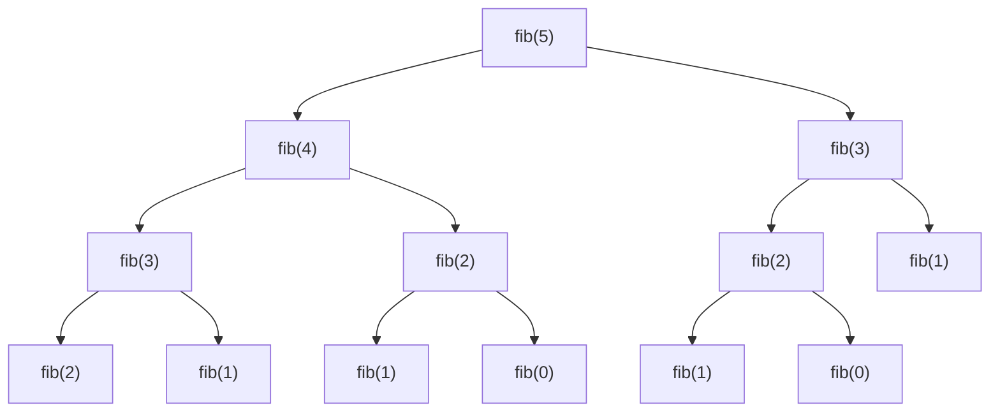
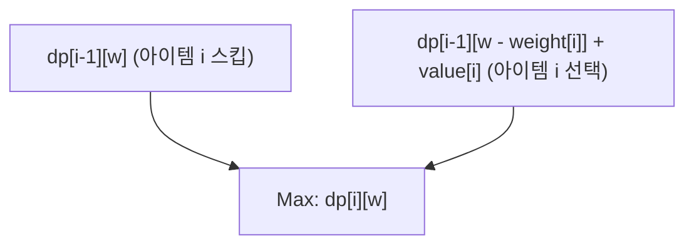
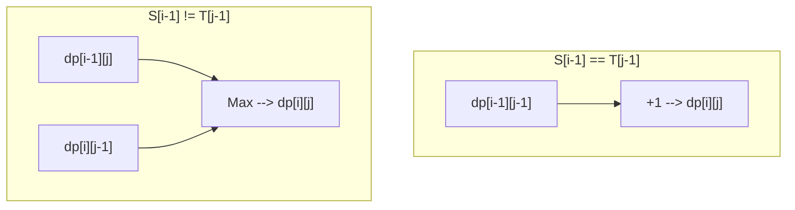

경쟁 프로그래밍부터 실무 알고리즘 설계까지 많은 상황에서 등장하며, 수많은 프로그래머에게 벽이 되는 것이 바로 **동적 계획법(Dynamic Programming, 통칭 DP)**입니다. "점화식을 세우지 못하겠다", "인덱스(첨자)에서 버그가 난다", "애초에 DP로 풀 수 있는 문제인지 판단하기 어렵다"…… 이런 고민을 안고 계신 분들이 많지 않을까요?

본 문서에서는 동적 계획법의 본질부터 구체적인 접근법(탑다운과 바텀업), 나아가 3가지 대표적인 문제(피보나치 수열, 0/1 배낭 문제, 최장 공통 부분 수열)를 통한 실전적인 해설까지 철저하게 망라합니다. C++과 Python 두 가지 모두의 구현 예시를 보여주고, 수식과 도해를 섞어가며 '완벽하게 마스터'하기 위한 길잡이를 제공합니다. 매우 분량이 긴 글이지만, 끝까지 다 읽고 났을 때 여러분의 알고리즘 실력은 확실히 비약적으로 발전해 있을 것입니다.

---

## 1. 동적 계획법(DP)이란 무엇인가?

동적 계획법(Dynamic Programming)은 복잡한 문제를 더 작은 '부분 문제'로 분할하고, 그 부분 문제들의 해를 기록 및 재사용함으로써 계산량을 극적으로 줄이는 알고리즘 설계 기법입니다.

1950년대에 리처드 벨만(Richard Bellman)이 고안한 이 기법은 최적화 문제에서 압도적인 위력을 발휘합니다. '동적(Dynamic)'이라는 단어에 특별한 의미가 있는 것은 아니며, 당시 연구 자금을 지원받기 위해 '어감이 좋은 단어'를 선택했다는 일화가 있지만, 현재는 컴퓨터 과학에서 가장 중요한 개념 중 하나로 확고한 입지를 구축하고 있습니다.

동적 계획법이 성립하기 위해서는 대상이 되는 문제가 다음의 **두 가지 중요한 성질**을 만족해야 합니다.

### 1-1. 부분 문제의 중복 (Overlapping Subproblems)

큰 문제를 푸는 과정에서 **동일한 부분 문제가 여러 번 반복해서 나타나는** 성질입니다.

예를 들어, 뒤에서 설명할 피보나치 수열의 계산에서는 '제3항을 구하는' 계산이 제5항을 구할 때도 제4항을 구할 때도 필요합니다. 부분 문제가 중복되지 않는 경우(예: 병합 정렬 등 분할 정복법)는 해를 기록해 두는 이점이 없기 때문에 DP 적용 대상이 아닙니다. 중복되기 때문에 한 번 계산한 결과를 메모리에 저장(메모이제이션 또는 표 작성)하고 재사용함으로써 극적인 속도 향상이 가능해지는 것입니다.

### 1-2. 최적 부분 구조 (Optimal Substructure)

**"문제 전체의 최적해가 그 부분 문제의 최적해로 구성된다"**는 성질입니다.

최단 경로 문제가 이해하기 쉬운 예입니다. 도시 A에서 도시 C로 가는 최단 경로가 도시 B를 경유하는 경우, '도시 A에서 도시 B까지의 경로' 또한 A에서 B로 가는 최단 경로여야만 합니다. 만약 A에서 B로 가는 경로가 최적(최단)이 아니라면, 이를 최적화함으로써 A에서 C로 가는 전체 경로도 더 짧게 만들 수 있을 것이기 때문입니다. 이처럼 부분적인 최적해를 조합하여 전체의 최적해를 도출해 낼 수 있는 성질이 동적 계획법에 의한 상태 전이의 기반이 됩니다.

---

## 2. 두 가지 접근법: 탑다운과 바텀업

동적 계획법의 구현에는 크게 나누어 '탑다운(메모이제이션 재귀)'과 '바텀업(표 작성)' 두 가지 접근법이 존재합니다. 각각의 특징을 깊이 이해하고 상황에 맞게 구분하여 사용할 수 있게 되는 것이 마스터를 위한 첫걸음입니다.

### 탑다운 방식 (메모이제이션 재귀 / Memoization)

큰 문제에서 출발하여 필요한 부분 문제를 재귀적으로 호출해서 풀어가는 접근법입니다. 이때, 한 번 계산한 부분 문제의 답을 배열이나 해시 맵에 '메모(저장)'해 두고, 다음번부터는 계산을 수행하지 않고 메모에서 결과를 반환하도록 합니다.

- **장점:** 
  - 자연스러운 사고 과정(점화식) 그대로 구현하기 쉽다.
  - 필요한 부분 문제만 계산되므로, 전체 상태 공간 중 일부만 접근될 때 유리하다.
- **단점:** 
  - 재귀 호출에 의한 함수 콜 오버헤드가 있다.
  - 재귀 깊이가 깊어지면 스택 오버플로의 위험이 있다(특히 Python 등의 언어에서는 주의가 필요).

### 바텀업 방식 (표 작성 / Tabulation)

가장 작은 부분 문제(기저 사례)부터 출발하여, 반복문을 통해 순서대로 더 큰 문제의 해를 표(배열)에 채워 나가는 접근법입니다. 최종적으로 구하고자 하는 전체 문제의 해가 표의 특정 위치에 저장됩니다.

- **장점:** 
  - 재귀에 의한 오버헤드가 없어 실행 속도가 빠르다.
  - 메모리 접근이 연속적이 되기 쉬워 캐시 효율(지역성)이 좋다.
  - 뒤에서 설명할 '공간 복잡도의 최적화(배열 재사용)'가 쉽다.
- **단점:** 
  - 모든 상태를 계산하기 때문에 결과적으로 불필요한 상태까지 계산해 버리는 경우가 있다.
  - 점화식의 의존 관계(위상 정렬 순서)를 정확히 파악하여 올바른 순서로 반복문을 실행해야 한다.

---

## 3. 실전편 1: 피보나치 수열

먼저 가장 기본적이고 이해하기 쉬운 예시로 피보나치 수열을 살펴보겠습니다.
피보나치 수열은 다음과 같이 정의됩니다.

$$
F(0) = 0, \quad F(1) = 1 \\
F(n) = F(n-1) + F(n-2) \quad (n \ge 2)
$$

### 3-1. 단순한 재귀 (계산량의 폭발)

이 정의대로 재귀 함수를 작성하면 어떻게 될까요?

```python
def fib_naive(n):
    if n <= 1:
        return n
    return fib_naive(n-1) + fib_naive(n-2)
```

이 구현은 직관적이지만, 계산량이 $O(2^n)$ 이라는 지수 함수적인 폭발을 일으킵니다. 동일한 인자에 대한 계산이 여러 번 반복되기 때문입니다. 다음은 $F(5)$ 를 구할 때의 재귀 트리입니다.



그림을 보면 `"fib(3)"` 이나 `"fib(2)"` 가 여러 번 평가되고 있는 것을 알 수 있습니다. 이것이 '부분 문제의 중복'입니다.

### 3-2. 탑다운 방식 (메모이제이션 재귀)

배열이나 딕셔너리를 사용하여 한 번 계산한 결과를 저장합니다. 이를 통해 계산량은 $O(n)$ 이 됩니다.

**Python 구현:**
```python
def fib_memo(n, memo=None):
    if memo is None:
        memo = {}
    if n in memo:
        return memo[n]
    if n <= 1:
        return n
    # 계산하여 메모에 저장
    memo[n] = fib_memo(n-1, memo) + fib_memo(n-2, memo)
    return memo[n]
```

**C++ 구현:**
```cpp
#include <iostream>
#include <vector>

std::vector<long long> memo;

long long fib_memo(int n) {
    if (n <= 1) return n;
    // 이미 계산되었다면 메모에서 반환
    if (memo[n] != -1) return memo[n];
    
    // 계산하여 메모에 저장
    return memo[n] = fib_memo(n - 1) + fib_memo(n - 2);
}

int main() {
    int n = 50;
    memo.assign(n + 1, -1);
    std::cout << fib_memo(n) << std::endl;
    return 0;
}
```

### 3-3. 바텀업 방식 (표 작성)

작은 것부터 순서대로 배열을 채워 나가는 접근법입니다. 스택 오버플로 걱정이 없으며, 매우 빠르게 동작합니다.

**Python 구현:**
```python
def fib_dp(n):
    if n <= 1:
        return n
    dp = [0] * (n + 1)
    dp[1] = 1
    for i in range(2, n + 1):
        dp[i] = dp[i-1] + dp[i-2]
    return dp[n]
```

**C++ 구현:**
```cpp
#include <iostream>
#include <vector>

long long fib_dp(int n) {
    if (n <= 1) return n;
    std::vector<long long> dp(n + 1, 0);
    dp[1] = 1;
    for (int i = 2; i <= n; ++i) {
        dp[i] = dp[i - 1] + dp[i - 2];
    }
    return dp[n];
}
```

### 3-4. 공간 복잡도 최적화

바텀업 방식을 잘 관찰해 보면, $dp[i]$ 를 계산하기 위해 필요한 것은 직전의 두 값, $dp[i-1]$ 과 $dp[i-2]$ 뿐이며, 그 이전의 값은 필요하지 않습니다. 따라서 배열 전체를 유지할 필요 없이 변수 2개만으로 계산을 진행할 수 있습니다. 이를 통해 공간 복잡도를 $O(n)$ 에서 $O(1)$ 로 줄일 수 있습니다.

**Python 구현:**
```python
def fib_optimized(n):
    if n <= 1:
        return n
    prev2, prev1 = 0, 1
    for i in range(2, n + 1):
        current = prev1 + prev2
        prev2 = prev1
        prev1 = current
    return current
```

---

## 4. 실전편 2: 0/1 배낭 문제 (0/1 Knapsack Problem)

다음은 드디어 본격적인 최적화 문제 다루기입니다. 0/1 배낭 문제는 동적 계획법의 등용문으로 알려져 있습니다.

### 4-1. 문제 설정

용량이 $W$ 인 배낭이 있습니다. 그리고 $n$ 개의 물건이 있으며, 각 물건 $i$ ($1 \le i \le n$) 에는 무게 $weight[i]$ 와 가치 $value[i]$ 가 정해져 있습니다.
배낭의 용량을 초과하지 않도록 물건을 선택했을 때, 얻을 수 있는 가치 총합의 최댓값은 얼마일까요?
(※ '0/1'은 각 물건에 대해 '선택하지 않는다(0)' 혹은 '선택한다(1)'의 두 가지 선택지뿐임을 의미합니다. 물건을 쪼갤 수는 없습니다.)

### 4-2. 상태 정의와 상태 전이 방정식

DP로 문제를 풀기 위한 가장 중요한 단계는 '상태(State)'를 적절히 정의하는 것입니다.
이 문제에서는 두 가지 파라미터가 변해갑니다. '어떤 물건까지 고려했는가'와 '배낭의 남은 용량'입니다. 그래서 다음과 같이 상태를 정의합니다.

**상태 정의:**
$dp[i][w]$ := 처음부터 $i$ 번째 물건까지만을 사용하여, 무게의 합이 $w$ 이하가 되도록 선택했을 때 가치 총합의 최댓값.

다음으로, 이 상태가 어떻게 변해가는지(전이)를 생각해 봅시다. $i$ 번째 물건을 고려할 때, 선택지는 2가지입니다.
1. **$i$ 번째 물건을 선택하지 않는 경우:** 
   최대 가치는 $i-1$ 번째 물건까지로 용량 $w$ 를 채운 최대 가치와 동일합니다.
   즉, $dp[i-1][w]$
2. **$i$ 번째 물건을 선택하는 경우:** 
   이 물건의 무게는 $weight[i]$ 이므로 배낭에는 적어도 $weight[i]$ 이상의 빈 공간이 필요합니다($w \ge weight[i]$). 선택한 경우 얻는 가치는 $value[i]$ 만큼 늘어나지만, 사용할 수 있는 용량은 $weight[i]$ 만큼 줄어듭니다. 따라서 남은 용량 $w - weight[i]$ 에 대해 $i-1$ 번째 물건까지로 얻을 수 있는 최대 가치에 $value[i]$ 를 더한 값이 됩니다.
   즉, $dp[i-1][w - weight[i]] + value[i]$

이 두 가지 선택지 중 가치가 더 커지는 쪽($\max$)을 선택하면 되므로, **상태 전이 방정식**은 다음과 같이 도출됩니다.

$$
dp[i][w] = 
\begin{cases} 
dp[i-1][w] & \text{if } w < weight[i] \\
\max(dp[i-1][w], dp[i-1][w - weight[i]] + value[i]) & \text{if } w \ge weight[i]
\end{cases}
$$

**기저 사례 (초기 조건):**
물건이 0개일 때($i=0$), 혹은 용량이 0일 때($w=0$), 가치의 최댓값은 0입니다.
$$ dp[0][w] = 0, \quad dp[i][0] = 0 $$

다음 Mermaid 다이어그램은 상태 전이의 개념을 시각화한 것입니다.



### 4-3. 바텀업 구현 (2차원 배열)

이 수식을 그대로 코드로 옮겨보겠습니다.

**C++ 구현:**
```cpp
#include <iostream>
#include <vector>
#include <algorithm>

int knapsack(int W, const std::vector<int>& weight, const std::vector<int>& value) {
    int n = weight.size();
    // dp[n+1][W+1] 크기의 2차원 배열을 0으로 초기화
    std::vector<std::vector<int>> dp(n + 1, std::vector<int>(W + 1, 0));

    // 물건을 하나씩 추가하며 고려
    for (int i = 1; i <= n; ++i) {
        // 모든 용량 패턴에 대해 계산
        for (int w = 0; w <= W; ++w) {
            if (w < weight[i - 1]) {
                // 용량 부족으로 선택할 수 없는 경우
                dp[i][w] = dp[i - 1][w];
            } else {
                // 선택하지 않는 경우와 선택하는 경우 중 더 큰 값을 채택
                dp[i][w] = std::max(dp[i - 1][w], dp[i - 1][w - weight[i - 1]] + value[i - 1]);
            }
        }
    }
    
    return dp[n][W];
}

int main() {
    int W = 50;
    std::vector<int> weight = {10, 20, 30};
    std::vector<int> value = {60, 100, 120};
    std::cout << "Max Value: " << knapsack(W, weight, value) << std::endl;
    return 0;
}
```
*(※ C++에서는 배열의 인덱스가 0부터 시작하기 때문에, `weight[i-1]` 로 접근하고 있다는 점에 주의해 주세요.)*

### 4-4. 공간 복잡도 최적화 (1차원 배열화)

2차원 배열 $dp[i][w]$ 를 갱신할 때, 항상 직전 행인 $dp[i-1]$ 만을 참조한다는 사실을 알 수 있습니다. 이것은 피보나치 수열의 공간 복잡도 최적화와 동일한 원리입니다.
따라서 배열을 1차원 $dp[w]$ 로 압축할 수 있습니다. 단, 갱신할 때 주의가 필요합니다. 용량 $w$ 를 **큰 쪽에서 작은 쪽으로(뒤에서 앞으로)** 반복문을 돌려야 합니다. 앞에서부터 갱신해 버리면 '$i-1$ 번째 상태'가 아니라 같은 단계 내에서 방금 갱신된 '$i$ 번째 상태'를 참조하게 되어, 같은 물건을 여러 번 선택하는 셈이 되기 때문입니다(이것은 '개수 제한이 없는 배낭 문제'의 해법이 되어 버립니다).

**Python 구현 (1차원화):**
```python
def knapsack_1d(W, weight, value):
    n = len(weight)
    dp = [0] * (W + 1)
    
    for i in range(n):
        # W부터 역순으로 반복문을 돈다
        for w in range(W, weight[i] - 1, -1):
            dp[w] = max(dp[w], dp[w - weight[i]] + value[i])
            
    return dp[W]

W = 50
weight = [10, 20, 30]
value = [60, 100, 120]
print("Max Value:", knapsack_1d(W, weight, value))
```
이를 통해 공간 복잡도가 $O(nW)$ 에서 $O(W)$ 로 극적으로 개선됩니다. 실무나 경쟁 프로그래밍에서 필수적인 테크닉입니다.

---

## 5. 실전편 3: 최장 공통 부분 수열 (LCS: Longest Common Subsequence)

문자열을 다루는 대표적인 DP 문제로서 LCS를 살펴보겠습니다. LCS는 파일의 차이점 검출(diff 도구)이나 DNA 서열의 유사도 판정 등 실생활에서 널리 응용되고 있는 알고리즘입니다.

### 5-1. 문제 설정

두 문자열 $S$ 와 $T$ 가 주어집니다. 양쪽의 부분 수열(원래 문자열에서 순서를 유지한 채 0개 이상의 문자를 삭제하여 만든 문자열)로서 공통되는 것 중 가장 긴 것의 길이를 구하세요.

예: $S = \text{"ABCBDAB"}$, $T = \text{"BDCABA"}$ 일 때, LCS는 $\text{"BCBA"}$ 나 $\text{"BDAB"}$ 등이며 그 길이는 4입니다.

### 5-2. 상태 정의와 상태 전이 방정식

문자열의 길이를 각각 $m, n$ 이라고 합니다. 이 경우에도 두 문자열에 대한 접두사(처음부터 시작하는 부분 문자열)의 길이를 상태로 둡니다.

**상태 정의:**
$dp[i][j]$ := 문자열 $S$ 의 처음 $i$ 글자와 문자열 $T$ 의 처음 $j$ 글자 사이의 최장 공통 부분 수열(LCS)의 길이.

문자열의 마지막 글자인 $S[i-1]$ 과 $T[j-1]$ 에 주목하여 전이를 생각해 봅니다.
1. **$S[i-1] == T[j-1]$ 인 경우:** 
   마지막 글자가 일치하므로 이 문자는 반드시 LCS에 포함됩니다. 따라서 각각의 문자열을 한 글자씩 짧게 한 상태의 LCS 길이에 1을 더한 값이 됩니다.
   $dp[i][j] = dp[i-1][j-1] + 1$
2. **$S[i-1] \neq T[j-1]$ 인 경우:** 
   마지막 글자가 다르기 때문에 적어도 어느 한쪽은 LCS에 포함되지 않습니다. $S$ 를 한 글자 줄인 경우($dp[i-1][j]$)와 $T$ 를 한 글자 줄인 경우($dp[i][j-1]$) 중 더 긴 쪽을 채택합니다.
   $dp[i][j] = \max(dp[i-1][j], dp[i][j-1])$

정리하면 다음과 같은 상태 전이 방정식이 도출됩니다.

$$
dp[i][j] = 
\begin{cases} 
0 & \text{if } i = 0 \text{ or } j = 0 \\
dp[i-1][j-1] + 1 & \text{if } i > 0, j > 0 \text{ and } S[i-1] = T[j-1] \\
\max(dp[i-1][j], dp[i][j-1]) & \text{if } i > 0, j > 0 \text{ and } S[i-1] \neq T[j-1]
\end{cases}
$$

이 전이를 Mermaid로 표현하면 다음과 같습니다.



### 5-3. 바텀업 구현

이 역시 2차원 배열을 사용하여 심플하게 구현할 수 있습니다.

**Python 구현:**
```python
def longest_common_subsequence(text1: str, text2: str) -> int:
    m, n = len(text1), len(text2)
    # m+1행 n+1열을 0으로 채운 2차원 배열
    dp = [[0] * (n + 1) for _ in range(m + 1)]
    
    for i in range(1, m + 1):
        for j in range(1, n + 1):
            if text1[i-1] == text2[j-1]:
                dp[i][j] = dp[i-1][j-1] + 1
            else:
                dp[i][j] = max(dp[i-1][j], dp[i][j-1])
                
    return dp[m][n]

S = "ABCBDAB"
T = "BDCABA"
print("LCS Length:", longest_common_subsequence(S, T))
```

**C++ 구현:**
```cpp
#include <iostream>
#include <vector>
#include <string>
#include <algorithm>

int longest_common_subsequence(const std::string& text1, const std::string& text2) {
    int m = text1.size();
    int n = text2.size();
    std::vector<std::vector<int>> dp(m + 1, std::vector<int>(n + 1, 0));
    
    for (int i = 1; i <= m; ++i) {
        for (int j = 1; j <= n; ++j) {
            if (text1[i-1] == text2[j-1]) {
                dp[i][j] = dp[i-1][j-1] + 1;
            } else {
                dp[i][j] = std::max(dp[i-1][j], dp[i][j-1]);
            }
        }
    }
    
    return dp[m][n];
}

int main() {
    std::string S = "ABCBDAB";
    std::string T = "BDCABA";
    std::cout << "LCS Length: " << longest_common_subsequence(S, T) << std::endl;
    return 0;
}
```

LCS 문제에서도 갱신에는 직전 행(`dp[i-1]`)과 현재 행(`dp[i]`)만 사용하므로, 두 행 분량(요소 수 $2n$)의 배열만 있으면 계산이 가능합니다. 이를 '롤링 배열(Rolling Array)'이라고 부릅니다. 공간 복잡도를 획기적으로 줄이는 기법으로서 매우 유용합니다.

---

## 6. 동적 계획법을 마스터하기 위한 사고 과정

지금까지 여러 문제를 살펴보았는데, 미지의 DP 문제에 직면했을 때 어떻게 생각하면 좋을까요? 다음 단계들을 항상 의식해 보세요.

1. **이 문제는 DP로 풀 수 있는가? (조건 확인)**
   재귀적으로 생각했을 때 같은 상태가 여러 번 나타나는지(부분 문제의 중복). 최선의 선택을 결합함으로써 전체의 최선을 이끌어낼 수 있는지(최적 부분 구조).
2. **상태(State)를 정의한다**
   '지금 어디에 있는지', '무엇이 남아 있는지', '지금까지의 제약은 무엇인지'를 나타내는 변수를 특정합니다. 인덱스(첨자)의 의미를 명확하게 언어화하는 것이 버그를 막는 최대의 방어책입니다.
3. **상태 전이 방정식(Transition)을 생각한다**
   어떤 상태에서 다음 상태로 어떻게 이동할 것인가. 선택지는 무엇인가. 그 안에서 최댓값(또는 최솟값)을 취할 정할 것인가, 합산할 것인가. 이 부분이 알고리즘의 심장부입니다.
4. **초기 조건(Base Case)을 설정한다**
   배열의 초깃값이나 계산의 출발점을 정합니다. 물건 0개, 길이가 0인 문자열 등 자명한 답이 존재하는 엣지 케이스를 올바르게 처리합니다.
5. **계산 순서(Topological Order)를 확인한다**
   바텀업으로 구현할 경우, 전이 목적지 상태를 계산하기 전에 전이 출발지 상태가 모두 계산되어 있어야 합니다. 반복문의 방향에 세심한 주의를 기울이세요.

## 7. 요약 (정리)

본 문서에서는 동적 계획법의 기초 이론부터 구체적인 구현 접근법, 나아가 대표적인 최적화 문제에 이르기까지 상세하게 해설했습니다.
- 동적 계획법이란 재귀적인 관계를 이용하여 부분 문제의 해를 재사용하는 기법입니다.
- **탑다운(메모이제이션)**은 구현이 직관적이고, **바텀업(표 작성)**은 상수 시간이 가볍고 메모리 최적화를 하기 쉽다는 특징이 있습니다.
- 수식(상태 전이 방정식)을 올바르게 세울 수 있다면 구현은 매우 단순해집니다.
- 공간 복잡도 절감 테크닉(배열의 1차원화나 롤링 배열)은 실무 수준에서 성능이 요구될 때 필수적입니다.

동적 계획법은 처음에는 난해하게 느껴질지도 모릅니다. 하지만 다양한 문제에서 '상태 정의'와 '전이'를 찾아내는 훈련을 반복함으로써 점차 패턴이 보이게 될 것입니다. 트리 DP, 자릿수 DP, 비트 DP, 구간 DP 등 더욱 고도화된 응용도 있지만, 그 모든 것이 이번에 배운 '부분 문제의 중복'과 '최적화'라는 기반 위에 성립되어 있습니다.

조급해하지 말고 종이와 펜으로 DP 테이블(표)을 직접 그려가며 이해를 넓혀 가시길 바랍니다. 알고리즘의 진정한 힘을 끌어낼 수 있게 되었을 때 프로그래밍의 세계는 한층 더 넓어질 것입니다.
