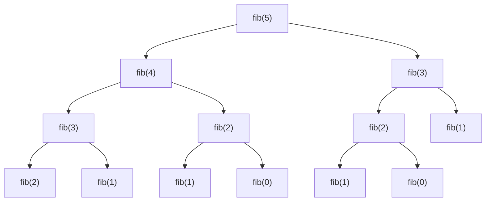
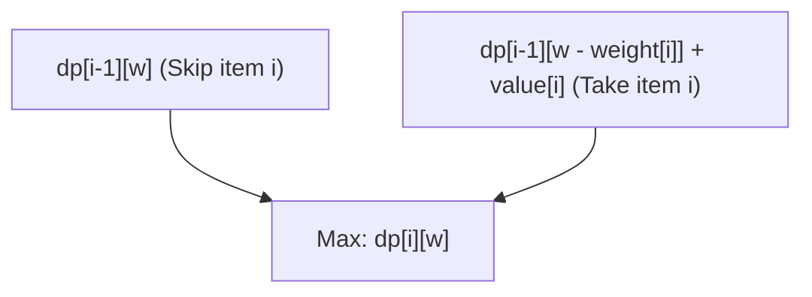
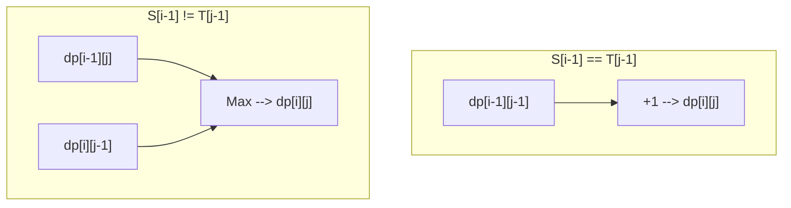

競技プログラミングから実務のアルゴリズム設計まで、多くの場面で登場し、そして多くのプログラマの壁となるのが**動的計画法（Dynamic Programming, 通称 DP）**です。「漸化式が立てられない」「添字がバグる」「そもそもDPで解ける問題なのか判断できない」……そんな悩みを抱えている方は多いのではないでしょうか。

本記事では、動的計画法の本質から、具体的なアプローチ（トップダウンとボトムアップ）、さらに3つの代表的な問題（フィボナッチ数列、0/1ナップサック問題、最長共通部分列）を通じた実践的な解説まで、徹底的に網羅します。C++とPythonの両方で実装例を示し、数式と図解を交えながら「完全にマスター」するための道筋を提供します。非常に長大な記事になりますが、最後まで読み終えたとき、あなたのアルゴリズム力は確実に飛躍しているはずです。

---

## 1. 動的計画法（DP）とは何か？

動的計画法（Dynamic Programming）は、複雑な問題をより小さな「部分問題」に分割し、それらの部分問題の解を記録・再利用することで、計算量を劇的に削減するアルゴリズムの設計手法です。

1950年代にリチャード・ベルマン（Richard Bellman）によって考案されたこの手法は、最適化問題において圧倒的な威力を発揮します。「動的（Dynamic）」という言葉に特別な意味があるわけではなく、当時は研究資金を獲得するために「響きの良い言葉」を選んだという逸話がありますが、現在では計算機科学において最も重要な概念の一つとして確固たる地位を築いています。

動的計画法が成立するためには、対象となる問題が以下の**2つの重要な性質**を満たしている必要があります。

### 1-1. 部分問題の重複 (Overlapping Subproblems)

大きな問題を解く過程で、**同じ部分問題が何度も繰り返し現れる**という性質です。

たとえば、後述するフィボナッチ数列の計算では、「第3項を求める」という計算が、第5項を求める際にも第4項を求める際にも必要になります。部分問題が重複しない場合（例：マージソートなどの分割統治法）は、解を記録しておくメリットがないため、DPの適用対象とはなりません。重複するからこそ、一度計算した結果をメモリに保存（メモ化または表作成）し、再利用することで劇的な高速化が可能になるのです。

### 1-2. 部分構造最適性 (Optimal Substructure)

**「問題全体の最適解が、その部分問題の最適解から構成される」**という性質です。

最短経路問題がわかりやすい例です。都市Aから都市Cへの最短経路が都市Bを経由する場合、「都市Aから都市Bまでの経路」もまた、AからBへの最短経路になっていなければなりません。もしAからBへの経路が最適（最短）でなければ、それを最適化することでAからCへの経路全体もさらに短くできるはずだからです。このように、部分的な最適解を組み合わせて全体の最適解を導き出せる性質が、動的計画法による状態遷移の基盤となります。

---

## 2. 2つのアプローチ：トップダウンとボトムアップ

動的計画法の実装には、大きく分けて「トップダウン（メモ化再帰）」と「ボトムアップ（表作成）」の2つのアプローチが存在します。それぞれの特徴を深く理解し、状況に応じて使い分けられるようになることがマスターへの第一歩です。

### トップダウン方式（メモ化再帰 / Memoization）

大きな問題から出発し、必要な部分問題を再帰的に呼び出して解いていくアプローチです。このとき、一度計算した部分問題の答えを配列やハッシュマップに「メモ（保存）」しておき、次回以降は計算を行わずにメモから結果を返すようにします。

- **メリット:** 
  - 自然な思考プロセス（漸化式）のまま実装しやすい。
  - 必要な部分問題のみが計算されるため、状態空間全体のうち一部しかアクセスされない場合に有利。
- **デメリット:** 
  - 再帰呼び出しによる関数コールのオーバーヘッドがある。
  - 再帰の深さが大きくなるとスタックオーバーフローのリスクがある（特にPythonなどの言語では注意が必要）。

### ボトムアップ方式（表作成 / Tabulation）

最も小さな部分問題（ベースケース）から出発し、ループ処理によって順に大きな問題の解を表（配列）に埋めていくアプローチです。最終的に、求めたい全体問題の解が表の特定の場所に格納されます。

- **メリット:** 
  - 再帰によるオーバーヘッドがなく、実行速度が速い。
  - メモリアクセスが連続的になりやすく、キャッシュ効率（局所性）が良い。
  - 後述する「空間計算量の最適化（配列の使い回し）」が容易。
- **デメリット:** 
  - 全ての状態を計算するため、結果的に不要な状態まで計算してしまうことがある。
  - 漸化式の依存関係（トポロジカル順序）を正確に把握し、正しい順序でループを回す必要がある。

---

## 3. 実践編1：フィボナッチ数列

まずは最も基本的でわかりやすい例として、フィボナッチ数列を取り上げます。
フィボナッチ数列は次のように定義されます：

$$
F(0) = 0, \quad F(1) = 1 \\
F(n) = F(n-1) + F(n-2) \quad (n \ge 2)
$$

### 3-1. 単純な再帰（計算量の爆発）

この定義通りに再帰関数を書くとどうなるでしょうか。

```python
def fib_naive(n):
    if n <= 1:
        return n
    return fib_naive(n-1) + fib_naive(n-2)
```

この実装は直感的ですが、計算量が $O(2^n)$ という指数関数的な爆発を起こします。なぜなら、同じ引数に対する計算が何度も繰り返されるからです。以下は $F(5)$ を求める際の再帰ツリーです。



図を見ると、`"fib(3)"` や `"fib(2)"` が複数回評価されていることがわかります。これが「部分問題の重複」です。

### 3-2. トップダウン方式（メモ化再帰）

配列や辞書を使って、一度計算した結果を保存します。これにより計算量は $O(n)$ になります。

**Python実装:**
```python
def fib_memo(n, memo=None):
    if memo is None:
        memo = {}
    if n in memo:
        return memo[n]
    if n <= 1:
        return n
    # 計算してメモに保存
    memo[n] = fib_memo(n-1, memo) + fib_memo(n-2, memo)
    return memo[n]
```

**C++実装:**
```cpp
#include <iostream>
#include <vector>

std::vector<long long> memo;

long long fib_memo(int n) {
    if (n <= 1) return n;
    // 既に計算済みならメモから返す
    if (memo[n] != -1) return memo[n];
    
    // 計算してメモに保存
    return memo[n] = fib_memo(n - 1) + fib_memo(n - 2);
}

int main() {
    int n = 50;
    memo.assign(n + 1, -1);
    std::cout << fib_memo(n) << std::endl;
    return 0;
}
```

### 3-3. ボトムアップ方式（表作成）

小さい方から順番に配列を埋めていくアプローチです。スタックオーバーフローの心配がなく、極めて高速に動作します。

**Python実装:**
```python
def fib_dp(n):
    if n <= 1:
        return n
    dp = [0] * (n + 1)
    dp[1] = 1
    for i in range(2, n + 1):
        dp[i] = dp[i-1] + dp[i-2]
    return dp[n]
```

**C++実装:**
```cpp
#include <iostream>
#include <vector>

long long fib_dp(int n) {
    if (n <= 1) return n;
    std::vector<long long> dp(n + 1, 0);
    dp[1] = 1;
    for (int i = 2; i <= n; ++i) {
        dp[i] = dp[i - 1] + dp[i - 2];
    }
    return dp[n];
}
```

### 3-4. 空間計算量の最適化

ボトムアップ方式をよく観察すると、$dp[i]$ を計算するために必要なのは直近の2つの値、$dp[i-1]$ と $dp[i-2]$ だけであり、それ以前の値は必要ありません。したがって、配列全体を保持する必要はなく、変数2つだけで計算を進めることができます。これにより、空間計算量を $O(n)$ から $O(1)$ に削減できます。

**Python実装:**
```python
def fib_optimized(n):
    if n <= 1:
        return n
    prev2, prev1 = 0, 1
    for i in range(2, n + 1):
        current = prev1 + prev2
        prev2 = prev1
        prev1 = current
    return current
```

---

## 4. 実践編2：0/1ナップサック問題（0/1 Knapsack Problem）

次はいよいよ本格的な最適化問題です。0/1ナップサック問題は、動的計画法の登竜門として知られています。

### 4-1. 問題設定

容量 $W$ のナップサックがあります。また、$n$ 個の品物があり、各品物 $i$ ($1 \le i \le n$) には重さ $weight[i]$ と価値 $value[i]$ が決まっています。
ナップサックの容量を超えないように品物を選んだとき、得られる価値の合計の最大値はいくつになるでしょうか？
（※「0/1」は、各品物について「選ばない(0)」か「選ぶ(1)」の2択であることを意味します。品物を分割することはできません。）

### 4-2. 状態の定義と状態遷移方程式

DPを解くための最重要ステップは「状態（State）」を適切に定義することです。
この問題では、2つのパラメータが変わっていきます。「どの品物まで考慮したか」と「ナップサックの残り容量」です。そこで、以下のように状態を定義します。

**状態定義:**
$dp[i][w]$ := 最初から $i$ 番目までの品物だけを使って、重さの合計が $w$ 以下となるように選んだときの、価値の合計の最大値。

次に、この状態がどのように変化していくか（遷移）を考えます。$i$ 番目の品物を考えるとき、選択肢は2つです。
1. **$i$ 番目の品物を選ばない場合:** 
   最大価値は、$i-1$ 番目までの品物で容量 $w$ を満たす最大価値と同じです。
   すなわち、$dp[i-1][w]$
2. **$i$ 番目の品物を選ぶ場合:** 
   この品物の重さは $weight[i]$ ですから、ナップサックには少なくとも $weight[i]$ 以上の空き容量が必要です（$w \ge weight[i]$）。選んだ場合、得られる価値は $value[i]$ 増えますが、使える容量は $weight[i]$ だけ減ります。したがって、残りの容量 $w - weight[i]$ に対して $i-1$ 番目までの品物で得られる最大価値に $value[i]$ を足したものになります。
   すなわち、$dp[i-1][w - weight[i]] + value[i]$

この2つの選択肢のうち、価値が大きくなる方（$\max$）を選べばよいので、**状態遷移方程式**は以下のようになります。

$$
dp[i][w] = 
\begin{cases} 
dp[i-1][w] & \text{if } w < weight[i] \\
\max(dp[i-1][w], dp[i-1][w - weight[i]] + value[i]) & \text{if } w \ge weight[i]
\end{cases}
$$

**ベースケース（初期条件）:**
品物が0個のとき（$i=0$）、あるいは容量が0のとき（$w=0$）、価値の最大値は0です。
$$ dp[0][w] = 0, \quad dp[i][0] = 0 $$

以下のMermaid図は、状態遷移の概念を視覚化したものです。



### 4-3. ボトムアップ実装（2次元配列）

この数式をそのままコードに落とし込みます。

**C++実装:**
```cpp
#include <iostream>
#include <vector>
#include <algorithm>

int knapsack(int W, const std::vector<int>& weight, const std::vector<int>& value) {
    int n = weight.size();
    // dp[n+1][W+1] の2次元配列を0で初期化
    std::vector<std::vector<int>> dp(n + 1, std::vector<int>(W + 1, 0));

    // 品物を1つずつ追加して考える
    for (int i = 1; i <= n; ++i) {
        // 全ての容量のパターンについて計算
        for (int w = 0; w <= W; ++w) {
            if (w < weight[i - 1]) {
                // 容量不足で選べない場合
                dp[i][w] = dp[i - 1][w];
            } else {
                // 選ばない場合と選ぶ場合で大きい方を採用
                dp[i][w] = std::max(dp[i - 1][w], dp[i - 1][w - weight[i - 1]] + value[i - 1]);
            }
        }
    }
    
    return dp[n][W];
}

int main() {
    int W = 50;
    std::vector<int> weight = {10, 20, 30};
    std::vector<int> value = {60, 100, 120};
    std::cout << "Max Value: " << knapsack(W, weight, value) << std::endl;
    return 0;
}
```
*(※C++では配列のインデックスが0から始まるため、`weight[i-1]` としている点に注意してください。)*

### 4-4. 空間計算量の最適化（1次元配列化）

2次元配列 $dp[i][w]$ を更新する際、常に直前の行 $dp[i-1]$ しか参照していないことに気づきます。これはフィボナッチ数列の空間最適化と同じ原理です。
したがって、配列を1次元 $dp[w]$ に圧縮できます。ただし、更新時に注意が必要です。容量 $w$ を **大きい方から小さい方へ（後ろから前へ）** ループさせる必要があります。前から更新してしまうと、「$i-1$ 番目の状態」ではなく、同じステップ内で更新されたばかりの「$i$ 番目の状態」を参照してしまい、同じ品物を複数回選ぶことになってしまうからです（これは「個数制限なしナップサック問題」の解法になってしまいます）。

**Python実装（1次元化）:**
```python
def knapsack_1d(W, weight, value):
    n = len(weight)
    dp = [0] * (W + 1)
    
    for i in range(n):
        # Wから後ろ向きにループする
        for w in range(W, weight[i] - 1, -1):
            dp[w] = max(dp[w], dp[w - weight[i]] + value[i])
            
    return dp[W]

W = 50
weight = [10, 20, 30]
value = [60, 100, 120]
print("Max Value:", knapsack_1d(W, weight, value))
```
これにより、空間計算量が $O(nW)$ から $O(W)$ へと劇的に改善されます。実務や競技プログラミングにおいて必須のテクニックです。

---

## 5. 実践編3：最長共通部分列（LCS: Longest Common Subsequence）

文字列を扱う代表的なDP問題として、LCSを取り上げます。LCSは、ファイルの差分検出（diffツール）やDNA配列の類似度判定など、実社会で広く応用されているアルゴリズムです。

### 5-1. 問題設定

2つの文字列 $S$ と $T$ が与えられます。双方の部分列（元の文字列から順番を保ったまま0個以上の文字を削除してできる文字列）として共通するもののうち、最も長いものの長さを求めてください。

例：$S = \text{"ABCBDAB"}$, $T = \text{"BDCABA"}$ のとき、LCSは $\text{"BCBA"}$ や $\text{"BDAB"}$ などであり、その長さは 4 です。

### 5-2. 状態の定義と状態遷移方程式

文字列の長さをそれぞれ $m, n$ とします。この場合も2つの文字列に対するプレフィックス（先頭からの部分文字列）の長さを状態とします。

**状態定義:**
$dp[i][j]$ := 文字列 $S$ の先頭 $i$ 文字と、文字列 $T$ の先頭 $j$ 文字の間の最長共通部分列（LCS）の長さ。

文字列の最後の文字 $S[i-1]$ と $T[j-1]$ に注目して遷移を考えます。
1. **$S[i-1] == T[j-1]$ の場合:** 
   最後の文字が一致しているため、この文字は必ずLCSに含まれます。したがって、それぞれの文字列を1文字短くした状態のLCSに 1 を足したものになります。
   $dp[i][j] = dp[i-1][j-1] + 1$
2. **$S[i-1] \neq T[j-1]$ の場合:** 
   最後の文字が異なるため、少なくともどちらか一方はLCSに含まれません。$S$ を1文字減らした場合（$dp[i-1][j]$）と、$T$ を1文字減らした場合（$dp[i][j-1]$）のうち、より長い方を採用します。
   $dp[i][j] = \max(dp[i-1][j], dp[i][j-1])$

まとめると以下の状態遷移方程式になります。

$$
dp[i][j] = 
\begin{cases} 
0 & \text{if } i = 0 \text{ or } j = 0 \\
dp[i-1][j-1] + 1 & \text{if } i > 0, j > 0 \text{ and } S[i-1] = T[j-1] \\
\max(dp[i-1][j], dp[i][j-1]) & \text{if } i > 0, j > 0 \text{ and } S[i-1] \neq T[j-1]
\end{cases}
$$

この遷移をMermaidで表現すると以下のようになります。



### 5-3. ボトムアップ実装

これも2次元配列を用いてシンプルに実装できます。

**Python実装:**
```python
def longest_common_subsequence(text1: str, text2: str) -> int:
    m, n = len(text1), len(text2)
    # m+1行 n+1列の0埋め2次元配列
    dp = [[0] * (n + 1) for _ in range(m + 1)]
    
    for i in range(1, m + 1):
        for j in range(1, n + 1):
            if text1[i-1] == text2[j-1]:
                dp[i][j] = dp[i-1][j-1] + 1
            else:
                dp[i][j] = max(dp[i-1][j], dp[i][j-1])
                
    return dp[m][n]

S = "ABCBDAB"
T = "BDCABA"
print("LCS Length:", longest_common_subsequence(S, T))
```

**C++実装:**
```cpp
#include <iostream>
#include <vector>
#include <string>
#include <algorithm>

int longest_common_subsequence(const std::string& text1, const std::string& text2) {
    int m = text1.size();
    int n = text2.size();
    std::vector<std::vector<int>> dp(m + 1, std::vector<int>(n + 1, 0));
    
    for (int i = 1; i <= m; ++i) {
        for (int j = 1; j <= n; ++j) {
            if (text1[i-1] == text2[j-1]) {
                dp[i][j] = dp[i-1][j-1] + 1;
            } else {
                dp[i][j] = std::max(dp[i-1][j], dp[i][j-1]);
            }
        }
    }
    
    return dp[m][n];
}

int main() {
    std::string S = "ABCBDAB";
    std::string T = "BDCABA";
    std::cout << "LCS Length: " << longest_common_subsequence(S, T) << std::endl;
    return 0;
}
```

LCS問題でも、更新には直前の行（`dp[i-1]`）と現在の行（`dp[i]`）しか使用しないため、2行分（要素数 $2n$）の配列があれば計算可能です。これを「ローリング配列（Rolling Array）」と呼びます。空間計算量を劇的に減らす手法として極めて有用です。

---

## 6. 動的計画法をマスターするための思考プロセス

ここまで様々な問題を見てきましたが、未知のDP問題に直面したとき、どのように考えればよいのでしょうか？以下のステップを常に意識してください。

1. **この問題はDPで解けるか？（条件の確認）**
   再帰的に考えたとき、同じ状態が何度も現れるか（部分問題の重複）。最善の選択を組み合わせることで全体の最善が導けるか（部分構造最適性）。
2. **状態（State）を定義する**
   「今どこにいるか」「何が残っているか」「これまでの制約は何か」を表す変数を特定します。添字の意味を明確に言語化することが、バグを防ぐ最大の防御策です。
3. **状態遷移方程式（Transition）を考える**
   ある状態から次の状態へどのように移動するか。選択肢は何か。その中で最大（または最小）をとるのか、足し合わせるのか。ここがアルゴリズムの心臓部です。
4. **初期条件（Base Case）を設定する**
   配列の初期値や、計算の出発点を決めます。0個の品物、長さ0の文字列など、自明な答えが存在するエッジケースを正しく処理します。
5. **計算の順番（Topological Order）を確認する**
   ボトムアップで実装する場合、遷移先の状態を計算する前に、遷移元の状態が全て計算済みである必要があります。ループの向きに細心の注意を払いましょう。

## 7. まとめ

本記事では、動的計画法の基礎理論から、具体的な実装アプローチ、さらには代表的な最適化問題に至るまで、詳細に解説しました。
- 動的計画法とは、再帰的な関係を利用して部分問題の解を再利用する手法です。
- **トップダウン（メモ化）**は実装が直感的であり、**ボトムアップ（表作成）**は定数倍が軽くメモリ最適化がしやすいという特徴があります。
- 数式（状態遷移方程式）を正しく立てることができれば、実装は非常にシンプルになります。
- 空間計算量の削減テクニック（配列の1次元化やローリング配列）は、実務レベルでパフォーマンスを要求される際に不可欠です。

動的計画法は、最初は難解に感じるかもしれません。しかし、様々な問題で「状態定義」と「遷移」を見つける訓練を繰り返すことで、徐々にパターンが見えてくるようになります。木DP、桁DP、ビットDP、区間DPなど、より高度な応用もありますが、その全てが今回学んだ「部分問題の重複」と「最適化」の基盤の上に成り立っています。

焦らず、紙とペンでDPテーブル（表）を実際に書き出しながら理解を深めていってください。アルゴリズムの真の力を引き出せるようになったとき、プログラミングの世界はさらに広がることでしょう。
