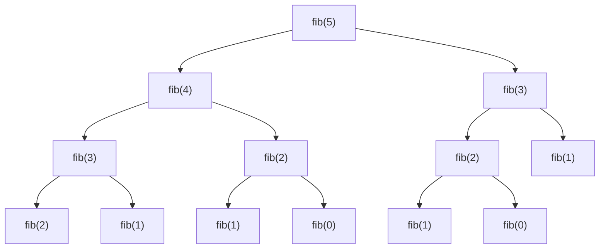
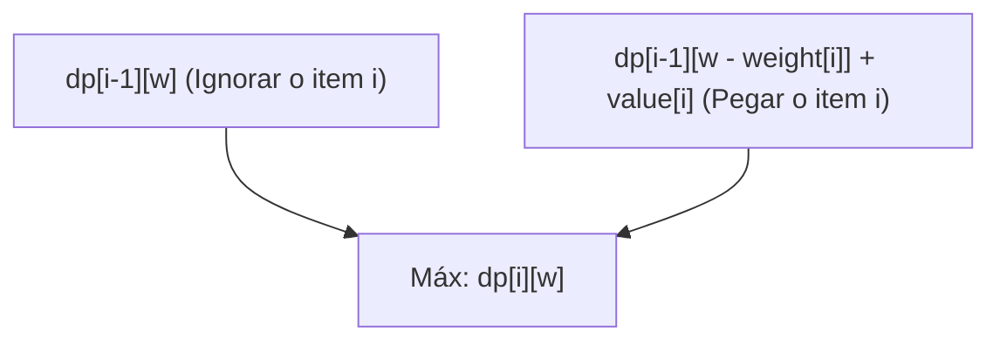
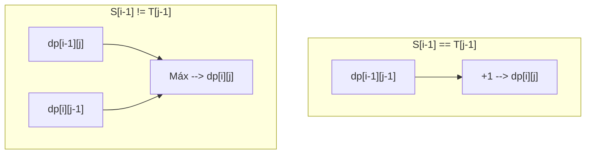

Desde a programação competitiva até o design de algoritmos na prática, a **Programação Dinâmica (Dynamic Programming, conhecida como DP)** aparece em muitas situações e se torna uma barreira para muitos programadores. "Não consigo montar a relação de recorrência", "Os índices dão erro", "Nem sei avaliar se o problema pode ser resolvido com DP"... Muitos de vocês devem ter essas dúvidas.

Neste artigo, cobriremos tudo de forma exaustiva, desde a essência da programação dinâmica, abordagens específicas (top-down e bottom-up), até explicações práticas através de três problemas representativos (Sequência de Fibonacci, Problema da Mochila 0/1, e a Maior Subsequência Comum). Mostraremos exemplos de implementação tanto em C++ quanto em Python e, com o auxílio de fórmulas matemáticas e diagramas, forneceremos o caminho para você "dominá-la completamente". Será um artigo bastante longo, mas, ao terminar de ler até o fim, suas habilidades com algoritmos certamente terão dado um salto.

---

## 1. O que é a Programação Dinâmica (DP)?

A Programação Dinâmica (Dynamic Programming) é uma técnica de design de algoritmos que reduz drasticamente a complexidade computacional dividindo problemas complexos em "subproblemas" menores, registrando e reutilizando as soluções desses subproblemas.

Criada por Richard Bellman na década de 1950, esta técnica demonstra um poder esmagador em problemas de otimização. A palavra "Dinâmica (Dynamic)" não tem um significado especial; há uma anedota de que, na época, ele escolheu "uma palavra que soasse bem" para obter financiamento de pesquisa. No entanto, hoje ela consolidou sua posição como um dos conceitos mais importantes na ciência da computação.

Para que a programação dinâmica seja aplicável, o problema em questão deve satisfazer as **duas propriedades importantes** a seguir.

### 1-1. Sobreposição de Subproblemas (Overlapping Subproblems)

É a propriedade na qual, durante o processo de resolver um problema maior, **os mesmos subproblemas aparecem repetidamente**.

Por exemplo, no cálculo da sequência de Fibonacci que veremos mais adiante, o cálculo de "encontrar o 3º termo" será necessário tanto para encontrar o 5º termo quanto o 4º termo. Se os subproblemas não se sobrepõem (ex: métodos de divisão e conquista, como o Merge Sort), não há vantagem em registrar as soluções e, portanto, não são alvos para a aplicação da DP. É exatamente porque eles se sobrepõem que registrar o resultado calculado uma vez na memória (memoização ou tabulação) e reutilizá-lo permite uma aceleração drástica.

### 1-2. Subestrutura Ótima (Optimal Substructure)

É a propriedade na qual **"a solução ótima para o problema como um todo é composta pelas soluções ótimas de seus subproblemas"**.

O problema do caminho mais curto é um exemplo fácil de entender. Se o caminho mais curto da cidade A para a cidade C passar pela cidade B, o "caminho da cidade A para a cidade B" também deve ser o caminho mais curto de A para B. Se o caminho de A para B não fosse ótimo (o mais curto), otimizá-lo tornaria todo o caminho de A para C ainda mais curto. Essa propriedade de poder deduzir a solução ótima global combinando soluções ótimas parciais forma a base para a transição de estados na programação dinâmica.

---

## 2. Duas Abordagens: Top-down e Bottom-up

Na implementação da programação dinâmica, existem principalmente duas abordagens: "Top-down (recursão com memoização)" e "Bottom-up (tabulação)". O primeiro passo para dominar a DP é entender profundamente as características de cada uma e ser capaz de usá-las de acordo com a situação.

### Abordagem Top-down (Recursão com Memoização / Memoization)

É uma abordagem em que se parte do problema maior e se chama recursivamente os subproblemas necessários para resolvê-los. Nesse momento, as respostas dos subproblemas já calculados são "anotadas (salvas)" em um array ou mapa de hash para que, da próxima vez, o resultado seja retornado da memória sem realizar o cálculo.

- **Vantagens:** 
  - Fácil de implementar seguindo o processo natural de raciocínio (relação de recorrência).
  - Como apenas os subproblemas necessários são calculados, é vantajoso quando apenas uma parte de todo o espaço de estados é acessada.
- **Desvantagens:** 
  - Existe o overhead de chamadas de função devido à recursão.
  - Se a profundidade da recursão for grande, há o risco de estouro de pilha (stack overflow) (exigindo cautela especial em linguagens como Python).

### Abordagem Bottom-up (Tabulação / Tabulation)

É uma abordagem onde se parte do menor subproblema (caso base) e, por meio de estruturas de repetição (loops), as soluções dos problemas progressivamente maiores são preenchidas em uma tabela (array). Finalmente, a solução do problema global que queremos encontrar será armazenada em um local específico da tabela.

- **Vantagens:** 
  - Sem o overhead da recursão, a velocidade de execução é rápida.
  - O acesso à memória tende a ser contínuo, proporcionando boa eficiência de cache (localidade).
  - Facilita a "otimização da complexidade de espaço (reutilização de arrays)", que será discutida mais adiante.
- **Desvantagens:** 
  - Como todos os estados são calculados, pode acabar calculando estados desnecessários.
  - É necessário entender com precisão as dependências da relação de recorrência (ordem topológica) e iterar o loop na ordem correta.

---

## 3. Prática 1: Sequência de Fibonacci

Primeiro, tomaremos a sequência de Fibonacci como o exemplo mais básico e fácil de entender.
A sequência de Fibonacci é definida da seguinte forma:

$$
F(0) = 0, \quad F(1) = 1 \\
F(n) = F(n-1) + F(n-2) \quad (n \ge 2)
$$

### 3-1. Recursão Simples (Explosão da Complexidade Computacional)

O que aconteceria se escrevêssemos uma função recursiva exatamente de acordo com essa definição?

```python
def fib_naive(n):
    if n <= 1:
        return n
    return fib_naive(n-1) + fib_naive(n-2)
```

Essa implementação é intuitiva, mas a complexidade computacional causa uma explosão exponencial de $O(2^n)$. Isso ocorre porque o cálculo para o mesmo argumento é repetido inúmeras vezes. Abaixo está a árvore de recursão para calcular $F(5)$.



Olhando para o diagrama, você pode ver que `"fib(3)"` e `"fib(2)"` são avaliados várias vezes. Isso é a "sobreposição de subproblemas".

### 3-2. Abordagem Top-down (Recursão com Memoização)

Usando um array ou dicionário, salvamos o resultado calculado uma vez. Com isso, a complexidade computacional torna-se $O(n)$.

**Implementação em Python:**
```python
def fib_memo(n, memo=None):
    if memo is None:
        memo = {}
    if n in memo:
        return memo[n]
    if n <= 1:
        return n
    # Calcula e salva na memória
    memo[n] = fib_memo(n-1, memo) + fib_memo(n-2, memo)
    return memo[n]
```

**Implementação em C++:**
```cpp
#include <iostream>
#include <vector>

std::vector<long long> memo;

long long fib_memo(int n) {
    if (n <= 1) return n;
    // Se já foi calculado, retorna da memória
    if (memo[n] != -1) return memo[n];
    
    // Calcula e salva na memória
    return memo[n] = fib_memo(n - 1) + fib_memo(n - 2);
}

int main() {
    int n = 50;
    memo.assign(n + 1, -1);
    std::cout << fib_memo(n) << std::endl;
    return 0;
}
```

### 3-3. Abordagem Bottom-up (Tabulação)

É uma abordagem onde a tabela (array) é preenchida sequencialmente, do menor para o maior. Não há preocupação com o estouro de pilha e a execução é extremamente rápida.

**Implementação em Python:**
```python
def fib_dp(n):
    if n <= 1:
        return n
    dp = [0] * (n + 1)
    dp[1] = 1
    for i in range(2, n + 1):
        dp[i] = dp[i-1] + dp[i-2]
    return dp[n]
```

**Implementação em C++:**
```cpp
#include <iostream>
#include <vector>

long long fib_dp(int n) {
    if (n <= 1) return n;
    std::vector<long long> dp(n + 1, 0);
    dp[1] = 1;
    for (int i = 2; i <= n; ++i) {
        dp[i] = dp[i - 1] + dp[i - 2];
    }
    return dp[n];
}
```

### 3-4. Otimização da Complexidade de Espaço

Observando atentamente a abordagem bottom-up, notamos que, para calcular $dp[i]$, são necessários apenas os dois valores anteriores, $dp[i-1]$ e $dp[i-2]$; valores anteriores a esses não são necessários. Portanto, não há necessidade de manter todo o array na memória, e o cálculo pode avançar usando apenas duas variáveis. Com isso, a complexidade de espaço pode ser reduzida de $O(n)$ para $O(1)$.

**Implementação em Python:**
```python
def fib_optimized(n):
    if n <= 1:
        return n
    prev2, prev1 = 0, 1
    for i in range(2, n + 1):
        current = prev1 + prev2
        prev2 = prev1
        prev1 = current
    return current
```

---

## 4. Prática 2: Problema da Mochila 0/1 (0/1 Knapsack Problem)

Agora é a vez de um autêntico problema de otimização. O problema da mochila 0/1 é conhecido como a porta de entrada para a programação dinâmica.

### 4-1. Configuração do Problema

Há uma mochila com capacidade $W$. Além disso, há $n$ itens, e para cada item $i$ ($1 \le i \le n$), estão definidos um peso $weight[i]$ e um valor $value[i]$.
Ao escolher os itens de modo a não exceder a capacidade da mochila, qual será o valor máximo da soma dos valores obtidos?
(* "0/1" significa que, para cada item, há duas opções: "não escolher (0)" ou "escolher (1)". Os itens não podem ser divididos.)

### 4-2. Definição de Estado e Equação de Transição de Estado

O passo mais importante para resolver a DP é definir adequadamente o "Estado (State)".
Neste problema, dois parâmetros irão mudar: "até qual item foi considerado" e "a capacidade restante da mochila". Assim, definimos o estado da seguinte maneira:

**Definição de Estado:**
$dp[i][w]$ := O valor total máximo obtido quando escolhemos usar apenas os itens do início até o $i$-ésimo item, de forma que o peso total não ultrapasse $w$.

A seguir, pensaremos em como esse estado muda (transição). Ao considerar o $i$-ésimo item, há duas escolhas.
1. **Caso não escolha o $i$-ésimo item:** 
   O valor máximo é igual ao valor máximo obtido satisfazendo a capacidade $w$ com os itens até o $(i-1)$-ésimo.
   Ou seja, $dp[i-1][w]$
2. **Caso escolha o $i$-ésimo item:** 
   O peso deste item é $weight[i]$, portanto, a mochila precisa ter pelo menos um espaço livre igual ou maior que $weight[i]$ ($w \ge weight[i]$). Se for escolhido, o valor obtido aumenta em $value[i]$, mas a capacidade utilizável diminui em $weight[i]$. Portanto, será o valor máximo obtido com os itens até o $(i-1)$-ésimo para a capacidade restante $w - weight[i]$, somado a $value[i]$.
   Ou seja, $dp[i-1][w - weight[i]] + value[i]$

Dessas duas escolhas, basta selecionar aquela cujo valor for maior ($\max$), resultando na seguinte **equação de transição de estado**.

$$
dp[i][w] = 
\begin{cases} 
dp[i-1][w] & \text{if } w < weight[i] \\
\max(dp[i-1][w], dp[i-1][w - weight[i]] + value[i]) & \text{if } w \ge weight[i]
\end{cases}
$$

**Caso Base (Condições Iniciais):**
Quando há 0 itens ($i=0$), ou quando a capacidade é 0 ($w=0$), o valor máximo é 0.
$$ dp[0][w] = 0, \quad dp[i][0] = 0 $$

O diagrama Mermaid a seguir visualiza o conceito da transição de estado.



### 4-3. Implementação Bottom-up (Array 2D)

Vamos transformar essa fórmula matemática diretamente em código.

**Implementação em C++:**
```cpp
#include <iostream>
#include <vector>
#include <algorithm>

int knapsack(int W, const std::vector<int>& weight, const std::vector<int>& value) {
    int n = weight.size();
    // Inicializa um array 2D dp[n+1][W+1] com 0
    std::vector<std::vector<int>> dp(n + 1, std::vector<int>(W + 1, 0));

    // Considera adicionando um item de cada vez
    for (int i = 1; i <= n; ++i) {
        // Calcula para todos os padrões de capacidade
        for (int w = 0; w <= W; ++w) {
            if (w < weight[i - 1]) {
                // Caso não possa escolher por falta de capacidade
                dp[i][w] = dp[i - 1][w];
            } else {
                // Adota o maior entre não escolher e escolher
                dp[i][w] = std::max(dp[i - 1][w], dp[i - 1][w - weight[i - 1]] + value[i - 1]);
            }
        }
    }
    
    return dp[n][W];
}

int main() {
    int W = 50;
    std::vector<int> weight = {10, 20, 30};
    std::vector<int> value = {60, 100, 120};
    std::cout << "Valor Máximo: " << knapsack(W, weight, value) << std::endl;
    return 0;
}
```
*(*Observação: Note que em C++, os índices dos arrays começam em 0, por isso usa-se `weight[i-1]`.)*

### 4-4. Otimização da Complexidade de Espaço (Array 1D)

Ao atualizar o array 2D $dp[i][w]$, nota-se que sempre nos referimos apenas à linha anterior $dp[i-1]$. Este é o mesmo princípio da otimização espacial da sequência de Fibonacci.
Portanto, podemos comprimir o array para um array 1D $dp[w]$. Contudo, é necessário cuidado durante a atualização. O loop da capacidade $w$ deve ser iterado **do maior para o menor (de trás para frente)**. Se atualizarmos da frente para trás, acabaríamos referenciando o "estado do $i$-ésimo item" recém-atualizado dentro da mesma etapa, em vez do "estado do $(i-1)$-ésimo item", e acabaríamos escolhendo o mesmo item várias vezes (esta se tornaria a solução para o "Problema da Mochila Ilimitada").

**Implementação em Python (Array 1D):**
```python
def knapsack_1d(W, weight, value):
    n = len(weight)
    dp = [0] * (W + 1)
    
    for i in range(n):
        # Faz o loop para trás a partir de W
        for w in range(W, weight[i] - 1, -1):
            dp[w] = max(dp[w], dp[w - weight[i]] + value[i])
            
    return dp[W]

W = 50
weight = [10, 20, 30]
value = [60, 100, 120]
print("Valor Máximo:", knapsack_1d(W, weight, value))
```
Com isso, a complexidade de espaço é drasticamente melhorada de $O(nW)$ para $O(W)$. Essa é uma técnica indispensável na prática e na programação competitiva.

---

## 5. Prática 3: Maior Subsequência Comum (LCS: Longest Common Subsequence)

Como um problema clássico de DP lidando com strings, abordaremos a LCS. A LCS é um algoritmo amplamente aplicado no mundo real, como na detecção de diferenças em arquivos (ferramentas diff) e na determinação de similaridade em sequências de DNA.

### 5-1. Configuração do Problema

Duas strings $S$ e $T$ são fornecidas. Das subsequências em comum em ambas (uma string formada apagando 0 ou mais caracteres da string original enquanto se mantém a ordem), encontre o comprimento da subsequência mais longa.

Exemplo: Quando $S = \text{"ABCBDAB"}$ e $T = \text{"BDCABA"}$, a LCS pode ser $\text{"BCBA"}$ ou $\text{"BDAB"}$, e seu comprimento é 4.

### 5-2. Definição de Estado e Equação de Transição de Estado

Deixe os comprimentos das strings serem $m$ e $n$, respectivamente. Neste caso também, os comprimentos dos prefixos (substrings desde o início) para as duas strings servem como estado.

**Definição de Estado:**
$dp[i][j]$ := O comprimento da maior subsequência comum (LCS) entre os primeiros $i$ caracteres da string $S$ e os primeiros $j$ caracteres da string $T$.

Vamos pensar na transição focando no último caractere das strings $S[i-1]$ e $T[j-1]$.
1. **Caso $S[i-1] == T[j-1]$:** 
   Como os últimos caracteres coincidem, esse caractere está, sem dúvida, incluído na LCS. Portanto, será o comprimento da LCS do estado onde ambas as strings são encurtadas em 1 caractere, somado de 1.
   $dp[i][j] = dp[i-1][j-1] + 1$
2. **Caso $S[i-1] \neq T[j-1]$:** 
   Como os últimos caracteres diferem, pelo menos um deles não está incluído na LCS. Adotamos o maior comprimento entre a redução de $S$ em 1 caractere ($dp[i-1][j]$) e a redução de $T$ em 1 caractere ($dp[i][j-1]$).
   $dp[i][j] = \max(dp[i-1][j], dp[i][j-1])$

Resumindo, a equação de transição de estado é a seguinte:

$$
dp[i][j] = 
\begin{cases} 
0 & \text{if } i = 0 \text{ or } j = 0 \\
dp[i-1][j-1] + 1 & \text{if } i > 0, j > 0 \text{ and } S[i-1] = T[j-1] \\
\max(dp[i-1][j], dp[i][j-1]) & \text{if } i > 0, j > 0 \text{ and } S[i-1] \neq T[j-1]
\end{cases}
$$

Representar essa transição com Mermaid fica assim:



### 5-3. Implementação Bottom-up

Isso também pode ser implementado de forma simples usando um array 2D.

**Implementação em Python:**
```python
def longest_common_subsequence(text1: str, text2: str) -> int:
    m, n = len(text1), len(text2)
    # Array 2D preenchido com 0s de tamanho (m+1) por (n+1)
    dp = [[0] * (n + 1) for _ in range(m + 1)]
    
    for i in range(1, m + 1):
        for j in range(1, n + 1):
            if text1[i-1] == text2[j-1]:
                dp[i][j] = dp[i-1][j-1] + 1
            else:
                dp[i][j] = max(dp[i-1][j], dp[i][j-1])
                
    return dp[m][n]

S = "ABCBDAB"
T = "BDCABA"
print("Comprimento da LCS:", longest_common_subsequence(S, T))
```

**Implementação em C++:**
```cpp
#include <iostream>
#include <vector>
#include <string>
#include <algorithm>

int longest_common_subsequence(const std::string& text1, const std::string& text2) {
    int m = text1.size();
    int n = text2.size();
    std::vector<std::vector<int>> dp(m + 1, std::vector<int>(n + 1, 0));
    
    for (int i = 1; i <= m; ++i) {
        for (int j = 1; j <= n; ++j) {
            if (text1[i-1] == text2[j-1]) {
                dp[i][j] = dp[i-1][j-1] + 1;
            } else {
                dp[i][j] = std::max(dp[i-1][j], dp[i][j-1]);
            }
        }
    }
    
    return dp[m][n];
}

int main() {
    std::string S = "ABCBDAB";
    std::string T = "BDCABA";
    std::cout << "Comprimento da LCS: " << longest_common_subsequence(S, T) << std::endl;
    return 0;
}
```

No problema da LCS também, como a atualização usa apenas a linha anterior (`dp[i-1]`) e a linha atual (`dp[i]`), o cálculo pode ser feito se houver um array para apenas duas linhas ($2n$ elementos). Isso é chamado de "Rolling Array" (Array Deslizante). É uma técnica extremamente útil para reduzir drasticamente a complexidade de espaço.

---

## 6. Processo de Pensamento para Dominar a Programação Dinâmica

Até agora, vimos vários problemas, mas ao se deparar com um problema desconhecido de DP, como devemos pensar? Mantenha os seguintes passos sempre em mente.

1. **Esse problema pode ser resolvido com DP? (Verificação de condições)**
   Ao pensar recursivamente, o mesmo estado aparece várias vezes (sobreposição de subproblemas)? Combinar as melhores escolhas levará ao ótimo global (subestrutura ótima)?
2. **Definir o Estado (State)**
   Identifique as variáveis que representam "onde estou agora", "o que resta" e "quais são as restrições até agora". Articular claramente o significado dos índices é a maior defesa para prevenir bugs.
3. **Pensar na Equação de Transição de Estado (Transition)**
   Como mover de um estado para o próximo estado. Quais são as opções. Entre elas, devo pegar o máximo (ou mínimo), ou somá-las? Este é o coração do algoritmo.
4. **Definir os Casos Base (Condições Iniciais)**
   Decida os valores iniciais do array e o ponto de partida do cálculo. Lide corretamente com os casos extremos (edge cases), onde respostas óbvias existem, como 0 itens ou strings de tamanho 0.
5. **Verificar a Ordem de Cálculo (Topological Order)**
   Ao implementar em bottom-up, todos os estados de origem da transição devem ter sido calculados antes de calcular o estado de destino da transição. Preste muita atenção na direção dos loops.

## 7. Conclusão

Neste artigo, explicamos em detalhes a programação dinâmica, desde as teorias básicas até abordagens práticas de implementação e, ainda, problemas representativos de otimização.
- A Programação Dinâmica é uma técnica que reutiliza as soluções de subproblemas explorando relações recursivas.
- **Top-down (memoização)** possui uma implementação intuitiva, enquanto **Bottom-up (tabulação)** é caracterizado por multiplicadores de constantes menores e facilidade na otimização de memória.
- Se a fórmula matemática (equação de transição de estado) puder ser estabelecida corretamente, a implementação se torna muito simples.
- Técnicas para reduzir a complexidade de espaço (conversão de arrays 2D para 1D e arrays deslizantes) são essenciais quando se exige performance a nível profissional.

A Programação Dinâmica pode parecer difícil e complexa no início. No entanto, ao repetir o treinamento de encontrar "definições de estados" e "transições" em diversos problemas, os padrões começarão a se tornar visíveis gradualmente. Embora existam aplicações mais avançadas, como DP em Árvore (Tree DP), DP em Dígitos (Digit DP), DP com Máscara de Bits (Bit DP) e DP em Intervalos (Interval DP), todas elas são baseadas nas fundações que aprendemos desta vez: "sobreposição de subproblemas" e "otimização".

Não tenha pressa, desenhe de fato uma tabela de DP no papel e continue aprofundando o seu entendimento. Quando você se tornar capaz de extrair o verdadeiro poder deste algoritmo, o mundo da programação se expandirá ainda mais.
