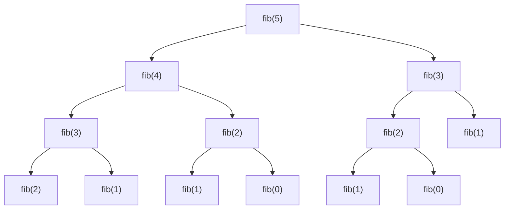
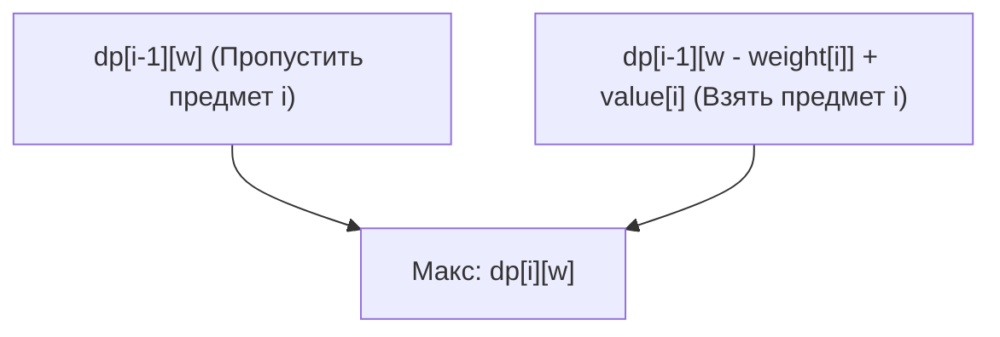
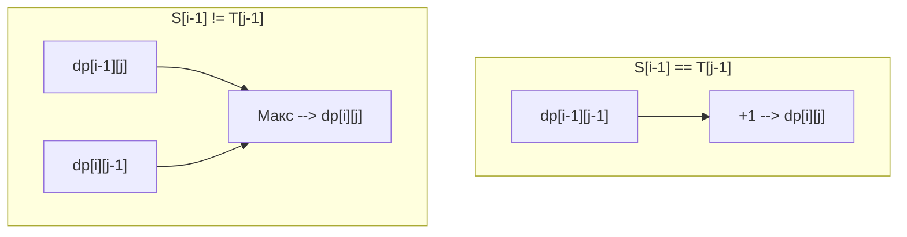

От спортивного программирования до проектирования алгоритмов на практике — **динамическое программирование (Dynamic Programming, сокращенно DP)** появляется во многих ситуациях и часто становится препятствием для многих программистов. «Не могу составить рекуррентное соотношение», «Ошибки с индексами», «Вообще не могу понять, решается ли эта задача с помощью DP»... Наверное, многие сталкивались с подобными проблемами.

В этой статье мы подробно и всесторонне рассмотрим динамическое программирование: от его сути до конкретных подходов (нисходящий/top-down и восходящий/bottom-up), а также практического разбора трех классических задач (числа Фибоначчи, задача о рюкзаке 0/1, наибольшая общая подпоследовательность). Мы приведем примеры реализации на C++ и Python, снабдим их математическими формулами и иллюстрациями, чтобы проложить вам путь к «полному освоению». Это будет очень длинная статья, но когда вы дочитаете ее до конца, ваш навык работы с алгоритмами гарантированно совершит рывок вперед.

---

## 1. Что такое динамическое программирование (DP)?

Динамическое программирование (Dynamic Programming) — это метод проектирования алгоритмов, который кардинально сокращает вычислительную сложность за счет разбиения сложной задачи на более мелкие «подзадачи» с последующим сохранением и повторным использованием их решений.

Этот метод, предложенный Ричардом Беллманом (Richard Bellman) в 1950-х годах, демонстрирует невероятную мощь в задачах оптимизации. Само слово «динамическое» (Dynamic) не несет в себе особого смысла — говорят, что в то время он выбрал «красиво звучащее слово» для получения финансирования на исследования, но сегодня этот метод прочно утвердился как одна из важнейших концепций в информатике.

Для того чтобы можно было применить динамическое программирование, рассматриваемая задача должна обладать следующими **двумя важными свойствами**.

### 1-1. Перекрывающиеся подзадачи (Overlapping Subproblems)

Это свойство заключается в том, что в процессе решения большой задачи **одни и те же подзадачи возникают снова и снова**.

Например, при вычислении чисел Фибоначчи, о которых пойдет речь ниже, расчет «третьего члена» потребуется как при вычислении пятого, так и четвертого члена. Если подзадачи не перекрываются (как, например, в методе «разделяй и властвуй», таком как сортировка слиянием), нет смысла сохранять решения, поэтому DP здесь не применяется. Именно благодаря перекрытию результатов, однажды вычисленных и сохраненных в памяти (через мемоизацию или построение таблицы), становится возможным кардинальное ускорение вычислений за счет их повторного использования.

### 1-2. Оптимальная подструктура (Optimal Substructure)

Свойство, при котором **«оптимальное решение всей задачи строится из оптимальных решений её подзадач»**.

Понятным примером является задача о кратчайшем пути. Если кратчайший путь из города A в город C проходит через город B, то «путь от города A до города B» также должен быть кратчайшим. Если бы путь от A до B не был оптимальным (кратчайшим), его оптимизация позволила бы сделать весь путь от A до C еще короче. Таким образом, свойство, позволяющее комбинировать частичные оптимальные решения для получения общего оптимального решения, является основой переходов состояний в динамическом программировании.

---

## 2. Два подхода: нисходящий (Top-down) и восходящий (Bottom-up)

Реализация динамического программирования в основном делится на два подхода: «нисходящий» (рекурсия с мемоизацией) и «восходящий» (построение таблицы). Глубокое понимание особенностей каждого из них и умение применять их в зависимости от ситуации — это первый шаг к освоению метода.

### Нисходящий подход (Рекурсия с мемоизацией / Memoization)

Этот подход начинает с большой задачи и решает её путем рекурсивного вызова необходимых подзадач. При этом ответы на уже вычисленные подзадачи «запоминаются» (сохраняются) в массиве или хеш-таблице, чтобы при последующих обращениях возвращать результат из памяти без повторных вычислений.

- **Преимущества:** 
  - Легко реализуется, так как следует естественному ходу мыслей (рекуррентным соотношениям).
  - Вычисляются только необходимые подзадачи, что выгодно, когда используется лишь часть всего пространства состояний.
- **Недостатки:** 
  - Присутствуют накладные расходы на вызов функций из-за рекурсии.
  - При большой глубине рекурсии существует риск переполнения стека (особенно в таких языках, как Python, где нужно быть осторожным).

### Восходящий подход (Построение таблицы / Tabulation)

Этот подход начинает с самых маленьких подзадач (базовых случаев) и с помощью циклов последовательно заполняет таблицу (массив) решениями для всё более крупных задач. В конечном итоге решение всей задачи оказывается в определенной ячейке таблицы.

- **Преимущества:** 
  - Нет накладных расходов на рекурсию, высокая скорость выполнения.
  - Обращения к памяти, как правило, последовательны, что обеспечивает хорошую эффективность кеширования (локальность).
  - Легко применима «оптимизация пространственной сложности (переиспользование массивов)», о которой пойдет речь позже.
- **Недостатки:** 
  - Вычисляются все состояния, из-за чего могут быть выполнены ненужные вычисления.
  - Необходимо точно понимать зависимости в рекуррентном соотношении (топологический порядок) и выполнять циклы в правильной последовательности.

---

## 3. Практика 1: Числа Фибоначчи

Для начала рассмотрим самый базовый и понятный пример — числа Фибоначчи.
Последовательность Фибоначчи определяется следующим образом:

$$
F(0) = 0, \quad F(1) = 1 \\
F(n) = F(n-1) + F(n-2) \quad (n \ge 2)
$$

### 3-1. Простая рекурсия (Взрыв вычислительной сложности)

Что будет, если написать рекурсивную функцию точно по этому определению?

```python
def fib_naive(n):
    if n <= 1:
        return n
    return fib_naive(n-1) + fib_naive(n-2)
```

Эта реализация интуитивно понятна, но ее временная сложность составляет $O(2^n)$, что приводит к экспоненциальному взрыву. Это происходит потому, что вычисления для одних и тех же аргументов повторяются много раз. Ниже показано дерево рекурсии при вычислении $F(5)$.



На схеме видно, что `"fib(3)"` и `"fib(2)"` вычисляются несколько раз. Это и есть «перекрывающиеся подзадачи».

### 3-2. Нисходящий подход (Рекурсия с мемоизацией)

Мы можем использовать массив или словарь для сохранения однажды вычисленных результатов. Это снижает временную сложность до $O(n)$.

**Реализация на Python:**
```python
def fib_memo(n, memo=None):
    if memo is None:
        memo = {}
    if n in memo:
        return memo[n]
    if n <= 1:
        return n
    # Вычисляем и сохраняем в memo
    memo[n] = fib_memo(n-1, memo) + fib_memo(n-2, memo)
    return memo[n]
```

**Реализация на C++:**
```cpp
#include <iostream>
#include <vector>

std::vector<long long> memo;

long long fib_memo(int n) {
    if (n <= 1) return n;
    // Если уже вычислено, возвращаем из memo
    if (memo[n] != -1) return memo[n];
    
    // Вычисляем и сохраняем в memo
    return memo[n] = fib_memo(n - 1) + fib_memo(n - 2);
}

int main() {
    int n = 50;
    memo.assign(n + 1, -1);
    std::cout << fib_memo(n) << std::endl;
    return 0;
}
```

### 3-3. Восходящий подход (Построение таблицы)

Подход, при котором массив заполняется последовательно, начиная с наименьших значений. Нет риска переполнения стека, и работает он крайне быстро.

**Реализация на Python:**
```python
def fib_dp(n):
    if n <= 1:
        return n
    dp = [0] * (n + 1)
    dp[1] = 1
    for i in range(2, n + 1):
        dp[i] = dp[i-1] + dp[i-2]
    return dp[n]
```

**Реализация на C++:**
```cpp
#include <iostream>
#include <vector>

long long fib_dp(int n) {
    if (n <= 1) return n;
    std::vector<long long> dp(n + 1, 0);
    dp[1] = 1;
    for (int i = 2; i <= n; ++i) {
        dp[i] = dp[i - 1] + dp[i - 2];
    }
    return dp[n];
}
```

### 3-4. Оптимизация пространственной сложности

Если внимательно присмотреться к восходящему подходу, для вычисления $dp[i]$ необходимы только два последних значения: $dp[i-1]$ и $dp[i-2]$, а предыдущие значения не нужны. Следовательно, нет необходимости хранить весь массив, вычисления можно продолжать, используя всего две переменные. Это позволяет сократить пространственную сложность с $O(n)$ до $O(1)$.

**Реализация на Python:**
```python
def fib_optimized(n):
    if n <= 1:
        return n
    prev2, prev1 = 0, 1
    for i in range(2, n + 1):
        current = prev1 + prev2
        prev2 = prev1
        prev1 = current
    return current
```

---

## 4. Практика 2: Задача о рюкзаке 0/1 (0/1 Knapsack Problem)

Далее нас ждет полноценная задача оптимизации. Задача о рюкзаке 0/1 известна как своеобразный «входной билет» в динамическое программирование.

### 4-1. Постановка задачи

У нас есть рюкзак вместимостью $W$. Также имеется $n$ предметов, для каждого предмета $i$ ($1 \le i \le n$) задан его вес $weight[i]$ и ценность $value[i]$.
Какова максимальная суммарная ценность предметов, которые мы можем выбрать так, чтобы их общий вес не превышал вместимость рюкзака?
(※ «0/1» означает, что для каждого предмета есть только два варианта: «не брать (0)» или «взять (1)». Предметы нельзя делить на части.)

### 4-2. Определение состояния и уравнение перехода

Самый важный шаг для решения с помощью DP — это правильное определение «состояния» (State).
В этой задаче изменяются два параметра: «какие предметы мы уже рассмотрели» и «оставшаяся вместимость рюкзака». Поэтому мы определяем состояние следующим образом.

**Определение состояния:**
$dp[i][w]$ := максимальная суммарная ценность, если использовать только первые $i$ предметов так, чтобы их общий вес не превышал $w$.

Затем мы думаем о том, как изменяется (переходит) это состояние. При рассмотрении $i$-го предмета у нас есть два варианта выбора.
1. **Если не брать $i$-й предмет:** 
   Максимальная ценность будет такой же, как при рассмотрении первых $i-1$ предметов для вместимости $w$.
   То есть $dp[i-1][w]$
2. **Если взять $i$-й предмет:** 
   Вес этого предмета равен $weight[i]$, поэтому в рюкзаке должно быть как минимум $weight[i]$ свободного места ($w \ge weight[i]$). Если мы его возьмем, полученная ценность увеличится на $value[i]$, но доступная вместимость уменьшится на $weight[i]$. Таким образом, это будет максимальная ценность, полученная из первых $i-1$ предметов для оставшейся вместимости $w - weight[i]$, плюс $value[i]$.
   То есть $dp[i-1][w - weight[i]] + value[i]$

Из этих двух вариантов нужно выбрать тот, который дает большую ценность ($\max$), поэтому **уравнение перехода состояний** выглядит следующим образом.

$$
dp[i][w] = 
\begin{cases} 
dp[i-1][w] & \text{if } w < weight[i] \\
\max(dp[i-1][w], dp[i-1][w - weight[i]] + value[i]) & \text{if } w \ge weight[i]
\end{cases}
$$

**Базовый случай (Начальные условия):**
Когда предметов 0 ($i=0$) или вместимость равна 0 ($w=0$), максимальная ценность равна 0.
$$ dp[0][w] = 0, \quad dp[i][0] = 0 $$

Следующая диаграмма Mermaid визуализирует концепцию перехода состояний.



### 4-3. Восходящая реализация (Двумерный массив)

Переведем эту формулу в код.

**Реализация на C++:**
```cpp
#include <iostream>
#include <vector>
#include <algorithm>

int knapsack(int W, const std::vector<int>& weight, const std::vector<int>& value) {
    int n = weight.size();
    // Инициализируем двумерный массив dp[n+1][W+1] нулями
    std::vector<std::vector<int>> dp(n + 1, std::vector<int>(W + 1, 0));

    // Добавляем предметы один за другим
    for (int i = 1; i <= n; ++i) {
        // Вычисляем для всех вариантов вместимости
        for (int w = 0; w <= W; ++w) {
            if (w < weight[i - 1]) {
                // Если не хватает вместимости, чтобы взять предмет
                dp[i][w] = dp[i - 1][w];
            } else {
                // Выбираем максимум между тем, чтобы не брать и брать предмет
                dp[i][w] = std::max(dp[i - 1][w], dp[i - 1][w - weight[i - 1]] + value[i - 1]);
            }
        }
    }
    
    return dp[n][W];
}

int main() {
    int W = 50;
    std::vector<int> weight = {10, 20, 30};
    std::vector<int> value = {60, 100, 120};
    std::cout << "Max Value: " << knapsack(W, weight, value) << std::endl;
    return 0;
}
```
*(※Обратите внимание, что в C++ индексация массивов начинается с 0, поэтому используется `weight[i-1]`.)*

### 4-4. Оптимизация пространственной сложности (Одномерный массив)

При обновлении двумерного массива $dp[i][w]$ можно заметить, что мы всегда обращаемся только к предыдущей строке $dp[i-1]$. Этот же принцип мы использовали для пространственной оптимизации чисел Фибоначчи.
Следовательно, мы можем сжать массив до одномерного $dp[w]$. Однако при обновлении нужно быть осторожным. Цикл по вместимости $w$ необходимо выполнять **от большего к меньшему (с конца в начало)**. Если обновлять с начала, то мы обратимся не к «состоянию $i-1$-го шага», а к только что обновленному «состоянию $i$-го шага» на этой же итерации, что равносильно выбору одного и того же предмета несколько раз (это является решением задачи «о рюкзаке без ограничений по количеству»).

**Реализация на Python (Одномерный массив):**
```python
def knapsack_1d(W, weight, value):
    n = len(weight)
    dp = [0] * (W + 1)
    
    for i in range(n):
        # Цикл от W в обратном порядке
        for w in range(W, weight[i] - 1, -1):
            dp[w] = max(dp[w], dp[w - weight[i]] + value[i])
            
    return dp[W]

W = 50
weight = [10, 20, 30]
value = [60, 100, 120]
print("Max Value:", knapsack_1d(W, weight, value))
```
Благодаря этому пространственная сложность кардинально улучшается с $O(nW)$ до $O(W)$. Это обязательный прием на практике и в спортивном программировании.

---

## 5. Практика 3: Наибольшая общая подпоследовательность (LCS: Longest Common Subsequence)

В качестве классической DP-задачи для работы со строками мы рассмотрим LCS. LCS — это алгоритм, который широко применяется в реальном мире, например, в утилитах для сравнения файлов (инструменты diff) и для определения сходства последовательностей ДНК.

### 5-1. Постановка задачи

Даны две строки $S$ и $T$. Найдите длину самой длинной общей подпоследовательности (строки, полученной путем удаления нуля или более символов из исходной строки с сохранением их порядка), которая присутствует в обеих строках.

Пример: если $S = \text{"ABCBDAB"}$, $T = \text{"BDCABA"}$, то LCS будет $\text{"BCBA"}$ или $\text{"BDAB"}$, и ее длина равна 4.

### 5-2. Определение состояния и уравнение перехода

Пусть длины строк будут $m$ и $n$ соответственно. В этом случае состоянием будет длина префиксов (подстрок от начала) для обеих строк.

**Определение состояния:**
$dp[i][j]$ := длина наибольшей общей подпоследовательности (LCS) между первыми $i$ символами строки $S$ и первыми $j$ символами строки $T$.

Рассмотрим переход, обращая внимание на последние символы строк $S[i-1]$ и $T[j-1]$.
1. **Если $S[i-1] == T[j-1]$:** 
   Так как последние символы совпадают, этот символ обязательно войдет в LCS. Следовательно, это длина LCS для строк, уменьшенных на один символ каждая, плюс 1.
   $dp[i][j] = dp[i-1][j-1] + 1$
2. **Если $S[i-1] \neq T[j-1]$:** 
   Поскольку последние символы различны, по крайней мере один из них не входит в LCS. Мы выбираем максимум между вариантом, где строка $S$ уменьшена на 1 символ ($dp[i-1][j]$), и вариантом, где строка $T$ уменьшена на 1 символ ($dp[i][j-1]$).
   $dp[i][j] = \max(dp[i-1][j], dp[i][j-1])$

В итоге мы получаем следующее уравнение перехода состояний:

$$
dp[i][j] = 
\begin{cases} 
0 & \text{if } i = 0 \text{ or } j = 0 \\
dp[i-1][j-1] + 1 & \text{if } i > 0, j > 0 \text{ and } S[i-1] = T[j-1] \\
\max(dp[i-1][j], dp[i][j-1]) & \text{if } i > 0, j > 0 \text{ and } S[i-1] \neq T[j-1]
\end{cases}
$$

Если визуализировать этот переход с помощью Mermaid, он будет выглядеть следующим образом:



### 5-3. Восходящая реализация

Это также можно просто реализовать с использованием двумерного массива.

**Реализация на Python:**
```python
def longest_common_subsequence(text1: str, text2: str) -> int:
    m, n = len(text1), len(text2)
    # Инициализируем двумерный массив размером (m+1) x (n+1) нулями
    dp = [[0] * (n + 1) for _ in range(m + 1)]
    
    for i in range(1, m + 1):
        for j in range(1, n + 1):
            if text1[i-1] == text2[j-1]:
                dp[i][j] = dp[i-1][j-1] + 1
            else:
                dp[i][j] = max(dp[i-1][j], dp[i][j-1])
                
    return dp[m][n]

S = "ABCBDAB"
T = "BDCABA"
print("LCS Length:", longest_common_subsequence(S, T))
```

**Реализация на C++:**
```cpp
#include <iostream>
#include <vector>
#include <string>
#include <algorithm>

int longest_common_subsequence(const std::string& text1, const std::string& text2) {
    int m = text1.size();
    int n = text2.size();
    std::vector<std::vector<int>> dp(m + 1, std::vector<int>(n + 1, 0));
    
    for (int i = 1; i <= m; ++i) {
        for (int j = 1; j <= n; ++j) {
            if (text1[i-1] == text2[j-1]) {
                dp[i][j] = dp[i-1][j-1] + 1;
            } else {
                dp[i][j] = std::max(dp[i-1][j], dp[i][j-1]);
            }
        }
    }
    
    return dp[m][n];
}

int main() {
    std::string S = "ABCBDAB";
    std::string T = "BDCABA";
    std::cout << "LCS Length: " << longest_common_subsequence(S, T) << std::endl;
    return 0;
}
```

В задаче LCS для обновления используются только предыдущая строка (`dp[i-1]`) и текущая строка (`dp[i]`), поэтому для расчетов достаточно массива на две строки (размером $2n$). Это называется «бегущим массивом» (Rolling Array). Это чрезвычайно полезный метод для кардинального сокращения пространственной сложности.

---

## 6. Процесс мышления для освоения динамического программирования

К настоящему моменту мы рассмотрели различные задачи, но как следует думать, столкнувшись с неизвестной задачей DP? Всегда держите в уме следующие шаги.

1. **Можно ли решить эту задачу с помощью DP? (Проверка условий)**
   Если подумать рекурсивно, будут ли одни и те же состояния повторяться снова и снова? (Перекрывающиеся подзадачи). Можно ли объединить оптимальные выборы для достижения глобального оптимума? (Оптимальная подструктура).
2. **Определение состояния (State)**
   Определите переменные, которые отражают: «Где мы сейчас?», «Что осталось?», «Какие были ограничения?». Ясное словесное описание смысла индексов — лучшая защита от багов.
3. **Составление уравнения перехода состояний (Transition)**
   Как перейти от одного состояния к следующему? Каковы варианты выбора? Нужно ли брать максимум (или минимум) из них, или складывать их? Это «сердце» алгоритма.
4. **Установка начальных условий (Base Case)**
   Определите начальные значения массива или отправную точку для вычислений. Правильно обрабатывайте крайние случаи, для которых существует очевидный ответ, например, 0 предметов, строка нулевой длины и т.д.
5. **Проверка порядка вычислений (Topological Order)**
   При реализации восходящего подхода все состояния-источники переходов должны быть уже вычислены до того, как будет рассчитываться состояние назначения. Обращайте пристальное внимание на направление циклов.

## 7. Заключение

В этой статье мы подробно рассмотрели динамическое программирование, начиная с базовой теории, переходя к конкретным подходам реализации и заканчивая типичными задачами оптимизации.
- Динамическое программирование — это метод повторного использования решений подзадач на основе рекурсивных связей.
- **Нисходящий подход (мемоизация)** отличается интуитивной реализацией, в то время как **восходящий подход (построение таблицы)** имеет меньшую константу времени выполнения и облегчает оптимизацию памяти.
- Если правильно составить математическую формулу (уравнение перехода состояний), реализация становится очень простой.
- Методы сокращения пространственной сложности (одномерные и бегущие массивы) жизненно необходимы, когда требуется высокая производительность на практике.

Поначалу динамическое программирование может показаться сложным для понимания. Однако благодаря тренировкам, в ходе которых вы будете находить «определение состояния» и «переход» в различных задачах, со временем вы начнете видеть закономерности. Существуют и более продвинутые применения, такие как DP на деревьях (Tree DP), DP по цифрам (Digit DP), DP по подмножествам (Bitmask DP), DP на отрезках (Interval DP), но все они строятся на фундаменте «перекрывающихся подзадач» и «оптимизации», изученном нами сегодня.

Не торопитесь: вооружайтесь ручкой и бумагой и рисуйте таблицы DP вручную, чтобы углубить понимание. Когда вы сможете раскрыть истинную мощь алгоритмов, мир программирования станет для вас еще шире!
