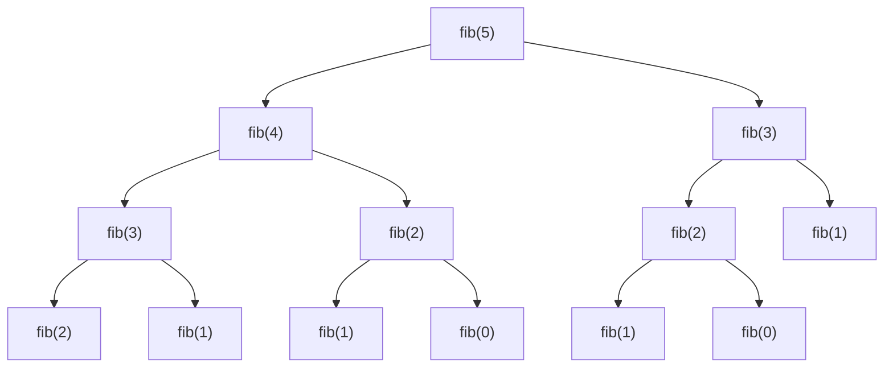
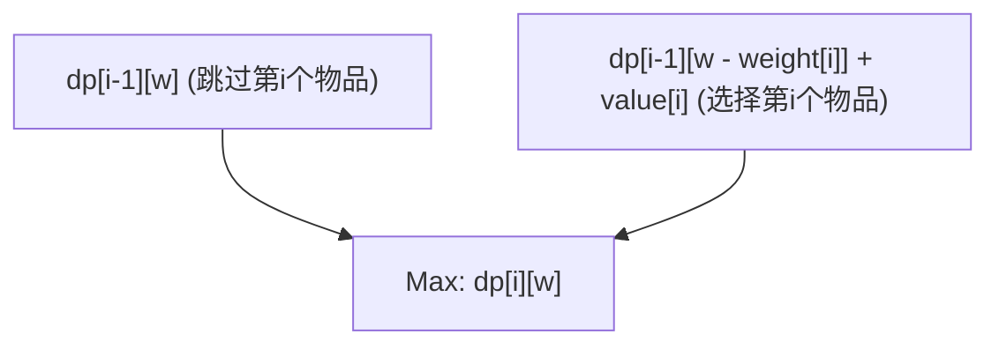
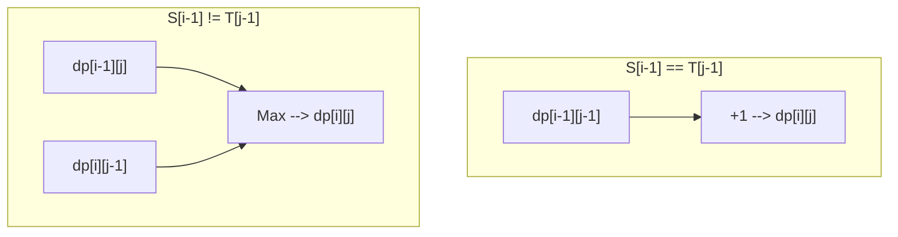

从竞技编程到实际业务的算法设计，在许多场景中出现并成为许多程序员面前的一道墙的，就是**动态规划（Dynamic Programming，简称 DP）**。“列不出状态转移方程”、“下标老写错”、“根本无法判断是不是能用 DP 解决的问题”……很多人都有着这样的烦恼吧。

本文将从动态规划的本质出发，详细介绍具体的方法（自顶向下和自底向上），并通过3个代表性的问题（斐波那契数列、0/1背包问题、最长公共子序列）进行实战讲解，进行彻底且全面的解析。我们将同时给出 C++ 和 Python 的代码实现，并结合公式与图解，为你提供一条“完全掌握”之路。虽然这是一篇非常长的文章，但当你读到最后时，你的算法能力一定会有飞跃性的提升。

---

## 1. 什么是动态规划（DP）？

动态规划（Dynamic Programming）是一种算法设计手法，它将复杂的问题分解为更小的“子问题”，并通过记录和重用这些子问题的解，来大幅降低计算复杂度。

这种方法由理查德·贝尔曼（Richard Bellman）在20世纪50年代提出，在解决最优化问题时能发挥压倒性的威力。虽说“动态（Dynamic）”这个词本身并没有什么特殊的含义，有传闻说当时只是为了获得研究资金而选了一个“好听的词”，但现在它已经在计算机科学中确立了作为最重要概念之一的稳固地位。

要使动态规划成立，目标问题必须满足以下**两个重要性质**。

### 1-1. 重叠子问题 (Overlapping Subproblems)

在求解大问题的过程中，**相同的子问题会多次重复出现**的性质。

例如，在后文提到的斐波那契数列计算中，“求第3项”的计算在求第5项和求第4项时都会被用到。如果子问题不重叠（例如：归并排序等分治法），就没有记录解的意义，因此也就不是 DP 的适用对象。正因为存在重叠，所以将计算过一次的结果保存在内存中（记忆化或制表），再加以重用，才能实现计算速度的剧烈提升。

### 1-2. 最优子结构 (Optimal Substructure)

**“整个问题的最优解，可以由其子问题的最优解构成”**的性质。

最短路径问题是一个容易理解的例子。如果从城市A到城市C的最短路径经过城市B，那么“从城市A到城市B的路径”也必须是A到B的最短路径。因为如果A到B的路径不是最优（最短）的，通过优化它，就能使A到C的整体路径变得更短。这种通过组合局部最优解来推导整体最优解的性质，是动态规划中状态转移的基础。

---

## 2. 两种方法：自顶向下与自底向上

动态规划的实现，大体上可以分为“自顶向下（记忆化递归）”和“自底向上（制表）”两种方法。深入理解各自的特点，并能够根据情况灵活运用，是掌握 DP 的第一步。

### 自顶向下方式（记忆化递归 / Memoization）

从大问题出发，递归地调用并求解所需的子问题的方法。此时，使用数组或哈希表将计算过一次的子问题的答案“记录（保存）”下来，下次再遇到时就不再进行计算，而是直接从记录中返回结果。

- **优点:** 
  - 能够保持自然思考过程（递推公式）来轻松实现。
  - 因为只计算所需的子问题，当只有一部分状态空间被访问时更有利。
- **缺点:** 
  - 存在递归调用带来的函数调用开销。
  - 递归深度过大时，存在栈溢出的风险（特别是在 Python 等语言中需要注意）。

### 自底向上方式（制表 / Tabulation）

从最小的子问题（基础情况）出发，通过循环处理按顺序将大问题的解填入表（数组）中的方法。最终，所求的整体问题的解会存储在表中的特定位置。

- **优点:** 
  - 没有递归带来的开销，执行速度快。
  - 内存访问倾向于连续，缓存效率（局部性）好。
  - 容易进行后文提到的“空间复杂度优化（数组的重复利用）”。
- **缺点:** 
  - 因为要计算所有的状态，结果可能会计算出不需要的状态。
  - 需要准确掌握递推公式的依赖关系（拓扑排序），以正确的顺序进行循环。

---

## 3. 实战篇1：斐波那契数列

首先，我们以最基本、最容易理解的斐波那契数列为例。
斐波那契数列的定义如下：

$$
F(0) = 0, \quad F(1) = 1 \\
F(n) = F(n-1) + F(n-2) \quad (n \ge 2)
$$

### 3-1. 简单的递归（计算量爆炸）

如果按照这个定义直接写递归函数，会发生什么呢？

```python
def fib_naive(n):
    if n <= 1:
        return n
    return fib_naive(n-1) + fib_naive(n-2)
```

这种实现很直观，但是计算量会发生指数级的爆炸，达到 $O(2^n)$。这是因为，对于同一个参数的计算会重复进行多次。以下是求 $F(5)$ 时的递归树。



从图中可以看出，`"fib(3)"` 和 `"fib(2)"` 被求值了多次。这就是“重叠子问题”。

### 3-2. 自顶向下方式（记忆化递归）

使用数组或字典，将计算过一次的结果保存起来。这样一来计算量就降为了 $O(n)$。

**Python 实现:**
```python
def fib_memo(n, memo=None):
    if memo is None:
        memo = {}
    if n in memo:
        return memo[n]
    if n <= 1:
        return n
    # 计算并保存到备忘录中
    memo[n] = fib_memo(n-1, memo) + fib_memo(n-2, memo)
    return memo[n]
```

**C++ 实现:**
```cpp
#include <iostream>
#include <vector>

std::vector<long long> memo;

long long fib_memo(int n) {
    if (n <= 1) return n;
    // 如果已经计算过，则从备忘录返回
    if (memo[n] != -1) return memo[n];
    
    // 计算并保存到备忘录中
    return memo[n] = fib_memo(n - 1) + fib_memo(n - 2);
}

int main() {
    int n = 50;
    memo.assign(n + 1, -1);
    std::cout << fib_memo(n) << std::endl;
    return 0;
}
```

### 3-3. 自底向上方式（制表）

从小到大按顺序填充数组的方法。不用担心栈溢出，运行速度极快。

**Python 实现:**
```python
def fib_dp(n):
    if n <= 1:
        return n
    dp = [0] * (n + 1)
    dp[1] = 1
    for i in range(2, n + 1):
        dp[i] = dp[i-1] + dp[i-2]
    return dp[n]
```

**C++ 实现:**
```cpp
#include <iostream>
#include <vector>

long long fib_dp(int n) {
    if (n <= 1) return n;
    std::vector<long long> dp(n + 1, 0);
    dp[1] = 1;
    for (int i = 2; i <= n; ++i) {
        dp[i] = dp[i - 1] + dp[i - 2];
    }
    return dp[n];
}
```

### 3-4. 空间复杂度优化

如果仔细观察自底向上的方法，会发现为了计算 $dp[i]$，需要的仅仅是最近的两个值 $dp[i-1]$ 和 $dp[i-2]$，在这之前的值都是不需要的。因此，没有必要保留整个数组，只需要使用两个变量就能继续进行计算。通过这种方式，可以将空间复杂度从 $O(n)$ 降到 $O(1)$。

**Python 实现:**
```python
def fib_optimized(n):
    if n <= 1:
        return n
    prev2, prev1 = 0, 1
    for i in range(2, n + 1):
        current = prev1 + prev2
        prev2 = prev1
        prev1 = current
    return current
```

---

## 4. 实战篇2：0/1 背包问题（0/1 Knapsack Problem）

接下来终于要讲真正的最优化问题了。0/1背包问题被称为动态规划的入门经典。

### 4-1. 问题设定

有一个容量为 $W$ 的背包。此外，还有 $n$ 个物品，每个物品 $i$ ($1 \le i \le n$) 都有确定的重量 $weight[i]$ 和价值 $value[i]$。
在不超过背包容量的前提下选择物品，所能获得的总价值的最大值是多少？
（※“0/1”的意思是，对于每个物品，只有“不选(0)”或“选(1)”两种选择。物品不能被分割。）

### 4-2. 状态的定义与状态转移方程

用 DP 解题最重要的一步是正确地定义“状态（State）”。
在这个问题中，有两个参数在变化：“考虑到了第几个物品”和“背包剩余的容量”。因此，像下面这样定义状态：

**状态定义:**
$dp[i][w]$ := 从前 $i$ 个物品中选择，且重量总和不超过 $w$ 时，所能获得的总价值的最大值。

接着，我们考虑这个状态是如何变化（转移）的。当我们考虑第 $i$ 个物品时，有两个选项：
1. **不选第 $i$ 个物品时:** 
   最大价值等于用前 $i-1$ 个物品填满容量 $w$ 时的最大价值。
   即，$dp[i-1][w]$
2. **选择第 $i$ 个物品时:** 
   这个物品的重量是 $weight[i]$，因此背包至少需要有 $weight[i]$ 或以上的剩余容量（$w \ge weight[i]$）。如果选择了它，获得的价值将增加 $value[i]$，但可用容量将减少 $weight[i]$。因此，这等于在剩余容量 $w - weight[i]$ 的情况下，用前 $i-1$ 个物品所能获得的最大价值，加上 $value[i]$。
   即，$dp[i-1][w - weight[i]] + value[i]$

在这两个选项中，选择价值较大的一个（$\max$）即可，所以**状态转移方程**如下所示：

$$
dp[i][w] = 
\begin{cases} 
dp[i-1][w] & \text{if } w < weight[i] \\
\max(dp[i-1][w], dp[i-1][w - weight[i]] + value[i]) & \text{if } w \ge weight[i]
\end{cases}
$$

**基础情况（初始条件）:**
当物品为0个时（$i=0$），或者容量为0时（$w=0$），价值的最大值都是0。
$$ dp[0][w] = 0, \quad dp[i][0] = 0 $$

下面的 Mermaid 图对状态转移的概念进行了可视化。



### 4-3. 自底向上实现（二维数组）

将这个公式直接转换为代码。

**C++ 实现:**
```cpp
#include <iostream>
#include <vector>
#include <algorithm>

int knapsack(int W, const std::vector<int>& weight, const std::vector<int>& value) {
    int n = weight.size();
    // 初始化 dp[n+1][W+1] 的二维数组全为 0
    std::vector<std::vector<int>> dp(n + 1, std::vector<int>(W + 1, 0));

    // 一个一个地考虑增加物品
    for (int i = 1; i <= n; ++i) {
        // 针对所有容量的情况进行计算
        for (int w = 0; w <= W; ++w) {
            if (w < weight[i - 1]) {
                // 因容量不足无法选择的情况
                dp[i][w] = dp[i - 1][w];
            } else {
                // 在选与不选中取较大的那个
                dp[i][w] = std::max(dp[i - 1][w], dp[i - 1][w - weight[i - 1]] + value[i - 1]);
            }
        }
    }
    
    return dp[n][W];
}

int main() {
    int W = 50;
    std::vector<int> weight = {10, 20, 30};
    std::vector<int> value = {60, 100, 120};
    std::cout << "Max Value: " << knapsack(W, weight, value) << std::endl;
    return 0;
}
```
*(※需要注意的是，在 C++ 中数组的索引是从 0 开始的，所以写成了 `weight[i-1]`。)*

### 4-4. 空间复杂度优化（一维数组化）

当我们更新二维数组 $dp[i][w]$ 时，可以发现我们始终只引用了上一行 $dp[i-1]$ 的内容。这与斐波那契数列的空间优化原理是一样的。
因此，我们可以将数组压缩为一维 $dp[w]$。但是，更新时需要注意。我们需要让容量 $w$ **从大到小（从后向前）** 循环。如果从前向后更新，就不是引用“第 $i-1$ 个状态”，而是引用了在当前步骤中刚刚更新的“第 $i$ 个状态”，这会导致同一个物品被多次选择（这样就变成了“完全背包问题”的解法）。

**Python 实现（一维化）:**
```python
def knapsack_1d(W, weight, value):
    n = len(weight)
    dp = [0] * (W + 1)
    
    for i in range(n):
        # 从W开始向后倒序循环
        for w in range(W, weight[i] - 1, -1):
            dp[w] = max(dp[w], dp[w - weight[i]] + value[i])
            
    return dp[W]

W = 50
weight = [10, 20, 30]
value = [60, 100, 120]
print("Max Value:", knapsack_1d(W, weight, value))
```
通过这样做，空间复杂度从 $O(nW)$ 剧减到了 $O(W)$。这在实际业务和竞技编程中是一项必不可少的技巧。

---

## 5. 实战篇3：最长公共子序列（LCS: Longest Common Subsequence）

作为处理字符串的代表性 DP 问题，我们来介绍 LCS。LCS 算法在实际社会中有着广泛的应用，例如文件差异检测（diff工具）以及 DNA 序列的相似度判定等。

### 5-1. 问题设定

给定两个字符串 $S$ 和 $T$。请求出作为这两个字符串的公共子序列（在原字符串中保持顺序，删除0个或多个字符后形成的字符串）中最长的那一个的长度。

示例：当 $S = \text{"ABCBDAB"}$, $T = \text{"BDCABA"}$ 时，LCS是 $\text{"BCBA"}$ 或者 $\text{"BDAB"}$ 等，其长度为 4。

### 5-2. 状态的定义与状态转移方程

设两个字符串的长度分别为 $m, n$。在这个问题中，同样将两个字符串的前缀（从开头起的部分字符串）的长度作为状态。

**状态定义:**
$dp[i][j]$ := 字符串 $S$ 的前 $i$ 个字符和字符串 $T$ 的前 $j$ 个字符之间的最长公共子序列（LCS）的长度。

我们关注字符串的最后一个字符 $S[i-1]$ 和 $T[j-1]$，来考虑如何进行转移。
1. **当 $S[i-1] == T[j-1]$ 时:** 
   由于最后一个字符相等，该字符必然包含在 LCS 中。因此，长度等于将两个字符串各自减去一个字符后的状态的 LCS 长度加 1。
   $dp[i][j] = dp[i-1][j-1] + 1$
2. **当 $S[i-1] \neq T[j-1]$ 时:** 
   因为最后一个字符不同，至少有一个不会包含在 LCS 中。我们比较将 $S$ 减去一个字符的情况（$dp[i-1][j]$）与将 $T$ 减去一个字符的情况（$dp[i][j-1]$），取其中较长的那个。
   $dp[i][j] = \max(dp[i-1][j], dp[i][j-1])$

总结起来，状态转移方程如下所示：

$$
dp[i][j] = 
\begin{cases} 
0 & \text{if } i = 0 \text{ or } j = 0 \\
dp[i-1][j-1] + 1 & \text{if } i > 0, j > 0 \text{ and } S[i-1] = T[j-1] \\
\max(dp[i-1][j], dp[i][j-1]) & \text{if } i > 0, j > 0 \text{ and } S[i-1] \neq T[j-1]
\end{cases}
$$

用 Mermaid 表达这一转移的话如下所示：



### 5-3. 自底向上实现

这个问题也能用二维数组来非常简单地实现。

**Python 实现:**
```python
def longest_common_subsequence(text1: str, text2: str) -> int:
    m, n = len(text1), len(text2)
    # 填充了0的 m+1行 n+1列的二维数组
    dp = [[0] * (n + 1) for _ in range(m + 1)]
    
    for i in range(1, m + 1):
        for j in range(1, n + 1):
            if text1[i-1] == text2[j-1]:
                dp[i][j] = dp[i-1][j-1] + 1
            else:
                dp[i][j] = max(dp[i-1][j], dp[i][j-1])
                
    return dp[m][n]

S = "ABCBDAB"
T = "BDCABA"
print("LCS Length:", longest_common_subsequence(S, T))
```

**C++ 实现:**
```cpp
#include <iostream>
#include <vector>
#include <string>
#include <algorithm>

int longest_common_subsequence(const std::string& text1, const std::string& text2) {
    int m = text1.size();
    int n = text2.size();
    std::vector<std::vector<int>> dp(m + 1, std::vector<int>(n + 1, 0));
    
    for (int i = 1; i <= m; ++i) {
        for (int j = 1; j <= n; ++j) {
            if (text1[i-1] == text2[j-1]) {
                dp[i][j] = dp[i-1][j-1] + 1;
            } else {
                dp[i][j] = std::max(dp[i-1][j], dp[i][j-1]);
            }
        }
    }
    
    return dp[m][n];
}

int main() {
    std::string S = "ABCBDAB";
    std::string T = "BDCABA";
    std::cout << "LCS Length: " << longest_common_subsequence(S, T) << std::endl;
    return 0;
}
```

在 LCS 问题中，由于更新时只使用上一行（`dp[i-1]`）和当前行（`dp[i]`），因此只要有两行大小（元素个数 $2n$）的数组就可以进行计算。这被称为“滚动数组（Rolling Array）”。这是一种能够急剧减少空间复杂度的极其有用的方法。

---

## 6. 掌握动态规划的思考过程

虽然到目前为止我们看过了各种各样的问题，但是当面临未知的 DP 问题时，我们应该如何思考呢？请始终将以下步骤铭记在心。

1. **这个问题能用 DP 解决吗？（确认条件）**
   当递归地思考时，同一个状态是否会多次出现（重叠子问题）。通过组合最佳选择是否能够推导出整体的最佳选择（最优子结构）。
2. **定义状态（State）**
   明确出代表“现在身处何处”、“还剩下什么”、“迄今为止的限制是什么”的变量。将下标的意义明确地语言化，是防止 Bug 出现的最大的防御策略。
3. **思考状态转移方程（Transition）**
   从某个状态移动到下一个状态时该怎么做。有哪些选项。是在这些选项中取最大（或最小）值，还是将它们相加。这是算法的心脏部分。
4. **设置初始条件（Base Case）**
   决定数组的初始值，以及计算的出发点。正确地处理例如 0 个物品、长度为 0 的字符串等存在着平凡答案的边缘情况（Edge Case）。
5. **确认计算顺序（Topological Order）**
   在使用自底向上实现时，在计算转移目标的状态之前，转移起点的状态必须已经全部计算完毕。请对循环的方向多加留心。

## 7. 总结

本文从动态规划的基础理论开始，详细解说了具体的实现方法，甚至是代表性的最优问题。
- 动态规划是指利用递归关系重用子问题的解的手法。
- **自顶向下（记忆化）**具有实现直观的特点，而**自底向上（制表）**具有常数倍开销小、容易进行内存优化的特点。
- 只要能够正确列出公式（状态转移方程），实现起来就会非常简单。
- 当在实际业务中面临对性能有要求的场景时，空间复杂度的优化技巧（将数组一维化或滚动数组）是不可或缺的。

一开始，你可能会觉得动态规划很难理解。但是，通过在各种问题中反复练习寻找“状态定义”和“转移”的过程，你就会逐渐看出其中的规律。树形 DP、数位 DP、状态压缩 DP（位运算 DP）、区间 DP 等等，虽然存在着更加高级的应用，但这些全都建立在本次我们学到的“重叠子问题”和“最优子结构”的基础之上。

不要着急，请一边用纸笔实际写出 DP 表（Table），一边加深理解吧。当你能真正引导出算法的威力之时，编程世界将会变得更加广阔。
